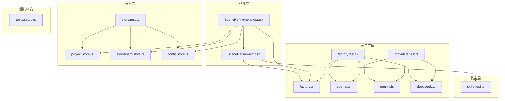
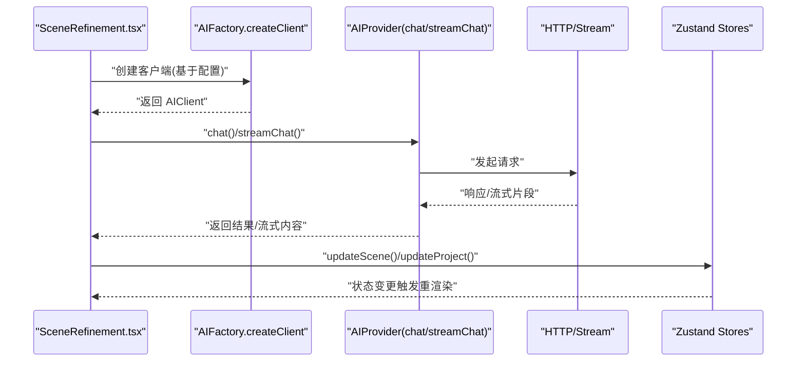
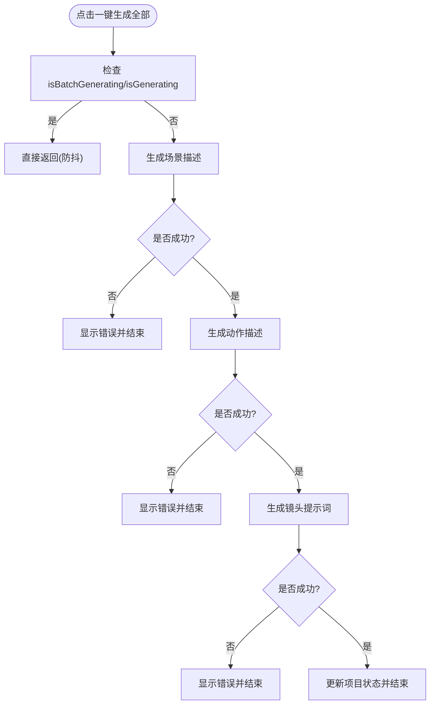
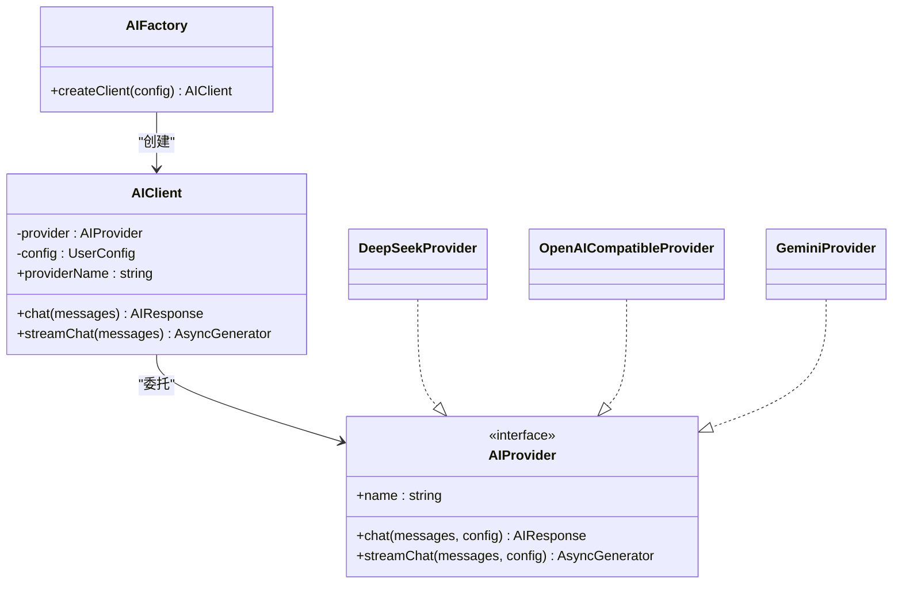
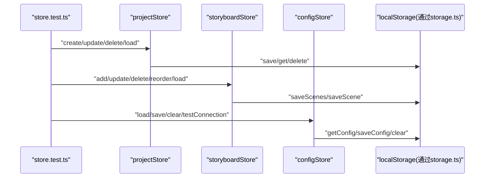
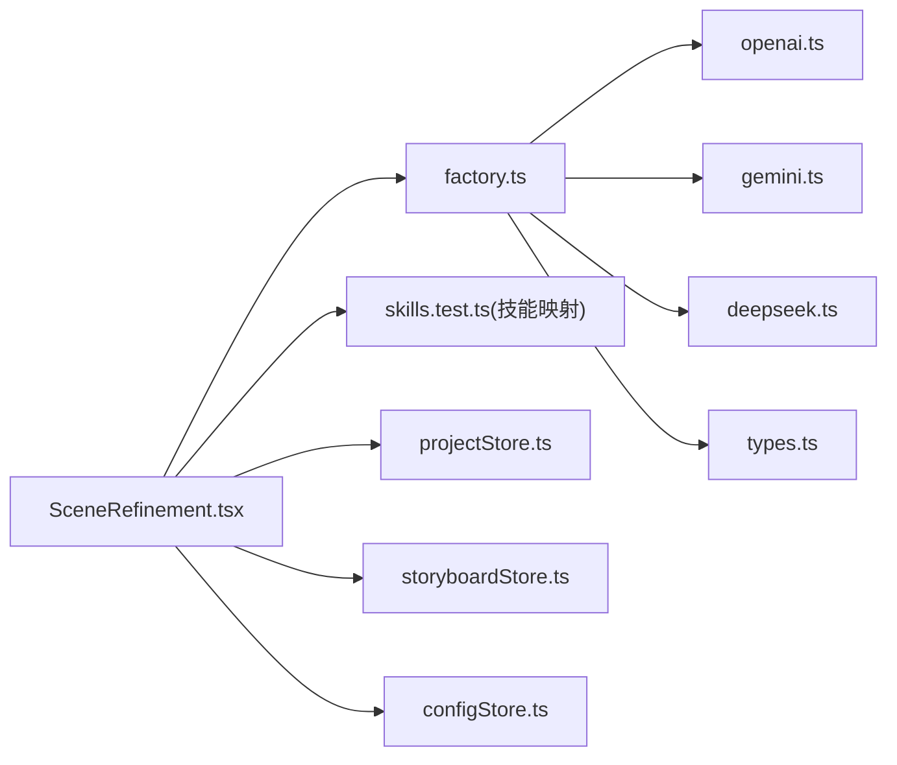

# 单元测试

<cite>
**本文引用的文件**
- [SceneRefinement.tsx](file://manga-creator/src/components/editor/SceneRefinement.tsx)
- [SceneRefinement.test.tsx](file://manga-creator/src/components/editor/SceneRefinement.test.tsx)
- [factory.ts](file://manga-creator/src/lib/ai/factory.ts)
- [factory.test.ts](file://manga-creator/src/lib/ai/factory.test.ts)
- [openai.ts](file://manga-creator/src/lib/ai/providers/openai.ts)
- [gemini.ts](file://manga-creator/src/lib/ai/providers/gemini.ts)
- [deepseek.ts](file://manga-creator/src/lib/ai/providers/deepseek.ts)
- [providers.test.ts](file://manga-creator/src/lib/ai/providers/providers.test.ts)
- [skills.test.ts](file://manga-creator/src/lib/ai/skills.test.ts)
- [types.ts](file://manga-creator/src/lib/ai/types.ts)
- [projectStore.ts](file://manga-creator/src/stores/projectStore.ts)
- [storyboardStore.ts](file://manga-creator/src/stores/storyboardStore.ts)
- [configStore.ts](file://manga-creator/src/stores/configStore.ts)
- [store.test.ts](file://manga-creator/src/stores/store.test.ts)
- [setup.ts](file://manga-creator/src/tests/setup.ts)
</cite>

## 目录
1. [引言](#引言)
2. [项目结构](#项目结构)
3. [核心组件](#核心组件)
4. [架构总览](#架构总览)
5. [详细组件分析](#详细组件分析)
6. [依赖关系分析](#依赖关系分析)
7. [性能考量](#性能考量)
8. [故障排查指南](#故障排查指南)
9. [结论](#结论)
10. [附录](#附录)

## 引言
本文件面向“全面的单元测试体系”，目标是：
- 针对 SceneRefinement 组件，验证一键生成全部流程的完整性、防抖机制、错误状态处理、生成过程中的 UI 状态变更与按钮禁用逻辑。
- 针对 AI 服务工厂模式，验证 createAIProvider 对不同 provider 类型的实例化、createClient 的配置校验、chat/streamChat 的请求结构、响应解析、错误处理与 token 使用量统计。
- 在 store.test.ts 中，全面验证 Zustand 状态管理逻辑，包括 projectStore 的创建/更新/删除/加载、storyboardStore 的分镜增删改查/排序/状态更新、configStore 的配置加载与验证，并确保状态变更同步到 LocalStorage 且触发视图更新。

测试框架采用 Vitest，配合 vi.mock 进行依赖隔离；组件渲染测试采用 @testing-library/react；目标是获得高覆盖率与可维护性。

## 项目结构
围绕测试相关的关键目录与文件：
- 组件层：SceneRefinement.tsx 及其测试 SceneRefinement.test.tsx
- AI 层：factory.ts/factory.test.ts，以及 providers/openai.ts、gemini.ts、deepseek.ts 及 providers.test.ts
- 技能层：skills.test.ts（用于 SceneRefinement 的 prompt 模板构建）
- 状态层：projectStore.ts、storyboardStore.ts、configStore.ts 及 store.test.ts
- 测试环境：tests/setup.ts

图表来源
- [SceneRefinement.tsx](file://manga-creator/src/components/editor/SceneRefinement.tsx#L1-L638)
- [SceneRefinement.test.tsx](file://manga-creator/src/components/editor/SceneRefinement.test.tsx#L1-L353)
- [factory.ts](file://manga-creator/src/lib/ai/factory.ts#L1-L54)
- [factory.test.ts](file://manga-creator/src/lib/ai/factory.test.ts#L1-L595)
- [openai.ts](file://manga-creator/src/lib/ai/providers/openai.ts#L1-L88)
- [gemini.ts](file://manga-creator/src/lib/ai/providers/gemini.ts#L1-L138)
- [deepseek.ts](file://manga-creator/src/lib/ai/providers/deepseek.ts#L1-L110)
- [providers.test.ts](file://manga-creator/src/lib/ai/providers/providers.test.ts#L1-L676)
- [skills.test.ts](file://manga-creator/src/lib/ai/skills.test.ts#L1-L364)
- [projectStore.ts](file://manga-creator/src/stores/projectStore.ts#L1-L95)
- [storyboardStore.ts](file://manga-creator/src/stores/storyboardStore.ts#L1-L107)
- [configStore.ts](file://manga-creator/src/stores/configStore.ts#L1-L58)
- [store.test.ts](file://manga-creator/src/stores/store.test.ts#L1-L971)
- [setup.ts](file://manga-creator/src/tests/setup.ts#L1-L2)

章节来源
- [SceneRefinement.tsx](file://manga-creator/src/components/editor/SceneRefinement.tsx#L1-L638)
- [SceneRefinement.test.tsx](file://manga-creator/src/components/editor/SceneRefinement.test.tsx#L1-L353)
- [factory.ts](file://manga-creator/src/lib/ai/factory.ts#L1-L54)
- [factory.test.ts](file://manga-creator/src/lib/ai/factory.test.ts#L1-L595)
- [openai.ts](file://manga-creator/src/lib/ai/providers/openai.ts#L1-L88)
- [gemini.ts](file://manga-creator/src/lib/ai/providers/gemini.ts#L1-L138)
- [deepseek.ts](file://manga-creator/src/lib/ai/providers/deepseek.ts#L1-L110)
- [providers.test.ts](file://manga-creator/src/lib/ai/providers/providers.test.ts#L1-L676)
- [skills.test.ts](file://manga-creator/src/lib/ai/skills.test.ts#L1-L364)
- [projectStore.ts](file://manga-creator/src/stores/projectStore.ts#L1-L95)
- [storyboardStore.ts](file://manga-creator/src/stores/storyboardStore.ts#L1-L107)
- [configStore.ts](file://manga-creator/src/stores/configStore.ts#L1-L58)
- [store.test.ts](file://manga-creator/src/stores/store.test.ts#L1-L971)
- [setup.ts](file://manga-creator/src/tests/setup.ts#L1-L2)

## 核心组件
- SceneRefinement：提供三阶段生成（场景描述/动作描述/镜头提示词）与一键生成全部流程，内置防抖与 UI 状态控制。
- AIFactory：工厂模式创建 AIProvider，封装 createClient 的配置校验与 AIClient 的 chat/streamChat 调用。
- Providers：DeepSeek、OpenAI 兼容、Gemini 三种实现，分别处理各自 API 的请求结构、流式解析与错误处理。
- Skills：技能注册与模板，供 SceneRefinement 构建 prompt。
- Zustand Stores：projectStore、storyboardStore、configStore，负责项目/分镜/配置的状态管理与持久化。

章节来源
- [SceneRefinement.tsx](file://manga-creator/src/components/editor/SceneRefinement.tsx#L1-L638)
- [factory.ts](file://manga-creator/src/lib/ai/factory.ts#L1-L54)
- [openai.ts](file://manga-creator/src/lib/ai/providers/openai.ts#L1-L88)
- [gemini.ts](file://manga-creator/src/lib/ai/providers/gemini.ts#L1-L138)
- [deepseek.ts](file://manga-creator/src/lib/ai/providers/deepseek.ts#L1-L110)
- [skills.test.ts](file://manga-creator/src/lib/ai/skills.test.ts#L1-L364)
- [projectStore.ts](file://manga-creator/src/stores/projectStore.ts#L1-L95)
- [storyboardStore.ts](file://manga-creator/src/stores/storyboardStore.ts#L1-L107)
- [configStore.ts](file://manga-creator/src/stores/configStore.ts#L1-L58)

## 架构总览
下图展示 SceneRefinement 与 AI 工厂、Providers、Stores 的交互关系与数据流向。

图表来源
- [SceneRefinement.tsx](file://manga-creator/src/components/editor/SceneRefinement.tsx#L1-L638)
- [factory.ts](file://manga-creator/src/lib/ai/factory.ts#L1-L54)
- [openai.ts](file://manga-creator/src/lib/ai/providers/openai.ts#L1-L88)
- [gemini.ts](file://manga-creator/src/lib/ai/providers/gemini.ts#L1-L138)
- [deepseek.ts](file://manga-creator/src/lib/ai/providers/deepseek.ts#L1-L110)
- [projectStore.ts](file://manga-creator/src/stores/projectStore.ts#L1-L95)
- [storyboardStore.ts](file://manga-creator/src/stores/storyboardStore.ts#L1-L107)

## 详细组件分析

### SceneRefinement 组件测试要点
- 一键生成全部流程完整性：按顺序调用场景描述/动作描述/镜头提示词生成，最终更新项目状态。
- 防抖机制：isBatchGenerating 与 isGenerating 防止重复触发；快速点击仅执行一次完整流程。
- 错误状态处理：任一阶段失败应显示错误信息并终止后续流程。
- UI 状态变更：按钮文案与禁用状态随生成阶段变化；进度条与完成标记正确显示。
- 按钮禁用逻辑：当某阶段已完成或处于批量生成中时禁用相应按钮。

图表来源
- [SceneRefinement.tsx](file://manga-creator/src/components/editor/SceneRefinement.tsx#L228-L291)
- [SceneRefinement.test.tsx](file://manga-creator/src/components/editor/SceneRefinement.test.tsx#L159-L352)

章节来源
- [SceneRefinement.tsx](file://manga-creator/src/components/editor/SceneRefinement.tsx#L1-L638)
- [SceneRefinement.test.tsx](file://manga-creator/src/components/editor/SceneRefinement.test.tsx#L1-L353)

### AI 服务工厂模式测试要点
- createAIProvider：根据 provider 类型返回对应 Provider 实例（deepseek/kimi/openai-compatible -> OpenAICompatibleProvider；gemini -> GeminiProvider；deepseek -> DeepSeekProvider），未知类型抛错。
- AIFactory.createClient：校验配置完整性（provider/apiKey/model），否则抛错；成功则返回 AIClient。
- AIClient.chat/streamChat：委托底层 Provider 执行请求与流式解析。
- Provider 层：
  - DeepSeekProvider：chat/streamChat 正确构造请求、解析 usage/tokens、处理错误与无 body 场景。
  - OpenAICompatibleProvider：兼容 OpenAI 协议，支持流式与非流式。
  - GeminiProvider：消息格式转换、SSE 流解析、usageMetadata 解析与错误处理。
- 请求结构与响应解析：验证 header/body 结构、token 使用量解析、错误消息格式。
- 边界情况：空消息、超长消息、特殊字符、emoji、中文、网络错误、429/500 等。

图表来源
- [factory.ts](file://manga-creator/src/lib/ai/factory.ts#L1-L54)
- [types.ts](file://manga-creator/src/lib/ai/types.ts#L1-L15)
- [openai.ts](file://manga-creator/src/lib/ai/providers/openai.ts#L1-L88)
- [gemini.ts](file://manga-creator/src/lib/ai/providers/gemini.ts#L1-L138)
- [deepseek.ts](file://manga-creator/src/lib/ai/providers/deepseek.ts#L1-L110)

章节来源
- [factory.test.ts](file://manga-creator/src/lib/ai/factory.test.ts#L1-L595)
- [providers.test.ts](file://manga-creator/src/lib/ai/providers/providers.test.ts#L1-L676)
- [openai.ts](file://manga-creator/src/lib/ai/providers/openai.ts#L1-L88)
- [gemini.ts](file://manga-creator/src/lib/ai/providers/gemini.ts#L1-L138)
- [deepseek.ts](file://manga-creator/src/lib/ai/providers/deepseek.ts#L1-L110)
- [types.ts](file://manga-creator/src/lib/ai/types.ts#L1-L15)

### Zustand 状态管理测试要点
- projectStore：create/update/delete/load/setCurrentProject，确保写入存储、时间戳更新、currentProject 同步。
- storyboardStore：addScene/setScenes/updateScene/deleteScene/reorderScenes/loadScenes/setCurrentScene/setGenerating，确保场景持久化与重新编号。
- configStore：load/save/clear/testConnection，确保配置加载/保存/清空与连接测试通过。

图表来源
- [store.test.ts](file://manga-creator/src/stores/store.test.ts#L1-L971)
- [projectStore.ts](file://manga-creator/src/stores/projectStore.ts#L1-L95)
- [storyboardStore.ts](file://manga-creator/src/stores/storyboardStore.ts#L1-L107)
- [configStore.ts](file://manga-creator/src/stores/configStore.ts#L1-L58)

章节来源
- [store.test.ts](file://manga-creator/src/stores/store.test.ts#L1-L971)
- [projectStore.ts](file://manga-creator/src/stores/projectStore.ts#L1-L95)
- [storyboardStore.ts](file://manga-creator/src/stores/storyboardStore.ts#L1-L107)
- [configStore.ts](file://manga-creator/src/stores/configStore.ts#L1-L58)

## 依赖关系分析
- SceneRefinement 依赖：
  - AIFactory：创建客户端并调用 chat/streamChat
  - Skills：根据技能名获取 prompt 模板
  - Zustand Stores：读取/更新项目与分镜状态
- AIFactory 依赖：
  - Provider 实现：DeepSeek/Gemini/OpenAI 兼容
  - Types：AIProvider/AIProviderConfig 接口
- Stores 依赖：
  - storage.ts（通过 mock 在测试中注入）

图表来源
- [SceneRefinement.tsx](file://manga-creator/src/components/editor/SceneRefinement.tsx#L1-L638)
- [factory.ts](file://manga-creator/src/lib/ai/factory.ts#L1-L54)
- [openai.ts](file://manga-creator/src/lib/ai/providers/openai.ts#L1-L88)
- [gemini.ts](file://manga-creator/src/lib/ai/providers/gemini.ts#L1-L138)
- [deepseek.ts](file://manga-creator/src/lib/ai/providers/deepseek.ts#L1-L110)
- [types.ts](file://manga-creator/src/lib/ai/types.ts#L1-L15)
- [projectStore.ts](file://manga-creator/src/stores/projectStore.ts#L1-L95)
- [storyboardStore.ts](file://manga-creator/src/stores/storyboardStore.ts#L1-L107)
- [configStore.ts](file://manga-creator/src/stores/configStore.ts#L1-L58)

章节来源
- [SceneRefinement.tsx](file://manga-creator/src/components/editor/SceneRefinement.tsx#L1-L638)
- [factory.ts](file://manga-creator/src/lib/ai/factory.ts#L1-L54)
- [openai.ts](file://manga-creator/src/lib/ai/providers/openai.ts#L1-L88)
- [gemini.ts](file://manga-creator/src/lib/ai/providers/gemini.ts#L1-L138)
- [deepseek.ts](file://manga-creator/src/lib/ai/providers/deepseek.ts#L1-L110)
- [types.ts](file://manga-creator/src/lib/ai/types.ts#L1-L15)
- [projectStore.ts](file://manga-creator/src/stores/projectStore.ts#L1-L95)
- [storyboardStore.ts](file://manga-creator/src/stores/storyboardStore.ts#L1-L107)
- [configStore.ts](file://manga-creator/src/stores/configStore.ts#L1-L58)

## 性能考量
- 测试并发与防抖：SceneRefinement 的一键生成应避免重复触发，减少不必要的网络请求与状态更新。
- 流式响应：Provider 的 streamChat 应逐片消费，避免一次性缓冲大量数据。
- 状态更新批处理：Zustand 的批量更新应合并以减少渲染次数。
- Mock 策略：对 fetch、storage、store 的 mock 应尽量精准，避免过度模拟导致测试脆弱。

## 故障排查指南
- AI 配置校验失败：检查 createClient 的 provider/apiKey/model 是否齐全。
- Provider 错误：关注 401/429/500 等状态码与错误消息格式，确认 baseURL 与认证头正确。
- 流式解析异常：检查 SSE 行解析、跨块数据拼接与空行过滤。
- 状态未持久化：确认 storage 的 save/get/delete 方法在测试中被正确调用。
- 视图未更新：确认 Zustand 状态变更后触发了 rerender，必要时在测试中等待异步状态稳定。

章节来源
- [factory.test.ts](file://manga-creator/src/lib/ai/factory.test.ts#L1-L595)
- [providers.test.ts](file://manga-creator/src/lib/ai/providers/providers.test.ts#L1-L676)
- [store.test.ts](file://manga-creator/src/stores/store.test.ts#L1-L971)

## 结论
通过覆盖 SceneRefinement 的交互流程与状态控制、AI 工厂与 Provider 的请求/响应/错误处理、以及 Zustand Store 的 CRUD 与持久化，本测试体系能够有效保障各模块功能正确性与稳定性。建议持续补充边界与异常场景，保持高覆盖率与可维护性。

## 附录
- 测试运行环境：Vitest + @testing-library/react + jest-dom(vitest)
- 关键测试文件路径：
  - 组件测试：SceneRefinement.test.tsx
  - AI 工厂测试：factory.test.ts
  - Provider 测试：providers.test.ts
  - 技能测试：skills.test.ts
  - 状态测试：store.test.ts
  - 测试环境：tests/setup.ts