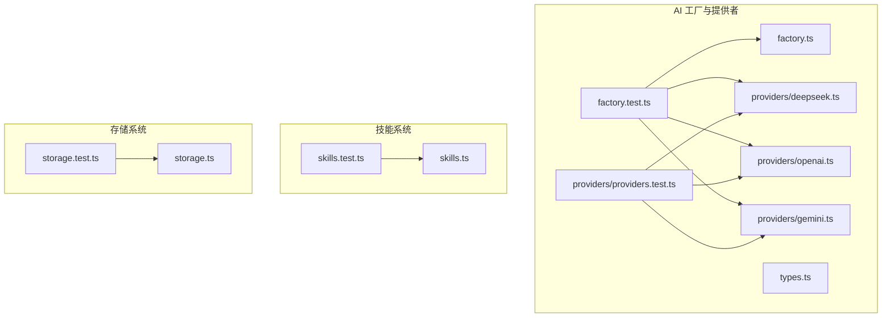
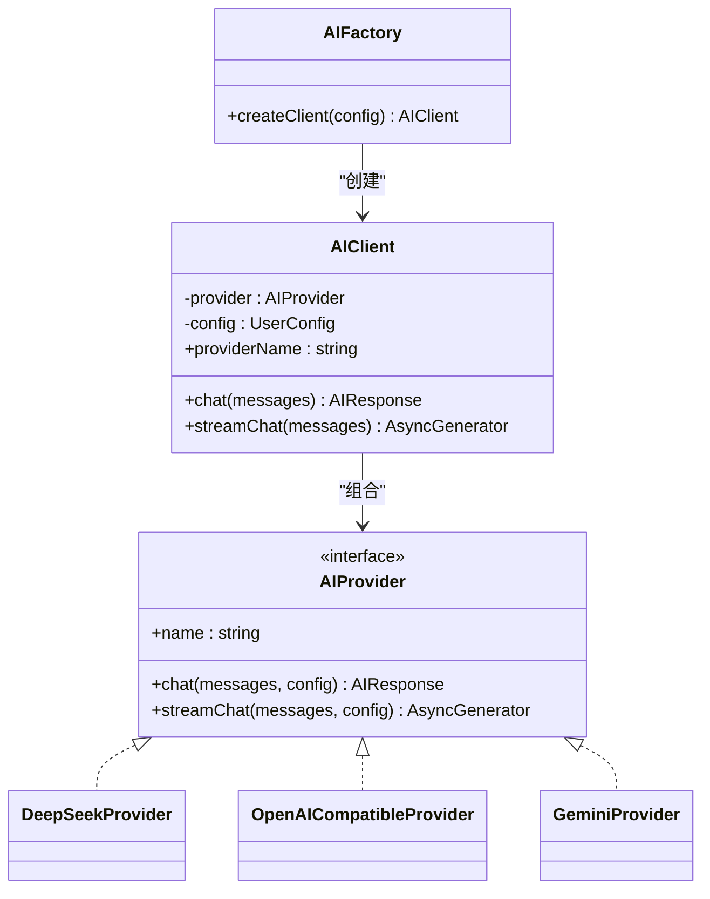
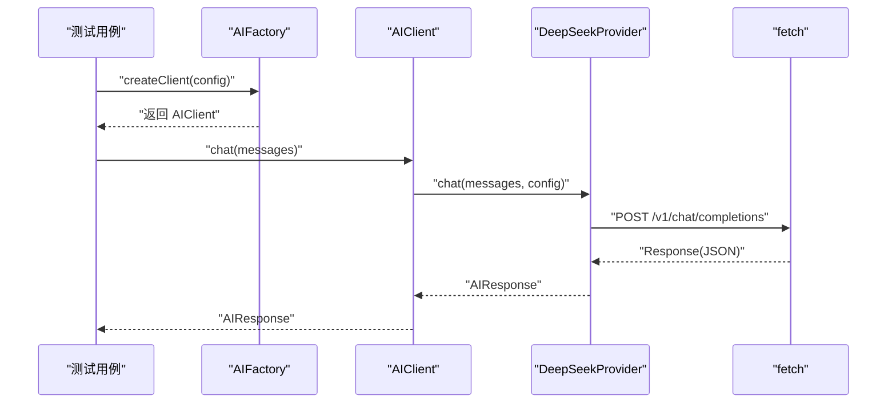
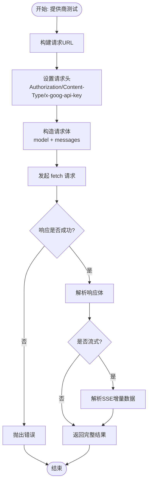
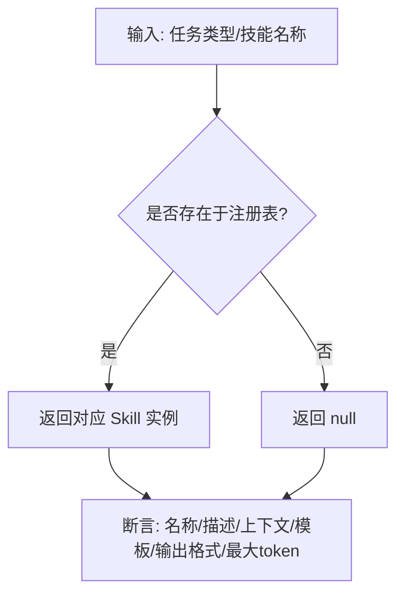
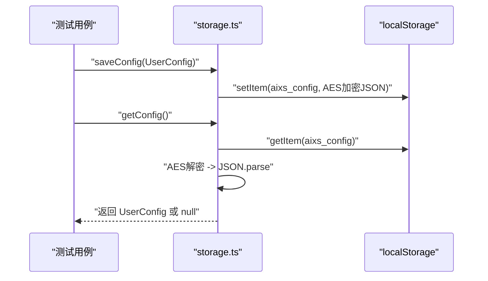
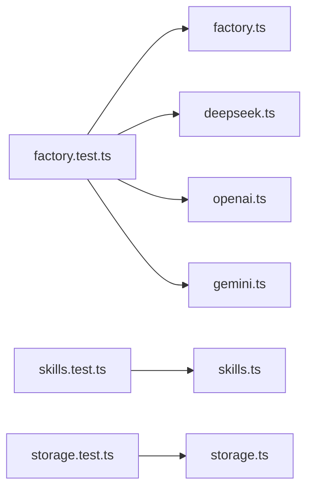

# 服务层单元测试

<cite>
**本文引用的文件**
- [factory.test.ts](file://manga-creator/src/lib/ai/factory.test.ts)
- [providers.test.ts](file://manga-creator/src/lib/ai/providers/providers.test.ts)
- [skills.test.ts](file://manga-creator/src/lib/ai/skills.test.ts)
- [storage.test.ts](file://manga-creator/src/lib/storage.test.ts)
- [factory.ts](file://manga-creator/src/lib/ai/factory.ts)
- [types.ts](file://manga-creator/src/lib/ai/types.ts)
- [deepseek.ts](file://manga-creator/src/lib/ai/providers/deepseek.ts)
- [openai.ts](file://manga-creator/src/lib/ai/providers/openai.ts)
- [gemini.ts](file://manga-creator/src/lib/ai/providers/gemini.ts)
- [skills.ts](file://manga-creator/src/lib/ai/skills.ts)
- [storage.ts](file://manga-creator/src/lib/storage.ts)
</cite>

## 目录
1. [引言](#引言)
2. [项目结构](#项目结构)
3. [核心组件](#核心组件)
4. [架构总览](#架构总览)
5. [详细组件分析](#详细组件分析)
6. [依赖关系分析](#依赖关系分析)
7. [性能考量](#性能考量)
8. [故障排查指南](#故障排查指南)
9. [结论](#结论)
10. [附录](#附录)

## 引言
本文件聚焦于服务层模块的单元测试策略与实现，围绕以下目标展开：
- 深入解析 factory.test.ts 中如何通过 vi.mock 隔离外部依赖，验证 AI 服务工厂模式根据配置正确实例化 DeepSeek、Gemini、OpenAI 等不同提供商，并覆盖 createClient 对 API 密钥、基础 URL、模型参数的校验逻辑。
- 分析 providers.test.ts 中对各 AI 提供商请求构造、响应解析、错误码映射的独立测试。
- 说明 skills.test.ts 中对提示词生成技能逻辑的覆盖率测试。
- 描述 storage.test.ts 中对加密存储、序列化、异常处理的测试用例。
- 总结 mock 实现最佳实践、异步服务调用的 stub 方法，以及如何验证加密与解密流程的完整性。

## 项目结构
服务层测试主要分布在以下文件：
- AI 工厂与提供者：factory.test.ts、providers/providers.test.ts、factory.ts、types.ts、providers/deepseek.ts、providers/openai.ts、providers/gemini.ts
- 技能系统：skills.test.ts、skills.ts
- 存储系统：storage.test.ts、storage.ts

图表来源
- [factory.ts](file://manga-creator/src/lib/ai/factory.ts#L1-L54)
- [types.ts](file://manga-creator/src/lib/ai/types.ts#L1-L15)
- [deepseek.ts](file://manga-creator/src/lib/ai/providers/deepseek.ts#L1-L110)
- [openai.ts](file://manga-creator/src/lib/ai/providers/openai.ts#L1-L88)
- [gemini.ts](file://manga-creator/src/lib/ai/providers/gemini.ts#L1-L138)
- [factory.test.ts](file://manga-creator/src/lib/ai/factory.test.ts#L1-L595)
- [providers/providers.test.ts](file://manga-creator/src/lib/ai/providers/providers.test.ts)
- [skills.ts](file://manga-creator/src/lib/ai/skills.ts#L1-L132)
- [skills.test.ts](file://manga-creator/src/lib/ai/skills.test.ts#L1-L364)
- [storage.ts](file://manga-creator/src/lib/storage.ts#L1-L246)
- [storage.test.ts](file://manga-creator/src/lib/storage.test.ts#L1-L946)

章节来源
- [factory.test.ts](file://manga-creator/src/lib/ai/factory.test.ts#L1-L595)
- [skills.test.ts](file://manga-creator/src/lib/ai/skills.test.ts#L1-L364)
- [storage.test.ts](file://manga-creator/src/lib/storage.test.ts#L1-L946)

## 核心组件
- 工厂与客户端
  - 工厂函数 createAIProvider 根据 ProviderType 返回对应 Provider 实例，覆盖 deepseek、openai-compatible/kimi、gemini 三类。
  - AIFactory.createClient 在构造 AIClient 前进行配置校验（provider、apiKey、model），并注入配置。
- AI 提供者接口与实现
  - AIProvider 定义统一的 chat 与 streamChat 接口。
  - DeepSeekProvider、OpenAICompatibleProvider、GeminiProvider 分别实现不同提供商的请求构建、SSE 解析与错误处理。
- 技能系统
  - 四项技能定义与注册表，提供按任务类型与名称检索的能力。
- 存储系统
  - 基于 localStorage 的加密存储、项目/分镜 CRUD、导入导出、清理与用量统计。

章节来源
- [factory.ts](file://manga-creator/src/lib/ai/factory.ts#L1-L54)
- [types.ts](file://manga-creator/src/lib/ai/types.ts#L1-L15)
- [deepseek.ts](file://manga-creator/src/lib/ai/providers/deepseek.ts#L1-L110)
- [openai.ts](file://manga-creator/src/lib/ai/providers/openai.ts#L1-L88)
- [gemini.ts](file://manga-creator/src/lib/ai/providers/gemini.ts#L1-L138)
- [skills.ts](file://manga-creator/src/lib/ai/skills.ts#L1-L132)
- [storage.ts](file://manga-creator/src/lib/storage.ts#L1-L246)

## 架构总览
下图展示工厂与提供者的交互关系及测试覆盖点。

图表来源
- [factory.ts](file://manga-creator/src/lib/ai/factory.ts#L1-L54)
- [types.ts](file://manga-creator/src/lib/ai/types.ts#L1-L15)
- [deepseek.ts](file://manga-creator/src/lib/ai/providers/deepseek.ts#L1-L110)
- [openai.ts](file://manga-creator/src/lib/ai/providers/openai.ts#L1-L88)
- [gemini.ts](file://manga-creator/src/lib/ai/providers/gemini.ts#L1-L138)

## 详细组件分析

### 工厂与客户端测试策略（factory.test.ts）
- 工厂函数 createAIProvider 的类型到实例映射验证，覆盖 deepseek、openai-compatible、kimi、gemini。
- AIFactory.createClient 的配置校验：provider、apiKey、model 缺失时抛错；完整配置可成功创建客户端并返回 providerName。
- chat 方法的端到端验证：mock fetch 返回标准响应，断言返回内容与 tokenUsage；多消息、空消息、超长消息、特殊字符、emoji、中文等边界场景。
- 错误处理：HTTP 401、500、429 等错误路径；网络异常路径。
- 流式对话 streamChat：mock ReadableStream，断言增量内容拼接；无 body 场景抛错。
- baseURL 参数：断言最终请求 URL 包含自定义域名。
- 请求结构：断言 headers（Content-Type、Authorization）与 body（model、messages）。
- token 使用量：断言 DeepSeek 的 usage 字段解析；OpenAI 兼容提供者无 usage 时返回 undefined。

图表来源
- [factory.test.ts](file://manga-creator/src/lib/ai/factory.test.ts#L1-L595)
- [factory.ts](file://manga-creator/src/lib/ai/factory.ts#L1-L54)
- [deepseek.ts](file://manga-creator/src/lib/ai/providers/deepseek.ts#L1-L110)

章节来源
- [factory.test.ts](file://manga-creator/src/lib/ai/factory.test.ts#L1-L595)
- [factory.ts](file://manga-creator/src/lib/ai/factory.ts#L1-L54)

### AI 提供商独立测试策略（providers.test.ts）
- DeepSeekProvider：验证请求 URL 构造、Authorization 头、Content-Type、消息体结构；SSE 流解析；错误码映射与 throwResponseError。
- OpenAICompatibleProvider：验证通用 OpenAI 兼容接口的请求与响应；SSE 流解析；错误处理。
- GeminiProvider：验证 Gemini 特有的 API 路径、头部（x-goog-api-key）、消息格式转换（contents.parts）、SSE 流解析；错误处理。

图表来源
- [providers/providers.test.ts](file://manga-creator/src/lib/ai/providers/providers.test.ts)
- [deepseek.ts](file://manga-creator/src/lib/ai/providers/deepseek.ts#L1-L110)
- [openai.ts](file://manga-creator/src/lib/ai/providers/openai.ts#L1-L88)
- [gemini.ts](file://manga-creator/src/lib/ai/providers/gemini.ts#L1-L138)

章节来源
- [providers/providers.test.ts](file://manga-creator/src/lib/ai/providers/providers.test.ts)
- [deepseek.ts](file://manga-creator/src/lib/ai/providers/deepseek.ts#L1-L110)
- [openai.ts](file://manga-creator/src/lib/ai/providers/openai.ts#L1-L88)
- [gemini.ts](file://manga-creator/src/lib/ai/providers/gemini.ts#L1-L138)

### 技能系统测试策略（skills.test.ts）
- 技能定义：验证名称、描述、必需上下文、输出格式、maxTokens、promptTemplate 占位符与约束。
- 注册表：验证 SkillRegistry 的键值映射、接口一致性、未知技能返回 null。
- 任务与名称映射：getSkillForTask 与 getSkillByName 的大小写敏感与键名支持。
- 边界与一致性：模板占位符格式一致性、上下文类型有效性、输出格式类型范围、名称唯一性、描述长度约束。

图表来源
- [skills.test.ts](file://manga-creator/src/lib/ai/skills.test.ts#L1-L364)
- [skills.ts](file://manga-creator/src/lib/ai/skills.ts#L1-L132)

章节来源
- [skills.test.ts](file://manga-creator/src/lib/ai/skills.test.ts#L1-L364)
- [skills.ts](file://manga-creator/src/lib/ai/skills.ts#L1-L132)

### 存储系统测试策略（storage.test.ts）
- 加密与解密：验证 encrypt/decrypt 的双向正确性，覆盖空串、特殊字符、中文、emoji、长串与无效数据。
- 初始化与迁移：版本号设置与重复初始化、旧版本迁移日志与版本更新。
- API 配置：保存/读取/清除配置，包含 baseURL；配置损坏时返回 null。
- 项目操作：保存/读取/更新/删除项目；删除项目时联动删除其分镜；项目数据损坏时返回空数组；工作流状态覆盖。
- 分镜操作：保存/读取/更新/批量保存；不同项目分镜隔离；分镜数据损坏时返回空数组；状态覆盖；上下文摘要字段。
- 导入导出：空数据导出；项目与分镜导出；导入数据；无效数据导入抛错；导出再导入一致性校验。
- 清理与维护：clearAllData 只清理 aixs 前缀键并保留版本号；getStorageUsage 仅统计 aixs 前缀数据。
- 边界情况：项目 ID 特殊字符、超长标题等。

图表来源
- [storage.test.ts](file://manga-creator/src/lib/storage.test.ts#L1-L946)
- [storage.ts](file://manga-creator/src/lib/storage.ts#L1-L246)

章节来源
- [storage.test.ts](file://manga-creator/src/lib/storage.test.ts#L1-L946)
- [storage.ts](file://manga-creator/src/lib/storage.ts#L1-L246)

## 依赖关系分析
- 工厂与提供者
  - 工厂依赖 ProviderType 与 UserConfig，返回具体 Provider 实例。
  - Provider 实现依赖 fetch 与各自 API 的 URL/头部/消息体格式。
- 技能系统
  - 注册表以 Map 形式维护技能，提供按任务与名称检索。
- 存储系统
  - 依赖 localStorage 与 CryptoJS 进行加密存储；导出导入基于 JSON 结构。

图表来源
- [factory.test.ts](file://manga-creator/src/lib/ai/factory.test.ts#L1-L595)
- [factory.ts](file://manga-creator/src/lib/ai/factory.ts#L1-L54)
- [deepseek.ts](file://manga-creator/src/lib/ai/providers/deepseek.ts#L1-L110)
- [openai.ts](file://manga-creator/src/lib/ai/providers/openai.ts#L1-L88)
- [gemini.ts](file://manga-creator/src/lib/ai/providers/gemini.ts#L1-L138)
- [skills.test.ts](file://manga-creator/src/lib/ai/skills.test.ts#L1-L364)
- [skills.ts](file://manga-creator/src/lib/ai/skills.ts#L1-L132)
- [storage.test.ts](file://manga-creator/src/lib/storage.test.ts#L1-L946)
- [storage.ts](file://manga-creator/src/lib/storage.ts#L1-L246)

## 性能考量
- 测试中大量使用 vi.spyOn/globalThis.fetch 进行纯内存模拟，避免真实网络开销，提升测试执行速度。
- 流式对话通过手动构造 ReadableStream 的 getReader 返回值，减少外部依赖带来的不确定性。
- 存储测试通过自定义 localStorage 代理，避免真实磁盘 IO，保证测试稳定性与可重复性。

## 故障排查指南
- 工厂与客户端
  - 若 createClient 抛出“AI配置不完整”，检查 provider、apiKey、model 是否齐全且非空。
  - chat/流式接口报错时，优先检查 fetch 的响应状态与 throwResponseError 的错误详情。
- 提供商
  - DeepSeek/Gemini/OpenAI 兼容接口分别验证 Authorization/Headers/x-goog-api-key、消息体结构与 SSE 解析。
  - 无 response.body 时流式接口会抛错，需确保服务端返回可读流。
- 技能系统
  - getSkillForTask/getSkillByName 大小写敏感，确保传入值与注册表键一致。
  - 模板占位符格式不一致会导致提示词生成异常，需核对 promptTemplate。
- 存储系统
  - 配置损坏或解密失败时 getConfig 返回 null，检查加密密钥与数据完整性。
  - 导入失败抛错，确认 JSON 格式与字段完整性。
  - 清理后版本号保留，确保后续迁移逻辑可用。

章节来源
- [factory.test.ts](file://manga-creator/src/lib/ai/factory.test.ts#L1-L595)
- [storage.test.ts](file://manga-creator/src/lib/storage.test.ts#L1-L946)

## 结论
本测试体系通过 vi.mock 隔离外部依赖，全面覆盖工厂模式、提供商接口、技能系统与存储模块的关键路径与边界条件。测试策略强调：
- 明确的配置校验与错误传播
- 精准的请求构造与响应解析
- 完整的加密与序列化流程验证
- 流式与非流式两种调用路径的一致性保障

建议在后续迭代中持续补充：
- 更多提供商的兼容性测试
- 大规模数据下的性能与稳定性测试
- 更细粒度的错误码映射与重试策略验证

## 附录
- mock 最佳实践
  - 使用 vi.spyOn 替换全局 fetch，返回可控的 Response 对象。
  - 对 ReadableStream 使用 getReader 返回值，模拟增量数据与 DONE 标记。
  - 自定义 localStorage 代理，支持 Object.keys 等属性访问。
- 异步服务调用 stub
  - 使用 Promise.resolve/resolveValue 返回成功响应；使用 rejectWithValue 抛出网络异常。
  - 对流式接口，分多次返回增量数据与 DONE，确保消费循环完整。
- 加密与解密验证
  - 使用多种字符集与长度的输入，验证 encrypt/decrypt 的双向一致性。
  - 对无效输入与损坏数据，验证解密返回空字符串或 getConfig 返回 null 的健壮性。