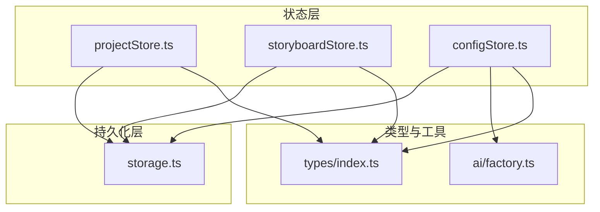
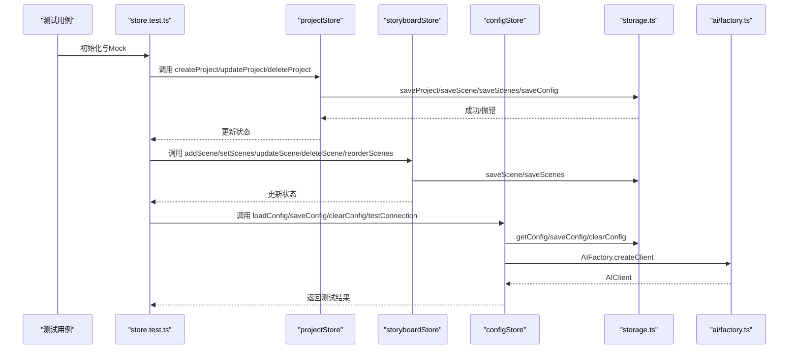
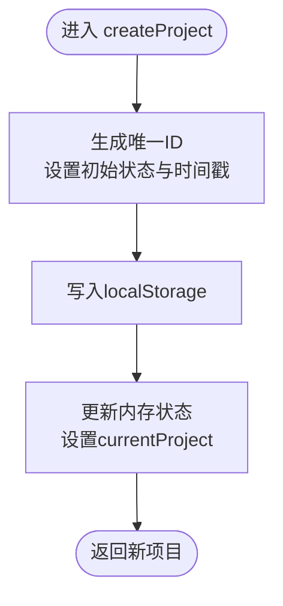
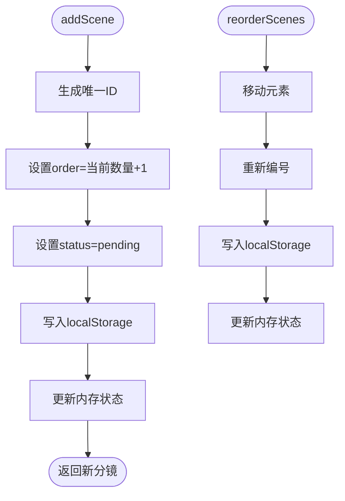
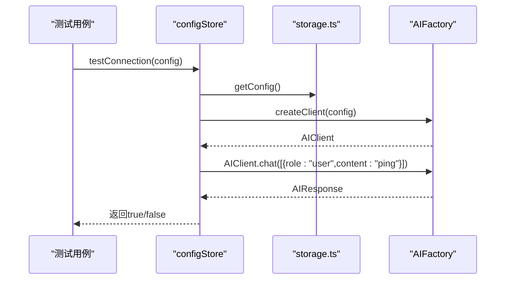
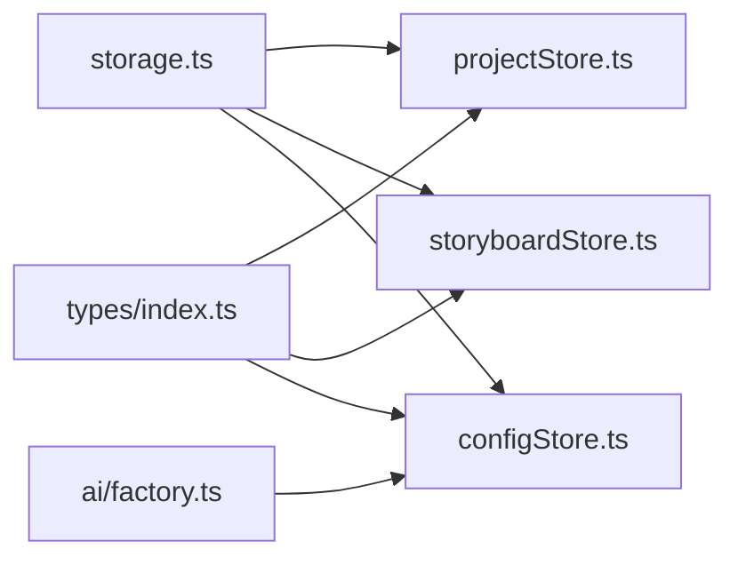

# 状态管理单元测试

<cite>
**本文引用的文件**
- [store.test.ts](file://manga-creator/src/stores/store.test.ts)
- [projectStore.ts](file://manga-creator/src/stores/projectStore.ts)
- [storyboardStore.ts](file://manga-creator/src/stores/storyboardStore.ts)
- [configStore.ts](file://manga-creator/src/stores/configStore.ts)
- [storage.ts](file://manga-creator/src/lib/storage.ts)
- [factory.ts](file://manga-creator/src/lib/ai/factory.ts)
- [index.ts](file://manga-creator/src/types/index.ts)
- [setup.ts](file://manga-creator/src/tests/setup.ts)
</cite>

## 目录
1. [引言](#引言)
2. [项目结构](#项目结构)
3. [核心组件](#核心组件)
4. [架构总览](#架构总览)
5. [详细组件分析](#详细组件分析)
6. [依赖分析](#依赖分析)
7. [性能考虑](#性能考虑)
8. [故障排查指南](#故障排查指南)
9. [结论](#结论)
10. [附录](#附录)

## 引言
本文件围绕基于 Zustand 的状态管理模块，系统讲解如何对以下三个 store 进行单元测试：
- projectStore：项目列表的增删改查与持久化同步
- storyboardStore：分镜数据的生成、排序、状态更新与持久化
- configStore：用户配置的加载、校验与连接测试

文档重点说明：
- 如何通过 create 创建独立 store 实例进行隔离测试
- 如何监听状态变化并断言更新时机
- 如何模拟异常场景（如存储满、加密失败）下的容错行为
- 如何测试异步 action 与持久化中间件的协同工作，确保状态一致性与数据安全

## 项目结构
仓库采用“按功能域划分”的组织方式，状态管理位于 stores 目录，持久化逻辑位于 lib/storage.ts，类型定义位于 types/index.ts，测试入口为 stores/store.test.ts。

图表来源
- [projectStore.ts](file://manga-creator/src/stores/projectStore.ts#L1-L95)
- [storyboardStore.ts](file://manga-creator/src/stores/storyboardStore.ts#L1-L107)
- [configStore.ts](file://manga-creator/src/stores/configStore.ts#L1-L58)
- [storage.ts](file://manga-creator/src/lib/storage.ts#L1-L246)
- [factory.ts](file://manga-creator/src/lib/ai/factory.ts#L1-L54)
- [index.ts](file://manga-creator/src/types/index.ts#L1-L160)

章节来源
- [store.test.ts](file://manga-creator/src/stores/store.test.ts#L1-L120)
- [projectStore.ts](file://manga-creator/src/stores/projectStore.ts#L1-L95)
- [storyboardStore.ts](file://manga-creator/src/stores/storyboardStore.ts#L1-L107)
- [configStore.ts](file://manga-creator/src/stores/configStore.ts#L1-L58)
- [storage.ts](file://manga-creator/src/lib/storage.ts#L1-L246)
- [index.ts](file://manga-creator/src/types/index.ts#L1-L160)

## 核心组件
- projectStore：提供项目列表的加载、创建、更新、删除与当前项目选择等能力，所有变更均同步至 localStorage。
- storyboardStore：提供分镜的新增、批量设置、更新、删除、重排与当前分镜选择等能力，支持自动编号与持久化。
- configStore：提供配置加载、保存、清空与连接测试能力，内部使用 AIFactory 创建客户端并通过加密存储配置。

章节来源
- [projectStore.ts](file://manga-creator/src/stores/projectStore.ts#L1-L95)
- [storyboardStore.ts](file://manga-creator/src/stores/storyboardStore.ts#L1-L107)
- [configStore.ts](file://manga-creator/src/stores/configStore.ts#L1-L58)

## 架构总览
Zustand store 通过 create 创建，内部调用 lib/storage.ts 完成本地持久化；configStore 在连接测试时依赖 AIFactory 动态创建客户端。

图表来源
- [store.test.ts](file://manga-creator/src/stores/store.test.ts#L1-L120)
- [projectStore.ts](file://manga-creator/src/stores/projectStore.ts#L1-L95)
- [storyboardStore.ts](file://manga-creator/src/stores/storyboardStore.ts#L1-L107)
- [configStore.ts](file://manga-creator/src/stores/configStore.ts#L1-L58)
- [storage.ts](file://manga-creator/src/lib/storage.ts#L1-L246)
- [factory.ts](file://manga-creator/src/lib/ai/factory.ts#L1-L54)

## 详细组件分析

### projectStore 测试要点
- 独立实例创建与隔离：在 beforeEach 中 resetModules 并动态 import，避免跨用例污染。
- 增删改查与持久化同步：
  - createProject：生成唯一 ID、设置初始工作流状态与时间戳，写入 localStorage 后更新状态。
  - updateProject：合并更新字段并更新 updatedAt，写回 localStorage，同时更新 currentProject。
  - deleteProject：删除项目并清理对应分镜，若删除的是 currentProject 则置空。
  - loadProjects/loadProject：从 localStorage 读取并设置状态。
- 边界与异常：
  - 更新不存在的项目不应产生副作用。
  - 空标题、超长标题、特殊字符等输入应被接受且不抛错。

图表来源
- [projectStore.ts](file://manga-creator/src/stores/projectStore.ts#L42-L61)
- [storage.ts](file://manga-creator/src/lib/storage.ts#L68-L84)

章节来源
- [store.test.ts](file://manga-creator/src/stores/store.test.ts#L86-L210)
- [projectStore.ts](file://manga-creator/src/stores/projectStore.ts#L1-L95)
- [storage.ts](file://manga-creator/src/lib/storage.ts#L52-L98)

### storyboardStore 测试要点
- 分镜生命周期与持久化：
  - addScene：自动生成 ID、按当前长度+1 设置 order，默认状态为 pending，写入 localStorage。
  - setScenes：重新编号并覆盖持久化，确保顺序连续。
  - updateScene：更新单个分镜并写回，不存在则无操作。
  - deleteScene：删除后重新编号并持久化。
  - reorderScenes：移动后重新编号并持久化。
- 当前分镜与生成状态：
  - setCurrentScene 支持 null。
  - setGenerating 控制 isGenerating 状态。
- 边界与异常：
  - 空列表、大量分镜、单元素重排等边界场景。

图表来源
- [storyboardStore.ts](file://manga-creator/src/stores/storyboardStore.ts#L42-L97)
- [storage.ts](file://manga-creator/src/lib/storage.ts#L104-L145)

章节来源
- [store.test.ts](file://manga-creator/src/stores/store.test.ts#L415-L770)
- [storyboardStore.ts](file://manga-creator/src/stores/storyboardStore.ts#L1-L107)
- [storage.ts](file://manga-creator/src/lib/storage.ts#L104-L145)

### configStore 测试要点
- 配置加载与状态：
  - loadConfig：从 localStorage 解密读取，设置 isConfigured。
  - saveConfig：加密保存并更新状态为已配置。
  - clearConfig：移除配置并重置状态。
- 连接测试：
  - testConnection：通过 AIFactory 创建客户端，发送一条简单消息，返回布尔结果；异常时返回 false 并记录日志。
- 异常与容错：
  - 模拟 AIFactory 抛错，验证返回 false 且控制台输出错误信息。

图表来源
- [configStore.ts](file://manga-creator/src/stores/configStore.ts#L45-L56)
- [storage.ts](file://manga-creator/src/lib/storage.ts#L151-L177)
- [factory.ts](file://manga-creator/src/lib/ai/factory.ts#L44-L53)

章节来源
- [store.test.ts](file://manga-creator/src/stores/store.test.ts#L772-L971)
- [configStore.ts](file://manga-creator/src/stores/configStore.ts#L1-L58)
- [storage.ts](file://manga-creator/src/lib/storage.ts#L151-L177)
- [factory.ts](file://manga-creator/src/lib/ai/factory.ts#L1-L54)

## 依赖分析
- store.test.ts 作为统一测试入口，通过 vi.mock 对 storage.ts 与 AIFactory 进行全局替换，确保测试隔离与可控性。
- projectStore 与 storyboardStore 依赖 storage.ts 的 get/save/delete 方法族；configStore 依赖 storage.ts 的配置读写与 AIFactory 的客户端创建。
- 类型定义由 types/index.ts 提供，确保 store 与 storage 的数据结构一致。

图表来源
- [store.test.ts](file://manga-creator/src/stores/store.test.ts#L1-L120)
- [projectStore.ts](file://manga-creator/src/stores/projectStore.ts#L1-L95)
- [storyboardStore.ts](file://manga-creator/src/stores/storyboardStore.ts#L1-L107)
- [configStore.ts](file://manga-creator/src/stores/configStore.ts#L1-L58)
- [storage.ts](file://manga-creator/src/lib/storage.ts#L1-L246)
- [factory.ts](file://manga-creator/src/lib/ai/factory.ts#L1-L54)
- [index.ts](file://manga-creator/src/types/index.ts#L1-L160)

章节来源
- [store.test.ts](file://manga-creator/src/stores/store.test.ts#L1-L120)
- [projectStore.ts](file://manga-creator/src/stores/projectStore.ts#L1-L95)
- [storyboardStore.ts](file://manga-creator/src/stores/storyboardStore.ts#L1-L107)
- [configStore.ts](file://manga-creator/src/stores/configStore.ts#L1-L58)
- [storage.ts](file://manga-creator/src/lib/storage.ts#L1-L246)
- [factory.ts](file://manga-creator/src/lib/ai/factory.ts#L1-L54)
- [index.ts](file://manga-creator/src/types/index.ts#L1-L160)

## 性能考虑
- 大量分镜场景：setScenes 与 reorderScenes 会触发多次 JSON 序列化与 localStorage 写入，建议在批量操作时减少中间态更新次数，或在业务侧合并多次变更后再持久化。
- 加密开销：configStore 的 saveConfig 使用 AES 加密，频繁保存可能带来 CPU 开销；可通过节流或去抖减少写入频率。
- 状态订阅：store.test.ts 使用 getState() 直接断言状态，避免不必要的渲染开销；在真实组件中建议使用 useXxxStore(selector) 选择性订阅。

## 故障排查指南
- 存储满或写入失败：
  - storage.ts 在保存失败时会抛出错误；在测试中可通过 vi.spyOn 或 vi.mock 捕获错误路径，验证 store 是否正确回退或提示用户。
  - 可在测试中模拟 localStorage.setItem 抛错，验证 store 的异常分支。
- 加密失败：
  - getConfig/saveConfig 包含解密/加密流程，可在测试中模拟 CryptoJS 行为或 localStorage 行为，验证 store 的降级与错误提示。
- 连接测试失败：
  - 通过 vi.mock AIFactory.createClient 抛错，验证 testConnection 返回 false 且控制台输出错误日志。
- 状态未更新：
  - 确认 store 的 action 是否调用了 set 或持久化方法；在测试中使用 vi.spyOn 对 set 与 storage 方法进行断言。

章节来源
- [storage.ts](file://manga-creator/src/lib/storage.ts#L68-L98)
- [storage.ts](file://manga-creator/src/lib/storage.ts#L115-L145)
- [storage.ts](file://manga-creator/src/lib/storage.ts#L151-L177)
- [store.test.ts](file://manga-creator/src/stores/store.test.ts#L835-L867)

## 结论
通过对 projectStore、storyboardStore、configStore 的系统化测试，我们验证了：
- 增删改查与持久化的同步一致性
- 分镜排序与重排的正确性
- 配置加载、保存、清空与连接测试的可用性
- 异常场景下的容错与日志记录

建议在实际开发中：
- 为每个 store 的 action 编写对应的集成测试，覆盖关键路径与异常分支
- 对批量操作进行性能评估，必要时引入批处理与去抖策略
- 对敏感配置进行加密与最小暴露原则，完善错误提示与回退逻辑

## 附录
- 测试初始化与隔离：在 beforeEach 中重置模块与清理 mock，确保每次用例独立运行。
- 类型与数据结构：参考 types/index.ts 的 Project、Scene、UserConfig 等定义，保证 store 与 storage 的数据契约一致。

章节来源
- [store.test.ts](file://manga-creator/src/stores/store.test.ts#L63-L80)
- [index.ts](file://manga-creator/src/types/index.ts#L45-L78)
- [index.ts](file://manga-creator/src/types/index.ts#L88-L93)