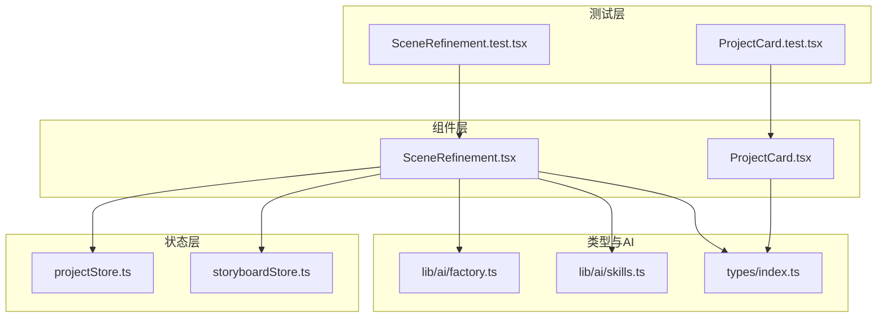
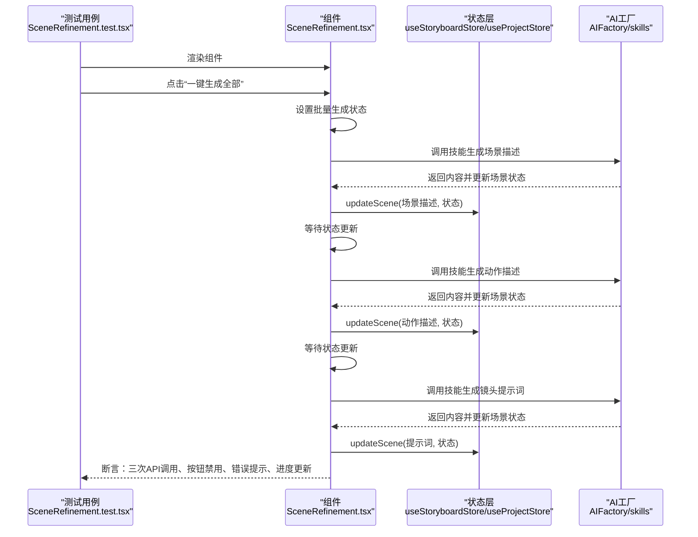
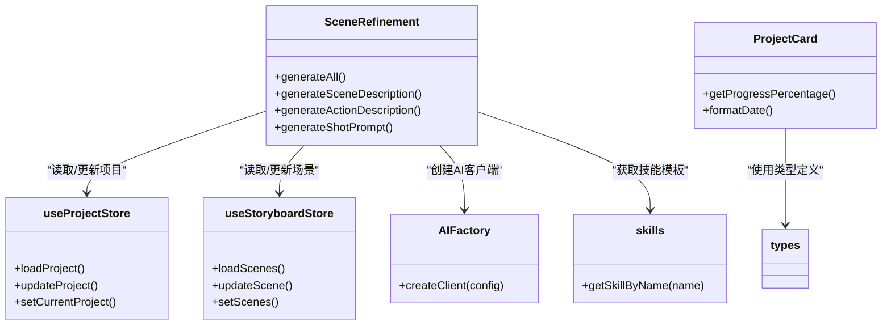

# 组件单元测试

<cite>
**本文引用的文件**
- [SceneRefinement.test.tsx](file://manga-creator/src/components/editor/SceneRefinement.test.tsx)
- [ProjectCard.test.tsx](file://manga-creator/src/components/ProjectCard.test.tsx)
- [SceneRefinement.tsx](file://manga-creator/src/components/editor/SceneRefinement.tsx)
- [ProjectCard.tsx](file://manga-creator/src/components/ProjectCard.tsx)
- [projectStore.ts](file://manga-creator/src/stores/projectStore.ts)
- [storyboardStore.ts](file://manga-creator/src/stores/storyboardStore.ts)
- [index.ts](file://manga-creator/src/types/index.ts)
- [factory.ts](file://manga-creator/src/lib/ai/factory.ts)
- [skills.ts](file://manga-creator/src/lib/ai/skills.ts)
</cite>

## 目录
1. [引言](#引言)
2. [项目结构](#项目结构)
3. [核心组件](#核心组件)
4. [架构总览](#架构总览)
5. [详细组件分析](#详细组件分析)
6. [依赖分析](#依赖分析)
7. [性能考虑](#性能考虑)
8. [故障排查指南](#故障排查指南)
9. [结论](#结论)
10. [附录](#附录)

## 引言
本文件聚焦于项目中UI组件的单元测试实现，重点解析以下两个测试文件：
- SceneRefinement.test.tsx：覆盖“分镜细化”组件的一键生成全流程，包括异步操作模拟、按钮禁用状态控制、加载反馈UI更新以及错误提示处理。
- ProjectCard.test.tsx：覆盖“项目卡片”组件的渲染、交互（点击打开、删除菜单）、进度显示与边界情况。

测试采用@testing-library/react进行组件渲染与用户行为模拟，确保DOM更新与状态变化同步。文档将给出测试用例结构、断言逻辑、异步等待处理、mock函数使用方法，并结合实际代码路径展示如何验证组件行为正确性。同时总结常见测试陷阱与解决方案，提供可复用的测试模式。

## 项目结构
围绕本次分析的相关文件组织如下：
- 组件层：SceneRefinement.tsx、ProjectCard.tsx
- 测试层：SceneRefinement.test.tsx、ProjectCard.test.tsx
- 状态层：projectStore.ts、storyboardStore.ts
- 类型与AI能力：index.ts、factory.ts、skills.ts

图表来源
- [SceneRefinement.test.tsx](file://manga-creator/src/components/editor/SceneRefinement.test.tsx#L1-L353)
- [ProjectCard.test.tsx](file://manga-creator/src/components/ProjectCard.test.tsx#L1-L219)
- [SceneRefinement.tsx](file://manga-creator/src/components/editor/SceneRefinement.tsx#L1-L638)
- [ProjectCard.tsx](file://manga-creator/src/components/ProjectCard.tsx#L1-L110)
- [projectStore.ts](file://manga-creator/src/stores/projectStore.ts#L1-L95)
- [storyboardStore.ts](file://manga-creator/src/stores/storyboardStore.ts#L1-L107)
- [index.ts](file://manga-creator/src/types/index.ts#L1-L351)
- [factory.ts](file://manga-creator/src/lib/ai/factory.ts#L1-L54)
- [skills.ts](file://manga-creator/src/lib/ai/skills.ts#L1-L132)

章节来源
- [SceneRefinement.test.tsx](file://manga-creator/src/components/editor/SceneRefinement.test.tsx#L1-L353)
- [ProjectCard.test.tsx](file://manga-creator/src/components/ProjectCard.test.tsx#L1-L219)

## 核心组件
- 分镜细化组件（SceneRefinement）：提供三阶段生成（场景描述、动作描述、镜头提示词），支持一键生成全部、导航到上/下一个分镜、整体进度展示、错误提示与加载反馈。
- 项目卡片组件（ProjectCard）：展示项目标题、创建时间、风格标签与进度条，提供打开与删除菜单项，支持点击卡片打开项目。

章节来源
- [SceneRefinement.tsx](file://manga-creator/src/components/editor/SceneRefinement.tsx#L1-L638)
- [ProjectCard.tsx](file://manga-creator/src/components/ProjectCard.tsx#L1-L110)

## 架构总览
下面以序列图展示“一键生成全部”的端到端流程，从测试视角验证组件行为与状态更新。

图表来源
- [SceneRefinement.test.tsx](file://manga-creator/src/components/editor/SceneRefinement.test.tsx#L159-L215)
- [SceneRefinement.tsx](file://manga-creator/src/components/editor/SceneRefinement.tsx#L228-L291)
- [storyboardStore.ts](file://manga-creator/src/stores/storyboardStore.ts#L57-L69)
- [projectStore.ts](file://manga-creator/src/stores/projectStore.ts#L63-L81)
- [factory.ts](file://manga-creator/src/lib/ai/factory.ts#L44-L53)
- [skills.ts](file://manga-creator/src/lib/ai/skills.ts#L120-L132)

## 详细组件分析

### 分镜细化组件测试（SceneRefinement.test.tsx）
该测试文件围绕“一键生成全部”流程展开，覆盖异步模拟、状态更新、按钮禁用、加载反馈与错误提示。

- 测试用例结构
  - 基础mock：对项目、场景板、配置、AI工厂与技能进行mock，确保测试隔离与可控。
  - beforeEach：初始化场景状态，注入mock的updateScene与updateProject，模拟store行为。
  - afterEach：清理所有mock，避免跨用例污染。
  - describe分组：按功能点划分多个it用例，便于定位问题与维护。

- 关键断言与异步等待
  - 成功流程：断言AI聊天函数被调用且按顺序更新场景字段与状态；通过waitFor等待调用次数满足预期。
  - 防重复点击：快速连续点击，断言仅执行一次完整流程（三次API调用）。
  - 错误处理：某阶段抛错，断言错误信息出现。
  - 加载反馈：断言按钮文案切换为“批量生成中...”，且按钮处于disabled状态。
  - 完成态禁用：当场景状态为completed时，一键生成按钮应被禁用。
  - 状态一致性：断言通过useStoryboardStore.getState获取最新场景状态，确保测试读取的是最新值。

- mock函数使用方法
  - vi.mock用于替换外部依赖（store、AI工厂、技能模块），避免真实网络请求与副作用。
  - vi.fn用于构造mock回调，如mockChatFn返回不同结果或抛错，以模拟多阶段生成。
  - useStoryboardStore.getState作为store快照读取接口，在批量生成中用于获取最新场景数据。

- 常见测试陷阱与解决方案
  - 状态延迟更新：组件内部在每次生成后添加短暂延迟以确保状态落盘，测试中通过waitFor等待断言成立，避免竞态。
  - 事件冒泡干扰：组件内菜单触发时使用stopPropagation，测试中通过findByRole精确匹配菜单项，避免误触其他元素。
  - 并发点击：通过防重复标志位isBatchGenerating与isGenerating，测试中快速点击验证防重逻辑。
  - 错误传播：catch块设置错误状态，测试通过查询错误文案断言UI反馈。

- 可复用测试模式
  - 统一mock策略：在beforeEach集中mock依赖，减少重复setup。
  - 分阶段断言：将多阶段生成拆分为多次断言，便于定位失败阶段。
  - 等待策略：优先使用waitFor包裹断言，必要时配合findByX查询动态元素。
  - 状态快照：批量生成中显式调用getState读取最新场景，保证断言准确性。

章节来源
- [SceneRefinement.test.tsx](file://manga-creator/src/components/editor/SceneRefinement.test.tsx#L1-L353)
- [SceneRefinement.tsx](file://manga-creator/src/components/editor/SceneRefinement.tsx#L228-L291)
- [storyboardStore.ts](file://manga-creator/src/stores/storyboardStore.ts#L57-L69)
- [projectStore.ts](file://manga-creator/src/stores/projectStore.ts#L63-L81)
- [factory.ts](file://manga-creator/src/lib/ai/factory.ts#L44-L53)
- [skills.ts](file://manga-creator/src/lib/ai/skills.ts#L120-L132)

### 项目卡片组件测试（ProjectCard.test.tsx）
该测试文件覆盖项目卡片的基本渲染、进度显示、交互行为与边界情况。

- 测试用例结构
  - 基本渲染：断言标题、风格、创建日期等基础信息正确渲染。
  - 进度显示：基于工作流状态映射到固定百分比，逐一断言。
  - 交互：点击卡片触发打开回调；打开下拉菜单后点击“打开项目/删除项目”分别断言对应回调。
  - 边界情况：长标题、特殊字符、中文、emoji等输入场景下的渲染稳定性。

- 断言逻辑
  - 文本断言：使用getByText匹配期望文案。
  - 回调断言：使用toHaveBeenCalledWith断言传入参数是否符合预期。
  - 事件断言：通过userEvent模拟点击，确保事件冒泡被正确阻止（下拉菜单触发处使用stopPropagation）。

- 异步等待处理
  - 下拉菜单项使用findByText等待动态渲染，避免因异步渲染导致的断言失败。

- mock函数使用方法
  - 使用vi.fn创建onOpen与onDelete回调mock，断言其被调用且参数正确。

- 常见测试陷阱与解决方案
  - 事件冒泡：下拉菜单触发时调用stopPropagation，测试中先点击菜单按钮，再点击菜单项，避免误触发卡片点击。
  - 文本截断：长标题与特殊字符场景下，断言存在即可，无需强求完全一致的渲染细节。
  - 中文与emoji：断言文本存在即可，确保国际化与表情符号渲染无异常。

- 可复用测试模式
  - 参数化测试：进度映射使用数组驱动，遍历用例，减少重复代码。
  - 统一mock：在beforeEach中清空所有mock，避免跨用例相互影响。
  - 交互测试：先打开菜单，再点击具体选项，确保事件链路完整。

章节来源
- [ProjectCard.test.tsx](file://manga-creator/src/components/ProjectCard.test.tsx#L1-L219)
- [ProjectCard.tsx](file://manga-creator/src/components/ProjectCard.tsx#L1-L110)
- [index.ts](file://manga-creator/src/types/index.ts#L1-L351)

## 依赖分析
- 组件与状态层
  - SceneRefinement依赖projectStore与storyboardStore，负责读取当前项目与场景列表、更新场景与项目状态。
  - ProjectCard依赖Project类型与工作流状态映射，计算进度百分比并渲染UI。

- 组件与AI层
  - SceneRefinement通过AIFactory创建客户端，使用skills模块提供的技能模板进行三阶段生成。
  - 测试中对AIFactory与skills进行mock，确保生成流程可控。

- 组件与类型层
  - types/index.ts定义了WorkflowState、SceneStatus、SceneStep等类型，测试中通过这些类型确保状态流转与断言一致。

图表来源
- [SceneRefinement.tsx](file://manga-creator/src/components/editor/SceneRefinement.tsx#L1-L638)
- [ProjectCard.tsx](file://manga-creator/src/components/ProjectCard.tsx#L1-L110)
- [projectStore.ts](file://manga-creator/src/stores/projectStore.ts#L1-L95)
- [storyboardStore.ts](file://manga-creator/src/stores/storyboardStore.ts#L1-L107)
- [factory.ts](file://manga-creator/src/lib/ai/factory.ts#L44-L53)
- [skills.ts](file://manga-creator/src/lib/ai/skills.ts#L120-L132)
- [index.ts](file://manga-creator/src/types/index.ts#L1-L351)

## 性能考虑
- 测试并发与等待
  - 对于异步生成流程，使用waitFor与合理的超时配置，避免过长等待影响CI速度。
  - 在批量生成中，组件内部添加微小延迟以确保状态更新，测试中通过waitFor等待断言成立，避免竞态。

- Mock粒度与成本
  - 将store与AI工厂统一mock，减少真实I/O与网络请求，提升测试稳定性与速度。
  - 对于复杂UI交互，优先使用@testing-library/react的findByX查询动态元素，避免过度轮询。

- 断言策略
  - 将多阶段生成拆分为多次断言，便于快速定位失败阶段，减少调试成本。

## 故障排查指南
- 症状：断言失败但UI看起来正确
  - 排查：确认是否遗漏waitFor或超时过短；检查是否有异步状态更新未完成。
  - 解决：增加waitFor包裹断言，适当延长超时时间。

- 症状：重复点击导致多次生成
  - 排查：确认组件是否设置了防重复标志位（isBatchGenerating/isGenerating）。
  - 解决：在测试中快速连续点击，断言仅执行一次完整流程。

- 症状：菜单项点击无效
  - 排查：确认下拉菜单触发处是否调用stopPropagation；测试中先点击菜单按钮，再点击菜单项。
  - 解决：使用findByText等待菜单项渲染后再点击。

- 症状：错误提示未出现
  - 排查：确认AI聊天函数在某阶段抛错；组件是否设置错误状态。
  - 解决：在测试中mockRejectedValue，断言错误文案存在。

- 症状：按钮禁用状态不符合预期
  - 排查：确认组件在生成过程中的禁用逻辑与完成态判断。
  - 解决：在测试中断言按钮disabled属性与文案变化。

章节来源
- [SceneRefinement.test.tsx](file://manga-creator/src/components/editor/SceneRefinement.test.tsx#L217-L317)
- [ProjectCard.test.tsx](file://manga-creator/src/components/ProjectCard.test.tsx#L110-L165)

## 结论
通过对SceneRefinement与ProjectCard的单元测试分析，可以看出：
- 测试用例围绕关键业务流程设计，覆盖异步、状态、交互与错误处理。
- 通过集中mock与waitFor等待策略，确保测试稳定可靠。
- 常见测试陷阱（状态延迟、事件冒泡、并发点击）均有明确的规避方案。
- 可复用的测试模式（参数化、统一mock、分阶段断言）有助于提升测试效率与可维护性。

## 附录
- 代码片段路径示例（不直接展示代码内容）
  - 一键生成全部流程入口：[generateAll](file://manga-creator/src/components/editor/SceneRefinement.tsx#L228-L291)
  - 场景描述生成：[generateSceneDescription](file://manga-creator/src/components/editor/SceneRefinement.tsx#L51-L100)
  - 动作描述生成：[generateActionDescription](file://manga-creator/src/components/editor/SceneRefinement.tsx#L103-L149)
  - 镜头提示词生成：[generateShotPrompt](file://manga-creator/src/components/editor/SceneRefinement.tsx#L152-L207)
  - 项目卡片进度映射：[getProgressPercentage](file://manga-creator/src/components/ProjectCard.tsx#L19-L40)
  - 项目卡片打开/删除交互：[onOpen/onDelete](file://manga-creator/src/components/ProjectCard.tsx#L52-L83)
  - 场景状态更新（store）：[updateScene](file://manga-creator/src/stores/storyboardStore.ts#L57-L69)
  - 项目状态更新（store）：[updateProject](file://manga-creator/src/stores/projectStore.ts#L63-L81)
  - AI工厂创建客户端：[AIFactory.createClient](file://manga-creator/src/lib/ai/factory.ts#L44-L53)
  - 技能模板获取：[getSkillByName](file://manga-creator/src/lib/ai/skills.ts#L120-L132)