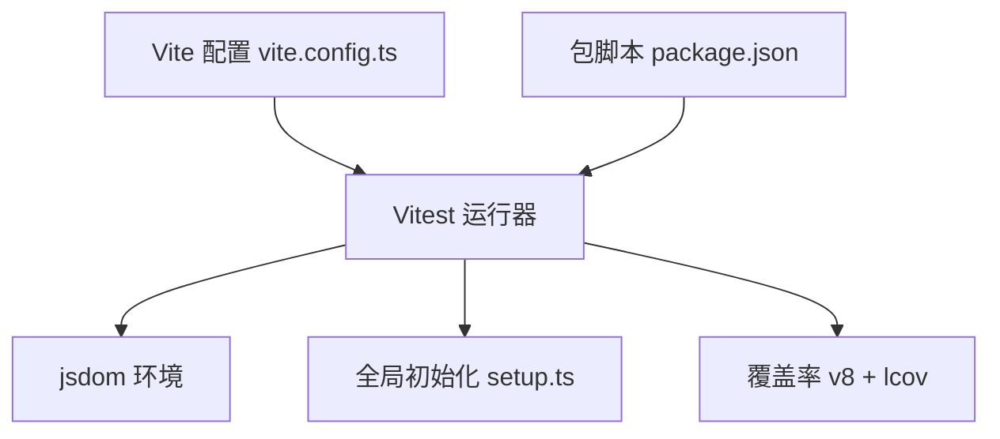
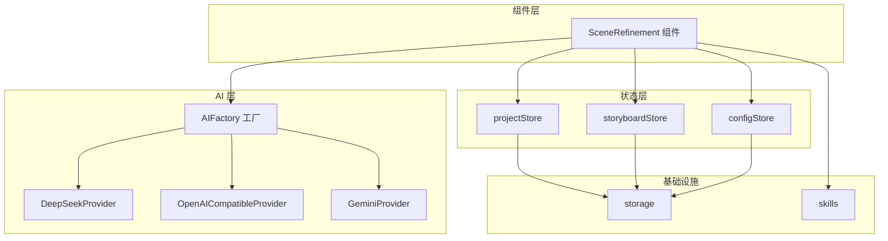
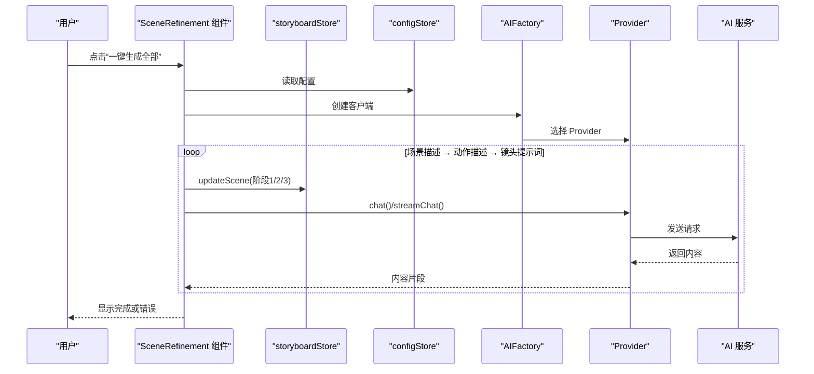
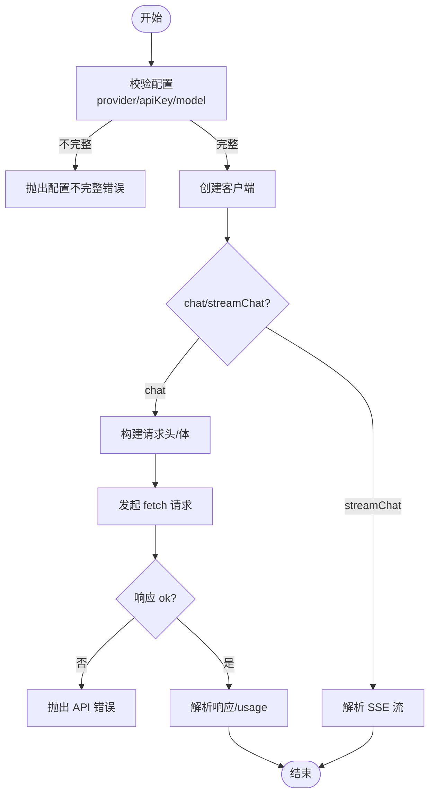
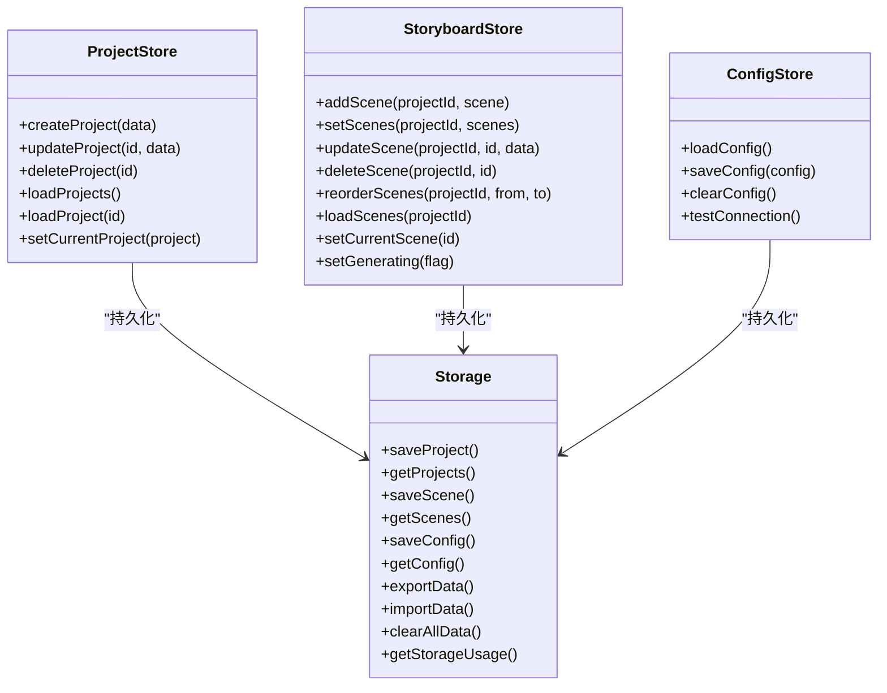
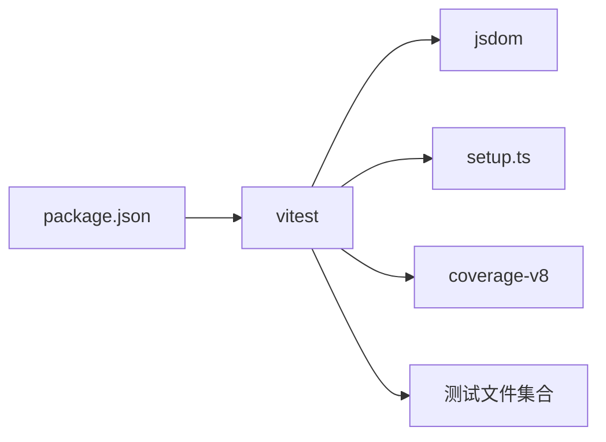

# 测试策略

<cite>
**本文引用的文件**
- [package.json](file://manga-creator/package.json)
- [vite.config.ts](file://manga-creator/vite.config.ts)
- [setup.ts](file://manga-creator/src/tests/setup.ts)
- [SceneRefinement.test.tsx](file://manga-creator/src/components/editor/SceneRefinement.test.tsx)
- [factory.test.ts](file://manga-creator/src/lib/ai/factory.test.ts)
- [store.test.ts](file://manga-creator/src/stores/store.test.ts)
- [providers.test.ts](file://manga-creator/src/lib/ai/providers/providers.test.ts)
- [storage.test.ts](file://manga-creator/src/lib/storage.test.ts)
- [skills.test.ts](file://manga-creator/src/lib/ai/skills.test.ts)
- [use-toast.test.ts](file://manga-creator/src/hooks/use-toast.test.ts)
- [utils.test.ts](file://manga-creator/src/lib/utils.test.ts)
</cite>

## 目录
1. [引言](#引言)
2. [项目结构](#项目结构)
3. [核心组件](#核心组件)
4. [架构总览](#架构总览)
5. [详细组件分析](#详细组件分析)
6. [依赖关系分析](#依赖关系分析)
7. [性能考虑](#性能考虑)
8. [故障排查指南](#故障排查指南)
9. [结论](#结论)
10. [附录](#附录)

## 引言
本测试策略文档围绕基于 Vitest 的测试体系展开，目标是通过系统化的单元测试、集成测试与端到端测试保障代码质量。本文以以下三个代表性测试文件为例：
- 组件逻辑测试：SceneRefinement.test.tsx 展示交互与状态驱动的组件行为验证
- 工厂模式验证：factory.test.ts 验证 AI 服务工厂的创建与调用契约
- 状态流测试：store.test.ts 展示 Zustand 状态管理的存取与变更流程

同时，本文将阐述 jsdom 环境配置、测试覆盖率报告生成（lcov）、setup.ts 中的全局初始化，以及测试驱动开发（TDD）实践建议，包括 mock 策略、异步测试处理与性能测试考量。

## 项目结构
测试相关的关键配置与入口如下：
- 测试运行器与环境：Vitest（jsdom），通过 vite.config.ts 的 test 字段统一配置
- 全局初始化：setup.ts 注册 @testing-library/jest-dom 的扩展断言
- 覆盖率：v8 提供器，输出文本与 lcov 报告
- 依赖与脚本：package.json 提供 test、test:watch 等命令

图表来源
- [vite.config.ts](file://manga-creator/vite.config.ts#L18-L28)
- [setup.ts](file://manga-creator/src/tests/setup.ts#L1-L2)
- [package.json](file://manga-creator/package.json#L7-L13)

章节来源
- [vite.config.ts](file://manga-creator/vite.config.ts#L18-L28)
- [setup.ts](file://manga-creator/src/tests/setup.ts#L1-L2)
- [package.json](file://manga-creator/package.json#L7-L13)

## 核心组件
- 组件层：SceneRefinement（一键生成全部流程），依赖 Zustand store 与 AI 工厂
- AI 层：AIFactory（工厂）、各 Provider（DeepSeek、OpenAI 兼容、Gemini）
- 状态层：Zustand store（projectStore、storyboardStore、configStore）
- 工具与基础设施：storage（本地持久化）、skills（技能注册与模板）

章节来源
- [SceneRefinement.test.tsx](file://manga-creator/src/components/editor/SceneRefinement.test.tsx#L1-L353)
- [factory.test.ts](file://manga-creator/src/lib/ai/factory.test.ts#L1-L595)
- [store.test.ts](file://manga-creator/src/stores/store.test.ts#L1-L971)
- [providers.test.ts](file://manga-creator/src/lib/ai/providers/providers.test.ts#L1-L676)
- [storage.test.ts](file://manga-creator/src/lib/storage.test.ts#L1-L946)
- [skills.test.ts](file://manga-creator/src/lib/ai/skills.test.ts#L1-L364)

## 架构总览
下图展示了测试所覆盖的主要模块及其交互关系，体现“组件 → 状态 → AI 工厂/Provider → 外部 API”的调用链路。

图表来源
- [SceneRefinement.test.tsx](file://manga-creator/src/components/editor/SceneRefinement.test.tsx#L1-L353)
- [factory.test.ts](file://manga-creator/src/lib/ai/factory.test.ts#L1-L595)
- [providers.test.ts](file://manga-creator/src/lib/ai/providers/providers.test.ts#L1-L676)
- [store.test.ts](file://manga-creator/src/stores/store.test.ts#L1-L971)
- [storage.test.ts](file://manga-creator/src/lib/storage.test.ts#L1-L946)
- [skills.test.ts](file://manga-creator/src/lib/ai/skills.test.ts#L1-L364)

## 详细组件分析

### 组件逻辑测试：SceneRefinement
- 目标：验证一键生成全部流程的正确性、防重复点击、错误处理、状态显示与最终态禁用
- 关键点：
  - 使用 vitest 的 vi.mock 对 store 与工厂进行隔离
  - 使用 @testing-library/react 的 render、screen、waitFor、userEvent
  - 通过 mockChatFn 逐步模拟三阶段生成，验证 updateScene 的三次调用及参数
  - 防重复点击：快速双击仅触发一次完整流程（3 次 API 调用）
  - 错误处理：任一阶段失败均应显示错误提示
  - 状态显示：生成中按钮文案与禁用态校验
  - 最终态：若已完成则按钮禁用
  - 状态一致性：使用 useStoryboardStore.getState 获取最新状态

图表来源
- [SceneRefinement.test.tsx](file://manga-creator/src/components/editor/SceneRefinement.test.tsx#L159-L351)

章节来源
- [SceneRefinement.test.tsx](file://manga-creator/src/components/editor/SceneRefinement.test.tsx#L1-L353)

### 工厂模式验证：AIFactory
- 目标：验证 createAIProvider 与 AIFactory.createClient 的契约
- 关键点：
  - 配置校验：provider、apiKey、model 缺失时抛错
  - chat 方法：正确构造请求头与 body，解析 token 使用量
  - streamChat 方法：正确解析 SSE 流，处理无 body、跨块数据与无效行
  - Provider 类型：deepseek、openai-compatible、kimi、gemini 的名称与行为
  - 边界情况：空消息、超长消息、特殊字符、emoji、中文、网络错误、429/500 等
  - baseURL：正确拼接与去尾斜杠

图表来源
- [factory.test.ts](file://manga-creator/src/lib/ai/factory.test.ts#L45-L595)
- [providers.test.ts](file://manga-creator/src/lib/ai/providers/providers.test.ts#L1-L676)

章节来源
- [factory.test.ts](file://manga-creator/src/lib/ai/factory.test.ts#L1-L595)
- [providers.test.ts](file://manga-creator/src/lib/ai/providers/providers.test.ts#L1-L676)

### 状态流测试：Zustand Store
- 目标：验证 projectStore、storyboardStore、configStore 的 CRUD 与状态变更
- 关键点：
  - projectStore：创建/更新/删除/加载；时间戳、工作流状态、ID 生成规则
  - storyboardStore：addScene/setScenes/updateScene/deleteScene/reorderScenes/loadScenes/setCurrentScene/setGenerating；自动编号与持久化
  - configStore：loadConfig/isConfigured；与 AIFactory 的集成测试
  - storage：对 localStorage 的封装，加密/解密、导入导出、清理与容量统计
  - 测试隔离：vi.mock('@/lib/storage') 与 vi.resetModules() 保证模块级隔离

图表来源
- [store.test.ts](file://manga-creator/src/stores/store.test.ts#L1-L971)
- [storage.test.ts](file://manga-creator/src/lib/storage.test.ts#L1-L946)

章节来源
- [store.test.ts](file://manga-creator/src/stores/store.test.ts#L1-L971)
- [storage.test.ts](file://manga-creator/src/lib/storage.test.ts#L1-L946)

### 技能与工具测试
- skills：技能注册表、任务映射、模板占位符一致性、上下文类型与输出格式验证
- utils：cn 合并工具的条件类名、数组、Tailwind 冲突合并等边界场景
- use-toast：toast reducer 的 ADD/UPDATE/DISMISS/REMOVE 等动作与边界情况

章节来源
- [skills.test.ts](file://manga-creator/src/lib/ai/skills.test.ts#L1-L364)
- [utils.test.ts](file://manga-creator/src/lib/utils.test.ts#L1-L279)
- [use-toast.test.ts](file://manga-creator/src/hooks/use-toast.test.ts#L1-L281)

## 依赖关系分析
- 测试耦合度控制：
  - 通过 vi.mock 对外部依赖（store、AI 工厂、storage）进行隔离
  - 通过 resetModules 与 beforeEach 重建模块状态，避免跨用例污染
- 外部依赖：
  - jsdom：提供 DOM API 以支持 @testing-library/react
  - @testing-library/jest-dom：扩展 expect 断言能力
  - vitest/coverage-v8：覆盖率收集与 lcov 报告
- 关键依赖文件：
  - vite.config.ts：jsdom、setupFiles、coverage、exclude
  - setup.ts：全局断言扩展
  - package.json：test 脚本

图表来源
- [vite.config.ts](file://manga-creator/vite.config.ts#L18-L28)
- [setup.ts](file://manga-creator/src/tests/setup.ts#L1-L2)
- [package.json](file://manga-creator/package.json#L7-L13)

章节来源
- [vite.config.ts](file://manga-creator/vite.config.ts#L18-L28)
- [setup.ts](file://manga-creator/src/tests/setup.ts#L1-L2)
- [package.json](file://manga-creator/package.json#L7-L13)

## 性能考虑
- 异步测试优化：
  - 使用 waitFor 与超时控制，避免 flaky 测试
  - 对流式接口（streamChat）采用 for-await-of 循环消费，确保完整吞吐
- Mock 策略：
  - vi.spyOn/globalThis.fetch 用于精确控制网络行为
  - vi.mock 用于隔离外部模块，减少真实 I/O
- 覆盖率与报告：
  - v8 提供器 + lcov 报告，便于 CI/CD 集成
  - 通过 exclude e2e/** 避免端到端测试影响单元覆盖率
- 代码稳定性：
  - 对边界输入（空字符串、emoji、中文、超长内容）进行覆盖
  - 对错误路径（429/500、网络错误、无效 JSON）进行健壮性测试

[本节为通用指导，无需列出具体文件来源]

## 故障排查指南
- 常见问题定位：
  - jsdom 断言失败：确认 setup.ts 是否正确引入 @testing-library/jest-dom/vitest
  - fetch 未被 spy：检查是否在测试前替换 globalThis.fetch 或使用 vi.spyOn
  - 状态未更新：确认 store 的 mock 返回值与 updateScene 的调用顺序
  - 流式接口异常：检查响应体是否存在、SSE 行解析与跨块拼接
- 建议步骤：
  - 使用 test:watch 脚本快速迭代
  - 在 beforeEach 中重置所有 vi mocks，避免跨用例干扰
  - 对关键分支增加日志断言（如错误文案、按钮状态）

章节来源
- [setup.ts](file://manga-creator/src/tests/setup.ts#L1-L2)
- [SceneRefinement.test.tsx](file://manga-creator/src/components/editor/SceneRefinement.test.tsx#L1-L353)
- [factory.test.ts](file://manga-creator/src/lib/ai/factory.test.ts#L1-L595)
- [providers.test.ts](file://manga-creator/src/lib/ai/providers/providers.test.ts#L1-L676)

## 结论
通过以 SceneRefinement、AIFactory、Zustand Store 为代表的测试用例，结合 jsdom 环境、全局初始化与 lcov 覆盖率，本项目建立了覆盖前端组件、状态管理、AI 服务与基础设施的测试体系。建议持续补充：
- 针对复杂交互的端到端测试（e2e）
- 性能基准测试（benchmark），评估关键路径耗时
- 更多边界与异常场景的回归用例

[本节为总结性内容，无需列出具体文件来源]

## 附录
- 测试运行与脚本
  - 运行：npm run test
  - 监听：npm run test:watch
- 覆盖率报告位置
  - lcov-report 与 lcov.info 位于 coverage 目录

章节来源
- [package.json](file://manga-creator/package.json#L7-L13)
- [vite.config.ts](file://manga-creator/vite.config.ts#L23-L26)