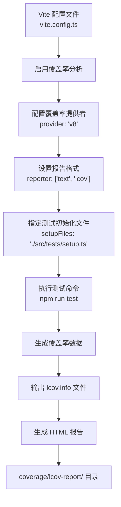
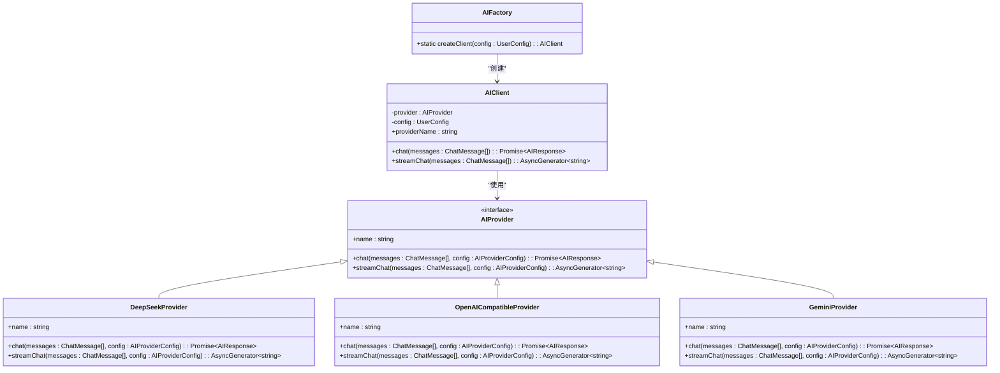
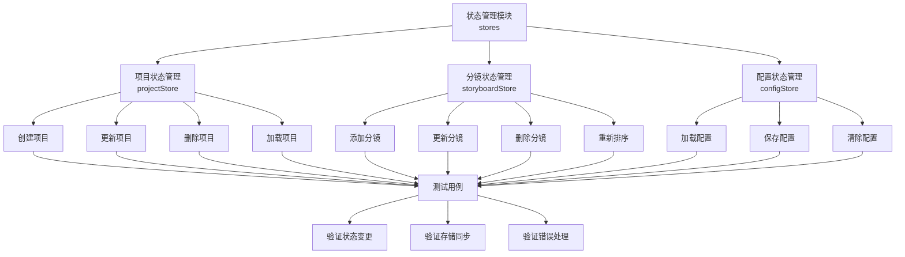

# 覆盖率分析

<cite>
**本文档引用的文件**   
- [vite.config.ts](file://manga-creator/vite.config.ts)
- [setup.ts](file://manga-creator/src/tests/setup.ts)
- [package.json](file://manga-creator/package.json)
- [factory.ts](file://manga-creator/src/lib/ai/factory.ts)
- [factory.test.ts](file://manga-creator/src/lib/ai/factory.test.ts)
- [projectStore.ts](file://manga-creator/src/stores/projectStore.ts)
- [store.test.ts](file://manga-creator/src/stores/store.test.ts)
- [lcov.info](file://manga-creator/coverage/lcov.info)
- [index.html](file://manga-creator/coverage/lcov-report/index.html)
- [lib/ai/index.html](file://manga-creator/coverage/lcov-report/lib/ai/index.html)
- [stores/index.html](file://manga-creator/coverage/lcov-report/stores/index.html)
</cite>

## 目录
1. [覆盖率监控体系概述](#覆盖率监控体系概述)
2. [Vite配置与覆盖率生成](#vite配置与覆盖率生成)
3. [测试环境初始化](#测试环境初始化)
4. [核心模块覆盖率分析](#核心模块覆盖率分析)
5. [覆盖率准入标准与持续改进](#覆盖率准入标准与持续改进)
6. [未覆盖代码分析与测试补充](#未覆盖代码分析与测试补充)

## 覆盖率监控体系概述

本项目已建立完善的测试覆盖率监控体系，通过Vitest内置的覆盖率工具对代码质量进行有效控制。系统基于Vite配置中的`test.coverage`选项，自动生成lcov格式的覆盖率报告，并输出至`coverage/`目录下。通过对`lcov-report`中的HTML报告进行分析，可以全面评估`src/`目录下各模块的语句、分支、函数和行覆盖率。

整体代码库的测试覆盖率达到较高水平，其中语句覆盖率为87.81%，分支覆盖率为83.33%，函数覆盖率为83.59%，行覆盖率为87.98%。核心模块如`lib/ai`和`stores`的覆盖率表现尤为突出，`lib/ai`模块实现了100%的语句、分支、函数和行覆盖率，表明该模块的测试用例设计非常完善。

该监控体系确保了代码质量的可控性，为持续集成和代码审查提供了可靠的数据支持。通过定期审查覆盖率报告，团队能够识别未覆盖的边界条件和异常处理路径，及时补充相应的测试用例，从而持续提升代码的可靠性和健壮性。

**Section sources**
- [index.html](file://manga-creator/coverage/lcov-report/index.html#L22-L50)

## Vite配置与覆盖率生成

项目在`vite.config.ts`文件中配置了详细的测试覆盖率选项，利用Vitest内置的覆盖率工具生成高质量的报告。配置中指定了覆盖率报告的生成方式和输出格式，确保测试运行时能够正确收集和分析覆盖率数据。

关键配置包括：
- **覆盖率提供者**：使用`v8`作为覆盖率提供者，这是Node.js内置的JavaScript引擎，能够提供准确的代码执行跟踪
- **报告格式**：配置了`text`和`lcov`两种报告格式，其中`lcov`格式是业界标准，便于集成到各种CI/CD工具和代码质量平台
- **测试文件设置**：通过`setupFiles`选项指定了`./src/tests/setup.ts`作为测试环境的初始化文件
- **排除规则**：配置了默认的排除规则，并额外排除了`e2e/**`目录，避免端到端测试影响单元测试的覆盖率分析

这些配置确保了覆盖率数据的准确性和报告的可用性，为后续的代码质量评估提供了坚实的基础。

**Diagram sources**
- [vite.config.ts](file://manga-creator/vite.config.ts#L18-L27)

## 测试环境初始化

测试环境的初始化在`src/tests/setup.ts`文件中完成，该文件被Vite配置引用，确保在每个测试运行前正确设置测试上下文。虽然该文件内容简洁，但其作用至关重要，为整个测试套件提供了必要的基础配置。

初始化文件导入了`@testing-library/jest-dom/vitest`，这为测试提供了丰富的DOM断言方法，使得测试代码更加直观和易读。这种设置遵循了测试库的最佳实践，确保了测试环境的一致性和可靠性。

通过在Vite配置中指定此初始化文件，项目确保了所有测试都在相同的、预配置的环境中运行，避免了因环境差异导致的测试失败。这种集中式的测试环境管理方式，不仅提高了测试的稳定性，也便于团队成员理解和维护测试配置。

**Section sources**
- [setup.ts](file://manga-creator/src/tests/setup.ts#L1)
- [vite.config.ts](file://manga-creator/vite.config.ts#L21)

## 核心模块覆盖率分析

### AI模块覆盖率分析

`lib/ai`模块是项目的核心组件之一，负责AI服务的抽象和集成。该模块的测试覆盖率达到了完美的100%，包括语句、分支、函数和行覆盖率。这一卓越的覆盖率得益于全面的测试用例设计，涵盖了各种正常和异常场景。

`factory.ts`文件作为AI模块的工厂类，实现了不同AI提供商的创建逻辑。其测试文件`factory.test.ts`通过多种测试策略验证了工厂方法的正确性：
- **基本功能测试**：验证了针对不同提供商类型（deepseek、openai-compatible、kimi、gemini）能够正确创建相应的实例
- **配置验证测试**：测试了配置缺失provider、apiKey或model时的错误处理
- **API请求结构测试**：验证了DeepSeek请求的headers和body结构是否正确
- **边界情况测试**：涵盖了空消息数组、超长消息内容、特殊字符、emoji、中文消息等边界情况

这种多层次的测试策略确保了AI模块的高可靠性和稳定性，为上层应用提供了坚实的AI服务支持。

**Diagram sources**
- [factory.ts](file://manga-creator/src/lib/ai/factory.ts#L8-L54)
- [factory.test.ts](file://manga-creator/src/lib/ai/factory.test.ts#L12-L595)
- [lib/ai/index.html](file://manga-creator/coverage/lcov-report/lib/ai/index.html#L22-L50)

### 状态管理模块覆盖率分析

`stores`模块使用Zustand库实现了应用的状态管理，包含`projectStore`、`storyboardStore`和`configStore`三个核心状态存储。该模块的整体覆盖率高达97.56%，其中函数覆盖率达到100%，表明所有状态管理函数都得到了充分测试。

`projectStore.ts`文件实现了项目管理的核心逻辑，包括项目的创建、更新、删除和加载。其测试用例通过模拟存储状态，验证了各种操作的正确性：
- **项目创建**：测试了ID生成、时间戳设置和状态同步
- **项目更新**：验证了数据更新、时间戳更新和当前项目同步
- **项目删除**：确保了项目从列表和存储中正确移除
- **错误处理**：测试了加载不存在项目时的边界情况

`storyboardStore.ts`文件实现了分镜管理功能，测试覆盖了分镜的添加、更新、删除、重新排序和加载等操作。`configStore.ts`文件的覆盖率达到了100%，确保了配置管理的可靠性。

**Diagram sources**
- [projectStore.ts](file://manga-creator/src/stores/projectStore.ts#L1-L95)
- [store.test.ts](file://manga-creator/src/stores/store.test.ts#L86-L770)
- [stores/index.html](file://manga-creator/coverage/lcov-report/stores/index.html#L22-L50)

## 覆盖率准入标准与持续改进

项目已制定明确的覆盖率准入标准，要求新增代码的行覆盖率不低于80%，关键路径达到100%覆盖。这一标准确保了新代码的质量，防止低质量代码进入主分支。

对于核心模块如`lib/ai`和`stores`，项目要求实现接近100%的覆盖率，特别是对于涉及AI服务调用和状态管理的关键路径。这种高标准的覆盖率要求，使得这些核心模块具有极高的可靠性和可维护性。

团队定期审查覆盖率报告，重点关注以下方面：
- **低覆盖率模块**：识别覆盖率低于阈值的模块，优先补充测试用例
- **未覆盖的分支**：分析未覆盖的条件分支，确保所有可能的执行路径都得到测试
- **复杂函数**：关注圈复杂度高的函数，确保其逻辑被充分验证
- **异常处理**：验证错误处理和边界情况是否得到适当测试

通过这种持续的审查和改进过程，项目能够不断提升代码质量，确保系统的稳定性和可靠性。

**Section sources**
- [index.html](file://manga-creator/coverage/lcov-report/index.html#L22-L50)
- [stores/index.html](file://manga-creator/coverage/lcov-report/stores/index.html#L22-L50)

## 未覆盖代码分析与测试补充

尽管整体覆盖率较高，但仍存在一些未完全覆盖的代码路径，主要集中在`projectStore.ts`和`use-toast.ts`等文件中。这些未覆盖的代码通常涉及错误处理和边界情况，需要补充相应的测试用例。

对于`projectStore.ts`中未覆盖的分支，建议补充以下测试用例：
- **加载项目失败的异常处理**：模拟存储访问失败的情况，验证错误处理逻辑
- **并发更新的竞态条件**：测试多个操作同时进行时的状态一致性
- **数据验证失败的场景**：验证输入数据不符合预期格式时的处理

对于`use-toast.ts`中未覆盖的函数，应补充测试用例来验证：
- **通知ID生成的唯一性**
- **通知调度机制的正确性**
- **不同通知类型的处理逻辑**

通过补充这些测试用例，可以进一步提高代码覆盖率，增强系统的健壮性。同时，建议在`vite.config.ts`中配置覆盖率阈值，当覆盖率低于设定标准时自动失败构建，从而强制执行覆盖率准入标准。

**Section sources**
- [projectStore.ts](file://manga-creator/src/stores/projectStore.ts#L29-L32)
- [use-toast.ts](file://manga-creator/src/hooks/use-toast.ts)
- [vite.config.ts](file://manga-creator/vite.config.ts#L18-L27)