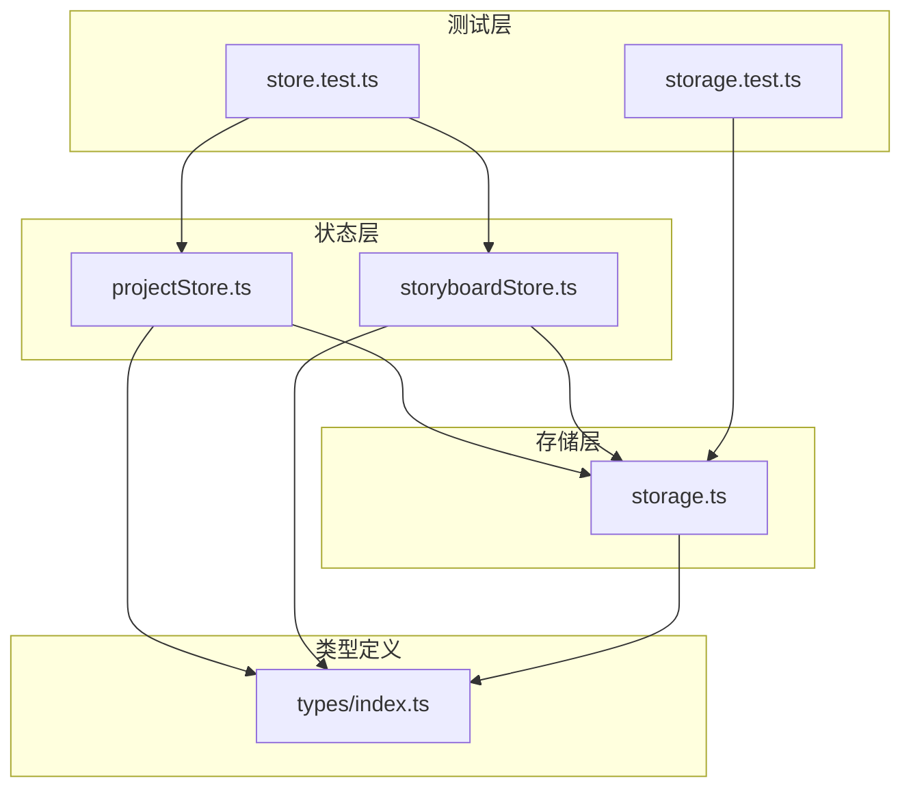
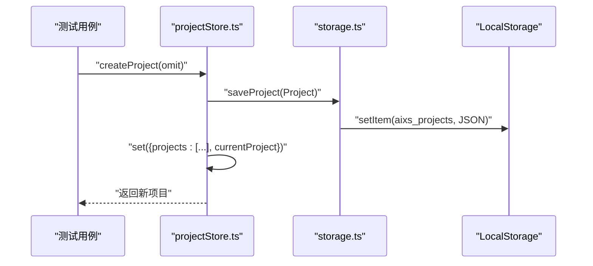
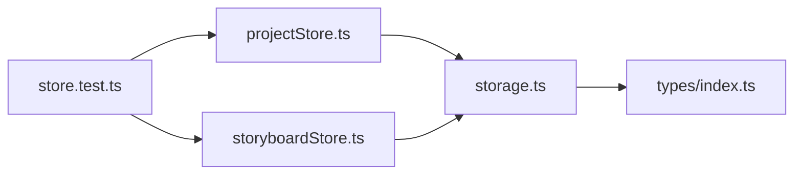

# 数据持久化集成测试

<cite>
**本文引用的文件**
- [store.test.ts](file://manga-creator/src/stores/store.test.ts)
- [storage.ts](file://manga-creator/src/lib/storage.ts)
- [projectStore.ts](file://manga-creator/src/stores/projectStore.ts)
- [storyboardStore.ts](file://manga-creator/src/stores/storyboardStore.ts)
- [storage.test.ts](file://manga-creator/src/lib/storage.test.ts)
- [index.ts](file://manga-creator/src/types/index.ts)
</cite>

## 目录
1. [引言](#引言)
2. [项目结构](#项目结构)
3. [核心组件](#核心组件)
4. [架构总览](#架构总览)
5. [详细组件分析](#详细组件分析)
6. [依赖分析](#依赖分析)
7. [性能考虑](#性能考虑)
8. [故障排查指南](#故障排查指南)
9. [结论](#结论)
10. [附录](#附录)

## 引言
本文件聚焦于系统性讲解“状态管理模块与本地存储服务”的集成测试，重点围绕以下目标：
- 解释如何通过测试用例验证项目与分镜数据在创建、更新、删除后能正确持久化到LocalStorage，并在应用重启后通过load方法恢复工作状态。
- 展示如何mock存储API（如saveProject、getScenes），并通过断言storage方法的调用次数与参数，确保内存状态与持久化存储保持同步。
- 覆盖边界情况，如更新不存在的项目或分镜，以及配置项的加载与保存。
- 提供常见问题的解决方案，例如数据未保存、加载状态不一致等，并强调加密存储的重要性。

## 项目结构
本项目采用“状态层（stores）+ 存储层（lib/storage）+ 类型定义（types）”的分层设计。测试文件位于stores目录下的store.test.ts，用于验证状态管理与存储服务的集成；同时存在lib/storage.test.ts对底层存储API进行单元测试。

图表来源
- [projectStore.ts](file://manga-creator/src/stores/projectStore.ts#L1-L95)
- [storyboardStore.ts](file://manga-creator/src/stores/storyboardStore.ts#L1-L107)
- [storage.ts](file://manga-creator/src/lib/storage.ts#L1-L246)
- [store.test.ts](file://manga-creator/src/stores/store.test.ts#L1-L971)
- [storage.test.ts](file://manga-creator/src/lib/storage.test.ts#L1-L946)
- [index.ts](file://manga-creator/src/types/index.ts#L1-L351)

章节来源
- [store.test.ts](file://manga-creator/src/stores/store.test.ts#L1-L120)
- [storage.ts](file://manga-creator/src/lib/storage.ts#L1-L60)
- [projectStore.ts](file://manga-creator/src/stores/projectStore.ts#L1-L40)
- [storyboardStore.ts](file://manga-creator/src/stores/storyboardStore.ts#L1-L40)

## 核心组件
- 状态管理模块
  - 项目状态管理：projectStore.ts，负责项目列表、当前项目、加载/创建/更新/删除等操作。
  - 分镜状态管理：storyboardStore.ts，负责分镜列表、当前分镜、添加/更新/删除/重排等操作。
- 存储服务：storage.ts，封装LocalStorage访问、版本迁移、加密/解密、项目/分镜/配置的读写与导入导出。
- 类型定义：types/index.ts，统一声明Project、Scene、UserConfig等数据结构及枚举状态。

章节来源
- [projectStore.ts](file://manga-creator/src/stores/projectStore.ts#L1-L95)
- [storyboardStore.ts](file://manga-creator/src/stores/storyboardStore.ts#L1-L107)
- [storage.ts](file://manga-creator/src/lib/storage.ts#L1-L246)
- [index.ts](file://manga-creator/src/types/index.ts#L44-L78)

## 架构总览
下面的序列图展示了“项目创建”在状态层与存储层之间的调用链路，以及测试中如何通过mock验证调用次数与参数。

图表来源
- [projectStore.ts](file://manga-creator/src/stores/projectStore.ts#L42-L61)
- [storage.ts](file://manga-creator/src/lib/storage.ts#L68-L84)

章节来源
- [projectStore.ts](file://manga-creator/src/stores/projectStore.ts#L42-L61)
- [storage.ts](file://manga-creator/src/lib/storage.ts#L68-L84)

## 详细组件分析

### 项目状态管理（projectStore）与存储集成测试
- mock策略
  - 在store.test.ts中，通过vi.fn构建storageSpies对象，覆盖getProjects、saveProject、deleteProject、getProject、getConfig、saveConfig、clearConfig等方法，并使用vi.mock('@/lib/storage', () => storageSpies)注入到被测模块。
  - 每个测试用例执行前，重置storageState与所有spy的调用计数，确保测试隔离。
- 关键测试点
  - 创建项目：断言saveProject被调用、当前项目被设置、唯一ID生成规则、初始工作流状态与时间戳。
  - 更新项目：断言saveProject调用次数增加、updatedAt更新、currentProject同步更新；更新不存在的项目不应触发持久化。
  - 删除项目：断言deleteProject被调用、项目从内存与存储中移除、当前项目清空。
  - 加载项目：断言getProjects被调用、项目列表与当前项目设置；loadProject加载不存在的项目不应改变状态。
  - 当前项目切换：支持设置为null。
- 边界情况
  - 空标题、超长标题、特殊字符、emoji等输入场景均被覆盖。

章节来源
- [store.test.ts](file://manga-creator/src/stores/store.test.ts#L1-L120)
- [store.test.ts](file://manga-creator/src/stores/store.test.ts#L120-L390)
- [store.test.ts](file://manga-creator/src/stores/store.test.ts#L390-L410)
- [store.test.ts](file://manga-creator/src/stores/store.test.ts#L874-L916)

### 分镜状态管理（storyboardStore）与存储集成测试
- mock策略
  - 使用storageSpies.getScenes、saveScenes、saveScene等spy，验证分镜的增删改查与重排逻辑。
- 关键测试点
  - 添加分镜：自动生成ID、自动顺序、默认状态为pending；断言saveScene被调用。
  - 批量设置分镜：重新编号并持久化；覆盖既有分镜。
  - 更新分镜：断言saveScene调用次数增加；更新不存在的分镜不应触发持久化。
  - 删除分镜：重新编号并持久化；后续场景顺序连续。
  - 重排分镜：移动后重新编号并持久化。
  - 加载分镜：断言getScenes被调用并填充内存状态。
  - 当前分镜ID：支持设置为null。
- 边界情况
  - 空分镜列表、大量分镜、唯一分镜重排等边界场景。

章节来源
- [store.test.ts](file://manga-creator/src/stores/store.test.ts#L410-L770)
- [store.test.ts](file://manga-creator/src/stores/store.test.ts#L770-L971)

### 存储服务（storage.ts）与底层LocalStorage交互
- 加密与解密
  - 使用CryptoJS对配置数据进行AES加密存储，键名为aixs_config；读取时先解密再解析。
- 键名与版本
  - 项目列表键名aixs_projects；分镜键名aixs_scenes_{projectId}；版本键名aixs_version；initStorage负责版本迁移与初始化。
- 项目与分镜操作
  - getProjects/getProject/saveProject/deleteProject：项目列表的读取、查找、保存与删除（删除项目时同时删除对应分镜）。
  - getScenes/saveScenes/getScene/saveScene：分镜列表的读取、批量保存、单条更新。
- 导入导出与清理
  - exportData：导出项目与分镜；importData：导入项目与分镜；clearAllData：清理所有aixs前缀数据并保留版本号；getStorageUsage：统计aixs前缀数据占用。
- 错误处理
  - 对JSON解析失败、加密/解密异常、写入失败等情况进行捕获并输出日志，必要时抛出明确错误信息。

章节来源
- [storage.ts](file://manga-creator/src/lib/storage.ts#L1-L246)

### 类型定义（types/index.ts）
- 定义了Project、Scene、UserConfig等核心数据结构，以及WorkflowState、SceneStatus等枚举类型，保证状态层与存储层的数据一致性。

章节来源
- [index.ts](file://manga-creator/src/types/index.ts#L44-L78)
- [index.ts](file://manga-creator/src/types/index.ts#L88-L93)

## 依赖分析
- 状态层依赖存储层
  - projectStore依赖getProjects、saveProject、deleteProject、getProject。
  - storyboardStore依赖getScenes、saveScene、saveScenes。
- 测试层依赖状态层与存储层
  - store.test.ts通过vi.mock注入storageSpies，验证状态层对存储层的调用次数与参数。
- 存储层依赖类型定义
  - storage.ts使用Project、Scene、UserConfig等类型进行序列化与反序列化。

图表来源
- [store.test.ts](file://manga-creator/src/stores/store.test.ts#L1-L120)
- [projectStore.ts](file://manga-creator/src/stores/projectStore.ts#L1-L20)
- [storyboardStore.ts](file://manga-creator/src/stores/storyboardStore.ts#L1-L20)
- [storage.ts](file://manga-creator/src/lib/storage.ts#L1-L20)
- [index.ts](file://manga-creator/src/types/index.ts#L44-L78)

章节来源
- [store.test.ts](file://manga-creator/src/stores/store.test.ts#L1-L120)
- [projectStore.ts](file://manga-creator/src/stores/projectStore.ts#L1-L20)
- [storyboardStore.ts](file://manga-creator/src/stores/storyboardStore.ts#L1-L20)
- [storage.ts](file://manga-creator/src/lib/storage.ts#L1-L20)
- [index.ts](file://manga-creator/src/types/index.ts#L44-L78)

## 性能考虑
- 写入策略
  - 项目与分镜的保存采用整体替换策略（项目列表、分镜列表），避免频繁小粒度写入，减少LocalStorage碎片化。
- 编号与重排
  - 分镜重排时一次性重新编号并批量保存，降低多次写入成本。
- 存储容量
  - getStorageUsage仅统计aixs前缀数据，便于监控与清理；建议在业务侧控制单项目分镜数量，避免超出LocalStorage容量上限。

[本节为通用指导，无需引用具体文件]

## 故障排查指南
- 数据未保存
  - 现象：更新/删除操作后，内存状态变化但LocalStorage未更新。
  - 排查要点：
    - 确认测试中是否正确mock了storageSpies（如saveProject、saveScene、saveScenes）。
    - 检查状态层调用链是否到达存储层（断言spy被调用且参数正确）。
    - 若存储层抛错，需查看错误日志与错误信息（如“项目保存失败”、“分镜保存失败”）。
- 加载状态不一致
  - 现象：loadProjects/loadScenes后内存状态与预期不符。
  - 排查要点：
    - 确认storage层getProjects/getScenes在测试中返回期望数据。
    - 检查load方法是否正确设置isLoading与最终状态。
- 更新不存在的项目或分镜
  - 现象：调用updateProject/updateScene时无持久化动作。
  - 排查要点：
    - 确认状态层在找不到目标时直接返回，不调用存储层。
    - 测试用例应断言spy调用次数不变。
- 加密配置无法读取
  - 现象：getConfig返回null或抛错。
  - 排查要点：
    - 确认aixs_config键存在且为有效加密串；解密密钥需与存储时一致。
    - 检查storage层decrypt逻辑与console.error输出。
- 数据损坏
  - 现象：getProjects/getScenes返回空集合或报错。
  - 排查要点：
    - 检查LocalStorage中对应键的JSON格式；storage层对异常进行捕获并返回空集合或null。

章节来源
- [store.test.ts](file://manga-creator/src/stores/store.test.ts#L160-L226)
- [store.test.ts](file://manga-creator/src/stores/store.test.ts#L553-L591)
- [storage.test.ts](file://manga-creator/src/lib/storage.test.ts#L170-L224)
- [storage.test.ts](file://manga-creator/src/lib/storage.test.ts#L240-L322)
- [storage.test.ts](file://manga-creator/src/lib/storage.test.ts#L374-L473)
- [storage.ts](file://manga-creator/src/lib/storage.ts#L150-L177)
- [storage.ts](file://manga-creator/src/lib/storage.ts#L52-L84)
- [storage.ts](file://manga-creator/src/lib/storage.ts#L104-L145)

## 结论
通过store.test.ts中的mock与断言策略，我们能够系统性地验证：
- 状态管理模块与存储服务的调用契约与参数正确性；
- 内存状态与持久化存储在创建、更新、删除、加载等关键路径上的一致性；
- 边界情况与异常场景的稳健处理；
- 加密存储在配置层面的安全性保障。

建议在后续迭代中持续完善：
- 增加更多边界与压力测试（如超大分镜集、并发更新）；
- 引入更细粒度的错误分类与用户提示；
- 考虑引入IndexedDB作为LocalStorage的替代方案以提升容量与性能。

[本节为总结性内容，无需引用具体文件]

## 附录

### 验证storage方法调用次数与参数的测试模式
- 项目创建/更新/删除
  - 断言saveProject被调用且参数为完整Project对象；断言deleteProject被调用且参数为projectId。
- 分镜增删改查
  - 断言saveScene/saveScenes被调用且参数为projectId与Scene/Scene[]；断言getScenes被调用且返回期望数据。
- 加载流程
  - 断言getProjects/getProject/getScenes被调用；断言内存状态相应更新。

章节来源
- [store.test.ts](file://manga-creator/src/stores/store.test.ts#L86-L120)
- [store.test.ts](file://manga-creator/src/stores/store.test.ts#L161-L209)
- [store.test.ts](file://manga-creator/src/stores/store.test.ts#L256-L314)
- [store.test.ts](file://manga-creator/src/stores/store.test.ts#L415-L479)
- [store.test.ts](file://manga-creator/src/stores/store.test.ts#L553-L621)
- [store.test.ts](file://manga-creator/src/stores/store.test.ts#L624-L718)
- [store.test.ts](file://manga-creator/src/stores/store.test.ts#L720-L742)

### 加密存储的重要性与实践
- 配置项加密
  - 存储层对UserConfig进行AES加密后写入localStorage，键名为aixs_config；读取时先解密再解析。
- 安全建议
  - 保持加密密钥稳定；避免在客户端暴露密钥；对敏感字段进行最小化存储。
- 测试覆盖
  - storage.test.ts对encrypt/decrypt、getConfig/saveConfig/clearConfig进行了全面验证。

章节来源
- [storage.ts](file://manga-creator/src/lib/storage.ts#L1-L20)
- [storage.ts](file://manga-creator/src/lib/storage.ts#L151-L177)
- [storage.test.ts](file://manga-creator/src/lib/storage.test.ts#L170-L224)