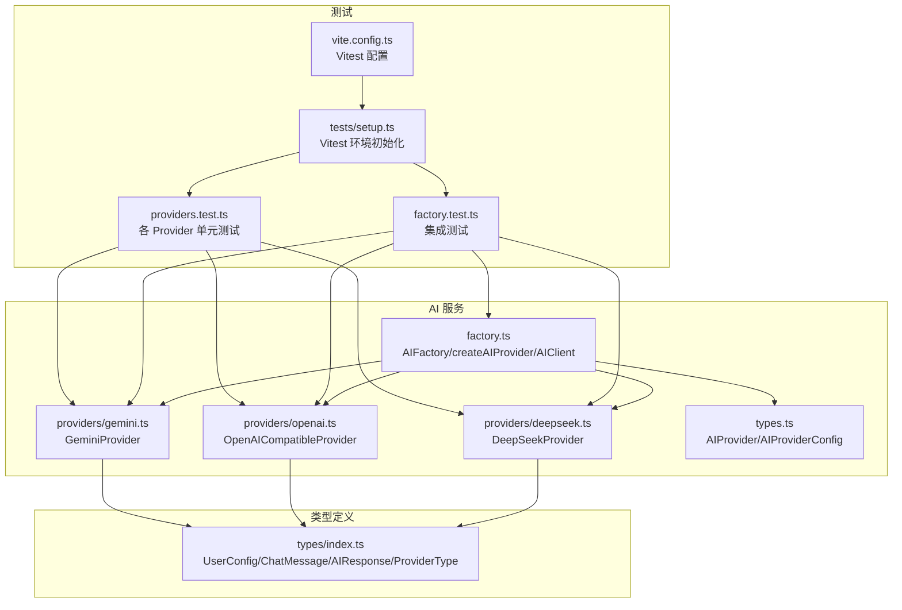
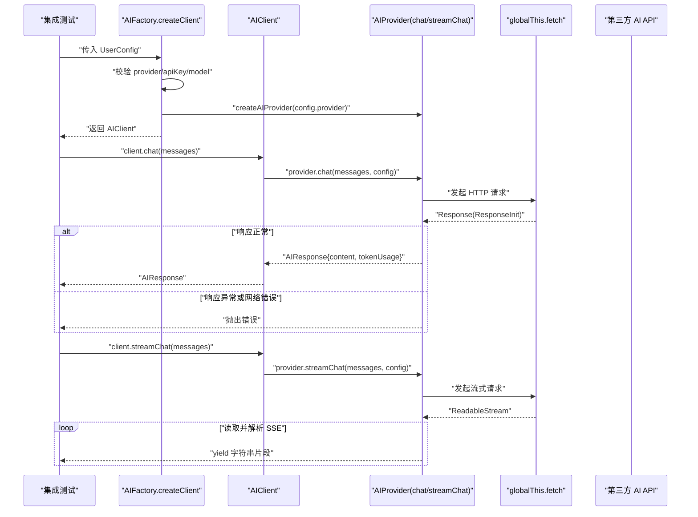
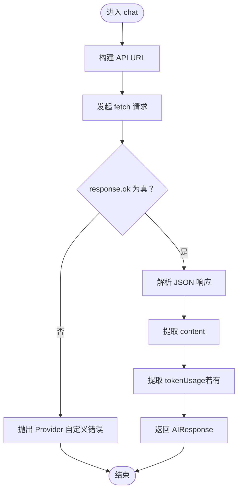
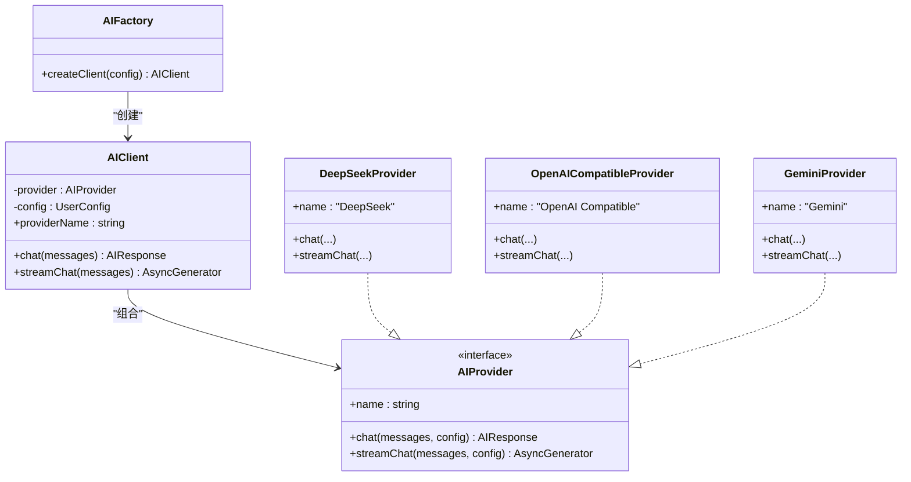
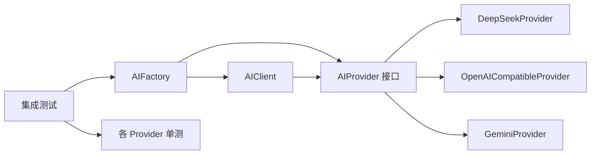

# 服务调用集成测试

<cite>
**本文引用的文件列表**
- [factory.ts](file://manga-creator/src/lib/ai/factory.ts)
- [factory.test.ts](file://manga-creator/src/lib/ai/factory.test.ts)
- [deepseek.ts](file://manga-creator/src/lib/ai/providers/deepseek.ts)
- [openai.ts](file://manga-creator/src/lib/ai/providers/openai.ts)
- [gemini.ts](file://manga-creator/src/lib/ai/providers/gemini.ts)
- [types.ts](file://manga-creator/src/lib/ai/types.ts)
- [index.ts](file://manga-creator/src/types/index.ts)
- [providers.test.ts](file://manga-creator/src/lib/ai/providers/providers.test.ts)
- [setup.ts](file://manga-creator/src/tests/setup.ts)
- [vite.config.ts](file://manga-creator/vite.config.ts)
</cite>

## 目录
1. [简介](#简介)
2. [项目结构](#项目结构)
3. [核心组件](#核心组件)
4. [架构总览](#架构总览)
5. [详细组件分析](#详细组件分析)
6. [依赖分析](#依赖分析)
7. [性能考量](#性能考量)
8. [故障排查指南](#故障排查指南)
9. [结论](#结论)
10. [附录](#附录)

## 简介
本文件围绕服务调用集成测试展开，重点阐述 AIFactory.createClient 方法的集成测试策略，覆盖以下关键目标：
- 验证根据用户配置（如 provider: 'deepseek'）正确创建并返回对应 AI 服务客户端（如 DeepSeekProvider）
- 通过 mock fetch API 验证 chat 和 streamChat 方法正确构造 HTTP 请求（包括 headers、Authorization、body 结构）
- 处理不同格式的 API 响应（如 DeepSeek 和 Gemini 的响应差异），并统一返回标准化的响应对象
- 测试配置验证（缺失 apiKey、model 等）、API 错误（401 Unauthorized、500 Internal Error 等）、网络错误
- 测试不同 provider 类型（deepseek、gemini、openai-compatible）的路由逻辑
- 验证 token 使用量的正确解析
- 提供常见问题的解决方案（如 mock 配置错误、响应格式不匹配）

## 项目结构
该仓库采用按功能域分层的组织方式：AI 服务位于 manga-creator/src/lib/ai 下，包含工厂与各提供商实现；类型定义位于 manga-creator/src/types 下；测试位于对应模块目录中。

图表来源
- [factory.ts](file://manga-creator/src/lib/ai/factory.ts#L1-L54)
- [deepseek.ts](file://manga-creator/src/lib/ai/providers/deepseek.ts#L1-L110)
- [openai.ts](file://manga-creator/src/lib/ai/providers/openai.ts#L1-L88)
- [gemini.ts](file://manga-creator/src/lib/ai/providers/gemini.ts#L1-L138)
- [types.ts](file://manga-creator/src/lib/ai/types.ts#L1-L15)
- [index.ts](file://manga-creator/src/types/index.ts#L84-L110)
- [factory.test.ts](file://manga-creator/src/lib/ai/factory.test.ts#L1-L595)
- [providers.test.ts](file://manga-creator/src/lib/ai/providers/providers.test.ts#L1-L676)
- [setup.ts](file://manga-creator/src/tests/setup.ts#L1-L2)
- [vite.config.ts](file://manga-creator/vite.config.ts#L1-L29)

章节来源
- [factory.ts](file://manga-creator/src/lib/ai/factory.ts#L1-L54)
- [types.ts](file://manga-creator/src/lib/ai/types.ts#L1-L15)
- [index.ts](file://manga-creator/src/types/index.ts#L84-L110)
- [factory.test.ts](file://manga-creator/src/lib/ai/factory.test.ts#L1-L595)
- [providers.test.ts](file://manga-creator/src/lib/ai/providers/providers.test.ts#L1-L676)
- [setup.ts](file://manga-creator/src/tests/setup.ts#L1-L2)
- [vite.config.ts](file://manga-creator/vite.config.ts#L1-L29)

## 核心组件
- AIFactory.createClient：负责校验用户配置并根据 provider 创建对应的 AI 客户端实例
- AIClient：封装 provider 的 chat 与 streamChat，并统一返回标准化 AIResponse
- createAIProvider：工厂方法，依据 ProviderType 返回具体 Provider 实现
- Provider 接口：AIProvider，定义 chat 与 streamChat 的统一签名
- 类型系统：UserConfig、ChatMessage、AIResponse、ProviderType

章节来源
- [factory.ts](file://manga-creator/src/lib/ai/factory.ts#L1-L54)
- [types.ts](file://manga-creator/src/lib/ai/types.ts#L1-L15)
- [index.ts](file://manga-creator/src/types/index.ts#L84-L110)

## 架构总览
AIFactory.createClient 的集成测试通过 Vitest 的全局 fetch mock，对不同 Provider 的请求构建、错误处理、流式解析进行端到端验证。测试覆盖：
- 配置校验（provider/apiKey/model 缺失）
- chat 正常路径与错误路径（401/500/429 等）
- streamChat 的 SSE 解析与异常处理
- 不同 Provider 的路由与请求结构差异
- token 使用量解析的一致性

图表来源
- [factory.ts](file://manga-creator/src/lib/ai/factory.ts#L44-L54)
- [deepseek.ts](file://manga-creator/src/lib/ai/providers/deepseek.ts#L29-L57)
- [openai.ts](file://manga-creator/src/lib/ai/providers/openai.ts#L7-L35)
- [gemini.ts](file://manga-creator/src/lib/ai/providers/gemini.ts#L58-L88)
- [factory.test.ts](file://manga-creator/src/lib/ai/factory.test.ts#L102-L191)

## 详细组件分析

### AIFactory.createClient 集成测试策略
- 配置验证
  - provider 缺失：抛出“AI配置不完整”
  - apiKey 为空：抛出“AI配置不完整”
  - model 为空：抛出“AI配置不完整”
  - config 为 null/undefined：抛出“AI配置不完整”
  - 完整配置：成功创建客户端并返回 provider 名称
- chat 方法
  - 正常响应：从 choices[0].message.content 提取 content，usage 中提取 tokenUsage
  - 多条消息：支持 system/user/assistant 混合消息
  - API 错误：401 Unauthorized、500 Internal Server Error、429 Too Many Requests 等，统一抛出错误
  - 网络错误：fetch 抛出异常时，错误透传
- streamChat 方法
  - 正常流式：解析 data: 行，yield delta 内容，遇到 [DONE] 结束
  - 无 body：抛出“无响应体”
  - 跨块数据：缓冲区拼接后正确拆分 JSON 行
- 不同 Provider 类型
  - deepseek：返回“DeepSeek”
  - openai-compatible：返回“OpenAI Compatible”
  - kimi：映射到 OpenAI Compatible
  - gemini：返回“Gemini”
- 请求结构
  - DeepSeek：headers 包含 Content-Type 与 Authorization，body 包含 model 与 messages
  - OpenAI 兼容：headers 同上，body 结构一致
  - Gemini：headers 使用 x-goog-api-key，body 使用 contents 结构
- baseURL 支持：chat 与 streamChat 均支持自定义 baseURL
- token 使用量
  - DeepSeek/Gemini：解析 usage/prompt_tokens/completion_tokens/total_tokens 或 usageMetadata
  - OpenAI 兼容：解析 usage，若无则 tokenUsage 为 undefined

章节来源
- [factory.test.ts](file://manga-creator/src/lib/ai/factory.test.ts#L45-L191)
- [factory.test.ts](file://manga-creator/src/lib/ai/factory.test.ts#L193-L258)
- [factory.test.ts](file://manga-creator/src/lib/ai/factory.test.ts#L265-L289)
- [factory.test.ts](file://manga-creator/src/lib/ai/factory.test.ts#L474-L535)
- [factory.test.ts](file://manga-creator/src/lib/ai/factory.test.ts#L541-L595)

### Provider 层实现与测试要点
- DeepSeekProvider
  - chat：POST /v1/chat/completions，Authorization: Bearer {apiKey}，body: {model, messages}
  - streamChat：POST /v1/chat/completions，stream=true，SSE 解析 choices[0].delta.content
  - 错误处理：throwResponseError 优先尝试 JSON error.message，否则回退 text
- OpenAICompatibleProvider
  - chat：POST /v1/chat/completions，Authorization: Bearer {apiKey}，body: {model, messages}
  - streamChat：POST /v1/chat/completions，stream=true，SSE 解析 choices[0].delta.content
  - 错误处理：response.ok 为假时抛出错误
- GeminiProvider
  - chat：POST /v1beta/models/{model}:generateContent，headers: x-goog-api-key
  - streamChat：POST /v1beta/models/{model}:streamGenerateContent?alt=sse，SSE 解析 candidates[0].content.parts[0].text
  - 消息转换：将 system 转换为 user 的特殊提示，assistant 映射为 model
  - 错误处理：throwResponseError 优先尝试 JSON error.message，否则回退 text

章节来源
- [deepseek.ts](file://manga-creator/src/lib/ai/providers/deepseek.ts#L1-L110)
- [openai.ts](file://manga-creator/src/lib/ai/providers/openai.ts#L1-L88)
- [gemini.ts](file://manga-creator/src/lib/ai/providers/gemini.ts#L1-L138)
- [providers.test.ts](file://manga-creator/src/lib/ai/providers/providers.test.ts#L1-L676)

### 流程图：chat 正常路径与错误路径

图表来源
- [deepseek.ts](file://manga-creator/src/lib/ai/providers/deepseek.ts#L29-L57)
- [openai.ts](file://manga-creator/src/lib/ai/providers/openai.ts#L7-L35)
- [gemini.ts](file://manga-creator/src/lib/ai/providers/gemini.ts#L58-L88)

### 类图：工厂与 Provider 关系

图表来源
- [factory.ts](file://manga-creator/src/lib/ai/factory.ts#L22-L54)
- [types.ts](file://manga-creator/src/lib/ai/types.ts#L10-L15)
- [deepseek.ts](file://manga-creator/src/lib/ai/providers/deepseek.ts#L1-L110)
- [openai.ts](file://manga-creator/src/lib/ai/providers/openai.ts#L1-L88)
- [gemini.ts](file://manga-creator/src/lib/ai/providers/gemini.ts#L1-L138)

## 依赖分析
- 组件耦合
  - AIFactory 仅依赖 ProviderType 与 AIProvider 接口，通过 createAIProvider 进行解耦
  - AIClient 仅依赖 AIProvider 接口，不关心具体实现细节
- 外部依赖
  - globalThis.fetch：用于模拟 HTTP 请求
  - 浏览器 ReadableStream/SSE：用于流式解析
- 可能的循环依赖
  - 未发现循环依赖，模块间单向依赖清晰

图表来源
- [factory.ts](file://manga-creator/src/lib/ai/factory.ts#L1-L54)
- [types.ts](file://manga-creator/src/lib/ai/types.ts#L10-L15)
- [deepseek.ts](file://manga-creator/src/lib/ai/providers/deepseek.ts#L1-L110)
- [openai.ts](file://manga-creator/src/lib/ai/providers/openai.ts#L1-L88)
- [gemini.ts](file://manga-creator/src/lib/ai/providers/gemini.ts#L1-L138)
- [factory.test.ts](file://manga-creator/src/lib/ai/factory.test.ts#L1-L595)
- [providers.test.ts](file://manga-creator/src/lib/ai/providers/providers.test.ts#L1-L676)

章节来源
- [factory.ts](file://manga-creator/src/lib/ai/factory.ts#L1-L54)
- [types.ts](file://manga-creator/src/lib/ai/types.ts#L10-L15)
- [factory.test.ts](file://manga-creator/src/lib/ai/factory.test.ts#L1-L595)
- [providers.test.ts](file://manga-creator/src/lib/ai/providers/providers.test.ts#L1-L676)

## 性能考量
- 流式解析
  - 使用 ReadableStream.getReader() 逐块读取，避免一次性加载大响应
  - SSE 行缓冲与跨块数据拼接，减少 JSON 解析次数
- 错误快速失败
  - response.ok 为假时立即抛错，避免多余解析
- Mock fetch 的开销
  - 在测试中使用 vi.spyOn/globalThis.fetch，避免真实网络请求
- 建议
  - 对于长对话，建议在上游聚合消息，避免单次请求过大
  - 对于高并发场景，考虑在上层增加重试与限速策略（不在当前测试范围内）

## 故障排查指南
- mock 配置错误
  - 症状：请求 URL 未包含 baseURL 或默认地址
  - 处理：确保在测试中使用 vi.spyOn(globalThis, 'fetch').mockResolvedValue(...) 并断言 mock.calls[0][0] 包含预期域名
  - 参考路径
    - [factory.test.ts](file://manga-creator/src/lib/ai/factory.test.ts#L446-L467)
    - [providers.test.ts](file://manga-creator/src/lib/ai/providers/providers.test.ts#L311-L324)
- 响应格式不匹配
  - 症状：DeepSeek/Gemini/OpenAI 兼容响应字段不一致导致解析失败
  - 处理：确保 mock 响应包含 choices/candidates、usage/usageMetadata、content/delta 等字段
  - 参考路径
    - [factory.test.ts](file://manga-creator/src/lib/ai/factory.test.ts#L104-L114)
    - [providers.test.ts](file://manga-creator/src/lib/ai/providers/providers.test.ts#L413-L435)
- 401/403/429 等错误
  - 症状：API 返回非 2xx，抛出 Provider 自定义错误
  - 处理：在测试中断言 reject 并捕获错误信息
  - 参考路径
    - [factory.test.ts](file://manga-creator/src/lib/ai/factory.test.ts#L159-L178)
    - [providers.test.ts](file://manga-creator/src/lib/ai/providers/providers.test.ts#L102-L151)
- 网络错误
  - 症状：fetch 抛出异常
  - 处理：断言 reject 并捕获原始错误
  - 参考路径
    - [factory.test.ts](file://manga-creator/src/lib/ai/factory.test.ts#L179-L190)
    - [providers.test.ts](file://manga-creator/src/lib/ai/providers/providers.test.ts#L660-L673)
- 流式解析异常
  - 症状：无 response.body 或无效 JSON 行
  - 处理：断言抛出“无响应体”，或忽略无效行并记录日志
  - 参考路径
    - [factory.test.ts](file://manga-creator/src/lib/ai/factory.test.ts#L235-L257)
    - [providers.test.ts](file://manga-creator/src/lib/ai/providers/providers.test.ts#L189-L205)
- token 使用量缺失
  - 症状：部分 Provider 无 usage/usageMetadata
  - 处理：断言 tokenUsage 为 undefined
  - 参考路径
    - [factory.test.ts](file://manga-creator/src/lib/ai/factory.test.ts#L574-L593)
    - [providers.test.ts](file://manga-creator/src/lib/ai/providers/providers.test.ts#L326-L340)

## 结论
通过对 AIFactory.createClient 的集成测试，我们验证了：
- 配置校验与路由逻辑正确性
- chat 与 streamChat 的请求构建、错误处理与流式解析
- 不同 Provider 的响应差异被统一为标准化 AIResponse
- token 使用量解析在各 Provider 间保持一致性
- 测试覆盖了常见边界与错误场景，具备良好的可维护性与扩展性

## 附录
- 测试运行环境
  - Vitest + jsdom 环境，全局引入 @testing-library/jest-dom/vitest
  - Vite 配置启用 globals、jsdom、setupFiles、coverage
- 建议的新增测试方向
  - 覆盖更多 Provider 的 baseURL 与自定义 headers
  - 增加超时与重试策略的集成测试
  - 验证多语言、emoji、特殊字符的鲁棒性

章节来源
- [setup.ts](file://manga-creator/src/tests/setup.ts#L1-L2)
- [vite.config.ts](file://manga-creator/vite.config.ts#L1-L29)