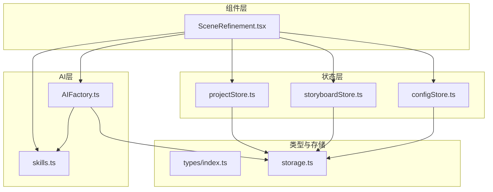
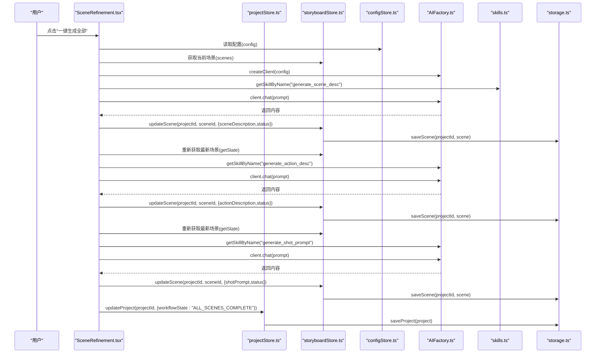
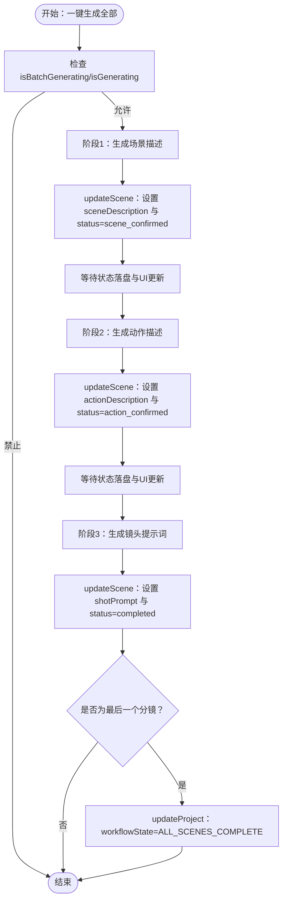
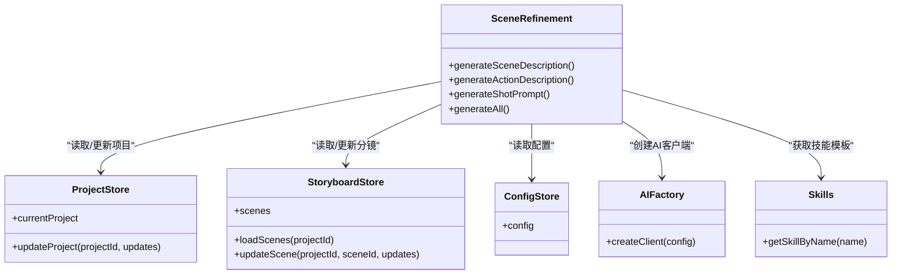
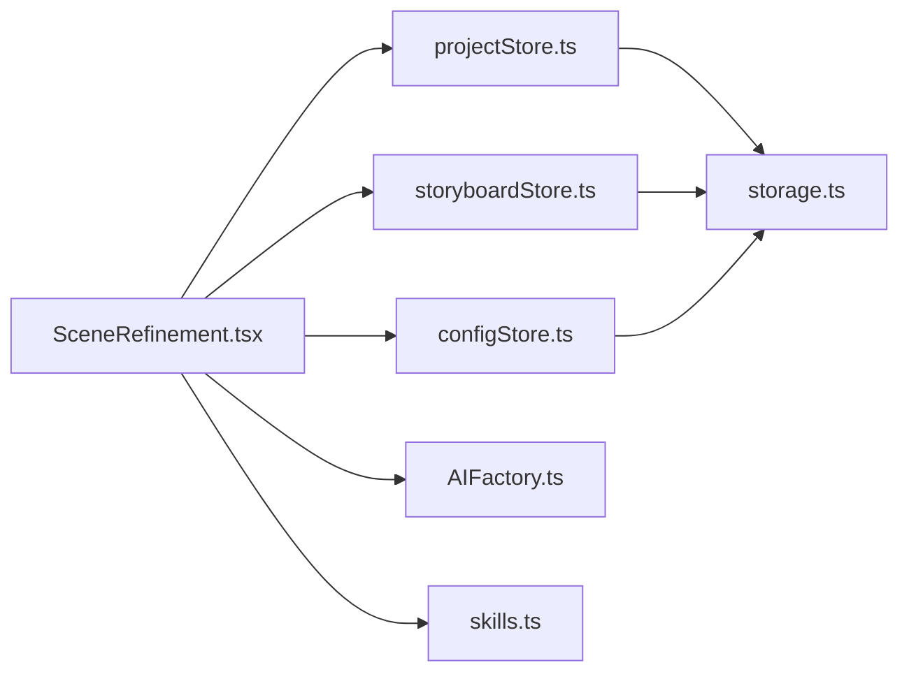

# 状态流集成测试

<cite>
**本文引用的文件**
- [SceneRefinement.tsx](file://manga-creator/src/components/editor/SceneRefinement.tsx)
- [SceneRefinement.test.tsx](file://manga-creator/src/components/editor/SceneRefinement.test.tsx)
- [projectStore.ts](file://manga-creator/src/stores/projectStore.ts)
- [storyboardStore.ts](file://manga-creator/src/stores/storyboardStore.ts)
- [configStore.ts](file://manga-creator/src/stores/configStore.ts)
- [factory.ts](file://manga-creator/src/lib/ai/factory.ts)
- [skills.ts](file://manga-creator/src/lib/ai/skills.ts)
- [storage.ts](file://manga-creator/src/lib/storage.ts)
- [index.ts](file://manga-creator/src/types/index.ts)
</cite>

## 目录
1. [引言](#引言)
2. [项目结构](#项目结构)
3. [核心组件](#核心组件)
4. [架构总览](#架构总览)
5. [详细组件分析](#详细组件分析)
6. [依赖分析](#依赖分析)
7. [性能考虑](#性能考虑)
8. [故障排查指南](#故障排查指南)
9. [结论](#结论)
10. [附录](#附录)

## 引言
本文件围绕 SceneRefinement 组件的状态流集成测试展开，重点解释其如何协调三个 Zustand 状态管理模块（projectStore、storyboardStore、configStore），并通过 AIFactory 创建 AI 客户端，将生成结果按顺序更新到分镜数据中（storyboardStore），同时在用户触发“一键生成全部”时，确保状态变更的原子性与一致性。文档结合 SceneRefinement.test.tsx 中的测试用例，说明 mock store 的实现方式、状态更新的验证方法（如 mockUpdateScene 调用次数与参数）、以及工作流状态（workflowState）与分镜状态（status）的逐级更新机制。

## 项目结构
- 组件层：SceneRefinement.tsx 负责 UI 交互与状态驱动的生成流程。
- 状态层：projectStore.ts、storyboardStore.ts、configStore.ts 提供项目、分镜与配置的全局状态。
- AI 层：AIFactory 根据配置选择具体 AI 提供商；skills.ts 定义生成任务所需的提示模板与上下文。
- 类型与存储：types/index.ts 定义数据结构；lib/storage.ts 实现本地持久化。

图表来源
- [SceneRefinement.tsx](file://manga-creator/src/components/editor/SceneRefinement.tsx#L1-L638)
- [projectStore.ts](file://manga-creator/src/stores/projectStore.ts#L1-L95)
- [storyboardStore.ts](file://manga-creator/src/stores/storyboardStore.ts#L1-L107)
- [configStore.ts](file://manga-creator/src/stores/configStore.ts#L1-L58)
- [factory.ts](file://manga-creator/src/lib/ai/factory.ts#L1-L54)
- [skills.ts](file://manga-creator/src/lib/ai/skills.ts#L1-L132)
- [storage.ts](file://manga-creator/src/lib/storage.ts#L1-L246)
- [index.ts](file://manga-creator/src/types/index.ts#L1-L351)

章节来源
- [SceneRefinement.tsx](file://manga-creator/src/components/editor/SceneRefinement.tsx#L1-L638)
- [projectStore.ts](file://manga-creator/src/stores/projectStore.ts#L1-L95)
- [storyboardStore.ts](file://manga-creator/src/stores/storyboardStore.ts#L1-L107)
- [configStore.ts](file://manga-creator/src/stores/configStore.ts#L1-L58)
- [factory.ts](file://manga-creator/src/lib/ai/factory.ts#L1-L54)
- [skills.ts](file://manga-creator/src/lib/ai/skills.ts#L1-L132)
- [storage.ts](file://manga-creator/src/lib/storage.ts#L1-L246)
- [index.ts](file://manga-creator/src/types/index.ts#L1-L351)

## 核心组件
- SceneRefinement：负责分镜细化的三阶段生成（场景描述、动作描述、镜头提示词），并在最后阶段更新项目工作流状态。
- projectStore：管理项目集合与当前项目，支持更新项目字段（含 workflowState）。
- storyboardStore：管理分镜集合，提供 loadScenes、updateScene 等方法，用于加载与更新分镜。
- configStore：管理用户 AI 配置（provider、apiKey、model），并提供连接测试能力。
- AIFactory：根据配置创建 AI 客户端，封装不同提供商的聊天接口。
- skills：定义生成任务的提示模板与上下文要求。

章节来源
- [SceneRefinement.tsx](file://manga-creator/src/components/editor/SceneRefinement.tsx#L1-L638)
- [projectStore.ts](file://manga-creator/src/stores/projectStore.ts#L1-L95)
- [storyboardStore.ts](file://manga-creator/src/stores/storyboardStore.ts#L1-L107)
- [configStore.ts](file://manga-creator/src/stores/configStore.ts#L1-L58)
- [factory.ts](file://manga-creator/src/lib/ai/factory.ts#L1-L54)
- [skills.ts](file://manga-creator/src/lib/ai/skills.ts#L1-L132)

## 架构总览
下图展示了从用户触发“一键生成全部”到最终状态落盘的端到端流程，包括三个 Zustand 状态模块与 AI 生成链路的协作。

图表来源
- [SceneRefinement.tsx](file://manga-creator/src/components/editor/SceneRefinement.tsx#L228-L291)
- [projectStore.ts](file://manga-creator/src/stores/projectStore.ts#L63-L81)
- [storyboardStore.ts](file://manga-creator/src/stores/storyboardStore.ts#L57-L69)
- [configStore.ts](file://manga-creator/src/stores/configStore.ts#L17-L57)
- [factory.ts](file://manga-creator/src/lib/ai/factory.ts#L44-L53)
- [skills.ts](file://manga-creator/src/lib/ai/skills.ts#L116-L131)
- [storage.ts](file://manga-creator/src/lib/storage.ts#L68-L84)
- [storage.ts](file://manga-creator/src/lib/storage.ts#L129-L145)

## 详细组件分析

### SceneRefinement 的状态流与原子性保障
- 读取项目基础设定：组件在挂载时从 projectStore 读取 currentProject，并通过 storyboardStore.loadScenes 初始化场景列表与当前索引。
- 获取 AI 配置：从 configStore 读取 config，作为 AIFactory.createClient 的输入。
- 协调三个阶段：
  - 场景描述生成：更新 sceneDescription 与 status 至 scene_confirmed。
  - 动作描述生成：基于上一阶段结果，更新 actionDescription 与 status 至 action_confirmed。
  - 镜头提示词生成：整合前两阶段结果，更新 shotPrompt 与 status 至 completed。
- 工作流状态推进：当最后一个分镜完成时，更新项目 workflowState 为 ALL_SCENES_COMPLETE。
- 原子性与一致性：
  - 每次 updateScene 调用都会同步写入本地存储，保证状态持久化。
  - 一键生成流程中，使用 getState 获取最新场景以确保后续阶段读取到已更新的数据。
  - 通过 isBatchGenerating/isGenerating 防止并发触发，保证 UI 与状态的一致。

章节来源
- [SceneRefinement.tsx](file://manga-creator/src/components/editor/SceneRefinement.tsx#L24-L41)
- [SceneRefinement.tsx](file://manga-creator/src/components/editor/SceneRefinement.tsx#L51-L100)
- [SceneRefinement.tsx](file://manga-creator/src/components/editor/SceneRefinement.tsx#L103-L149)
- [SceneRefinement.tsx](file://manga-creator/src/components/editor/SceneRefinement.tsx#L152-L207)
- [SceneRefinement.tsx](file://manga-creator/src/components/editor/SceneRefinement.tsx#L228-L291)
- [storyboardStore.ts](file://manga-creator/src/stores/storyboardStore.ts#L57-L69)
- [storage.ts](file://manga-creator/src/lib/storage.ts#L129-L145)

### 测试用例解析：mock store 的实现与验证
- mock store 的实现要点：
  - 使用 vi.mock 对三个 store 与 AIFactory、skills 进行模拟。
  - 通过 useStoryboardStore.getState 返回动态 scenesState，以便在每次 AI 调用后更新最新状态。
  - mockUpdateScene 在每次调用时修改内存中的 scenesState 并断言最终状态。
- 关键验证点：
  - 一键生成全部流程：验证 chat 被调用 3 次，updateScene 被调用 3 次，且每次调用的参数与 status 变更符合预期。
  - 防重复触发：快速点击两次，仅执行一次完整流程（3 次 API 调用）。
  - 错误处理：某阶段失败时显示错误信息。
  - UI 状态：生成中按钮显示“批量生成中...”，并处于禁用状态。
  - 已完成场景：若 status 已为 completed，则按钮禁用。
  - 最新状态读取：验证 useStoryboardStore.getState 被调用以获取最新场景。

章节来源
- [SceneRefinement.test.tsx](file://manga-creator/src/components/editor/SceneRefinement.test.tsx#L1-L353)

### 一键生成流程的时序与状态转换

图表来源
- [SceneRefinement.tsx](file://manga-creator/src/components/editor/SceneRefinement.tsx#L228-L291)
- [storyboardStore.ts](file://manga-creator/src/stores/storyboardStore.ts#L57-L69)
- [projectStore.ts](file://manga-creator/src/stores/projectStore.ts#L63-L81)

### 三阶段生成的类关系与职责

图表来源
- [SceneRefinement.tsx](file://manga-creator/src/components/editor/SceneRefinement.tsx#L1-L638)
- [projectStore.ts](file://manga-creator/src/stores/projectStore.ts#L1-L95)
- [storyboardStore.ts](file://manga-creator/src/stores/storyboardStore.ts#L1-L107)
- [configStore.ts](file://manga-creator/src/stores/configStore.ts#L1-L58)
- [factory.ts](file://manga-creator/src/lib/ai/factory.ts#L1-L54)
- [skills.ts](file://manga-creator/src/lib/ai/skills.ts#L1-L132)

## 依赖分析
- 组件对状态模块的依赖：
  - SceneRefinement 通过 useProjectStore/useStoryboardStore/useConfigStore 访问状态与方法。
  - 依赖关系清晰，耦合集中在状态读取与更新，UI 与业务逻辑分离。
- 外部依赖：
  - AIFactory 依赖 ProviderType 与 UserConfig，根据配置创建具体 AI 提供商实例。
  - skills.ts 提供生成任务的提示模板，决定上下文拼接与输出格式。
  - storage.ts 提供本地持久化，确保状态变更持久化。

图表来源
- [SceneRefinement.tsx](file://manga-creator/src/components/editor/SceneRefinement.tsx#L1-L638)
- [projectStore.ts](file://manga-creator/src/stores/projectStore.ts#L1-L95)
- [storyboardStore.ts](file://manga-creator/src/stores/storyboardStore.ts#L1-L107)
- [configStore.ts](file://manga-creator/src/stores/configStore.ts#L1-L58)
- [factory.ts](file://manga-creator/src/lib/ai/factory.ts#L1-L54)
- [skills.ts](file://manga-creator/src/lib/ai/skills.ts#L1-L132)
- [storage.ts](file://manga-creator/src/lib/storage.ts#L1-L246)

章节来源
- [SceneRefinement.tsx](file://manga-creator/src/components/editor/SceneRefinement.tsx#L1-L638)
- [projectStore.ts](file://manga-creator/src/stores/projectStore.ts#L1-L95)
- [storyboardStore.ts](file://manga-creator/src/stores/storyboardStore.ts#L1-L107)
- [configStore.ts](file://manga-creator/src/stores/configStore.ts#L1-L58)
- [factory.ts](file://manga-creator/src/lib/ai/factory.ts#L1-L54)
- [skills.ts](file://manga-creator/src/lib/ai/skills.ts#L1-L132)
- [storage.ts](file://manga-creator/src/lib/storage.ts#L1-L246)

## 性能考虑
- 避免不必要的重新渲染：
  - 将 SceneRefinement 设计为按需读取 store 的必要字段，减少订阅范围。
  - 使用局部状态（如 isGenerating、generatingStep、isBatchGenerating）控制 UI 更新粒度。
- 异步调用顺序与延迟：
  - 在每次 updateScene 后添加短暂延迟，确保状态落盘与 UI 更新完成，再进入下一阶段。
  - 使用 getState 获取最新场景，避免因 React 渲染时机导致的竞态。
- 存储写入开销：
  - 每次 updateScene/updateProject 都会写入本地存储，建议在批量操作中合并更新或减少频繁写入。
- 并发控制：
  - 通过 isBatchGenerating/isGenerating 防止重复触发，降低 UI 与状态抖动。

章节来源
- [SceneRefinement.tsx](file://manga-creator/src/components/editor/SceneRefinement.tsx#L228-L291)
- [storyboardStore.ts](file://manga-creator/src/stores/storyboardStore.ts#L57-L69)
- [projectStore.ts](file://manga-creator/src/stores/projectStore.ts#L63-L81)

## 故障排查指南
- 症状：状态未更新
  - 排查：确认 updateScene 是否被调用，mockUpdateScene 是否正确修改内存中的 scenesState。
  - 验证：在测试中断言 mockUpdateScene 调用次数与参数。
- 症状：异步调用顺序错误
  - 排查：检查一键生成流程中是否在每次阶段后等待状态落盘与 UI 更新。
  - 验证：使用 getState 获取最新场景，确保后续阶段读取到最新值。
- 症状：按钮未禁用或状态显示异常
  - 排查：检查 isBatchGenerating/isGenerating 与 canGenerate* 条件逻辑。
  - 验证：测试中断言按钮文本与禁用状态。
- 症状：工作流状态未推进
  - 排查：确认最后一个分镜完成后是否调用 updateProject 更新 workflowState。
  - 验证：断言 updateProject 被调用且传入正确的 workflowState。

章节来源
- [SceneRefinement.test.tsx](file://manga-creator/src/components/editor/SceneRefinement.test.tsx#L159-L353)
- [SceneRefinement.tsx](file://manga-creator/src/components/editor/SceneRefinement.tsx#L228-L291)

## 结论
SceneRefinement 通过明确的三阶段生成流程与严格的并发控制，实现了从项目基础设定到分镜状态的逐级推进，并在最后一个分镜完成后将项目工作流状态推进至完成态。测试用例覆盖了关键路径：一键生成的原子性、防重复触发、错误处理、UI 状态与最终状态落盘。借助 mock store 与 getState 的配合，测试能够准确验证状态变更的正确性与时序。

## 附录
- 关键类型与状态枚举定义可参考 types/index.ts，其中包含 WorkflowState、SceneStatus、TaskType 等。
- 本地存储实现位于 storage.ts，确保项目、分镜与配置的持久化。

章节来源
- [index.ts](file://manga-creator/src/types/index.ts#L1-L351)
- [storage.ts](file://manga-creator/src/lib/storage.ts#L1-L246)