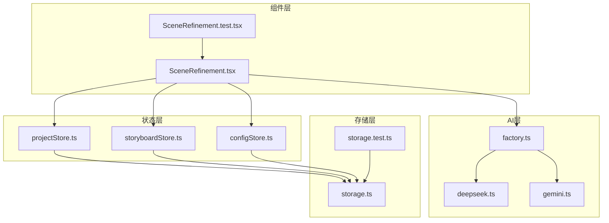
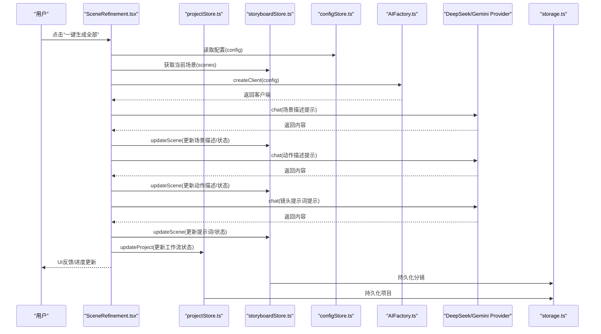
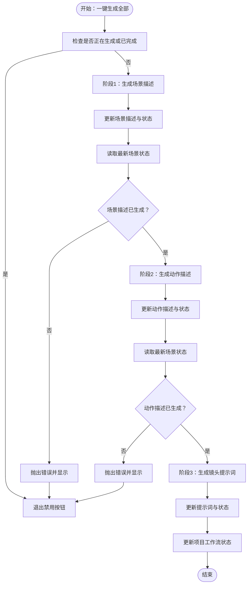
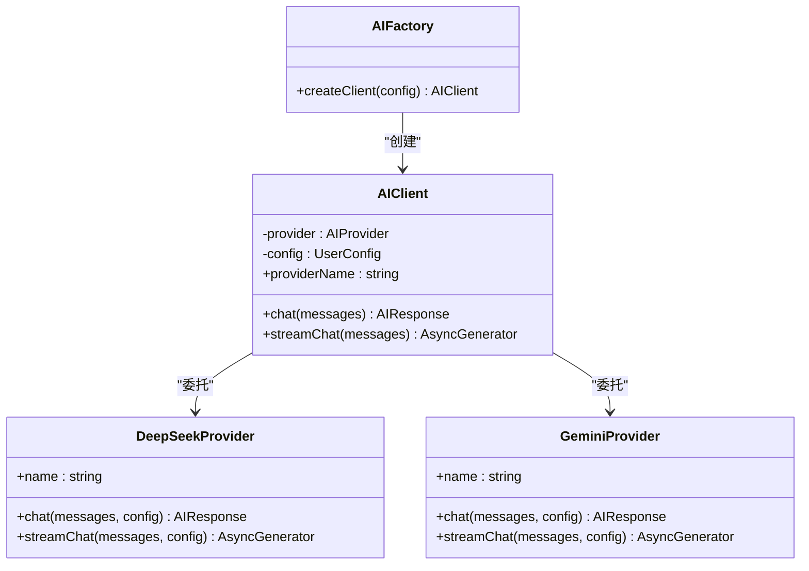
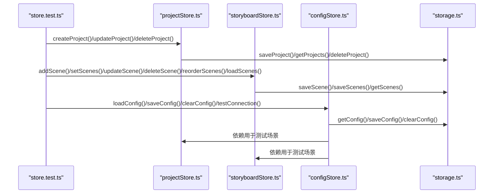
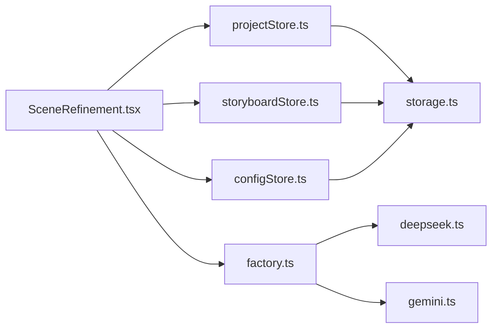

# 集成测试

<cite>
**本文引用的文件**
- [SceneRefinement.test.tsx](file://manga-creator/src/components/editor/SceneRefinement.test.tsx)
- [SceneRefinement.tsx](file://manga-creator/src/components/editor/SceneRefinement.tsx)
- [factory.test.ts](file://manga-creator/src/lib/ai/factory.test.ts)
- [factory.ts](file://manga-creator/src/lib/ai/factory.ts)
- [deepseek.ts](file://manga-creator/src/lib/ai/providers/deepseek.ts)
- [gemini.ts](file://manga-creator/src/lib/ai/providers/gemini.ts)
- [store.test.ts](file://manga-creator/src/stores/store.test.ts)
- [projectStore.ts](file://manga-creator/src/stores/projectStore.ts)
- [storyboardStore.ts](file://manga-creator/src/stores/storyboardStore.ts)
- [configStore.ts](file://manga-creator/src/stores/configStore.ts)
- [storage.test.ts](file://manga-creator/src/lib/storage.test.ts)
- [storage.ts](file://manga-creator/src/lib/storage.ts)
</cite>

## 目录
1. [简介](#简介)
2. [项目结构](#项目结构)
3. [核心组件](#核心组件)
4. [架构总览](#架构总览)
5. [详细组件分析](#详细组件分析)
6. [依赖关系分析](#依赖关系分析)
7. [性能考量](#性能考量)
8. [故障排查指南](#故障排查指南)
9. [结论](#结论)
10. [附录](#附录)

## 简介
本文件围绕“集成测试策略”目标，系统梳理并验证以下关键路径：
- 编辑器组件如何协调 projectStore、storyboardStore 与 configStore，配合 AIFactory 与 AI Provider，完成“一键生成全部”的端到端流程；
- AI 工厂与具体 Provider（DeepSeek、Gemini）的集成测试，覆盖 chat 与 streamChat 的请求构造、响应解析与错误处理；
- 状态管理模块与 lib/storage 的集成测试，验证项目与分镜数据的持久化与读取，确保应用重启后可恢复工作状态。

测试策略覆盖正常流程、异常处理与边界情况，以保障系统整体稳定性与一致性。

## 项目结构
围绕本次集成测试，涉及的关键目录与文件如下：
- 组件层：编辑器组件 SceneRefinement 及其测试 SceneRefinement.test.tsx
- 状态层：projectStore、storyboardStore、configStore
- AI 层：AIFactory、DeepSeekProvider、GeminiProvider
- 存储层：lib/storage 及其测试 lib/storage.test.ts

图表来源
- [SceneRefinement.tsx](file://manga-creator/src/components/editor/SceneRefinement.tsx#L1-L638)
- [SceneRefinement.test.tsx](file://manga-creator/src/components/editor/SceneRefinement.test.tsx#L1-L353)
- [projectStore.ts](file://manga-creator/src/stores/projectStore.ts#L1-L95)
- [storyboardStore.ts](file://manga-creator/src/stores/storyboardStore.ts#L1-L107)
- [configStore.ts](file://manga-creator/src/stores/configStore.ts#L1-L58)
- [factory.ts](file://manga-creator/src/lib/ai/factory.ts#L1-L54)
- [deepseek.ts](file://manga-creator/src/lib/ai/providers/deepseek.ts#L1-L110)
- [gemini.ts](file://manga-creator/src/lib/ai/providers/gemini.ts#L1-L138)
- [storage.ts](file://manga-creator/src/lib/storage.ts#L1-L246)
- [storage.test.ts](file://manga-creator/src/lib/storage.test.ts#L1-L946)

章节来源
- [SceneRefinement.tsx](file://manga-creator/src/components/editor/SceneRefinement.tsx#L1-L638)
- [SceneRefinement.test.tsx](file://manga-creator/src/components/editor/SceneRefinement.test.tsx#L1-L353)
- [factory.ts](file://manga-creator/src/lib/ai/factory.ts#L1-L54)
- [deepseek.ts](file://manga-creator/src/lib/ai/providers/deepseek.ts#L1-L110)
- [gemini.ts](file://manga-creator/src/lib/ai/providers/gemini.ts#L1-L138)
- [projectStore.ts](file://manga-creator/src/stores/projectStore.ts#L1-L95)
- [storyboardStore.ts](file://manga-creator/src/stores/storyboardStore.ts#L1-L107)
- [configStore.ts](file://manga-creator/src/stores/configStore.ts#L1-L58)
- [storage.ts](file://manga-creator/src/lib/storage.ts#L1-L246)
- [storage.test.ts](file://manga-creator/src/lib/storage.test.ts#L1-L946)

## 核心组件
- 编辑器组件 SceneRefinement：负责三阶段生成（场景描述、动作描述、镜头提示词），并在一键生成全部时串行调用各阶段，同时与 stores 协作更新状态与 UI。
- 状态管理：
  - projectStore：项目生命周期管理（创建、更新、删除、加载），与 storage 交互。
  - storyboardStore：分镜集合管理（增删改查、重排、批量设置、加载），与 storage 交互。
  - configStore：AI 配置管理与连接测试，基于 AIFactory 创建客户端。
- AI 工厂与 Provider：
  - AIFactory：根据配置创建对应 Provider 客户端；提供 chat 与 streamChat 接口。
  - DeepSeekProvider、GeminiProvider：分别实现 HTTP 请求构建、响应解析与错误处理。
- 存储层 storage：封装 localStorage 的项目、分镜、配置的读写、导出导入与清理。

章节来源
- [SceneRefinement.tsx](file://manga-creator/src/components/editor/SceneRefinement.tsx#L1-L638)
- [projectStore.ts](file://manga-creator/src/stores/projectStore.ts#L1-L95)
- [storyboardStore.ts](file://manga-creator/src/stores/storyboardStore.ts#L1-L107)
- [configStore.ts](file://manga-creator/src/stores/configStore.ts#L1-L58)
- [factory.ts](file://manga-creator/src/lib/ai/factory.ts#L1-L54)
- [deepseek.ts](file://manga-creator/src/lib/ai/providers/deepseek.ts#L1-L110)
- [gemini.ts](file://manga-creator/src/lib/ai/providers/gemini.ts#L1-L138)
- [storage.ts](file://manga-creator/src/lib/storage.ts#L1-L246)

## 架构总览
下图展示“一键生成全部”的端到端流程，包括编辑器组件、状态管理与 AI 工厂/Provider 的协作关系。

图表来源
- [SceneRefinement.tsx](file://manga-creator/src/components/editor/SceneRefinement.tsx#L228-L291)
- [projectStore.ts](file://manga-creator/src/stores/projectStore.ts#L63-L81)
- [storyboardStore.ts](file://manga-creator/src/stores/storyboardStore.ts#L57-L68)
- [configStore.ts](file://manga-creator/src/stores/configStore.ts#L45-L56)
- [factory.ts](file://manga-creator/src/lib/ai/factory.ts#L44-L53)
- [deepseek.ts](file://manga-creator/src/lib/ai/providers/deepseek.ts#L29-L57)
- [gemini.ts](file://manga-creator/src/lib/ai/providers/gemini.ts#L58-L88)
- [storage.ts](file://manga-creator/src/lib/storage.ts#L68-L84)

## 详细组件分析

### 编辑器组件：SceneRefinement 的集成测试
- 目标：验证编辑器如何协调三个状态模块与 AI 客户端，完成一键生成全部的顺序流程。
- 关键点：
  - 读取当前项目与分镜列表，依据工作流状态决定是否允许一键生成。
  - 通过 AIFactory.createClient(config) 获取客户端，按阶段调用 chat。
  - 每阶段完成后调用 storyboardStore.updateScene 更新场景字段与状态。
  - 最后阶段完成后调用 projectStore.updateProject 更新工作流状态。
  - 防重复点击：isBatchGenerating 与 isGenerating 控制 UI 禁用与文案切换。
  - 异常处理：捕获错误并显示错误信息；finally 中重置状态。
  - 状态一致性：在第二、三阶段前通过 useStoryboardStore.getState() 读取最新场景，确保上下文连续。

图表来源
- [SceneRefinement.tsx](file://manga-creator/src/components/editor/SceneRefinement.tsx#L228-L291)
- [SceneRefinement.test.tsx](file://manga-creator/src/components/editor/SceneRefinement.test.tsx#L159-L215)

章节来源
- [SceneRefinement.tsx](file://manga-creator/src/components/editor/SceneRefinement.tsx#L228-L291)
- [SceneRefinement.test.tsx](file://manga-creator/src/components/editor/SceneRefinement.test.tsx#L159-L215)

### AI 工厂与 Provider 集成测试
- 目标：验证 AIFactory 与 DeepSeek、Gemini Provider 的集成，确保 chat 与 streamChat 正确构造 HTTP 请求、处理不同格式的 API 响应并统一返回标准化结果。
- 关键点：
  - createAIProvider 根据 provider 类型返回对应 Provider 实例。
  - AIFactory.createClient 在配置缺失时抛出错误；成功时返回 AIClient。
  - DeepSeekProvider/GeminiProvider 的 chat/ streamChat：
    - 构造 URL、Headers、Body；
    - 解析 choices/delta 或 candidates.parts 等字段；
    - 统一返回 { content, tokenUsage? }；
    - 对非 2xx 响应抛出带状态码与详情的错误；
    - 流式响应处理 SSE，逐行解析 data: JSON，直到 [DONE]。
  - 测试覆盖：
    - 配置校验（缺失 provider/apiKey/model）；
    - chat 正常响应、多消息、错误与网络异常；
    - streamChat 返回 AsyncGenerator、无 body 抛错；
    - 不同 provider 名称与 baseURL；
    - 边界：空消息、超长内容、特殊字符、emoji、中文、500/429、自定义 baseURL、token 使用量解析等。

图表来源
- [factory.ts](file://manga-creator/src/lib/ai/factory.ts#L1-L54)
- [deepseek.ts](file://manga-creator/src/lib/ai/providers/deepseek.ts#L1-L110)
- [gemini.ts](file://manga-creator/src/lib/ai/providers/gemini.ts#L1-L138)

章节来源
- [factory.test.ts](file://manga-creator/src/lib/ai/factory.test.ts#L1-L595)
- [factory.ts](file://manga-creator/src/lib/ai/factory.ts#L1-L54)
- [deepseek.ts](file://manga-creator/src/lib/ai/providers/deepseek.ts#L1-L110)
- [gemini.ts](file://manga-creator/src/lib/ai/providers/gemini.ts#L1-L138)

### 状态管理与存储集成测试
- 目标：验证 projectStore、storyboardStore、configStore 与 lib/storage 的集成，确保项目与分镜数据的持久化与读取流程稳定可靠。
- 关键点：
  - projectStore：
    - create/update/delete/load/setCurrentProject；
    - 自动设置 createdAt/updatedAt；
    - 与 storage 的 saveProject/getProjects/deleteProject 协作。
  - storyboardStore：
    - addScene/setScenes/updateScene/deleteScene/reorderScenes/loadScenes/setCurrentScene/setGenerating；
    - setScenes 会重新编号并持久化；
    - deleteScene 后自动重排。
  - configStore：
    - load/save/clearConfig/testConnection；
    - testConnection 通过 AIFactory.createClient(config) 发送 ping 消息。
  - storage：
    - 项目/分镜/配置的读写、导出导入、清理；
    - 加密存储 API 配置；
    - 版本初始化与迁移；
    - getStorageUsage 计算 aixs 前缀数据大小。

图表来源
- [store.test.ts](file://manga-creator/src/stores/store.test.ts#L1-L971)
- [projectStore.ts](file://manga-creator/src/stores/projectStore.ts#L1-L95)
- [storyboardStore.ts](file://manga-creator/src/stores/storyboardStore.ts#L1-L107)
- [configStore.ts](file://manga-creator/src/stores/configStore.ts#L1-L58)
- [storage.ts](file://manga-creator/src/lib/storage.ts#L1-L246)

章节来源
- [store.test.ts](file://manga-creator/src/stores/store.test.ts#L1-L971)
- [projectStore.ts](file://manga-creator/src/stores/projectStore.ts#L1-L95)
- [storyboardStore.ts](file://manga-creator/src/stores/storyboardStore.ts#L1-L107)
- [configStore.ts](file://manga-creator/src/stores/configStore.ts#L1-L58)
- [storage.ts](file://manga-creator/src/lib/storage.ts#L1-L246)

## 依赖关系分析
- 组件到状态：SceneRefinement 依赖 useProjectStore/useStoryboardStore/useConfigStore。
- 状态到存储：projectStore/storyboardStore/configStore 依赖 storage.ts。
- AI 工厂到 Provider：AIFactory.createClient -> createAIProvider -> DeepSeek/Gemini。
- 测试到实现：SceneRefinement.test.tsx 通过 vi.mock 伪造 stores 与 AIFactory/skills；store.test.ts 通过 vi.mock 伪造 storage；factory.test.ts 通过 vi.spyOn globalThis.fetch 驱动 Provider 行为。

图表来源
- [SceneRefinement.tsx](file://manga-creator/src/components/editor/SceneRefinement.tsx#L1-L638)
- [projectStore.ts](file://manga-creator/src/stores/projectStore.ts#L1-L95)
- [storyboardStore.ts](file://manga-creator/src/stores/storyboardStore.ts#L1-L107)
- [configStore.ts](file://manga-creator/src/stores/configStore.ts#L1-L58)
- [factory.ts](file://manga-creator/src/lib/ai/factory.ts#L1-L54)
- [deepseek.ts](file://manga-creator/src/lib/ai/providers/deepseek.ts#L1-L110)
- [gemini.ts](file://manga-creator/src/lib/ai/providers/gemini.ts#L1-L138)
- [storage.ts](file://manga-creator/src/lib/storage.ts#L1-L246)

章节来源
- [SceneRefinement.tsx](file://manga-creator/src/components/editor/SceneRefinement.tsx#L1-L638)
- [factory.ts](file://manga-creator/src/lib/ai/factory.ts#L1-L54)
- [storage.ts](file://manga-creator/src/lib/storage.ts#L1-L246)

## 性能考量
- 网络请求与流式处理：
  - Provider 的 chat/ streamChat 依赖 fetch，需关注超时与重试策略（当前测试未覆盖重试，建议在生产中引入）。
  - 流式响应按行解析，注意大块数据的内存占用与解码开销。
- 状态更新与渲染：
  - 一键生成全部采用串行阶段更新，避免并发写入导致的状态竞争；但可能影响整体耗时。
  - 使用 useStoryboardStore.getState() 读取最新场景，确保上下文连续，但频繁读取可能带来额外开销。
- 存储层：
  - localStorage 读写为同步操作，大量数据时可能阻塞 UI；建议在批量操作时合并更新与持久化。
  - getStorageUsage 仅统计 aixs 前缀数据，避免误判非业务数据。

[本节为通用指导，无需列出具体文件来源]

## 故障排查指南
- 一键生成失败：
  - 检查 configStore 是否已配置且 isConfigured 为 true。
  - 查看 SceneRefinement 的错误提示与控制台日志。
  - 确认各阶段前置条件满足（例如场景描述生成后才允许动作描述）。
- Provider 错误：
  - 401/403：确认 apiKey 正确与权限范围。
  - 429/500：等待重试或调整速率限制。
  - 网络异常：检查网络连通性与代理设置。
- 状态不一致：
  - 确认 storyboardStore.updateScene 是否被调用且持久化成功。
  - 检查 projectStore.updateProject 是否更新了 workflowState。
- 存储异常：
  - 配置损坏：clearConfig 后重新保存。
  - 数据导入失败：检查 JSON 格式与字段完整性。

章节来源
- [SceneRefinement.test.tsx](file://manga-creator/src/components/editor/SceneRefinement.test.tsx#L255-L276)
- [factory.test.ts](file://manga-creator/src/lib/ai/factory.test.ts#L159-L178)
- [storage.test.ts](file://manga-creator/src/lib/storage.test.ts#L198-L210)

## 结论
通过上述测试策略与组件分析，系统在以下方面得到验证：
- 编辑器组件与三个状态模块协同工作，能够正确读取项目基础设定、获取 AI 配置、调用 AIFactory 创建客户端，并按顺序更新分镜数据。
- AI 工厂与 Provider 的集成测试覆盖了请求构造、响应解析与错误处理，确保不同 Provider 的兼容性与稳定性。
- 状态管理与存储的集成测试验证了项目与分镜数据的持久化与读取流程，具备基本的边界与异常处理能力。

建议后续增强：
- 在生产环境中引入重试与超时机制；
- 扩展集成测试覆盖更多 Provider 与真实 API；
- 对一键生成流程增加并发优化与进度回调。

[本节为总结性内容，无需列出具体文件来源]

## 附录
- 测试用例清单（按文件归类）：
  - SceneRefinement.test.tsx：一键生成全部、防重复点击、错误提示、状态显示、已完成按钮禁用、最新状态读取。
  - factory.test.ts：createAIProvider、AIFactory.createClient 配置校验、chat/streamChat 正常/异常/边界测试。
  - store.test.ts：projectStore/storyboardStore/configStore 的 CRUD、加载、设置当前项、生成状态、连接测试。
  - storage.test.ts：加密/解密、版本初始化、配置读写、项目/分镜 CRUD、导出导入、清理与存储用量。

章节来源
- [SceneRefinement.test.tsx](file://manga-creator/src/components/editor/SceneRefinement.test.tsx#L159-L353)
- [factory.test.ts](file://manga-creator/src/lib/ai/factory.test.ts#L1-L595)
- [store.test.ts](file://manga-creator/src/stores/store.test.ts#L1-L971)
- [storage.test.ts](file://manga-creator/src/lib/storage.test.ts#L1-L946)