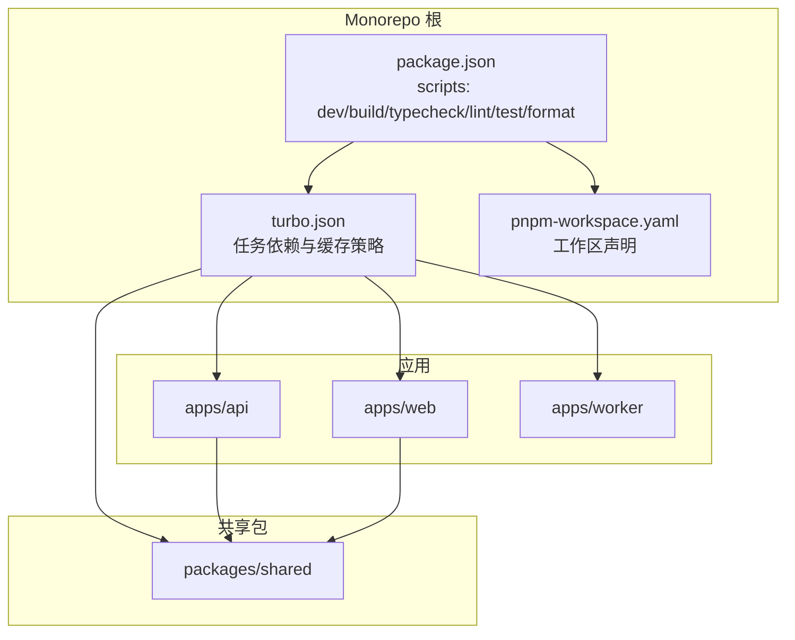
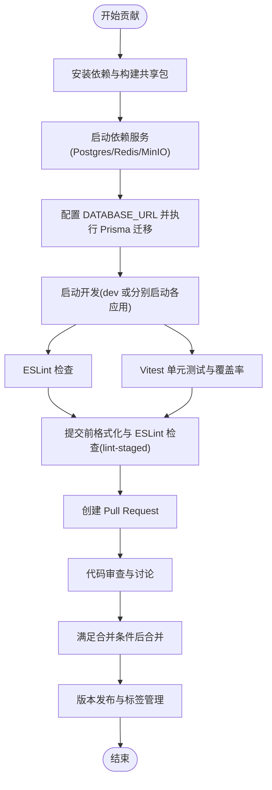
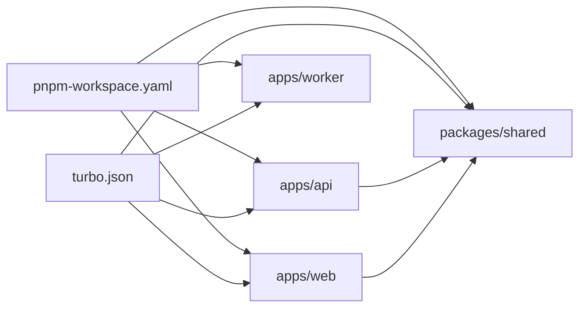

# 贡献流程

<cite>
**本文档引用的文件**
- [README.md](file://README.md)
- [package.json](file://package.json)
- [turbo.json](file://turbo.json)
- [pnpm-workspace.yaml](file://pnpm-workspace.yaml)
- [lint-staged.config.js](file://lint-staged.config.js)
- [docker-compose.dev.yml](file://docker-compose.dev.yml)
- [apps/api/ENVIRONMENT.md](file://apps/api/ENVIRONMENT.md)
- [apps/worker/ENVIRONMENT.md](file://apps/worker/ENVIRONMENT.md)
- [apps/api/vitest.config.ts](file://apps/api/vitest.config.ts)
- [apps/web/vitest.config.ts](file://apps/web/vitest.config.ts)
- [packages/shared/vitest.config.ts](file://packages/shared/vitest.config.ts)
- [apps/api/eslint.config.js](file://apps/api/eslint.config.js)
- [apps/web/eslint.config.js](file://apps/web/eslint.config.js)
</cite>

## 目录

1. [简介](#简介)
2. [项目结构](#项目结构)
3. [核心组件](#核心组件)
4. [架构总览](#架构总览)
5. [详细组件分析](#详细组件分析)
6. [依赖关系分析](#依赖关系分析)
7. [性能考虑](#性能考虑)
8. [故障排查指南](#故障排查指南)
9. [结论](#结论)
10. [附录](#附录)

## 简介

本文件为 AIXSSS 项目的贡献流程与开发规范文档，面向希望参与本项目的开发者，覆盖从环境搭建、本地开发、代码质量与测试、到 Pull Request 流程、Issue 规范、版本发布与标签管理、以及持续集成与自动化测试的全流程说明。文档同时提供行为准则与沟通指南，帮助贡献者高效协作。

## 项目结构

AIXSSS 采用 pnpm workspace + Turbo 的 monorepo 结构，主要包含三个应用与一个共享包：

- apps/web：React + Vite 前端应用
- apps/api：NestJS API 应用（鉴权、项目/分镜存储、队列化工作流）
- apps/worker：基于 BullMQ 的 Worker 应用（执行 AI 任务）
- packages/shared：前后端共享类型与 Zod Schema
- docs：工程/审计/迁移文档

图表来源

- [package.json](file://package.json#L7-L22)
- [turbo.json](file://turbo.json#L4-L27)
- [pnpm-workspace.yaml](file://pnpm-workspace.yaml#L1-L3)

章节来源

- [README.md](file://README.md#L63-L73)
- [pnpm-workspace.yaml](file://pnpm-workspace.yaml#L1-L3)
- [turbo.json](file://turbo.json#L1-L29)

## 核心组件

- 开发与构建
  - 使用 pnpm 作为包管理器，Turbo 管理跨包任务依赖与缓存
  - 顶层脚本统一入口：dev、build、typecheck、lint、test、format、format:check
- 代码质量与格式化
  - ESLint 配置：apps/api 与 apps/web 分别提供 TypeScript 规则集
  - Prettier 通过 lint-staged 在提交前检查格式
- 测试
  - Vitest 配置：apps/api、apps/web、packages/shared 各自独立配置，覆盖单元测试与覆盖率
- 本地依赖服务
  - Docker Compose 提供 Postgres、Redis、MinIO 三类依赖服务

章节来源

- [package.json](file://package.json#L7-L22)
- [turbo.json](file://turbo.json#L4-L27)
- [lint-staged.config.js](file://lint-staged.config.js#L6-L34)
- [apps/api/eslint.config.js](file://apps/api/eslint.config.js#L1-L21)
- [apps/web/eslint.config.js](file://apps/web/eslint.config.js#L1-L34)
- [apps/api/vitest.config.ts](file://apps/api/vitest.config.ts#L1-L12)
- [apps/web/vitest.config.ts](file://apps/web/vitest.config.ts#L1-L47)
- [packages/shared/vitest.config.ts](file://packages/shared/vitest.config.ts#L1-L12)
- [docker-compose.dev.yml](file://docker-compose.dev.yml#L1-L35)

## 架构总览

下图展示了本地开发与贡献流程的关键节点：环境准备、依赖服务、数据库迁移、开发启动、代码质量与测试、以及提交与 PR 流程。

图表来源

- [README.md](file://README.md#L7-L61)
- [docker-compose.dev.yml](file://docker-compose.dev.yml#L1-L35)
- [apps/api/ENVIRONMENT.md](file://apps/api/ENVIRONMENT.md#L1-L31)
- [apps/worker/ENVIRONMENT.md](file://apps/worker/ENVIRONMENT.md#L1-L25)
- [lint-staged.config.js](file://lint-staged.config.js#L6-L34)
- [apps/api/vitest.config.ts](file://apps/api/vitest.config.ts#L1-L12)
- [apps/web/vitest.config.ts](file://apps/web/vitest.config.ts#L1-L47)
- [packages/shared/vitest.config.ts](file://packages/shared/vitest.config.ts#L1-L12)

## 详细组件分析

### Git 工作流程与分支策略

- 分支命名
  - feature/\*：功能开发分支
  - fix/\*：缺陷修复分支
  - chore/\*：杂项/维护分支
  - docs/\*：文档更新分支
- 分支推送与保护
  - 严禁直接推送至 main 分支
  - 通过 Pull Request 合并，遵循代码审查与测试要求
- release 分支管理
  - 建议在发布前创建 release/x.y 分支进行回归测试与变更日志核对
  - 发布后合并回 main，并打上语义化标签 vMAJOR.MINOR.PATCH

章节来源

- [README.md](file://README.md#L1-L92)

### Pull Request 流程、代码审查与合并标准

- PR 要求
  - 必须关联 Issue 或明确需求背景
  - 包含清晰的变更说明与测试要点
  - 通过所有本地测试与格式化检查
- 代码审查
  - 至少一名维护者批准
  - 关注点：代码正确性、可维护性、性能影响、安全与隐私（如涉及 API Key）
- 合并标准
  - 通过 CI（如存在）与本地测试
  - 无未解决的审查意见
  - 通过 lint-staged 格式化检查
  - 合并后清理分支

章节来源

- [lint-staged.config.js](file://lint-staged.config.js#L6-L34)
- [apps/api/vitest.config.ts](file://apps/api/vitest.config.ts#L1-L12)
- [apps/web/vitest.config.ts](file://apps/web/vitest.config.ts#L1-L47)
- [packages/shared/vitest.config.ts](file://packages/shared/vitest.config.ts#L1-L12)

### Issue 报告规范、Bug 修复流程与功能开发流程

- Issue 规范
  - 标题简洁明确，描述问题复现步骤、期望结果与实际结果
  - Bug 提交需包含环境信息（操作系统、浏览器/Node 版本、依赖版本）
  - 功能请求需说明使用场景与验收标准
- Bug 修复流程
  - 新建 fix/\* 分支，编写最小可复现测试
  - 修复后提交 PR，关联 Issue
- 功能开发流程
  - 新建 feature/\* 分支，先设计小步快跑的迭代计划
  - 每个功能点完成后提交 PR，保持与主干同步

章节来源

- [README.md](file://README.md#L1-L92)

### 版本发布流程、标签管理与变更日志维护

- 发布流程
  - 在 release 分支完成回归测试与变更核对
  - 更新版本号与变更日志，打上语义化标签 vMAJOR.MINOR.PATCH
  - 合并回 main，必要时回放到 hotfix 分支
- 标签管理
  - 仅维护者可推送标签
  - 标签名与版本号保持一致
- 变更日志
  - 采用按功能/修复维度的变更记录，便于用户理解影响范围

章节来源

- [README.md](file://README.md#L1-L92)

### 开发环境设置、依赖安装与本地测试要求

- 依赖安装与构建
  - 安装依赖：使用 pnpm
  - 构建共享包：在根目录执行构建共享包命令
- 依赖服务
  - 使用 Docker Compose 启动 Postgres、Redis、MinIO
- 环境变量
  - API 与 Worker 各自提供环境变量说明与示例
- 数据库迁移
  - 首次运行前配置 DATABASE_URL 并执行迁移
- 启动开发
  - 顶层 dev 或分别启动各应用
- 本地测试
  - apps/api、apps/web、packages/shared 均有 Vitest 配置
  - 前端测试覆盖率阈值为行/函数/语句/分支不低于指定百分比

章节来源

- [README.md](file://README.md#L7-L61)
- [apps/api/ENVIRONMENT.md](file://apps/api/ENVIRONMENT.md#L1-L31)
- [apps/worker/ENVIRONMENT.md](file://apps/worker/ENVIRONMENT.md#L1-L25)
- [docker-compose.dev.yml](file://docker-compose.dev.yml#L1-L35)
- [apps/api/vitest.config.ts](file://apps/api/vitest.config.ts#L1-L12)
- [apps/web/vitest.config.ts](file://apps/web/vitest.config.ts#L22-L32)
- [packages/shared/vitest.config.ts](file://packages/shared/vitest.config.ts#L1-L12)

### 行为准则与沟通指南

- 尊重与包容：营造开放、尊重、包容的社区氛围
- 明确沟通：PR 与 Issue 中提供充分上下文与背景
- 积极反馈：建设性地提出修改意见，避免人身攻击
- 遵守法律与许可：遵守 PolyForm Noncommercial 1.0.0 许可条款，商业用途需另行授权

章节来源

- [README.md](file://README.md#L84-L92)

### 持续集成与自动化测试要求

- 提交前检查
  - lint-staged 对 staged 文件执行 ESLint 与 Prettier 校验
- 任务编排
  - Turbo 统一管理 dev/build/typecheck/lint/test/format 任务，支持跨包依赖与缓存
- 测试与覆盖率
  - 各应用与共享包均配置 Vitest，前端设置覆盖率阈值
- 建议的 CI 能力
  - 在 CI 中执行：lint、typecheck、test、format:check
  - 上传覆盖率报告，确保阈值达标

章节来源

- [lint-staged.config.js](file://lint-staged.config.js#L6-L34)
- [turbo.json](file://turbo.json#L4-L27)
- [apps/api/vitest.config.ts](file://apps/api/vitest.config.ts#L1-L12)
- [apps/web/vitest.config.ts](file://apps/web/vitest.config.ts#L22-L32)
- [packages/shared/vitest.config.ts](file://packages/shared/vitest.config.ts#L1-L12)

## 依赖关系分析

- 包管理与任务编排
  - pnpm workspace 管理多包依赖
  - Turbo 定义任务依赖链，确保构建顺序与缓存命中
- 应用间依赖
  - apps/api 与 apps/web 依赖 packages/shared
- 本地服务依赖
  - apps/api 与 apps/worker 共享 DATABASE_URL、REDIS_URL、API_KEY_ENCRYPTION_KEY 等配置

图表来源

- [pnpm-workspace.yaml](file://pnpm-workspace.yaml#L1-L3)
- [turbo.json](file://turbo.json#L4-L27)

章节来源

- [pnpm-workspace.yaml](file://pnpm-workspace.yaml#L1-L3)
- [turbo.json](file://turbo.json#L4-L27)

## 性能考虑

- 本地开发
  - 使用 Turbo 的 persistent dev 任务减少冷启动时间
  - 合理设置 Worker 并发与队列参数，避免资源争用
- 测试与覆盖率
  - 前端测试在 CI 中适当放宽超时，避免误判
  - 逐步提升覆盖率阈值，防止回退
- 代码质量
  - ESLint 规则逐步收紧，降低噪音，提升可维护性

章节来源

- [turbo.json](file://turbo.json#L5-L7)
- [apps/web/vitest.config.ts](file://apps/web/vitest.config.ts#L18-L21)
- [apps/web/eslint.config.js](file://apps/web/eslint.config.js#L20-L31)

## 故障排查指南

- 依赖服务连接异常
  - 若 localhost 解析为 IPv6 导致连接失败，请优先使用 127.0.0.1
- 数据库迁移失败
  - 确认 DATABASE_URL 正确，先执行迁移再启动应用
- 测试失败
  - 检查本地测试覆盖率阈值与超时设置
  - 确保共享包已构建后再启动 API 服务
- 提交被拒绝
  - 确保通过 lint-staged 的 ESLint 与 Prettier 校验

章节来源

- [apps/api/ENVIRONMENT.md](file://apps/api/ENVIRONMENT.md#L28-L28)
- [apps/worker/ENVIRONMENT.md](file://apps/worker/ENVIRONMENT.md#L22-L22)
- [README.md](file://README.md#L35-L47)
- [apps/web/vitest.config.ts](file://apps/web/vitest.config.ts#L22-L32)
- [lint-staged.config.js](file://lint-staged.config.js#L6-L34)

## 结论

本贡献流程文档基于现有仓库配置与最佳实践制定，覆盖从环境搭建到发布与维护的全流程。建议贡献者严格遵循分支策略、PR 流程与代码质量规范，确保协作效率与项目稳定性。随着项目演进，流程与规范可根据团队共识持续优化。

## 附录

- 快速参考
  - 安装与构建：使用 pnpm，先构建共享包
  - 启动依赖服务：Docker Compose
  - 数据库迁移：配置 DATABASE_URL 后执行迁移
  - 启动开发：顶层 dev 或分别启动各应用
  - 提交前检查：lint-staged 自动执行 ESLint 与 Prettier
  - 测试：各应用独立配置 Vitest，关注覆盖率阈值

章节来源

- [README.md](file://README.md#L7-L61)
- [docker-compose.dev.yml](file://docker-compose.dev.yml#L1-L35)
- [lint-staged.config.js](file://lint-staged.config.js#L6-L34)
- [apps/web/vitest.config.ts](file://apps/web/vitest.config.ts#L22-L32)
