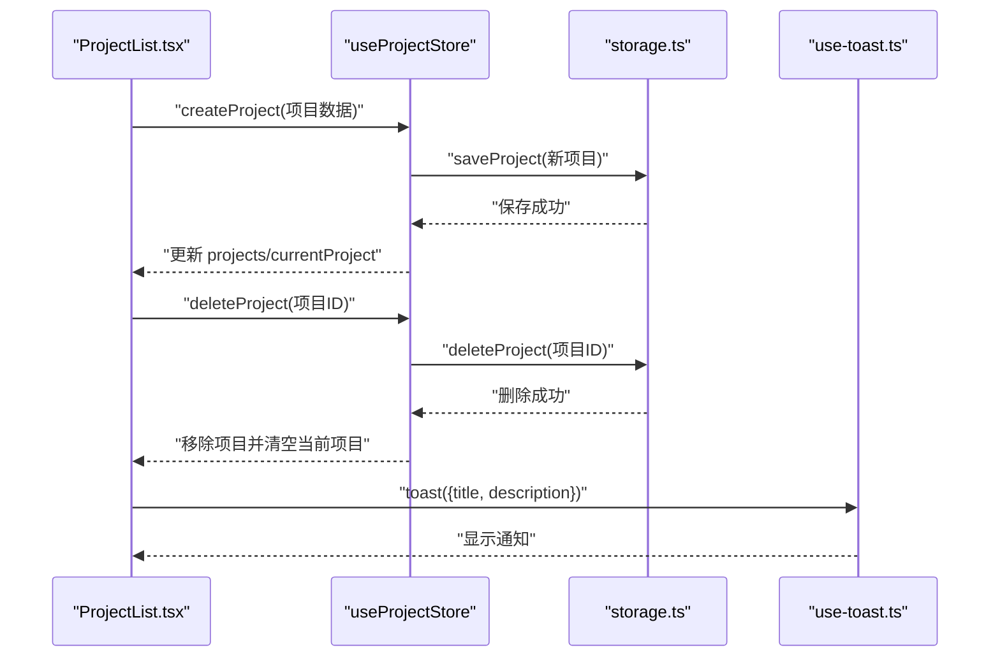
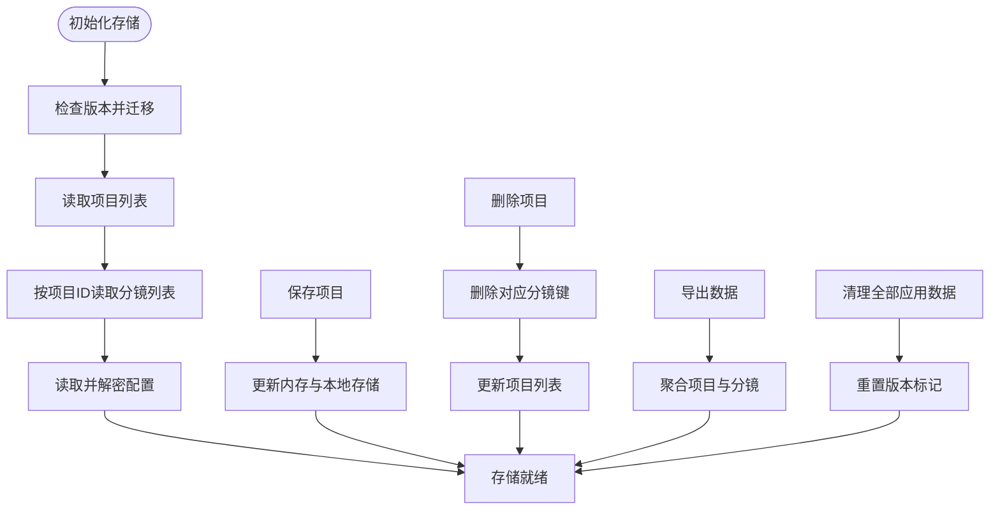
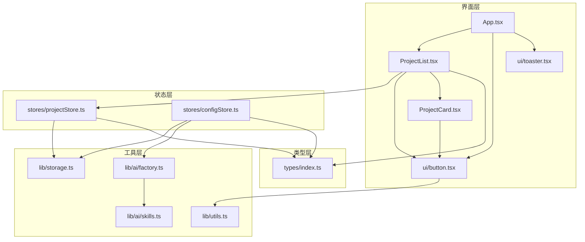
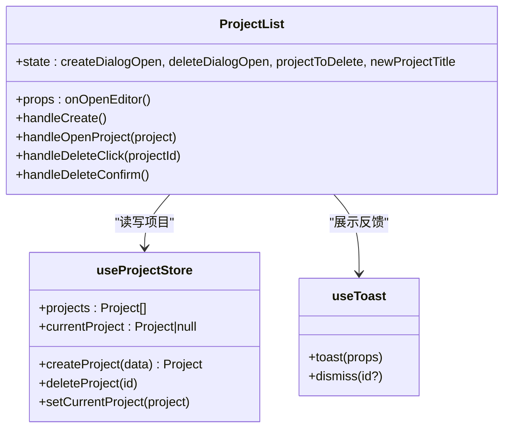
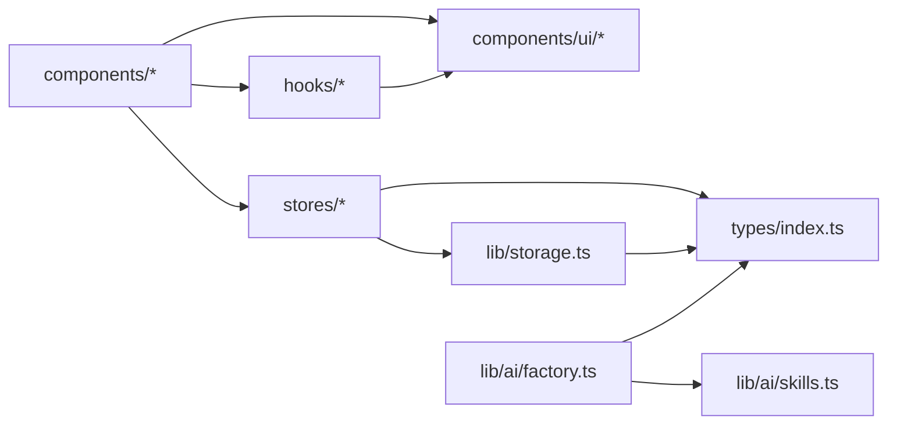

# 项目结构

<cite>
**本文引用的文件**
- [App.tsx](file://manga-creator/src/App.tsx)
- [ProjectList.tsx](file://manga-creator/src/components/ProjectList.tsx)
- [ProjectCard.tsx](file://manga-creator/src/components/ProjectCard.tsx)
- [button.tsx](file://manga-creator/src/components/ui/button.tsx)
- [toaster.tsx](file://manga-creator/src/components/ui/toaster.tsx)
- [use-toast.ts](file://manga-creator/src/hooks/use-toast.ts)
- [projectStore.ts](file://manga-creator/src/stores/projectStore.ts)
- [configStore.ts](file://manga-creator/src/stores/configStore.ts)
- [storage.ts](file://manga-creator/src/lib/storage.ts)
- [factory.ts](file://manga-creator/src/lib/ai/factory.ts)
- [skills.ts](file://manga-creator/src/lib/ai/skills.ts)
- [utils.ts](file://manga-creator/src/lib/utils.ts)
- [index.ts](file://manga-creator/src/types/index.ts)
- [package.json](file://manga-creator/package.json)
- [tsconfig.json](file://manga-creator/tsconfig.json)
</cite>

## 目录结构设计理念与职责划分

本项目采用“按功能域与职责分离”的目录组织方式，核心思想是：
- 以 src/ 为根，围绕“界面组件、状态管理、工具库、自定义Hook、类型定义”五大领域进行模块化划分，降低耦合度，提升可维护性与可测试性。
- 组件层（components/）：聚焦UI与交互，使用原子化UI组件（ui/）与业务组件（如 ProjectList、ProjectCard），保持视图与状态的清晰边界。
- 状态层（stores/）：使用轻量状态管理库集中管理应用状态，避免跨组件共享状态带来的复杂性。
- 工具层（lib/）：封装通用能力（存储、AI工厂、工具函数等），对外暴露稳定接口，便于替换与扩展。
- Hook层（hooks/）：封装可复用的副作用逻辑，如通知系统。
- 类型层（types/）：统一数据模型与接口定义，确保跨模块类型一致性。

该设计使得：
- 组件只负责渲染与事件回调，状态变更通过store完成；
- 存储与加密逻辑集中在 lib/storage.ts，避免在组件中直接操作本地存储；
- AI能力通过工厂模式抽象，便于接入不同供应商；
- 类型定义集中管理，减少重复与不一致。

章节来源
- file://manga-creator/src/App.tsx#L1-L81
- file://manga-creator/src/components/ProjectList.tsx#L1-L196
- file://manga-creator/src/stores/projectStore.ts#L1-L95
- file://manga-creator/src/lib/storage.ts#L1-L246
- file://manga-creator/src/types/index.ts#L1-L190

## 核心组件

### 项目列表组件 ProjectList.tsx 如何通过 projectStore 管理项目列表

- 依赖关系
  - 从 stores/ 引入 useProjectStore，用于读取与写入项目集合、当前项目。
  - 从 hooks/ 引入 useToast，用于展示操作反馈。
  - 从 ui/ 引入基础组件（按钮、输入框、对话框、确认框等）。
- 关键流程
  - 初始化：在 App.tsx 中调用 initStorage() 与 loadProjects()，确保页面加载即可见项目列表。
  - 创建项目：用户输入标题后，调用 createProject 并自动跳转到编辑器。
  - 打开项目：setCurrentProject 并切换视图。
  - 删除项目：触发 deleteProject，并清理对应分镜数据。
- 错误处理
  - 对空标题进行校验，使用 toast 提示。
  - 存储异常时捕获错误并抛出明确错误信息，避免静默失败。

图表来源
- [ProjectList.tsx](file://manga-creator/src/components/ProjectList.tsx#L1-L196)
- [projectStore.ts](file://manga-creator/src/stores/projectStore.ts#L1-L95)
- [storage.ts](file://manga-creator/src/lib/storage.ts#L68-L98)
- [use-toast.ts](file://manga-creator/src/hooks/use-toast.ts#L145-L172)

章节来源
- file://manga-creator/src/components/ProjectList.tsx#L1-L196
- file://manga-creator/src/stores/projectStore.ts#L1-L95
- file://manga-creator/src/lib/storage.ts#L68-L98
- file://manga-creator/src/hooks/use-toast.ts#L145-L172

### 存储模块 storage.ts 如何实现加密持久化

- 加密与解密
  - 使用对称加密算法对敏感配置进行加密存储；读取时先解密再解析。
- 键空间与版本控制
  - 采用命名空间前缀（如 aixs_）隔离应用数据；通过版本号进行迁移预留。
- 数据模型
  - 项目列表、分镜列表、用户配置分别有独立键名；删除项目时同步清理其分镜数据。
- 备份与清理
  - 支持导出/导入全量数据；提供清理全部应用数据与统计使用量的能力。

图表来源
- [storage.ts](file://manga-creator/src/lib/storage.ts#L1-L246)

章节来源
- file://manga-creator/src/lib/storage.ts#L1-L246

### 类型定义与模块间契约

- 类型定义集中在 types/index.ts，覆盖项目、分镜、工作流状态、AI相关、上下文与任务等。
- 通过统一类型约束，确保：
  - store 与 lib 层的数据结构一致；
  - 组件与 store 的交互参数明确；
  - AI 工厂与技能注册表的输入输出规范清晰。

章节来源
- file://manga-creator/src/types/index.ts#L1-L190

## 架构总览

图表来源
- [App.tsx](file://manga-creator/src/App.tsx#L1-L81)
- [ProjectList.tsx](file://manga-creator/src/components/ProjectList.tsx#L1-L196)
- [ProjectCard.tsx](file://manga-creator/src/components/ProjectCard.tsx#L1-L110)
- [button.tsx](file://manga-creator/src/components/ui/button.tsx#L1-L58)
- [toaster.tsx](file://manga-creator/src/components/ui/toaster.tsx#L1-L200)
- [projectStore.ts](file://manga-creator/src/stores/projectStore.ts#L1-L95)
- [configStore.ts](file://manga-creator/src/stores/configStore.ts#L1-L58)
- [storage.ts](file://manga-creator/src/lib/storage.ts#L1-L246)
- [factory.ts](file://manga-creator/src/lib/ai/factory.ts#L1-L54)
- [skills.ts](file://manga-creator/src/lib/ai/skills.ts#L1-L132)
- [utils.ts](file://manga-creator/src/lib/utils.ts#L1-L7)
- [index.ts](file://manga-creator/src/types/index.ts#L1-L190)

## 详细组件分析

### 组件 A：ProjectList.tsx（项目列表）

- 设计要点
  - 使用受控组件管理新建/删除对话框状态。
  - 通过 useToast 提供即时反馈，增强可用性。
  - 与 ProjectCard 组合展示项目信息与进度条。
- 依赖链
  - 依赖 useProjectStore（读写项目集合与当前项目）。
  - 依赖 useToast（通知系统）。
  - 依赖 ui/button、ui/dialog、ui/input、ui/label 等基础组件。
- 性能与健壮性
  - 输入校验与错误提示，避免无效操作。
  - 删除操作采用二次确认，降低误删风险。

图表来源
- [ProjectList.tsx](file://manga-creator/src/components/ProjectList.tsx#L1-L196)
- [projectStore.ts](file://manga-creator/src/stores/projectStore.ts#L1-L95)
- [use-toast.ts](file://manga-creator/src/hooks/use-toast.ts#L145-L172)

章节来源
- file://manga-creator/src/components/ProjectList.tsx#L1-L196
- file://manga-creator/src/stores/projectStore.ts#L1-L95
- file://manga-creator/src/hooks/use-toast.ts#L145-L172

### 组件 B：ProjectCard.tsx（项目卡片）

- 设计要点
  - 基于工作流状态计算进度百分比，直观展示项目进展。
  - 提供打开与删除操作入口，点击区域进行合理划分。
- 与类型系统的协作
  - 使用 Project 接口与 WorkflowState 枚举，保证字段与状态的一致性。

章节来源
- file://manga-creator/src/components/ProjectCard.tsx#L1-L110
- file://manga-creator/src/types/index.ts#L43-L55

### 组件 C：UI 基础组件 button.tsx

- 设计要点
  - 使用变体与尺寸的组合类名，通过 utils/cn 进行合并，确保样式一致性。
  - 支持 asChild 透传，便于与路由等组件组合使用。

章节来源
- file://manga-creator/src/components/ui/button.tsx#L1-L58
- file://manga-creator/src/lib/utils.ts#L1-L7

### Hook D：use-toast.ts（通知系统）

- 设计要点
  - 内部维护有限数量的 toast 列表，避免堆积。
  - 提供添加、更新、关闭与移除等动作，支持延迟自动移除。
- 与 UI 组件的配合
  - 与 ui/toaster.tsx 协同，统一通知展示。

章节来源
- file://manga-creator/src/hooks/use-toast.ts#L1-L195
- file://manga-creator/src/components/ui/toaster.tsx#L1-L200

### Store E：projectStore.ts（项目状态）

- 设计要点
  - 使用轻量状态管理库，集中管理项目集合、当前项目与加载状态。
  - 所有持久化操作委托给 lib/storage.ts，保持 store 的纯净性。
- 与类型系统的协作
  - 使用 Project 接口与 WorkflowState 枚举，确保数据结构一致。

章节来源
- file://manga-creator/src/stores/projectStore.ts#L1-L95
- file://manga-creator/src/types/index.ts#L43-L55

### Store F：configStore.ts（配置状态）

- 设计要点
  - 负责加载、保存与清理用户配置；提供连接测试能力。
  - 通过 AIFactory 创建客户端，验证配置有效性。

章节来源
- file://manga-creator/src/stores/configStore.ts#L1-L58
- file://manga-creator/src/lib/ai/factory.ts#L1-L54

### 工具 G：storage.ts（本地存储与加密）

- 设计要点
  - 封装项目、分镜与配置的增删改查；对配置进行加密存储。
  - 提供版本迁移、导出导入、清理与用量统计等运维能力。

章节来源
- file://manga-creator/src/lib/storage.ts#L1-L246

### 工具 H：AI 工厂与技能（factory.ts、skills.ts）

- 设计要点
  - 工厂根据供应商类型创建适配器，屏蔽底层差异。
  - 技能注册表集中管理不同任务的提示模板与输出格式。

章节来源
- file://manga-creator/src/lib/ai/factory.ts#L1-L54
- file://manga-creator/src/lib/ai/skills.ts#L1-L132

## 依赖分析

- 模块耦合
  - 组件层仅依赖 store 与 ui，不直接依赖 lib，降低耦合。
  - store 依赖 lib/storage.ts 与 types/index.ts，形成稳定的契约边界。
  - 工具层（lib/）被 store 与组件间接依赖，便于替换与扩展。
- 外部依赖
  - 通过 package.json 管理第三方库，如状态管理、UI 组件、加密与测试工具。
- 路径别名
  - tsconfig.json 配置 @/* 映射到 src/*，简化导入路径。

图表来源
- [package.json](file://manga-creator/package.json#L1-L62)
- [tsconfig.json](file://manga-creator/tsconfig.json#L1-L14)
- [ProjectList.tsx](file://manga-creator/src/components/ProjectList.tsx#L1-L196)
- [projectStore.ts](file://manga-creator/src/stores/projectStore.ts#L1-L95)
- [storage.ts](file://manga-creator/src/lib/storage.ts#L1-L246)
- [factory.ts](file://manga-creator/src/lib/ai/factory.ts#L1-L54)
- [skills.ts](file://manga-creator/src/lib/ai/skills.ts#L1-L132)
- [index.ts](file://manga-creator/src/types/index.ts#L1-L190)

章节来源
- file://manga-creator/package.json#L1-L62
- file://manga-creator/tsconfig.json#L1-L14

## 性能考虑

- 状态粒度
  - store 仅维护必要字段，避免过度拆分导致的重复渲染。
- 存储策略
  - 本地存储为同步操作，建议在批量更新时合并多次写入，减少频繁 IO。
- UI 渲染
  - 使用受控组件与最小化状态更新，避免不必要的重渲染。
- 加密成本
  - 配置加密在必要时执行，避免在高频操作中重复加解密。

## 故障排查指南

- 无法加载项目
  - 检查 storage.ts 的版本迁移与键空间是否正确。
  - 确认 App.tsx 是否在启动时调用了 initStorage() 与 loadProjects()。
- 保存失败
  - 查看 storage.ts 的错误抛出位置，定位具体键值与数据结构问题。
- 通知不显示
  - 确认 use-toast.ts 的监听器是否注册，以及 UI 层是否引入了 Toaster 组件。
- 配置连接失败
  - 使用 configStore 的 testConnection 方法进行连通性测试，检查供应商类型与 API Key。

章节来源
- file://manga-creator/src/App.tsx#L1-L81
- file://manga-creator/src/lib/storage.ts#L1-L246
- file://manga-creator/src/hooks/use-toast.ts#L1-L195
- file://manga-creator/src/stores/configStore.ts#L1-L58

## 结论

本项目通过清晰的目录划分与模块边界，实现了“视图-状态-工具-类型”的解耦设计。组件层专注交互，状态层集中管理，工具层提供稳定接口，类型层保障一致性。基于此架构，开发者可以安全地扩展新组件、新增状态模型与接入新的 AI 供应商，同时保持代码的可维护性与可测试性。

## 附录：常见目录操作示例

- 新增一个 UI 组件
  - 在 components/ui/ 下创建新组件文件，使用 utils/cn 合并样式，导出变体与尺寸。
  - 在需要使用的组件中引入并按需使用。
- 新增一个状态模型
  - 在 stores/ 下创建新 store 文件，定义状态与操作方法，使用 create 管理状态。
  - 在 lib/ 中补充对应的持久化或网络请求逻辑。
  - 在 types/ 中补充必要的类型定义。
- 新增一个工具函数
  - 在 lib/ 下创建工具模块，提供纯函数与错误处理，避免副作用。
  - 在 hooks/ 中封装可复用的副作用逻辑。
- 新增一个 AI 技能
  - 在 lib/ai/skills.ts 中注册新技能，定义提示模板与输出格式。
  - 在工厂中扩展供应商适配器，确保与新技能的输入输出兼容。

章节来源
- file://manga-creator/src/components/ui/button.tsx#L1-L58
- file://manga-creator/src/lib/utils.ts#L1-L7
- file://manga-creator/src/stores/projectStore.ts#L1-L95
- file://manga-creator/src/lib/storage.ts#L1-L246
- file://manga-creator/src/lib/ai/skills.ts#L1-L132
- file://manga-creator/src/lib/ai/factory.ts#L1-L54
- file://manga-creator/src/types/index.ts#L1-L190