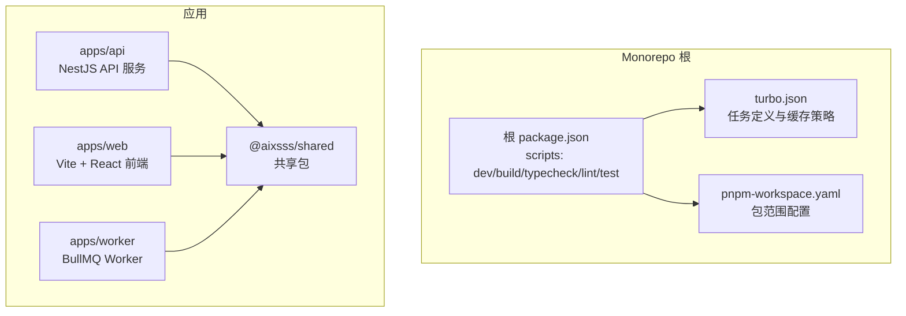
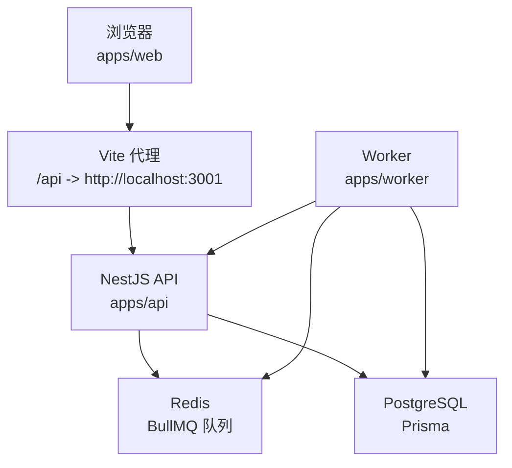
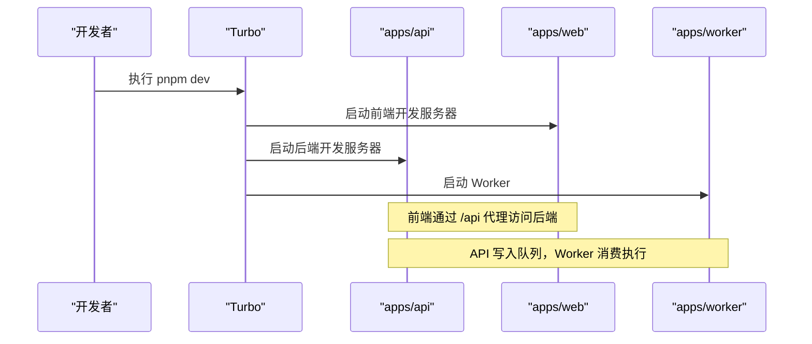
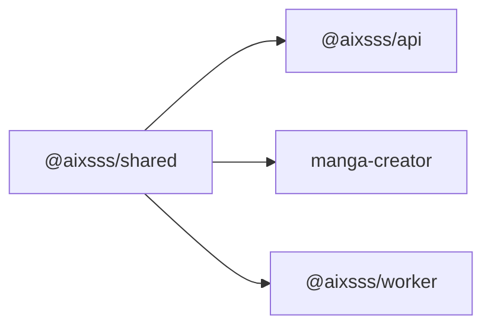

# 快速开始

<cite>
**本文引用的文件**
- [package.json](file://package.json)
- [pnpm-workspace.yaml](file://pnpm-workspace.yaml)
- [turbo.json](file://turbo.json)
- [docker-compose.dev.yml](file://docker-compose.dev.yml)
- [apps/api/env.example](file://apps/api/env.example)
- [apps/api/package.json](file://apps/api/package.json)
- [apps/api/src/main.ts](file://apps/api/src/main.ts)
- [apps/api/src/config/env.ts](file://apps/api/src/config/env.ts)
- [apps/api/prisma/schema.prisma](file://apps/api/prisma/schema.prisma)
- [apps/web/env.example](file://apps/web/env.example)
- [apps/web/package.json](file://apps/web/package.json)
- [apps/web/vite.config.ts](file://apps/web/vite.config.ts)
- [apps/web/src/main.tsx](file://apps/web/src/main.tsx)
- [apps/worker/env.example](file://apps/worker/env.example)
- [apps/worker/package.json](file://apps/worker/package.json)
- [apps/worker/src/worker.ts](file://apps/worker/src/worker.ts)
</cite>

## 目录

1. [简介](#简介)
2. [项目结构](#项目结构)
3. [核心组件](#核心组件)
4. [架构总览](#架构总览)
5. [详细组件分析](#详细组件分析)
6. [依赖分析](#依赖分析)
7. [性能考虑](#性能考虑)
8. [故障排查指南](#故障排查指南)
9. [结论](#结论)
10. [附录](#附录)

## 简介

本指南面向首次参与 AIXSSS 项目的开发者，目标是在最短时间内搭建并运行完整的本地开发环境。内容涵盖系统要求、依赖安装、数据库与缓存服务启动、环境变量配置、数据库迁移、两种启动方式对比（pnpm dev 与分别启动）、常见问题排查以及生产部署基础建议。

## 项目结构

AIXSSS 采用 monorepo 结构，使用 pnpm workspace 管理多包，Turbo 负责任务编排与缓存加速。主要子项目包括：

- apps/api：基于 NestJS 的后端 API 服务，负责业务逻辑、鉴权、数据库访问与队列调度。
- apps/web：基于 Vite + React 的前端应用，通过代理访问后端 API。
- apps/worker：基于 BullMQ 的异步任务工作进程，消费队列执行各类 AI 生成与处理任务。
- packages/shared：共享类型与工具，被多个应用复用。

图表来源

- [package.json](file://package.json#L1-L24)
- [turbo.json](file://turbo.json#L1-L30)
- [pnpm-workspace.yaml](file://pnpm-workspace.yaml#L1-L6)
- [apps/api/package.json](file://apps/api/package.json#L1-L52)
- [apps/web/package.json](file://apps/web/package.json#L1-L95)
- [apps/worker/package.json](file://apps/worker/package.json#L1-L35)

章节来源

- [package.json](file://package.json#L1-L24)
- [turbo.json](file://turbo.json#L1-L30)
- [pnpm-workspace.yaml](file://pnpm-workspace.yaml#L1-L6)

## 核心组件

- 后端 API（apps/api）
  - 使用 NestJS + Fastify，提供 REST 接口，启用 CORS，全局异常过滤，统一前缀 /api。
  - 环境变量通过 Zod 校验，支持开发/测试/生产三档。
- 前端（apps/web）
  - Vite + React 应用，默认代理 /api 到后端 3001 端口，支持数据模式切换（api | local）。
- Worker（apps/worker）
  - 基于 BullMQ 的队列消费者，按任务类型分发执行，支持进度上报与重试策略。
- 数据库与队列
  - PostgreSQL（Prisma）+ Redis（BullMQ）+ MinIO（对象存储，开发环境）。

章节来源

- [apps/api/src/main.ts](file://apps/api/src/main.ts#L1-L34)
- [apps/api/src/config/env.ts](file://apps/api/src/config/env.ts#L1-L17)
- [apps/web/vite.config.ts](file://apps/web/vite.config.ts#L1-L94)
- [apps/worker/src/worker.ts](file://apps/worker/src/worker.ts#L1-L755)

## 架构总览

下图展示开发环境的典型交互：前端通过 Vite 代理访问后端 API，API 将任务推送到 Redis 队列，Worker 从队列拉取任务执行并更新数据库状态。

图表来源

- [apps/web/vite.config.ts](file://apps/web/vite.config.ts#L24-L34)
- [apps/api/src/main.ts](file://apps/api/src/main.ts#L16-L22)
- [apps/worker/src/worker.ts](file://apps/worker/src/worker.ts#L50-L729)

## 详细组件分析

### 系统要求与依赖安装

- Node.js 版本与包管理器
  - 根 package.json 指定使用 pnpm 9.x，建议使用推荐版本以避免锁版本差异。
- 依赖安装
  - 在仓库根目录执行安装，自动解析 workspace 中的包。
- Docker Compose（可选）
  - 使用 docker-compose.dev.yml 启动 PostgreSQL、Redis、MinIO，便于快速获得一致的基础设施。

章节来源

- [package.json](file://package.json#L1-L24)
- [pnpm-workspace.yaml](file://pnpm-workspace.yaml#L1-L6)
- [docker-compose.dev.yml](file://docker-compose.dev.yml#L1-L35)

### 数据库与 Redis 服务启动

- 使用 Docker Compose 启动开发环境所需服务
  - PostgreSQL：默认端口 5432，数据库名 aixsss，账号密码见 compose 文件。
  - Redis：默认端口 6379。
  - MinIO：S3 API 端口 9000，控制台 9001，账号密码见 compose 文件。
- 如需本地原生服务，请确保 PostgreSQL 与 Redis 可用，并与环境变量中的连接字符串一致。

章节来源

- [docker-compose.dev.yml](file://docker-compose.dev.yml#L1-L35)

### 环境变量配置

- 后端 API（apps/api）
  - 示例文件：apps/api/env.example
  - 关键项：NODE_ENV、PORT、DATABASE_URL、JWT_SECRET、API_KEY_ENCRYPTION_KEY、REDIS_URL、AI_QUEUE_NAME、CORS_ORIGIN
  - 环境变量校验：apps/api/src/config/env.ts 使用 Zod 对必填项进行强类型校验
- 前端（apps/web）
  - 示例文件：apps/web/env.example
  - 关键项：VITE_DATA_MODE、VITE_API_BASE_PATH（开发默认代理到 3001）
- Worker（apps/worker）
  - 示例文件：apps/worker/env.example
  - 关键项：DATABASE_URL、API_KEY_ENCRYPTION_KEY、REDIS_URL、AI_QUEUE_NAME、WORKER_CONCURRENCY

章节来源

- [apps/api/env.example](file://apps/api/env.example#L1-L23)
- [apps/api/src/config/env.ts](file://apps/api/src/config/env.ts#L1-L17)
- [apps/web/env.example](file://apps/web/env.example#L1-L14)
- [apps/worker/env.example](file://apps/worker/env.example#L1-L17)

### 数据库迁移与初始化

- Prisma Schema
  - 数据模型位于 apps/api/prisma/schema.prisma，包含用户、团队、项目、集数、场景、角色、世界观、AI 配置、作业队列、系统提示等核心实体。
- 迁移命令
  - 在 apps/api 包内执行：
    - 生成客户端与迁移：使用 scripts 中的 prisma:generate、prisma:migrate
    - 生产部署迁移：prisma:deploy
    - 启动可视化工具：prisma:studio
- 执行顺序建议
  - 先启动数据库服务，再执行迁移，最后启动 API 与 Worker。

章节来源

- [apps/api/prisma/schema.prisma](file://apps/api/prisma/schema.prisma#L1-L351)
- [apps/api/package.json](file://apps/api/package.json#L13-L16)

### 启动方式选择：pnpm dev vs 分别启动

- 使用根脚本一键启动（推荐）
  - 根 package.json 定义了 dev 脚本，委托给 turbo dev，可同时启动所有应用并持久运行。
  - 适合大多数开发场景，便于统一管理与缓存。
- 分别启动（适合精细控制）
  - API：apps/api/package.json 提供 dev 脚本，使用 tsx watch 监听变更。
  - Web：apps/web/package.json 提供 dev 脚本，Vite 启动。
  - Worker：apps/worker/package.json 提供 dev 脚本，使用 tsx watch 监听变更。
  - 注意：分别启动时需确保数据库、Redis、MinIO 已就绪，且环境变量一致。

图表来源

- [package.json](file://package.json#L7-L8)
- [turbo.json](file://turbo.json#L5-L8)
- [apps/api/package.json](file://apps/api/package.json#L7)
- [apps/web/package.json](file://apps/web/package.json#L8)
- [apps/worker/package.json](file://apps/worker/package.json#L7)

章节来源

- [package.json](file://package.json#L7-L8)
- [turbo.json](file://turbo.json#L1-L30)
- [apps/api/package.json](file://apps/api/package.json#L7)
- [apps/web/package.json](file://apps/web/package.json#L8)
- [apps/worker/package.json](file://apps/worker/package.json#L7)

### 前端代理与跨域配置

- Vite 代理
  - apps/web/vite.config.ts 配置 /api 代理至 http://localhost:3001，便于本地联调。
- 后端 CORS
  - apps/api/src/main.ts 读取 CORS_ORIGIN（或默认 5173），开启跨域并允许凭据。

章节来源

- [apps/web/vite.config.ts](file://apps/web/vite.config.ts#L24-L34)
- [apps/api/src/main.ts](file://apps/api/src/main.ts#L16-L19)

### 队列与 Worker 行为

- 队列名称与并发
  - apps/worker/env.example 指定 AI_QUEUE_NAME 与 WORKER_CONCURRENCY。
- Worker 任务分发
  - apps/worker/src/worker.ts 根据任务名分发到对应处理函数，支持进度上报与协作式取消。
- 重试与失败处理
  - Worker 根据任务最大尝试次数决定是否自动重试，避免前端误判“已失败”。

章节来源

- [apps/worker/env.example](file://apps/worker/env.example#L1-L17)
- [apps/worker/src/worker.ts](file://apps/worker/src/worker.ts#L50-L729)

## 依赖分析

- 包管理与工作区
  - pnpm-workspace.yaml 声明 apps/_ 与 packages/_ 为工作区范围。
- 任务编排
  - turbo.json 定义 dev/build/typecheck/lint/test 等任务，dev 为持久性任务，关闭缓存以保证实时性。
- 应用间依赖
  - apps/api 与 apps/worker 依赖 @aixsss/shared；apps/web 也依赖 @aixsss/shared。

图表来源

- [pnpm-workspace.yaml](file://pnpm-workspace.yaml#L1-L6)
- [apps/api/package.json](file://apps/api/package.json#L18-L20)
- [apps/web/package.json](file://apps/web/package.json#L22-L23)
- [apps/worker/package.json](file://apps/worker/package.json#L14-L15)

章节来源

- [pnpm-workspace.yaml](file://pnpm-workspace.yaml#L1-L6)
- [turbo.json](file://turbo.json#L1-L30)
- [apps/api/package.json](file://apps/api/package.json#L18-L20)
- [apps/web/package.json](file://apps/web/package.json#L22-L23)
- [apps/worker/package.json](file://apps/worker/package.json#L14-L15)

## 性能考虑

- 前端打包与依赖优化
  - apps/web/vite.config.ts 配置了代码分割策略、esbuild 压缩、CSS 分割与依赖预构建，有助于提升开发体验与构建效率。
- Worker 并发与锁
  - apps/worker/src/worker.ts 设置了并发度、锁时长与 stall 检测，降低开发环境热重启带来的误判风险。

章节来源

- [apps/web/vite.config.ts](file://apps/web/vite.config.ts#L36-L92)
- [apps/worker/src/worker.ts](file://apps/worker/src/worker.ts#L721-L729)

## 故障排查指南

- 端口冲突
  - API 默认监听 3001，前端代理默认 5173，若冲突请调整 apps/api/src/main.ts 或 apps/web/vite.config.ts 中的端口与代理配置。
- 数据库连接失败
  - 确认 DATABASE_URL 与实际数据库一致；先启动 PostgreSQL，再执行迁移；检查 schema.prisma 中的 provider 与 url。
- Redis 连接失败
  - 确认 REDIS_URL 与实际 Redis 一致；若使用 Docker Compose，确保容器已运行且端口映射正确。
- CORS 报错
  - 检查 apps/api/src/main.ts 中的 CORS_ORIGIN 是否与前端地址一致；开发环境可设为前端默认端口。
- 队列无任务执行
  - 确认 AI_QUEUE_NAME 一致；检查 apps/worker/src/worker.ts 中的队列名称与并发设置；确认 API 已将任务推送到队列。
- 环境变量未生效
  - 确认 apps/api/src/config/env.ts 的 Zod 校验是否通过；必要时参考 apps/api/env.example 与 apps/worker/env.example 补齐缺失项。
- MinIO 访问问题
  - 开发环境使用 MinIO 存储，确认 S3 API 与控制台端口映射；如不使用可忽略。

章节来源

- [apps/api/src/main.ts](file://apps/api/src/main.ts#L13-L19)
- [apps/api/src/config/env.ts](file://apps/api/src/config/env.ts#L3-L12)
- [apps/web/vite.config.ts](file://apps/web/vite.config.ts#L24-L34)
- [apps/worker/src/worker.ts](file://apps/worker/src/worker.ts#L44-L50)
- [docker-compose.dev.yml](file://docker-compose.dev.yml#L1-L35)

## 结论

按照本指南，您可以在本地快速搭建 AIXSSS 的开发环境：安装依赖、启动数据库与缓存服务、配置环境变量、执行数据库迁移，并通过 pnpm dev 或分别启动的方式运行 API、Web 与 Worker。遇到问题时，优先检查端口、连接字符串、CORS 与队列配置。生产部署可在此基础上扩展容器化与安全加固。

## 附录

### 常用命令清单

- 安装依赖
  - 在仓库根目录执行安装
- 启动开发环境
  - 使用根脚本一键启动
  - 或分别启动 API、Web、Worker
- 数据库相关
  - 在 apps/api 包内执行 prisma:generate、prisma:migrate、prisma:deploy、prisma:studio

章节来源

- [package.json](file://package.json#L7-L16)
- [apps/api/package.json](file://apps/api/package.json#L13-L16)

### 配置文件模板位置

- 后端 API 环境变量模板：apps/api/env.example
- 前端环境变量模板：apps/web/env.example
- Worker 环境变量模板：apps/worker/env.example
- 数据库模型：apps/api/prisma/schema.prisma

章节来源

- [apps/api/env.example](file://apps/api/env.example#L1-L23)
- [apps/web/env.example](file://apps/web/env.example#L1-L14)
- [apps/worker/env.example](file://apps/worker/env.example#L1-L17)
- [apps/api/prisma/schema.prisma](file://apps/api/prisma/schema.prisma#L1-L351)
