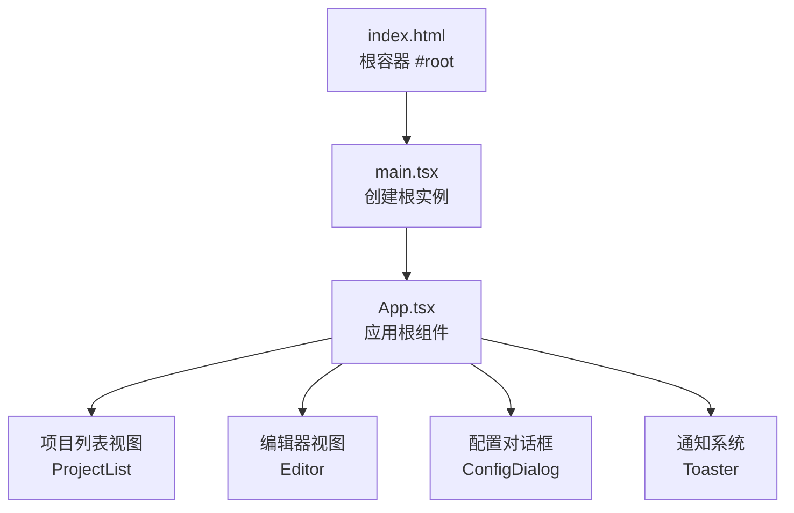
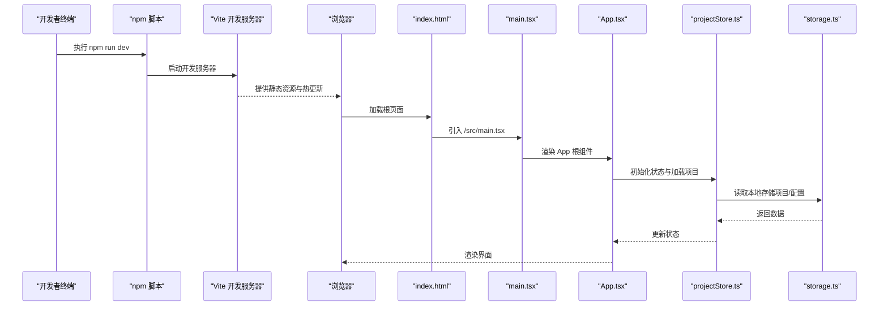
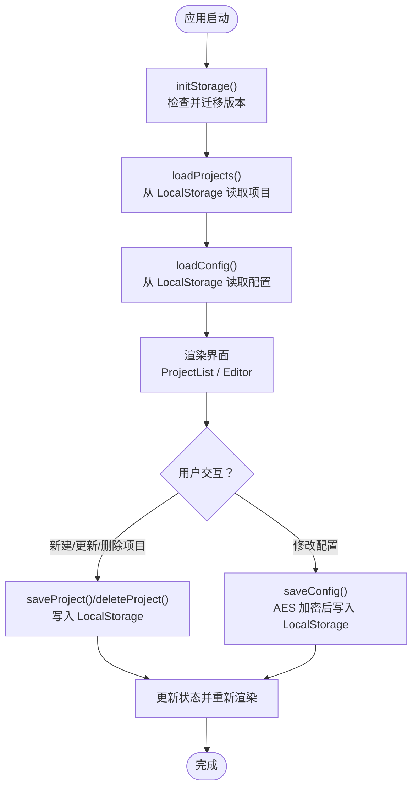
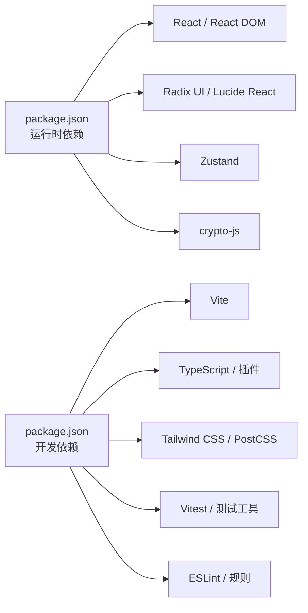

# 快速开始

<cite>
**本文引用的文件**
- [package.json](file://manga-creator/package.json)
- [vite.config.ts](file://manga-creator/vite.config.ts)
- [README.md](file://manga-creator/README.md)
- [index.html](file://manga-creator/index.html)
- [main.tsx](file://manga-creator/src/main.tsx)
- [App.tsx](file://manga-creator/src/App.tsx)
- [storage.ts](file://manga-creator/src/lib/storage.ts)
- [projectStore.ts](file://manga-creator/src/stores/projectStore.ts)
- [tsconfig.json](file://manga-creator/tsconfig.json)
- [tailwind.config.js](file://manga-creator/tailwind.config.js)
- [postcss.config.js](file://manga-creator/postcss.config.js)
- [eslint.config.js](file://manga-creator/eslint.config.js)
</cite>

## 目录
1. [简介](#简介)
2. [项目结构](#项目结构)
3. [核心组件](#核心组件)
4. [架构总览](#架构总览)
5. [详细组件分析](#详细组件分析)
6. [依赖关系分析](#依赖关系分析)
7. [性能注意事项](#性能注意事项)
8. [故障排查指南](#故障排查指南)
9. [结论](#结论)
10. [附录](#附录)

## 简介
本指南面向新用户，帮助你在一小时内成功运行“漫剧创作助手”项目。你将学习如何准备环境、安装依赖、启动开发服务器、构建生产版本，并理解关键配置文件在开发流程中的作用。同时，我们提供了常见问题的排查方法，包括依赖冲突与端口占用等。

## 项目结构
该仓库包含一个前端应用目录 manga-creator，使用 Vite + React + TypeScript 技术栈，配合 Tailwind CSS 和 Shadcn/UI 组件体系。核心入口为 index.html，应用挂载点为 #root；实际渲染由 main.tsx 调用 App.tsx 完成。

图表来源
- [index.html](file://manga-creator/index.html#L1-L14)
- [main.tsx](file://manga-creator/src/main.tsx#L1-L11)
- [App.tsx](file://manga-creator/src/App.tsx#L1-L81)

章节来源
- [index.html](file://manga-creator/index.html#L1-L14)
- [main.tsx](file://manga-creator/src/main.tsx#L1-L11)
- [App.tsx](file://manga-creator/src/App.tsx#L1-L81)

## 核心组件
- 应用入口与挂载：index.html 提供 #root 容器，main.tsx 使用 React DOM 将 App 渲染到该容器。
- 应用根组件：App.tsx 负责顶部导航、视图切换（项目列表/编辑器）、全局配置弹窗与通知。
- 状态管理：项目状态由 Zustand 的 projectStore.ts 管理，持久化通过 storage.ts 使用浏览器 LocalStorage 实现。
- 配置与安全：storage.ts 对 API Key 等敏感配置进行 AES 加密存储，避免明文泄露。

章节来源
- [index.html](file://manga-creator/index.html#L1-L14)
- [main.tsx](file://manga-creator/src/main.tsx#L1-L11)
- [App.tsx](file://manga-creator/src/App.tsx#L1-L81)
- [projectStore.ts](file://manga-creator/src/stores/projectStore.ts#L1-L95)
- [storage.ts](file://manga-creator/src/lib/storage.ts#L1-L246)

## 架构总览
下面的序列图展示了从启动开发服务器到页面加载的关键调用链路，以及关键配置文件在其中的作用。

图表来源
- [package.json](file://manga-creator/package.json#L1-L62)
- [vite.config.ts](file://manga-creator/vite.config.ts#L1-L30)
- [index.html](file://manga-creator/index.html#L1-L14)
- [main.tsx](file://manga-creator/src/main.tsx#L1-L11)
- [App.tsx](file://manga-creator/src/App.tsx#L1-L81)
- [projectStore.ts](file://manga-creator/src/stores/projectStore.ts#L1-L95)
- [storage.ts](file://manga-creator/src/lib/storage.ts#L1-L246)

## 详细组件分析

### 环境准备与 Node.js 版本要求
- 项目使用 Vite 5、TypeScript 5.6、React 18.3 等现代前端技术栈。建议使用 Node.js LTS 版本（如 18.x 或 20.x）以获得最佳兼容性与性能。
- TypeScript 与 Vite 的版本在 package.json 中明确声明，确保安装时不会产生不必要的版本冲突。

章节来源
- [package.json](file://manga-creator/package.json#L1-L62)

### 安装依赖（npm install）
- 在项目根目录执行安装命令，npm 会根据 package.json 下载所有依赖与开发依赖。
- 安装完成后，项目即可进入开发模式。

预期输出（示例）
- 控制台显示安装进度与完成信息，随后出现类似“已安装依赖”的提示。

章节来源
- [package.json](file://manga-creator/package.json#L1-L62)

### 启动开发服务器（npm run dev）
- 执行 npm run dev 启动 Vite 开发服务器，默认监听端口 5173。
- 浏览器访问 http://localhost:5173，即可看到应用首页。

关键配置说明
- vite.config.ts 中配置了：
  - React 插件启用，支持 JSX/TSX 热重载。
  - 路径别名 @ 指向 src，便于统一导入。
  - server.host 设置为 0.0.0.0，允许外部设备访问（开发调试常用）。
  - Vitest 测试环境配置，包含 jsdom 环境、覆盖率与设置文件路径等。

章节来源
- [vite.config.ts](file://manga-creator/vite.config.ts#L1-L30)
- [package.json](file://manga-creator/package.json#L1-L62)

### 构建生产版本（npm run build）
- 执行 npm run build 将先编译 TypeScript，再由 Vite 打包构建。
- 构建产物默认输出至 dist 目录（由 Vite 默认行为决定），可用于静态部署。

章节来源
- [package.json](file://manga-creator/package.json#L1-L62)

### 关键配置文件的作用
- vite.config.ts
  - 插件：@vitejs/plugin-react，启用 React 刷新与 JSX 支持。
  - 路径别名：@ 指向 src，简化导入路径。
  - 服务器：host 允许局域网访问，便于联调。
  - 测试：配置 jsdom、setupFiles、覆盖率等。
- tsconfig.json
  - 通过 references 引入 tsconfig.app.json 与 tsconfig.node.json，分别管理应用与 Node 工具链的编译选项。
  - baseUrl 与 paths 配合 vite.config.ts 的别名，保证开发与构建一致。
- tailwind.config.js
  - 指定内容扫描范围，确保按需生成样式。
  - 颜色、圆角、动画等主题扩展，配合 Shadcn/UI 使用。
- postcss.config.js
  - 启用 tailwindcss 与 autoprefixer，自动处理 CSS 前缀与按需引入。
- eslint.config.js
  - 推荐规则集，结合 TypeScript ESLint，提升代码质量与一致性。

章节来源
- [vite.config.ts](file://manga-creator/vite.config.ts#L1-L30)
- [tsconfig.json](file://manga-creator/tsconfig.json#L1-L14)
- [tailwind.config.js](file://manga-creator/tailwind.config.js#L1-L94)
- [postcss.config.js](file://manga-creator/postcss.config.js#L1-L7)
- [eslint.config.js](file://manga-creator/eslint.config.js#L1-L29)

### 状态管理与持久化流程
- App.tsx 在初始化时调用存储初始化与数据加载。
- projectStore.ts 使用 Zustand 管理项目列表与当前项目，所有变更通过 storage.ts 写入 LocalStorage。
- storage.ts 使用 AES 对配置类数据进行加密存储，避免明文 API Key 泄露。

图表来源
- [App.tsx](file://manga-creator/src/App.tsx#L1-L81)
- [projectStore.ts](file://manga-creator/src/stores/projectStore.ts#L1-L95)
- [storage.ts](file://manga-creator/src/lib/storage.ts#L1-L246)

章节来源
- [App.tsx](file://manga-creator/src/App.tsx#L1-L81)
- [projectStore.ts](file://manga-creator/src/stores/projectStore.ts#L1-L95)
- [storage.ts](file://manga-creator/src/lib/storage.ts#L1-L246)

## 依赖关系分析
- 运行时依赖
  - React 与 React DOM：UI 渲染与生命周期管理。
  - Radix UI 组件与 Lucide React：UI 基础组件与图标。
  - Zustand：轻量级状态管理。
  - crypto-js：API Key 等敏感配置的 AES 加密。
- 开发依赖
  - Vite：开发服务器与打包工具。
  - TypeScript 与相关插件：类型检查与语法支持。
  - Tailwind CSS 与 PostCSS：原子化 CSS 与自动前缀。
  - Vitest 与测试工具：单元测试与覆盖率。
  - ESLint：代码规范与质量保障。

图表来源
- [package.json](file://manga-creator/package.json#L1-L62)

章节来源
- [package.json](file://manga-creator/package.json#L1-L62)

## 性能注意事项
- 使用 Vite 的按需加载与热更新机制，开发体验流畅。
- Tailwind CSS 按需扫描 content，避免生成冗余样式。
- 项目采用 LocalStorage 存储，注意数据大小控制，避免超出浏览器限制。
- 生产构建时建议开启压缩与 Tree Shaking（Vite 默认行为），减少体积。

## 故障排查指南
- 端口占用（默认 5173）
  - 现象：启动时报端口被占用。
  - 解决：修改 vite.config.ts 中 server.port 或关闭占用进程；也可临时更换端口后重试。
  - 参考：vite.config.ts 的 server 配置项。
- 依赖安装失败或冲突
  - 现象：npm install 报错或版本不匹配。
  - 解决：清理缓存后重试；确保 Node.js 版本符合要求；必要时删除 node_modules 与 lock 文件后重新安装。
- TypeScript 类型错误
  - 现象：构建或检查时报类型错误。
  - 解决：根据 ESLint 与 TypeScript 提示修复；确认 tsconfig.json 的引用与路径别名配置正确。
- 浏览器无法访问
  - 现象：访问 http://localhost:5173 无响应。
  - 解决：检查防火墙/杀毒软件；确认开发服务器已成功启动；查看控制台是否有错误日志。
- 配置未生效或丢失
  - 现象：API Key 或项目数据未保存/丢失。
  - 解决：确认 storage.ts 的加密/解密逻辑正常；检查 LocalStorage 中是否存在对应键值；必要时清理无效数据后重试。

章节来源
- [vite.config.ts](file://manga-creator/vite.config.ts#L1-L30)
- [package.json](file://manga-creator/package.json#L1-L62)
- [tsconfig.json](file://manga-creator/tsconfig.json#L1-L14)
- [eslint.config.js](file://manga-creator/eslint.config.js#L1-L29)
- [storage.ts](file://manga-creator/src/lib/storage.ts#L1-L246)

## 结论
通过本指南，你可以在一小时内完成环境准备、安装依赖、启动开发服务器与构建生产版本，并理解关键配置文件在开发流程中的作用。遇到问题时，可依据故障排查指南快速定位并解决。随着对项目结构与配置的熟悉，你可以进一步优化开发体验与生产构建效果。

## 附录
- 快速命令清单
  - 安装依赖：npm install
  - 启动开发服务器：npm run dev（访问 http://localhost:5173）
  - 构建生产版本：npm run build
  - 预览生产构建：npm run preview
  - 单元测试：npm run test 或 npm run test:watch
  - 代码检查：npm run lint
  - 同时执行检查与测试：npm run check

章节来源
- [README.md](file://manga-creator/README.md#L130-L151)
- [package.json](file://manga-creator/package.json#L1-L62)