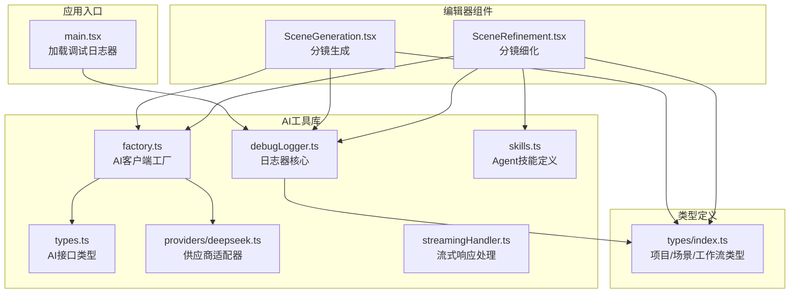
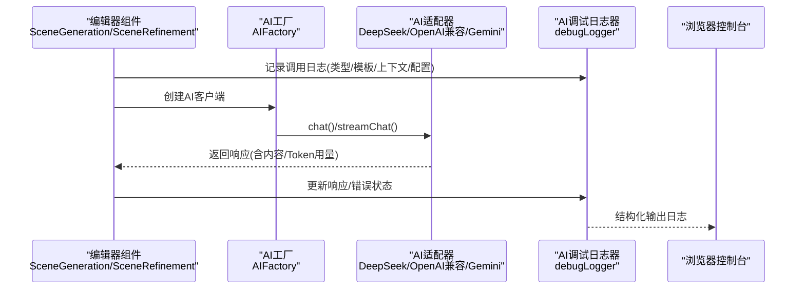
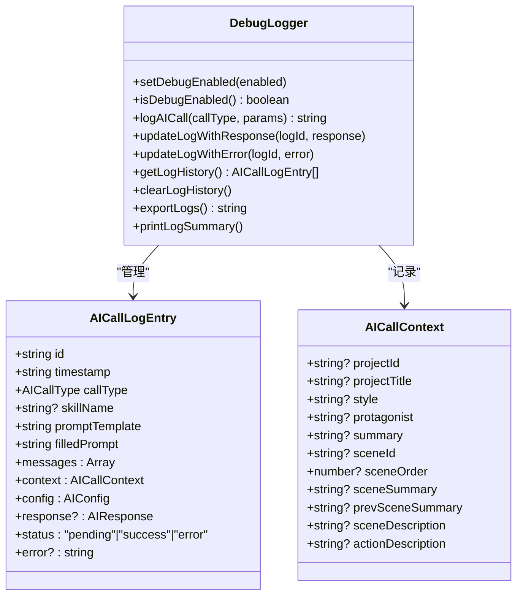
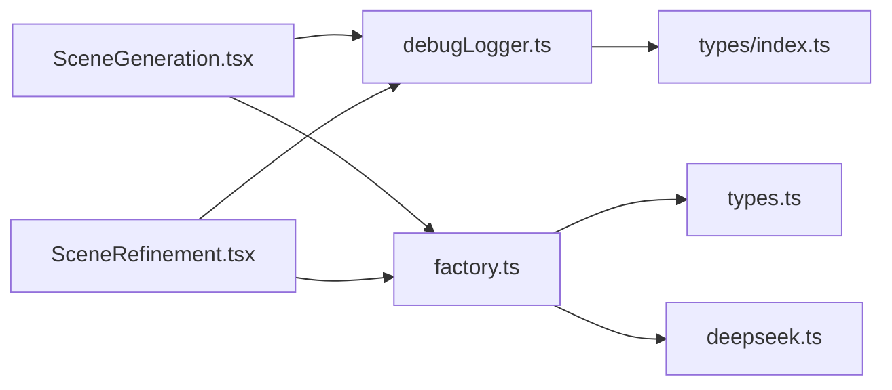

# AI调试日志器

<cite>
**本文引用的文件**
- [debugLogger.ts](file://manga-creator/src/lib/ai/debugLogger.ts)
- [main.tsx](file://manga-creator/src/main.tsx)
- [README.md](file://manga-creator/README.md)
- [SceneGeneration.tsx](file://manga-creator/src/components/editor/SceneGeneration.tsx)
- [SceneRefinement.tsx](file://manga-creator/src/components/editor/SceneRefinement.tsx)
- [skills.ts](file://manga-creator/src/lib/ai/skills.ts)
- [factory.ts](file://manga-creator/src/lib/ai/factory.ts)
- [types.ts](file://manga-creator/src/lib/ai/types.ts)
- [index.ts](file://manga-creator/src/types/index.ts)
- [deepseek.ts](file://manga-creator/src/lib/ai/providers/deepseek.ts)
- [streamingHandler.ts](file://manga-creator/src/lib/ai/streamingHandler.ts)
</cite>

## 目录
1. [简介](#简介)
2. [项目结构](#项目结构)
3. [核心组件](#核心组件)
4. [架构总览](#架构总览)
5. [详细组件分析](#详细组件分析)
6. [依赖分析](#依赖分析)
7. [性能考虑](#性能考虑)
8. [故障排查指南](#故障排查指南)
9. [结论](#结论)
10. [附录](#附录)

## 简介
AI调试日志器是漫剧创作助手项目中的一个专用调试工具，用于记录和可视化每次AI调用的全过程，包括调用类型、上下文、发送给AI的提示词模板与实际消息、配置信息以及响应结果（含Token用量）。它通过在浏览器控制台暴露全局对象，便于开发者在开发与排障时快速定位问题、复盘提示词效果与优化生成质量。

## 项目结构
AI调试日志器位于前端应用的工具库目录中，随应用启动即被加载，供各业务组件在调用AI时统一记录日志。

图表来源
- [main.tsx](file://manga-creator/src/main.tsx#L1-L13)
- [debugLogger.ts](file://manga-creator/src/lib/ai/debugLogger.ts#L1-L352)
- [factory.ts](file://manga-creator/src/lib/ai/factory.ts#L1-L54)
- [types.ts](file://manga-creator/src/lib/ai/types.ts#L1-L15)
- [skills.ts](file://manga-creator/src/lib/ai/skills.ts#L1-L147)
- [deepseek.ts](file://manga-creator/src/lib/ai/providers/deepseek.ts#L1-L110)
- [streamingHandler.ts](file://manga-creator/src/lib/ai/streamingHandler.ts#L1-L351)
- [SceneGeneration.tsx](file://manga-creator/src/components/editor/SceneGeneration.tsx#L1-L465)
- [SceneRefinement.tsx](file://manga-creator/src/components/editor/SceneRefinement.tsx#L1-L845)
- [index.ts](file://manga-creator/src/types/index.ts#L1-L558)

章节来源
- [main.tsx](file://manga-creator/src/main.tsx#L1-L13)
- [README.md](file://manga-creator/README.md#L1-L195)

## 核心组件
- 调试日志器：提供日志记录、更新、查询、导出与统计摘要能力；支持启用/禁用；在浏览器控制台暴露全局对象以便随时调试。
- AI工厂与适配器：负责根据配置创建AI客户端，统一调用不同供应商的聊天接口。
- 编辑器组件：在分镜生成与细化流程中调用日志器记录关键调用，便于回溯与优化。
- 技能系统：定义不同阶段的提示词模板与上下文要求，为日志器提供标准化的“技能名称”与“模板”。

章节来源
- [debugLogger.ts](file://manga-creator/src/lib/ai/debugLogger.ts#L1-L352)
- [factory.ts](file://manga-creator/src/lib/ai/factory.ts#L1-L54)
- [SceneGeneration.tsx](file://manga-creator/src/components/editor/SceneGeneration.tsx#L1-L465)
- [SceneRefinement.tsx](file://manga-creator/src/components/editor/SceneRefinement.tsx#L1-L845)
- [skills.ts](file://manga-creator/src/lib/ai/skills.ts#L1-L147)

## 架构总览
AI调试日志器贯穿应用的AI调用链路，从编辑器组件发起请求，经由AI工厂与适配器，最终到达供应商API。日志器在调用前后分别记录“待发送内容”和“响应结果”，并在控制台以结构化方式呈现。

图表来源
- [SceneGeneration.tsx](file://manga-creator/src/components/editor/SceneGeneration.tsx#L1-L465)
- [SceneRefinement.tsx](file://manga-creator/src/components/editor/SceneRefinement.tsx#L1-L845)
- [factory.ts](file://manga-creator/src/lib/ai/factory.ts#L1-L54)
- [deepseek.ts](file://manga-creator/src/lib/ai/providers/deepseek.ts#L1-L110)
- [debugLogger.ts](file://manga-creator/src/lib/ai/debugLogger.ts#L1-L352)

## 详细组件分析

### 调试日志器（debugLogger）
- 职责
  - 记录AI调用：包含调用类型、技能名称、提示词模板、填充后的完整提示词、消息数组、上下文、配置与状态。
  - 更新响应：在调用成功后补充响应内容与Token用量；在失败时记录错误信息。
  - 查询与导出：提供历史查询、清空、导出为JSON、打印统计摘要。
  - 控制台交互：在浏览器控制台暴露全局对象，支持动态启用/禁用与执行上述操作。
- 关键数据结构
  - AICallType：调用类型枚举，覆盖分镜列表生成、场景描述生成、关键帧提示词生成、时空提示词生成等。
  - AICallContext：上下文数据，包含项目/分镜/已生成内容等关键字段。
  - AICallLogEntry：单次调用的完整日志条目。
- 行为特性
  - 历史容量限制：最多保留固定数量的日志条目，超出则移除最早的一条。
  - 条目状态：pending/success/error，便于统计与筛选。
  - 控制台格式化输出：按调用类型分组，分区块展示基本信息、上下文、提示词模板、消息、完整提示词与响应摘要。
- 使用位置
  - 在分镜生成与细化组件中调用，记录关键阶段的提示词与上下文，便于后续优化。

图表来源
- [debugLogger.ts](file://manga-creator/src/lib/ai/debugLogger.ts#L1-L352)

章节来源
- [debugLogger.ts](file://manga-creator/src/lib/ai/debugLogger.ts#L1-L352)

### AI工厂与适配器（AIFactory/AIProvider）
- 职责
  - AIFactory：根据用户配置创建对应供应商的AI客户端，统一chat与streamChat接口。
  - AIProvider：抽象不同供应商的聊天接口，屏蔽差异。
  - DeepSeekProvider：示例适配器，演示如何构造URL、处理响应与错误。
- 与日志器的关系
  - 编辑器组件通过工厂创建客户端后，再调用日志器记录本次调用的上下文与配置，随后发起请求并更新日志。

图表来源
- [factory.ts](file://manga-creator/src/lib/ai/factory.ts#L1-L54)
- [types.ts](file://manga-creator/src/lib/ai/types.ts#L1-L15)
- [deepseek.ts](file://manga-creator/src/lib/ai/providers/deepseek.ts#L1-L110)

章节来源
- [factory.ts](file://manga-creator/src/lib/ai/factory.ts#L1-L54)
- [types.ts](file://manga-creator/src/lib/ai/types.ts#L1-L15)
- [deepseek.ts](file://manga-creator/src/lib/ai/providers/deepseek.ts#L1-L110)

### 编辑器组件中的日志使用（SceneGeneration/SceneRefinement）
- 分镜生成（SceneGeneration）
  - 构造完整提示词与消息数组，调用日志器记录“scene_list_generation”类型的调用。
  - 请求完成后调用更新响应，补充内容与Token用量。
  - 出错时调用更新错误，便于定位问题。
- 分镜细化（SceneRefinement）
  - 通过技能系统获取模板，替换变量后记录“scene_description/keyframe_prompt/motion_prompt”等类型调用。
  - 每个阶段均记录上下文（项目风格、主角、分镜概要、前一分镜等）与配置信息。
  - 成功后更新响应，失败后更新错误。

图表来源
- [SceneGeneration.tsx](file://manga-creator/src/components/editor/SceneGeneration.tsx#L1-L465)
- [SceneRefinement.tsx](file://manga-creator/src/components/editor/SceneRefinement.tsx#L1-L845)
- [debugLogger.ts](file://manga-creator/src/lib/ai/debugLogger.ts#L1-L352)
- [factory.ts](file://manga-creator/src/lib/ai/factory.ts#L1-L54)

章节来源
- [SceneGeneration.tsx](file://manga-creator/src/components/editor/SceneGeneration.tsx#L1-L465)
- [SceneRefinement.tsx](file://manga-creator/src/components/editor/SceneRefinement.tsx#L1-L845)

### 技能系统与上下文（skills）
- 技能定义：包含提示词模板、输出格式与最大Token限制，便于统一管理与复用。
- 上下文注入：在细化阶段，组件会将项目风格、主角、当前/前一分镜概要等上下文注入模板，日志器据此记录完整上下文，便于回溯。

章节来源
- [skills.ts](file://manga-creator/src/lib/ai/skills.ts#L1-L147)
- [SceneRefinement.tsx](file://manga-creator/src/components/editor/SceneRefinement.tsx#L1-L845)

### 类型系统支撑（types/index）
- 项目/场景/工作流状态、上下文缓存、AI相关类型（供应商、消息、响应）等，为日志器记录上下文与配置提供类型保障。

章节来源
- [index.ts](file://manga-creator/src/types/index.ts#L1-L558)

## 依赖分析
- 组件耦合
  - 编辑器组件与日志器：强耦合（必须在调用前后记录日志）。
  - 日志器与类型系统：弱耦合（通过接口定义的数据结构进行记录与查询）。
  - 工厂与适配器：弱耦合（日志器不关心具体供应商实现，仅记录调用元数据）。
- 外部依赖
  - 浏览器控制台：日志器通过console输出结构化日志。
  - Fetch API：适配器通过fetch与供应商API通信。
- 循环依赖
  - 未发现循环依赖迹象；日志器作为工具库被组件导入，工厂与适配器相互独立。

图表来源
- [SceneGeneration.tsx](file://manga-creator/src/components/editor/SceneGeneration.tsx#L1-L465)
- [SceneRefinement.tsx](file://manga-creator/src/components/editor/SceneRefinement.tsx#L1-L845)
- [debugLogger.ts](file://manga-creator/src/lib/ai/debugLogger.ts#L1-L352)
- [factory.ts](file://manga-creator/src/lib/ai/factory.ts#L1-L54)
- [types.ts](file://manga-creator/src/lib/ai/types.ts#L1-L15)
- [deepseek.ts](file://manga-creator/src/lib/ai/providers/deepseek.ts#L1-L110)
- [index.ts](file://manga-creator/src/types/index.ts#L1-L558)

章节来源
- [SceneGeneration.tsx](file://manga-creator/src/components/editor/SceneGeneration.tsx#L1-L465)
- [SceneRefinement.tsx](file://manga-creator/src/components/editor/SceneRefinement.tsx#L1-L845)
- [debugLogger.ts](file://manga-creator/src/lib/ai/debugLogger.ts#L1-L352)
- [factory.ts](file://manga-creator/src/lib/ai/factory.ts#L1-L54)
- [types.ts](file://manga-creator/src/lib/ai/types.ts#L1-L15)
- [deepseek.ts](file://manga-creator/src/lib/ai/providers/deepseek.ts#L1-L110)
- [index.ts](file://manga-creator/src/types/index.ts#L1-L558)

## 性能考虑
- 日志容量限制：默认最多保留固定数量的历史条目，避免内存膨胀。
- 控制台输出：结构化分组与表格输出，便于快速浏览，但大量日志仍可能影响控制台性能。
- Token用量：日志器记录prompt/completion/total，有助于成本与性能分析。
- 建议
  - 在生产环境可考虑降低日志级别或关闭调试输出，减少控制台渲染压力。
  - 对高频调用场景，建议合并日志或延迟输出，避免阻塞主线程。

[本节为通用建议，无需特定文件引用]

## 故障排查指南
- 如何启用/禁用调试日志
  - 在浏览器控制台执行全局对象的方法，动态切换调试输出。
- 查看最近一次调用详情
  - 使用历史查询或统计摘要，定位最近一次调用的上下文与配置。
- 导出日志进行离线分析
  - 将日志导出为JSON，便于团队协作与回归分析。
- 常见问题定位
  - 调用失败：检查错误信息与状态；核对供应商配置、API Key与模型。
  - 提示词异常：对比“提示词模板”与“完整提示词”，确认变量替换是否正确。
  - Token用量异常：核对最大Token与实际用量，评估模板长度与上下文大小。

章节来源
- [debugLogger.ts](file://manga-creator/src/lib/ai/debugLogger.ts#L1-L352)

## 结论
AI调试日志器为漫剧创作助手提供了完善的AI调用可观测性，覆盖从提示词模板、上下文注入到响应与Token用量的全流程记录。通过在编辑器组件中统一集成，开发者能够快速定位问题、优化提示词并提升生成质量。配合工厂与适配器的抽象，日志器与业务逻辑松耦合，易于扩展与维护。

[本节为总结性内容，无需特定文件引用]

## 附录

### 控制台交互命令
- window.aiDebug.setEnabled(true/false)：启用/禁用调试日志
- window.aiDebug.getHistory()：获取所有日志
- window.aiDebug.summary()：打印统计摘要
- window.aiDebug.clear()：清空日志
- window.aiDebug.export()：导出日志为JSON

章节来源
- [debugLogger.ts](file://manga-creator/src/lib/ai/debugLogger.ts#L333-L351)

### 典型调用流程（分镜细化）

图表来源
- [SceneRefinement.tsx](file://manga-creator/src/components/editor/SceneRefinement.tsx#L1-L845)
- [debugLogger.ts](file://manga-creator/src/lib/ai/debugLogger.ts#L1-L352)