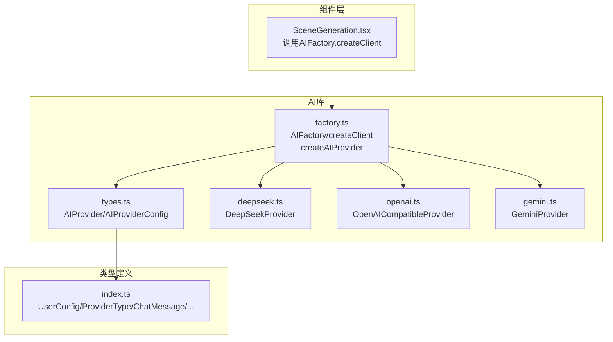
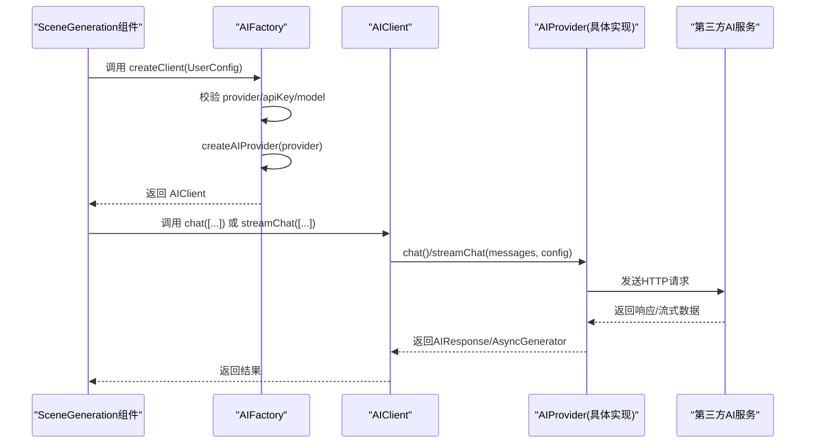
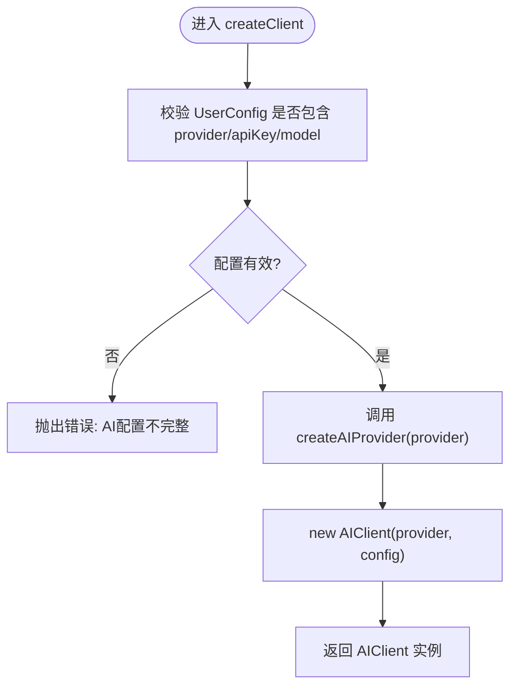
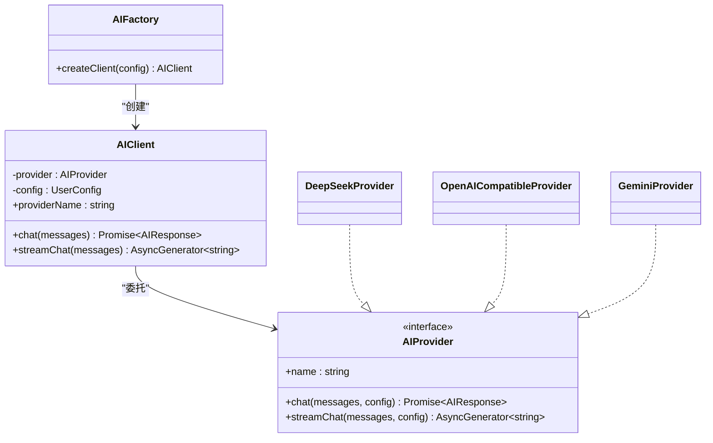
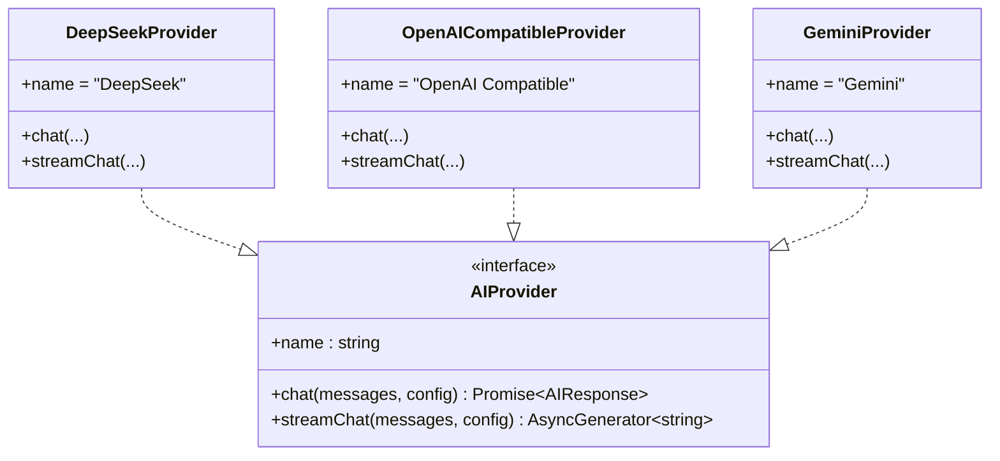
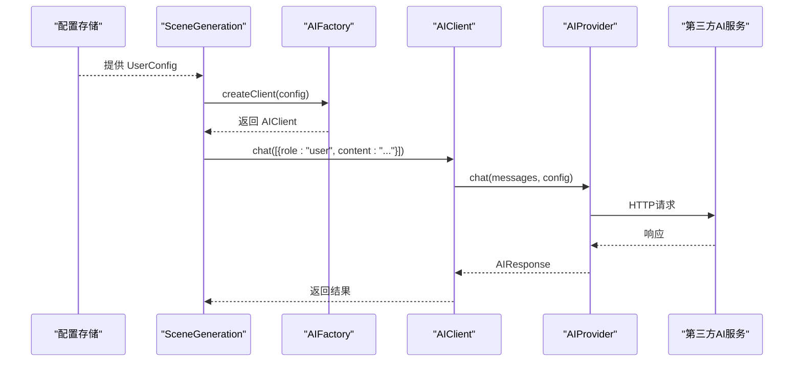
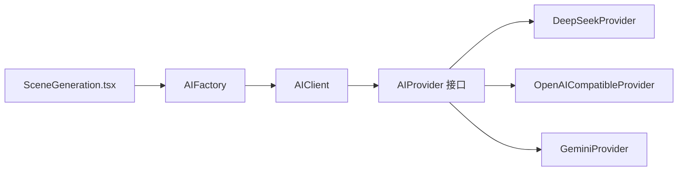

# AI客户端工厂

<cite>
**本文引用的文件**
- [factory.ts](file://manga-creator/src/lib/ai/factory.ts)
- [types.ts](file://manga-creator/src/lib/ai/types.ts)
- [openai.ts](file://manga-creator/src/lib/ai/providers/openai.ts)
- [gemini.ts](file://manga-creator/src/lib/ai/providers/gemini.ts)
- [deepseek.ts](file://manga-creator/src/lib/ai/providers/deepseek.ts)
- [SceneGeneration.tsx](file://manga-creator/src/components/editor/SceneGeneration.tsx)
- [index.ts](file://manga-creator/src/types/index.ts)
- [factory.test.ts](file://manga-creator/src/lib/ai/factory.test.ts)
- [providers.test.ts](file://manga-creator/src/lib/ai/providers/providers.test.ts)
</cite>

## 目录
1. [引言](#引言)
2. [项目结构](#项目结构)
3. [核心组件](#核心组件)
4. [架构总览](#架构总览)
5. [详细组件分析](#详细组件分析)
6. [依赖分析](#依赖分析)
7. [性能考虑](#性能考虑)
8. [故障排查指南](#故障排查指南)
9. [结论](#结论)
10. [附录](#附录)

## 引言
本文件面向AIFactory与AIClient的架构设计与实现，系统性阐述工厂模式在AI客户端中的应用：AIFactory通过createClient静态方法对UserConfig进行配置完整性校验，并依据provider类型调用createAIProvider工厂函数动态实例化对应AIProvider；AIClient作为委托者，封装统一的chat与streamChat接口，将请求转发给底层AIProvider实例。文档同时给出UML类图、调用链路图与错误处理机制说明，并结合SceneGeneration组件示例展示从用户配置到AI服务调用的完整流程，以及性能优化建议（如连接复用策略）。

## 项目结构
AI相关代码集中在manga-creator/src/lib/ai目录，包含：
- 工厂与类型定义：factory.ts、types.ts
- Provider实现：openai.ts、gemini.ts、deepseek.ts
- 组件调用示例：SceneGeneration.tsx
- 类型定义：index.ts
- 单元测试：factory.test.ts、providers.test.ts

图表来源
- [factory.ts](file://manga-creator/src/lib/ai/factory.ts#L1-L54)
- [types.ts](file://manga-creator/src/lib/ai/types.ts#L1-L15)
- [openai.ts](file://manga-creator/src/lib/ai/providers/openai.ts#L1-L88)
- [gemini.ts](file://manga-creator/src/lib/ai/providers/gemini.ts#L1-L138)
- [deepseek.ts](file://manga-creator/src/lib/ai/providers/deepseek.ts#L1-L110)
- [SceneGeneration.tsx](file://manga-creator/src/components/editor/SceneGeneration.tsx#L1-L383)
- [index.ts](file://manga-creator/src/types/index.ts#L82-L108)

章节来源
- [factory.ts](file://manga-creator/src/lib/ai/factory.ts#L1-L54)
- [types.ts](file://manga-creator/src/lib/ai/types.ts#L1-L15)
- [openai.ts](file://manga-creator/src/lib/ai/providers/openai.ts#L1-L88)
- [gemini.ts](file://manga-creator/src/lib/ai/providers/gemini.ts#L1-L138)
- [deepseek.ts](file://manga-creator/src/lib/ai/providers/deepseek.ts#L1-L110)
- [SceneGeneration.tsx](file://manga-creator/src/components/editor/SceneGeneration.tsx#L1-L383)
- [index.ts](file://manga-creator/src/types/index.ts#L82-L108)

## 核心组件
- AIFactory：负责创建AIClient实例，执行UserConfig配置校验，选择并实例化具体AIProvider。
- AIClient：持有AIProvider实例与UserConfig，提供统一的chat与streamChat接口，采用委托模式将请求转发给底层Provider。
- AIProvider接口：定义统一的name、chat、streamChat能力，各Provider实现遵循该接口。
- Provider实现：DeepSeekProvider、OpenAICompatibleProvider、GeminiProvider分别对接不同后端API。

章节来源
- [factory.ts](file://manga-creator/src/lib/ai/factory.ts#L22-L54)
- [types.ts](file://manga-creator/src/lib/ai/types.ts#L1-L15)
- [openai.ts](file://manga-creator/src/lib/ai/providers/openai.ts#L1-L88)
- [gemini.ts](file://manga-creator/src/lib/ai/providers/gemini.ts#L1-L138)
- [deepseek.ts](file://manga-creator/src/lib/ai/providers/deepseek.ts#L1-L110)

## 架构总览
AIFactory.createClient在创建AIClient之前，对UserConfig进行严格校验（provider、apiKey、model必须存在），随后通过createAIProvider按类型创建具体Provider实例，最后将Provider与UserConfig注入AIClient。AIClient对外暴露chat与streamChat两个方法，内部委托给底层Provider完成实际请求。

图表来源
- [factory.ts](file://manga-creator/src/lib/ai/factory.ts#L44-L54)
- [openai.ts](file://manga-creator/src/lib/ai/providers/openai.ts#L7-L88)
- [gemini.ts](file://manga-creator/src/lib/ai/providers/gemini.ts#L58-L138)
- [deepseek.ts](file://manga-creator/src/lib/ai/providers/deepseek.ts#L29-L110)
- [SceneGeneration.tsx](file://manga-creator/src/components/editor/SceneGeneration.tsx#L51-L136)

## 详细组件分析

### AIFactory与工厂函数
- createAIProvider：根据ProviderType枚举值返回对应Provider实例，包含deepseek、kimi/openai-compatible、gemini三类分支，未覆盖的类型抛出错误。
- AIFactory.createClient：对UserConfig进行非空校验（provider、apiKey、model），否则抛出“AI配置不完整”的错误；通过createAIProvider创建Provider实例，再以Provider与UserConfig构造AIClient并返回。

图表来源
- [factory.ts](file://manga-creator/src/lib/ai/factory.ts#L44-L54)

章节来源
- [factory.ts](file://manga-creator/src/lib/ai/factory.ts#L8-L20)
- [factory.ts](file://manga-creator/src/lib/ai/factory.ts#L44-L54)
- [factory.test.ts](file://manga-creator/src/lib/ai/factory.test.ts#L50-L100)

### AIClient委托模式
- 构造函数注入：AIClient在构造时接收AIProvider与UserConfig，形成“委托”关系，将业务调用转发给Provider。
- 统一接口：chat与streamChat两个方法均将messages与config透传给Provider，保持上层调用的一致性。
- 依赖倒置：上层仅依赖AIProvider接口，不关心具体实现，符合依赖倒置原则。

图表来源
- [factory.ts](file://manga-creator/src/lib/ai/factory.ts#L22-L54)
- [types.ts](file://manga-creator/src/lib/ai/types.ts#L10-L15)
- [openai.ts](file://manga-creator/src/lib/ai/providers/openai.ts#L1-L88)
- [gemini.ts](file://manga-creator/src/lib/ai/providers/gemini.ts#L1-L138)
- [deepseek.ts](file://manga-creator/src/lib/ai/providers/deepseek.ts#L1-L110)

章节来源
- [factory.ts](file://manga-creator/src/lib/ai/factory.ts#L22-L43)
- [types.ts](file://manga-creator/src/lib/ai/types.ts#L10-L15)

### Provider实现对比
- DeepSeekProvider：使用深思API，支持同步与流式两种调用；错误处理包含JSON与文本解析回退。
- OpenAICompatibleProvider：兼容OpenAI风格API，支持同步与流式；流式解析SSE数据。
- GeminiProvider：使用Google Generative Language API，消息格式转换与流式URL构建不同；错误处理包含多种响应体解析路径。

图表来源
- [types.ts](file://manga-creator/src/lib/ai/types.ts#L10-L15)
- [openai.ts](file://manga-creator/src/lib/ai/providers/openai.ts#L1-L88)
- [gemini.ts](file://manga-creator/src/lib/ai/providers/gemini.ts#L1-L138)
- [deepseek.ts](file://manga-creator/src/lib/ai/providers/deepseek.ts#L1-L110)

章节来源
- [openai.ts](file://manga-creator/src/lib/ai/providers/openai.ts#L1-L88)
- [gemini.ts](file://manga-creator/src/lib/ai/providers/gemini.ts#L1-L138)
- [deepseek.ts](file://manga-creator/src/lib/ai/providers/deepseek.ts#L1-L110)

### 从用户配置到AI服务调用的完整链路（SceneGeneration示例）
- 用户在界面中配置AI服务（ProviderType、apiKey、model等），SceneGeneration读取全局配置。
- 调用AIFactory.createClient(config)创建AIClient实例。
- 调用client.chat或client.streamChat发起请求，内部委托给对应Provider。
- Provider通过fetch向第三方API发送请求，解析响应并返回给AIClient，最终回到SceneGeneration组件。

图表来源
- [SceneGeneration.tsx](file://manga-creator/src/components/editor/SceneGeneration.tsx#L51-L136)
- [factory.ts](file://manga-creator/src/lib/ai/factory.ts#L44-L54)
- [openai.ts](file://manga-creator/src/lib/ai/providers/openai.ts#L7-L35)
- [gemini.ts](file://manga-creator/src/lib/ai/providers/gemini.ts#L58-L88)
- [deepseek.ts](file://manga-creator/src/lib/ai/providers/deepseek.ts#L29-L57)

章节来源
- [SceneGeneration.tsx](file://manga-creator/src/components/editor/SceneGeneration.tsx#L51-L136)
- [factory.ts](file://manga-creator/src/lib/ai/factory.ts#L44-L54)

## 依赖分析
- 组件耦合与内聚
  - AIFactory与AIClient之间通过接口耦合，AIClient依赖AIProvider接口，Provider实现彼此独立，内聚度高。
  - Provider实现依赖fetch与SSE解析，但对外暴露统一接口，便于替换与扩展。
- 外部依赖
  - 第三方AI服务API（DeepSeek、OpenAI、Gemini），通过统一的AIProvider接口屏蔽差异。
- 循环依赖
  - 未发现循环依赖，模块职责清晰。

图表来源
- [factory.ts](file://manga-creator/src/lib/ai/factory.ts#L22-L54)
- [types.ts](file://manga-creator/src/lib/ai/types.ts#L10-L15)
- [openai.ts](file://manga-creator/src/lib/ai/providers/openai.ts#L1-L88)
- [gemini.ts](file://manga-creator/src/lib/ai/providers/gemini.ts#L1-L138)
- [deepseek.ts](file://manga-creator/src/lib/ai/providers/deepseek.ts#L1-L110)
- [SceneGeneration.tsx](file://manga-creator/src/components/editor/SceneGeneration.tsx#L1-L383)

章节来源
- [factory.ts](file://manga-creator/src/lib/ai/factory.ts#L22-L54)
- [types.ts](file://manga-creator/src/lib/ai/types.ts#L10-L15)
- [openai.ts](file://manga-creator/src/lib/ai/providers/openai.ts#L1-L88)
- [gemini.ts](file://manga-creator/src/lib/ai/providers/gemini.ts#L1-L138)
- [deepseek.ts](file://manga-creator/src/lib/ai/providers/deepseek.ts#L1-L110)
- [SceneGeneration.tsx](file://manga-creator/src/components/editor/SceneGeneration.tsx#L1-L383)

## 性能考虑
- 连接复用
  - 当前实现每次调用都会新建Provider实例并通过fetch发送请求。若频繁调用，可考虑在Provider内部维护持久化的fetch会话或重用连接池（例如通过代理或中间件层），减少握手开销。
- 流式传输
  - streamChat已采用SSE流式解析，前端可边接收边渲染，降低首屏等待时间。
- 请求批量化
  - 对于连续的相似请求，可在上层聚合或去重，减少重复计算与网络往返。
- 缓存与预热
  - 对热点模型与常用提示词进行缓存，缩短响应时间；在应用启动阶段预热Provider实例，避免首次调用延迟。
- 错误重试与退避
  - 对429/5xx等可重试错误实施指数退避策略，提升稳定性。

[本节为通用性能建议，不直接分析具体文件，故无章节来源]

## 故障排查指南
- 配置校验失败
  - 现象：调用createClient时抛出“AI配置不完整”错误。
  - 排查：确认UserConfig中provider、apiKey、model字段均已设置且非空。
- Provider类型不支持
  - 现象：createAIProvider抛出“不支持的供应商类型”错误。
  - 排查：检查ProviderType是否为受支持枚举值之一。
- API错误与网络异常
  - 现象：chat/streamChat抛出API错误或网络异常。
  - 排查：查看Provider内部错误处理逻辑，确认headers、body结构与第三方API一致；检查baseURL与模型名配置。
- 流式解析异常
  - 现象：streamChat消费过程中出现解析错误或无响应体。
  - 排查：确认fetch返回的body存在且SSE数据格式正确；对跨块数据与无效JSON行进行容错处理。

章节来源
- [factory.test.ts](file://manga-creator/src/lib/ai/factory.test.ts#L50-L100)
- [providers.test.ts](file://manga-creator/src/lib/ai/providers/providers.test.ts#L102-L151)
- [openai.ts](file://manga-creator/src/lib/ai/providers/openai.ts#L37-L88)
- [gemini.ts](file://manga-creator/src/lib/ai/providers/gemini.ts#L90-L138)
- [deepseek.ts](file://manga-creator/src/lib/ai/providers/deepseek.ts#L59-L110)

## 结论
本架构以工厂模式为核心，通过AIFactory统一入口与AIClient委托模式，实现了对多Provider的抽象与解耦。UserConfig在创建阶段即被严格校验，确保运行期的稳定性；Provider实现遵循统一接口，便于扩展新的AI服务。结合SceneGeneration组件的调用示例，展示了从用户配置到AI服务调用的完整链路。未来可在Provider内部引入连接复用、缓存与重试等机制，进一步提升性能与可靠性。

[本节为总结性内容，不直接分析具体文件，故无章节来源]

## 附录
- 关键类型定义
  - ProviderType：'deepseek' | 'kimi' | 'gemini' | 'openai-compatible'
  - UserConfig：provider、apiKey、baseURL、model
  - ChatMessage：role、content
  - AIResponse：content、tokenUsage

章节来源
- [index.ts](file://manga-creator/src/types/index.ts#L82-L108)