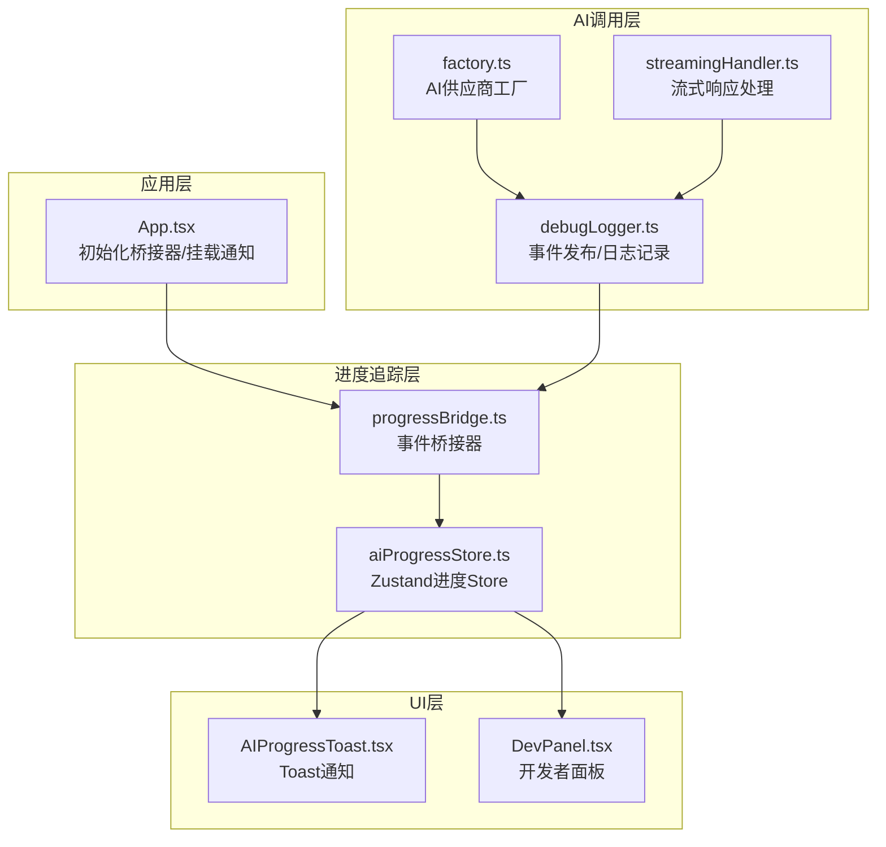
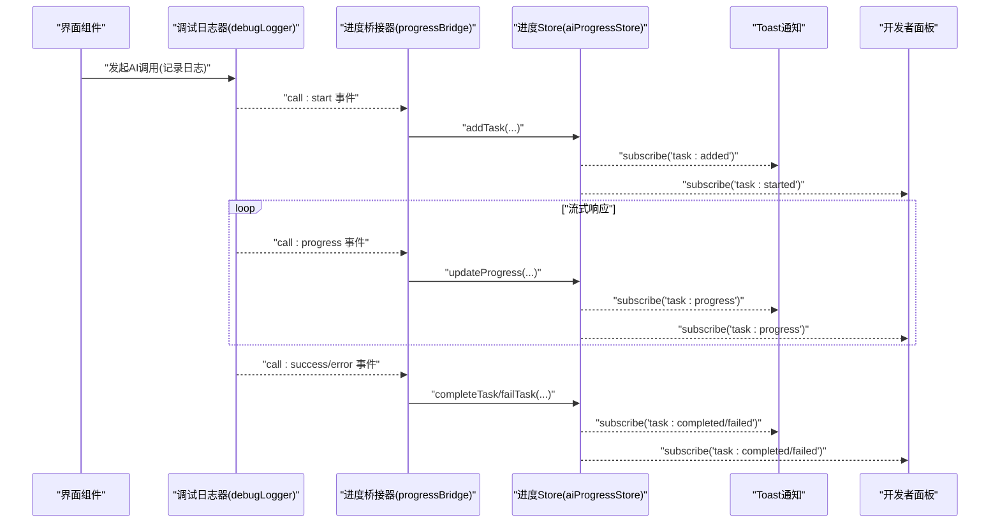
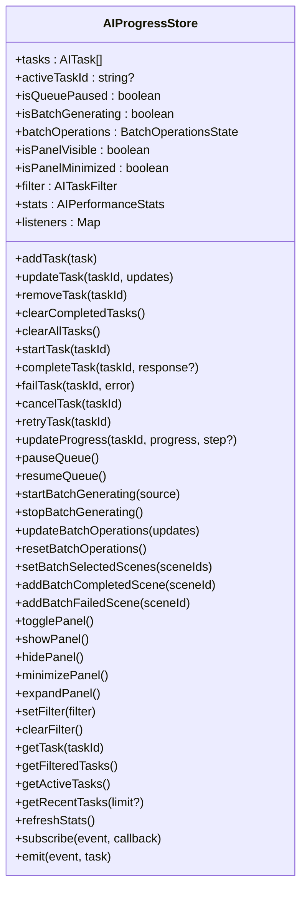
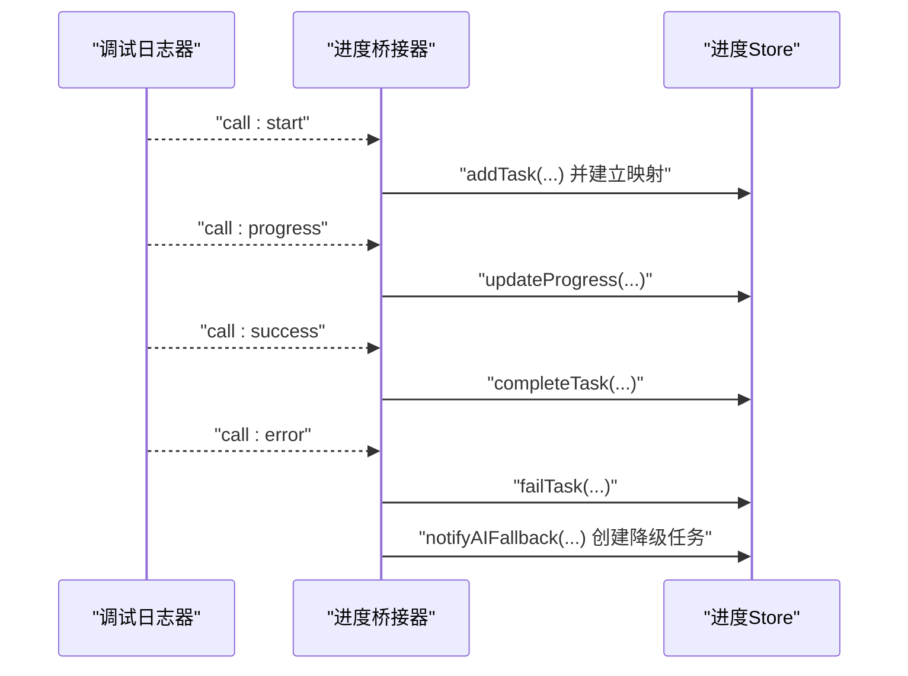
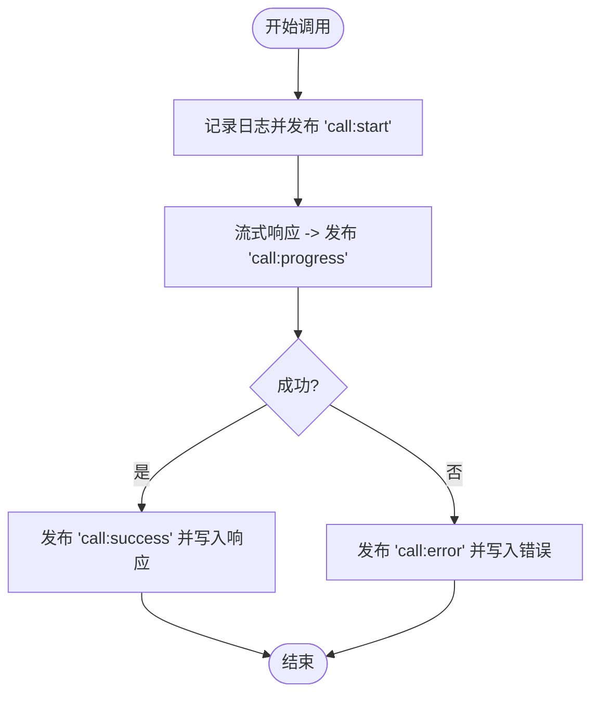
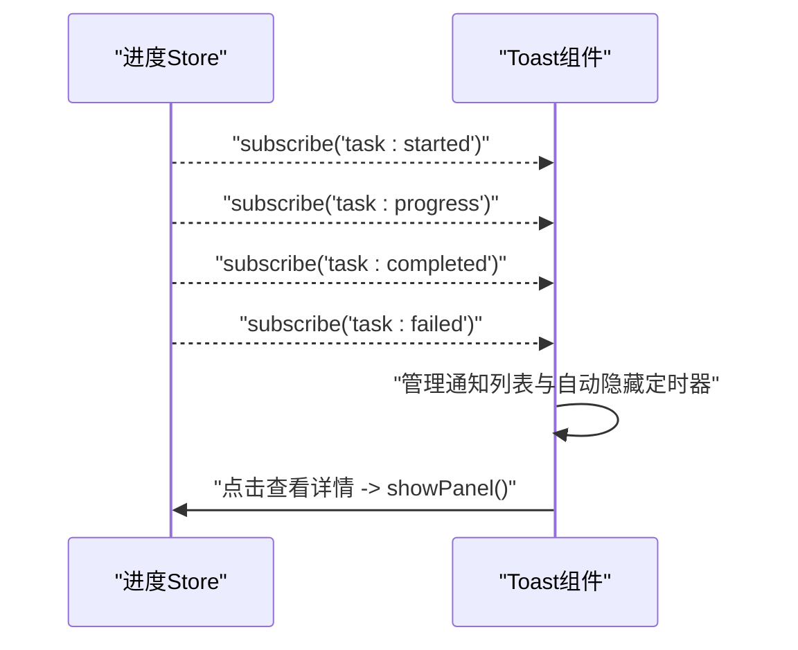
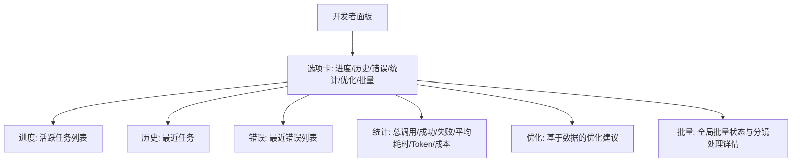
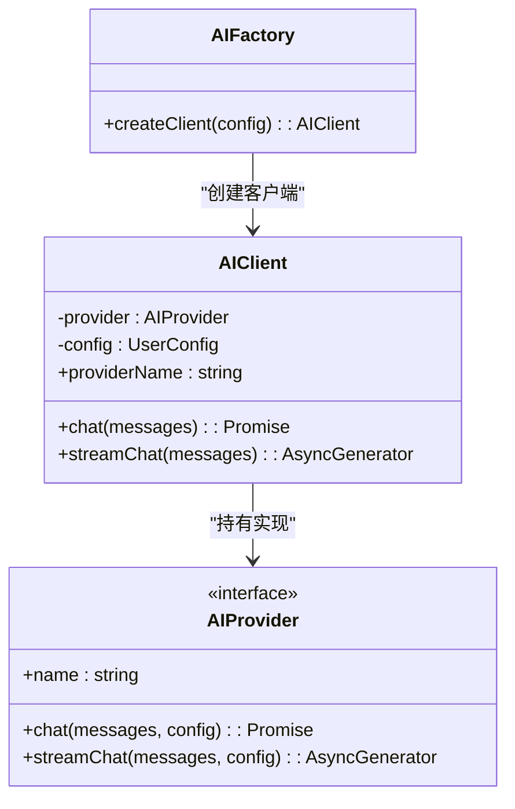
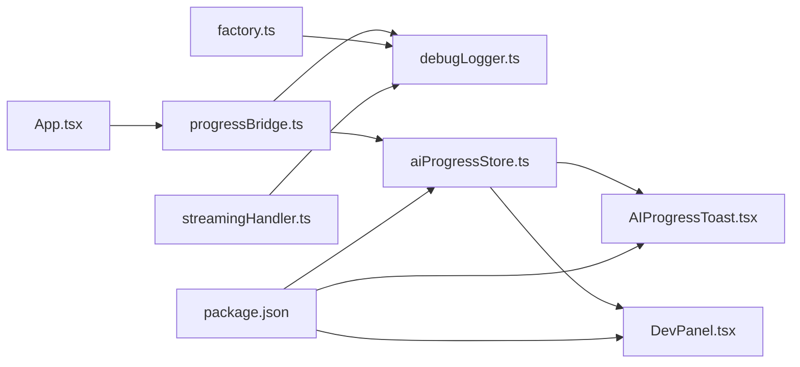

# AI进度跟踪系统

<cite>
**本文引用的文件**
- [README.md](file://README.md)
- [App.tsx](file://src/App.tsx)
- [aiProgressStore.ts](file://src/stores/aiProgressStore.ts)
- [progressBridge.ts](file://src/lib/ai/progressBridge.ts)
- [debugLogger.ts](file://src/lib/ai/debugLogger.ts)
- [AIProgressToast.tsx](file://src/components/AIProgressToast.tsx)
- [DevPanel.tsx](file://src/components/DevPanel.tsx)
- [streamingHandler.ts](file://src/lib/ai/streamingHandler.ts)
- [factory.ts](file://src/lib/ai/factory.ts)
- [types.ts](file://src/lib/ai/types.ts)
- [package.json](file://package.json)
- [aiProgressStore.test.ts](file://src/stores/aiProgressStore.test.ts)
</cite>

## 目录
1. [简介](#简介)
2. [项目结构](#项目结构)
3. [核心组件](#核心组件)
4. [架构总览](#架构总览)
5. [详细组件分析](#详细组件分析)
6. [依赖关系分析](#依赖关系分析)
7. [性能考量](#性能考量)
8. [故障排查指南](#故障排查指南)
9. [结论](#结论)
10. [附录](#附录)

## 简介
本系统是“漫剧创作助手”前端应用中的AI进度跟踪与可视化模块，围绕AI调用生命周期提供统一的进度追踪、实时通知、开发者面板与批量操作状态管理。其核心目标是：
- 将AI调用从“黑盒”变为“可观测”，通过事件驱动与状态管理实现全链路进度可视化
- 提供Toast与开发者面板双通道的用户反馈，兼顾即时体验与深度诊断
- 通过桥接器将调试日志与进度状态打通，形成“日志即进度”的闭环

系统基于Zustand状态管理，结合事件订阅机制，实现低耦合、高扩展的进度追踪能力，并为后续AI供应商适配、流式响应与批量操作提供坚实基础。

## 项目结构
- 应用入口负责初始化进度桥接器与挂载通知组件
- 进度状态由独立store管理，包含任务列表、过滤器、统计与事件订阅
- 桥接器订阅调试日志事件，自动创建/更新任务并同步进度
- UI层提供Toast通知与开发者面板，分别面向用户与开发者
- 工厂与流式处理器为AI调用提供统一抽象与流式能力

图表来源
- [App.tsx](file://src/App.tsx#L1-L207)
- [debugLogger.ts](file://src/lib/ai/debugLogger.ts#L1-L530)
- [progressBridge.ts](file://src/lib/ai/progressBridge.ts#L1-L314)
- [aiProgressStore.ts](file://src/stores/aiProgressStore.ts#L1-L669)
- [AIProgressToast.tsx](file://src/components/AIProgressToast.tsx#L1-L309)
- [DevPanel.tsx](file://src/components/DevPanel.tsx#L1-L873)
- [streamingHandler.ts](file://src/lib/ai/streamingHandler.ts#L1-L377)
- [factory.ts](file://src/lib/ai/factory.ts#L1-L56)

章节来源
- [README.md](file://README.md#L1-L195)
- [package.json](file://package.json#L1-L79)

## 核心组件
- 进度Store（aiProgressStore.ts）
  - 管理任务列表、活动任务、过滤器、统计与事件订阅
  - 提供任务生命周期方法：新增、开始、更新进度、完成、失败、取消、重试
  - 提供批量操作状态管理与面板控制
- 桥接器（progressBridge.ts）
  - 订阅调试日志事件，自动创建任务并同步进度
  - 提供手动创建任务的能力，便于非日志路径的调用也能被追踪
- 调试日志器（debugLogger.ts）
  - 记录每次AI调用的上下文、消息、配置与响应
  - 发布事件：开始、成功、失败、进度
- 通知组件（AIProgressToast.tsx）
  - 实时Toast通知，支持折叠/展开、自动隐藏、查看详情
- 开发者面板（DevPanel.tsx）
  - 展示实时进度、历史记录、错误与统计，支持导出与优化建议
- 工厂与流式处理器（factory.ts、streamingHandler.ts）
  - 统一AI供应商接入与流式响应处理，支撑进度估算与中断能力

章节来源
- [aiProgressStore.ts](file://src/stores/aiProgressStore.ts#L1-L669)
- [progressBridge.ts](file://src/lib/ai/progressBridge.ts#L1-L314)
- [debugLogger.ts](file://src/lib/ai/debugLogger.ts#L1-L530)
- [AIProgressToast.tsx](file://src/components/AIProgressToast.tsx#L1-L309)
- [DevPanel.tsx](file://src/components/DevPanel.tsx#L1-L873)
- [streamingHandler.ts](file://src/lib/ai/streamingHandler.ts#L1-L377)
- [factory.ts](file://src/lib/ai/factory.ts#L1-L56)

## 架构总览
系统采用“事件驱动 + 状态管理”的架构：
- 调试日志器作为事件源，发布调用生命周期事件
- 桥接器订阅事件，将日志映射为进度任务并写入Store
- UI层通过订阅Store事件，实时渲染Toast与面板
- 工厂与流式处理器为AI调用提供统一抽象，便于扩展与监控

图表来源
- [debugLogger.ts](file://src/lib/ai/debugLogger.ts#L1-L530)
- [progressBridge.ts](file://src/lib/ai/progressBridge.ts#L1-L314)
- [aiProgressStore.ts](file://src/stores/aiProgressStore.ts#L1-L669)
- [AIProgressToast.tsx](file://src/components/AIProgressToast.tsx#L1-L309)
- [DevPanel.tsx](file://src/components/DevPanel.tsx#L1-L873)

## 详细组件分析

### 进度Store（aiProgressStore.ts）
- 数据模型
  - 任务项：包含类型、标题、描述、状态、优先级、进度、上下文、时间戳、响应与错误、重试次数等
  - 批量操作状态：选中分镜集合、处理状态、进度、失败/完成列表、当前处理分镜、状态消息等
  - 统计：总调用、成功/失败数、平均响应时间、总Token消耗、预估成本
- 关键能力
  - 任务生命周期管理：新增、开始、更新进度、完成、失败、取消、重试
  - 队列与批量控制：暂停/恢复队列、全局批量生成开关、批量操作状态更新
  - 过滤与查询：按状态/类型/项目筛选、获取活跃任务、最近任务
  - 事件系统：订阅/发射任务生命周期事件，便于UI联动
- 性能与复杂度
  - 任务列表为数组，常用操作如更新进度、查找任务为O(n)，适合中小规模任务集
  - 统计计算为线性扫描，适合频繁刷新的开发者面板

图表来源
- [aiProgressStore.ts](file://src/stores/aiProgressStore.ts#L1-L669)

章节来源
- [aiProgressStore.ts](file://src/stores/aiProgressStore.ts#L1-L669)
- [aiProgressStore.test.ts](file://src/stores/aiProgressStore.test.ts#L1-L800)

### 桥接器（progressBridge.ts）
- 作用
  - 订阅调试日志器的事件，将日志映射为进度任务并写入Store
  - 提供手动创建任务的能力，便于非日志路径的调用也能被追踪
  - 提供降级通知（Fallback）机制，当AI调用失败回退到规则引擎时，自动创建“已降级”任务并告警
- 关键点
  - 日志ID到任务ID的映射，保证事件与任务的一致性
  - 对call:progress事件进行进度与步骤的透传
  - 对call:error事件进行错误包装与重试标记

图表来源
- [progressBridge.ts](file://src/lib/ai/progressBridge.ts#L1-L314)
- [debugLogger.ts](file://src/lib/ai/debugLogger.ts#L1-L530)
- [aiProgressStore.ts](file://src/stores/aiProgressStore.ts#L1-L669)

章节来源
- [progressBridge.ts](file://src/lib/ai/progressBridge.ts#L1-L314)

### 调试日志器（debugLogger.ts）
- 作用
  - 记录AI调用的上下文、消息、配置与响应
  - 发布事件：call:start、call:success、call:error、call:progress
  - 提供导出、统计、优化建议等辅助能力
- 事件与日志
  - 事件订阅/发射：基于Map维护监听器，支持返回取消订阅函数
  - 日志条目包含：ID、时间戳、调用类型、技能名、提示词模板、消息、上下文、配置、响应与状态
- 与桥接器协作
  - 桥接器通过订阅事件，将日志转换为进度任务，实现“日志即进度”

图表来源
- [debugLogger.ts](file://src/lib/ai/debugLogger.ts#L1-L530)

章节来源
- [debugLogger.ts](file://src/lib/ai/debugLogger.ts#L1-L530)

### 通知组件（AIProgressToast.tsx）
- 作用
  - 实时显示AI调用状态的Toast通知，支持折叠/展开、自动隐藏、查看详情
  - 订阅任务生命周期事件，动态管理通知列表
- 行为
  - 新任务开始时加入通知列表，最多保留最近5条
  - 成功/失败后延时自动隐藏
  - 错误任务显示可重试次数与重试上限

图表来源
- [AIProgressToast.tsx](file://src/components/AIProgressToast.tsx#L1-L309)
- [aiProgressStore.ts](file://src/stores/aiProgressStore.ts#L1-L669)

章节来源
- [AIProgressToast.tsx](file://src/components/AIProgressToast.tsx#L1-L309)

### 开发者面板（DevPanel.tsx）
- 作用
  - 展示实时进度、历史记录、错误与统计，支持导出与优化建议
  - 提供批量操作状态面板，显示全局批量状态与分镜处理详情
- 功能
  - 选项卡：进度、历史、错误、统计、优化、批量
  - 统计：总调用、成功/失败、平均响应时间、总Token消耗、成功率、预估成本
  - 批量：显示当前处理分镜、完成/失败统计、开始时间、状态消息

图表来源
- [DevPanel.tsx](file://src/components/DevPanel.tsx#L1-L873)

章节来源
- [DevPanel.tsx](file://src/components/DevPanel.tsx#L1-L873)

### 工厂与流式处理器（factory.ts、streamingHandler.ts）
- 工厂（factory.ts）
  - 根据供应商类型创建对应AI提供者实例，统一对外接口
- 流式处理器（streamingHandler.ts）
  - 统一封装OpenAI/Kimi/Gemini等供应商的流式响应
  - 提供中断能力（AbortController）、进度估算与剩余时间估算
  - 通用选择器根据配置自动选择对应供应商的流式实现

图表来源
- [factory.ts](file://src/lib/ai/factory.ts#L1-L56)
- [types.ts](file://src/lib/ai/types.ts#L1-L15)

章节来源
- [factory.ts](file://src/lib/ai/factory.ts#L1-L56)
- [streamingHandler.ts](file://src/lib/ai/streamingHandler.ts#L1-L377)
- [types.ts](file://src/lib/ai/types.ts#L1-L15)

## 依赖关系分析
- 组件耦合
  - App.tsx负责初始化桥接器与挂载通知，耦合度低，职责清晰
  - progressBridge.ts依赖debugLogger.ts与aiProgressStore.ts，形成事件到状态的桥接
  - UI层（Toast与DevPanel）仅依赖Store的订阅接口，解耦良好
- 外部依赖
  - Zustand用于轻量状态管理
  - Radix UI组件库提供基础UI能力
  - crypto-js用于API Key加密存储（在存储层使用）

图表来源
- [App.tsx](file://src/App.tsx#L1-L207)
- [progressBridge.ts](file://src/lib/ai/progressBridge.ts#L1-L314)
- [debugLogger.ts](file://src/lib/ai/debugLogger.ts#L1-L530)
- [aiProgressStore.ts](file://src/stores/aiProgressStore.ts#L1-L669)
- [AIProgressToast.tsx](file://src/components/AIProgressToast.tsx#L1-L309)
- [DevPanel.tsx](file://src/components/DevPanel.tsx#L1-L873)
- [factory.ts](file://src/lib/ai/factory.ts#L1-L56)
- [streamingHandler.ts](file://src/lib/ai/streamingHandler.ts#L1-L377)
- [package.json](file://package.json#L1-L79)

章节来源
- [package.json](file://package.json#L1-L79)

## 性能考量
- Store读写
  - 任务列表为数组，常用操作为O(n)，适合中小规模任务集；若任务量增长，可考虑索引优化或分页展示
- 事件订阅
  - 事件监听器为数组，订阅/取消订阅为O(k)，k为监听器数量；建议在组件卸载时及时取消订阅，避免内存泄漏
- 统计刷新
  - 开发者面板定时刷新统计，建议合理设置刷新频率，避免频繁计算造成卡顿
- 流式响应
  - 流式处理器支持中断与进度估算，建议在长文本生成场景中提供“中断”按钮，提升交互体验
- UI渲染
  - Toast与面板均采用订阅驱动，建议在高频事件场景下合并更新，减少不必要的重渲染

## 故障排查指南
- 无法看到Toast通知
  - 检查App.tsx是否正确挂载AIProgressToast组件
  - 检查Store的isPanelVisible状态是否被意外关闭
- 任务未出现在开发者面板
  - 确认debugLogger.ts是否发布call:start事件
  - 检查progressBridge.ts是否成功订阅事件并创建任务
- 进度不更新
  - 确认debugLogger.ts是否发布call:progress事件
  - 检查progressBridge.ts是否正确转发updateProgress
- 重试无效
  - 检查任务的retryCount与maxRetries是否达到上限
  - 确认failTask后是否触发retryTask且未超过最大重试次数
- 降级通知
  - 若出现“已降级”任务，检查notifyAIFallback的reason与message，确认回退逻辑是否生效

章节来源
- [App.tsx](file://src/App.tsx#L1-L207)
- [AIProgressToast.tsx](file://src/components/AIProgressToast.tsx#L1-L309)
- [DevPanel.tsx](file://src/components/DevPanel.tsx#L1-L873)
- [progressBridge.ts](file://src/lib/ai/progressBridge.ts#L1-L314)
- [debugLogger.ts](file://src/lib/ai/debugLogger.ts#L1-L530)
- [aiProgressStore.ts](file://src/stores/aiProgressStore.ts#L1-L669)

## 结论
该AI进度跟踪系统通过“事件驱动 + 状态管理”的方式，实现了从AI调用到用户反馈的全链路可视化。调试日志器提供事件源，桥接器将事件映射为进度任务，Store统一管理状态，UI层提供Toast与开发者面板两种反馈通道。整体架构清晰、耦合度低、扩展性强，能够有效支撑多供应商、多场景的AI创作流程。

## 附录
- 快速开始
  - 安装依赖后启动开发服务器，系统会自动初始化进度桥接器并挂载通知组件
- 常用调试命令
  - 在浏览器控制台可通过全局对象访问Store与桥接器，便于快速调试与排错

章节来源
- [README.md](file://README.md#L130-L151)
- [App.tsx](file://src/App.tsx#L1-L207)
- [aiProgressStore.ts](file://src/stores/aiProgressStore.ts#L652-L669)
- [progressBridge.ts](file://src/lib/ai/progressBridge.ts#L307-L314)