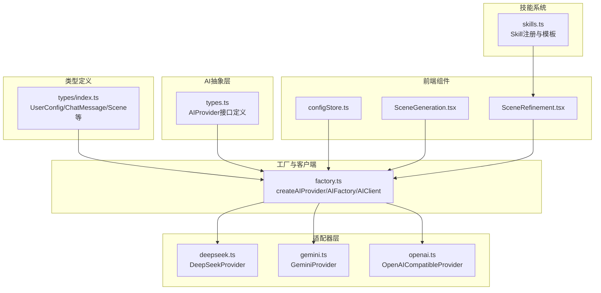
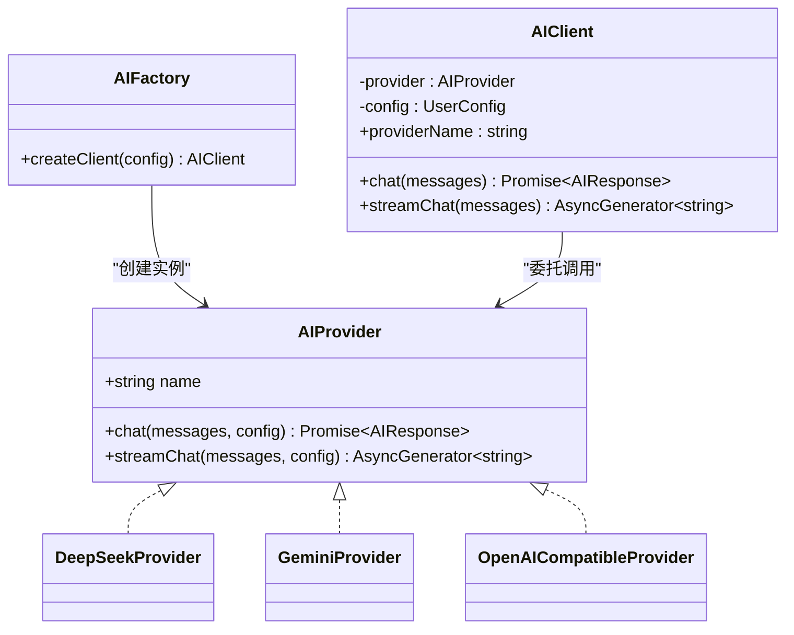

# AI集成

<cite>
**本文引用的文件**
- [factory.ts](file://manga-creator/src/lib/ai/factory.ts)
- [types.ts](file://manga-creator/src/lib/ai/types.ts)
- [deepseek.ts](file://manga-creator/src/lib/ai/providers/deepseek.ts)
- [gemini.ts](file://manga-creator/src/lib/ai/providers/gemini.ts)
- [openai.ts](file://manga-creator/src/lib/ai/providers/openai.ts)
- [skills.ts](file://manga-creator/src/lib/ai/skills.ts)
- [index.ts](file://manga-creator/src/types/index.ts)
- [SceneGeneration.tsx](file://manga-creator/src/components/editor/SceneGeneration.tsx)
- [SceneRefinement.tsx](file://manga-creator/src/components/editor/SceneRefinement.tsx)
- [configStore.ts](file://manga-creator/src/stores/configStore.ts)
- [factory.test.ts](file://manga-creator/src/lib/ai/factory.test.ts)
- [providers.test.ts](file://manga-creator/src/lib/ai/providers/providers.test.ts)
- [skills.test.ts](file://manga-creator/src/lib/ai/skills.test.ts)
</cite>

## 目录
1. [简介](#简介)
2. [项目结构](#项目结构)
3. [核心组件](#核心组件)
4. [架构总览](#架构总览)
5. [详细组件分析](#详细组件分析)
6. [依赖分析](#依赖分析)
7. [性能考虑](#性能考虑)
8. [故障排查指南](#故障排查指南)
9. [结论](#结论)
10. [附录](#附录)

## 简介
本文件面向需要集成多供应商AI能力的开发者，系统性阐述基于工厂模式的多供应商适配架构。重点包括：
- AIFactory如何依据UserConfig中的provider类型动态创建对应AIProvider实例（DeepSeekProvider、GeminiProvider、OpenAI兼容适配器）
- AIClient作为统一入口，封装chat与streamChat调用
- 各Provider适配器如何封装不同平台的HTTP请求细节（认证头、请求体格式、响应解析）
- skills.ts中Agent Skill系统如何将创意输入转化为结构化提示词模板，并驱动AI模型生成高质量输出
- 类图展示AIFactory、AIClient、AIProvider之间的继承与组合关系
- 分镜生成请求的完整调用链路示例

## 项目结构
AI相关代码集中在manga-creator/src/lib/ai目录，按“接口抽象-工厂-适配器-技能”分层组织；UI层通过组件与store调用工厂创建客户端，发起对话与流式生成。

图表来源
- [factory.ts](file://manga-creator/src/lib/ai/factory.ts#L1-L54)
- [types.ts](file://manga-creator/src/lib/ai/types.ts#L1-L15)
- [deepseek.ts](file://manga-creator/src/lib/ai/providers/deepseek.ts#L1-L110)
- [gemini.ts](file://manga-creator/src/lib/ai/providers/gemini.ts#L1-L138)
- [openai.ts](file://manga-creator/src/lib/ai/providers/openai.ts#L1-L88)
- [skills.ts](file://manga-creator/src/lib/ai/skills.ts#L1-L132)
- [index.ts](file://manga-creator/src/types/index.ts#L80-L108)
- [SceneGeneration.tsx](file://manga-creator/src/components/editor/SceneGeneration.tsx#L1-L383)
- [SceneRefinement.tsx](file://manga-creator/src/components/editor/SceneRefinement.tsx#L1-L638)
- [configStore.ts](file://manga-creator/src/stores/configStore.ts#L1-L57)

章节来源
- [factory.ts](file://manga-creator/src/lib/ai/factory.ts#L1-L54)
- [types.ts](file://manga-creator/src/lib/ai/types.ts#L1-L15)
- [index.ts](file://manga-creator/src/types/index.ts#L80-L108)

## 核心组件
- AIProvider接口：统一chat与streamChat签名，屏蔽底层差异
- AIFactory：校验UserConfig并创建具体Provider实例
- AIClient：持有Provider与UserConfig，对外暴露chat/streamChat
- Provider适配器：DeepSeekProvider、GeminiProvider、OpenAICompatibleProvider
- Skill系统：SceneListSkill、SceneDescriptionSkill、ActionDescriptionSkill、PromptGeneratorSkill

章节来源
- [types.ts](file://manga-creator/src/lib/ai/types.ts#L1-L15)
- [factory.ts](file://manga-creator/src/lib/ai/factory.ts#L1-L54)
- [skills.ts](file://manga-creator/src/lib/ai/skills.ts#L1-L132)

## 架构总览
工厂模式将“选择供应商”与“调用AI”解耦。UI层仅依赖AIFactory与AIClient，无需关心具体Provider实现。

图表来源
- [types.ts](file://manga-creator/src/lib/ai/types.ts#L1-L15)
- [factory.ts](file://manga-creator/src/lib/ai/factory.ts#L1-L54)
- [deepseek.ts](file://manga-creator/src/lib/ai/providers/deepseek.ts#L1-L110)
- [gemini.ts](file://manga-creator/src/lib/ai/providers/gemini.ts#L1-L138)
- [openai.ts](file://manga-creator/src/lib/ai/providers/openai.ts#L1-L88)

## 详细组件分析

### 工厂与客户端
- createAIProvider：根据ProviderType返回对应Provider实例，支持deepseek、kimi（映射到openai-compatible）、gemini
- AIFactory.createClient：校验UserConfig（provider、apiKey、model），创建AIClient
- AIClient：封装chat与streamChat，将UserConfig透传给Provider

章节来源
- [factory.ts](file://manga-creator/src/lib/ai/factory.ts#L1-L54)
- [factory.test.ts](file://manga-creator/src/lib/ai/factory.test.ts#L1-L120)

### Provider适配器对比
- DeepSeekProvider
  - 认证头：Authorization: Bearer {apiKey}
  - 请求体：{ model, messages }
  - 响应：choices[0].message.content；usage字段用于token统计
  - 流式：SSE，逐行data: JSON，解析choices[0].delta.content
- GeminiProvider
  - 认证头：x-goog-api-key: {apiKey}
  - 请求体：contents数组（系统指令转换为用户消息），模型路径：models/{model}:generateContent
  - 响应：candidates[0].content.parts[0].text；usageMetadata用于token统计
  - 流式：models/{model}:streamGenerateContent?alt=sse，逐行data: JSON，解析candidates[0].content.parts[0].text
- OpenAICompatibleProvider
  - 认证头：Authorization: Bearer {apiKey}
  - 请求体：{ model, messages, stream: true }
  - 响应：choices[0].message.content；usage字段用于token统计
  - 流式：SSE，逐行data: JSON，解析choices[0].delta.content

章节来源
- [deepseek.ts](file://manga-creator/src/lib/ai/providers/deepseek.ts#L1-L110)
- [gemini.ts](file://manga-creator/src/lib/ai/providers/gemini.ts#L1-L138)
- [openai.ts](file://manga-creator/src/lib/ai/providers/openai.ts#L1-L88)
- [providers.test.ts](file://manga-creator/src/lib/ai/providers/providers.test.ts#L1-L200)

### Skill系统与提示词模板
- 四项核心技能：
  - scene-list-generator：生成分镜列表，要求sceneCount、summary、style等占位符
  - scene-description：生成场景描述，要求style、protagonist、current_scene_summary、prev_scene_summary
  - action-description：生成动作描述，要求scene_description、protagonist、current_scene_summary
  - prompt-generator：生成图像提示词，要求scene_description、action_description、style、protagonist
- 注册表SkillRegistry集中管理技能；getSkillForTask/getSkillByName提供按任务/名称检索
- 组件中通过getSkillByName获取模板，结合项目上下文进行占位符替换后调用client.chat

章节来源
- [skills.ts](file://manga-creator/src/lib/ai/skills.ts#L1-L132)
- [skills.test.ts](file://manga-creator/src/lib/ai/skills.test.ts#L1-L120)
- [SceneRefinement.tsx](file://manga-creator/src/components/editor/SceneRefinement.tsx#L1-L220)

### UI调用链路示例：分镜生成
从用户点击“AI生成分镜”到返回结果的完整调用链：

图表来源
- [SceneGeneration.tsx](file://manga-creator/src/components/editor/SceneGeneration.tsx#L60-L120)
- [configStore.ts](file://manga-creator/src/stores/configStore.ts#L45-L56)
- [factory.ts](file://manga-creator/src/lib/ai/factory.ts#L44-L54)
- [deepseek.ts](file://manga-creator/src/lib/ai/providers/deepseek.ts#L29-L57)
- [gemini.ts](file://manga-creator/src/lib/ai/providers/gemini.ts#L58-L88)
- [openai.ts](file://manga-creator/src/lib/ai/providers/openai.ts#L7-L35)

### 流式生成链路（以DeepSeek为例）

图表来源
- [SceneRefinement.tsx](file://manga-creator/src/components/editor/SceneRefinement.tsx#L1-L120)
- [factory.ts](file://manga-creator/src/lib/ai/factory.ts#L35-L43)
- [deepseek.ts](file://manga-creator/src/lib/ai/providers/deepseek.ts#L59-L109)

## 依赖分析
- 组件依赖
  - SceneGeneration与SceneRefinement均依赖AIFactory创建客户端
  - configStore负责加载/保存UserConfig，并通过AIFactory进行连通性测试
- Provider依赖
  - types.ts定义AIProvider接口与UserConfig
  - index.ts定义ProviderType枚举与ChatMessage/Scene等业务类型
- 测试覆盖
  - factory.test.ts覆盖AIFactory与AIClient行为
  - providers.test.ts覆盖各Provider的请求构建、错误处理与流式解析
  - skills.test.ts覆盖技能定义、注册表与模板占位符

章节来源
- [SceneGeneration.tsx](file://manga-creator/src/components/editor/SceneGeneration.tsx#L1-L120)
- [SceneRefinement.tsx](file://manga-creator/src/components/editor/SceneRefinement.tsx#L1-L120)
- [configStore.ts](file://manga-creator/src/stores/configStore.ts#L1-L57)
- [types.ts](file://manga-creator/src/lib/ai/types.ts#L1-L15)
- [index.ts](file://manga-creator/src/types/index.ts#L80-L108)
- [factory.test.ts](file://manga-creator/src/lib/ai/factory.test.ts#L1-L120)
- [providers.test.ts](file://manga-creator/src/lib/ai/providers/providers.test.ts#L1-L120)
- [skills.test.ts](file://manga-creator/src/lib/ai/skills.test.ts#L1-L120)

## 性能考虑
- 流式传输：Provider侧采用SSE流式读取，UI端按增量渲染，降低首屏等待时间
- 请求体精简：DeepSeek与OpenAI兼容适配器仅传递必要字段（model、messages），减少网络开销
- 错误早返回：Provider在非2xx时立即抛错，避免无效解析
- Token统计：部分Provider返回usage，便于成本控制与上限监控

[本节为通用指导，无需特定文件来源]

## 故障排查指南
- 配置不完整
  - 现象：AIFactory.createClient抛出“AI配置不完整”
  - 处理：检查UserConfig的provider、apiKey、model是否齐全
- 供应商不支持
  - 现象：createAIProvider抛出“不支持的供应商类型”
  - 处理：确认ProviderType是否为deepseek/kimi/gemini/openai-compatible之一
- HTTP错误
  - DeepSeek/Gemini/OpenAI兼容：根据响应状态与错误体定位问题（如401、429、5xx）
  - 处理：核对API Key、模型名、baseURL、网络连通性
- 流式解析异常
  - 现象：SSE数据解析失败或断流
  - 处理：检查Provider对SSE行的切分与JSON解析逻辑，确保跨块数据拼接正确
- 技能模板缺失
  - 现象：getSkillByName返回null
  - 处理：确认技能名称映射或直接使用注册表键名

章节来源
- [factory.test.ts](file://manga-creator/src/lib/ai/factory.test.ts#L50-L120)
- [providers.test.ts](file://manga-creator/src/lib/ai/providers/providers.test.ts#L1-L120)
- [skills.test.ts](file://manga-creator/src/lib/ai/skills.test.ts#L170-L220)

## 结论
该架构以工厂模式为核心，将多供应商适配与调用方解耦，具备良好的扩展性与可维护性。通过统一的AIProvider接口与AIClient封装，UI层可无缝切换不同供应商；Skill系统则将创意输入结构化为模板，提升生成质量与一致性。建议后续在以下方面持续优化：
- 增加重试与退避策略
- 引入请求日志与可观测性
- 支持更多供应商（如Claude、Ollama等）

[本节为总结性内容，无需特定文件来源]

## 附录

### 类图：继承与组合关系

图表来源
- [types.ts](file://manga-creator/src/lib/ai/types.ts#L1-L15)
- [factory.ts](file://manga-creator/src/lib/ai/factory.ts#L1-L54)
- [deepseek.ts](file://manga-creator/src/lib/ai/providers/deepseek.ts#L1-L110)
- [gemini.ts](file://manga-creator/src/lib/ai/providers/gemini.ts#L1-L138)
- [openai.ts](file://manga-creator/src/lib/ai/providers/openai.ts#L1-L88)

### 数据模型：UserConfig与消息结构

图表来源
- [index.ts](file://manga-creator/src/types/index.ts#L80-L108)
- [types.ts](file://manga-creator/src/lib/ai/types.ts#L1-L15)