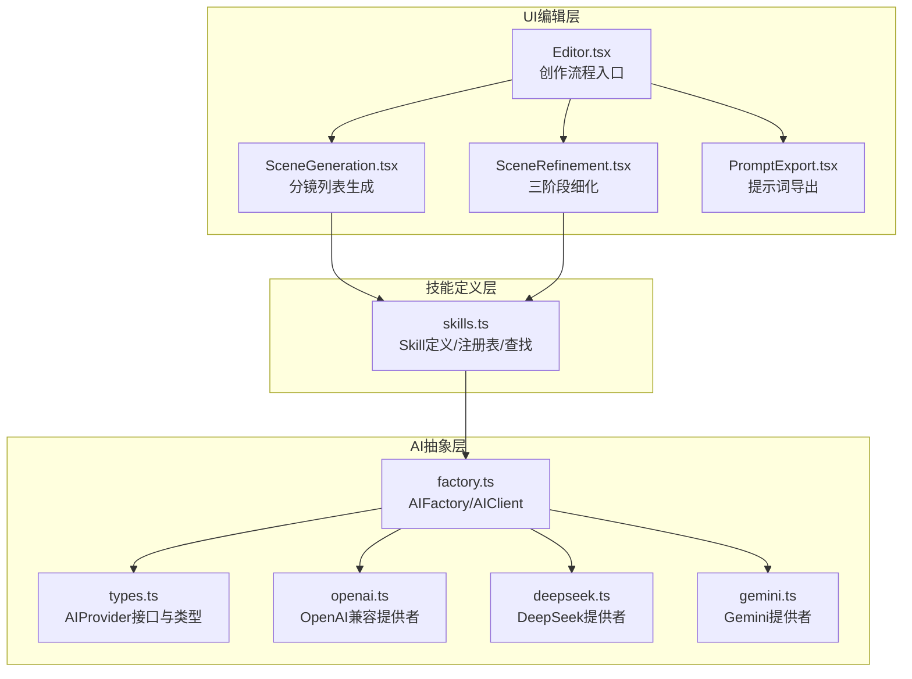
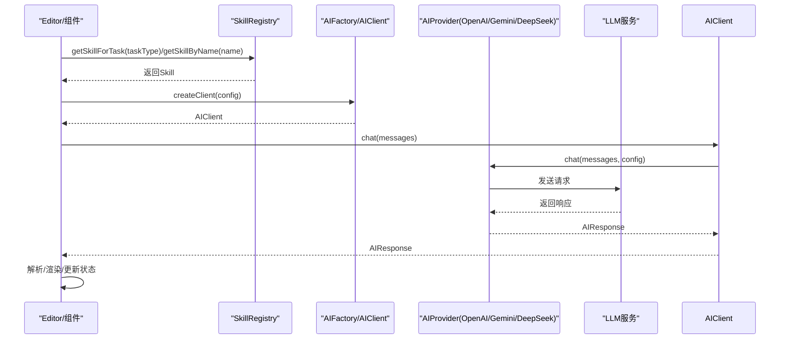
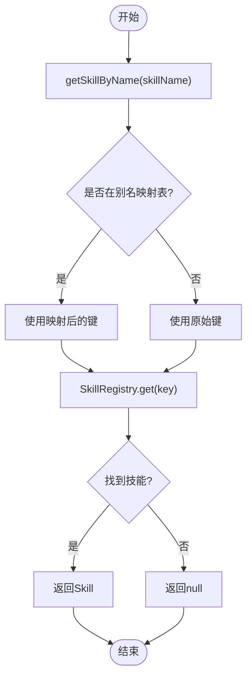
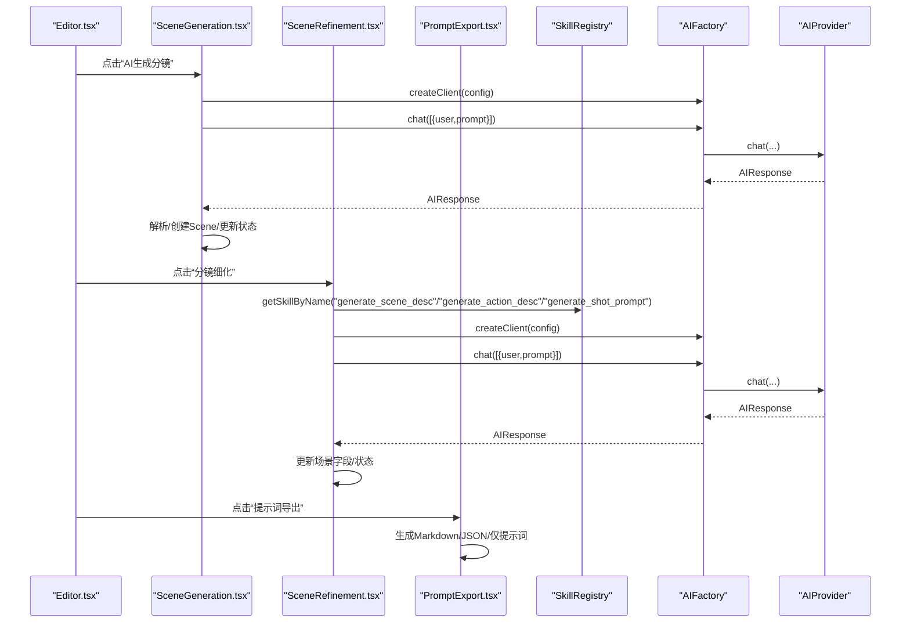
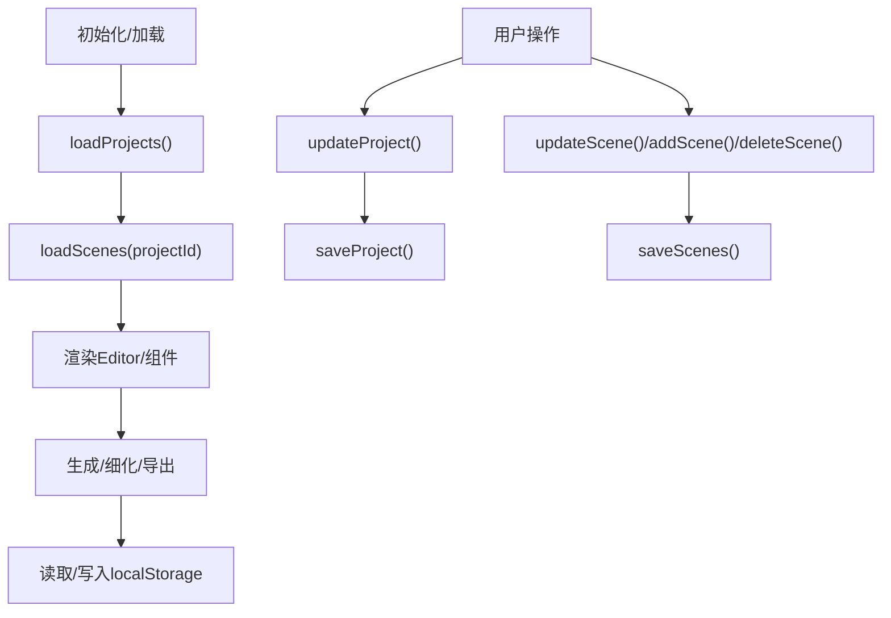
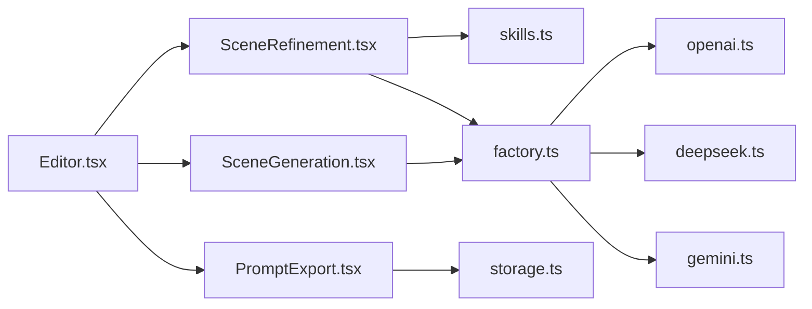

# Agent技能系统

<cite>
**本文引用的文件**
- [skills.ts](file://manga-creator/src/lib/ai/skills.ts)
- [types.ts](file://manga-creator/src/types/index.ts)
- [factory.ts](file://manga-creator/src/lib/ai/factory.ts)
- [openai.ts](file://manga-creator/src/lib/ai/providers/openai.ts)
- [deepseek.ts](file://manga-creator/src/lib/ai/providers/deepseek.ts)
- [gemini.ts](file://manga-creator/src/lib/ai/providers/gemini.ts)
- [SceneGeneration.tsx](file://manga-creator/src/components/editor/SceneGeneration.tsx)
- [SceneRefinement.tsx](file://manga-creator/src/components/editor/SceneRefinement.tsx)
- [PromptExport.tsx](file://manga-creator/src/components/editor/PromptExport.tsx)
- [Editor.tsx](file://manga-creator/src/components/Editor.tsx)
- [storyboardStore.ts](file://manga-creator/src/stores/storyboardStore.ts)
- [projectStore.ts](file://manga-creator/src/stores/projectStore.ts)
- [storage.ts](file://manga-creator/src/lib/storage.ts)
- [skills.test.ts](file://manga-creator/src/lib/ai/skills.test.ts)
</cite>

## 目录
1. [简介](#简介)
2. [项目结构](#项目结构)
3. [核心组件](#核心组件)
4. [架构总览](#架构总览)
5. [详细组件分析](#详细组件分析)
6. [依赖关系分析](#依赖关系分析)
7. [性能考量](#性能考量)
8. [故障排查指南](#故障排查指南)
9. [结论](#结论)
10. [附录](#附录)

## 简介
本文件系统性阐述Agent技能系统的设计理念与运行机制，重点覆盖：
- Skill接口的字段语义与约束：promptTemplate模板语法（{{}}与{}插值）、requiredContext上下文依赖、outputFormat输出约束、maxTokens上限等。
- 具体技能的提示词工程设计：SceneListSkill、SceneDescriptionSkill、ActionDescriptionSkill、PromptGeneratorSkill的提示词结构、角色定位、输出要求与约束。
- SkillRegistry注册机制与getSkillForTask/getSkillByName查找逻辑。
- Editor组件如何依据任务类型检索技能、填充上下文变量并构造最终提示词。
- 分镜生成流程与三阶段细化流程的衔接。
- 技能系统扩展指南：新增自定义技能的步骤与最佳实践。

## 项目结构
技能系统位于manga-creator/src/lib/ai目录，围绕“技能定义、工厂与AI提供者、UI编辑器组件”三层组织：
- 技能定义层：skills.ts集中声明技能、注册表与查找函数。
- AI抽象层：types.ts定义AI提供者接口；factory.ts负责创建客户端；providers目录封装不同供应商的实现。
- UI编辑层：Editor.tsx作为创作流程入口；SceneGeneration.tsx负责分镜列表生成；SceneRefinement.tsx负责三阶段细化；PromptExport.tsx负责导出。

图表来源
- [skills.ts](file://manga-creator/src/lib/ai/skills.ts#L1-L132)
- [types.ts](file://manga-creator/src/types/index.ts#L1-L190)
- [factory.ts](file://manga-creator/src/lib/ai/factory.ts#L1-L54)
- [openai.ts](file://manga-creator/src/lib/ai/providers/openai.ts#L1-L88)
- [deepseek.ts](file://manga-creator/src/lib/ai/providers/deepseek.ts#L1-L110)
- [gemini.ts](file://manga-creator/src/lib/ai/providers/gemini.ts#L1-L138)
- [Editor.tsx](file://manga-creator/src/components/Editor.tsx#L1-L172)
- [SceneGeneration.tsx](file://manga-creator/src/components/editor/SceneGeneration.tsx#L1-L383)
- [SceneRefinement.tsx](file://manga-creator/src/components/editor/SceneRefinement.tsx#L1-L638)
- [PromptExport.tsx](file://manga-creator/src/components/editor/PromptExport.tsx#L1-L335)

章节来源
- [skills.ts](file://manga-creator/src/lib/ai/skills.ts#L1-L132)
- [types.ts](file://manga-creator/src/types/index.ts#L1-L190)
- [factory.ts](file://manga-creator/src/lib/ai/factory.ts#L1-L54)

## 核心组件
- Skill接口与上下文类型
  - Skill字段：name、description、requiredContext、promptTemplate、outputFormat、maxTokens。
  - ContextType枚举：project_essence、current_scene、current_scene_summary、prev_scene_summary、confirmed_content、scene_list_overview。
  - OutputFormat：type(text/json)与maxLength。
- AI提供者与工厂
  - AIProvider接口：chat/streamChat。
  - AIFactory：根据ProviderType创建对应提供者实例；AIClient封装聊天调用。
  - 提供者实现：OpenAI兼容、DeepSeek、Gemini，均支持同步与流式响应。
- 技能注册与查找
  - SkillRegistry：Map<string, Skill>，键为技能标识字符串。
  - getSkillForTask(taskType)：按任务类型映射返回技能。
  - getSkillByName(skillName)：按技能名称映射返回技能，支持别名映射。

章节来源
- [types.ts](file://manga-creator/src/types/index.ts#L118-L190)
- [factory.ts](file://manga-creator/src/lib/ai/factory.ts#L1-L54)
- [openai.ts](file://manga-creator/src/lib/ai/providers/openai.ts#L1-L88)
- [deepseek.ts](file://manga-creator/src/lib/ai/providers/deepseek.ts#L1-L110)
- [gemini.ts](file://manga-creator/src/lib/ai/providers/gemini.ts#L1-L138)
- [skills.ts](file://manga-creator/src/lib/ai/skills.ts#L107-L132)

## 架构总览
技能系统采用“策略+工厂+提供者”的分层架构：
- 策略层：Skill定义与注册表，面向任务类型与技能名称的查找。
- 工厂层：AIFactory根据用户配置创建AI客户端，屏蔽不同供应商差异。
- 提供者层：各供应商实现统一的AIProvider接口，支持同步与流式对话。
- UI层：Editor.tsx驱动工作流；SceneGeneration.tsx与SceneRefinement.tsx分别承担分镜列表生成与三阶段细化；PromptExport.tsx负责导出。

图表来源
- [skills.ts](file://manga-creator/src/lib/ai/skills.ts#L107-L132)
- [factory.ts](file://manga-creator/src/lib/ai/factory.ts#L1-L54)
- [openai.ts](file://manga-creator/src/lib/ai/providers/openai.ts#L1-L88)
- [deepseek.ts](file://manga-creator/src/lib/ai/providers/deepseek.ts#L1-L110)
- [gemini.ts](file://manga-creator/src/lib/ai/providers/gemini.ts#L1-L138)
- [SceneRefinement.tsx](file://manga-creator/src/components/editor/SceneRefinement.tsx#L1-L200)
- [SceneGeneration.tsx](file://manga-creator/src/components/editor/SceneGeneration.tsx#L1-L136)

## 详细组件分析

### Skill接口与模板语法
- 插值语法
  - SceneListSkill使用双花括号{{}}作为占位符，如{{sceneCount}}、{{summary}}、{{style}}。
  - 其他技能使用单花括号{}作为占位符，如{style}、{protagonist}、{current_scene_summary}等。
- requiredContext上下文依赖
  - SceneListSkill：需要project_essence（风格、主角、故事核心）。
  - SceneDescriptionSkill：需要project_essence、current_scene_summary、prev_scene_summary。
  - ActionDescriptionSkill：需要project_essence、current_scene_summary、confirmed_content（已确认的场景描述）。
  - PromptGeneratorSkill：需要project_essence、confirmed_content（场景+动作描述）。
- outputFormat输出约束
  - 所有技能输出类型为text，部分技能设置maxLength以控制长度。
- maxTokens上限
  - 各技能设置maxTokens，用于控制生成长度与成本预算。

章节来源
- [skills.ts](file://manga-creator/src/lib/ai/skills.ts#L7-L106)
- [types.ts](file://manga-creator/src/types/index.ts#L118-L190)

### 具体技能的提示词工程设计
- SceneListSkill
  - 角色定位：专业分镜师，目标是将故事拆解为8-12个关键分镜。
  - 输出要求：覆盖起承转合，每条分镜15-30字，适合单幅图像表现。
  - 模板插值：{{sceneCount}}、{{summary}}、{{style}}。
- SceneDescriptionSkill
  - 角色定位：专业分镜师，生成场景空间环境、光线氛围、关键道具、镜头构图建议。
  - 上下文：前一分镜概要(prev_scene_summary)用于保持连贯性。
  - 模板插值：{style}、{protagonist}、{current_scene_summary}、{prev_scene_summary}。
- ActionDescriptionSkill
  - 角色定位：专业分镜师，聚焦角色动作、表情、情绪与环境互动。
  - 上下文：基于已确认的场景描述(confirmed_content)。
  - 模板插值：{scene_description}、{protagonist}、{current_scene_summary}。
- PromptGeneratorSkill
  - 角色定位：AIGC提示词专家，生成高质量图像提示词。
  - 输出要求：英文输出，包含角色特征、动作姿态、场景环境、构图、镜头类型、灯光、色彩基调、画质关键词，并附加常见参数。
  - 模板插值：{scene_description}、{action_description}、{style}、{protagonist}。

章节来源
- [skills.ts](file://manga-creator/src/lib/ai/skills.ts#L7-L106)

### SkillRegistry注册机制与查找函数
- 注册表
  - 键为技能标识字符串，值为Skill对象。
  - 支持的键包括：scene-list、scene-description、action-description、prompt-generator。
- 查找函数
  - getSkillForTask(taskType)：按任务类型返回技能；未知类型返回null。
  - getSkillByName(skillName)：支持别名映射（如generate_scene_desc映射到scene-description），否则按原名查找；未知返回null。

图表来源
- [skills.ts](file://manga-creator/src/lib/ai/skills.ts#L115-L132)

章节来源
- [skills.ts](file://manga-creator/src/lib/ai/skills.ts#L107-L132)
- [skills.test.ts](file://manga-creator/src/lib/ai/skills.test.ts#L139-L226)

### Editor组件与分镜生成流程
- Editor.tsx
  - 根据项目workflowState自动切换步骤：基础设定、分镜生成、分镜细化、导出。
  - 通过自定义事件workflow:next-step推进流程。
- SceneGeneration.tsx
  - 在DATA_COLLECTED或SCENE_LIST_EDITING状态下可生成分镜列表。
  - 使用AIFactory创建客户端，构造用户提示词，调用client.chat，解析响应并创建Scene对象，更新项目状态为SCENE_LIST_EDITING。
- SceneRefinement.tsx
  - 三阶段细化：场景描述、动作描述、镜头提示词。
  - 每阶段通过getSkillByName获取技能，构建上下文，替换模板变量，调用client.chat，更新场景状态与字段。
  - 支持一键生成全部，按序执行三阶段。
- PromptExport.tsx
  - 基于已完成的场景数据生成Markdown/JSON/仅提示词文本，支持复制与下载。

图表来源
- [Editor.tsx](file://manga-creator/src/components/Editor.tsx#L1-L172)
- [SceneGeneration.tsx](file://manga-creator/src/components/editor/SceneGeneration.tsx#L1-L136)
- [SceneRefinement.tsx](file://manga-creator/src/components/editor/SceneRefinement.tsx#L1-L200)
- [PromptExport.tsx](file://manga-creator/src/components/editor/PromptExport.tsx#L1-L120)
- [skills.ts](file://manga-creator/src/lib/ai/skills.ts#L107-L132)
- [factory.ts](file://manga-creator/src/lib/ai/factory.ts#L1-L54)

章节来源
- [Editor.tsx](file://manga-creator/src/components/Editor.tsx#L1-L172)
- [SceneGeneration.tsx](file://manga-creator/src/components/editor/SceneGeneration.tsx#L1-L136)
- [SceneRefinement.tsx](file://manga-creator/src/components/editor/SceneRefinement.tsx#L1-L200)
- [PromptExport.tsx](file://manga-creator/src/components/editor/PromptExport.tsx#L1-L120)

### 数据流与状态管理
- 项目与分镜状态
  - Project/workflowState：驱动Editor.tsx的步骤切换。
  - Scene/status：记录三阶段细化的完成状态。
- 存储与加载
  - 本地存储：localStorage封装加密存储UserConfig；项目与分镜数据按项目ID分区存储。
  - Zustand状态：projectStore与storyboardStore管理内存态与持久化同步。

图表来源
- [projectStore.ts](file://manga-creator/src/stores/projectStore.ts#L1-L95)
- [storyboardStore.ts](file://manga-creator/src/stores/storyboardStore.ts#L1-L107)
- [storage.ts](file://manga-creator/src/lib/storage.ts#L1-L246)

章节来源
- [projectStore.ts](file://manga-creator/src/stores/projectStore.ts#L1-L95)
- [storyboardStore.ts](file://manga-creator/src/stores/storyboardStore.ts#L1-L107)
- [storage.ts](file://manga-creator/src/lib/storage.ts#L1-L246)

## 依赖关系分析
- 组件耦合
  - SceneRefinement.tsx对SkillRegistry与AIFactory存在直接依赖，便于按名称检索技能与调用LLM。
  - SceneGeneration.tsx对AIFactory与类型定义存在依赖，但未直接依赖SkillRegistry。
- 外部依赖
  - 提供者实现依赖fetch与SSE（流式）能力。
  - 存储层依赖CryptoJS进行配置加密。
- 循环依赖
  - 未发现循环依赖；模块职责清晰，接口抽象良好。

图表来源
- [SceneRefinement.tsx](file://manga-creator/src/components/editor/SceneRefinement.tsx#L1-L200)
- [SceneGeneration.tsx](file://manga-creator/src/components/editor/SceneGeneration.tsx#L1-L136)
- [PromptExport.tsx](file://manga-creator/src/components/editor/PromptExport.tsx#L1-L120)
- [Editor.tsx](file://manga-creator/src/components/Editor.tsx#L1-L172)
- [skills.ts](file://manga-creator/src/lib/ai/skills.ts#L107-L132)
- [factory.ts](file://manga-creator/src/lib/ai/factory.ts#L1-L54)
- [openai.ts](file://manga-creator/src/lib/ai/providers/openai.ts#L1-L88)
- [deepseek.ts](file://manga-creator/src/lib/ai/providers/deepseek.ts#L1-L110)
- [gemini.ts](file://manga-creator/src/lib/ai/providers/gemini.ts#L1-L138)
- [storage.ts](file://manga-creator/src/lib/storage.ts#L1-L246)

章节来源
- [SceneRefinement.tsx](file://manga-creator/src/components/editor/SceneRefinement.tsx#L1-L200)
- [SceneGeneration.tsx](file://manga-creator/src/components/editor/SceneGeneration.tsx#L1-L136)
- [PromptExport.tsx](file://manga-creator/src/components/editor/PromptExport.tsx#L1-L120)
- [Editor.tsx](file://manga-creator/src/components/Editor.tsx#L1-L172)
- [skills.ts](file://manga-creator/src/lib/ai/skills.ts#L107-L132)
- [factory.ts](file://manga-creator/src/lib/ai/factory.ts#L1-L54)
- [storage.ts](file://manga-creator/src/lib/storage.ts#L1-L246)

## 性能考量
- Token预算与输出长度
  - 各技能设置maxTokens，避免过长生成导致成本过高。
  - outputFormat.maxLength用于前端展示与二次加工时的长度控制。
- 并发与重试
  - UI层对生成过程设置了进度与错误提示，建议在业务层增加重试与超时控制。
- 流式响应
  - 提供者实现支持流式响应，可提升交互体验；在UI层可考虑逐步渲染以改善感知性能。

[本节为通用指导，无需特定文件引用]

## 故障排查指南
- 技能查找失败
  - 现象：getSkillForTask/getSkillByName返回null。
  - 排查：确认taskType或skillName拼写一致且存在于注册表；检查别名映射是否正确。
- AI配置缺失
  - 现象：AIFactory.createClient抛出配置不完整错误。
  - 排查：检查UserConfig的provider、apiKey、model是否齐全。
- 提供者错误
  - 现象：OpenAI/Gemini/DeepSeek提供者抛出HTTP错误或SSE解析异常。
  - 排查：核对baseURL、API Key、模型名称；检查网络与跨域设置。
- 生成结果异常
  - 现象：分镜数量不足、输出格式不符合预期。
  - 排查：检查promptTemplate插值是否完整；确认requiredContext已满足；适当提高maxTokens或调整提示词。

章节来源
- [skills.test.ts](file://manga-creator/src/lib/ai/skills.test.ts#L172-L226)
- [factory.ts](file://manga-creator/src/lib/ai/factory.ts#L45-L54)
- [openai.ts](file://manga-creator/src/lib/ai/providers/openai.ts#L1-L88)
- [deepseek.ts](file://manga-creator/src/lib/ai/providers/deepseek.ts#L1-L110)
- [gemini.ts](file://manga-creator/src/lib/ai/providers/gemini.ts#L1-L138)

## 结论
该技能系统通过明确的Skill接口、严格的上下文约束与输出格式、以及清晰的注册与查找机制，实现了从“分镜列表生成”到“三阶段细化”的端到端创作流程。配合多供应商抽象与本地存储，系统具备良好的扩展性与可用性。后续可在以下方面持续优化：
- 引入更细粒度的错误分类与重试策略；
- 增强提示词模板的可配置化与参数化；
- 提供技能开发与调试工具链，降低扩展门槛。

[本节为总结性内容，无需特定文件引用]

## 附录

### 技能系统扩展指南
- 新增技能步骤
  1) 定义Skill对象：确定name、description、requiredContext、promptTemplate、outputFormat、maxTokens。
  2) 将技能加入SkillRegistry：键名应与任务类型或名称映射一致。
  3) 在UI中使用：通过getSkillForTask或getSkillByName获取技能；构建上下文并替换模板变量；调用AIClient.chat生成结果。
  4) 配置与测试：完善单元测试，覆盖模板占位符一致性、上下文类型校验、输出格式与边界条件。
- 最佳实践
  - 模板语法：SceneListSkill使用{{}}，其他技能使用{}，保持一致性。
  - 上下文完整性：确保requiredContext覆盖生成所需的所有信息。
  - 输出约束：合理设置outputFormat.maxLength与maxTokens，平衡质量与成本。
  - 错误处理：在UI层提供明确的错误提示与重试入口。

章节来源
- [skills.ts](file://manga-creator/src/lib/ai/skills.ts#L107-L132)
- [skills.test.ts](file://manga-creator/src/lib/ai/skills.test.ts#L277-L364)
- [SceneRefinement.tsx](file://manga-creator/src/components/editor/SceneRefinement.tsx#L1-L200)