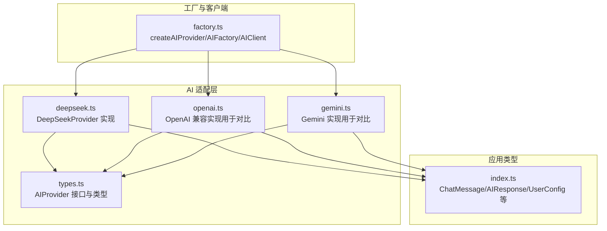
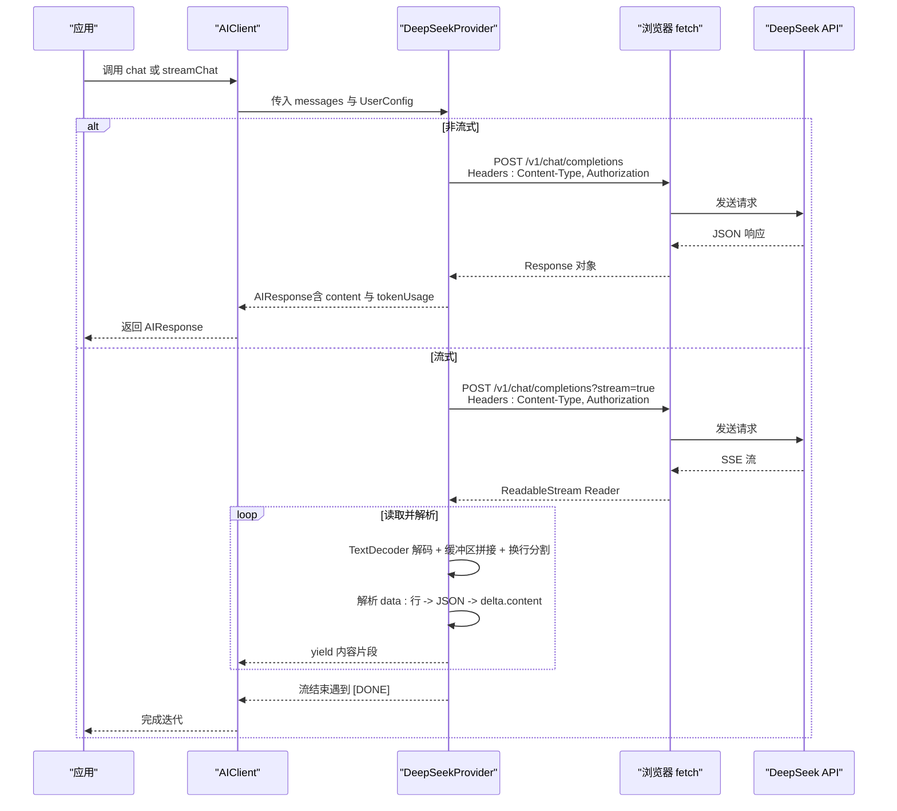
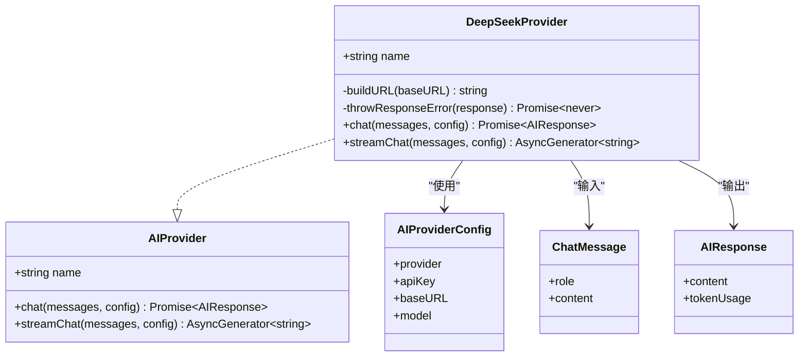
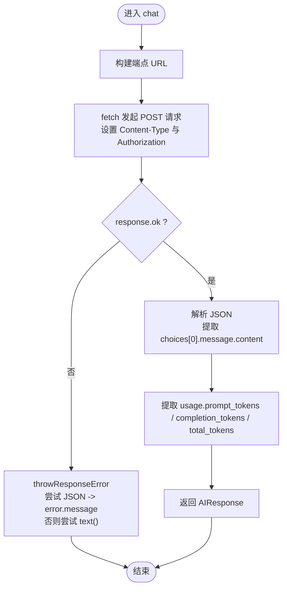
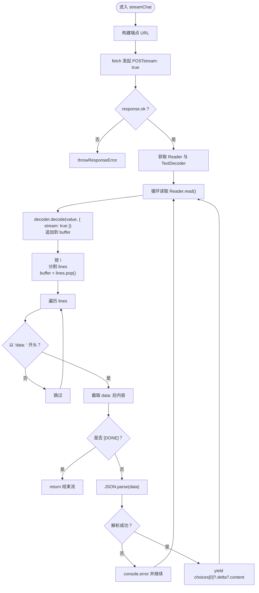
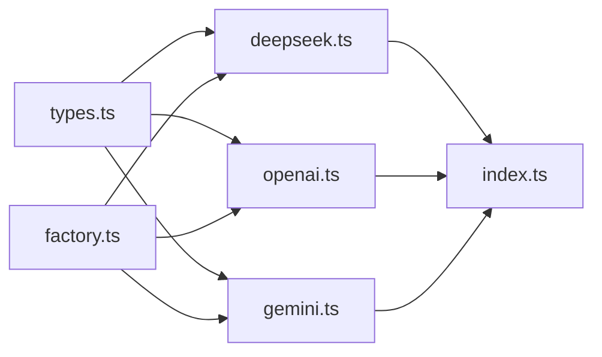
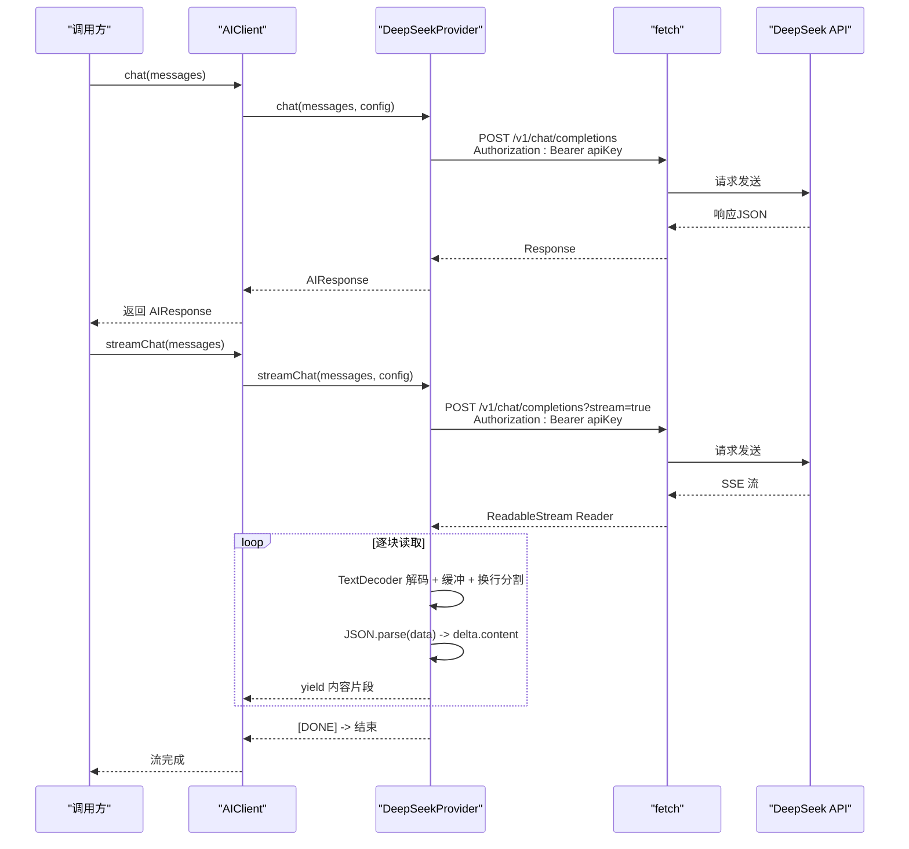

# DeepSeek 适配器

<cite>
**本文引用的文件列表**
- [deepseek.ts](file://manga-creator/src/lib/ai/providers/deepseek.ts)
- [types.ts](file://manga-creator/src/lib/ai/types.ts)
- [factory.ts](file://manga-creator/src/lib/ai/factory.ts)
- [index.ts](file://manga-creator/src/types/index.ts)
- [providers.test.ts](file://manga-creator/src/lib/ai/providers/providers.test.ts)
- [openai.ts](file://manga-creator/src/lib/ai/providers/openai.ts)
- [gemini.ts](file://manga-creator/src/lib/ai/providers/gemini.ts)
</cite>

## 目录
1. [简介](#简介)
2. [项目结构](#项目结构)
3. [核心组件](#核心组件)
4. [架构总览](#架构总览)
5. [组件详解](#组件详解)
6. [依赖关系分析](#依赖关系分析)
7. [性能考量](#性能考量)
8. [故障排查指南](#故障排查指南)
9. [结论](#结论)
10. [附录](#附录)

## 简介
本文件面向开发者与维护者，系统化阐述 DeepSeekProvider 作为 AIProvider 接口实现的行为规范与实现细节。重点覆盖：
- buildURL 如何基于配置构建 API 端点
- chat 方法中标准 HTTP POST 请求的构造：认证头（Bearer Token）、请求体结构
- streamChat 中 SSE 流式响应的处理机制：TextDecoder 与 ReadableStream Reader 协作、缓冲区与换行解析策略、终止条件与错误处理
- DeepSeek API 的 token usage 字段命名与统一接口映射关系
- 从 AIClient 调用到实际 HTTP 请求发出的完整时序图，以及网络异常与常见 API 错误码（如 401、429）的处理建议

## 项目结构
DeepSeekProvider 位于 AI 适配层，与统一类型定义、工厂与客户端封装共同构成调用链路。

图表来源
- [deepseek.ts](file://manga-creator/src/lib/ai/providers/deepseek.ts#L1-L110)
- [types.ts](file://manga-creator/src/lib/ai/types.ts#L1-L15)
- [factory.ts](file://manga-creator/src/lib/ai/factory.ts#L1-L54)
- [index.ts](file://manga-creator/src/types/index.ts#L80-L110)

章节来源
- [deepseek.ts](file://manga-creator/src/lib/ai/providers/deepseek.ts#L1-L110)
- [types.ts](file://manga-creator/src/lib/ai/types.ts#L1-L15)
- [factory.ts](file://manga-creator/src/lib/ai/factory.ts#L1-L54)
- [index.ts](file://manga-creator/src/types/index.ts#L80-L110)

## 核心组件
- AIProvider 接口：定义统一的聊天与流式聊天能力，确保不同供应商实现的一致性入口。
- DeepSeekProvider：具体实现，负责构建 URL、构造请求、解析响应与流式输出。
- AIFactory/AIClient：工厂与客户端封装，负责根据用户配置选择并实例化对应 Provider，对外暴露统一的 chat/streamChat 调用。

章节来源
- [types.ts](file://manga-creator/src/lib/ai/types.ts#L1-L15)
- [deepseek.ts](file://manga-creator/src/lib/ai/providers/deepseek.ts#L1-L110)
- [factory.ts](file://manga-creator/src/lib/ai/factory.ts#L1-L54)

## 架构总览
从应用侧发起一次对话，到 DeepSeek API 返回流式内容的关键路径如下：

图表来源
- [deepseek.ts](file://manga-creator/src/lib/ai/providers/deepseek.ts#L29-L109)
- [factory.ts](file://manga-creator/src/lib/ai/factory.ts#L22-L41)
- [index.ts](file://manga-creator/src/types/index.ts#L88-L110)

## 组件详解

### DeepSeekProvider 类与接口契约
- 实现 AIProvider 接口，提供 name、chat、streamChat 三部分能力。
- 通过 AIProviderConfig 获取 provider、apiKey、baseURL、model 等必要信息。
- 使用 ChatMessage 与 AIResponse 类型进行输入输出建模。

图表来源
- [types.ts](file://manga-creator/src/lib/ai/types.ts#L1-L15)
- [deepseek.ts](file://manga-creator/src/lib/ai/providers/deepseek.ts#L1-L110)
- [index.ts](file://manga-creator/src/types/index.ts#L88-L110)

章节来源
- [types.ts](file://manga-creator/src/lib/ai/types.ts#L1-L15)
- [deepseek.ts](file://manga-creator/src/lib/ai/providers/deepseek.ts#L1-L110)
- [index.ts](file://manga-creator/src/types/index.ts#L88-L110)

### buildURL：端点构建策略
- 默认基础地址为 https://api.deepseek.com，末尾斜杠会被去除。
- 最终端点为 {base}/v1/chat/completions。
- 支持通过 config.baseURL 自定义基础地址；测试覆盖了默认值、自定义值与末尾斜杠清理。

章节来源
- [deepseek.ts](file://manga-creator/src/lib/ai/providers/deepseek.ts#L7-L10)
- [providers.test.ts](file://manga-creator/src/lib/ai/providers/providers.test.ts#L51-L101)

### chat：标准 HTTP POST 请求
- 请求方法：POST
- 认证头：Authorization: Bearer {apiKey}
- 请求体：包含 model 与 messages；model 默认值为 deepseek-chat
- 成功响应：解析 choices[0].message.content 与 usage 中的 prompt_tokens、completion_tokens、total_tokens
- 错误处理：非 OK 状态时调用 throwResponseError，优先尝试 JSON 解析 error.message，否则回退到 text，最终抛出包含状态码与详情的错误

图表来源
- [deepseek.ts](file://manga-creator/src/lib/ai/providers/deepseek.ts#L29-L57)
- [providers.test.ts](file://manga-creator/src/lib/ai/providers/providers.test.ts#L102-L151)

章节来源
- [deepseek.ts](file://manga-creator/src/lib/ai/providers/deepseek.ts#L29-L57)
- [providers.test.ts](file://manga-creator/src/lib/ai/providers/providers.test.ts#L102-L151)

### streamChat：SSE 流式响应处理
- 启动流：在请求体中设置 stream: true
- 错误处理：非 OK 状态同样走 throwResponseError
- Reader 与解码：通过 response.body.getReader() 获取 Reader；使用 TextDecoder(stream: true) 进行增量解码
- 缓冲与分隔：以 buffer 存储跨块数据，按 '\n' 切分行，保留最后一个不完整的行作为下一次拼接
- 数据解析：仅处理以 "data: " 开头的行，截取数据后尝试 JSON.parse；从 choices[0]?.delta?.content 提取增量内容
- 终止条件：遇到 data: [DONE] 时停止迭代
- 异常处理：JSON 解析失败时记录错误日志但继续消费后续数据；若 response.body 为空则抛出“无响应体”错误

图表来源
- [deepseek.ts](file://manga-creator/src/lib/ai/providers/deepseek.ts#L59-L109)
- [providers.test.ts](file://manga-creator/src/lib/ai/providers/providers.test.ts#L153-L268)

章节来源
- [deepseek.ts](file://manga-creator/src/lib/ai/providers/deepseek.ts#L59-L109)
- [providers.test.ts](file://manga-creator/src/lib/ai/providers/providers.test.ts#L153-L268)

### token usage 字段映射
- DeepSeek API 返回的 usage 字段包含：
  - prompt_tokens
  - completion_tokens
  - total_tokens
- 统一接口 AIResponse.tokenUsage 映射：
  - prompt → prompt_tokens
  - completion → completion_tokens
  - total → total_tokens

章节来源
- [deepseek.ts](file://manga-creator/src/lib/ai/providers/deepseek.ts#L48-L57)
- [index.ts](file://manga-creator/src/types/index.ts#L102-L109)

### 与 OpenAI 兼容实现的对比
- OpenAI 兼容实现同样采用 SSE 流式解析，流程与 DeepSeek 类似：Reader + TextDecoder + 换行分割 + JSON 解析 + [DONE] 终止。
- 区别在于：
  - 端点与头部：OpenAI 使用 /v1/chat/completions，认证头为 Authorization: Bearer
  - 流式数据结构：OpenAI 使用 choices[0]?.delta?.content；DeepSeek 同样使用该结构
  - 错误处理：OpenAI 实现直接抛出错误，DeepSeek 使用 throwResponseError 统一格式

章节来源
- [openai.ts](file://manga-creator/src/lib/ai/providers/openai.ts#L37-L87)
- [deepseek.ts](file://manga-creator/src/lib/ai/providers/deepseek.ts#L59-L109)

## 依赖关系分析
- DeepSeekProvider 依赖：
  - AIProvider 接口与类型定义（统一输入输出）
  - 应用层类型 ChatMessage/AIResponse/UserConfig
  - 工厂与客户端封装（AIFactory/AIClient）用于实例化与调用
- 与其他 Provider 的关系：
  - OpenAI 兼容与 Gemini 实现均采用类似的 SSE 流式解析模式，便于横向对比与迁移

图表来源
- [deepseek.ts](file://manga-creator/src/lib/ai/providers/deepseek.ts#L1-L110)
- [openai.ts](file://manga-creator/src/lib/ai/providers/openai.ts#L37-L87)
- [gemini.ts](file://manga-creator/src/lib/ai/providers/gemini.ts#L117-L137)
- [types.ts](file://manga-creator/src/lib/ai/types.ts#L1-L15)
- [factory.ts](file://manga-creator/src/lib/ai/factory.ts#L1-L54)
- [index.ts](file://manga-creator/src/types/index.ts#L88-L110)

章节来源
- [deepseek.ts](file://manga-creator/src/lib/ai/providers/deepseek.ts#L1-L110)
- [openai.ts](file://manga-creator/src/lib/ai/providers/openai.ts#L37-L87)
- [gemini.ts](file://manga-creator/src/lib/ai/providers/gemini.ts#L117-L137)
- [types.ts](file://manga-creator/src/lib/ai/types.ts#L1-L15)
- [factory.ts](file://manga-creator/src/lib/ai/factory.ts#L1-L54)
- [index.ts](file://manga-creator/src/types/index.ts#L88-L110)

## 性能考量
- 流式读取采用增量解码与缓冲区拼接，避免一次性加载大块数据，降低内存峰值。
- 换行分割策略仅在完整行上解析，减少 JSON 解析次数与失败概率。
- 在解析失败时记录错误并继续消费，保证流的连续性，避免因单次异常中断整个会话。
- 建议：
  - 控制消息长度与上下文大小，避免超长请求导致响应体过大
  - 对外层消费方做好背压处理，及时消费流数据
  - 在网络不稳定场景下，结合重试与超时策略（由调用方或更高层封装）

## 故障排查指南
- 401 未授权
  - 现象：请求被拒绝，错误信息包含“Invalid API key”
  - 处理：确认 apiKey 是否正确、是否具备相应权限
- 429 请求过于频繁
  - 现象：服务端限流
  - 处理：增加重试间隔、降低并发、调整模型或速率限制
- 5xx 服务器错误
  - 现象：服务不可用或内部错误
  - 处理：重试指数退避、检查服务可用性
- 网络异常
  - 现象：fetch 抛出网络错误
  - 处理：捕获异常并提示用户检查网络或代理
- SSE 解析异常
  - 现象：某行 JSON 无法解析
  - 处理：记录错误日志并继续消费，避免中断流
- 无响应体
  - 现象：response.body 为空
  - 处理：抛出明确错误，提示上游实现或网络问题

章节来源
- [providers.test.ts](file://manga-creator/src/lib/ai/providers/providers.test.ts#L102-L151)
- [providers.test.ts](file://manga-creator/src/lib/ai/providers/providers.test.ts#L153-L268)
- [deepseek.ts](file://manga-creator/src/lib/ai/providers/deepseek.ts#L12-L27)

## 结论
DeepSeekProvider 严格遵循 AIProvider 接口契约，提供了稳定、可扩展的聊天与流式聊天能力。其实现要点包括：
- 端点构建清晰可控，支持自定义 baseURL
- 请求构造简洁一致，认证与请求体结构标准化
- 流式解析稳健可靠，具备完善的缓冲与错误恢复策略
- token usage 字段映射与统一接口保持一致，便于上层统计与展示

## 附录

### 从 AIClient 到 HTTP 请求的时序图（细化）

图表来源
- [factory.ts](file://manga-creator/src/lib/ai/factory.ts#L22-L41)
- [deepseek.ts](file://manga-creator/src/lib/ai/providers/deepseek.ts#L29-L109)