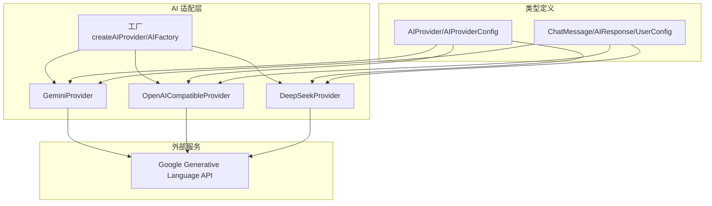
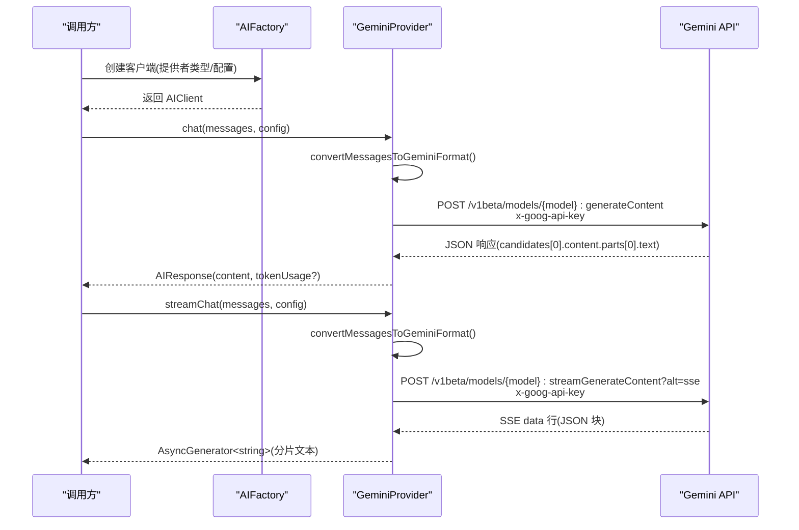
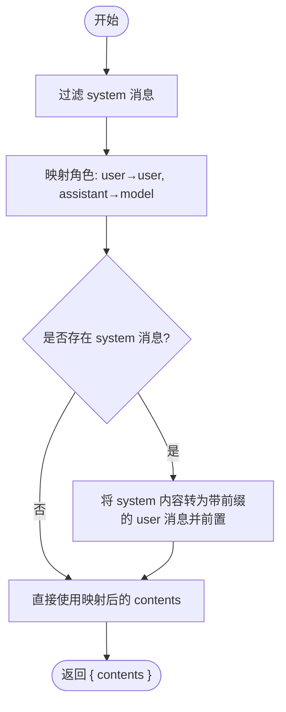
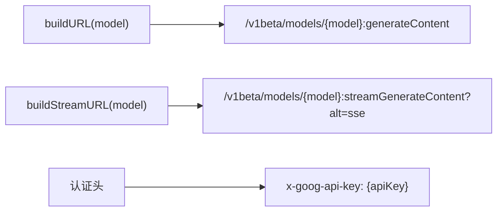
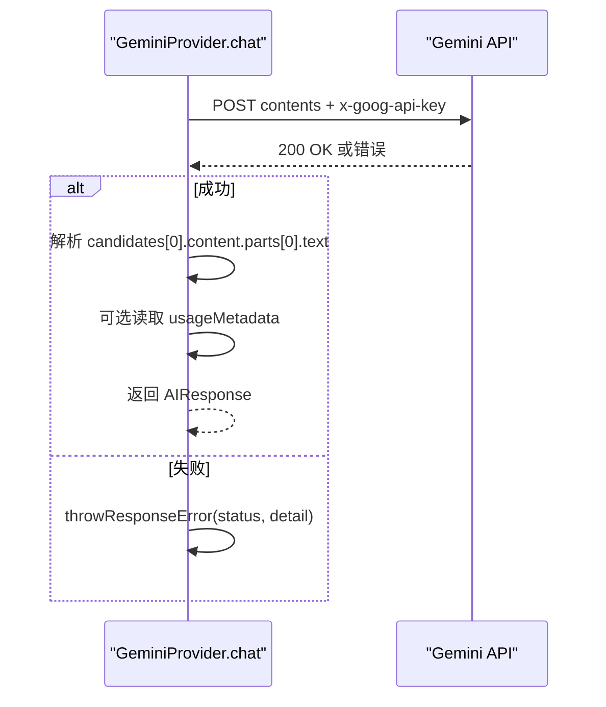
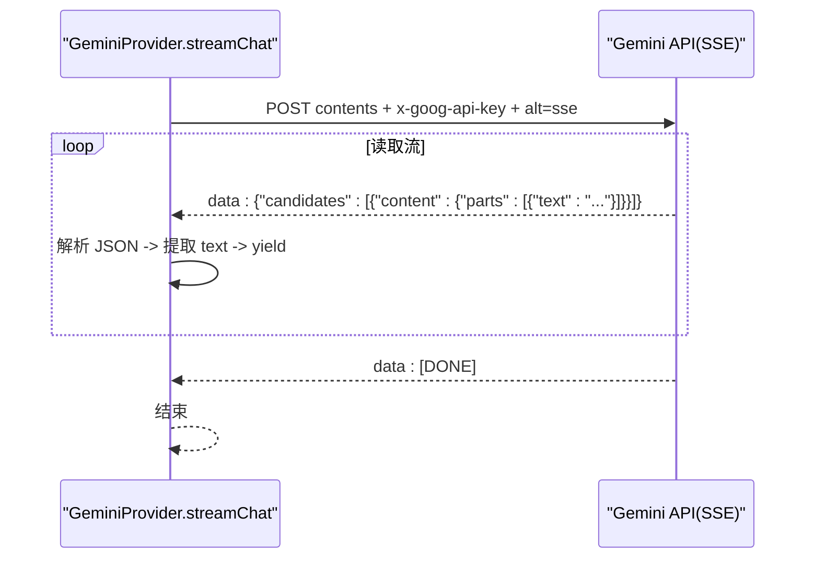
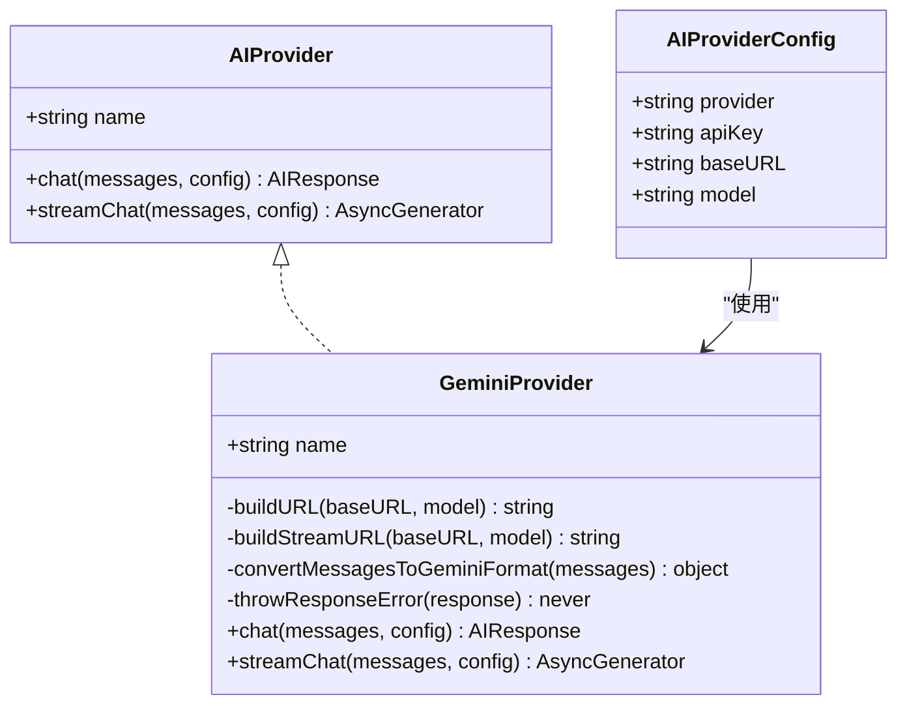

# Gemini 适配器

<cite>
**本文引用的文件**
- [gemini.ts](file://manga-creator/src/lib/ai/providers/gemini.ts)
- [types.ts](file://manga-creator/src/lib/ai/types.ts)
- [factory.ts](file://manga-creator/src/lib/ai/factory.ts)
- [providers.test.ts](file://manga-creator/src/lib/ai/providers/providers.test.ts)
- [index.ts](file://manga-creator/src/types/index.ts)
- [openai.ts](file://manga-creator/src/lib/ai/providers/openai.ts)
- [deepseek.ts](file://manga-creator/src/lib/ai/providers/deepseek.ts)
- [streamingHandler.ts](file://manga-creator/src/lib/ai/streamingHandler.ts)
</cite>

## 目录
1. [简介](#简介)
2. [项目结构](#项目结构)
3. [核心组件](#核心组件)
4. [架构总览](#架构总览)
5. [详细组件分析](#详细组件分析)
6. [依赖关系分析](#依赖关系分析)
7. [性能考量](#性能考量)
8. [故障排查指南](#故障排查指南)
9. [结论](#结论)
10. [附录](#附录)

## 简介
本文件面向开发者，系统化梳理 GeminiProvider 的实现细节与行为特征，重点对比其与 DeepSeekProvider、OpenAICompatibleProvider 的差异，深入解析以下关键点：
- convertMessagesToGeminiFormat 如何将标准 ChatMessage 转换为 Gemini 的 contents/parts 结构，并对 system 角色进行特殊处理（转换为带前缀的 user 消息）
- buildURL 与 buildStreamURL 的端点差异及 alt=sse 参数的作用
- x-goog-api-key 认证头的使用方式
- chat 方法中从 response 解析 candidates 和 parts 的嵌套结构，以及 usageMetadata 字段的可选性处理
- streamChat 实现与标准 SSE 协议的兼容性，包括 data 事件解析逻辑
- Gemini 对消息角色的限制（user/model 映射）及其对对话上下文管理的影响
- 提供消息格式转换的前后对比示例与优化建议（API 配额限制、长响应流）

## 项目结构
Gemini 适配器位于 AI 适配层，与工厂模式协作，统一对外暴露 chat 与 streamChat 接口；类型定义位于公共类型模块，便于跨适配器复用。

图表来源
- [factory.ts](file://manga-creator/src/lib/ai/factory.ts#L1-L54)
- [gemini.ts](file://manga-creator/src/lib/ai/providers/gemini.ts#L1-L138)
- [openai.ts](file://manga-creator/src/lib/ai/providers/openai.ts#L1-L88)
- [deepseek.ts](file://manga-creator/src/lib/ai/providers/deepseek.ts#L1-L110)
- [types.ts](file://manga-creator/src/lib/ai/types.ts#L1-L15)
- [index.ts](file://manga-creator/src/types/index.ts#L84-L109)

章节来源
- [factory.ts](file://manga-creator/src/lib/ai/factory.ts#L1-L54)
- [types.ts](file://manga-creator/src/lib/ai/types.ts#L1-L15)
- [index.ts](file://manga-creator/src/types/index.ts#L84-L109)

## 核心组件
- GeminiProvider：实现 Google Gemini API 的适配，负责消息格式转换、URL 构建、认证头设置、同步与流式请求、响应解析与错误处理。
- AIProvider/AIProviderConfig：统一的适配器接口与配置契约，确保各供应商实现一致的调用方式。
- AIFactory：根据配置动态选择具体供应商实例，屏蔽上层差异。

章节来源
- [gemini.ts](file://manga-creator/src/lib/ai/providers/gemini.ts#L1-L138)
- [types.ts](file://manga-creator/src/lib/ai/types.ts#L1-L15)
- [factory.ts](file://manga-creator/src/lib/ai/factory.ts#L1-L54)

## 架构总览
GeminiProvider 在工厂模式下被注入到 AIClient 中，通过统一的 chat/streamChat 接口与外部 Gemini API 交互。其内部以标准 ChatMessage 为输入，经 convertMessagesToGeminiFormat 转换为 Gemini 的 contents/parts 结构，再通过 fetch 发送请求。流式场景使用 alt=sse 参数启用标准 SSE 协议，按 data 行解析 JSON 块。

图表来源
- [factory.ts](file://manga-creator/src/lib/ai/factory.ts#L1-L54)
- [gemini.ts](file://manga-creator/src/lib/ai/providers/gemini.ts#L58-L136)
- [index.ts](file://manga-creator/src/types/index.ts#L84-L109)

## 详细组件分析

### convertMessagesToGeminiFormat：消息格式转换策略
- 输入：标准 ChatMessage 数组，包含 user/assistant/system 角色
- 输出：Gemini contents/parts 结构
- 关键差异与策略：
  - assistant → model：将助手消息映射为 Gemini 的 model 角色
  - user → user：用户消息保持 user 角色
  - system 消息不直接放入 contents，而是作为“前缀 user 消息”插入，内容带有特定前缀标识，确保系统指令以用户上下文形式进入模型
  - 过滤掉 system 后再映射其余消息，最后统一拼接 system 前缀，保证顺序与语义一致性

图表来源
- [gemini.ts](file://manga-creator/src/lib/ai/providers/gemini.ts#L19-L39)

章节来源
- [gemini.ts](file://manga-creator/src/lib/ai/providers/gemini.ts#L19-L39)
- [providers.test.ts](file://manga-creator/src/lib/ai/providers/providers.test.ts#L452-L481)

### buildURL 与 buildStreamURL：端点设计与 alt=sse
- 同步端点：/v1beta/models/{model}:generateContent
- 流式端点：/v1beta/models/{model}:streamGenerateContent?alt=sse
- alt=sse：强制服务器以标准 SSE 协议返回数据，每条数据以 data: 开头，支持 [DONE] 结束标记
- 认证头：x-goog-api-key，而非 Authorization: Bearer

图表来源
- [gemini.ts](file://manga-creator/src/lib/ai/providers/gemini.ts#L7-L17)

章节来源
- [gemini.ts](file://manga-creator/src/lib/ai/providers/gemini.ts#L7-L17)
- [providers.test.ts](file://manga-creator/src/lib/ai/providers/providers.test.ts#L577-L598)

### chat：响应解析与 usageMetadata 可选性
- 请求：POST 同步端点，携带 contents 与 x-goog-api-key
- 响应解析：
  - 从 candidates[0].content.parts[0].text 提取文本
  - 若存在 usageMetadata，则提取 promptTokenCount/candidatesTokenCount/totalTokenCount 作为 tokenUsage
  - 若不存在 usageMetadata，则 tokenUsage 为空
- 错误处理：非 2xx 响应时抛出带状态码与详情的错误

图表来源
- [gemini.ts](file://manga-creator/src/lib/ai/providers/gemini.ts#L58-L88)

章节来源
- [gemini.ts](file://manga-creator/src/lib/ai/providers/gemini.ts#L58-L88)
- [providers.test.ts](file://manga-creator/src/lib/ai/providers/providers.test.ts#L500-L513)

### streamChat：SSE 兼容性与数据解析
- 使用 alt=sse 的流式端点，遵循标准 SSE 协议
- 逐行解析 data: 前缀的 JSON 块，跳过空行与 [DONE] 标记
- 从 candidates[0].content.parts[0].text 提取增量文本片段并 yield
- 与 OpenAICompatibleProvider 的差异：
  - OpenAI：Authorization: Bearer，SSE data: 行中的 choices[0].delta.content
  - Gemini：x-goog-api-key，SSE data: 行中的 candidates[0].content.parts[0].text

图表来源
- [gemini.ts](file://manga-creator/src/lib/ai/providers/gemini.ts#L90-L136)
- [openai.ts](file://manga-creator/src/lib/ai/providers/openai.ts#L37-L88)

章节来源
- [gemini.ts](file://manga-creator/src/lib/ai/providers/gemini.ts#L90-L136)
- [providers.test.ts](file://manga-creator/src/lib/ai/providers/providers.test.ts#L545-L576)
- [openai.ts](file://manga-creator/src/lib/ai/providers/openai.ts#L37-L88)

### 与 DeepSeekProvider 的差异
- 认证头：DeepSeek 使用 Authorization: Bearer，Gemini 使用 x-goog-api-key
- 流式端点：DeepSeek 通过 stream: true 参数控制流式输出；Gemini 通过 alt=sse 控制
- SSE 协议：两者均遵循 data: 行 + [DONE] 结束，但字段路径不同（choices/delta vs candidates/content.parts）

章节来源
- [deepseek.ts](file://manga-creator/src/lib/ai/providers/deepseek.ts#L1-L110)
- [gemini.ts](file://manga-creator/src/lib/ai/providers/gemini.ts#L7-L17)

### 与 OpenAICompatibleProvider 的差异
- 认证头：OpenAI 使用 Authorization: Bearer，Gemini 使用 x-goog-api-key
- 消息结构：OpenAI 直接传入 messages；Gemini 需要 contents/parts 结构
- SSE 字段路径：OpenAI choices[0].delta.content；Gemini candidates[0].content.parts[0].text
- usage 字段：OpenAI usage.{prompt_tokens, completion_tokens, total_tokens}；Gemini usageMetadata.{promptTokenCount, candidatesTokenCount, totalTokenCount}

章节来源
- [openai.ts](file://manga-creator/src/lib/ai/providers/openai.ts#L1-L88)
- [gemini.ts](file://manga-creator/src/lib/ai/providers/gemini.ts#L58-L88)

### 消息格式转换前后对比示例（文字描述）
- 输入（标准 ChatMessage）：包含 system/user/assistant 角色的消息序列
- 转换后（Gemini contents/parts）：
  - system 消息被转换为带前缀的 user 消息并前置
  - assistant 映射为 model
  - user 保持 user
  - 最终形成 contents 数组，每个元素含 role 与 parts（仅 text 字段）

章节来源
- [gemini.ts](file://manga-creator/src/lib/ai/providers/gemini.ts#L19-L39)
- [providers.test.ts](file://manga-creator/src/lib/ai/providers/providers.test.ts#L452-L481)

## 依赖关系分析
- GeminiProvider 依赖：
  - 类型：AIProvider/AIProviderConfig、ChatMessage、AIResponse
  - 外部：Google Generative Language API（同步/流式端点）
- 工厂与客户端：
  - createAIProvider 根据 provider 类型返回对应 Provider 实例
  - AIFactory 校验配置并创建 AIClient，统一暴露 chat/streamChat

图表来源
- [types.ts](file://manga-creator/src/lib/ai/types.ts#L1-L15)
- [gemini.ts](file://manga-creator/src/lib/ai/providers/gemini.ts#L1-L138)

章节来源
- [types.ts](file://manga-creator/src/lib/ai/types.ts#L1-L15)
- [gemini.ts](file://manga-creator/src/lib/ai/providers/gemini.ts#L1-L138)
- [factory.ts](file://manga-creator/src/lib/ai/factory.ts#L1-L54)

## 性能考量
- 长响应流优化建议：
  - 使用 AbortSignal 控制取消，避免长时间占用资源
  - 流式解析采用行缓冲与增量解码，减少内存峰值
  - 对于大文本，建议在上层聚合后再渲染，降低 UI 更新频率
- API 配额与速率限制：
  - Gemini 使用 x-goog-api-key，注意配额与速率限制
  - 建议在应用层做重试与退避策略，结合 usageMetadata 监控消耗
  - 对高频请求进行本地缓存或批量化处理
- 消息长度与上下文管理：
  - system 前缀消息会增加上下文长度，建议在上游裁剪或压缩历史消息
  - Gemini 对 contents 数组长度与单条 text 长度有限制，必要时拆分或截断

[本节为通用指导，无需列出章节来源]

## 故障排查指南
- 常见错误与定位：
  - 非 2xx 响应：抛出带状态码与错误详情的异常，优先检查 x-goog-api-key 是否正确、baseURL 与 model 是否匹配
  - 流式解析失败：确认 alt=sse 是否生效，data 行是否以 data: 开头且 JSON 可解析
  - usageMetadata 缺失：部分模型可能不返回该字段，需做可选处理
- 单元测试参考：
  - chat：验证响应解析、usageMetadata 可选性、错误处理
  - streamChat：验证 SSE 解析、[DONE] 结束、跨块数据拼接、空行忽略

章节来源
- [gemini.ts](file://manga-creator/src/lib/ai/providers/gemini.ts#L41-L57)
- [providers.test.ts](file://manga-creator/src/lib/ai/providers/providers.test.ts#L515-L542)
- [providers.test.ts](file://manga-creator/src/lib/ai/providers/providers.test.ts#L545-L626)

## 结论
GeminiProvider 在适配层实现了与标准 ChatMessage 的无缝对接，通过 convertMessagesToGeminiFormat 完成角色映射与 system 前缀注入，借助 alt=sse 的流式端点与 x-goog-api-key 认证头，提供了与 OpenAI/DeepSeek 不同的协议与字段路径。其优势在于对 system 指令的显式上下文注入与更丰富的 usageMetadata 支持；同时需要注意 Gemini 的消息角色限制与配额约束，在实际工程中应结合缓存、限流与错误恢复策略提升稳定性与用户体验。

[本节为总结性内容，无需列出章节来源]

## 附录

### 与 streamingHandler.ts 的对比（独立流式封装）
- streamingHandler.ts 提供了独立的 streamChatGemini 封装，与 GeminiProvider 的 streamChat 在行为上一致，但：
  - 直接在函数内构建 contents，未复用 convertMessagesToGeminiFormat
  - 使用查询参数 ?key={apiKey}，而非 x-goog-api-key 头
  - 仍遵循 alt=sse 与 data 行解析

章节来源
- [streamingHandler.ts](file://manga-creator/src/lib/ai/streamingHandler.ts#L215-L302)