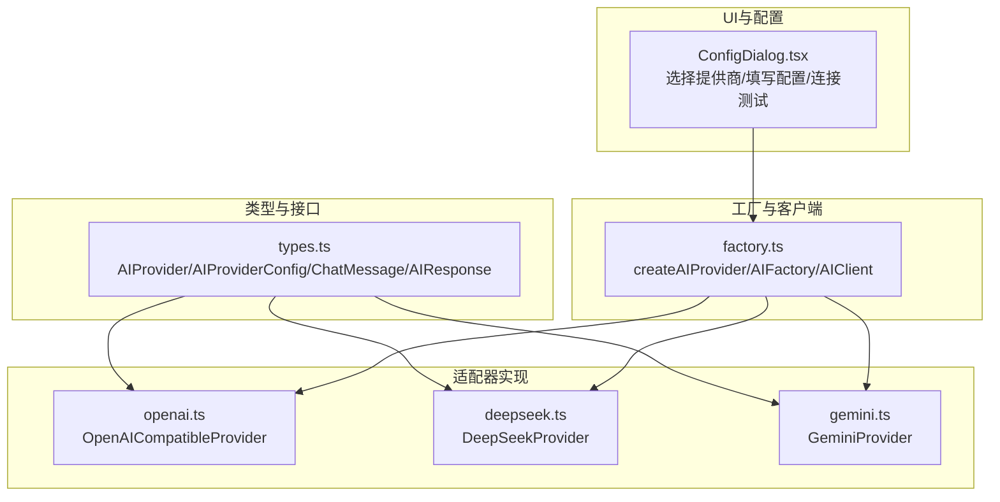
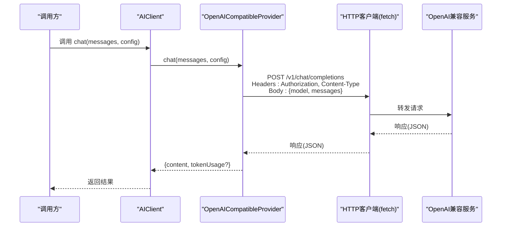
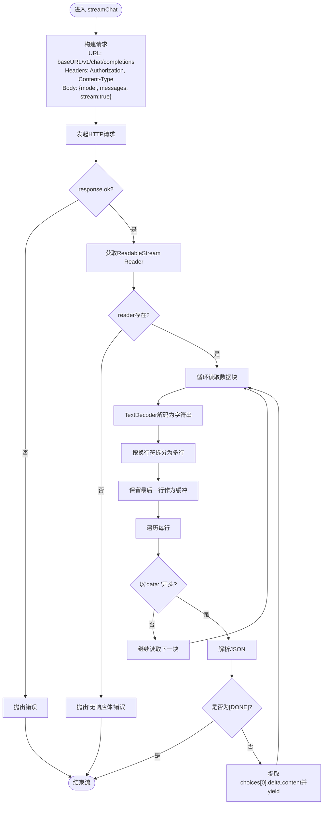
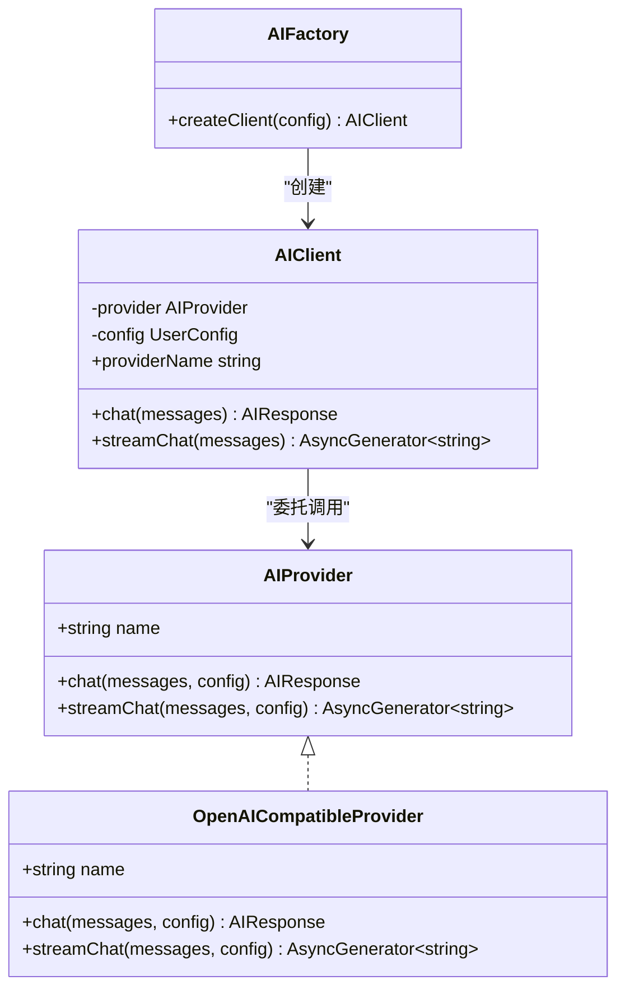
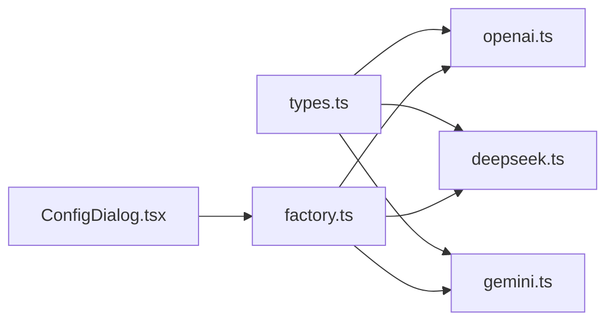

# OpenAI 兼容适配器

<cite>
**本文引用的文件**
- [openai.ts](file://manga-creator/src/lib/ai/providers/openai.ts)
- [factory.ts](file://manga-creator/src/lib/ai/factory.ts)
- [types.ts](file://manga-creator/src/lib/ai/types.ts)
- [deepseek.ts](file://manga-creator/src/lib/ai/providers/deepseek.ts)
- [gemini.ts](file://manga-creator/src/lib/ai/providers/gemini.ts)
- [providers.test.ts](file://manga-creator/src/lib/ai/providers/providers.test.ts)
- [index.ts](file://manga-creator/src/types/index.ts)
- [ConfigDialog.tsx](file://manga-creator/src/components/ConfigDialog.tsx)
- [prd_backup.md](file://prd_backup.md)
</cite>

## 目录
1. [简介](#简介)
2. [项目结构](#项目结构)
3. [核心组件](#核心组件)
4. [架构总览](#架构总览)
5. [详细组件分析](#详细组件分析)
6. [依赖分析](#依赖分析)
7. [性能考虑](#性能考虑)
8. [故障排查指南](#故障排查指南)
9. [结论](#结论)
10. [附录](#附录)

## 简介
本文件面向“OpenAI Compatible Provider”的技术文档，重点阐述其作为通用兼容层的设计目标与实现细节。该适配器通过统一的接口与标准请求格式，使应用能够以一致的方式对接任何遵循OpenAI API规范的服务（例如本地部署模型服务），并支持同步与流式两种响应模式。文档将从系统架构、组件关系、数据流与处理逻辑、集成点、错误处理、性能特性等方面进行深入解析，并提供配置示例、对比分析与优化建议。

## 项目结构
围绕AI能力的模块化组织如下：
- 类型与接口：定义统一的AIProvider接口、配置对象与响应结构，确保各提供商实现的一致性。
- 适配器实现：OpenAI Compatible Provider负责构造符合OpenAI规范的请求并解析响应；DeepSeek与Gemini提供者分别展示不同认证与消息格式的适配策略。
- 工厂与客户端：根据配置动态选择具体提供商，屏蔽上层调用差异。
- UI与配置：前端对话框支持选择提供商、填写API Key、Base URL与模型名，并提供连接测试。

图表来源
- [types.ts](file://manga-creator/src/lib/ai/types.ts#L1-L15)
- [openai.ts](file://manga-creator/src/lib/ai/providers/openai.ts#L1-L88)
- [deepseek.ts](file://manga-creator/src/lib/ai/providers/deepseek.ts#L1-L110)
- [gemini.ts](file://manga-creator/src/lib/ai/providers/gemini.ts#L1-L138)
- [factory.ts](file://manga-creator/src/lib/ai/factory.ts#L1-L54)
- [ConfigDialog.tsx](file://manga-creator/src/components/ConfigDialog.tsx#L1-L168)

章节来源
- [types.ts](file://manga-creator/src/lib/ai/types.ts#L1-L15)
- [openai.ts](file://manga-creator/src/lib/ai/providers/openai.ts#L1-L88)
- [factory.ts](file://manga-creator/src/lib/ai/factory.ts#L1-L54)
- [ConfigDialog.tsx](file://manga-creator/src/components/ConfigDialog.tsx#L1-L168)

## 核心组件
- OpenAICompatibleProvider：实现AIProvider接口，负责构造OpenAI风格的请求与解析响应，支持同步与流式两种模式。
- AIProvider/AIProviderConfig：统一的接口契约与配置对象，包含provider类型、API Key、Base URL与模型名。
- AIFactory/AIClient：根据配置创建对应提供商实例，向上层暴露统一的chat与streamChat方法。
- ProviderType/UserConfig/ChatMessage/AIResponse：类型定义，确保跨提供商的一致性。

章节来源
- [openai.ts](file://manga-creator/src/lib/ai/providers/openai.ts#L1-L88)
- [types.ts](file://manga-creator/src/lib/ai/types.ts#L1-L15)
- [factory.ts](file://manga-creator/src/lib/ai/factory.ts#L1-L54)
- [index.ts](file://manga-creator/src/types/index.ts#L84-L110)

## 架构总览
OpenAI Compatible Provider在整体架构中的定位是“通用兼容层”。它通过以下方式实现：
- 使用统一的请求构造：在chat与streamChat中均以JSON体发送model与messages，并在头部添加Authorization: Bearer {apiKey}。
- 支持Base URL可配置：当未提供时回退到默认OpenAI域名，从而无缝对接本地或第三方OpenAI兼容服务。
- 统一响应解析：在非流式场景下解析choices[0].message.content；在流式场景下解析SSE数据块中的choices[0].delta.content。
- 可选的token usage：当上游返回usage时，适配器将其映射为统一的tokenUsage结构，便于成本估算。

图表来源
- [openai.ts](file://manga-creator/src/lib/ai/providers/openai.ts#L7-L35)
- [factory.ts](file://manga-creator/src/lib/ai/factory.ts#L35-L41)

章节来源
- [openai.ts](file://manga-creator/src/lib/ai/providers/openai.ts#L7-L35)
- [factory.ts](file://manga-creator/src/lib/ai/factory.ts#L35-L41)

## 详细组件分析

### OpenAICompatibleProvider 设计与实现
- 设计目的
  - 作为通用兼容层，屏蔽不同提供商的差异，统一请求与响应格式。
  - 通过Base URL支持本地部署或第三方OpenAI兼容服务，无需修改上层调用逻辑。
- 请求构造
  - URL：由config.baseURL拼接/v1/chat/completions，默认指向OpenAI域名。
  - 头部：Authorization: Bearer {apiKey}，Content-Type: application/json。
  - 请求体：包含model与messages两个字段。
- 同步响应(chat)
  - 若response.ok为false，直接抛出错误，错误信息包含状态文本。
  - 成功时解析choices[0].message.content作为content；若存在usage则映射为tokenUsage。
- 流式响应(streamChat)
  - 在请求体中附加stream: true。
  - 使用ReadableStream Reader逐块读取SSE数据，按行拆分，丢弃非"data: "前缀行。
  - 对[data: ...]行进行JSON解析，提取choices[0].delta.content作为增量内容并yield。
  - 当遇到"[DONE]"时结束流。
  - 对于无法解析的行，记录错误但继续处理后续数据，保证健壮性。
- 错误处理
  - 非2xx响应直接抛错，便于上层统一捕获。
  - 无response.body时抛错，避免运行时异常。
- 可选token usage
  - 仅当上游返回usage时才填充tokenUsage，否则保持undefined，不影响成本估算的可选性。

图表来源
- [openai.ts](file://manga-creator/src/lib/ai/providers/openai.ts#L37-L86)

章节来源
- [openai.ts](file://manga-creator/src/lib/ai/providers/openai.ts#L7-L86)

### 与DeepSeek Provider的错误处理对比
- OpenAICompatibleProvider
  - 非2xx响应直接抛出错误，错误信息包含状态文本。
- DeepSeek Provider
  - 自定义throwResponseError方法：优先尝试解析JSON错误体中的message，若失败则尝试读取纯文本，最终汇总为统一错误格式。
- 影响
  - DeepSeek的错误处理更丰富，能携带上游具体错误详情；OpenAI Compatible Provider更简洁，便于统一处理。

章节来源
- [openai.ts](file://manga-creator/src/lib/ai/providers/openai.ts#L22-L24)
- [deepseek.ts](file://manga-creator/src/lib/ai/providers/deepseek.ts#L12-L27)

### 与Gemini Provider的消息格式差异
- OpenAI Compatible Provider
  - 使用OpenAI风格的messages数组，choices[0].delta.content为增量内容。
- Gemini Provider
  - 使用contents.parts结构，且对system角色有特殊处理（转换为user消息或前置提示）；流式响应使用SSE，候选内容路径为candidates[0].content.parts[0].text。
- 影响
  - OpenAI Compatible Provider适合直接对接OpenAI生态或兼容服务；Gemini Provider展示了不同消息格式与认证头的适配策略。

章节来源
- [openai.ts](file://manga-creator/src/lib/ai/providers/openai.ts#L16-L20)
- [gemini.ts](file://manga-creator/src/lib/ai/providers/gemini.ts#L19-L39)
- [gemini.ts](file://manga-creator/src/lib/ai/providers/gemini.ts#L121-L133)

### 工厂与客户端协作
- createAIProvider根据ProviderType返回对应Provider实例，其中openai-compatible与kimi映射到OpenAICompatibleProvider。
- AIFactory.createClient在配置校验后创建AIClient，AIClient内部委托Provider执行chat与streamChat。
- 这种设计使得上层调用无需感知具体提供商差异。

图表来源
- [types.ts](file://manga-creator/src/lib/ai/types.ts#L10-L15)
- [openai.ts](file://manga-creator/src/lib/ai/providers/openai.ts#L1-L88)
- [factory.ts](file://manga-creator/src/lib/ai/factory.ts#L1-L54)

章节来源
- [factory.ts](file://manga-creator/src/lib/ai/factory.ts#L1-L54)
- [types.ts](file://manga-creator/src/lib/ai/types.ts#L10-L15)

### 配置与使用示例
- ProviderType与UserConfig
  - ProviderType包含'deepseek'、'kimi'、'gemini'、'openai-compatible'等枚举值。
  - UserConfig包含provider、apiKey、baseURL(可选)、model。
- 前端配置界面
  - ConfigDialog.tsx支持选择提供商、输入API Key、Base URL与模型名，并提供连接测试。
- 使用流程
  - 通过AIFactory.createClient创建客户端，随后调用client.chat或client.streamChat即可。

章节来源
- [index.ts](file://manga-creator/src/types/index.ts#L84-L110)
- [ConfigDialog.tsx](file://manga-creator/src/components/ConfigDialog.tsx#L1-L168)
- [factory.ts](file://manga-creator/src/lib/ai/factory.ts#L45-L54)

## 依赖分析
- 组件耦合
  - OpenAICompatibleProvider依赖AIProvider接口与类型定义，耦合度低，易于扩展。
  - 工厂与客户端通过接口解耦，新增提供商只需实现AIProvider并注册到工厂。
- 外部依赖
  - fetch用于HTTP请求；ReadableStream用于流式读取；TextDecoder用于字节解码。
- 潜在风险
  - 流式解析对SSE格式敏感，需确保上游服务严格遵循OpenAI风格的SSE输出。
  - token usage字段的可选性导致成本估算可能缺失，需在上层做好降级处理。

图表来源
- [types.ts](file://manga-creator/src/lib/ai/types.ts#L1-L15)
- [openai.ts](file://manga-creator/src/lib/ai/providers/openai.ts#L1-L88)
- [deepseek.ts](file://manga-creator/src/lib/ai/providers/deepseek.ts#L1-L110)
- [gemini.ts](file://manga-creator/src/lib/ai/providers/gemini.ts#L1-L138)
- [factory.ts](file://manga-creator/src/lib/ai/factory.ts#L1-L54)
- [ConfigDialog.tsx](file://manga-creator/src/components/ConfigDialog.tsx#L1-L168)

章节来源
- [types.ts](file://manga-creator/src/lib/ai/types.ts#L1-L15)
- [openai.ts](file://manga-creator/src/lib/ai/providers/openai.ts#L1-L88)
- [factory.ts](file://manga-creator/src/lib/ai/factory.ts#L1-L54)

## 性能考虑
- 连接复用
  - 使用浏览器内置的HTTP连接池，减少握手开销；避免在同一会话内频繁切换Base URL。
- 超时设置
  - fetch未显式设置超时，建议在上层封装或代理层增加超时控制，防止长时间阻塞。
- 流式传输
  - 采用ReadableStream逐块读取，降低内存占用；注意及时消费流，避免背压。
- 增量渲染
  - 流式响应按增量内容yield，有利于UI即时反馈；建议在UI层做节流或合并策略，避免频繁重绘。
- token usage
  - 仅在存在usage时计算成本；若上游不返回usage，成本估算应降级为不可用，避免误导。

[本节为一般性指导，无需特定文件来源]

## 故障排查指南
- 常见问题
  - 401/403：检查API Key是否正确、权限是否足够。
  - 429/5xx：服务端限流或不稳定，建议重试与退避策略。
  - 无响应体：确认上游服务支持SSE且未被代理层拦截。
  - JSON解析失败：上游返回非标准SSE或格式异常，检查服务端实现。
- 定位方法
  - 查看OpenAI Compatible Provider抛出的错误信息（包含状态文本）。
  - 对比DeepSeek Provider的throwResponseError，观察是否能解析到更详细的错误详情。
- 建议
  - 在上层捕获错误并提示用户重试或检查配置。
  - 对流式场景，确保UI能正确处理[DONE]信号与异常中断。

章节来源
- [openai.ts](file://manga-creator/src/lib/ai/providers/openai.ts#L22-L24)
- [deepseek.ts](file://manga-creator/src/lib/ai/providers/deepseek.ts#L12-L27)
- [providers.test.ts](file://manga-creator/src/lib/ai/providers/providers.test.ts#L342-L354)

## 结论
OpenAICompatibleProvider通过标准化请求与响应、可配置的Base URL以及统一的错误与流式处理机制，实现了对OpenAI生态及兼容服务的通用接入。其简洁的错误处理与健壮的流式解析，使其在本地部署与第三方服务场景中具备良好的灵活性与可维护性。配合工厂与客户端的解耦设计，上层调用无需关心具体提供商差异，即可平滑切换与扩展。

[本节为总结性内容，无需特定文件来源]

## 附录

### 配置示例与最佳实践
- 本地部署模型服务
  - 将baseURL指向本地服务地址，model填写本地可用模型名，apiKey按服务要求配置。
- 第三方OpenAI兼容服务
  - 保持OpenAI风格的/v1/chat/completions端点，确保Authorization与JSON请求体格式一致。
- 自定义模型服务（如Llama、ChatGLM）
  - 若上游服务支持OpenAI风格的API，可直接使用openai-compatible；若不完全兼容，建议新增专用Provider并复用工厂模式。

章节来源
- [openai.ts](file://manga-creator/src/lib/ai/providers/openai.ts#L8-L20)
- [factory.ts](file://manga-creator/src/lib/ai/factory.ts#L8-L20)
- [ConfigDialog.tsx](file://manga-creator/src/components/ConfigDialog.tsx#L110-L168)

### API与流程参考
- CORS代理接口与流式响应UI交互规格可参考项目PRD备份文档中的相关条目，确保前后端协作一致。

章节来源
- [prd_backup.md](file://prd_backup.md#L1006-L1029)