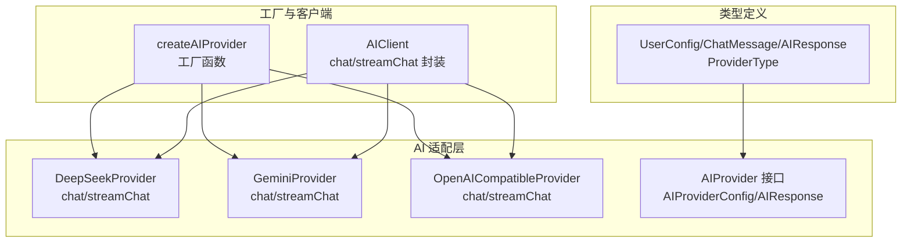
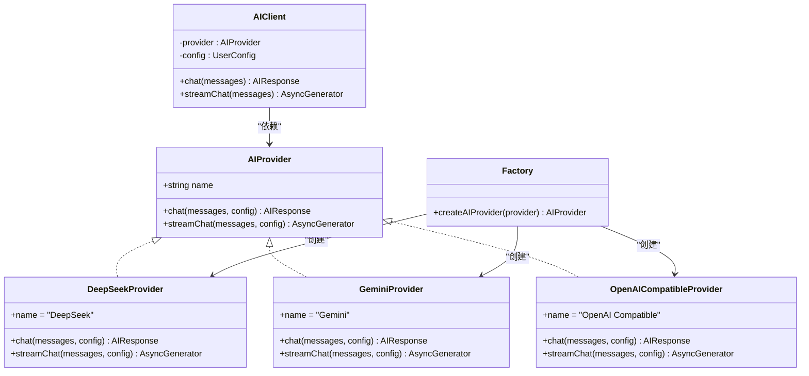
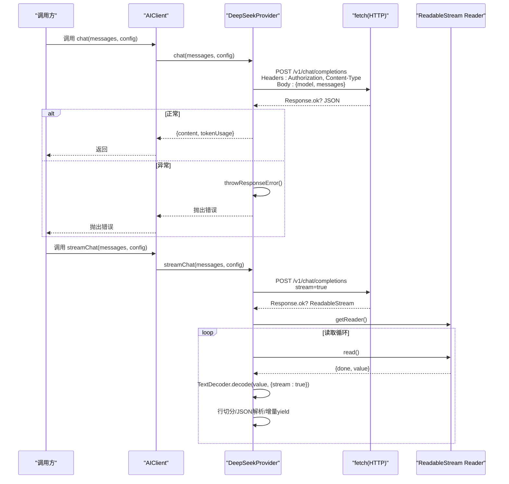
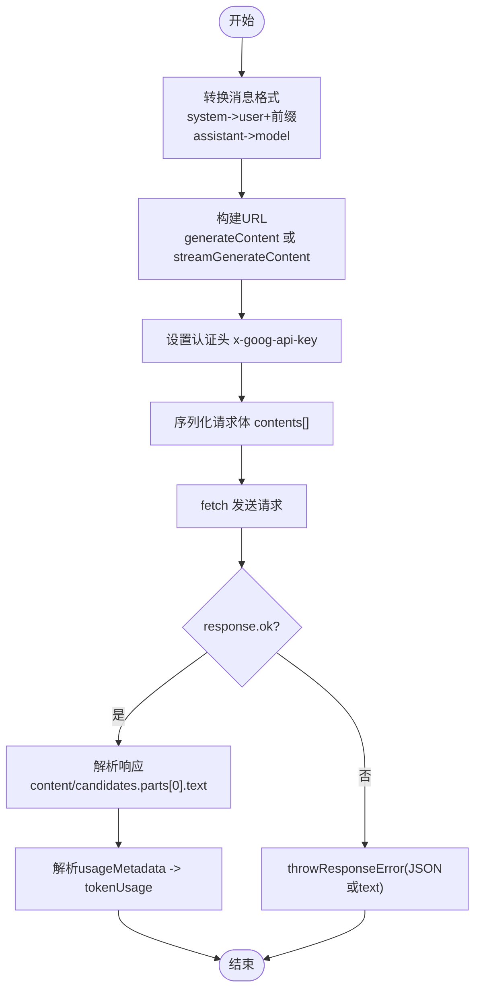
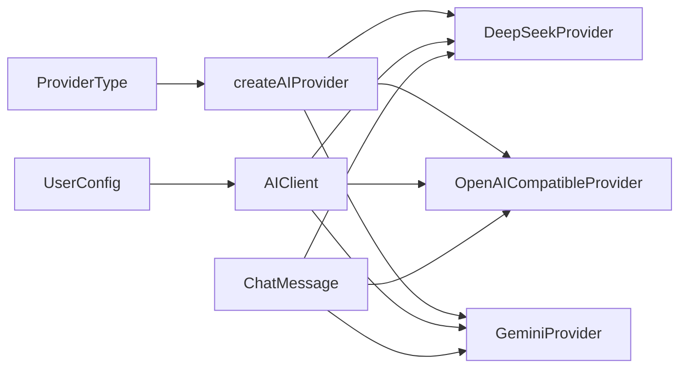

# 供应商适配器

<cite>
**本文引用的文件**
- [manga-creator/src/lib/ai/providers/deepseek.ts](file://manga-creator/src/lib/ai/providers/deepseek.ts)
- [manga-creator/src/lib/ai/providers/gemini.ts](file://manga-creator/src/lib/ai/providers/gemini.ts)
- [manga-creator/src/lib/ai/providers/openai.ts](file://manga-creator/src/lib/ai/providers/openai.ts)
- [manga-creator/src/lib/ai/types.ts](file://manga-creator/src/lib/ai/types.ts)
- [manga-creator/src/lib/ai/factory.ts](file://manga-creator/src/lib/ai/factory.ts)
- [manga-creator/src/types/index.ts](file://manga-creator/src/types/index.ts)
- [manga-creator/src/lib/ai/providers/providers.test.ts](file://manga-creator/src/lib/ai/providers/providers.test.ts)
- [manga-creator/src/lib/ai/factory.test.ts](file://manga-creator/src/lib/ai/factory.test.ts)
</cite>

## 目录
1. [简介](#简介)
2. [项目结构](#项目结构)
3. [核心组件](#核心组件)
4. [架构总览](#架构总览)
5. [组件详解](#组件详解)
6. [依赖关系分析](#依赖关系分析)
7. [性能考量](#性能考量)
8. [故障排查指南](#故障排查指南)
9. [结论](#结论)
10. [附录](#附录)

## 简介
本文件面向需要在多供应商AI平台上统一接入聊天与流式对话能力的开发者，系统性对比 DeepSeekProvider、GeminiProvider 与 OpenAICompatibleProvider 的实现差异，重点覆盖：
- 如何实现 AIProvider 接口的 chat 与 streamChat 方法
- HTTP 请求构建（认证头、URL 生成）
- 请求体序列化与响应解析
- 消息格式差异与归一化策略（尤其是 Gemini 的 contents/parts 映射）
- token usage 返回格式差异与归一化处理
- 网络调用时序图与错误处理（throwResponseError）及重试边界条件
- 流式传输中 TextDecoder 与 Reader 的协作机制

## 项目结构
该仓库采用“按功能域划分”的组织方式：AI 适配层位于 manga-creator/src/lib/ai 下，类型定义位于 types 层，工厂与客户端封装位于 factory.ts 中；前端 UI 与业务逻辑在 manga-creator/src 下。

图表来源
- [manga-creator/src/lib/ai/providers/deepseek.ts](file://manga-creator/src/lib/ai/providers/deepseek.ts#L1-L110)
- [manga-creator/src/lib/ai/providers/gemini.ts](file://manga-creator/src/lib/ai/providers/gemini.ts#L1-L138)
- [manga-creator/src/lib/ai/providers/openai.ts](file://manga-creator/src/lib/ai/providers/openai.ts#L1-L88)
- [manga-creator/src/lib/ai/types.ts](file://manga-creator/src/lib/ai/types.ts#L1-L15)
- [manga-creator/src/lib/ai/factory.ts](file://manga-creator/src/lib/ai/factory.ts#L1-L54)
- [manga-creator/src/types/index.ts](file://manga-creator/src/types/index.ts#L82-L108)

章节来源
- [manga-creator/src/lib/ai/factory.ts](file://manga-creator/src/lib/ai/factory.ts#L1-L54)
- [manga-creator/src/lib/ai/types.ts](file://manga-creator/src/lib/ai/types.ts#L1-L15)
- [manga-creator/src/types/index.ts](file://manga-creator/src/types/index.ts#L82-L108)

## 核心组件
- AIProvider 接口：定义统一的 chat 与 streamChat 签名，以及 provider 名称字段。
- AIProviderConfig：封装 provider 类型、API Key、可选 baseURL 与 model。
- AIResponse：统一返回内容与 tokenUsage 字段，便于上层归一化处理。
- 工厂函数 createAIProvider：依据 ProviderType 创建具体适配器实例。
- AIClient：对 AIProvider 进行薄封装，暴露 chat 与 streamChat 给上层业务调用。

章节来源
- [manga-creator/src/lib/ai/types.ts](file://manga-creator/src/lib/ai/types.ts#L1-L15)
- [manga-creator/src/lib/ai/factory.ts](file://manga-creator/src/lib/ai/factory.ts#L1-L54)
- [manga-creator/src/types/index.ts](file://manga-creator/src/types/index.ts#L82-L108)

## 架构总览
下面以类图展示三个适配器与 AIProvider 的关系，以及工厂与客户端的交互。

图表来源
- [manga-creator/src/lib/ai/providers/deepseek.ts](file://manga-creator/src/lib/ai/providers/deepseek.ts#L1-L110)
- [manga-creator/src/lib/ai/providers/gemini.ts](file://manga-creator/src/lib/ai/providers/gemini.ts#L1-L138)
- [manga-creator/src/lib/ai/providers/openai.ts](file://manga-creator/src/lib/ai/providers/openai.ts#L1-L88)
- [manga-creator/src/lib/ai/factory.ts](file://manga-creator/src/lib/ai/factory.ts#L1-L54)

## 组件详解

### DeepSeekProvider
- URL 构建：默认基础地址为 https://api.deepseek.com，去除末尾斜杠后拼接 /v1/chat/completions。
- 认证头：Authorization: Bearer <apiKey>。
- 请求体：包含 model 与 messages 字段。
- 响应解析：取 choices[0].message.content 作为 content；usage 中的 prompt_tokens、completion_tokens、total_tokens 归一化为 tokenUsage。
- 错误处理：throwResponseError 优先尝试解析 JSON error.message，否则读取 text，最终抛出包含状态码与详情的错误。
- 流式传输：开启 stream: true；通过 response.body.getReader() 读取二进制数据，TextDecoder 以流式方式解码；按行切分，匹配以 "data: " 开头的行，解析 JSON 中 choices[0].delta.content 产出增量片段；遇到 "[DONE]" 结束。

图表来源
- [manga-creator/src/lib/ai/providers/deepseek.ts](file://manga-creator/src/lib/ai/providers/deepseek.ts#L1-L110)
- [manga-creator/src/lib/ai/factory.ts](file://manga-creator/src/lib/ai/factory.ts#L22-L54)

章节来源
- [manga-creator/src/lib/ai/providers/deepseek.ts](file://manga-creator/src/lib/ai/providers/deepseek.ts#L1-L110)
- [manga-creator/src/lib/ai/providers/providers.test.ts](file://manga-creator/src/lib/ai/providers/providers.test.ts#L1-L268)

### GeminiProvider
- URL 构建：默认基础地址为 https://generativelanguage.googleapis.com，模型路径为 /v1beta/models/{model}:generateContent；流式 URL 为 /v1beta/models/{model}:streamGenerateContent?alt=sse。
- 认证头：x-goog-api-key: <apiKey>。
- 请求体转换：messages -> contents 数组，其中：
  - system 消息被转换为 user 角色并前置，内容包含 "System instruction:" 前缀；
  - assistant 映射为 model；
  - user 保持 user。
- 响应解析：取 candidates[0].content.parts[0].text 作为 content；若存在 usageMetadata，则提取 promptTokenCount、candidatesTokenCount、totalTokenCount 归一化为 tokenUsage。
- 错误处理：throwResponseError 与 DeepSeekProvider 类似，优先 JSON.error.message，再尝试 text。
- 流式传输：使用流式 URL，按行解析 data: 行，JSON 中 candidates[0].content.parts[0].text 作为增量片段；忽略空行与无效 JSON。

图表来源
- [manga-creator/src/lib/ai/providers/gemini.ts](file://manga-creator/src/lib/ai/providers/gemini.ts#L1-L138)

章节来源
- [manga-creator/src/lib/ai/providers/gemini.ts](file://manga-creator/src/lib/ai/providers/gemini.ts#L1-L138)
- [manga-creator/src/lib/ai/providers/providers.test.ts](file://manga-creator/src/lib/ai/providers/providers.test.ts#L390-L627)

### OpenAICompatibleProvider
- URL 构建：默认基础地址为 https://api.openai.com，路径 /v1/chat/completions。
- 认证头：Authorization: Bearer <apiKey>。
- 请求体：包含 model 与 messages 字段。
- 响应解析：取 choices[0].message.content 作为 content；若存在 usage，则提取 prompt_tokens、completion_tokens、total_tokens 归一化为 tokenUsage。
- 错误处理：直接抛出包含 statusText 的错误。
- 流式传输：开启 stream: true；按行解析 data: 行，JSON 中 choices[0].delta.content 作为增量片段；遇到 "[DONE]" 结束。

章节来源
- [manga-creator/src/lib/ai/providers/openai.ts](file://manga-creator/src/lib/ai/providers/openai.ts#L1-L88)
- [manga-creator/src/lib/ai/providers/providers.test.ts](file://manga-creator/src/lib/ai/providers/providers.test.ts#L270-L388)

### 消息格式与 token usage 归一化策略
- 消息格式差异
  - DeepSeek/Gemini/OpenAI 共同点：均接受 messages 数组，包含 role 与 content。
  - DeepSeek：messages 直传。
  - Gemini：messages 需要转换为 contents/parts 结构，且 system 消息需前置为 user。
  - OpenAI：messages 直传。
- token usage 差异
  - DeepSeek：usage.{prompt_tokens, completion_tokens, total_tokens}
  - Gemini：usageMetadata.{promptTokenCount, candidatesTokenCount, totalTokenCount}
  - OpenAI：usage.{prompt_tokens, completion_tokens, total_tokens}
- 归一化策略
  - 统一输出 AIResponse.tokenUsage，字段为 {prompt, completion, total}，由各适配器解析对应平台字段并映射。
  - 若平台未返回 usage/usageMetadata，则 tokenUsage 设为 undefined，避免上层误判。

章节来源
- [manga-creator/src/lib/ai/providers/deepseek.ts](file://manga-creator/src/lib/ai/providers/deepseek.ts#L48-L57)
- [manga-creator/src/lib/ai/providers/gemini.ts](file://manga-creator/src/lib/ai/providers/gemini.ts#L80-L87)
- [manga-creator/src/lib/ai/providers/openai.ts](file://manga-creator/src/lib/ai/providers/openai.ts#L26-L34)

### 流式传输：TextDecoder 与 Reader 协作机制
- Reader：通过 response.body.getReader() 获取流式读取器，逐块读取二进制数据。
- TextDecoder：以 { stream: true } 方式解码，支持跨块数据的增量解码。
- 行缓冲：将解码后的字节流按换行符切分为行，保留最后一个不完整的行作为缓冲，等待下一块数据补齐。
- SSE 行过滤：仅处理以 "data: " 开头的行；OpenAI/Gemini/DashScope 等平台的行前缀略有差异，适配器已针对各自格式进行解析。
- JSON 解析与增量产出：对每行 JSON 进行解析，提取增量内容并 yield，直到遇到结束标记（如 "[DONE]"）。

章节来源
- [manga-creator/src/lib/ai/providers/deepseek.ts](file://manga-creator/src/lib/ai/providers/deepseek.ts#L79-L108)
- [manga-creator/src/lib/ai/providers/gemini.ts](file://manga-creator/src/lib/ai/providers/gemini.ts#L107-L136)
- [manga-creator/src/lib/ai/providers/openai.ts](file://manga-creator/src/lib/ai/providers/openai.ts#L57-L86)

## 依赖关系分析
- 工厂函数 createAIProvider 根据 ProviderType 返回对应适配器实例，支持 deepseek、openai-compatible、kimi、gemini。
- AIClient 仅依赖 AIProvider 接口，不关心具体实现细节，从而实现对多供应商的透明接入。
- 各适配器均依赖统一的类型定义（ChatMessage、AIResponse、UserConfig），确保上层调用一致。

图表来源
- [manga-creator/src/types/index.ts](file://manga-creator/src/types/index.ts#L82-L91)
- [manga-creator/src/lib/ai/factory.ts](file://manga-creator/src/lib/ai/factory.ts#L1-L54)
- [manga-creator/src/lib/ai/providers/deepseek.ts](file://manga-creator/src/lib/ai/providers/deepseek.ts#L1-L110)
- [manga-creator/src/lib/ai/providers/gemini.ts](file://manga-creator/src/lib/ai/providers/gemini.ts#L1-L138)
- [manga-creator/src/lib/ai/providers/openai.ts](file://manga-creator/src/lib/ai/providers/openai.ts#L1-L88)

章节来源
- [manga-creator/src/lib/ai/factory.ts](file://manga-creator/src/lib/ai/factory.ts#L1-L54)
- [manga-creator/src/types/index.ts](file://manga-creator/src/types/index.ts#L82-L108)

## 性能考量
- 流式解析的内存占用：TextDecoder 与行缓冲配合，避免一次性加载整段数据，适合长文本与高吞吐场景。
- 重试边界条件：当前实现未内置自动重试逻辑，建议在上层业务侧基于错误码（如 429/5xx）进行指数退避重试。
- URL 与头部构造：统一在适配器内部完成，减少上层重复逻辑，提升可维护性。
- 跨平台 token usage 归一化：统一字段命名，便于统计与成本控制。

## 故障排查指南
- 常见错误类型
  - 认证失败：检查 apiKey 是否正确，以及各平台认证头是否符合要求（DeepSeek/Bearer；Gemini/x-goog-api-key）。
  - URL 构造问题：确认 baseURL 末尾无多余斜杠，路径拼接正确。
  - 响应体为空或格式异常：检查平台返回结构是否与解析逻辑一致（choices vs candidates.parts vs data: 行）。
- 错误处理
  - DeepSeek/Gemini：throwResponseError 会优先尝试 JSON.error.message，其次尝试 text，最后回退为空字符串，保证错误信息可读性。
  - OpenAI：直接抛出包含 statusText 的错误。
- 流式解析异常
  - 无效 JSON 行：适配器会记录日志并跳过，不影响后续增量产出。
  - 无 response.body：抛出“无响应体”错误，提示上游检查网络或平台支持情况。

章节来源
- [manga-creator/src/lib/ai/providers/deepseek.ts](file://manga-creator/src/lib/ai/providers/deepseek.ts#L12-L27)
- [manga-creator/src/lib/ai/providers/gemini.ts](file://manga-creator/src/lib/ai/providers/gemini.ts#L41-L56)
- [manga-creator/src/lib/ai/providers/openai.ts](file://manga-creator/src/lib/ai/providers/openai.ts#L22-L24)
- [manga-creator/src/lib/ai/providers/providers.test.ts](file://manga-creator/src/lib/ai/providers/providers.test.ts#L102-L151)

## 结论
- 三个适配器均遵循同一接口契约，实现了 chat 与 streamChat 的统一入口。
- 在消息格式与 token usage 上，通过适配器内部转换与归一化，屏蔽了平台差异，便于上层业务复用。
- 流式传输采用 Reader + TextDecoder 的稳健解析机制，兼容跨块数据与多种 SSE 行格式。
- 建议在上层增加统一的重试与熔断策略，以应对网络抖动与平台限流。

## 附录
- 工厂与客户端使用示例（参考测试用例）
  - 工厂创建：根据 ProviderType 创建对应适配器实例。
  - 客户端封装：AIClient 对外暴露 chat 与 streamChat，内部委托给具体适配器。
  - 测试覆盖：包含 URL 构建、认证头、请求体、响应解析、流式解析、错误处理、跨块数据等场景。

章节来源
- [manga-creator/src/lib/ai/factory.test.ts](file://manga-creator/src/lib/ai/factory.test.ts#L1-L595)
- [manga-creator/src/lib/ai/providers/providers.test.ts](file://manga-creator/src/lib/ai/providers/providers.test.ts#L1-L676)