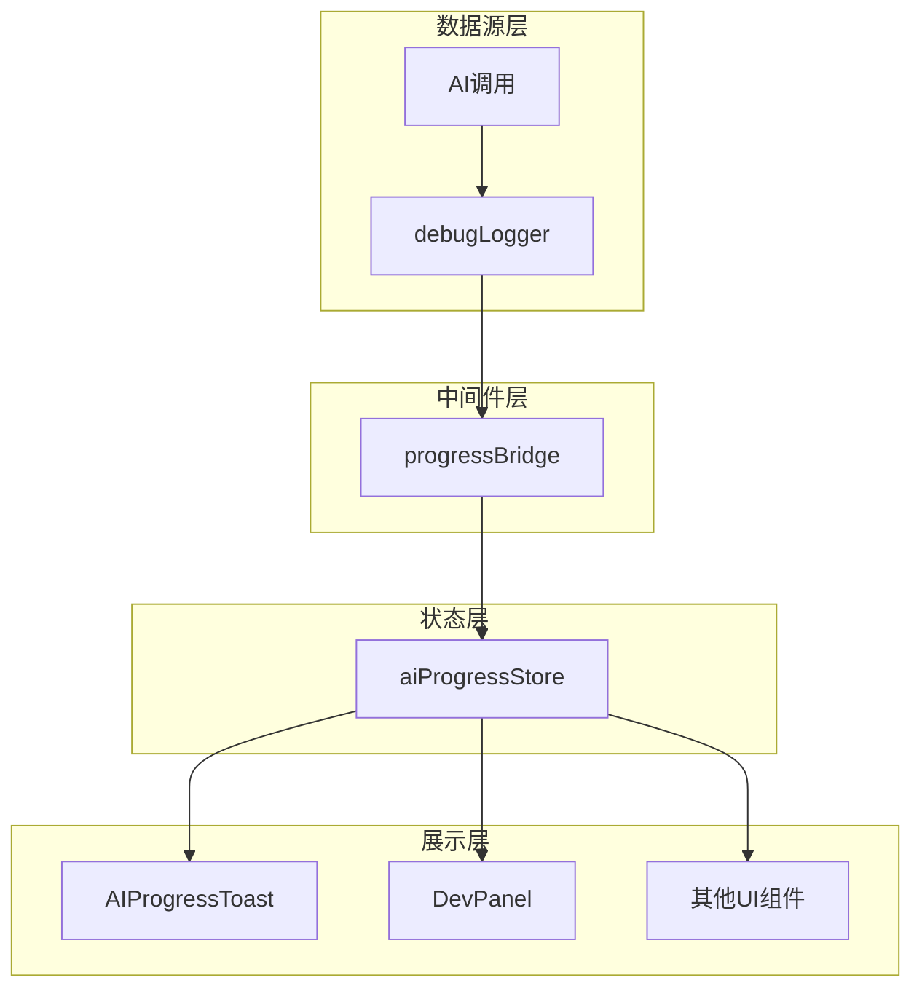
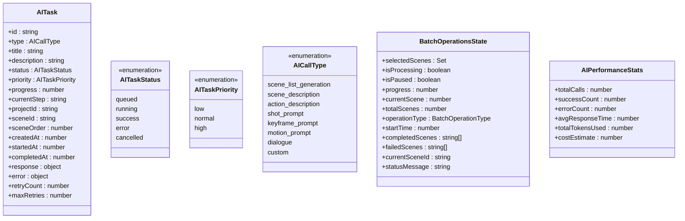
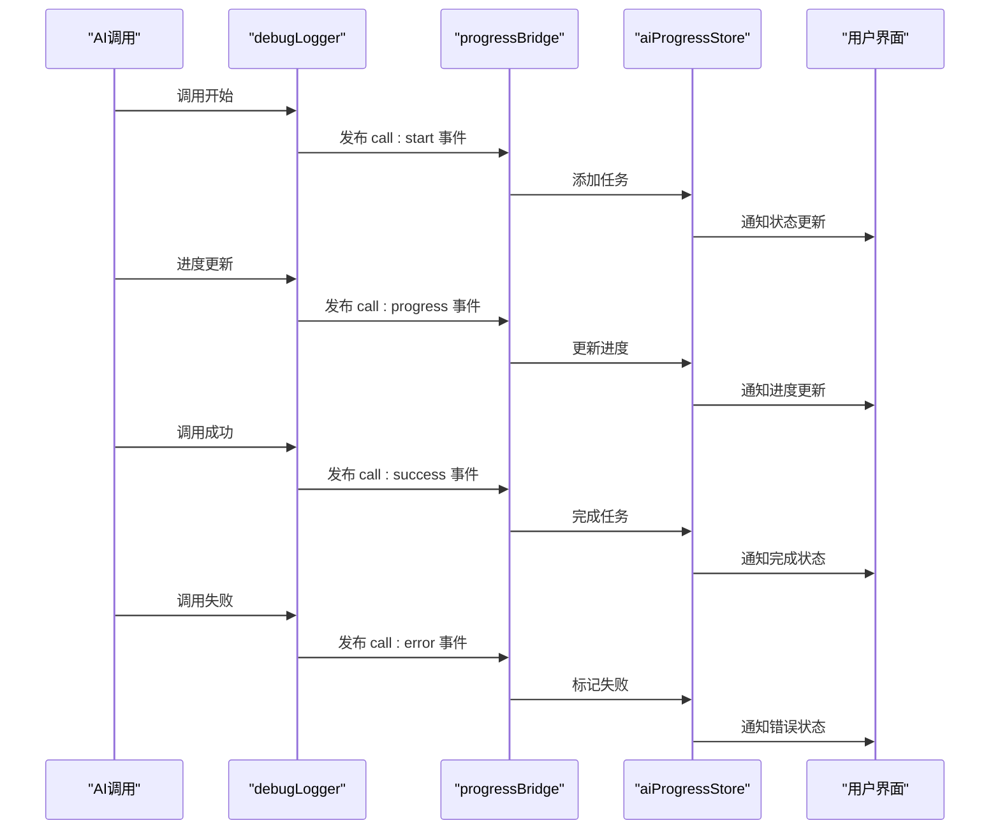
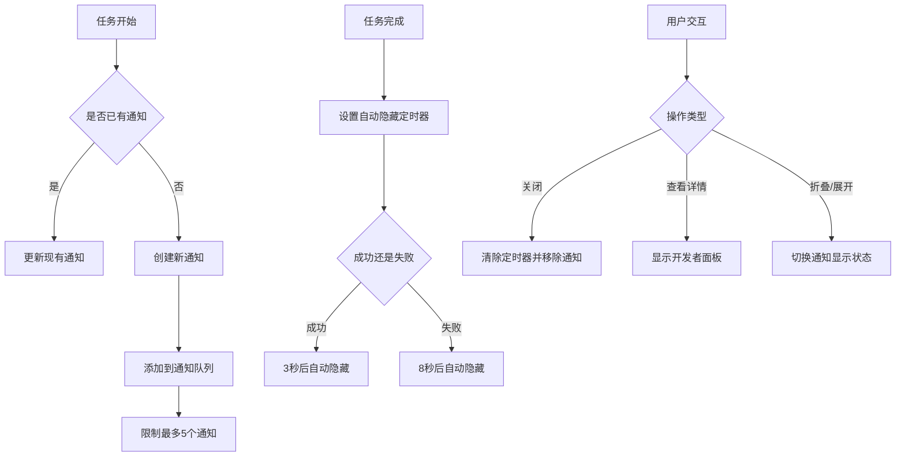
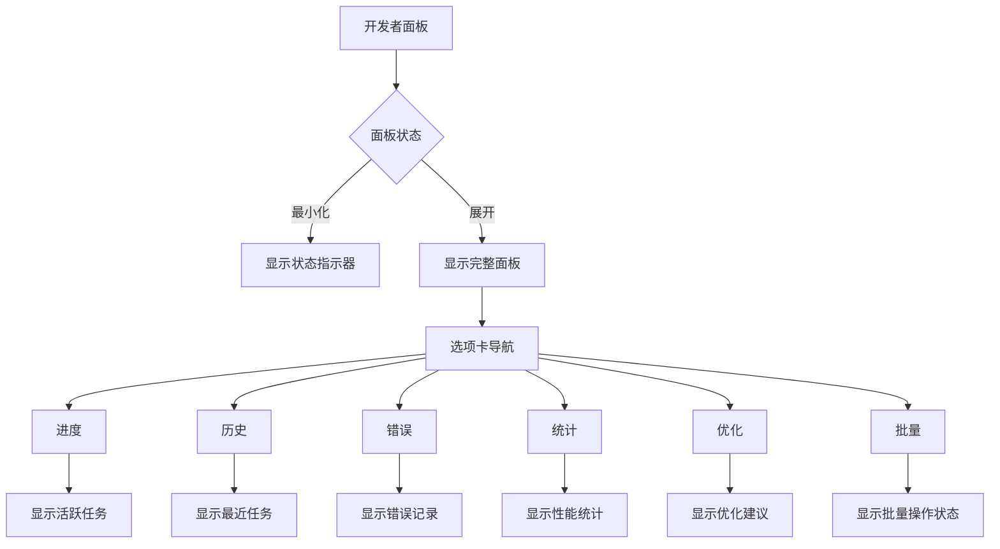
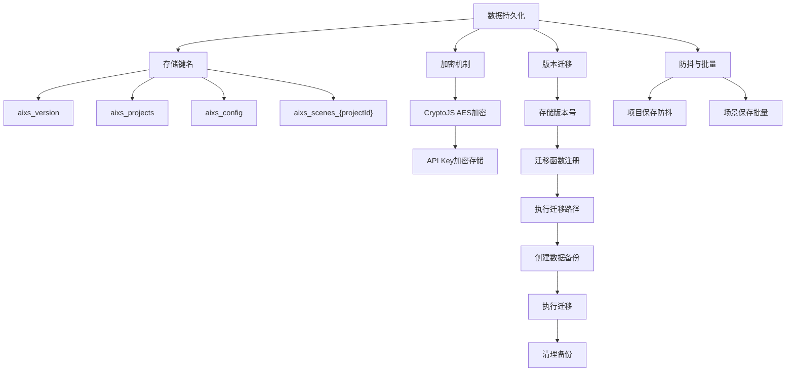
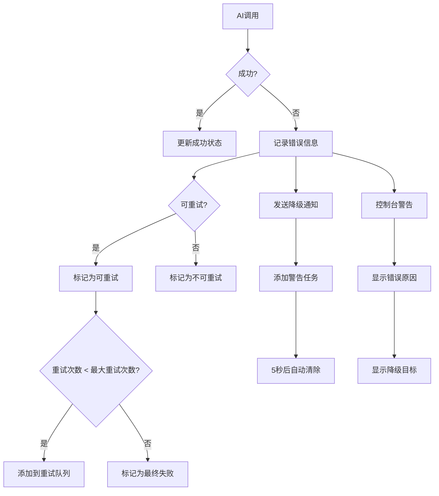
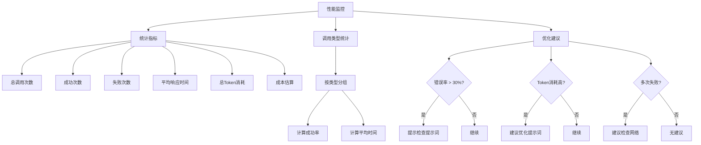

# 工具结果同步

<cite>
**本文档引用的文件**  
- [App.tsx](file://manga-creator/src/App.tsx#L56-L61)
- [aiProgressStore.ts](file://manga-creator/src/stores/aiProgressStore.ts)
- [progressBridge.ts](file://manga-creator/src/lib/ai/progressBridge.ts)
- [debugLogger.ts](file://manga-creator/src/lib/ai/debugLogger.ts)
- [AIProgressToast.tsx](file://manga-creator/src/components/AIProgressToast.tsx)
- [DevPanel.tsx](file://manga-creator/src/components/DevPanel.tsx)
- [storage.ts](file://manga-creator/src/lib/storage.ts)
- [projectStore.ts](file://manga-creator/src/stores/projectStore.ts)
- [storyboardStore.ts](file://manga-creator/src/stores/storyboardStore.ts)
</cite>

## 目录
1. [简介](#简介)
2. [核心架构](#核心架构)
3. [状态管理](#状态管理)
4. [事件同步机制](#事件同步机制)
5. [用户界面反馈](#用户界面反馈)
6. [数据持久化](#数据持久化)
7. [错误处理与降级](#错误处理与降级)
8. [性能监控](#性能监控)
9. [总结](#总结)

## 简介

"工具结果同步"是漫剧创作助手中的核心功能，负责将AI调用的实时状态、进度和结果同步到用户界面。该系统通过事件驱动架构，实现了从AI调用到UI反馈的完整闭环，确保用户能够实时了解创作进度和系统状态。

系统主要由四个核心组件构成：AI调试日志器（debugLogger）、AI进度桥接器（progressBridge）、AI进度追踪Store（aiProgressStore）和用户界面组件（AIProgressToast、DevPanel）。这些组件协同工作，形成了一个完整的工具结果同步体系。

**Section sources**
- [App.tsx](file://manga-creator/src/App.tsx#L56-L61)
- [README.md](file://manga-creator/README.md#L38-L47)

## 核心架构

工具结果同步系统采用分层架构设计，各层职责分明，通过事件机制进行通信。系统架构分为三层：数据源层、中间件层和展示层。

**Diagram sources**
- [debugLogger.ts](file://manga-creator/src/lib/ai/debugLogger.ts)
- [progressBridge.ts](file://manga-creator/src/lib/ai/progressBridge.ts)
- [aiProgressStore.ts](file://manga-creator/src/stores/aiProgressStore.ts)
- [AIProgressToast.tsx](file://manga-creator/src/components/AIProgressToast.tsx)
- [DevPanel.tsx](file://manga-creator/src/components/DevPanel.tsx)

## 状态管理

AI进度追踪Store是整个同步系统的核心，采用Zustand进行状态管理，集中存储所有AI任务的状态信息。Store定义了完整的任务生命周期，包括排队、运行、成功、失败和取消等状态。

**Diagram sources**
- [aiProgressStore.ts](file://manga-creator/src/stores/aiProgressStore.ts#L43-L86)

## 事件同步机制

工具结果同步的核心是事件驱动机制，通过debugLogger和progressBridge实现跨组件通信。当AI调用发生时，debugLogger生成日志事件，progressBridge监听这些事件并将其转换为Store操作。

**Diagram sources**
- [debugLogger.ts](file://manga-creator/src/lib/ai/debugLogger.ts#L26-L34)
- [progressBridge.ts](file://manga-creator/src/lib/ai/progressBridge.ts#L48-L93)
- [aiProgressStore.ts](file://manga-creator/src/stores/aiProgressStore.ts#L146-L158)

## 用户界面反馈

系统提供了多层次的用户界面反馈，包括实时通知Toast和详细的开发者面板，确保用户能够及时了解AI调用状态。

### 实时通知组件

AIProgressToast组件提供轻量级的实时通知，显示当前AI任务的进度和状态。通知支持折叠/展开、手动关闭和查看详情等功能。

**Diagram sources**
- [AIProgressToast.tsx](file://manga-creator/src/components/AIProgressToast.tsx#L25-L157)

### 开发者面板

开发者面板提供详细的AI调用信息，包括实时进度、历史记录、错误信息、统计分析和优化建议。面板支持最小化、展开和关闭操作。

**Diagram sources**
- [DevPanel.tsx](file://manga-creator/src/components/DevPanel.tsx#L55-L619)

## 数据持久化

系统通过LocalStorage实现数据持久化，确保用户刷新页面后仍能保持工作状态。持久化机制包括项目数据、配置信息和AI调用历史。

**Diagram sources**
- [storage.ts](file://manga-creator/src/lib/storage.ts#L81-L86)
- [storage.ts](file://manga-creator/src/lib/storage.ts#L6-L7)
- [storage.ts](file://manga-creator/src/lib/storage.ts#L144-L177)
- [storage.ts](file://manga-creator/src/lib/storage.ts#L14-L62)

## 错误处理与降级

系统实现了完善的错误处理机制，当AI调用失败时能够优雅降级，并提供详细的错误信息和重试机制。

**Diagram sources**
- [progressBridge.ts](file://manga-creator/src/lib/ai/progressBridge.ts#L80-L93)
- [progressBridge.ts](file://manga-creator/src/lib/ai/progressBridge.ts#L198-L247)
- [aiProgressStore.ts](file://manga-creator/src/stores/aiProgressStore.ts#L376-L398)

## 性能监控

系统内置了性能监控功能，能够统计AI调用的各项指标，为优化提供数据支持。

**Diagram sources**
- [aiProgressStore.ts](file://manga-creator/src/stores/aiProgressStore.ts#L89-L96)
- [aiProgressStore.ts](file://manga-creator/src/stores/aiProgressStore.ts#L208-L236)
- [debugLogger.ts](file://manga-creator/src/lib/ai/debugLogger.ts#L466-L498)

## 总结

工具结果同步系统通过事件驱动架构，实现了从AI调用到用户界面的完整状态同步。系统具有以下特点：

1. **分层架构**：清晰的分层设计，各组件职责分明
2. **实时反馈**：通过Toast和开发者面板提供多层次反馈
3. **状态完整**：覆盖任务的完整生命周期，包括重试机制
4. **数据持久**：通过LocalStorage和版本迁移确保数据安全
5. **错误处理**：完善的错误处理和降级机制
6. **性能监控**：内置统计和优化建议功能

该系统不仅确保了用户能够实时了解创作进度，还为开发者提供了强大的调试工具，是漫剧创作助手的核心功能之一。

**Section sources**
- [README.md](file://manga-creator/README.md#L38-L47)
- [App.tsx](file://manga-creator/src/App.tsx#L56-L61)