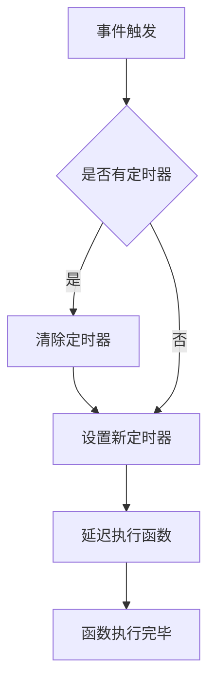
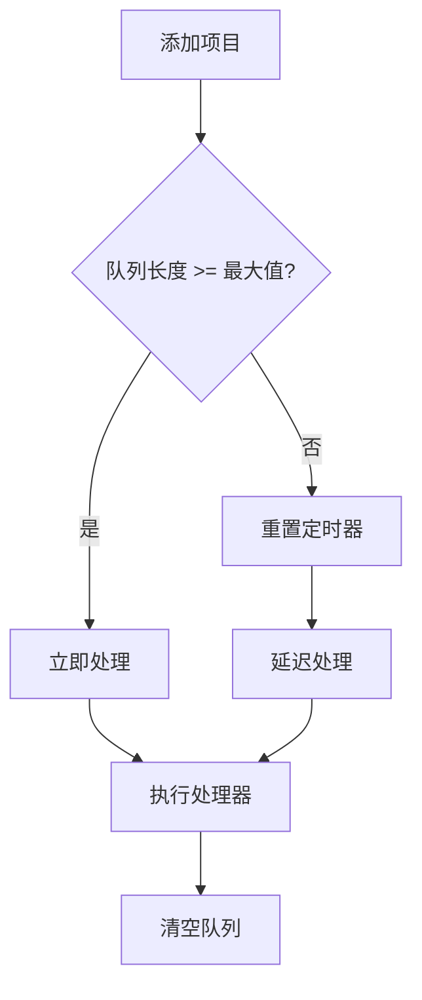
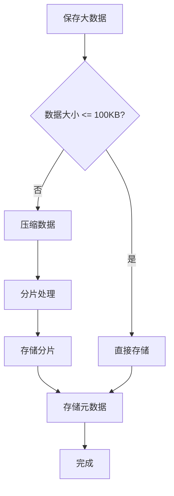
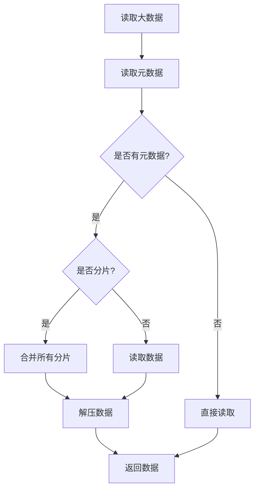
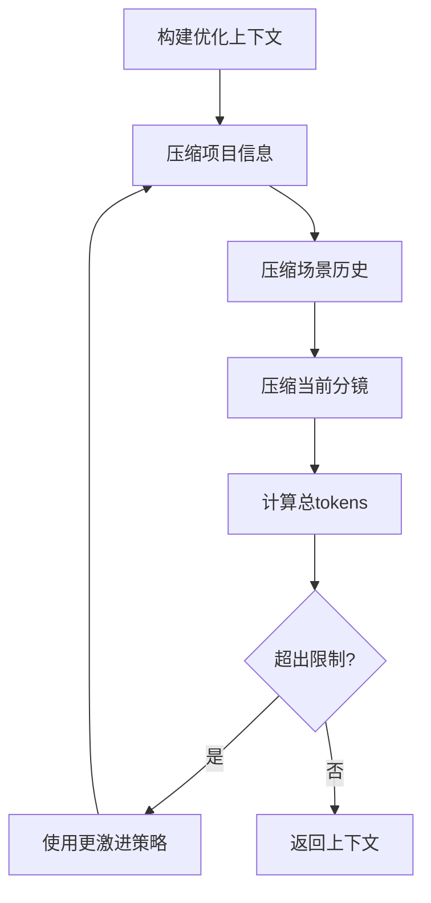
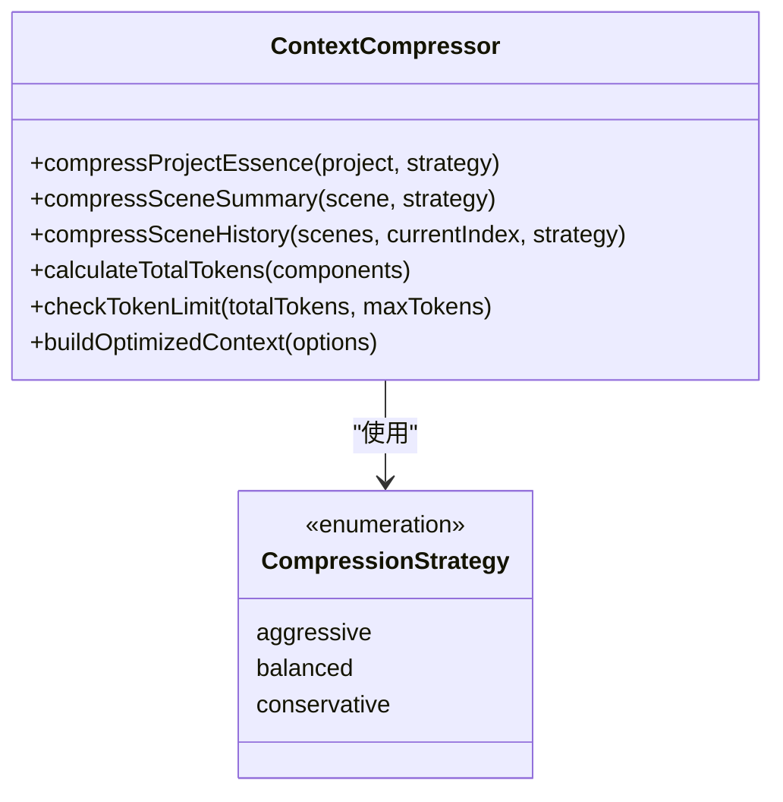
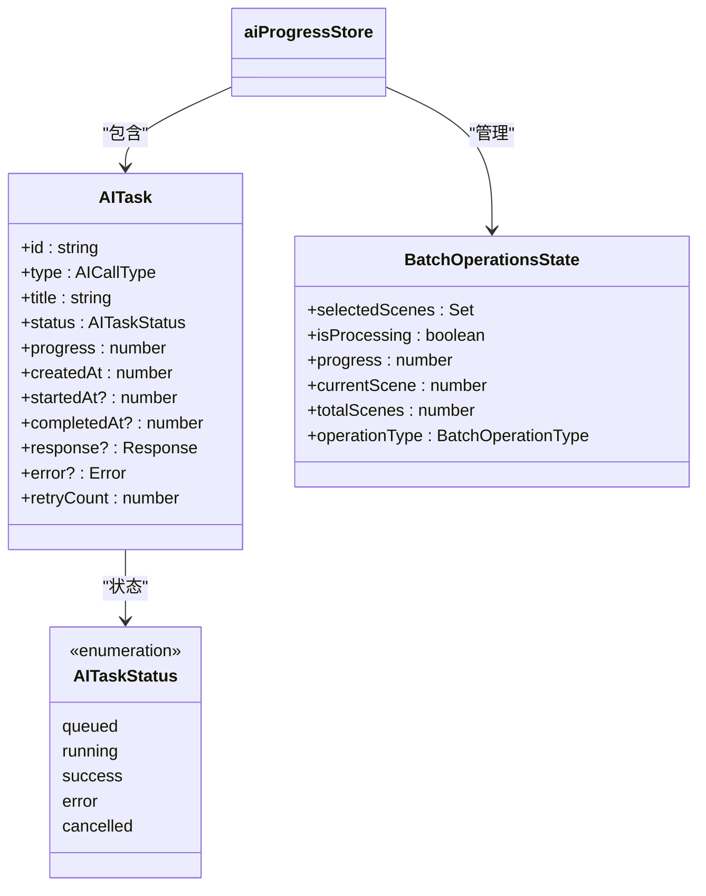
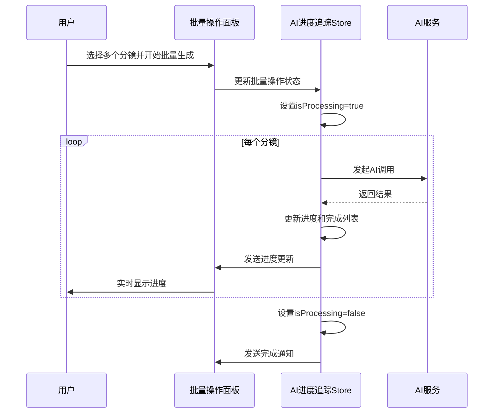
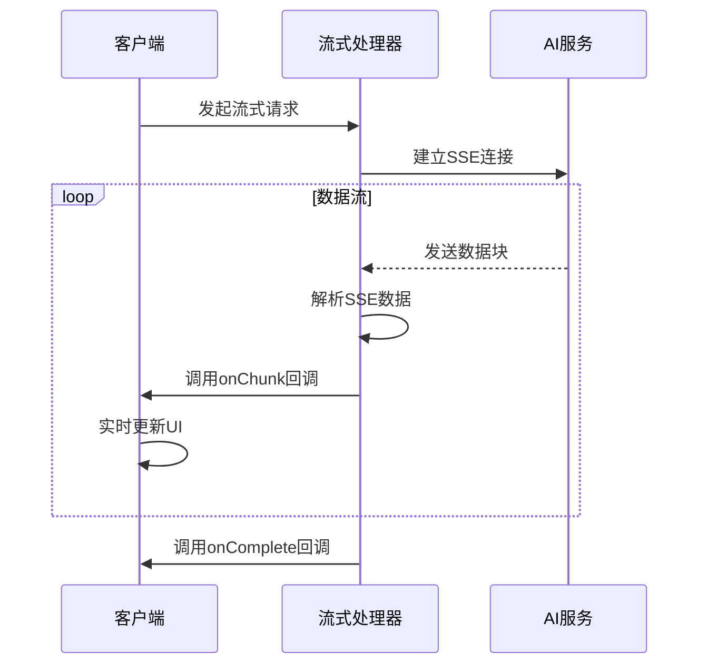
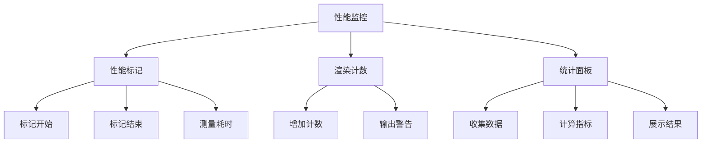

# 性能优化

<cite>
**本文档引用的文件**   
- [performance.ts](file://manga-creator/src/lib/performance.ts)
- [performance.test.ts](file://manga-creator/src/lib/performance.test.ts)
- [storageManager.ts](file://manga-creator/src/lib/storageManager.ts)
- [storageManager.test.ts](file://manga-creator/src/lib/storageManager.test.ts)
- [contextCompressor.ts](file://manga-creator/src/lib/ai/contextCompressor.ts)
- [contextCompressor.test.ts](file://manga-creator/src/lib/ai/contextCompressor.test.ts)
- [aiProgressStore.ts](file://manga-creator/src/stores/aiProgressStore.ts)
- [aiProgressStore.test.ts](file://manga-creator/src/stores/aiProgressStore.test.ts)
- [streamingHandler.ts](file://manga-creator/src/lib/ai/streamingHandler.ts)
- [statisticsStore.ts](file://manga-creator/src/stores/statisticsStore.ts)
- [SceneRefinement.tsx](file://manga-creator/src/components/editor/SceneRefinement.tsx)
- [BatchOperations.tsx](file://manga-creator/src/components/editor/BatchOperations.tsx)
- [DevPanel.tsx](file://manga-creator/src/components/DevPanel.tsx)
- [StatisticsPanel.tsx](file://manga-creator/src/components/editor/StatisticsPanel.tsx)
- [prd_backup.md](file://prd_backup.md)
</cite>

## 目录
1. [引言](#引言)
2. [性能优化工具库](#性能优化工具库)
3. [存储性能优化](#存储性能优化)
4. [AI上下文压缩](#ai上下文压缩)
5. [AI进度追踪与批量操作](#ai进度追踪与批量操作)
6. [流式响应处理](#流式响应处理)
7. [性能监控与统计](#性能监控与统计)
8. [性能优化建议](#性能优化建议)
9. [结论](#结论)

## 引言

本项目通过多种技术手段实现了全面的性能优化，涵盖了前端性能、存储效率、AI调用优化和用户体验等多个方面。系统通过防抖、节流、缓存、批量操作等通用优化技术，结合针对AI应用的特殊优化策略，如上下文压缩、流式响应处理和智能进度管理，构建了一个高效稳定的漫画创作平台。

项目中的性能优化策略不仅关注代码层面的效率提升，还注重用户体验的优化，通过进度可视化、性能监控和智能降级机制，确保在各种网络和设备条件下都能提供流畅的使用体验。这些优化措施共同构成了一个完整的性能优化体系，为应用的稳定运行和可扩展性提供了坚实基础。

**Section sources**
- [performance.ts](file://manga-creator/src/lib/performance.ts#L1-L270)
- [storageManager.ts](file://manga-creator/src/lib/storageManager.ts#L1-L363)

## 性能优化工具库

项目提供了一个全面的性能优化工具库，包含防抖、节流、缓存、批量队列等多种通用优化工具。这些工具被广泛应用于各个组件中，有效提升了应用的整体性能。

防抖函数（debounce）用于延迟执行函数调用，合并短时间内多次触发的事件，常用于搜索框输入、窗口大小调整等场景。节流函数（throttle）则限制函数在指定时间间隔内的执行频率，适用于滚动事件、鼠标移动等高频触发的场景。

**Diagram sources**
- [performance.ts](file://manga-creator/src/lib/performance.ts#L11-L26)

简单内存缓存（SimpleCache）实现了基于Map的缓存机制，支持TTL（生存时间）和最大容量限制。当缓存达到最大容量时，会自动清理过期项或删除最旧的项，确保内存使用效率。

批量操作队列（BatchQueue）用于合并多个操作，减少对存储系统的频繁写入。当队列中的项目数量达到预设的最大值时，会立即处理；否则，在延迟时间内累积项目，然后批量处理。

**Diagram sources**
- [performance.ts](file://manga-creator/src/lib/performance.ts#L128-L182)

**Section sources**
- [performance.ts](file://manga-creator/src/lib/performance.ts#L1-L270)
- [performance.test.ts](file://manga-creator/src/lib/performance.test.ts#L1-L278)

## 存储性能优化

项目实现了增强的存储管理系统，解决了浏览器LocalStorage的容量限制和性能问题。系统通过数据分片、压缩、完整性校验和自动清理等机制，确保大规模数据的高效存储和访问。

数据分片存储机制将超过100KB的大数据自动分割成多个小块存储，突破了单个键值对的大小限制。每个数据项都有对应的元数据，记录了压缩状态、分片数量和版本信息，便于读取时的合并和解压。

**Diagram sources**
- [storageManager.ts](file://manga-creator/src/lib/storageManager.ts#L87-L128)

数据压缩使用pako库的deflate算法，对存储数据进行压缩，显著减少了存储空间占用。系统还实现了数据完整性校验机制，定期检查数据的完整性，对损坏的数据进行修复或清除。

自动清理机制会定期清理90天前的过期数据，防止存储空间被无用数据占用。系统还提供了存储使用情况监控功能，可以实时查看存储空间的使用率和可用空间。

**Diagram sources**
- [storageManager.ts](file://manga-creator/src/lib/storageManager.ts#L130-L173)

**Section sources**
- [storageManager.ts](file://manga-creator/src/lib/storageManager.ts#L1-L363)
- [storageManager.test.ts](file://manga-creator/src/lib/storageManager.test.ts#L1-L220)

## AI上下文压缩

项目实现了智能的上下文压缩机制，有效控制AI调用的token消耗，避免超出API限制。系统支持多种压缩策略（激进、平衡、保守），根据内容复杂度自动选择合适的策略。

上下文压缩器通过规则引擎和AI智能生成两种模式实现。规则引擎采用快速的文本截取和关键词提取，零延迟；AI智能生成则利用AI模型进行语义理解，生成高质量的摘要，但有额外延迟。系统采用带fallback的混合模式，当AI模式失败时自动降级到规则引擎。

**Diagram sources**
- [contextCompressor.ts](file://manga-creator/src/lib/ai/contextCompressor.ts#L239-L297)

系统提供了详细的token估算功能，基于汉字、英文单词和特殊字符的不同权重计算token数量。当token使用率超过70%时，会自动触发压缩策略，确保在安全范围内。

**Diagram sources**
- [contextCompressor.ts](file://manga-creator/src/lib/ai/contextCompressor.ts#L1-L518)
- [contextCompressor.test.ts](file://manga-creator/src/lib/ai/contextCompressor.test.ts#L189-L305)

**Section sources**
- [contextCompressor.ts](file://manga-creator/src/lib/ai/contextCompressor.ts#L1-L518)
- [contextCompressor.test.ts](file://manga-creator/src/lib/ai/contextCompressor.test.ts#L189-L305)
- [prd_backup.md](file://prd_backup.md#L491-L708)
- [SceneRefinement.tsx](file://manga-creator/src/components/editor/SceneRefinement.tsx#L154-L163)

## AI进度追踪与批量操作

项目实现了全面的AI进度追踪系统，通过Zustand store管理所有AI调用的状态、进度和性能指标。系统提供了任务队列、批量操作、优先级管理等功能，确保AI调用的有序执行和资源合理分配。

AI进度追踪Store（aiProgressStore）维护了任务列表、队列状态、批量操作状态和性能统计等信息。每个AI任务都有详细的状态记录，包括排队、执行、成功、失败和取消等状态，以及进度、耗时、token使用等性能指标。

**Diagram sources**
- [aiProgressStore.ts](file://manga-creator/src/stores/aiProgressStore.ts#L43-L86)
- [aiProgressStore.ts](file://manga-creator/src/stores/aiProgressStore.ts#L124-L137)

批量操作功能允许用户同时对多个分镜进行生成、编辑、导出或删除操作。系统通过批量操作状态管理，实时显示处理进度、已完成和失败的分镜数量，提供暂停、继续和取消等控制功能。

**Diagram sources**
- [aiProgressStore.ts](file://manga-creator/src/stores/aiProgressStore.ts#L124-L137)
- [BatchOperations.tsx](file://manga-creator/src/components/editor/BatchOperations.tsx#L39-L90)
- [DevPanel.tsx](file://manga-creator/src/components/DevPanel.tsx#L470-L497)

**Section sources**
- [aiProgressStore.ts](file://manga-creator/src/stores/aiProgressStore.ts#L1-L669)
- [aiProgressStore.test.ts](file://manga-creator/src/stores/aiProgressStore.test.ts#L877-L1103)
- [BatchOperations.tsx](file://manga-creator/src/components/editor/BatchOperations.tsx#L39-L90)
- [DevPanel.tsx](file://manga-creator/src/components/DevPanel.tsx#L470-L497)

## 流式响应处理

项目实现了高效的流式响应处理机制，支持OpenAI、DeepSeek、Kimi和Gemini等多种AI服务的流式API。系统通过SSE（Server-Sent Events）技术，实现内容的实时增量更新，提供更好的用户体验。

流式响应处理器（streamingHandler）封装了不同AI服务的流式API调用，提供统一的接口。系统支持中断生成、进度显示和错误处理等功能，确保流式响应的稳定性和可靠性。

**Diagram sources**
- [streamingHandler.ts](file://manga-creator/src/lib/ai/streamingHandler.ts#L34-L115)

系统实现了可中断的请求机制，用户可以随时停止AI生成过程。处理器还提供了进度估算和剩余时间预测功能，基于当前生成速度估算完成时间和剩余时间。

**Section sources**
- [streamingHandler.ts](file://manga-creator/src/lib/ai/streamingHandler.ts#L1-L377)

## 性能监控与统计

项目提供了全面的性能监控和统计功能，帮助开发者和用户了解系统的运行状况和性能表现。系统通过性能标记、渲染计数器和统计面板等多种方式收集和展示性能数据。

性能标记工具（perfMarker）利用浏览器的Performance API，在开发环境下标记和测量关键函数的执行时间，并在控制台输出性能报告。这有助于识别性能瓶颈和优化关键路径。

渲染计数器（trackRender）用于追踪组件的渲染次数，在开发环境下每渲染10次输出一次警告，帮助发现不必要的重渲染问题。

**Diagram sources**
- [performance.ts](file://manga-creator/src/lib/performance.ts#L224-L243)
- [performance.ts](file://manga-creator/src/lib/performance.ts#L249-L269)

统计面板（StatisticsPanel）展示了项目的全局统计信息，包括项目数量、分镜数量、完成率、token消耗、成本估算等指标。面板还提供了优化建议，指导用户进行性能优化。

**Section sources**
- [performance.ts](file://manga-creator/src/lib/performance.ts#L224-L269)
- [statisticsStore.ts](file://manga-creator/src/stores/statisticsStore.ts#L1-L114)
- [StatisticsPanel.tsx](file://manga-creator/src/components/editor/StatisticsPanel.tsx#L314-L332)

## 性能优化建议

基于对代码库的分析，以下是针对本项目的性能优化建议：

1. **定期清理LocalStorage**：建议用户定期清理LocalStorage中的过期数据，以优化存储性能。系统已实现自动清理机制，但手动清理可以更及时地释放空间。

2. **合理使用批量操作**：批量操作可以显著提高效率，但应避免一次性处理过多分镜。建议将大型批量操作分批进行，以减少内存占用和提高稳定性。

3. **选择合适的压缩策略**：对于复杂项目，建议使用"激进"压缩策略以减少token消耗；对于简单项目，可使用"保守"策略保留更多细节。

4. **监控AI调用性能**：通过AI进度追踪面板监控AI调用的响应时间、成功率和token使用情况，及时发现和解决性能问题。

5. **优化网络请求**：在弱网环境下，考虑增加请求超时时间或使用离线模式，提高系统的可用性。

6. **组件渲染优化**：利用渲染计数器识别频繁重渲染的组件，通过memo、useCallback等React优化技术减少不必要的渲染。

7. **资源预加载**：对于常用的AI模型和配置，考虑预加载到内存中，减少首次调用的延迟。

8. **错误处理和重试**：完善错误处理机制，对于可重试的错误实现自动重试策略，提高系统的容错能力。

**Section sources**
- [StatisticsPanel.tsx](file://manga-creator/src/components/editor/StatisticsPanel.tsx#L314-L332)
- [performance.ts](file://manga-creator/src/lib/performance.ts#L249-L269)

## 结论

本项目通过多层次、全方位的性能优化策略，构建了一个高效、稳定且用户体验良好的漫画创作平台。从通用的防抖节流、缓存机制，到针对AI应用的上下文压缩、流式响应处理，再到全面的进度追踪和性能监控，形成了一个完整的性能优化体系。

这些优化措施不仅提升了应用的技术性能，更重要的是改善了用户体验。实时的进度反馈、智能的资源管理和可靠的错误处理，让用户能够专注于创作本身，而不必担心技术问题。

未来可以进一步优化的方向包括：引入Web Worker处理耗时计算以避免阻塞主线程，实现更智能的AI调用调度算法，以及提供更详细的性能分析报告。通过持续的性能优化，项目将能够支持更大规模的创作需求，为用户提供更加流畅和高效的创作体验。