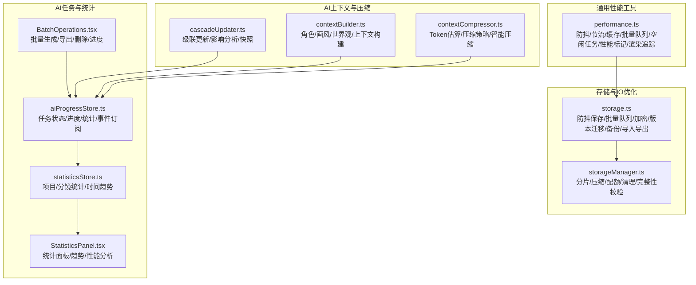
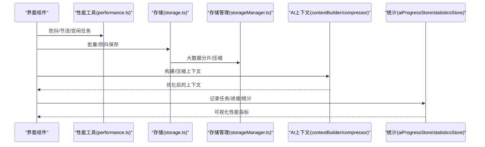
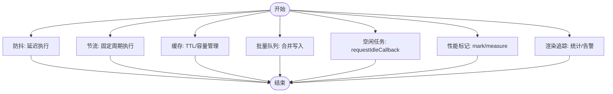
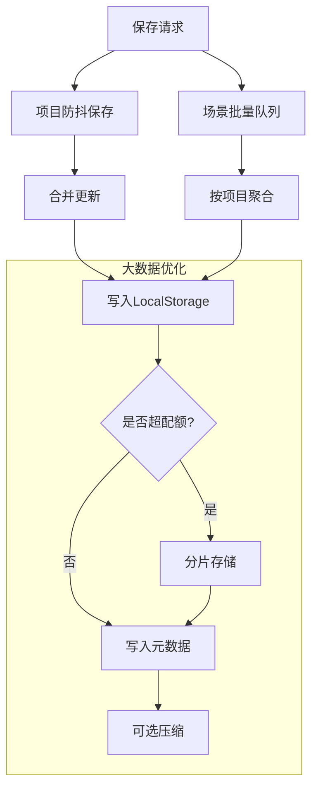
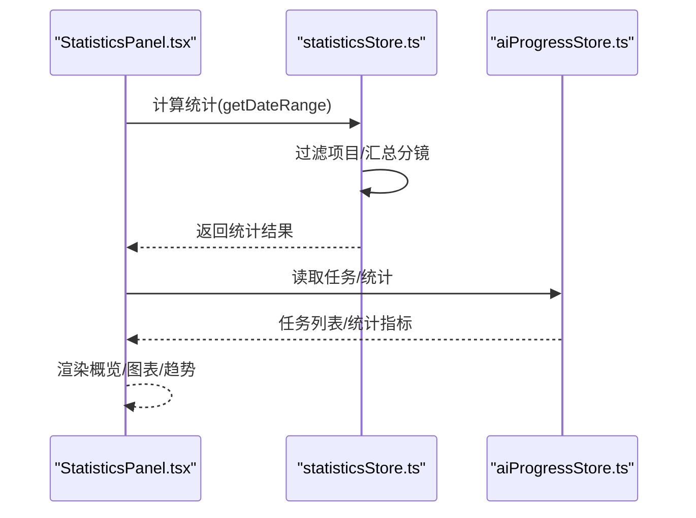
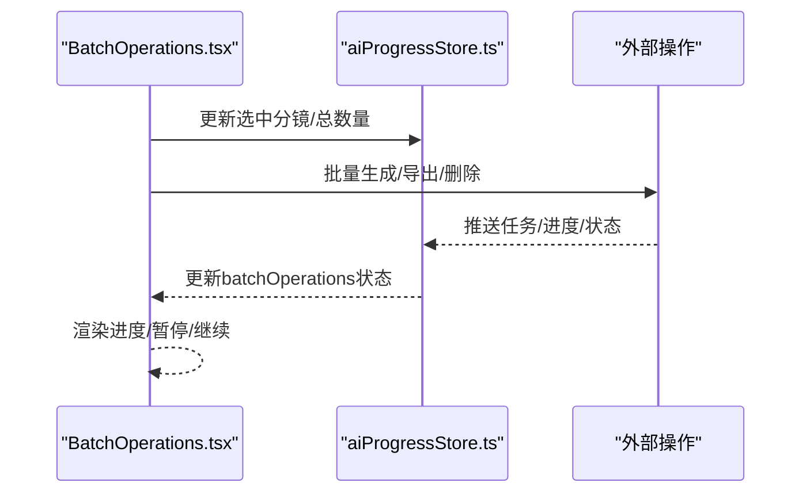
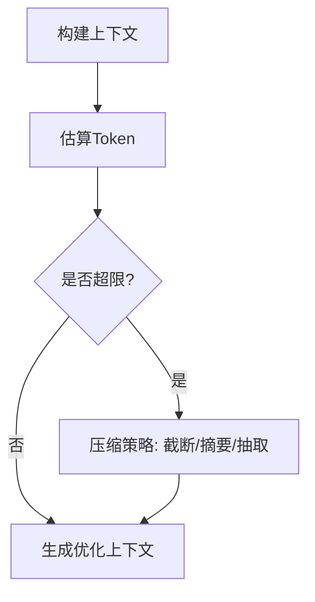
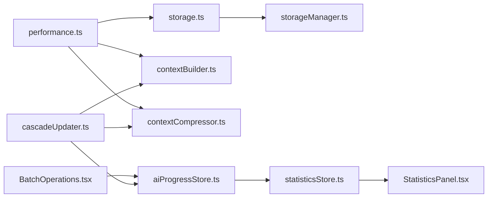

# 性能优化工具

<cite>
**本文引用的文件**
- [performance.ts](file://manga-creator/src/lib/performance.ts)
- [performance.test.ts](file://manga-creator/src/lib/performance.test.ts)
- [storage.ts](file://manga-creator/src/lib/storage.ts)
- [storageManager.ts](file://manga-creator/src/lib/storageManager.ts)
- [aiProgressStore.ts](file://manga-creator/src/stores/aiProgressStore.ts)
- [statisticsStore.ts](file://manga-creator/src/stores/statisticsStore.ts)
- [StatisticsPanel.tsx](file://manga-creator/src/components/editor/StatisticsPanel.tsx)
- [BatchOperations.tsx](file://manga-creator/src/components/editor/BatchOperations.tsx)
- [cascadeUpdater.ts](file://manga-creator/src/lib/ai/cascadeUpdater.ts)
- [contextBuilder.ts](file://manga-creator/src/lib/ai/contextBuilder.ts)
- [contextCompressor.ts](file://manga-creator/src/lib/ai/contextCompressor.ts)
</cite>

## 目录
1. [简介](#简介)
2. [项目结构](#项目结构)
3. [核心组件](#核心组件)
4. [架构总览](#架构总览)
5. [详细组件分析](#详细组件分析)
6. [依赖分析](#依赖分析)
7. [性能考量](#性能考量)
8. [故障排查指南](#故障排查指南)
9. [结论](#结论)

## 简介
本文件聚焦于项目中的“性能优化工具”能力，涵盖通用性能工具库、存储层优化、AI任务进度与统计、批量操作与性能监控等方面。通过防抖/节流、缓存、批量队列、空闲任务调度、性能标记与渲染追踪、上下文构建与压缩、存储分片与压缩、以及统计面板等机制，系统性提升交互流畅度、资源利用率与可观测性。

## 项目结构
围绕性能优化的相关模块主要分布在以下位置：
- 通用性能工具：src/lib/performance.ts
- 存储与批量优化：src/lib/storage.ts、src/lib/storageManager.ts
- AI任务进度与统计：src/stores/aiProgressStore.ts、src/stores/statisticsStore.ts、src/components/editor/StatisticsPanel.tsx
- 批量操作与进度：src/components/editor/BatchOperations.tsx
- AI上下文与压缩：src/lib/ai/cascadeUpdater.ts、src/lib/ai/contextBuilder.ts、src/lib/ai/contextCompressor.ts

图表来源
- [performance.ts](file://manga-creator/src/lib/performance.ts#L1-L270)
- [storage.ts](file://manga-creator/src/lib/storage.ts#L1-L596)
- [storageManager.ts](file://manga-creator/src/lib/storageManager.ts#L1-L363)
- [aiProgressStore.ts](file://manga-creator/src/stores/aiProgressStore.ts#L1-L669)
- [statisticsStore.ts](file://manga-creator/src/stores/statisticsStore.ts#L1-L114)
- [StatisticsPanel.tsx](file://manga-creator/src/components/editor/StatisticsPanel.tsx#L1-L408)
- [BatchOperations.tsx](file://manga-creator/src/components/editor/BatchOperations.tsx#L1-L308)
- [cascadeUpdater.ts](file://manga-creator/src/lib/ai/cascadeUpdater.ts#L1-L701)
- [contextBuilder.ts](file://manga-creator/src/lib/ai/contextBuilder.ts#L1-L312)
- [contextCompressor.ts](file://manga-creator/src/lib/ai/contextCompressor.ts#L1-L518)

章节来源
- [performance.ts](file://manga-creator/src/lib/performance.ts#L1-L270)
- [storage.ts](file://manga-creator/src/lib/storage.ts#L1-L596)
- [storageManager.ts](file://manga-creator/src/lib/storageManager.ts#L1-L363)
- [aiProgressStore.ts](file://manga-creator/src/stores/aiProgressStore.ts#L1-L669)
- [statisticsStore.ts](file://manga-creator/src/stores/statisticsStore.ts#L1-L114)
- [StatisticsPanel.tsx](file://manga-creator/src/components/editor/StatisticsPanel.tsx#L1-L408)
- [BatchOperations.tsx](file://manga-creator/src/components/editor/BatchOperations.tsx#L1-L308)
- [cascadeUpdater.ts](file://manga-creator/src/lib/ai/cascadeUpdater.ts#L1-L701)
- [contextBuilder.ts](file://manga-creator/src/lib/ai/contextBuilder.ts#L1-L312)
- [contextCompressor.ts](file://manga-creator/src/lib/ai/contextCompressor.ts#L1-L518)

## 核心组件
- 通用性能工具库：提供防抖、节流、简单缓存、批量队列、空闲任务调度、性能标记与渲染追踪。
- 存储与IO优化：本地存储防抖/批量、版本迁移、加密、备份/恢复、分片与压缩、配额与清理、完整性校验。
- AI任务与统计：统一的任务状态管理、进度追踪、统计计算、事件订阅；统计面板可视化展示。
- 批量操作：批量生成/编辑/导出/删除，结合进度与暂停/继续控制。
- AI上下文与压缩：角色/画风/世界观上下文构建；分镜历史与当前场景压缩；Token预算与限制检查；智能压缩回退策略。

章节来源
- [performance.ts](file://manga-creator/src/lib/performance.ts#L1-L270)
- [storage.ts](file://manga-creator/src/lib/storage.ts#L1-L596)
- [storageManager.ts](file://manga-creator/src/lib/storageManager.ts#L1-L363)
- [aiProgressStore.ts](file://manga-creator/src/stores/aiProgressStore.ts#L1-L669)
- [statisticsStore.ts](file://manga-creator/src/stores/statisticsStore.ts#L1-L114)
- [StatisticsPanel.tsx](file://manga-creator/src/components/editor/StatisticsPanel.tsx#L1-L408)
- [BatchOperations.tsx](file://manga-creator/src/components/editor/BatchOperations.tsx#L1-L308)
- [cascadeUpdater.ts](file://manga-creator/src/lib/ai/cascadeUpdater.ts#L1-L701)
- [contextBuilder.ts](file://manga-creator/src/lib/ai/contextBuilder.ts#L1-L312)
- [contextCompressor.ts](file://manga-creator/src/lib/ai/contextCompressor.ts#L1-L518)

## 架构总览
性能优化贯穿前端交互、数据持久化与AI生成链路：
- 交互层：使用防抖/节流降低高频事件开销；使用空闲任务调度延后非关键任务；渲染追踪辅助定位过度重渲染。
- 数据层：批量队列合并写入、防抖保存减少IO；分片与压缩突破LocalStorage容量限制；版本迁移与备份保障数据安全。
- AI链路：上下文构建与压缩控制Token预算；级联更新减少无效重算；任务进度与统计驱动性能观测。

图表来源
- [performance.ts](file://manga-creator/src/lib/performance.ts#L1-L270)
- [storage.ts](file://manga-creator/src/lib/storage.ts#L1-L596)
- [storageManager.ts](file://manga-creator/src/lib/storageManager.ts#L1-L363)
- [contextBuilder.ts](file://manga-creator/src/lib/ai/contextBuilder.ts#L1-L312)
- [contextCompressor.ts](file://manga-creator/src/lib/ai/contextCompressor.ts#L1-L518)
- [aiProgressStore.ts](file://manga-creator/src/stores/aiProgressStore.ts#L1-L669)
- [statisticsStore.ts](file://manga-creator/src/stores/statisticsStore.ts#L1-L114)

## 详细组件分析

### 通用性能工具库（performance.ts）
- 防抖：合并高频调用，延迟执行，避免重复计算与网络请求。
- 节流：固定周期内只执行一次，其余调用缓存最后参数，到期再执行。
- 简单缓存：基于Map的内存缓存，支持TTL与容量上限，自动清理过期项。
- 批量队列：按延迟与最大容量合并多次写入，降低IO压力。
- 空闲任务调度：在浏览器空闲时段执行非关键任务，避免阻塞主线程。
- 性能标记：开发环境记录mark/measure，输出耗时，便于定位瓶颈。
- 渲染追踪：开发环境统计组件渲染次数，周期性告警，帮助发现异常重渲染。

图表来源
- [performance.ts](file://manga-creator/src/lib/performance.ts#L1-L270)

章节来源
- [performance.ts](file://manga-creator/src/lib/performance.ts#L1-L270)
- [performance.test.ts](file://manga-creator/src/lib/performance.test.ts#L1-L278)

### 存储与IO优化（storage.ts、storageManager.ts）
- storage.ts
  - 项目保存防抖：300ms内多次保存合并为一次，减少写入次数。
  - 场景保存批量队列：200ms延迟、最多20个合并，按项目聚合写入。
  - 加密与解密：配置信息AES加密存储，保障敏感数据安全。
  - 版本迁移：按版本路径执行迁移，失败自动备份与恢复。
  - 备份/恢复/清理：支持备份创建、恢复、删除与孤立数据清理。
  - 导出/导入：整体数据导出与导入，便于迁移与归档。
  - 存储使用统计：估算已用空间与剩余配额。
- storageManager.ts
  - 分片存储：超Chunk大小自动分片，兼容旧版本无元数据。
  - 压缩：采用gzip压缩，支持解压与完整性校验。
  - 配额与清理：监控使用率，超过阈值清理过期数据。
  - 完整性校验与修复：检测缺失分片并移除损坏数据。

图表来源
- [storage.ts](file://manga-creator/src/lib/storage.ts#L1-L596)
- [storageManager.ts](file://manga-creator/src/lib/storageManager.ts#L1-L363)

章节来源
- [storage.ts](file://manga-creator/src/lib/storage.ts#L1-L596)
- [storageManager.ts](file://manga-creator/src/lib/storageManager.ts#L1-L363)

### AI任务进度与统计（aiProgressStore.ts、statisticsStore.ts、StatisticsPanel.tsx）
- aiProgressStore.ts
  - 任务生命周期：新增/开始/更新进度/完成/失败/取消/重试。
  - 批量生成状态：防止交叉生成，统一进度与状态管理。
  - 统计计算：基于完成任务计算成功/失败次数、平均响应时间、Token使用与成本估算。
  - 事件订阅：任务状态变更事件广播，便于组件联动。
- statisticsStore.ts
  - 项目/分镜统计：按日期范围过滤，计算项目数、分镜总数、完成数、Token估算、成本、平均时间、成功率。
  - 时间趋势：最近7日创作数量折线与柱状图数据。
- StatisticsPanel.tsx
  - 概览：项目数、分镜总数、完成率、预估费用。
  - 图表：完成状态饼图、性能指标（平均生成时间、成功率、Token使用、单次平均费用）。
  - 趋势：创作活动趋势与每日生成量。
  - 性能：响应时间分布与API调用统计，给出优化建议。

图表来源
- [statisticsStore.ts](file://manga-creator/src/stores/statisticsStore.ts#L1-L114)
- [aiProgressStore.ts](file://manga-creator/src/stores/aiProgressStore.ts#L1-L669)
- [StatisticsPanel.tsx](file://manga-creator/src/components/editor/StatisticsPanel.tsx#L1-L408)

章节来源
- [aiProgressStore.ts](file://manga-creator/src/stores/aiProgressStore.ts#L1-L669)
- [statisticsStore.ts](file://manga-creator/src/stores/statisticsStore.ts#L1-L114)
- [StatisticsPanel.tsx](file://manga-creator/src/components/editor/StatisticsPanel.tsx#L1-L408)

### 批量操作与进度（BatchOperations.tsx）
- 选择与全选：多选分镜，支持清空与一键全选。
- 批量生成：调用外部生成函数，受全局批量生成状态与进度控制。
- 批量导出/删除：弹窗选择格式，确认后执行。
- 进度与暂停：显示当前处理进度、总进度百分比、暂停/继续按钮，支持状态消息展示。

图表来源
- [BatchOperations.tsx](file://manga-creator/src/components/editor/BatchOperations.tsx#L1-L308)
- [aiProgressStore.ts](file://manga-creator/src/stores/aiProgressStore.ts#L1-L669)

章节来源
- [BatchOperations.tsx](file://manga-creator/src/components/editor/BatchOperations.tsx#L1-L308)
- [aiProgressStore.ts](file://manga-creator/src/stores/aiProgressStore.ts#L1-L669)

### AI上下文构建与压缩（cascadeUpdater.ts、contextBuilder.ts、contextCompressor.ts）
- cascadeUpdater.ts
  - 影响分析：项目设定/角色/世界观变更对分镜的影响评估，生成更新计划与优先级。
  - 级联更新：标记受影响分镜为“需要更新”，支持按优先级排序与批量清除标记。
  - 快照：创建/恢复分镜快照，便于回滚与对比。
  - AI回退：当AI分析失败时回退到规则引擎，保证稳定性。
- contextBuilder.ts
  - 角色/画风/世界观上下文构建，支持长度控制与模板填充。
  - 按Skill定制上下文，确保不同任务仅携带必要信息。
- contextCompressor.ts
  - Token估算与预算分配：项目核心信息、历史上下文、当前分镜分别估算Token。
  - 压缩策略：激进/平衡/保守三档，动态裁剪关键信息。
  - 智能压缩：情绪提取、关键元素抽取、智能摘要，失败回退到规则引擎。

图表来源
- [cascadeUpdater.ts](file://manga-creator/src/lib/ai/cascadeUpdater.ts#L1-L701)
- [contextBuilder.ts](file://manga-creator/src/lib/ai/contextBuilder.ts#L1-L312)
- [contextCompressor.ts](file://manga-creator/src/lib/ai/contextCompressor.ts#L1-L518)

章节来源
- [cascadeUpdater.ts](file://manga-creator/src/lib/ai/cascadeUpdater.ts#L1-L701)
- [contextBuilder.ts](file://manga-creator/src/lib/ai/contextBuilder.ts#L1-L312)
- [contextCompressor.ts](file://manga-creator/src/lib/ai/contextCompressor.ts#L1-L518)

## 依赖分析
- 组件耦合
  - performance.ts被storage.ts与AI上下文模块广泛使用（防抖/批量队列/空闲任务）。
  - storage.ts依赖performance.ts进行批量与防抖；storageManager.ts独立负责分片与压缩。
  - aiProgressStore.ts与statisticsStore.ts相互配合，前者提供任务与统计源数据，后者提供聚合统计。
  - StatisticsPanel.tsx依赖statisticsStore.ts与aiProgressStore.ts进行可视化。
  - BatchOperations.tsx依赖aiProgressStore.ts进行批量状态与进度控制。
  - cascadeUpdater.ts与contextBuilder.ts、contextCompressor.ts共同构成AI上下文优化链路。
- 外部依赖
  - pako用于压缩/解压（storageManager.ts）。
  - date-fns用于日期格式化（statisticsStore.ts、StatisticsPanel.tsx）。
  - recharts用于图表渲染（StatisticsPanel.tsx）。

图表来源
- [performance.ts](file://manga-creator/src/lib/performance.ts#L1-L270)
- [storage.ts](file://manga-creator/src/lib/storage.ts#L1-L596)
- [storageManager.ts](file://manga-creator/src/lib/storageManager.ts#L1-L363)
- [aiProgressStore.ts](file://manga-creator/src/stores/aiProgressStore.ts#L1-L669)
- [statisticsStore.ts](file://manga-creator/src/stores/statisticsStore.ts#L1-L114)
- [StatisticsPanel.tsx](file://manga-creator/src/components/editor/StatisticsPanel.tsx#L1-L408)
- [BatchOperations.tsx](file://manga-creator/src/components/editor/BatchOperations.tsx#L1-L308)
- [cascadeUpdater.ts](file://manga-creator/src/lib/ai/cascadeUpdater.ts#L1-L701)
- [contextBuilder.ts](file://manga-creator/src/lib/ai/contextBuilder.ts#L1-L312)
- [contextCompressor.ts](file://manga-creator/src/lib/ai/contextCompressor.ts#L1-L518)

章节来源
- [performance.ts](file://manga-creator/src/lib/performance.ts#L1-L270)
- [storage.ts](file://manga-creator/src/lib/storage.ts#L1-L596)
- [storageManager.ts](file://manga-creator/src/lib/storageManager.ts#L1-L363)
- [aiProgressStore.ts](file://manga-creator/src/stores/aiProgressStore.ts#L1-L669)
- [statisticsStore.ts](file://manga-creator/src/stores/statisticsStore.ts#L1-L114)
- [StatisticsPanel.tsx](file://manga-creator/src/components/editor/StatisticsPanel.tsx#L1-L408)
- [BatchOperations.tsx](file://manga-creator/src/components/editor/BatchOperations.tsx#L1-L308)
- [cascadeUpdater.ts](file://manga-creator/src/lib/ai/cascadeUpdater.ts#L1-L701)
- [contextBuilder.ts](file://manga-creator/src/lib/ai/contextBuilder.ts#L1-L312)
- [contextCompressor.ts](file://manga-creator/src/lib/ai/contextCompressor.ts#L1-L518)

## 性能考量
- 交互层
  - 使用防抖/节流降低高频事件（滚动、窗口尺寸、输入）带来的重渲染与计算压力。
  - 空闲任务调度将非关键任务延后，避免阻塞主线程，提升交互流畅度。
- IO层
  - 批量队列与防抖保存显著减少LocalStorage写入次数，降低磁盘IO与页面阻塞。
  - 分片与压缩突破LocalStorage容量限制，同时降低存储体积与读写开销。
  - 版本迁移与备份/恢复机制保障升级过程中的数据安全与可回退性。
- AI链路
  - 上下文压缩与Token预算控制避免超出模型限制，减少失败重试与超时。
  - 级联更新减少无效重算，优先级排序提升整体效率。
- 可观测性
  - 性能标记与渲染追踪帮助定位热点与异常重渲染。
  - 统计面板提供平均响应时间、成功率、Token使用与成本等关键指标，指导优化方向。

## 故障排查指南
- 任务长时间无响应
  - 检查AI任务统计中的平均响应时间与错误计数，定位慢请求或失败重试。
  - 查看事件订阅日志，确认任务状态变更是否正常触发。
- 存储写入异常
  - 检查批量队列flush时机与延迟设置，确认是否因队列未及时清空导致数据丢失。
  - 若出现容量不足，启用分片与压缩，并清理过期数据。
- 渲染卡顿
  - 使用渲染追踪功能查看组件渲染次数，定位过度重渲染的组件并优化其props或memo化。
- 上下文过大导致失败
  - 调整压缩策略（保守/平衡/激进），或减少历史上下文长度，确保总Token在限制内。
- 批量操作中断
  - 检查暂停/继续状态与进度百分比，确认是否因网络波动或服务端限流导致中断。

章节来源
- [aiProgressStore.ts](file://manga-creator/src/stores/aiProgressStore.ts#L1-L669)
- [statisticsStore.ts](file://manga-creator/src/stores/statisticsStore.ts#L1-L114)
- [StatisticsPanel.tsx](file://manga-creator/src/components/editor/StatisticsPanel.tsx#L1-L408)
- [storage.ts](file://manga-creator/src/lib/storage.ts#L1-L596)
- [storageManager.ts](file://manga-creator/src/lib/storageManager.ts#L1-L363)
- [performance.ts](file://manga-creator/src/lib/performance.ts#L1-L270)
- [contextCompressor.ts](file://manga-creator/src/lib/ai/contextCompressor.ts#L1-L518)

## 结论
通过通用性能工具、存储与IO优化、AI上下文与压缩、任务进度与统计、以及批量操作与可视化面板的协同，项目在交互流畅度、数据可靠性与AI生成效率方面实现了系统性的性能优化。建议持续关注统计面板指标，结合渲染追踪与性能标记，针对热点路径进一步细化优化策略。