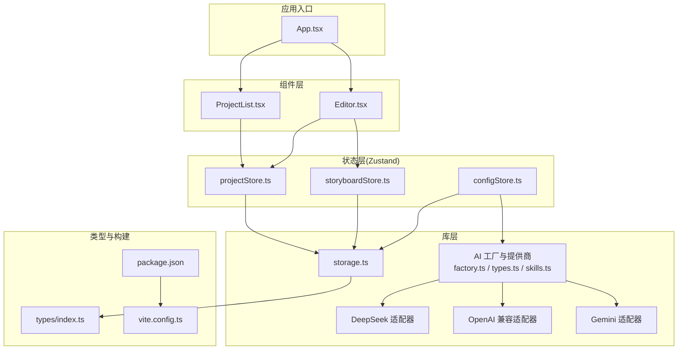
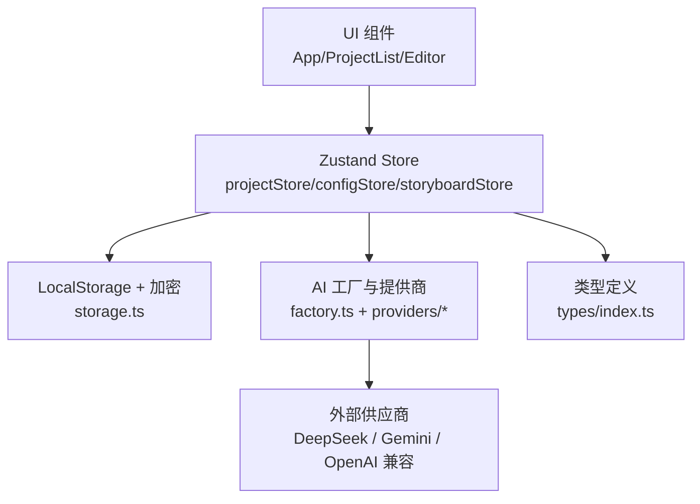
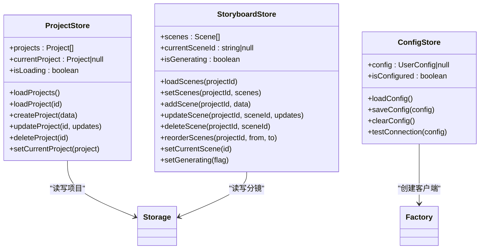
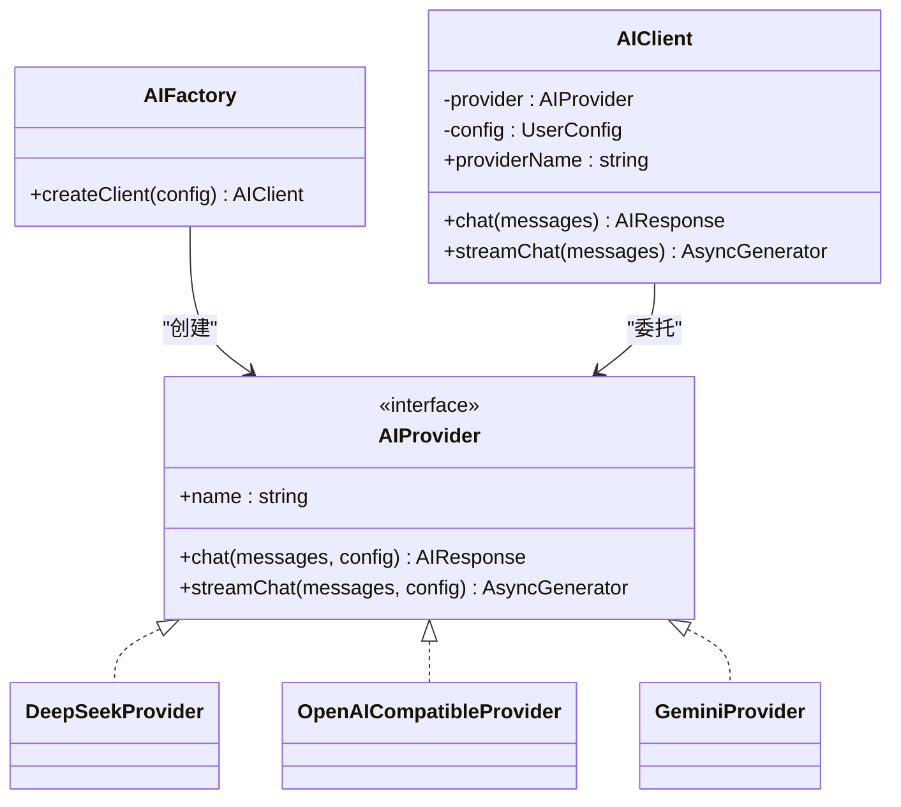
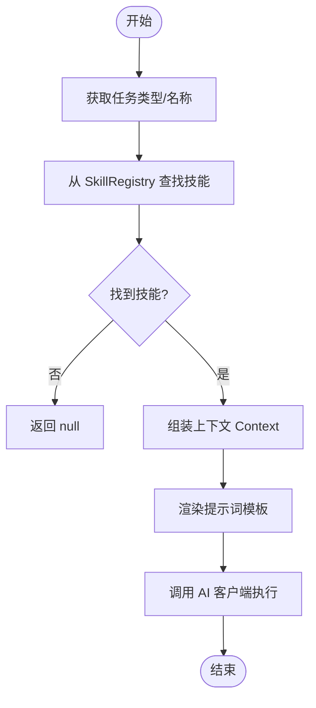
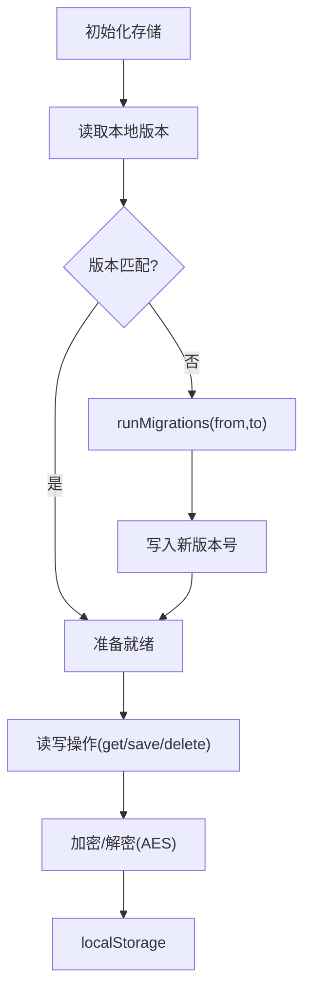
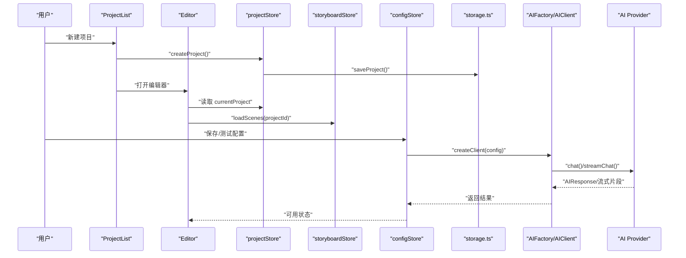
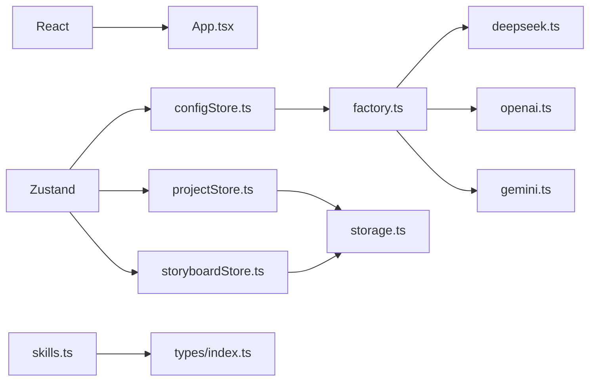

# 技术架构

<cite>
**本文引用的文件**
- [App.tsx](file://manga-creator/src/App.tsx)
- [ProjectList.tsx](file://manga-creator/src/components/ProjectList.tsx)
- [Editor.tsx](file://manga-creator/src/components/Editor.tsx)
- [projectStore.ts](file://manga-creator/src/stores/projectStore.ts)
- [configStore.ts](file://manga-creator/src/stores/configStore.ts)
- [storyboardStore.ts](file://manga-creator/src/stores/storyboardStore.ts)
- [storage.ts](file://manga-creator/src/lib/storage.ts)
- [factory.ts](file://manga-creator/src/lib/ai/factory.ts)
- [types.ts](file://manga-creator/src/lib/ai/types.ts)
- [skills.ts](file://manga-creator/src/lib/ai/skills.ts)
- [deepseek.ts](file://manga-creator/src/lib/ai/providers/deepseek.ts)
- [openai.ts](file://manga-creator/src/lib/ai/providers/openai.ts)
- [gemini.ts](file://manga-creator/src/lib/ai/providers/gemini.ts)
- [index.ts](file://manga-creator/src/types/index.ts)
- [package.json](file://manga-creator/package.json)
- [vite.config.ts](file://manga-creator/vite.config.ts)
</cite>

## 目录
1. [引言](#引言)
2. [项目结构](#项目结构)
3. [核心组件](#核心组件)
4. [架构总览](#架构总览)
5. [详细组件分析](#详细组件分析)
6. [依赖关系分析](#依赖关系分析)
7. [性能考量](#性能考量)
8. [故障排查指南](#故障排查指南)
9. [结论](#结论)
10. [附录](#附录)

## 引言
本文件面向“漫剧创作助手”的前端技术架构，围绕 React 18.3 + TypeScript 5.6 + Vite 5 的技术栈，系统性阐述以下主题：
- 基于 Zustand 的状态管理：projectStore、configStore、storyboardStore 的职责划分与协作关系
- AI 服务集成的工厂模式：通过 factory.ts 与 providers 目录下的适配器支持 DeepSeek、Gemini、OpenAI 兼容供应商
- 基于 crypto-js 的 LocalStorage 加密存储：数据持久化、版本迁移与安全策略
- Agent Skill 系统（skills.ts）的实现原理与上下文驱动
- 系统上下文图与组件交互图，帮助开发者快速把握整体技术蓝图

## 项目结构
前端采用按功能域组织的模块化结构：
- 组件层：components/ 下的 UI 组件与业务页面（如 Editor、ProjectList）
- 状态层：stores/ 下的 Zustand Store（projectStore、configStore、storyboardStore）
- 库层：lib/ 下的 AI 工厂与提供商、存储工具、通用工具
- 类型层：types/ 定义核心数据结构与接口
- 构建与依赖：package.json、vite.config.ts

图表来源
- [App.tsx](file://manga-creator/src/App.tsx#L1-L81)
- [ProjectList.tsx](file://manga-creator/src/components/ProjectList.tsx#L1-L196)
- [Editor.tsx](file://manga-creator/src/components/Editor.tsx#L1-L172)
- [projectStore.ts](file://manga-creator/src/stores/projectStore.ts#L1-L95)
- [configStore.ts](file://manga-creator/src/stores/configStore.ts#L1-L58)
- [storyboardStore.ts](file://manga-creator/src/stores/storyboardStore.ts#L1-L107)
- [storage.ts](file://manga-creator/src/lib/storage.ts#L1-L246)
- [factory.ts](file://manga-creator/src/lib/ai/factory.ts#L1-L54)
- [types.ts](file://manga-creator/src/lib/ai/types.ts#L1-L15)
- [skills.ts](file://manga-creator/src/lib/ai/skills.ts#L1-L132)
- [deepseek.ts](file://manga-creator/src/lib/ai/providers/deepseek.ts#L1-L110)
- [openai.ts](file://manga-creator/src/lib/ai/providers/openai.ts#L1-L88)
- [gemini.ts](file://manga-creator/src/lib/ai/providers/gemini.ts#L1-L138)
- [index.ts](file://manga-creator/src/types/index.ts#L1-L190)
- [package.json](file://manga-creator/package.json#L1-L62)
- [vite.config.ts](file://manga-creator/vite.config.ts#L1-L30)

章节来源
- [package.json](file://manga-creator/package.json#L1-L62)
- [vite.config.ts](file://manga-creator/vite.config.ts#L1-L30)

## 核心组件
- 应用入口与路由视图：App.tsx 负责初始化存储、加载项目与配置，并在“项目列表”和“编辑器”之间切换
- 项目管理：ProjectList.tsx 提供项目 CRUD 与打开编辑器能力；projectStore.ts 负责项目集合与当前项目的状态读写
- 编辑器工作流：Editor.tsx 根据项目工作流状态自动推进步骤，联动 storyboardStore.ts 管理分镜
- 配置与连接测试：configStore.ts 负责用户 AI 配置的读取、保存与连通性测试
- 存储与加密：storage.ts 封装 LocalStorage 的读写、加密、版本迁移与清理
- AI 工厂与提供商：factory.ts 以工厂模式创建 AI 客户端；providers 下的 DeepSeek、OpenAI 兼容、Gemini 适配器统一实现聊天与流式输出
- Agent Skill：skills.ts 定义可复用的技能模板与注册表，按任务类型与上下文驱动生成提示词

章节来源
- [App.tsx](file://manga-creator/src/App.tsx#L1-L81)
- [ProjectList.tsx](file://manga-creator/src/components/ProjectList.tsx#L1-L196)
- [Editor.tsx](file://manga-creator/src/components/Editor.tsx#L1-L172)
- [projectStore.ts](file://manga-creator/src/stores/projectStore.ts#L1-L95)
- [configStore.ts](file://manga-creator/src/stores/configStore.ts#L1-L58)
- [storyboardStore.ts](file://manga-creator/src/stores/storyboardStore.ts#L1-L107)
- [storage.ts](file://manga-creator/src/lib/storage.ts#L1-L246)
- [factory.ts](file://manga-creator/src/lib/ai/factory.ts#L1-L54)
- [skills.ts](file://manga-creator/src/lib/ai/skills.ts#L1-L132)

## 架构总览
系统采用“组件驱动 + 状态驱动 + 工厂适配 + 加密存储”的分层架构：
- 展示层：React 组件负责视图与交互
- 状态层：Zustand Store 聚合业务状态，避免跨组件复杂通信
- 服务层：AI 工厂与提供商适配器屏蔽供应商差异
- 数据层：LocalStorage + AES 加密，支持版本迁移与导出导入

图表来源
- [App.tsx](file://manga-creator/src/App.tsx#L1-L81)
- [ProjectList.tsx](file://manga-creator/src/components/ProjectList.tsx#L1-L196)
- [Editor.tsx](file://manga-creator/src/components/Editor.tsx#L1-L172)
- [projectStore.ts](file://manga-creator/src/stores/projectStore.ts#L1-L95)
- [configStore.ts](file://manga-creator/src/stores/configStore.ts#L1-L58)
- [storyboardStore.ts](file://manga-creator/src/stores/storyboardStore.ts#L1-L107)
- [storage.ts](file://manga-creator/src/lib/storage.ts#L1-L246)
- [factory.ts](file://manga-creator/src/lib/ai/factory.ts#L1-L54)
- [deepseek.ts](file://manga-creator/src/lib/ai/providers/deepseek.ts#L1-L110)
- [openai.ts](file://manga-creator/src/lib/ai/providers/openai.ts#L1-L88)
- [gemini.ts](file://manga-creator/src/lib/ai/providers/gemini.ts#L1-L138)
- [index.ts](file://manga-creator/src/types/index.ts#L1-L190)

## 详细组件分析

### 状态管理：projectStore、configStore、storyboardStore
- projectStore.ts
  - 职责：管理项目集合、当前项目、加载/创建/更新/删除项目、设置当前项目
  - 与存储：通过 storage.ts 的 getProjects/saveProject/deleteProject/getProject 实现持久化
  - 并发与一致性：本地内存状态与 LocalStorage 同步，更新时间戳确保最新性
- configStore.ts
  - 职责：管理用户 AI 配置（供应商、API Key、模型、Base URL）、加载/保存/清空配置、连通性测试
  - 连通性测试：通过 AIFactory 创建客户端并发送一条 ping 消息验证可用性
- storyboardStore.ts
  - 职责：管理分镜集合、当前分镜、加载/设置/新增/更新/删除/重排分镜、生成状态
  - 重排逻辑：更新顺序并持久化，保证分镜序号连续一致

图表来源
- [projectStore.ts](file://manga-creator/src/stores/projectStore.ts#L1-L95)
- [configStore.ts](file://manga-creator/src/stores/configStore.ts#L1-L58)
- [storyboardStore.ts](file://manga-creator/src/stores/storyboardStore.ts#L1-L107)
- [storage.ts](file://manga-creator/src/lib/storage.ts#L1-L246)
- [factory.ts](file://manga-creator/src/lib/ai/factory.ts#L1-L54)

章节来源
- [projectStore.ts](file://manga-creator/src/stores/projectStore.ts#L1-L95)
- [configStore.ts](file://manga-creator/src/stores/configStore.ts#L1-L58)
- [storyboardStore.ts](file://manga-creator/src/stores/storyboardStore.ts#L1-L107)

### AI 服务集成：工厂模式与多供应商适配
- 工厂与客户端
  - factory.ts 提供 createAIProvider 与 AIFactory.createClient，依据配置动态创建对应提供商实例
  - AIClient 封装 chat 与 streamChat，统一调用流程
- 适配器实现
  - DeepSeekProvider：标准 OpenAI 风格的 chat/completions 接口，支持 SSE 流式输出
  - OpenAICompatibleProvider：兼容 OpenAI 协议的通用适配器
  - GeminiProvider：Google Gemini 的 generateContent/streamGenerateContent 接口，处理消息格式转换与 SSE
- 类型约束
  - types.ts 定义 AIProvider/AIProviderConfig 接口，确保各适配器实现一致

图表来源
- [factory.ts](file://manga-creator/src/lib/ai/factory.ts#L1-L54)
- [types.ts](file://manga-creator/src/lib/ai/types.ts#L1-L15)
- [deepseek.ts](file://manga-creator/src/lib/ai/providers/deepseek.ts#L1-L110)
- [openai.ts](file://manga-creator/src/lib/ai/providers/openai.ts#L1-L88)
- [gemini.ts](file://manga-creator/src/lib/ai/providers/gemini.ts#L1-L138)

章节来源
- [factory.ts](file://manga-creator/src/lib/ai/factory.ts#L1-L54)
- [types.ts](file://manga-creator/src/lib/ai/types.ts#L1-L15)
- [deepseek.ts](file://manga-creator/src/lib/ai/providers/deepseek.ts#L1-L110)
- [openai.ts](file://manga-creator/src/lib/ai/providers/openai.ts#L1-L88)
- [gemini.ts](file://manga-creator/src/lib/ai/providers/gemini.ts#L1-L138)

### Agent Skill 系统：技能模板与上下文驱动
- 技能定义：skills.ts 定义多个 Skill，包含名称、描述、所需上下文、提示词模板、输出格式与最大 Token 数
- 注册表：SkillRegistry 以字符串映射技能，便于按任务类型检索
- 名称映射：getSkillByName 支持多种内部名称到注册键的映射，增强兼容性
- 上下文类型：types/index.ts 定义 ContextType 与 Context 结构，用于填充模板变量

图表来源
- [skills.ts](file://manga-creator/src/lib/ai/skills.ts#L1-L132)
- [index.ts](file://manga-creator/src/types/index.ts#L1-L190)

章节来源
- [skills.ts](file://manga-creator/src/lib/ai/skills.ts#L1-L132)
- [index.ts](file://manga-creator/src/types/index.ts#L1-L190)

### LocalStorage 加密存储：持久化、迁移与安全
- 加密与解密：storage.ts 使用 crypto-js 的 AES 对配置进行对称加密存储
- 键名规范：统一前缀 aixs_，分别管理版本、项目、分镜与配置
- 版本迁移：initStorage 读取本地版本，若不匹配则触发 runMigrations 并更新版本号
- 数据导出/导入：exportData/importData 支持全量数据备份与恢复
- 清理与统计：clearAllData 清理所有 aixs_* 键；getStorageUsage 统计占用
- 项目/分镜/配置的 CRUD：封装了 get/save/delete 等操作，保证数据一致性

图表来源
- [storage.ts](file://manga-creator/src/lib/storage.ts#L1-L246)

章节来源
- [storage.ts](file://manga-creator/src/lib/storage.ts#L1-L246)

### 组件交互：Editor 工作流与 Store 协作
- Editor.tsx 根据项目工作流状态自动切换“基础设定/分镜生成/分镜细化/导出”四个步骤，并允许点击已完成或当前步骤
- ProjectList.tsx 负责项目创建、打开与删除，创建后自动进入编辑器
- 三类 Store 协同：projectStore 提供当前项目与工作流状态；storyboardStore 管理分镜；configStore 提供 AI 配置与连通性

图表来源
- [ProjectList.tsx](file://manga-creator/src/components/ProjectList.tsx#L1-L196)
- [Editor.tsx](file://manga-creator/src/components/Editor.tsx#L1-L172)
- [projectStore.ts](file://manga-creator/src/stores/projectStore.ts#L1-L95)
- [storyboardStore.ts](file://manga-creator/src/stores/storyboardStore.ts#L1-L107)
- [configStore.ts](file://manga-creator/src/stores/configStore.ts#L1-L58)
- [storage.ts](file://manga-creator/src/lib/storage.ts#L1-L246)
- [factory.ts](file://manga-creator/src/lib/ai/factory.ts#L1-L54)
- [deepseek.ts](file://manga-creator/src/lib/ai/providers/deepseek.ts#L1-L110)
- [openai.ts](file://manga-creator/src/lib/ai/providers/openai.ts#L1-L88)
- [gemini.ts](file://manga-creator/src/lib/ai/providers/gemini.ts#L1-L138)

章节来源
- [Editor.tsx](file://manga-creator/src/components/Editor.tsx#L1-L172)
- [ProjectList.tsx](file://manga-creator/src/components/ProjectList.tsx#L1-L196)
- [projectStore.ts](file://manga-creator/src/stores/projectStore.ts#L1-L95)
- [storyboardStore.ts](file://manga-creator/src/stores/storyboardStore.ts#L1-L107)
- [configStore.ts](file://manga-creator/src/stores/configStore.ts#L1-L58)

## 依赖关系分析
- 外部依赖
  - React 18.3、Zustand 4.x、crypto-js 4.x、TailwindCSS 生态组件库
- 内部耦合
  - 组件依赖 Store；Store 依赖 storage.ts；AI Store 依赖 AIFactory；skills.ts 依赖 types 中的 Context/Skill 定义
- 循环依赖
  - 未发现循环依赖；工厂与提供商通过接口解耦

图表来源
- [package.json](file://manga-creator/package.json#L1-L62)
- [App.tsx](file://manga-creator/src/App.tsx#L1-L81)
- [projectStore.ts](file://manga-creator/src/stores/projectStore.ts#L1-L95)
- [configStore.ts](file://manga-creator/src/stores/configStore.ts#L1-L58)
- [storyboardStore.ts](file://manga-creator/src/stores/storyboardStore.ts#L1-L107)
- [factory.ts](file://manga-creator/src/lib/ai/factory.ts#L1-L54)
- [deepseek.ts](file://manga-creator/src/lib/ai/providers/deepseek.ts#L1-L110)
- [openai.ts](file://manga-creator/src/lib/ai/providers/openai.ts#L1-L88)
- [gemini.ts](file://manga-creator/src/lib/ai/providers/gemini.ts#L1-L138)
- [storage.ts](file://manga-creator/src/lib/storage.ts#L1-L246)
- [skills.ts](file://manga-creator/src/lib/ai/skills.ts#L1-L132)
- [index.ts](file://manga-creator/src/types/index.ts#L1-L190)

章节来源
- [package.json](file://manga-creator/package.json#L1-L62)

## 性能考量
- 状态粒度：Zustand Store 将项目、配置、分镜分离，避免单一 Store 过大导致不必要的重渲染
- 流式输出：AI 提供商均支持流式输出，提升交互体验；前端应合理节流/合并增量渲染
- 存储策略：LocalStorage 适合轻量数据；当项目/分镜增多时，建议评估 IndexedDB 或服务端同步
- 加密成本：AES 加解密在小数据量下开销可忽略；批量导入/导出时注意异步与进度反馈
- 构建优化：Vite 已启用 React 插件与别名解析，开发/生产构建路径清晰

## 故障排查指南
- 配置不可用
  - 现象：连通性测试失败
  - 排查：检查 provider、apiKey、model、baseURL 是否完整；查看 AIFactory.createClient 抛错与提供商网络错误
- 分镜重排异常
  - 现象：分镜顺序错乱
  - 排查：确认 reorderScenes 后是否重新编号并持久化；检查 saveScenes 调用链
- 项目删除遗留数据
  - 现象：删除项目后分镜未清理
  - 排查：确认 deleteProject 是否同时移除对应分镜键
- 导入失败
  - 现象：导入报错
  - 排查：检查导入 JSON 结构与键名；确认 importData 的遍历与写入逻辑
- 流式输出中断
  - 现象：SSE 解析异常
  - 排查：检查提供商返回格式与行分割；确认异常分支抛出与前端捕获

章节来源
- [configStore.ts](file://manga-creator/src/stores/configStore.ts#L1-L58)
- [storyboardStore.ts](file://manga-creator/src/stores/storyboardStore.ts#L1-L107)
- [storage.ts](file://manga-creator/src/lib/storage.ts#L1-L246)
- [deepseek.ts](file://manga-creator/src/lib/ai/providers/deepseek.ts#L1-L110)
- [openai.ts](file://manga-creator/src/lib/ai/providers/openai.ts#L1-L88)
- [gemini.ts](file://manga-creator/src/lib/ai/providers/gemini.ts#L1-L138)

## 结论
该架构以 React + Zustand 为核心，结合工厂模式的 AI 适配器与 LocalStorage 加密存储，形成了清晰、可扩展且易维护的前端技术栈。通过 Skill 系统与工作流状态机，系统实现了从项目设定到分镜细化再到提示词导出的完整创作闭环。后续可在存储层引入更稳健的数据方案、完善版本迁移策略，并扩展更多 AI 供应商适配器。

## 附录
- 构建与运行
  - 开发：npm run dev
  - 构建：npm run build
  - 测试：npm run test
  - 预览：npm run preview
- 别名与插件
  - @ 指向 src 目录
  - React 插件、TailwindCSS、Vitest 配置

章节来源
- [package.json](file://manga-creator/package.json#L1-L62)
- [vite.config.ts](file://manga-creator/vite.config.ts#L1-L30)