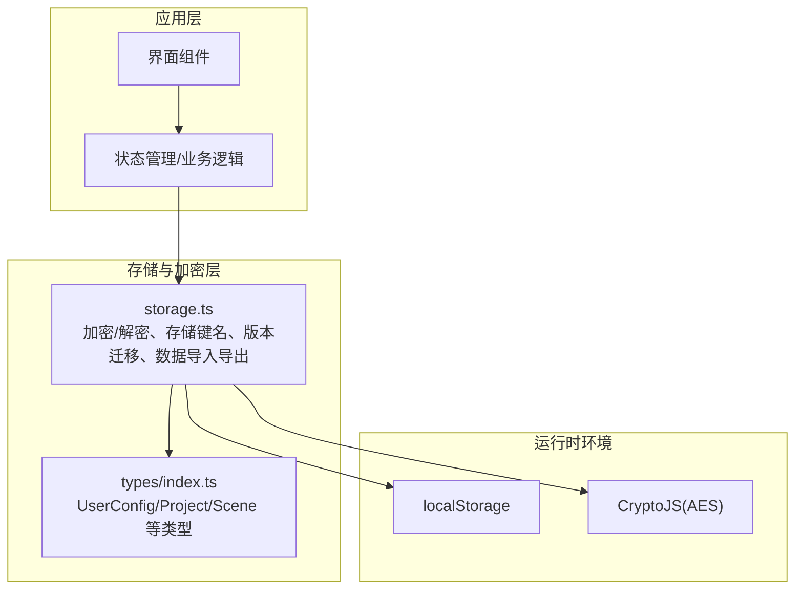
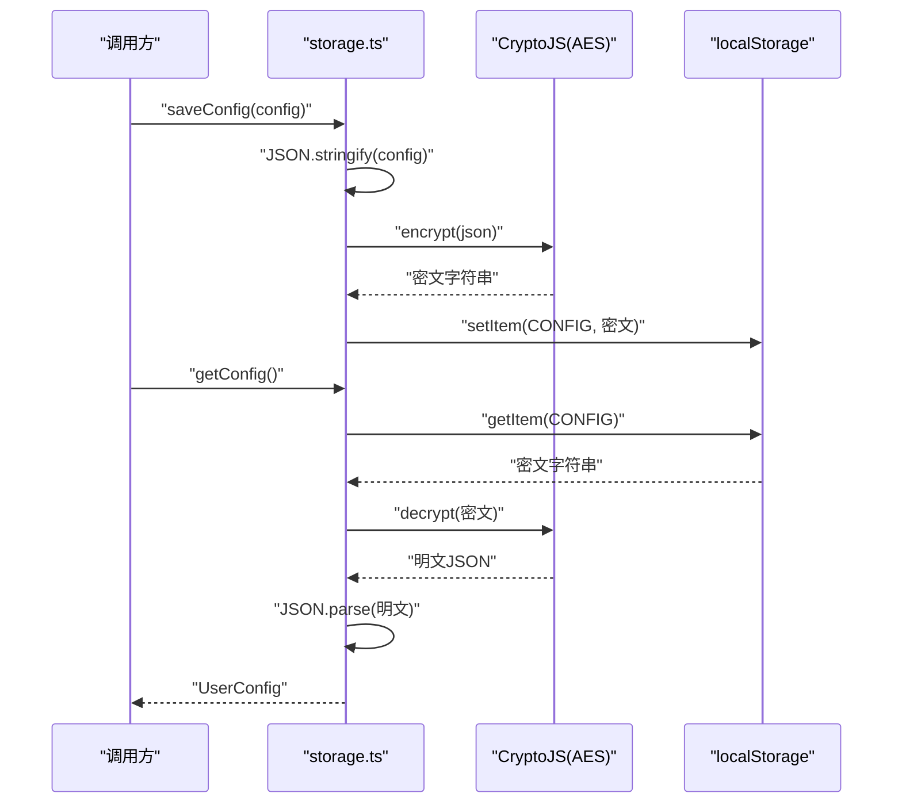
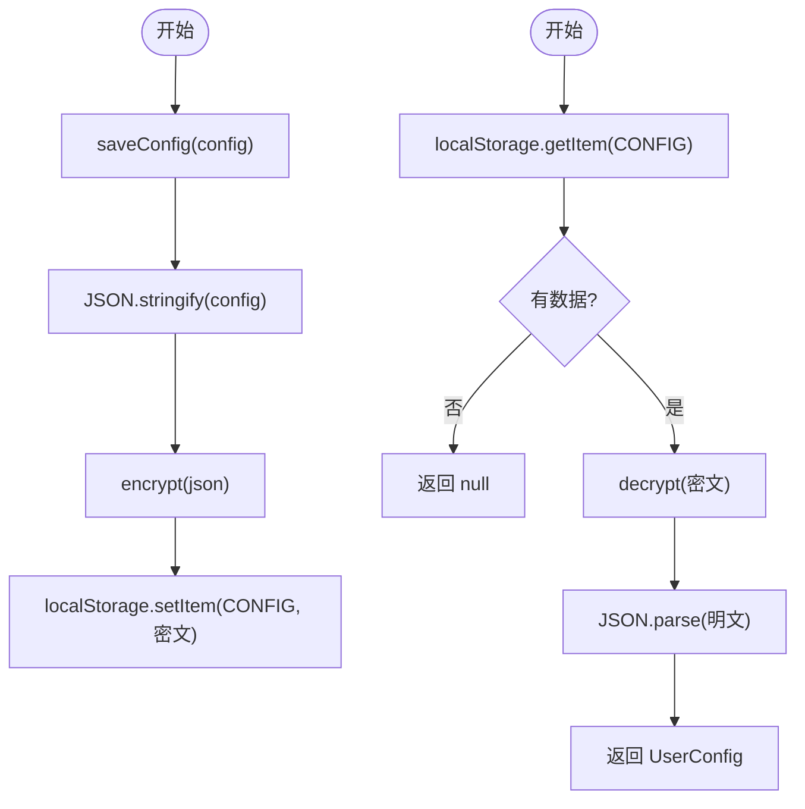
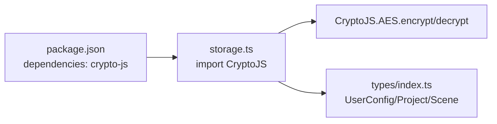

# 加密存储机制

<cite>
**本文引用的文件**
- [storage.ts](file://manga-creator/src/lib/storage.ts)
- [storage.test.ts](file://manga-creator/src/lib/storage.test.ts)
- [index.ts](file://manga-creator/src/types/index.ts)
- [package.json](file://manga-creator/package.json)
</cite>

## 目录
1. [简介](#简介)
2. [项目结构](#项目结构)
3. [核心组件](#核心组件)
4. [架构总览](#架构总览)
5. [详细组件分析](#详细组件分析)
6. [依赖分析](#依赖分析)
7. [性能考虑](#性能考虑)
8. [故障排查指南](#故障排查指南)
9. [结论](#结论)
10. [附录](#附录)

## 简介
本文件围绕项目中的加密存储模块进行系统化技术文档整理，重点解析基于 CryptoJS 的 AES 加密实现，说明 ENCRYPTION_KEY 常量的设计考量与安全建议，阐述 encrypt/decrypt 函数如何对敏感数据（如用户配置中的 API Key）进行加密与解密处理。文档还解释了为何选择 AES 加密算法以及其在保护本地存储机密信息方面的优势，并通过时序图与数据流图展示从明文到密文的转换过程。最后提供异常处理机制说明、密钥管理最佳实践与潜在安全风险缓解策略。

## 项目结构
加密存储相关的核心文件位于前端应用的 lib 目录中，配合类型定义与测试用例共同构成完整的功能闭环：
- 存储与加密实现：manga-creator/src/lib/storage.ts
- 类型定义：manga-creator/src/types/index.ts
- 测试用例：manga-creator/src/lib/storage.test.ts
- 依赖声明：manga-creator/package.json



图表来源
- [storage.ts](file://manga-creator/src/lib/storage.ts#L1-L246)
- [index.ts](file://manga-creator/src/types/index.ts#L1-L190)

章节来源
- [storage.ts](file://manga-creator/src/lib/storage.ts#L1-L246)
- [index.ts](file://manga-creator/src/types/index.ts#L1-L190)
- [package.json](file://manga-creator/package.json#L1-L62)

## 核心组件
- 加密工具函数
  - encrypt(data: string): string 将明文字符串加密为密文字符串
  - decrypt(encryptedData: string): string 将密文字符串解密为明文字符串
- 常量与键名
  - ENCRYPTION_KEY: 固定密钥，用于 AES 对称加密
  - KEYS: 存储键名常量集合，包含版本、项目、场景、配置等键
- 版本迁移
  - STORAGE_VERSION: 当前存储版本
  - initStorage(): 初始化并迁移版本
- API 配置存取
  - getConfig(): 从 localStorage 读取并解密配置
  - saveConfig(config: UserConfig): 将配置序列化后加密再写入
  - clearConfig(): 清除配置项
- 其他存储操作
  - getProjects/saveProject/deleteProject/getProject
  - getScenes/saveScenes/saveScene/getScene
  - exportData/importData/clearAllData/getStorageUsage

章节来源
- [storage.ts](file://manga-creator/src/lib/storage.ts#L1-L246)
- [index.ts](file://manga-creator/src/types/index.ts#L80-L120)

## 架构总览
以下类图展示了加密存储模块的关键类与方法之间的关系，以及与类型定义的关联。

```mermaid
classDiagram
class StorageModule {
+encrypt(data : string) string
+decrypt(encryptedData : string) string
+initStorage() void
+getConfig() UserConfig?
+saveConfig(config : UserConfig) void
+clearConfig() void
+getProjects() Project[]
+saveProject(project : Project) void
+deleteProject(projectId : string) void
+getProject(projectId : string) Project?
+getScenes(projectId : string) Scene[]
+saveScenes(projectId : string, scenes : Scene[]) void
+saveScene(projectId : string, scene : Scene) void
+getScene(projectId : string, sceneId : string) Scene?
+exportData() string
+importData(jsonData : string) void
+clearAllData() void
+getStorageUsage() {used,total}
}
class UserConfig {
+provider : string
+apiKey : string
+baseURL? : string
+model : string
}
class Project {
+id : string
+title : string
+summary : string
+style : string
+protagonist : string
+workflowState : string
+currentSceneOrder : number
+createdAt : string
+updatedAt : string
}
class Scene {
+id : string
+projectId : string
+order : number
+summary : string
+sceneDescription : string
+actionDescription : string
+shotPrompt : string
+status : string
+notes : string
}
StorageModule --> UserConfig : "读取/保存"
StorageModule --> Project : "读取/保存"
StorageModule --> Scene : "读取/保存"
```

图表来源
- [storage.ts](file://manga-creator/src/lib/storage.ts#L1-L246)
- [index.ts](file://manga-creator/src/types/index.ts#L80-L120)

## 详细组件分析

### 加密工具与密钥设计
- ENCRYPTION_KEY 常量
  - 设计定位：作为 AES 对称加密的固定密钥，贯穿整个存储模块的加密/解密流程
  - 安全性考量
    - 优点：实现简单、性能稳定、兼容性强
    - 风险：固定密钥在源码中可见，若应用被逆向或源码泄露，密钥可能被提取；不支持多租户隔离
  - 建议改进
    - 使用运行时派生密钥（例如结合设备指纹、随机盐、PBKDF2/HKDF）
    - 引入 per-user 或 per-session 的动态密钥
    - 在 CI/CD 中避免硬编码密钥，采用环境变量注入与密钥轮换策略
    - 结合硬件安全模块(HSM)或浏览器安全 API(如 SubtleCrypto)以提升抗逆向能力

章节来源
- [storage.ts](file://manga-creator/src/lib/storage.ts#L1-L20)

### encrypt/decrypt 实现与流程
- 加密流程
  - 输入：明文字符串
  - 处理：使用 CryptoJS.AES.encrypt，密钥来自 ENCRYPTION_KEY
  - 输出：密文字符串（序列化后的字符串）
- 解密流程
  - 输入：密文字符串
  - 处理：CryptoJS.AES.decrypt，密钥来自 ENCRYPTION_KEY，再以 UTF-8 编码转回明文
  - 输出：明文字符串
- 异常处理
  - 解密无效数据时返回空字符串，避免抛出异常导致 UI 中断
  - 存储读取/写入失败时捕获错误并记录日志，部分操作抛出统一错误消息



图表来源
- [storage.ts](file://manga-creator/src/lib/storage.ts#L150-L173)

章节来源
- [storage.ts](file://manga-creator/src/lib/storage.ts#L11-L18)
- [storage.ts](file://manga-creator/src/lib/storage.ts#L150-L173)

### API 配置的加密存取
- 保存配置
  - 将 UserConfig 序列化为 JSON 字符串
  - 调用 encrypt 进行加密
  - 写入 localStorage 的 CONFIG 键
- 读取配置
  - 从 localStorage 读取 CONFIG
  - 调用 decrypt 解密
  - 反序列化为 UserConfig
- 异常处理
  - 无配置返回 null
  - 配置损坏或读取失败返回 null 并记录错误
  - 清除配置使用 removeItem



图表来源
- [storage.ts](file://manga-creator/src/lib/storage.ts#L150-L173)
- [index.ts](file://manga-creator/src/types/index.ts#L80-L120)

章节来源
- [storage.ts](file://manga-creator/src/lib/storage.ts#L150-L173)
- [index.ts](file://manga-creator/src/types/index.ts#L80-L120)

### 存储键名与版本管理
- KEYS 常量
  - VERSION: 存储当前应用版本
  - PROJECTS: 存储项目列表
  - CONFIG: 存储加密后的用户配置
  - scenesFor(projectId): 动态生成项目分镜键
- 版本迁移
  - initStorage 检查版本并执行迁移逻辑（当前为占位）
  - 设置 STORAGE_VERSION 为 1.0.0

章节来源
- [storage.ts](file://manga-creator/src/lib/storage.ts#L23-L46)

### 项目与分镜的存储
- 项目 CRUD
  - getProjects/getProject/saveProject/deleteProject
  - 保存时自动更新 updatedAt
- 分镜 CRUD
  - getScenes/saveScenes/saveScene/getScene
  - 删除项目时同步删除对应分镜
- 导入导出
  - exportData 导出项目与分镜
  - importData 导入项目与分镜
- 清理与统计
  - clearAllData 清除所有 aixs_ 前缀数据并保留版本号
  - getStorageUsage 统计 aixs_ 前缀数据占用

章节来源
- [storage.ts](file://manga-creator/src/lib/storage.ts#L52-L145)
- [storage.ts](file://manga-creator/src/lib/storage.ts#L183-L246)

## 依赖分析
- 外部依赖
  - crypto-js: 提供 AES 加密/解密能力
  - 类型定义：@types/crypto-js
- 内部依赖
  - types/index.ts: 定义 UserConfig/Project/Scene 等类型
  - storage.ts: 使用类型进行编译期约束



图表来源
- [package.json](file://manga-creator/package.json#L15-L33)
- [storage.ts](file://manga-creator/src/lib/storage.ts#L1-L20)
- [index.ts](file://manga-creator/src/types/index.ts#L80-L120)

章节来源
- [package.json](file://manga-creator/package.json#L15-L33)
- [storage.ts](file://manga-creator/src/lib/storage.ts#L1-L20)
- [index.ts](file://manga-creator/src/types/index.ts#L80-L120)

## 性能考虑
- 加密开销
  - AES 属于对称加密，CPU 开销较低，适合本地存储场景
  - 对大文本（如长 JSON）进行序列化后再加密，注意内存占用
- I/O 影响
  - localStorage 为同步 API，频繁读写可能阻塞主线程
  - 建议批量写入、合并更新，避免高频小粒度写入
- 字符集与编码
  - 明文经 UTF-8 编码，确保多语言字符（中文、emoji）正确处理
- 版本与迁移
  - 版本迁移逻辑当前为空实现，未来扩展时需避免复杂迁移造成性能问题

## 故障排查指南
- 加密/解密异常
  - 现象：解密无效数据返回空字符串
  - 排查：确认输入是否为有效密文；检查 ENCRYPTION_KEY 是否一致
- 配置读取失败
  - 现象：getConfig 返回 null
  - 排查：确认 CONFIG 键是否存在；检查 localStorage 是否可用；查看错误日志
- 保存失败
  - 现象：saveConfig 抛出“配置保存失败”
  - 排查：检查 localStorage 写入权限与容量；确认 JSON 序列化是否成功
- 数据损坏
  - 现象：getProjects/getScenes 返回空数组或 null
  - 排查：确认对应键的数据格式是否为合法 JSON；必要时使用 clearAllData 清理后重试

章节来源
- [storage.ts](file://manga-creator/src/lib/storage.ts#L52-L122)
- [storage.ts](file://manga-creator/src/lib/storage.ts#L150-L173)
- [storage.test.ts](file://manga-creator/src/lib/storage.test.ts#L131-L137)

## 结论
该模块通过 CryptoJS 的 AES 对称加密实现了对用户配置等敏感数据的本地存储保护。ENCRYPTION_KEY 简化了实现但带来固定密钥的安全风险。建议在生产环境中引入动态密钥、密钥轮换与更安全的密钥派生方案，并优化 I/O 与异常处理以提升稳定性与用户体验。

## 附录

### AES 加密算法选择与优势
- 选择 AES 的原因
  - 对称加密，加解密速度快，适合本地存储
  - 标准化程度高，生态成熟，易于集成
  - 适用于小到中等规模数据的机密性保护
- 在保护 API Key 等机密信息方面的优势
  - 有效防止明文泄露
  - 降低因 localStorage 泄露导致的凭证滥用风险
- 需要注意的局限
  - 固定密钥易被逆向提取
  - 不提供完整性校验（可结合 HMAC）

### 密钥管理最佳实践与风险缓解
- 最佳实践
  - 使用运行时派生密钥（如 PBKDF2/HKDF），结合随机盐
  - 引入 per-user/per-session 密钥，避免全局共享
  - 在 CI/CD 中禁用硬编码密钥，采用环境变量与密钥轮换
  - 使用浏览器安全 API（如 SubtleCrypto）或 HSM 提升抗逆向能力
- 风险缓解
  - 定期轮换 ENCRYPTION_KEY
  - 对历史数据进行迁移与重新加密
  - 限制 localStorage 使用范围，仅存放必要机密
  - 增加完整性校验（如 HMAC）以检测篡改

### 实际调用示例（路径参考）
- 加密/解密调用
  - 路径参考：[encrypt/decrypt](file://manga-creator/src/lib/storage.ts#L11-L18)
- 保存/读取配置
  - 路径参考：[saveConfig/getConfig](file://manga-creator/src/lib/storage.ts#L164-L173)
- 项目/分镜 CRUD
  - 路径参考：[getProjects/saveProject/deleteProject](file://manga-creator/src/lib/storage.ts#L52-L98)，[getScenes/saveScenes/saveScene](file://manga-creator/src/lib/storage.ts#L104-L145)
- 导入/导出与清理
  - 路径参考：[exportData/importData/clearAllData](file://manga-creator/src/lib/storage.ts#L183-L232)