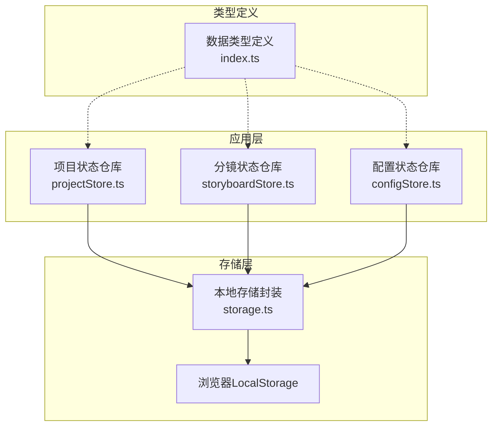
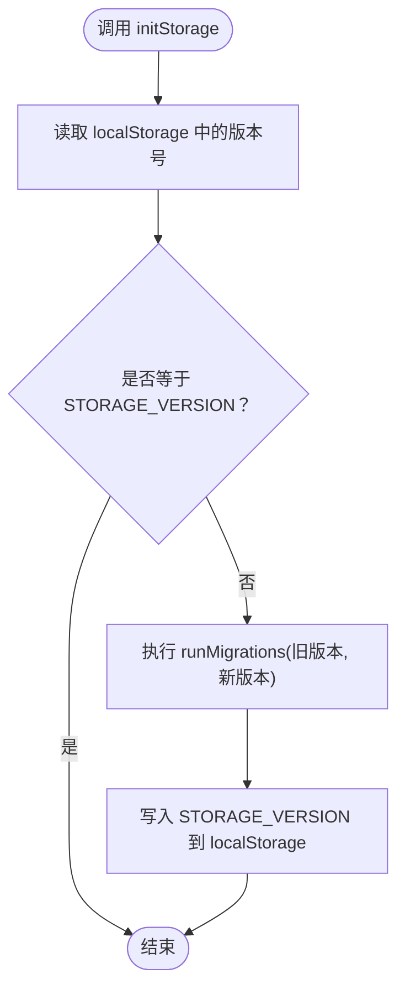
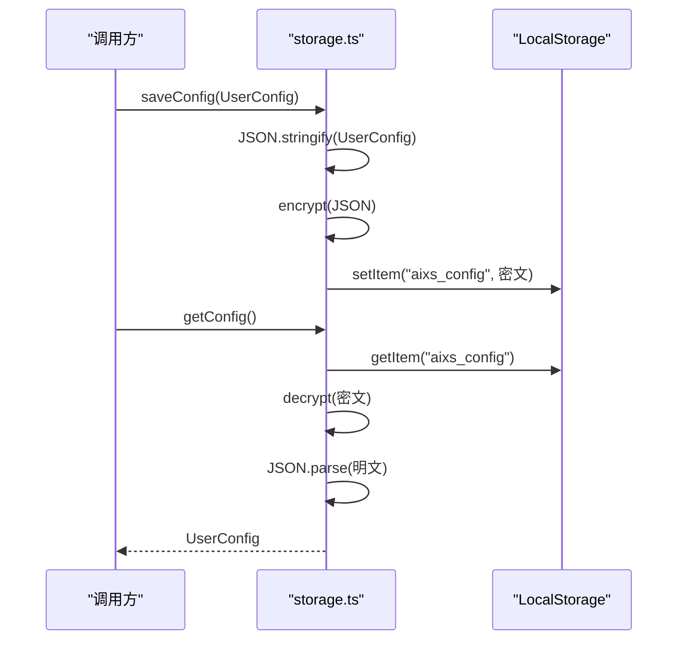
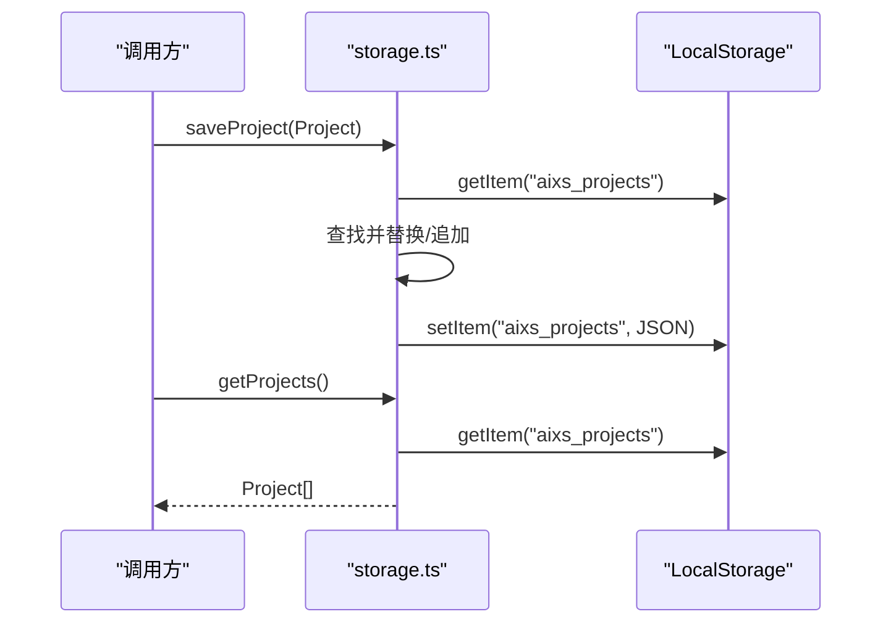
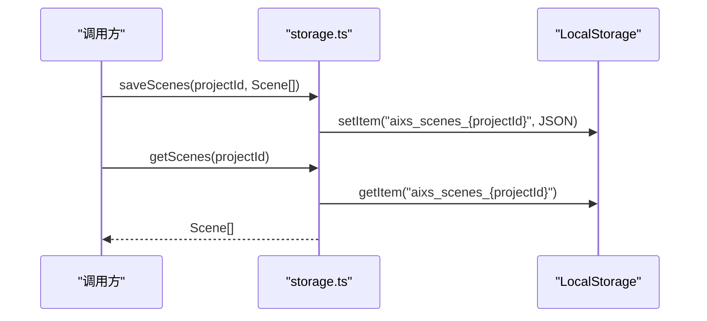
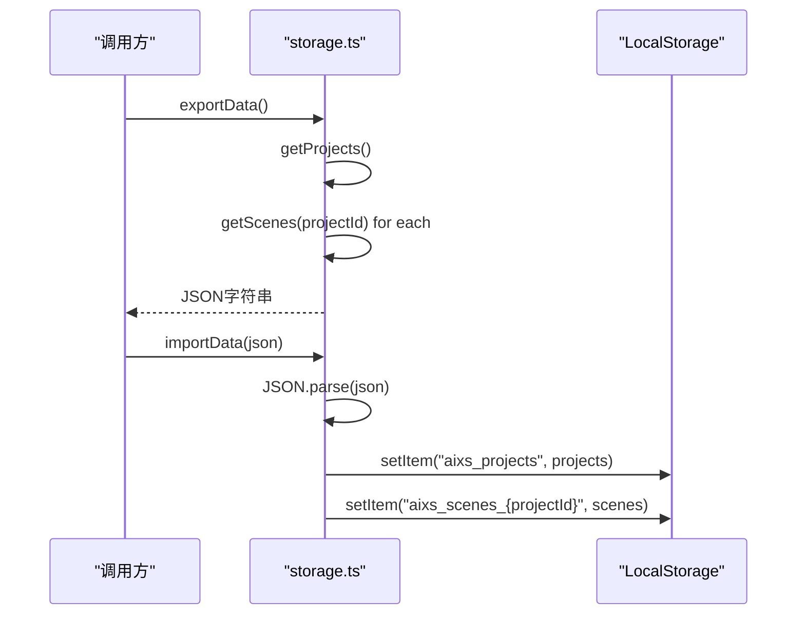
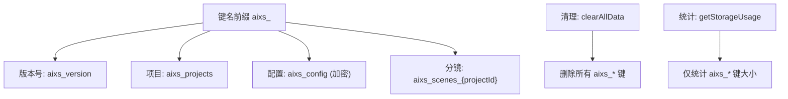
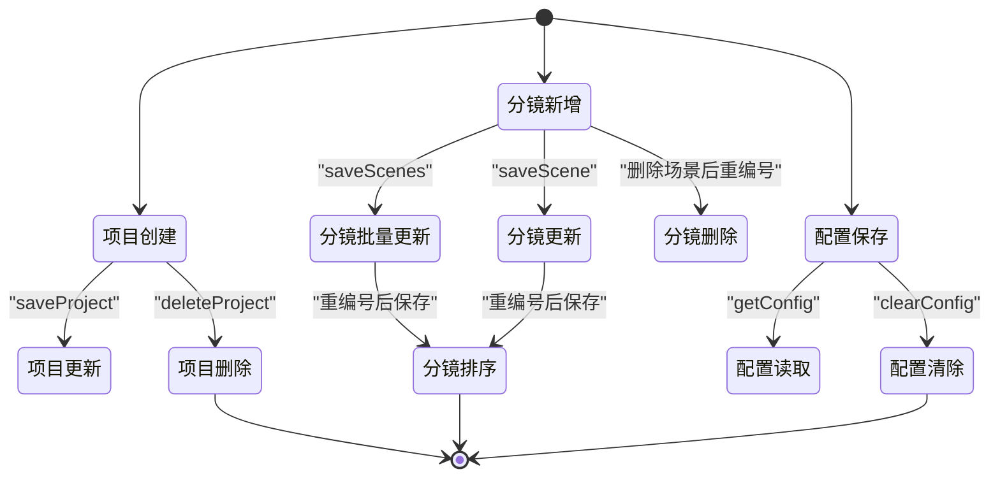
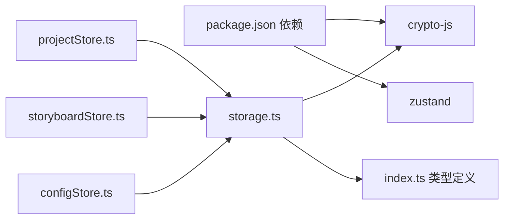

# 数据存储

<cite>
**本文引用的文件**
- [storage.ts](file://manga-creator/src/lib/storage.ts)
- [storage.test.ts](file://manga-creator/src/lib/storage.test.ts)
- [projectStore.ts](file://manga-creator/src/stores/projectStore.ts)
- [storyboardStore.ts](file://manga-creator/src/stores/storyboardStore.ts)
- [configStore.ts](file://manga-creator/src/stores/configStore.ts)
- [index.ts](file://manga-creator/src/types/index.ts)
- [package.json](file://manga-creator/package.json)
</cite>

## 目录
1. [简介](#简介)
2. [项目结构](#项目结构)
3. [核心组件](#核心组件)
4. [架构总览](#架构总览)
5. [详细组件分析](#详细组件分析)
6. [依赖关系分析](#依赖关系分析)
7. [性能考量](#性能考量)
8. [故障排查指南](#故障排查指南)
9. [结论](#结论)
10. [附录](#附录)

## 简介
本文件系统性解析基于加密LocalStorage的本地持久化方案，重点围绕以下目标展开：
- storage.ts中的initStorage版本控制机制与STORAGE_VERSION的设计思路
- encrypt/decrypt函数使用CryptoJS对API Key等敏感信息进行AES加密存储的安全设计
- getProjects/saveProject等方法如何管理项目元数据；getScenes/saveScenes如何按项目ID隔离分镜数据
- getConfig/saveConfig为何对配置对象整体加密以保障安全性
- exportData/importData数据导入导出功能的实现逻辑，支持用户迁移创作成果
- 提供存储键名空间设计图与数据生命周期流程图，帮助开发者理解本地数据组织结构

## 项目结构
该存储层位于manga-creator/src/lib/storage.ts，采用LocalStorage作为唯一持久化介质，并通过Zustand Store在应用层调用这些存储接口。类型定义位于manga-creator/src/types/index.ts，明确项目、分镜与用户配置的数据结构。



图表来源
- [projectStore.ts](file://manga-creator/src/stores/projectStore.ts#L1-L95)
- [storyboardStore.ts](file://manga-creator/src/stores/storyboardStore.ts#L1-L107)
- [configStore.ts](file://manga-creator/src/stores/configStore.ts#L1-L58)
- [storage.ts](file://manga-creator/src/lib/storage.ts#L1-L246)
- [index.ts](file://manga-creator/src/types/index.ts#L1-L190)

章节来源
- [storage.ts](file://manga-creator/src/lib/storage.ts#L1-L246)
- [projectStore.ts](file://manga-creator/src/stores/projectStore.ts#L1-L95)
- [storyboardStore.ts](file://manga-creator/src/stores/storyboardStore.ts#L1-L107)
- [configStore.ts](file://manga-creator/src/stores/configStore.ts#L1-L58)
- [index.ts](file://manga-creator/src/types/index.ts#L1-L190)

## 核心组件
- 加密工具：encrypt/decrypt使用CryptoJS AES对字符串进行对称加密/解密
- 键名空间：统一前缀aixs_，包括版本号、项目列表、配置、以及按项目ID隔离的分镜集合
- 版本控制：initStorage负责读取当前版本并触发迁移逻辑，最终写回STORAGE_VERSION
- 项目管理：getProjects/getProject/saveProject/deleteProject
- 分镜管理：getScenes/saveScenes/getScene/saveScene
- 配置管理：getConfig/saveConfig/clearConfig
- 导入导出：exportData/importData
- 维护工具：clearAllData/getStorageUsage

章节来源
- [storage.ts](file://manga-creator/src/lib/storage.ts#L1-L246)

## 架构总览
下面的类图展示了存储封装与类型之间的关系，以及Zustand Store如何通过storage.ts暴露的方法进行数据读写。

```mermaid
classDiagram
class StorageAPI {
+encrypt(data) string
+decrypt(encrypted) string
+initStorage() void
+getProjects() Project[]
+getProject(id) Project
+saveProject(project) void
+deleteProject(id) void
+getScenes(projectId) Scene[]
+saveScenes(projectId, scenes) void
+getScene(projectId, sceneId) Scene
+saveScene(projectId, scene) void
+getConfig() UserConfig
+saveConfig(config) void
+clearConfig() void
+exportData() string
+importData(json) void
+clearAllData() void
+getStorageUsage() {used,total}
}
class ProjectStore {
+loadProjects()
+loadProject(id)
+createProject(data)
+updateProject(id, updates)
+deleteProject(id)
+setCurrentProject(project)
}
class StoryboardStore {
+loadScenes(projectId)
+setScenes(projectId, scenes)
+addScene(projectId, data)
+updateScene(projectId, sceneId, updates)
+deleteScene(projectId, sceneId)
+reorderScenes(projectId, from, to)
+setCurrentScene(id)
+setGenerating(flag)
}
class ConfigStore {
+loadConfig()
+saveConfig(config)
+clearConfig()
+testConnection(config) Promise<bool>
}
class Project {
+id
+title
+summary
+style
+protagonist
+workflowState
+currentSceneOrder
+createdAt
+updatedAt
}
class Scene {
+id
+projectId
+order
+summary
+sceneDescription
+actionDescription
+shotPrompt
+contextSummary
+status
+notes
}
class UserConfig {
+provider
+apiKey
+baseURL
+model
}
ProjectStore --> StorageAPI : "调用"
StoryboardStore --> StorageAPI : "调用"
ConfigStore --> StorageAPI : "调用"
StorageAPI --> Project : "读写"
StorageAPI --> Scene : "读写"
StorageAPI --> UserConfig : "读写"
```

图表来源
- [storage.ts](file://manga-creator/src/lib/storage.ts#L1-L246)
- [projectStore.ts](file://manga-creator/src/stores/projectStore.ts#L1-L95)
- [storyboardStore.ts](file://manga-creator/src/stores/storyboardStore.ts#L1-L107)
- [configStore.ts](file://manga-creator/src/stores/configStore.ts#L1-L58)
- [index.ts](file://manga-creator/src/types/index.ts#L1-L190)

## 详细组件分析

### 版本控制与迁移机制（initStorage）
- 设计要点
  - 使用STORAGE_VERSION常量标识当前存储格式版本
  - initStorage读取localStorage中的版本号，若与STORAGE_VERSION不一致则触发runMigrations，随后写回最新版本
  - 当前runMigrations为占位实现，便于后续扩展具体迁移逻辑
- 迁移流程
  - 读取旧版本号
  - 执行迁移函数（预留位置）
  - 写入新版本号
- 测试验证
  - 首次初始化应设置版本号
  - 重复初始化应保持版本号不变
  - 从旧版本迁移时应打印迁移日志并更新版本号



图表来源
- [storage.ts](file://manga-creator/src/lib/storage.ts#L35-L46)
- [storage.test.ts](file://manga-creator/src/lib/storage.test.ts#L143-L165)

章节来源
- [storage.ts](file://manga-creator/src/lib/storage.ts#L35-L46)
- [storage.test.ts](file://manga-creator/src/lib/storage.test.ts#L143-L165)

### 加密与安全设计（encrypt/decrypt）
- 设计要点
  - 使用CryptoJS AES对字符串进行对称加密/解密
  - ENCRYPTION_KEY为固定密钥，用于保护敏感字段（如API Key）
  - 对配置对象整体序列化后加密存储，避免明文泄露
- 安全考虑
  - 密钥硬编码于源码，生产环境建议通过更安全的方式注入或替换
  - 加密仅针对配置对象，项目与分镜仍以明文JSON存储
- 测试覆盖
  - 正向加解密、空字符串、特殊字符、中文、emoji、超长字符串
  - 解密无效数据返回空字符串，避免崩溃



图表来源
- [storage.ts](file://manga-creator/src/lib/storage.ts#L11-L18)
- [storage.ts](file://manga-creator/src/lib/storage.ts#L151-L173)
- [storage.test.ts](file://manga-creator/src/lib/storage.test.ts#L171-L239)

章节来源
- [storage.ts](file://manga-creator/src/lib/storage.ts#L11-L18)
- [storage.ts](file://manga-creator/src/lib/storage.ts#L151-L173)
- [storage.test.ts](file://manga-creator/src/lib/storage.test.ts#L171-L239)

### 项目元数据管理（getProjects/saveProject）
- 设计要点
  - 项目列表以数组形式存储于KEYS.PROJECTS键下
  - saveProject支持新增与更新（根据id查找），更新时自动写入当前时间戳
  - deleteProject会同步删除对应项目的分镜数据
- 并发与一致性
  - 读写均基于localStorage的原子性操作，避免跨标签页冲突
- 测试覆盖
  - 新增、更新、批量保存、删除、空列表、数据损坏恢复



图表来源
- [storage.ts](file://manga-creator/src/lib/storage.ts#L52-L98)
- [storage.test.ts](file://manga-creator/src/lib/storage.test.ts#L245-L372)

章节来源
- [storage.ts](file://manga-creator/src/lib/storage.ts#L52-L98)
- [storage.test.ts](file://manga-creator/src/lib/storage.test.ts#L245-L372)

### 分镜数据隔离与管理（getScenes/saveScenes）
- 设计要点
  - 通过KEYS.scenesFor(projectId)动态生成键名，实现按项目ID隔离
  - saveScenes直接覆盖该项目的所有分镜；saveScene在当前分镜列表中定位并更新
  - 不同项目间分镜互不干扰
- 编排与重编号
  - StoryboardStore在批量更新时会对场景顺序进行重编号，确保order连续且递增
- 测试覆盖
  - 单个/批量保存、更新、删除、重排序、空列表、数据损坏恢复



图表来源
- [storage.ts](file://manga-creator/src/lib/storage.ts#L104-L145)
- [storyboardStore.ts](file://manga-creator/src/stores/storyboardStore.ts#L31-L40)

章节来源
- [storage.ts](file://manga-creator/src/lib/storage.ts#L104-L145)
- [storyboardStore.ts](file://manga-creator/src/stores/storyboardStore.ts#L31-L40)
- [storage.test.ts](file://manga-creator/src/lib/storage.test.ts#L378-L511)

### 配置对象整体加密（getConfig/saveConfig）
- 设计要点
  - 配置对象整体序列化后加密存储，读取时先解密再反序列化
  - 支持多种AI供应商类型及可选baseURL字段
- 安全边界
  - 仅对配置对象加密，不改变项目与分镜的明文存储策略
- 测试覆盖
  - 基本读写、包含baseURL的配置、无配置返回null、配置损坏返回null、清除配置

章节来源
- [storage.ts](file://manga-creator/src/lib/storage.ts#L151-L173)
- [storage.test.ts](file://manga-creator/src/lib/storage.test.ts#L171-L239)
- [index.ts](file://manga-creator/src/types/index.ts#L82-L91)

### 导入导出与数据迁移（exportData/importData）
- 设计要点
  - exportData收集当前版本、项目列表与每个项目的全部分镜，输出为JSON字符串
  - importData解析JSON并分别写入项目与分镜键，实现跨设备/跨会话迁移
- 行为约束
  - 导入无效JSON会抛出“数据导入失败”的错误
  - 导入空对象不会主动清空现有数据，但会覆盖已存在键
- 测试覆盖
  - 空数据导出、项目与分镜导出、导入后一致性校验、导入无效数据抛错



图表来源
- [storage.ts](file://manga-creator/src/lib/storage.ts#L183-L218)
- [storage.test.ts](file://manga-creator/src/lib/storage.test.ts#L517-L690)

章节来源
- [storage.ts](file://manga-creator/src/lib/storage.ts#L183-L218)
- [storage.test.ts](file://manga-creator/src/lib/storage.test.ts#L517-L690)

### 存储键名空间设计
- 命名规范
  - 所有键名以aixs_为前缀，便于统一清理与统计
  - 版本号键：aixs_version
  - 项目列表键：aixs_projects
  - 配置键：aixs_config（加密存储）
  - 分镜键：aixs_scenes_{projectId}
- 清理策略
  - clearAllData遍历localStorage，仅删除以aixs_开头的键，保留其他数据
  - getStorageUsage仅统计aixs_前缀键占用字节数



图表来源
- [storage.ts](file://manga-creator/src/lib/storage.ts#L24-L30)
- [storage.ts](file://manga-creator/src/lib/storage.ts#L224-L246)

章节来源
- [storage.ts](file://manga-creator/src/lib/storage.ts#L24-L30)
- [storage.ts](file://manga-creator/src/lib/storage.ts#L224-L246)

### 数据生命周期流程图
- 项目生命周期
  - 创建：生成唯一id与时间戳，保存到项目列表
  - 更新：按id查找并替换，更新时间戳
  - 删除：从项目列表移除，并删除对应分镜键
- 分镜生命周期
  - 新增/更新：在当前项目分镜列表中定位并替换
  - 批量更新：覆盖整个项目分镜集合
  - 排序：重新编号并保存
- 配置生命周期
  - 保存：序列化后加密存储
  - 读取：解密后反序列化
  - 清除：删除配置键



图表来源
- [storage.ts](file://manga-creator/src/lib/storage.ts#L52-L98)
- [storage.ts](file://manga-creator/src/lib/storage.ts#L104-L145)
- [storage.ts](file://manga-creator/src/lib/storage.ts#L151-L173)
- [storyboardStore.ts](file://manga-creator/src/stores/storyboardStore.ts#L31-L40)

章节来源
- [storage.ts](file://manga-creator/src/lib/storage.ts#L52-L98)
- [storage.ts](file://manga-creator/src/lib/storage.ts#L104-L145)
- [storage.ts](file://manga-creator/src/lib/storage.ts#L151-L173)
- [storyboardStore.ts](file://manga-creator/src/stores/storyboardStore.ts#L31-L40)

## 依赖关系分析
- 外部依赖
  - crypto-js：提供AES对称加密能力
  - zustand：应用层状态管理，调用storage.ts提供的方法
- 内部依赖
  - 类型定义index.ts为存储封装提供强类型支撑
  - 三个Store通过storage.ts桥接应用逻辑与本地存储



图表来源
- [package.json](file://manga-creator/package.json#L15-L33)
- [projectStore.ts](file://manga-creator/src/stores/projectStore.ts#L1-L95)
- [storyboardStore.ts](file://manga-creator/src/stores/storyboardStore.ts#L1-L107)
- [configStore.ts](file://manga-creator/src/stores/configStore.ts#L1-L58)
- [storage.ts](file://manga-creator/src/lib/storage.ts#L1-L246)
- [index.ts](file://manga-creator/src/types/index.ts#L1-L190)

章节来源
- [package.json](file://manga-creator/package.json#L15-L33)
- [projectStore.ts](file://manga-creator/src/stores/projectStore.ts#L1-L95)
- [storyboardStore.ts](file://manga-creator/src/stores/storyboardStore.ts#L1-L107)
- [configStore.ts](file://manga-creator/src/stores/configStore.ts#L1-L58)
- [storage.ts](file://manga-creator/src/lib/storage.ts#L1-L246)
- [index.ts](file://manga-creator/src/types/index.ts#L1-L190)

## 性能考量
- 存储容量
  - getStorageUsage假设LocalStorage上限为约5MB，仅统计aixs_前缀键大小
  - 建议控制项目与分镜数量，避免接近上限导致写入失败
- 写入开销
  - saveProject/saveScene/saveScenes均为整表覆盖式写入，复杂度O(n)
  - 批量更新saveScenes适合一次性写入，减少多次序列化/反序列化成本
- 加密成本
  - encrypt/decrypt为CPU密集操作，建议仅对敏感配置使用
  - 可在应用层对频繁读写的场景做内存缓存，降低重复加解密次数

[本节为通用性能讨论，不直接分析具体文件]

## 故障排查指南
- 配置读取失败
  - 现象：getConfig返回null
  - 可能原因：未保存配置、存储损坏、解密失败
  - 处理：clearConfig后重新保存，或检查存储中aixs_config内容
- 项目/分镜读取为空
  - 现象：getProjects/getScenes返回空数组
  - 可能原因：键不存在或JSON损坏
  - 处理：检查对应键是否存在，必要时通过exportData/importData恢复
- 导入失败
  - 现象：importData抛出“数据导入失败”
  - 可能原因：传入JSON无效
  - 处理：确认导出文件格式正确，或重新导出
- 清理后版本号丢失
  - 现象：clearAllData后版本号被重置
  - 处理：clearAllData会保留版本号，确保后续initStorage正常运行

章节来源
- [storage.test.ts](file://manga-creator/src/lib/storage.test.ts#L198-L239)
- [storage.test.ts](file://manga-creator/src/lib/storage.test.ts#L344-L351)
- [storage.test.ts](file://manga-creator/src/lib/storage.test.ts#L465-L472)
- [storage.test.ts](file://manga-creator/src/lib/storage.test.ts#L604-L607)
- [storage.ts](file://manga-creator/src/lib/storage.ts#L224-L246)

## 结论
该存储方案以LocalStorage为核心，结合CryptoJS实现对敏感配置的整体加密，通过统一的键名前缀与版本控制机制，提供了清晰的数据组织与迁移路径。项目与分镜采用明文JSON存储，配合Zustand Store在应用层完成业务编排。整体设计简洁可靠，具备良好的可测试性与可扩展性，为后续引入更复杂的迁移策略与安全加固提供了基础。

[本节为总结性内容，不直接分析具体文件]

## 附录
- 关键API一览
  - 加密工具：encrypt/decrypt
  - 版本控制：initStorage
  - 项目：getProjects/getProject/saveProject/deleteProject
  - 分镜：getScenes/saveScenes/getScene/saveScene
  - 配置：getConfig/saveConfig/clearConfig
  - 导入导出：exportData/importData
  - 维护：clearAllData/getStorageUsage

章节来源
- [storage.ts](file://manga-creator/src/lib/storage.ts#L1-L246)