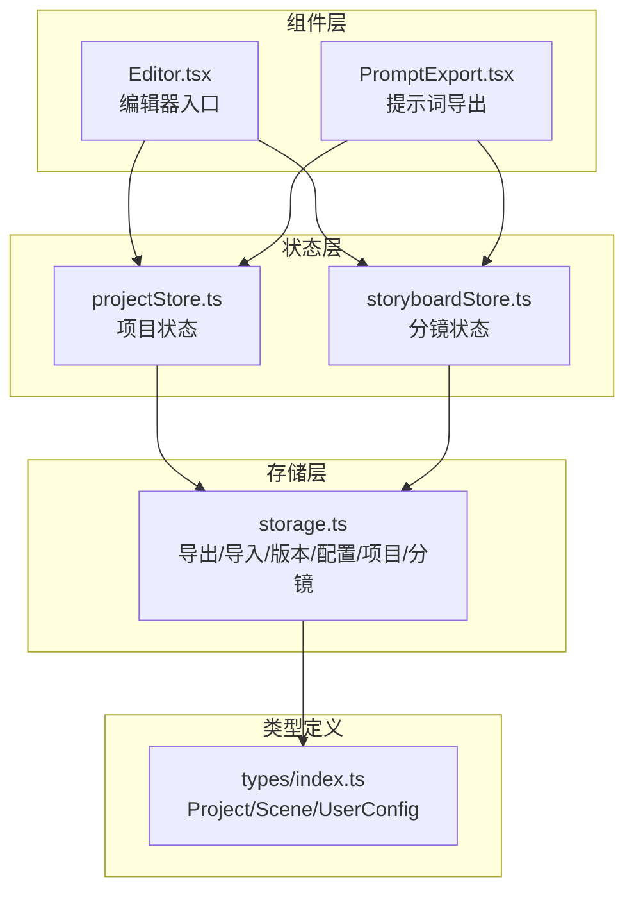
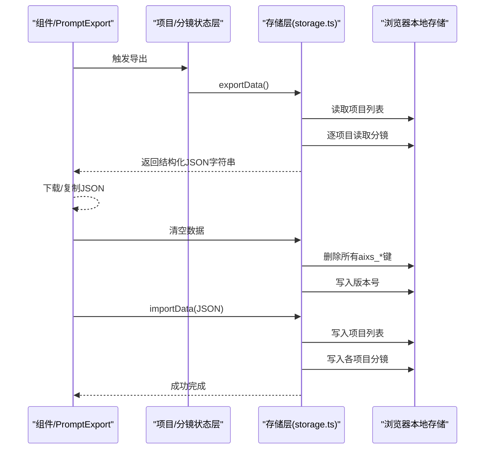
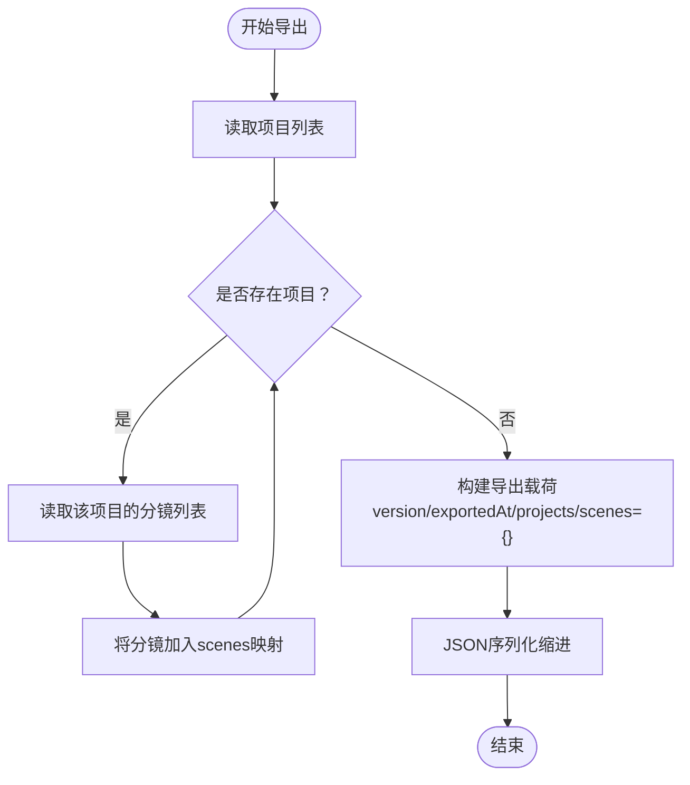
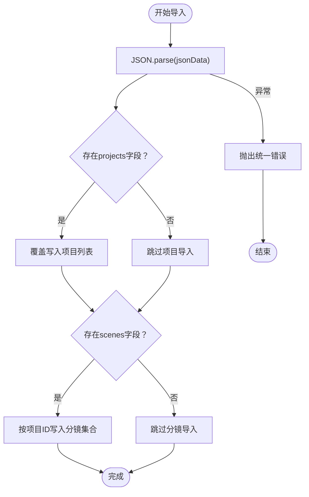
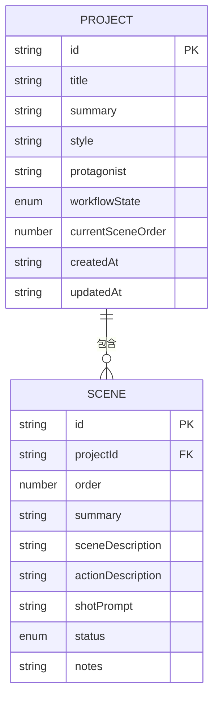
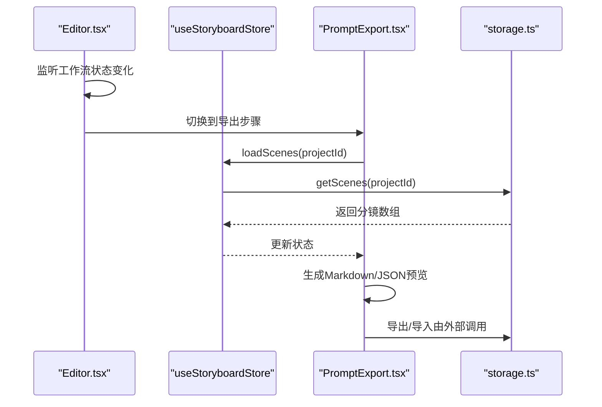
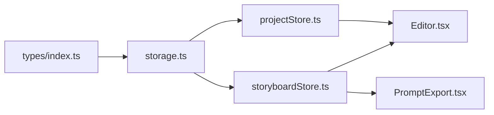

# 数据导入导出

<cite>
**本文引用的文件**
- [storage.ts](file://manga-creator/src/lib/storage.ts)
- [storage.test.ts](file://manga-creator/src/lib/storage.test.ts)
- [storyboardStore.ts](file://manga-creator/src/stores/storyboardStore.ts)
- [projectStore.ts](file://manga-creator/src/stores/projectStore.ts)
- [types/index.ts](file://manga-creator/src/types/index.ts)
- [Editor.tsx](file://manga-creator/src/components/Editor.tsx)
- [PromptExport.tsx](file://manga-creator/src/components/editor/PromptExport.tsx)
</cite>

## 目录
1. [简介](#简介)
2. [项目结构](#项目结构)
3. [核心组件](#核心组件)
4. [架构总览](#架构总览)
5. [详细组件分析](#详细组件分析)
6. [依赖关系分析](#依赖关系分析)
7. [性能考量](#性能考量)
8. [故障排查指南](#故障排查指南)
9. [结论](#结论)
10. [附录](#附录)

## 简介
本文件系统性阐述项目的数据导入导出能力，重点围绕以下目标：
- 解释 exportData 如何整合项目元数据与分镜数据，生成包含版本信息与导出时间戳的结构化 JSON 输出。
- 解析 importData 的反序列化流程与数据验证机制，确保导入数据的完整性与兼容性。
- 描述在跨设备迁移创作成果等数据迁移场景中的实际应用方式。
- 提供导出文件的结构示例与 Schema 定义，明确字段含义与约束。
- 说明错误处理策略，以应对损坏或格式错误的导入数据。

## 项目结构
与数据导入导出直接相关的模块分布如下：
- 存储层：负责本地持久化、版本管理、配置加密、项目与分镜的增删改查，以及导入导出的实现。
- 状态层：通过 zustand store 将 UI 与存储层连接，驱动项目与分镜的加载与更新。
- 类型定义：统一项目与分镜的数据结构，保证导出/导入一致性。
- 组件层：编辑器与提示词导出组件，展示导出结果并支持下载。

图表来源
- [storage.ts](file://manga-creator/src/lib/storage.ts#L183-L218)
- [projectStore.ts](file://manga-creator/src/stores/projectStore.ts#L1-L95)
- [storyboardStore.ts](file://manga-creator/src/stores/storyboardStore.ts#L1-L107)
- [types/index.ts](file://manga-creator/src/types/index.ts#L42-L76)
- [Editor.tsx](file://manga-creator/src/components/Editor.tsx#L1-L172)
- [PromptExport.tsx](file://manga-creator/src/components/editor/PromptExport.tsx#L1-L269)

章节来源
- [storage.ts](file://manga-creator/src/lib/storage.ts#L1-L246)
- [projectStore.ts](file://manga-creator/src/stores/projectStore.ts#L1-L95)
- [storyboardStore.ts](file://manga-creator/src/stores/storyboardStore.ts#L1-L107)
- [types/index.ts](file://manga-creator/src/types/index.ts#L42-L76)
- [Editor.tsx](file://manga-creator/src/components/Editor.tsx#L1-L172)
- [PromptExport.tsx](file://manga-creator/src/components/editor/PromptExport.tsx#L1-L269)

## 核心组件
- 导出函数 exportData
  - 功能：聚合当前所有项目与其对应的分镜集合，附加版本号与导出时间戳，输出结构化 JSON 字符串。
  - 关键点：遍历项目列表，按项目 ID 收集其分镜；最终以缩进格式化输出，便于阅读与调试。
- 导入函数 importData
  - 功能：接收结构化 JSON 字符串，反序列化后写入本地存储；支持仅导入项目或仅导入分镜。
  - 关键点：对输入进行 JSON 解析，捕获异常并抛出统一错误；覆盖式写入，避免部分字段缺失导致的数据不一致。
- 存储初始化与版本迁移
  - 功能：记录并维护存储版本，必要时触发迁移钩子；首次运行即写入版本号。
- 配置加密与解密
  - 功能：对用户 API 配置进行对称加密存储，读取时解密；异常情况下返回空值并记录日志。
- 项目与分镜 CRUD
  - 功能：提供项目与分镜的查询、保存、删除等操作，保障数据一致性与边界条件处理。

章节来源
- [storage.ts](file://manga-creator/src/lib/storage.ts#L183-L218)
- [storage.ts](file://manga-creator/src/lib/storage.ts#L40-L46)
- [storage.ts](file://manga-creator/src/lib/storage.ts#L147-L178)

## 架构总览
下面的序列图展示了“导出-清空-导入”的往返流程，体现数据迁移场景下的端到端路径。

图表来源
- [PromptExport.tsx](file://manga-creator/src/components/editor/PromptExport.tsx#L1-L269)
- [storage.ts](file://manga-creator/src/lib/storage.ts#L183-L218)
- [storage.ts](file://manga-creator/src/lib/storage.ts#L224-L232)

## 详细组件分析

### 导出流程分析（exportData）
- 输入：无显式参数，内部从本地存储读取项目与分镜。
- 处理：
  - 读取项目列表；
  - 针对每个项目，读取其分镜集合并归档至 scenes 映射；
  - 写入版本号与导出时间戳。
- 输出：结构化 JSON 字符串，包含 projects、scenes、version、exportedAt 四个顶层字段。
- 错误处理：导出过程未显式 try/catch，但内部读取项目与分镜时已具备容错（读取失败返回空数组/空对象），因此导出整体健壮。

图表来源
- [storage.ts](file://manga-creator/src/lib/storage.ts#L183-L197)

章节来源
- [storage.ts](file://manga-creator/src/lib/storage.ts#L183-L197)

### 导入流程分析（importData）
- 输入：结构化 JSON 字符串。
- 处理：
  - JSON.parse 反序列化；
  - 若存在 projects 字段，则覆盖写入项目列表；
  - 若存在 scenes 字段，则按项目 ID 写入对应分镜集合。
- 错误处理：捕获解析异常并抛出统一错误，避免静默失败；覆盖式写入可能改变现有数据，请谨慎使用。

图表来源
- [storage.ts](file://manga-creator/src/lib/storage.ts#L199-L218)

章节来源
- [storage.ts](file://manga-creator/src/lib/storage.ts#L199-L218)
- [storage.test.ts](file://manga-creator/src/lib/storage.test.ts#L517-L607)

### 数据模型与 Schema 定义
- 顶层结构
  - version: 字符串，版本号（例如 "1.0.0"）。
  - exportedAt: ISO 时间戳字符串，导出时间。
  - projects: 数组，元素为 Project 对象。
  - scenes: 对象，键为项目 ID，值为该项目的 Scene 数组。
- Project 字段
  - id: 字符串，唯一标识。
  - title: 字符串，项目标题。
  - summary: 字符串，项目概要。
  - style: 字符串，风格标签。
  - protagonist: 字符串，主角标签。
  - workflowState: 枚举之一，工作流状态。
  - currentSceneOrder: 数字，当前分镜序号。
  - createdAt/updatedAt: ISO 时间戳字符串。
- Scene 字段
  - id: 字符串，唯一标识。
  - projectId: 字符串，所属项目 ID。
  - order: 数字，顺序。
  - summary: 字符串，分镜概要。
  - sceneDescription: 字符串，场景描述。
  - actionDescription: 字符串，动作描述。
  - shotPrompt: 字符串，镜头提示词。
  - status: 枚举之一，分镜状态。
  - notes: 字符串，备注。
  - contextSummary: 可选对象，包含 mood/keyElement/transition 等上下文摘要字段。

图表来源
- [types/index.ts](file://manga-creator/src/types/index.ts#L42-L76)

章节来源
- [types/index.ts](file://manga-creator/src/types/index.ts#L42-L76)

### 导入导出在组件中的集成
- 编辑器组件根据工作流状态切换到导出步骤，驱动提示词导出组件渲染。
- 提示词导出组件负责：
  - 从状态层加载分镜；
  - 生成 Markdown 或 JSON 预览；
  - 支持复制到剪贴板与下载文件（.md/.json/.txt）。

图表来源
- [Editor.tsx](file://manga-creator/src/components/Editor.tsx#L1-L172)
- [PromptExport.tsx](file://manga-creator/src/components/editor/PromptExport.tsx#L1-L269)
- [storyboardStore.ts](file://manga-creator/src/stores/storyboardStore.ts#L1-L107)
- [storage.ts](file://manga-creator/src/lib/storage.ts#L104-L145)

章节来源
- [Editor.tsx](file://manga-creator/src/components/Editor.tsx#L1-L172)
- [PromptExport.tsx](file://manga-creator/src/components/editor/PromptExport.tsx#L1-L269)
- [storyboardStore.ts](file://manga-creator/src/stores/storyboardStore.ts#L1-L107)

## 依赖关系分析
- 存储层依赖类型定义，确保项目与分镜结构一致。
- 状态层依赖存储层，提供 CRUD 能力给组件层。
- 组件层依赖状态层，形成 UI-状态-存储的三层联动。

图表来源
- [types/index.ts](file://manga-creator/src/types/index.ts#L42-L76)
- [storage.ts](file://manga-creator/src/lib/storage.ts#L1-L246)
- [projectStore.ts](file://manga-creator/src/stores/projectStore.ts#L1-L95)
- [storyboardStore.ts](file://manga-creator/src/stores/storyboardStore.ts#L1-L107)
- [Editor.tsx](file://manga-creator/src/components/Editor.tsx#L1-L172)
- [PromptExport.tsx](file://manga-creator/src/components/editor/PromptExport.tsx#L1-L269)

章节来源
- [types/index.ts](file://manga-creator/src/types/index.ts#L42-L76)
- [storage.ts](file://manga-creator/src/lib/storage.ts#L1-L246)
- [projectStore.ts](file://manga-creator/src/stores/projectStore.ts#L1-L95)
- [storyboardStore.ts](file://manga-creator/src/stores/storyboardStore.ts#L1-L107)
- [Editor.tsx](file://manga-creator/src/components/Editor.tsx#L1-L172)
- [PromptExport.tsx](file://manga-creator/src/components/editor/PromptExport.tsx#L1-L269)

## 性能考量
- 导出复杂度：O(P + ΣS_p)，其中 P 为项目数，S_p 为项目 p 的分镜数；导出时对每个项目执行一次分镜读取。
- 导入复杂度：O(P + ΣS_p)，覆盖写入项目列表与分镜集合；若数据量较大，建议在后台线程或分批处理。
- 存储容量：本地存储容量有限，建议定期清理与压缩；提供存储使用统计接口用于监控。
- 加密开销：配置采用对称加密，加解密成本较低；注意密钥管理与安全性。

[本节为通用性能讨论，无需列出章节来源]

## 故障排查指南
- 导入失败
  - 现象：传入非法 JSON 字符串导致解析异常。
  - 处理：importData 捕获异常并抛出统一错误；请检查 JSON 格式与字段完整性。
  - 参考：[storage.ts](file://manga-creator/src/lib/storage.ts#L199-L218)、[storage.test.ts](file://manga-creator/src/lib/storage.test.ts#L604-L607)
- 项目/分镜损坏
  - 现象：本地存储中项目或分镜数据为非法 JSON。
  - 处理：读取时捕获异常并返回空数组/空对象，避免中断；可使用清理功能重置数据。
  - 参考：[storage.ts](file://manga-creator/src/lib/storage.ts#L52-L61)、[storage.ts](file://manga-creator/src/lib/storage.ts#L104-L113)
- 覆盖风险
  - 现象：导入空对象或缺失字段时，可能导致现有数据被覆盖。
  - 处理：导入前备份数据；确认导入文件包含所需字段；谨慎使用覆盖式导入。
  - 参考：[storage.test.ts](file://manga-creator/src/lib/storage.test.ts#L608-L627)
- 迁移与版本
  - 现象：版本变更时未触发迁移逻辑。
  - 处理：initStorage 会在版本不匹配时触发迁移钩子；当前为 MVP 阶段，迁移逻辑为空。
  - 参考：[storage.ts](file://manga-creator/src/lib/storage.ts#L40-L46)

章节来源
- [storage.ts](file://manga-creator/src/lib/storage.ts#L40-L46)
- [storage.ts](file://manga-creator/src/lib/storage.ts#L52-L61)
- [storage.ts](file://manga-creator/src/lib/storage.ts#L104-L113)
- [storage.ts](file://manga-creator/src/lib/storage.ts#L199-L218)
- [storage.test.ts](file://manga-creator/src/lib/storage.test.ts#L604-L627)

## 结论
- exportData 提供了完整且一致的项目与分镜导出能力，包含版本与时间戳，便于跨设备迁移与审计。
- importData 实现了简洁可靠的反序列化与覆盖式写入，配合错误处理确保稳定性。
- 在实际迁移场景中，建议先导出、再清空、最后导入，以保证数据一致性与可追溯性。
- 类型定义明确了数据结构，有助于在团队协作与未来扩展中保持一致性。

[本节为总结性内容，无需列出章节来源]

## 附录

### 导出文件结构示例
- 顶层字段
  - version: "1.0.0"
  - exportedAt: "2025-04-05T12:34:56.789Z"
  - projects: []
  - scenes: {}
- 示例（简化）
  - projects: [{"id":"proj_1","title":"示例项目","summary":"","style":"","protagonist":"","workflowState":"DATA_COLLECTING","currentSceneOrder":0,"createdAt":"2025-04-01T00:00:00.000Z","updatedAt":"2025-04-01T00:00:00.000Z"}]
  - scenes: {"proj_1":[{"id":"scene_1","projectId":"proj_1","order":1,"summary":"","sceneDescription":"","actionDescription":"","shotPrompt":"","status":"pending","notes":""}]}

章节来源
- [storage.ts](file://manga-creator/src/lib/storage.ts#L183-L197)
- [storage.test.ts](file://manga-creator/src/lib/storage.test.ts#L517-L563)

### 数据迁移场景实践
- 跨设备转移创作成果
  - 步骤：在源设备上导出数据 -> 下载 JSON 文件 -> 在目标设备上清空数据 -> 导入 JSON 文件。
  - 注意：导入会覆盖现有数据，请提前备份；确保版本兼容性。
- 参考测试用例
  - 导出后再导入保持一致性：[storage.test.ts](file://manga-creator/src/lib/storage.test.ts#L628-L689)

章节来源
- [storage.test.ts](file://manga-creator/src/lib/storage.test.ts#L628-L689)