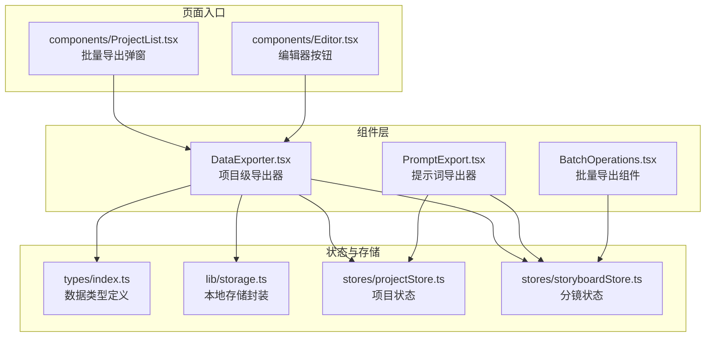
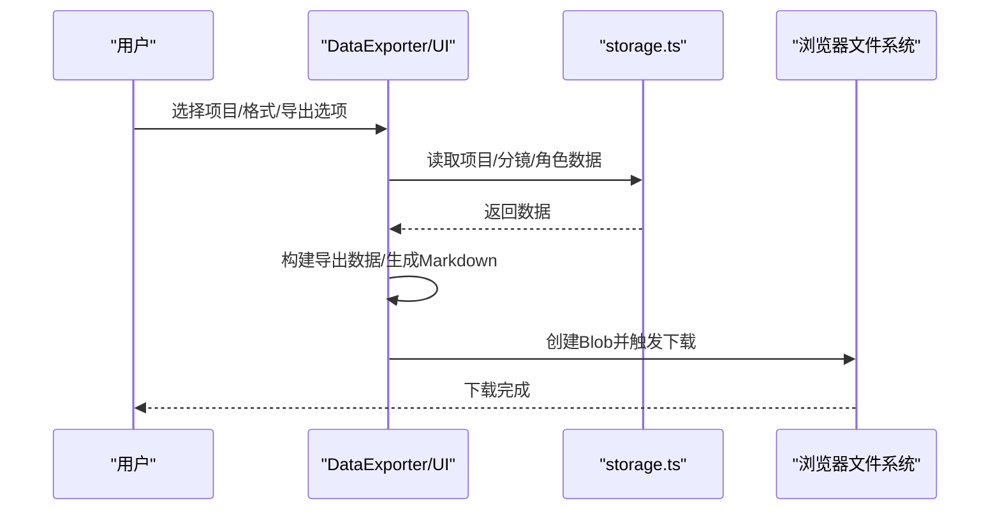
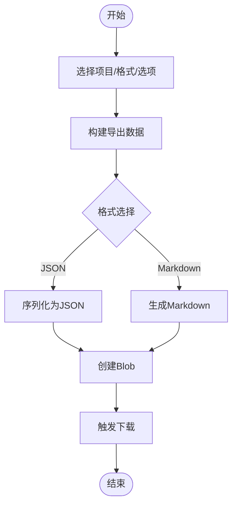
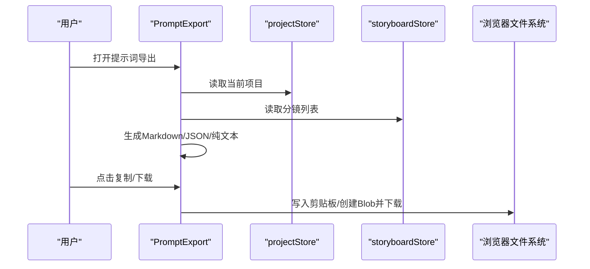
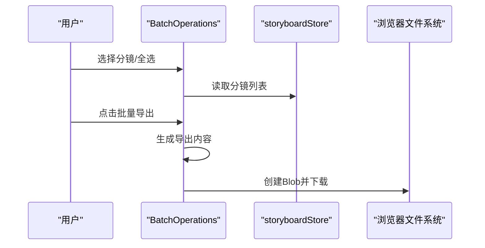
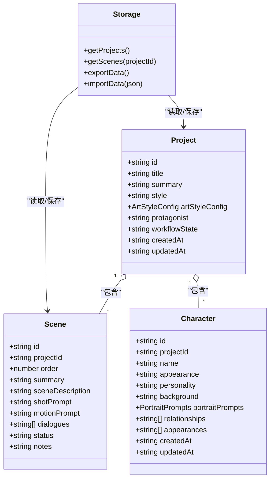
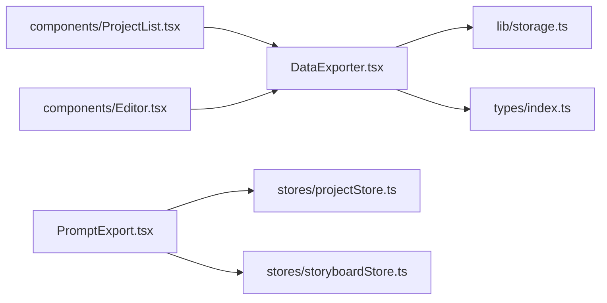

# 数据导出器

<cite>
**本文引用的文件**
- [DataExporter.tsx](file://manga-creator/src/components/editor/DataExporter.tsx)
- [PromptExport.tsx](file://manga-creator/src/components/editor/PromptExport.tsx)
- [storage.ts](file://manga-creator/src/lib/storage.ts)
- [index.ts](file://manga-creator/src/types/index.ts)
- [projectStore.ts](file://manga-creator/src/stores/projectStore.ts)
- [storyboardStore.ts](file://manga-creator/src/stores/storyboardStore.ts)
- [ProjectList.tsx](file://manga-creator/src/components/ProjectList.tsx)
- [Editor.tsx](file://manga-creator/src/components/Editor.tsx)
- [BatchOperations.tsx](file://manga-creator/src/components/editor/BatchOperations.tsx)
- [DataExporter.test.tsx](file://manga-creator/src/components/editor/DataExporter.test.tsx)
</cite>

## 目录
1. [引言](#引言)
2. [项目结构](#项目结构)
3. [核心组件](#核心组件)
4. [架构总览](#架构总览)
5. [详细组件分析](#详细组件分析)
6. [依赖分析](#依赖分析)
7. [性能考虑](#性能考虑)
8. [故障排查指南](#故障排查指南)
9. [结论](#结论)
10. [附录](#附录)

## 引言
本文件围绕“数据导出器”展开，系统梳理了项目中与数据导出、导入、预览、进度追踪以及批量导出相关的功能模块。文档旨在帮助开发者与非技术读者理解导出器如何组织数据、支持的导出格式、导入校验流程、UI交互与状态管理，并提供可视化图表辅助理解整体架构与关键流程。

## 项目结构
与“数据导出器”直接相关的文件主要集中在以下位置：
- 组件层：导出器UI组件、提示词导出组件、批量导出组件
- 类型与存储：数据类型定义、本地存储封装、Zustand 状态管理
- 页面入口：编辑器页面与项目列表弹窗中集成导出器

图表来源
- [DataExporter.tsx](file://manga-creator/src/components/editor/DataExporter.tsx#L1-L120)
- [PromptExport.tsx](file://manga-creator/src/components/editor/PromptExport.tsx#L1-L120)
- [storage.ts](file://manga-creator/src/lib/storage.ts#L436-L568)
- [index.ts](file://manga-creator/src/types/index.ts#L302-L344)
- [projectStore.ts](file://manga-creator/src/stores/projectStore.ts#L1-L124)
- [storyboardStore.ts](file://manga-creator/src/stores/storyboardStore.ts#L1-L108)
- [ProjectList.tsx](file://manga-creator/src/components/ProjectList.tsx#L401-L415)
- [Editor.tsx](file://manga-creator/src/components/Editor.tsx#L464-L481)

章节来源
- [DataExporter.tsx](file://manga-creator/src/components/editor/DataExporter.tsx#L1-L120)
- [PromptExport.tsx](file://manga-creator/src/components/editor/PromptExport.tsx#L1-L120)
- [storage.ts](file://manga-creator/src/lib/storage.ts#L436-L568)
- [index.ts](file://manga-creator/src/types/index.ts#L302-L344)
- [projectStore.ts](file://manga-creator/src/stores/projectStore.ts#L1-L124)
- [storyboardStore.ts](file://manga-creator/src/stores/storyboardStore.ts#L1-L108)
- [ProjectList.tsx](file://manga-creator/src/components/ProjectList.tsx#L401-L415)
- [Editor.tsx](file://manga-creator/src/components/Editor.tsx#L464-L481)

## 核心组件
- 项目级导出器（DataExporter）
  - 支持选择多个项目，按需包含元数据、分镜、角色、台词等
  - 支持导出为 JSON 或 Markdown 格式
  - 提供导出预览、进度条与 Toast 提示
  - 支持从 JSON 文件导入并进行基础格式校验
- 提示词导出器（PromptExport）
  - 基于当前项目与分镜生成 Markdown/JSON/纯文本提示词导出
  - 支持复制到剪贴板与下载
- 批量导出组件（BatchOperations）
  - 在分镜列表中支持批量导出（Markdown/JSON/纯文本）

章节来源
- [DataExporter.tsx](file://manga-creator/src/components/editor/DataExporter.tsx#L120-L228)
- [PromptExport.tsx](file://manga-creator/src/components/editor/PromptExport.tsx#L146-L226)
- [BatchOperations.tsx](file://manga-creator/src/components/editor/BatchOperations.tsx#L171-L201)

## 架构总览
导出器围绕“数据收集—格式化—文件生成—下载/导入”的链路工作，同时通过状态管理与存储层保证数据一致性与持久化。

图表来源
- [DataExporter.tsx](file://manga-creator/src/components/editor/DataExporter.tsx#L230-L299)
- [storage.ts](file://manga-creator/src/lib/storage.ts#L436-L496)

## 详细组件分析

### 项目级导出器（DataExporter）
- 数据收集与构建
  - 通过项目集合与导出选项决定是否包含分镜、角色、元数据与台词
  - 分镜可按需剔除台词字段以减小体积
- 导出流程
  - 预处理（准备数据）→ 生成内容（JSON/Markdown）→ 创建Blob → 下载
  - 进度条与Toast反馈
- 导入流程
  - 读取JSON文件→解析→基础格式校验（版本、项目字段）→ 统计导入数据→回调onImport
- UI交互
  - 项目选择（单选/全选）、导出预览（截断显示）、格式切换、选项控制

图表来源
- [DataExporter.tsx](file://manga-creator/src/components/editor/DataExporter.tsx#L230-L299)
- [DataExporter.tsx](file://manga-creator/src/components/editor/DataExporter.tsx#L352-L366)

章节来源
- [DataExporter.tsx](file://manga-creator/src/components/editor/DataExporter.tsx#L120-L228)
- [DataExporter.tsx](file://manga-creator/src/components/editor/DataExporter.tsx#L230-L299)
- [DataExporter.tsx](file://manga-creator/src/components/editor/DataExporter.tsx#L301-L351)
- [DataExporter.tsx](file://manga-creator/src/components/editor/DataExporter.tsx#L352-L410)

### 提示词导出器（PromptExport）
- 基于当前项目与分镜生成导出内容
  - Markdown：包含项目信息、画风描述、角色设定、分镜列表及提示词
  - JSON：结构化导出项目与分镜信息
  - 纯文本：仅导出关键帧提示词或时空提示词
- 复制与下载：支持复制到剪贴板与下载文件

图表来源
- [PromptExport.tsx](file://manga-creator/src/components/editor/PromptExport.tsx#L1-L145)
- [PromptExport.tsx](file://manga-creator/src/components/editor/PromptExport.tsx#L146-L226)
- [PromptExport.tsx](file://manga-creator/src/components/editor/PromptExport.tsx#L228-L249)
- [projectStore.ts](file://manga-creator/src/stores/projectStore.ts#L1-L124)
- [storyboardStore.ts](file://manga-creator/src/stores/storyboardStore.ts#L1-L108)

章节来源
- [PromptExport.tsx](file://manga-creator/src/components/editor/PromptExport.tsx#L1-L145)
- [PromptExport.tsx](file://manga-creator/src/components/editor/PromptExport.tsx#L146-L226)
- [PromptExport.tsx](file://manga-creator/src/components/editor/PromptExport.tsx#L228-L249)
- [projectStore.ts](file://manga-creator/src/stores/projectStore.ts#L1-L124)
- [storyboardStore.ts](file://manga-creator/src/stores/storyboardStore.ts#L1-L108)

### 批量导出组件（BatchOperations）
- 在分镜列表中选择多个分镜，统一导出为 Markdown/JSON/纯文本
- 与全局批量状态联动，支持暂停/继续与进度展示

图表来源
- [BatchOperations.tsx](file://manga-creator/src/components/editor/BatchOperations.tsx#L171-L201)
- [storyboardStore.ts](file://manga-creator/src/stores/storyboardStore.ts#L1-L108)

章节来源
- [BatchOperations.tsx](file://manga-creator/src/components/editor/BatchOperations.tsx#L171-L201)
- [storyboardStore.ts](file://manga-creator/src/stores/storyboardStore.ts#L1-L108)

### 数据模型与存储
- 数据类型
  - 项目（Project）、分镜（Scene）、角色（Character）、画风配置（ArtStyleConfig）等
- 存储封装
  - 项目/分镜/配置的读取、保存、删除、批量保存、加密配置
  - 数据导出/导入（exportData/importData）
- 状态管理
  - 项目状态（projectStore）与分镜状态（storyboardStore）为导出器提供数据源

图表来源
- [index.ts](file://manga-creator/src/types/index.ts#L302-L344)
- [index.ts](file://manga-creator/src/types/index.ts#L497-L521)
- [storage.ts](file://manga-creator/src/lib/storage.ts#L436-L568)

章节来源
- [index.ts](file://manga-creator/src/types/index.ts#L302-L344)
- [index.ts](file://manga-creator/src/types/index.ts#L497-L521)
- [storage.ts](file://manga-creator/src/lib/storage.ts#L436-L568)

## 依赖分析
- 组件与存储
  - DataExporter 依赖 storage.ts 的 getProjects/getScenes 等读取函数
  - PromptExport 依赖 projectStore 与 storyboardStore 获取当前项目与分镜
- 组件与页面入口
  - ProjectList.tsx 中通过对话框嵌入 DataExporter 实现批量导出
  - Editor.tsx 中通过按钮打开导出对话框
- 组件与类型
  - DataExporter 与 PromptExport 均使用 types/index.ts 中的 Project/Scene/Character 等类型

图表来源
- [DataExporter.tsx](file://manga-creator/src/components/editor/DataExporter.tsx#L1-L120)
- [PromptExport.tsx](file://manga-creator/src/components/editor/PromptExport.tsx#L1-L120)
- [storage.ts](file://manga-creator/src/lib/storage.ts#L436-L568)
- [index.ts](file://manga-creator/src/types/index.ts#L302-L344)
- [projectStore.ts](file://manga-creator/src/stores/projectStore.ts#L1-L124)
- [storyboardStore.ts](file://manga-creator/src/stores/storyboardStore.ts#L1-L108)
- [ProjectList.tsx](file://manga-creator/src/components/ProjectList.tsx#L401-L415)
- [Editor.tsx](file://manga-creator/src/components/Editor.tsx#L464-L481)

章节来源
- [DataExporter.tsx](file://manga-creator/src/components/editor/DataExporter.tsx#L1-L120)
- [PromptExport.tsx](file://manga-creator/src/components/editor/PromptExport.tsx#L1-L120)
- [ProjectList.tsx](file://manga-creator/src/components/ProjectList.tsx#L401-L415)
- [Editor.tsx](file://manga-creator/src/components/Editor.tsx#L464-L481)

## 性能考虑
- 导出预览截断
  - 预览内容在超过一定长度时进行截断，避免大文本渲染阻塞
- 导出进度模拟
  - 通过阶段性延迟与进度条提升用户体验，避免长耗时操作无反馈
- 数据读取与构建
  - 通过 getScenes/getProjects 直接从本地存储读取，减少中间层复杂度
- 批量导出
  - 批量导出组件支持暂停/继续，便于在大量分镜导出时控制节奏

章节来源
- [DataExporter.tsx](file://manga-creator/src/components/editor/DataExporter.tsx#L352-L366)
- [DataExporter.tsx](file://manga-creator/src/components/editor/DataExporter.tsx#L230-L299)
- [BatchOperations.tsx](file://manga-creator/src/components/editor/BatchOperations.tsx#L233-L249)

## 故障排查指南
- 导出失败
  - 检查是否选择了项目；若未选择，将触发提示
  - 导出过程中异常会通过 Toast 展示错误信息
- 导入失败
  - 文件必须为 JSON 格式且包含版本与项目字段
  - 若项目字段缺失或格式不正确，将提示具体错误
- 预览空白
  - 确认已选择项目；未选择时预览内容为空
- 大量数据导出
  - 建议优先导出 Markdown 以获得更好的可读性
  - 如需最小化体积，可在导出选项中取消包含台词

章节来源
- [DataExporter.tsx](file://manga-creator/src/components/editor/DataExporter.tsx#L230-L299)
- [DataExporter.tsx](file://manga-creator/src/components/editor/DataExporter.tsx#L301-L351)
- [DataExporter.tsx](file://manga-creator/src/components/editor/DataExporter.tsx#L352-L410)
- [DataExporter.test.tsx](file://manga-creator/src/components/editor/DataExporter.test.tsx#L172-L223)
- [DataExporter.test.tsx](file://manga-creator/src/components/editor/DataExporter.test.tsx#L270-L310)

## 结论
数据导出器通过清晰的组件划分与完善的UI交互，实现了项目级与分镜级的多样化导出需求。其基于本地存储的数据读取与Zustand状态管理，保证了数据的一致性与易用性。配合导入校验与进度反馈，提升了用户在数据迁移与备份过程中的可控性与体验。

## 附录
- 入口与集成
  - 批量导出弹窗：ProjectList.tsx 中通过对话框嵌入 DataExporter
  - 编辑器按钮：Editor.tsx 中提供“导出数据”入口
- 测试要点
  - DataExporter.test.tsx 覆盖了项目选择、导出格式、导入校验与进度反馈等关键行为

章节来源
- [ProjectList.tsx](file://manga-creator/src/components/ProjectList.tsx#L401-L415)
- [Editor.tsx](file://manga-creator/src/components/Editor.tsx#L464-L481)
- [DataExporter.test.tsx](file://manga-creator/src/components/editor/DataExporter.test.tsx#L131-L223)
- [DataExporter.test.tsx](file://manga-creator/src/components/editor/DataExporter.test.tsx#L270-L310)