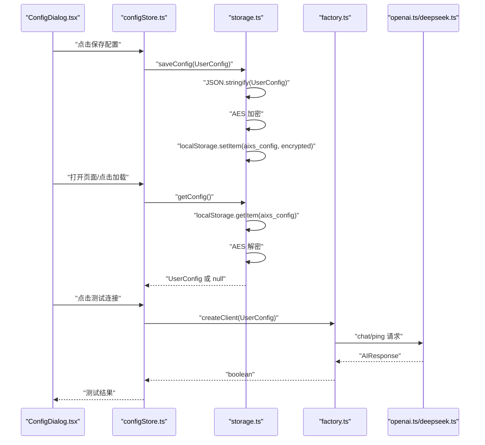
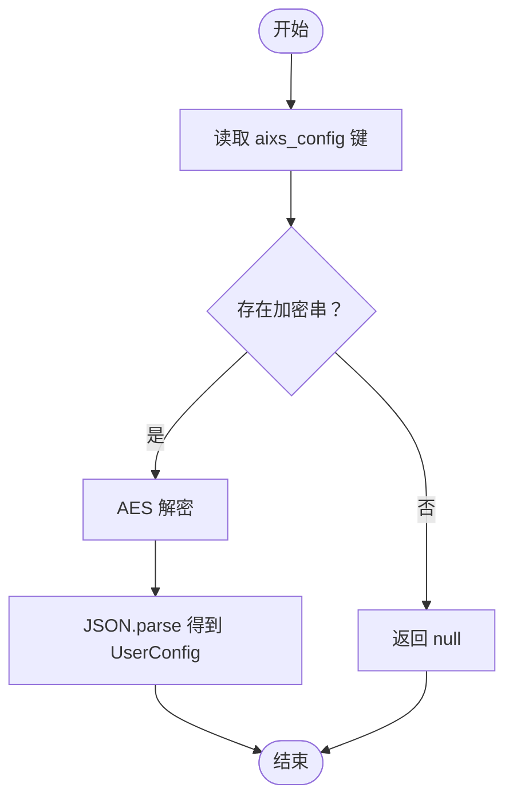
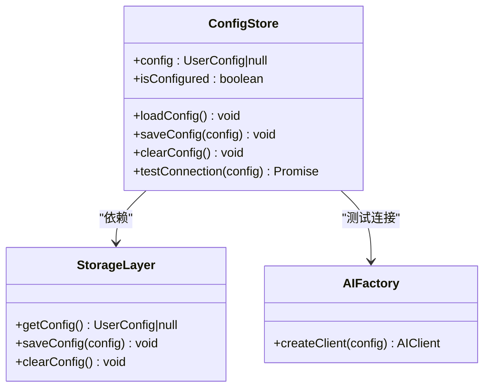
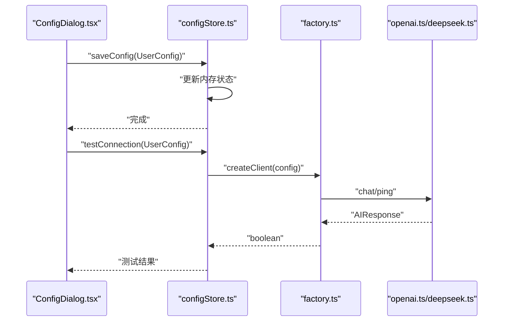
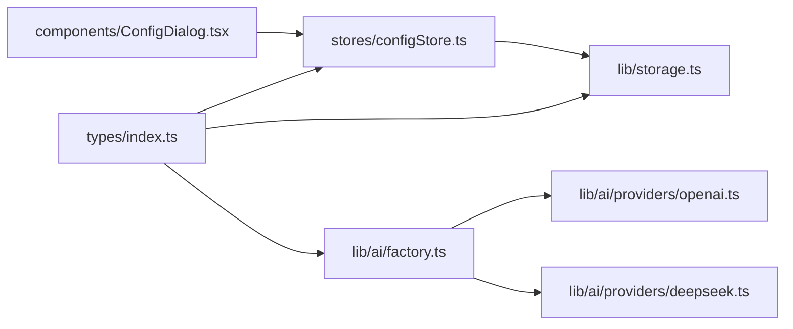

# 配置安全存储

<cite>
**本文引用的文件**
- [storage.ts](file://manga-creator/src/lib/storage.ts)
- [configStore.ts](file://manga-creator/src/stores/configStore.ts)
- [types.ts](file://manga-creator/src/types/index.ts)
- [factory.ts](file://manga-creator/src/lib/ai/factory.ts)
- [openai.ts](file://manga-creator/src/lib/ai/providers/openai.ts)
- [deepseek.ts](file://manga-creator/src/lib/ai/providers/deepseek.ts)
- [ConfigDialog.tsx](file://manga-creator/src/components/ConfigDialog.tsx)
- [storage.test.ts](file://manga-creator/src/lib/storage.test.ts)
</cite>

## 目录
1. [引言](#引言)
2. [项目结构](#项目结构)
3. [核心组件](#核心组件)
4. [架构总览](#架构总览)
5. [详细组件分析](#详细组件分析)
6. [依赖关系分析](#依赖关系分析)
7. [性能考量](#性能考量)
8. [故障排查指南](#故障排查指南)
9. [结论](#结论)
10. [附录](#附录)

## 引言
本专项文档聚焦于“配置安全存储”，围绕 getConfig、saveConfig、clearConfig 三个方法如何实现 UserConfig 对象的整体加密存储展开，解释为何对整个配置对象进行加密而非仅加密 API Key 字段的设计决策，并结合 configStore 中 loadConfig 和 saveConfig 的状态交互，说明配置状态与加密存储的协同流程。文档还提供了配置测试连接功能与存储层的协作时序图，讨论配置数据的生命周期管理、清除机制及安全退出策略，确保敏感信息不被残留。

## 项目结构
本项目采用“类型定义 → 存储层 → 状态层 → UI 组件”的分层组织方式：
- 类型定义层：集中定义 UserConfig、Project、Scene 等核心数据结构，明确配置对象的字段与约束。
- 存储层：封装本地持久化与加密解密逻辑，提供统一的 getConfig/saveConfig/clearConfig 接口。
- 状态层：通过 Zustand store 将存储层与 UI 状态绑定，负责加载、保存、清空配置以及测试连接。
- UI 层：ConfigDialog 提供配置输入、显示/隐藏 API Key、测试连接等交互。

```mermaid
graph TB
subgraph "类型定义层"
T1["types/index.ts<br/>定义 UserConfig 等类型"]
end
subgraph "存储层"
S1["lib/storage.ts<br/>加密/解密与本地存储接口"]
end
subgraph "状态层"
Z1["stores/configStore.ts<br/>Zustand store<br/>load/save/clear/testConnection"]
end
subgraph "AI 客户端工厂"
F1["lib/ai/factory.ts<br/>根据配置创建客户端"]
P1["lib/ai/providers/openai.ts<br/>OpenAI 兼容实现"]
P2["lib/ai/providers/deepseek.ts<br/>DeepSeek 实现"]
end
subgraph "UI 层"
U1["components/ConfigDialog.tsx<br/>配置对话框与测试按钮"]
end
T1 --> S1
S1 <- --> Z1
Z1 --> F1
F1 --> P1
F1 --> P2
U1 --> Z1
```

图表来源
- [types.ts](file://manga-creator/src/types/index.ts#L82-L92)
- [storage.ts](file://manga-creator/src/lib/storage.ts#L151-L177)
- [configStore.ts](file://manga-creator/src/stores/configStore.ts#L1-L58)
- [factory.ts](file://manga-creator/src/lib/ai/factory.ts#L44-L54)
- [openai.ts](file://manga-creator/src/lib/ai/providers/openai.ts#L1-L88)
- [deepseek.ts](file://manga-creator/src/lib/ai/providers/deepseek.ts#L1-L110)
- [ConfigDialog.tsx](file://manga-creator/src/components/ConfigDialog.tsx#L1-L197)

章节来源
- [types.ts](file://manga-creator/src/types/index.ts#L82-L92)
- [storage.ts](file://manga-creator/src/lib/storage.ts#L151-L177)
- [configStore.ts](file://manga-creator/src/stores/configStore.ts#L1-L58)
- [factory.ts](file://manga-creator/src/lib/ai/factory.ts#L44-L54)
- [openai.ts](file://manga-creator/src/lib/ai/providers/openai.ts#L1-L88)
- [deepseek.ts](file://manga-creator/src/lib/ai/providers/deepseek.ts#L1-L110)
- [ConfigDialog.tsx](file://manga-creator/src/components/ConfigDialog.tsx#L1-L197)

## 核心组件
- UserConfig 类型：包含 provider、apiKey、baseURL（可选）、model 四个字段，是加密存储的最小语义单元。
- 加密工具：基于 AES 对称加密，密钥固定在存储层常量中；提供 encrypt/decrypt 两个工具函数。
- 存储接口：提供 getConfig/saveConfig/clearConfig 三个方法，分别对应读取、写入、删除配置；内部以 localStorage 为载体，键名以 aixs_config 标识。
- 状态层：useConfigStore 将存储接口与 UI 状态绑定，提供 loadConfig/saveConfig/clearConfig/testConnection 方法。
- UI 组件：ConfigDialog 负责收集用户输入、触发保存与测试连接，并提示用户数据将加密存储。

章节来源
- [types.ts](file://manga-creator/src/types/index.ts#L82-L92)
- [storage.ts](file://manga-creator/src/lib/storage.ts#L11-L18)
- [storage.ts](file://manga-creator/src/lib/storage.ts#L151-L177)
- [configStore.ts](file://manga-creator/src/stores/configStore.ts#L1-L58)
- [ConfigDialog.tsx](file://manga-creator/src/components/ConfigDialog.tsx#L1-L197)

## 架构总览
配置安全存储的总体流程如下：
- UI 输入配置后，调用 store.saveConfig，后者委托存储层 saveConfig。
- 存储层将 UserConfig 序列化为 JSON，再进行 AES 加密，最后写入 localStorage 的 aixs_config 键。
- 加载时，store.loadConfig 调用存储层 getConfig，先从 localStorage 读取加密串，解密后反序列化为 UserConfig。
- 清除时，store.clearConfig 调用存储层 clearConfig，移除 aixs_config 键。
- 测试连接时，store.testConnection 使用工厂 AIFactory.createClient，传入当前 UserConfig，发起一次轻量请求验证有效性。



图表来源
- [ConfigDialog.tsx](file://manga-creator/src/components/ConfigDialog.tsx#L44-L99)
- [configStore.ts](file://manga-creator/src/stores/configStore.ts#L1-L58)
- [storage.ts](file://manga-creator/src/lib/storage.ts#L151-L177)
- [factory.ts](file://manga-creator/src/lib/ai/factory.ts#L44-L54)
- [openai.ts](file://manga-creator/src/lib/ai/providers/openai.ts#L1-L88)
- [deepseek.ts](file://manga-creator/src/lib/ai/providers/deepseek.ts#L1-L110)

## 详细组件分析

### 存储层：加密与持久化
- 加密算法与密钥：使用对称加密，密钥固定在存储层常量中，保证同一应用内一致性；加密/解密函数对字符串进行处理。
- 键命名规范：统一使用 aixs_config 作为配置键，便于后续扩展其他键空间（如 aixs_projects、aixs_scenes）。
- 版本控制：initStorage 在首次运行或版本变更时写入版本号，便于未来做迁移。
- 错误处理：读取/写入过程中捕获异常并记录日志，读取失败返回 null，写入失败抛出明确错误信息，避免静默失败。
- 清理策略：clearConfig 移除 aixs_config；clearAllData 清理所有 aixs_* 前缀键并保留版本号，用于彻底清除用户数据。



图表来源
- [storage.ts](file://manga-creator/src/lib/storage.ts#L151-L177)

章节来源
- [storage.ts](file://manga-creator/src/lib/storage.ts#L11-L18)
- [storage.ts](file://manga-creator/src/lib/storage.ts#L24-L29)
- [storage.ts](file://manga-creator/src/lib/storage.ts#L40-L46)
- [storage.ts](file://manga-creator/src/lib/storage.ts#L151-L177)
- [storage.ts](file://manga-creator/src/lib/storage.ts#L224-L232)

### 状态层：配置状态与存储交互
- loadConfig：从存储层读取配置，设置 isConfigured 标志位，供 UI 判断是否已配置。
- saveConfig：先调用存储层写入，再更新内存状态，确保 UI 与存储一致。
- clearConfig：删除存储中的配置并重置状态。
- testConnection：使用工厂创建客户端，发送一次轻量请求（例如包含 ping 的消息），根据响应内容判断连通性。



图表来源
- [configStore.ts](file://manga-creator/src/stores/configStore.ts#L1-L58)
- [storage.ts](file://manga-creator/src/lib/storage.ts#L151-L177)
- [factory.ts](file://manga-creator/src/lib/ai/factory.ts#L44-L54)

章节来源
- [configStore.ts](file://manga-creator/src/stores/configStore.ts#L1-L58)
- [factory.ts](file://manga-creator/src/lib/ai/factory.ts#L44-L54)

### UI 组件：配置对话框与测试连接
- 输入与校验：要求 apiKey 与 model 必填；支持切换显示/隐藏 API Key；提供测试连接按钮。
- 保存流程：组装 UserConfig 并调用 store.saveConfig，保存成功后关闭对话框并提示。
- 测试流程：构造临时 UserConfig 调用 store.testConnection，根据结果提示成功或失败。



图表来源
- [ConfigDialog.tsx](file://manga-creator/src/components/ConfigDialog.tsx#L44-L99)
- [configStore.ts](file://manga-creator/src/stores/configStore.ts#L45-L56)
- [factory.ts](file://manga-creator/src/lib/ai/factory.ts#L44-L54)
- [openai.ts](file://manga-creator/src/lib/ai/providers/openai.ts#L1-L88)
- [deepseek.ts](file://manga-creator/src/lib/ai/providers/deepseek.ts#L1-L110)

章节来源
- [ConfigDialog.tsx](file://manga-creator/src/components/ConfigDialog.tsx#L1-L197)
- [configStore.ts](file://manga-creator/src/stores/configStore.ts#L1-L58)

### 设计决策：为何整体加密而非仅加密 API Key
- 语义完整性：UserConfig 是一个不可分割的配置单元，包含 provider、apiKey、baseURL、model 等字段，整体加密能保证配置的原子性与一致性。
- 防止部分泄露：若仅加密 apiKey，baseURL、model 等字段仍可能暴露在明文中，降低整体安全性；整体加密可避免因字段拆分导致的潜在信息泄露。
- 易于维护：整体序列化/反序列化简化了存储与读取逻辑，减少因字段增减带来的维护成本。
- 与 UI 一致：UI 层以整包配置提交，整体加密与 UI 行为保持一致，避免“半加密”状态。
- 可扩展性：未来若增加更多配置字段，整体加密无需调整，只需扩展类型定义即可。

章节来源
- [types.ts](file://manga-creator/src/types/index.ts#L82-L92)
- [storage.ts](file://manga-creator/src/lib/storage.ts#L151-L177)

### 生命周期管理与安全退出策略
- 初始化：initStorage 写入版本号，确保后续迁移与兼容性。
- 读取：getConfig 若无数据返回 null，避免异常；若数据损坏也返回 null，防止污染应用状态。
- 写入：saveConfig 成功后立即更新内存状态，保证 UI 与存储同步。
- 清理：clearConfig 删除 aixs_config；clearAllData 清理所有 aixs_* 前缀键并保留版本号，确保敏感数据不残留。
- 退出策略：应用退出前建议调用 clearConfig 或 clearAllData，确保 localStorage 不留存任何配置信息；UI 层可在用户选择“清除配置”或“登出”时触发。

章节来源
- [storage.ts](file://manga-creator/src/lib/storage.ts#L40-L46)
- [storage.ts](file://manga-creator/src/lib/storage.ts#L151-L177)
- [storage.ts](file://manga-creator/src/lib/storage.ts#L224-L232)
- [configStore.ts](file://manga-creator/src/stores/configStore.ts#L37-L43)

## 依赖关系分析
- 类型依赖：UserConfig 由 types/index.ts 定义，被 storage.ts、configStore.ts、factory.ts 等多处使用。
- 存储依赖：configStore 依赖 storage.ts 的 getConfig/saveConfig/clearConfig；storage.ts 依赖 types 中的 UserConfig。
- 工厂依赖：AIFactory 依赖 UserConfig 与 AIProvider 接口，具体实现由 openai.ts、deepseek.ts 提供。
- UI 依赖：ConfigDialog 依赖 store 与 UI 组件库，间接依赖工厂与提供者。



图表来源
- [types.ts](file://manga-creator/src/types/index.ts#L82-L92)
- [storage.ts](file://manga-creator/src/lib/storage.ts#L151-L177)
- [configStore.ts](file://manga-creator/src/stores/configStore.ts#L1-L58)
- [factory.ts](file://manga-creator/src/lib/ai/factory.ts#L44-L54)
- [openai.ts](file://manga-creator/src/lib/ai/providers/openai.ts#L1-L88)
- [deepseek.ts](file://manga-creator/src/lib/ai/providers/deepseek.ts#L1-L110)
- [ConfigDialog.tsx](file://manga-creator/src/components/ConfigDialog.tsx#L1-L197)

章节来源
- [types.ts](file://manga-creator/src/types/index.ts#L82-L92)
- [storage.ts](file://manga-creator/src/lib/storage.ts#L151-L177)
- [configStore.ts](file://manga-creator/src/stores/configStore.ts#L1-L58)
- [factory.ts](file://manga-creator/src/lib/ai/factory.ts#L44-L54)
- [openai.ts](file://manga-creator/src/lib/ai/providers/openai.ts#L1-L88)
- [deepseek.ts](file://manga-creator/src/lib/ai/providers/deepseek.ts#L1-L110)
- [ConfigDialog.tsx](file://manga-creator/src/components/ConfigDialog.tsx#L1-L197)

## 性能考量
- 加密开销：AES 加密/解密对小规模 JSON（UserConfig）开销极低，几乎可忽略；建议在 UI 侧避免频繁触发保存。
- 存储容量：localStorage 通常限制在数 MB 级别，建议定期清理历史数据与分镜，避免超出上限。
- 连接测试：testConnection 发送轻量请求，建议在用户显式点击时触发，避免后台轮询造成性能损耗。
- 批量操作：saveScenes/saveProject 等批量写入会一次性写入大量数据，注意避免在移动端或低端设备上频繁触发。

## 故障排查指南
- 无法加载配置：检查 aixs_config 是否存在且可解密；若返回 null，确认存储层未被篡改或数据损坏。
- 保存失败：查看存储层抛出的错误信息，确认浏览器允许 localStorage 使用；检查网络与代理设置（若涉及 baseURL）。
- 清理无效：clearConfig 仅移除 aixs_config；如需彻底清理，使用 clearAllData 并确认版本号保留。
- 测试连接失败：检查 apiKey、model、baseURL 是否正确；查看工厂与提供者的错误信息；确认网络连通性。

章节来源
- [storage.ts](file://manga-creator/src/lib/storage.ts#L151-L177)
- [storage.ts](file://manga-creator/src/lib/storage.ts#L224-L232)
- [configStore.ts](file://manga-creator/src/stores/configStore.ts#L45-L56)
- [openai.ts](file://manga-creator/src/lib/ai/providers/openai.ts#L1-L88)
- [deepseek.ts](file://manga-creator/src/lib/ai/providers/deepseek.ts#L1-L110)

## 结论
通过对 getConfig/saveConfig/clearConfig 的整体加密设计，本项目实现了对 UserConfig 的安全持久化，确保敏感信息（尤其是 API Key）不以明文形式出现在本地存储中。配合 store 层的状态管理与 UI 的测试连接能力，形成了从输入、存储、验证到清理的完整闭环。建议在生产环境中进一步引入密钥轮换与更严格的访问控制，以满足更高安全等级的需求。

## 附录
- 单元测试要点（来自测试文件）：
  - 加密/解密正确性与边界条件（空字符串、特殊字符、emoji、超长字符串）。
  - 存储初始化与版本迁移。
  - 配置保存、读取、损坏处理、清除。
  - 测试连接的正向与负向场景。
  - 清理与存储用量统计。

章节来源
- [storage.test.ts](file://manga-creator/src/lib/storage.test.ts#L81-L137)
- [storage.test.ts](file://manga-creator/src/lib/storage.test.ts#L143-L165)
- [storage.test.ts](file://manga-creator/src/lib/storage.test.ts#L171-L239)
- [storage.test.ts](file://manga-creator/src/lib/storage.test.ts#L696-L762)