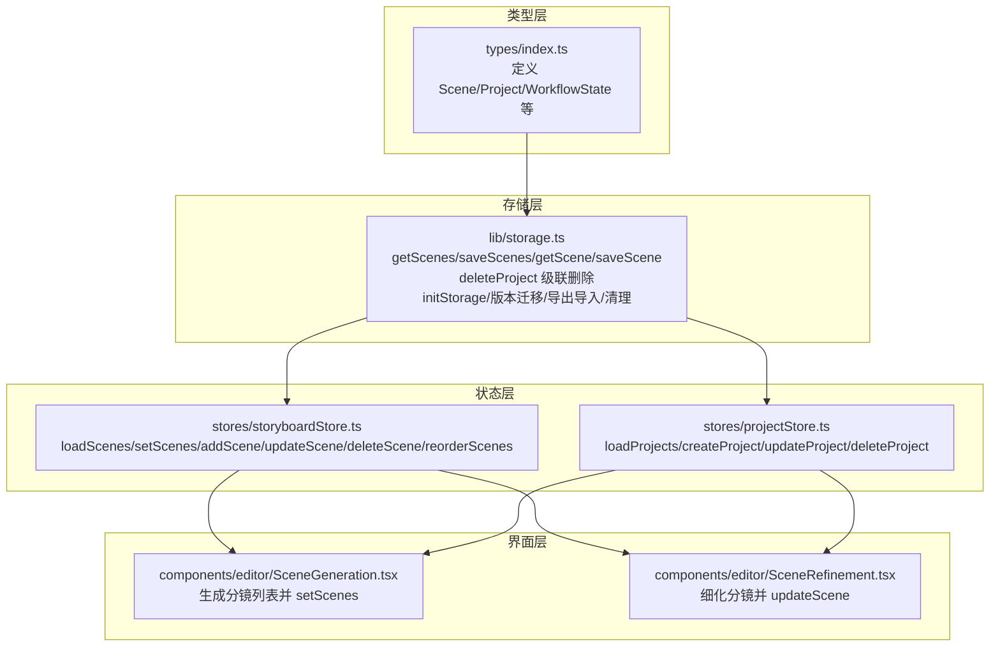
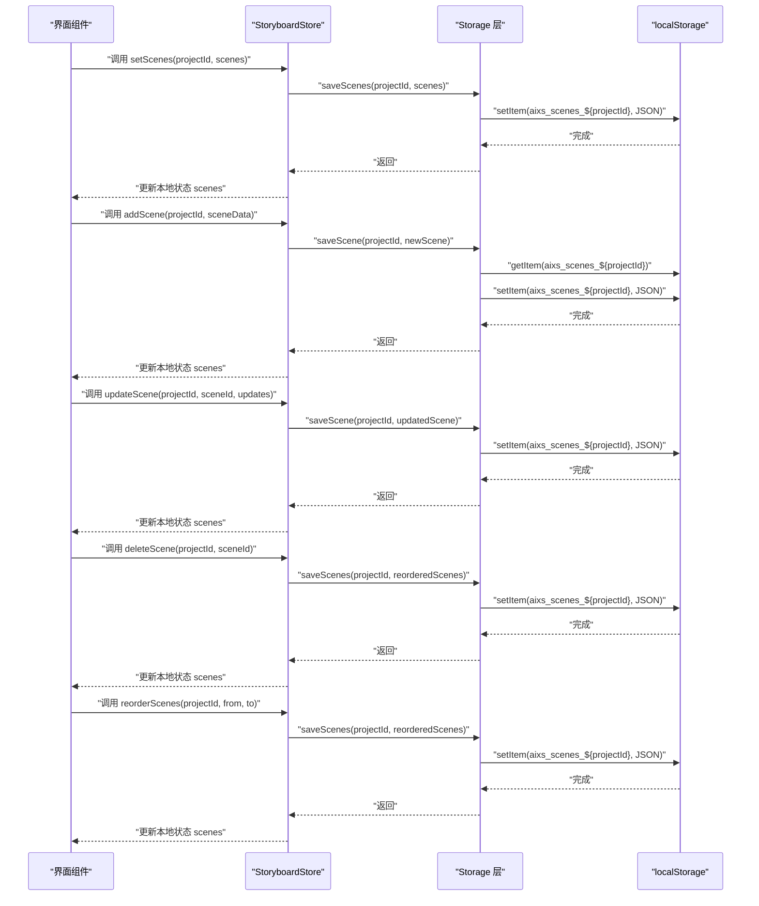
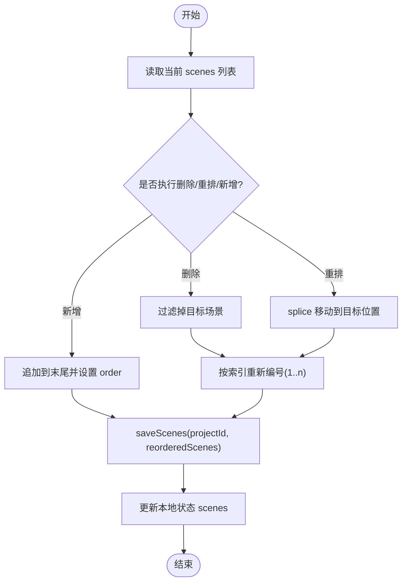
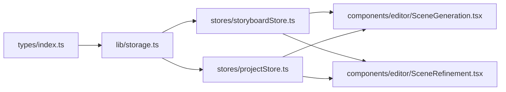
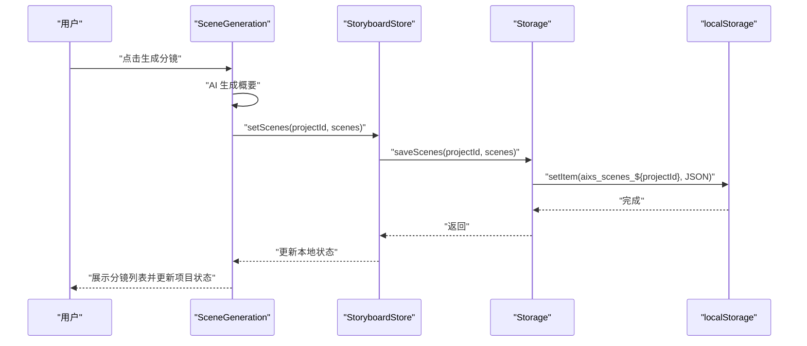

# 分镜持久化

<cite>
**本文引用的文件**
- [storyboardStore.ts](file://manga-creator/src/stores/storyboardStore.ts)
- [storage.ts](file://manga-creator/src/lib/storage.ts)
- [projectStore.ts](file://manga-creator/src/stores/projectStore.ts)
- [SceneGeneration.tsx](file://manga-creator/src/components/editor/SceneGeneration.tsx)
- [SceneRefinement.tsx](file://manga-creator/src/components/editor/SceneRefinement.tsx)
- [index.ts](file://manga-creator/src/types/index.ts)
- [store.test.ts](file://manga-creator/src/stores/store.test.ts)
- [storage.test.ts](file://manga-creator/src/lib/storage.test.ts)
</cite>

## 目录
1. [简介](#简介)
2. [项目结构](#项目结构)
3. [核心组件](#核心组件)
4. [架构总览](#架构总览)
5. [详细组件分析](#详细组件分析)
6. [依赖关系分析](#依赖关系分析)
7. [性能考量](#性能考量)
8. [故障排查指南](#故障排查指南)
9. [结论](#结论)
10. [附录](#附录)

## 简介
本文件系统性阐述分镜数据的持久化设计，重点围绕以下目标展开：
- getScenes、saveScenes、saveScene 如何通过 projectId 实现多项目分镜数据的隔离存储（键名约定为 aixs_scenes_${projectId}）。
- 分镜数据与项目数据的关联关系及级联删除机制（删除项目时自动清除对应分镜）。
- storyboardStore.ts 中的状态管理逻辑如何驱动本地存储同步更新，尤其是 reorderScenes 中的重新编号与批量保存。
- 分镜数据结构与字段含义，以及数据一致性保障措施（保存失败时的错误处理与用户反馈机制）。
- 实际使用场景示例：分镜生成后自动保存的完整流程。

## 项目结构
分镜持久化涉及三层协作：
- 类型层：定义 Scene、Project 等核心数据模型。
- 存储层：封装 localStorage 的读写、加密、版本迁移、导出导入与清理。
- 状态层：通过 zustand 管理分镜列表、当前分镜、生成状态等，并在变更时同步到存储层。

图表来源
- [storage.ts](file://manga-creator/src/lib/storage.ts#L104-L145)
- [storyboardStore.ts](file://manga-creator/src/stores/storyboardStore.ts#L21-L106)
- [projectStore.ts](file://manga-creator/src/stores/projectStore.ts#L1-L95)
- [SceneGeneration.tsx](file://manga-creator/src/components/editor/SceneGeneration.tsx#L1-L136)
- [SceneRefinement.tsx](file://manga-creator/src/components/editor/SceneRefinement.tsx#L1-L207)
- [index.ts](file://manga-creator/src/types/index.ts#L45-L78)

章节来源
- [storage.ts](file://manga-creator/src/lib/storage.ts#L104-L145)
- [storyboardStore.ts](file://manga-creator/src/stores/storyboardStore.ts#L21-L106)
- [projectStore.ts](file://manga-creator/src/stores/projectStore.ts#L1-L95)
- [SceneGeneration.tsx](file://manga-creator/src/components/editor/SceneGeneration.tsx#L1-L136)
- [SceneRefinement.tsx](file://manga-creator/src/components/editor/SceneRefinement.tsx#L1-L207)
- [index.ts](file://manga-creator/src/types/index.ts#L45-L78)

## 核心组件
- 存储键名与隔离策略
  - 分镜键名：aixs_scenes_${projectId}，通过工厂函数动态生成，确保每个项目拥有独立的分镜集合。
  - 项目键名：aixs_projects，用于存储项目列表。
  - 配置键名：aixs_config，采用 AES 对称加密存储。
  - 版本键名：aixs_version，用于版本迁移。
- 关键存储接口
  - getScenes(projectId)：读取指定项目的分镜列表。
  - saveScenes(projectId, scenes)：批量保存指定项目的分镜列表（覆盖式）。
  - saveScene(projectId, scene)：单条分镜的新增或更新。
  - deleteProject(projectId)：删除项目的同时移除对应分镜键。
- 状态管理接口
  - loadScenes(projectId)：从存储加载分镜并更新状态。
  - setScenes(projectId, scenes)：批量替换分镜并重新编号。
  - addScene(projectId, sceneData)：新增分镜并自动设置 order 与默认状态。
  - updateScene(projectId, sceneId, updates)：局部更新分镜字段。
  - deleteScene(projectId, sceneId)：删除分镜并重新编号。
  - reorderScenes(projectId, fromIndex, toIndex)：拖拽重排并重新编号，随后批量保存。

章节来源
- [storage.ts](file://manga-creator/src/lib/storage.ts#L24-L30)
- [storage.ts](file://manga-creator/src/lib/storage.ts#L104-L145)
- [storyboardStore.ts](file://manga-creator/src/stores/storyboardStore.ts#L21-L106)

## 架构总览
分镜持久化的控制流如下：

图表来源
- [storyboardStore.ts](file://manga-creator/src/stores/storyboardStore.ts#L21-L106)
- [storage.ts](file://manga-creator/src/lib/storage.ts#L104-L145)

## 详细组件分析

### 存储层：getScenes/saveScenes/saveScene/deleteProject
- getScenes(projectId)
  - 通过 aixs_scenes_${projectId} 读取分镜列表；若键不存在则返回空数组；解析失败时记录错误并返回空数组。
- saveScenes(projectId, scenes)
  - 将 scenes 覆盖写入 aixs_scenes_${projectId}；异常时记录错误并抛出“分镜保存失败”。
- saveScene(projectId, scene)
  - 先读取当前分镜列表，定位同 id 的场景进行替换，否则追加；然后调用 saveScenes 完成持久化。
- deleteProject(projectId)
  - 删除项目后，同时移除 aixs_scenes_${projectId}，实现级联删除。
- 版本与安全
  - initStorage 在首次使用时写入版本号；版本迁移预留接口；配置采用 AES 加密存储。

章节来源
- [storage.ts](file://manga-creator/src/lib/storage.ts#L104-L145)
- [storage.ts](file://manga-creator/src/lib/storage.ts#L86-L98)

### 状态层：storyboardStore.ts
- loadScenes(projectId)
  - 调用 getScenes(projectId)，将返回的分镜列表直接设置到 store 的 scenes 字段。
- setScenes(projectId, scenes)
  - 对传入的 scenes 进行重新编号（order 从 1 开始），然后调用 saveScenes 批量保存，最后更新本地状态。
- addScene(projectId, sceneData)
  - 自动生成唯一 id，设置 order 为当前列表长度+1，status 默认为 pending，随后调用 saveScene 并更新本地状态。
- updateScene(projectId, sceneId, updates)
  - 查找目标场景，合并更新字段，调用 saveScene，再更新本地状态。
- deleteScene(projectId, sceneId)
  - 过滤掉目标场景，对剩余场景重新编号，调用 saveScenes，再更新本地状态。
- reorderScenes(projectId, fromIndex, toIndex)
  - 深拷贝当前 scenes，执行 splice 移动，重新编号，调用 saveScenes，再更新本地状态。
- setCurrentScene/setGenerating
  - 管理当前选中分镜与生成状态，便于 UI 控制。

章节来源
- [storyboardStore.ts](file://manga-creator/src/stores/storyboardStore.ts#L21-L106)

### 界面层：分镜生成与细化
- SceneGeneration.tsx
  - 从当前项目生成分镜列表，解析 AI 输出后构造 Scene 数组，调用 setScenes 批量保存并更新项目工作流状态。
- SceneRefinement.tsx
  - 逐步细化场景描述、动作描述与镜头提示词，每次细化均调用 updateScene 保存单条分镜。
  - 支持一键生成全部，内部按阶段顺序调用细化函数并等待状态更新。

章节来源
- [SceneGeneration.tsx](file://manga-creator/src/components/editor/SceneGeneration.tsx#L51-L136)
- [SceneRefinement.tsx](file://manga-creator/src/components/editor/SceneRefinement.tsx#L1-L207)

### 数据模型与字段含义
- Scene 字段
  - id：分镜唯一标识。
  - projectId：所属项目 id。
  - order：分镜顺序（从 1 开始）。
  - summary：分镜概要（一句话概括）。
  - sceneDescription：场景描述（环境、氛围、光影）。
  - actionDescription：动作描述（角色动作、表情、肢体语言）。
  - shotPrompt：镜头提示词（最终用于 AI 绘画的提示）。
  - contextSummary：上下文摘要（可选，包含 mood/keyElement/transition 等）。
  - status：分镜处理状态（pending/scene_generating/scene_confirmed/action_generating/action_confirmed/prompt_generating/completed/needs_update）。
  - notes：备注。
- Project 字段
  - id/title/summary/style/protagonist/workflowState/currentSceneOrder/createdAt/updatedAt 等。

章节来源
- [index.ts](file://manga-creator/src/types/index.ts#L45-L78)

### 重新编号与批量保存的实现细节
- setScenes：接收任意顺序的 scenes，统一映射为从 1 开始的连续序号，随后一次性保存。
- deleteScene：删除后对剩余场景重新编号，一次性保存。
- reorderScenes：拖拽移动后重新编号，一次性保存。
- addScene：新增时自动设置 order 为当前列表长度+1，随后保存。

图表来源
- [storyboardStore.ts](file://manga-creator/src/stores/storyboardStore.ts#L31-L106)

## 依赖关系分析
- storyboardStore.ts 依赖 storage.ts 的 getScenes/saveScenes/saveScene 接口。
- projectStore.ts 依赖 storage.ts 的 getProjects/saveProject/deleteProject 接口。
- SceneGeneration.tsx 与 SceneRefinement.tsx 依赖 storyboardStore.ts 的状态与方法。
- 类型定义 index.ts 为上述模块提供 Scene/Project 等类型约束。

图表来源
- [index.ts](file://manga-creator/src/types/index.ts#L45-L78)
- [storage.ts](file://manga-creator/src/lib/storage.ts#L104-L145)
- [storyboardStore.ts](file://manga-creator/src/stores/storyboardStore.ts#L21-L106)
- [projectStore.ts](file://manga-creator/src/stores/projectStore.ts#L1-L95)
- [SceneGeneration.tsx](file://manga-creator/src/components/editor/SceneGeneration.tsx#L1-L136)
- [SceneRefinement.tsx](file://manga-creator/src/components/editor/SceneRefinement.tsx#L1-L207)

## 性能考量
- 批量保存优于多次单条保存：reorderScenes/deleteScene/setScenes 均采用 saveScenes 批量写入，减少 localStorage 写入次数。
- 重新编号为 O(n) 操作，配合批量保存，整体复杂度可控。
- localStorage 读写为同步阻塞，建议在 UI 线程外进行大量数据处理，或在交互层节流/防抖。
- 数据体积监控：提供 getStorageUsage 仅统计 aixs_* 前缀键，便于容量评估。

章节来源
- [storage.ts](file://manga-creator/src/lib/storage.ts#L234-L246)
- [storyboardStore.ts](file://manga-creator/src/stores/storyboardStore.ts#L31-L106)

## 故障排查指南
- 保存失败
  - getScenes/saveScenes/saveScene/deleteProject 在异常时会记录错误并抛出明确错误信息（例如“分镜保存失败”、“项目保存失败”），调用方应捕获并提示用户。
- 数据损坏
  - 读取 aixs_scenes_${projectId} 或 aixs_projects 时，若 JSON 解析失败，将返回空数组或空对象，避免应用崩溃。
- 级联删除验证
  - 删除项目后，对应分镜键应被移除；可通过测试用例验证该行为。
- 重新编号问题
  - 若发现顺序异常，检查是否在批量保存前进行了多次局部更新；应优先使用 setScenes 或 reorderScenes 进行整批重排。

章节来源
- [storage.ts](file://manga-creator/src/lib/storage.ts#L104-L145)
- [storage.test.ts](file://manga-creator/src/lib/storage.test.ts#L301-L321)
- [store.test.ts](file://manga-creator/src/stores/store.test.ts#L481-L551)

## 结论
本设计通过明确的键名约定与状态层的批量保存策略，实现了多项目分镜数据的强隔离与高一致性。StoryboardStore 在用户操作（新增、更新、删除、重排）时，统一触发本地存储的同步更新，确保 UI 与持久化的一致性。deleteProject 的级联删除进一步简化了数据生命周期管理。配合完善的错误处理与测试覆盖，系统在可用性与可靠性方面具备良好基础。

## 附录

### 实际使用场景示例：分镜生成后自动保存
- 步骤
  1) 用户在 SceneGeneration 页面点击“AI生成分镜”，组件调用 AI 接口生成若干分镜概要。
  2) 组件将生成的概要转换为 Scene 数组，调用 setScenes(projectId, scenes)。
  3) setScenes 内部对 scenes 重新编号并调用 saveScenes 批量保存至 aixs_scenes_${projectId}。
  4) 本地状态 scenes 被更新，界面显示最新分镜列表。
  5) 同时更新项目工作流状态为“SCENE_LIST_EDITING”。

图表来源
- [SceneGeneration.tsx](file://manga-creator/src/components/editor/SceneGeneration.tsx#L51-L136)
- [storyboardStore.ts](file://manga-creator/src/stores/storyboardStore.ts#L31-L40)
- [storage.ts](file://manga-creator/src/lib/storage.ts#L115-L122)