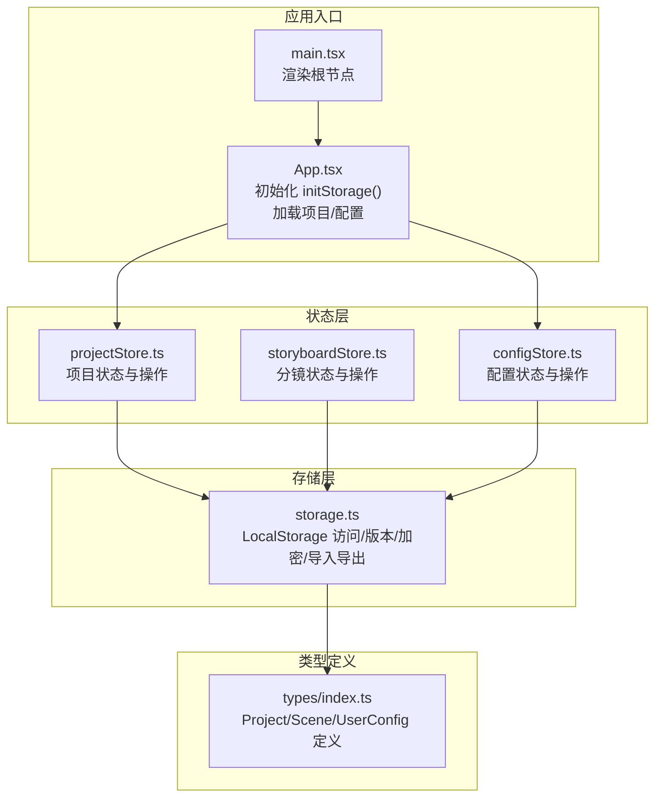
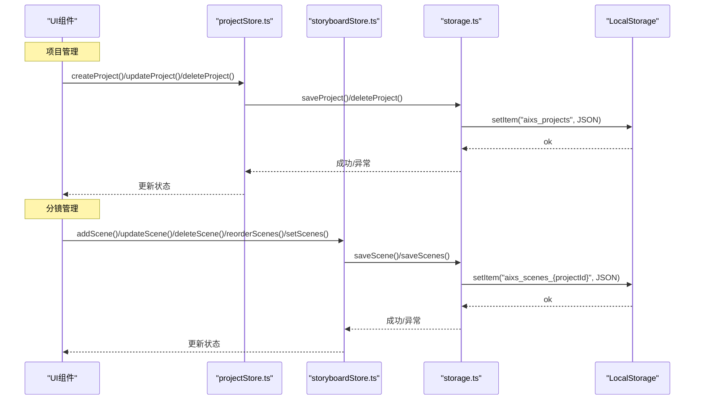
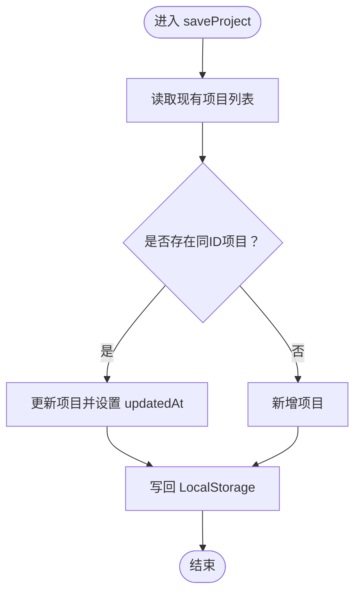
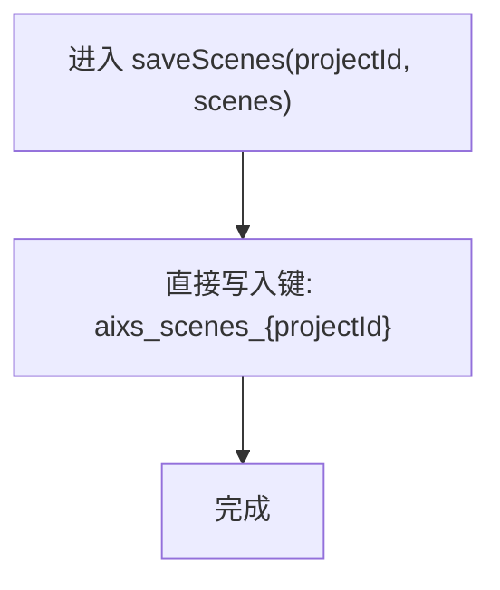
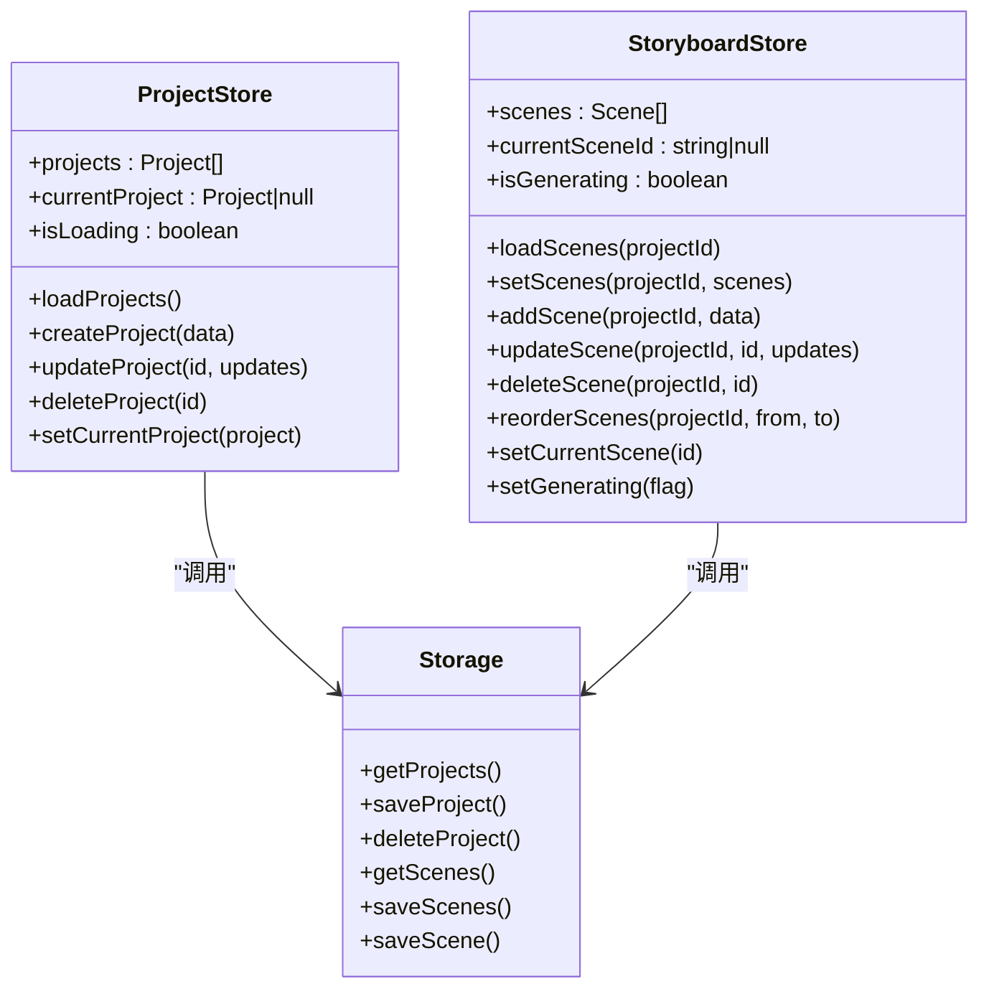
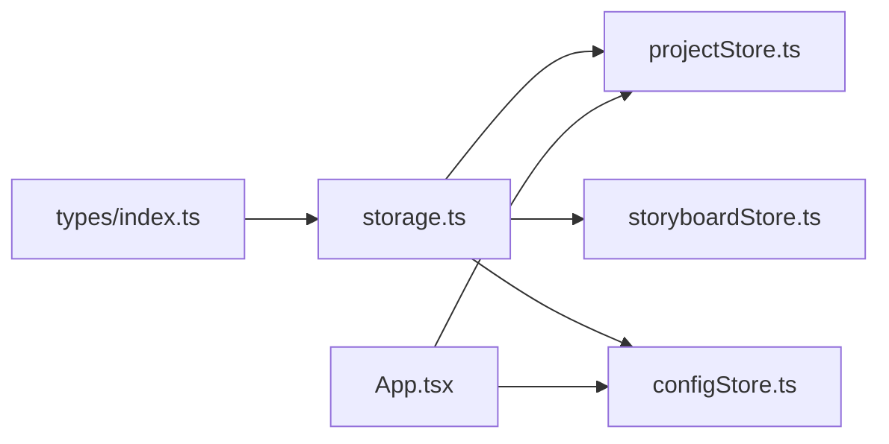

# 项目与分镜持久化

<cite>
**本文引用的文件**
- [storage.ts](file://manga-creator/src/lib/storage.ts)
- [projectStore.ts](file://manga-creator/src/stores/projectStore.ts)
- [storyboardStore.ts](file://manga-creator/src/stores/storyboardStore.ts)
- [configStore.ts](file://manga-creator/src/stores/configStore.ts)
- [index.ts](file://manga-creator/src/types/index.ts)
- [App.tsx](file://manga-creator/src/App.tsx)
- [main.tsx](file://manga-creator/src/main.tsx)
- [storage.test.ts](file://manga-creator/src/lib/storage.test.ts)
- [store.test.ts](file://manga-creator/src/stores/store.test.ts)
</cite>

## 目录
1. [简介](#简介)
2. [项目结构](#项目结构)
3. [核心组件](#核心组件)
4. [架构总览](#架构总览)
5. [详细组件分析](#详细组件分析)
6. [依赖关系分析](#依赖关系分析)
7. [性能考量](#性能考量)
8. [故障排查指南](#故障排查指南)
9. [结论](#结论)
10. [附录](#附录)

## 简介
本文件围绕“项目与分镜数据持久化”主题，系统梳理了项目管理与分镜编辑在前端的状态管理与本地存储同步机制。重点解析以下能力：
- 项目管理：getProjects、saveProject、deleteProject 的实现与调用链路
- 分镜管理：getScenes、saveScenes 如何通过 projectId 实现分镜数据隔离存储
- 前端状态与本地存储同步：projectStore 与 storyboardStore 的状态更新与持久化联动
- 数据一致性与错误处理策略
- 性能优化建议（批量保存场景）

## 项目结构
该项目采用“类型定义 + 存储层 + 状态层 + UI 组件”的分层组织方式：
- 类型定义：统一描述 Project、Scene、UserConfig 等核心数据结构
- 存储层：封装 LocalStorage 访问、版本迁移、加密配置、项目/分镜/配置的读写
- 状态层：基于 Zustand 的 projectStore、storyboardStore、configStore，负责状态与存储的双向同步
- 应用入口：App 初始化时执行存储初始化，并加载项目与配置

图表来源
- [main.tsx](file://manga-creator/src/main.tsx#L1-L11)
- [App.tsx](file://manga-creator/src/App.tsx#L1-L81)
- [projectStore.ts](file://manga-creator/src/stores/projectStore.ts#L1-L95)
- [storyboardStore.ts](file://manga-creator/src/stores/storyboardStore.ts#L1-L107)
- [configStore.ts](file://manga-creator/src/stores/configStore.ts#L1-L58)
- [storage.ts](file://manga-creator/src/lib/storage.ts#L1-L246)
- [index.ts](file://manga-creator/src/types/index.ts#L1-L190)

章节来源
- [main.tsx](file://manga-creator/src/main.tsx#L1-L11)
- [App.tsx](file://manga-creator/src/App.tsx#L1-L81)
- [projectStore.ts](file://manga-creator/src/stores/projectStore.ts#L1-L95)
- [storyboardStore.ts](file://manga-creator/src/stores/storyboardStore.ts#L1-L107)
- [configStore.ts](file://manga-creator/src/stores/configStore.ts#L1-L58)
- [storage.ts](file://manga-creator/src/lib/storage.ts#L1-L246)
- [index.ts](file://manga-creator/src/types/index.ts#L1-L190)

## 核心组件
- 存储层（storage.ts）
  - 提供版本初始化与迁移、项目/分镜/配置的读写、数据导出导入、清理与用量统计
  - 使用固定前缀键名实现命名空间隔离；分镜键以 projectId 作为后缀实现项目级隔离
- 项目状态层（projectStore.ts）
  - 负责项目列表、当前项目、加载状态的管理
  - 对外暴露 create/update/delete/load 等方法，内部调用 storage.ts 完成持久化
- 分镜状态层（storyboardStore.ts）
  - 负责分镜列表、当前分镜、生成状态的管理
  - 对外暴露 load/add/update/delete/reorder/setScenes 等方法，内部调用 storage.ts 完成持久化
- 配置状态层（configStore.ts）
  - 负责用户 API 配置的加载、保存、清空与连通性测试
  - 内部调用 storage.ts 的加密配置读写

章节来源
- [storage.ts](file://manga-creator/src/lib/storage.ts#L1-L246)
- [projectStore.ts](file://manga-creator/src/stores/projectStore.ts#L1-L95)
- [storyboardStore.ts](file://manga-creator/src/stores/storyboardStore.ts#L1-L107)
- [configStore.ts](file://manga-creator/src/stores/configStore.ts#L1-L58)

## 架构总览
下面的序列图展示了从 UI 操作到 LocalStorage 持久化的完整链路，包括项目创建/更新/删除与分镜增删改/重排/批量保存。

图表来源
- [projectStore.ts](file://manga-creator/src/stores/projectStore.ts#L1-L95)
- [storyboardStore.ts](file://manga-creator/src/stores/storyboardStore.ts#L1-L107)
- [storage.ts](file://manga-creator/src/lib/storage.ts#L1-L246)

## 详细组件分析

### 项目管理：getProjects/saveProject/deleteProject
- getProjects
  - 从 LocalStorage 读取项目列表键，解析为 Project 数组；异常时返回空数组
- saveProject
  - 先读取现有项目列表，若存在相同 id 则更新并设置 updatedAt，否则新增
  - 将合并后的项目列表写回 LocalStorage
- deleteProject
  - 过滤掉指定 id 的项目并写回 LocalStorage
  - 同步删除对应项目的分镜键（通过 scenesFor(projectId)）

图表来源
- [storage.ts](file://manga-creator/src/lib/storage.ts#L52-L98)

章节来源
- [storage.ts](file://manga-creator/src/lib/storage.ts#L52-L98)
- [projectStore.ts](file://manga-creator/src/stores/projectStore.ts#L1-L95)
- [storage.test.ts](file://manga-creator/src/lib/storage.test.ts#L241-L372)

### 分镜管理：getScenes/saveScenes 与 projectId 隔离
- getScenes(projectId)
  - 通过 scenesFor(projectId) 生成分镜键名，读取并解析为 Scene 数组；异常时返回空数组
- saveScenes(projectId, scenes)
  - 直接以项目键名覆盖写入，实现批量替换
- saveScene(projectId, scene)
  - 读取当前分镜列表，若存在同ID则更新，否则新增，再调用 saveScenes 写回

图表来源
- [storage.ts](file://manga-creator/src/lib/storage.ts#L104-L122)

章节来源
- [storage.ts](file://manga-creator/src/lib/storage.ts#L104-L146)
- [storyboardStore.ts](file://manga-creator/src/stores/storyboardStore.ts#L1-L107)
- [storage.test.ts](file://manga-creator/src/lib/storage.test.ts#L375-L511)

### 前端状态与本地存储同步机制
- projectStore
  - loadProjects：从 storage.ts 读取项目列表并设置状态
  - createProject：生成唯一 id、设置时间戳、调用 saveProject 并更新内存状态
  - updateProject：合并更新并调用 saveProject，同时更新当前项目
  - deleteProject：调用 storage.ts 删除项目并清理当前项目
- storyboardStore
  - loadScenes：从 storage.ts 读取分镜列表并设置状态
  - addScene：生成唯一 id、设置 order 与默认状态，调用 saveScene 并更新内存状态
  - updateScene：合并更新并调用 saveScene
  - deleteScene/reorderScenes：过滤或重排后调用 saveScenes
  - setScenes：对传入列表重新编号后调用 saveScenes

图表来源
- [projectStore.ts](file://manga-creator/src/stores/projectStore.ts#L1-L95)
- [storyboardStore.ts](file://manga-creator/src/stores/storyboardStore.ts#L1-L107)
- [storage.ts](file://manga-creator/src/lib/storage.ts#L1-L246)

章节来源
- [projectStore.ts](file://manga-creator/src/stores/projectStore.ts#L1-L95)
- [storyboardStore.ts](file://manga-creator/src/stores/storyboardStore.ts#L1-L107)
- [store.test.ts](file://manga-creator/src/stores/store.test.ts#L1-L771)

### 数据一致性与错误处理策略
- 项目与分镜读取
  - 当 LocalStorage 中对应键不存在或 JSON 解析失败时，返回空集合或空对象，避免崩溃
- 项目删除
  - 删除项目时同步删除其分镜键，确保数据一致性
- 配置读写
  - 配置采用 AES 加密存储，读取失败返回 null，保证健壮性
- 导入导出
  - 导出包含版本号与项目/分镜映射；导入覆盖项目与分镜键，便于恢复
- 清理与用量
  - 支持一键清理 aixs 前缀数据并保留版本号；统计仅计算 aixs 前缀键长度

章节来源
- [storage.ts](file://manga-creator/src/lib/storage.ts#L1-L246)
- [storage.test.ts](file://manga-creator/src/lib/storage.test.ts#L1-L946)

### 性能优化建议（批量保存场景）
- 批量保存分镜
  - 使用 storyboardStore.setScenes 可一次性替换整个分镜列表，减少多次写入开销
  - 在 UI 层尽量合并多次小变更，转为一次 setScenes 调用
- 项目更新
  - updateProject 会触发一次 saveProject，建议在短时间内聚合多处更新，减少写入次数
- 键名设计
  - 项目与分镜键均以固定前缀开头，便于批量清理与统计，降低遍历成本

章节来源
- [storyboardStore.ts](file://manga-creator/src/stores/storyboardStore.ts#L1-L107)
- [storage.ts](file://manga-creator/src/lib/storage.ts#L1-L246)

## 依赖关系分析
- 类型依赖
  - Project、Scene、UserConfig 等类型由 types/index.ts 定义，被 storage.ts、projectStore.ts、storyboardStore.ts、configStore.ts 引用
- 存储依赖
  - storage.ts 依赖 CryptoJS 进行配置加密；依赖 LocalStorage 进行持久化
- 状态依赖
  - projectStore.ts、storyboardStore.ts、configStore.ts 依赖 storage.ts 提供的 CRUD 能力
- 应用依赖
  - App.tsx 在启动时调用 initStorage 并加载项目与配置，确保状态层可用

图表来源
- [index.ts](file://manga-creator/src/types/index.ts#L1-L190)
- [storage.ts](file://manga-creator/src/lib/storage.ts#L1-L246)
- [projectStore.ts](file://manga-creator/src/stores/projectStore.ts#L1-L95)
- [storyboardStore.ts](file://manga-creator/src/stores/storyboardStore.ts#L1-L107)
- [configStore.ts](file://manga-creator/src/stores/configStore.ts#L1-L58)
- [App.tsx](file://manga-creator/src/App.tsx#L1-L81)

章节来源
- [index.ts](file://manga-creator/src/types/index.ts#L1-L190)
- [storage.ts](file://manga-creator/src/lib/storage.ts#L1-L246)
- [projectStore.ts](file://manga-creator/src/stores/projectStore.ts#L1-L95)
- [storyboardStore.ts](file://manga-creator/src/stores/storyboardStore.ts#L1-L107)
- [configStore.ts](file://manga-creator/src/stores/configStore.ts#L1-L58)
- [App.tsx](file://manga-creator/src/App.tsx#L1-L81)

## 性能考量
- 写入频次控制
  - 将多次小更新合并为一次 setScenes 或 saveProject，减少 LocalStorage 写入次数
- 数据规模估算
  - getStorageUsage 以 aixs 前缀键计算使用量，默认总容量假设为 5MB，便于监控与预警
- 键名与索引
  - 项目与分镜键采用固定前缀，便于批量清理与统计，避免全量扫描

章节来源
- [storage.ts](file://manga-creator/src/lib/storage.ts#L234-L246)
- [storyboardStore.ts](file://manga-creator/src/stores/storyboardStore.ts#L1-L107)
- [projectStore.ts](file://manga-creator/src/stores/projectStore.ts#L1-L95)

## 故障排查指南
- 项目列表为空
  - 检查 LocalStorage 中 aixs_projects 是否存在且 JSON 可解析
  - 若损坏，可通过导入功能恢复或使用 clearAllData 清理后重试
- 分镜列表为空
  - 检查对应 aixs_scenes_{projectId} 键是否存在且 JSON 可解析
  - 不同项目键名相互独立，确认 projectId 是否正确
- 删除项目后仍有分镜残留
  - 确认 deleteProject 是否被调用；storage.ts 删除项目时会同步删除对应分镜键
- 配置读取失败
  - 检查 aixs_config 是否存在且可解密；必要时 clearConfig 后重新保存
- 导入失败
  - 导入数据必须为合法 JSON；导入会覆盖现有项目与分镜键，注意备份

章节来源
- [storage.test.ts](file://manga-creator/src/lib/storage.test.ts#L1-L946)
- [storage.ts](file://manga-creator/src/lib/storage.ts#L1-L246)

## 结论
本项目通过明确的键名命名空间与状态层与存储层的清晰职责划分，实现了项目与分镜数据在前端的可靠持久化。项目管理与分镜管理均具备良好的错误处理与数据一致性保障；通过批量保存接口与合理的写入策略，可在保证用户体验的同时提升性能。建议在实际使用中：
- 合理合并 UI 变更，减少频繁写入
- 定期导出数据，做好备份
- 关注 LocalStorage 使用量，避免接近上限

## 附录
- 初始化流程
  - 应用启动时调用 initStorage 完成版本初始化；随后加载项目与配置，确保状态层可用
- 类型参考
  - Project、Scene、UserConfig 等类型定义见 types/index.ts

章节来源
- [App.tsx](file://manga-creator/src/App.tsx#L1-L81)
- [index.ts](file://manga-creator/src/types/index.ts#L1-L190)