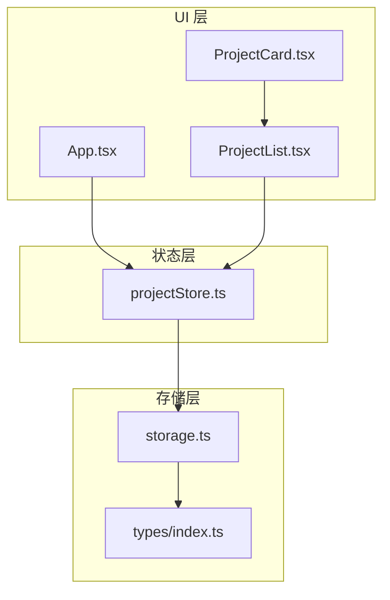
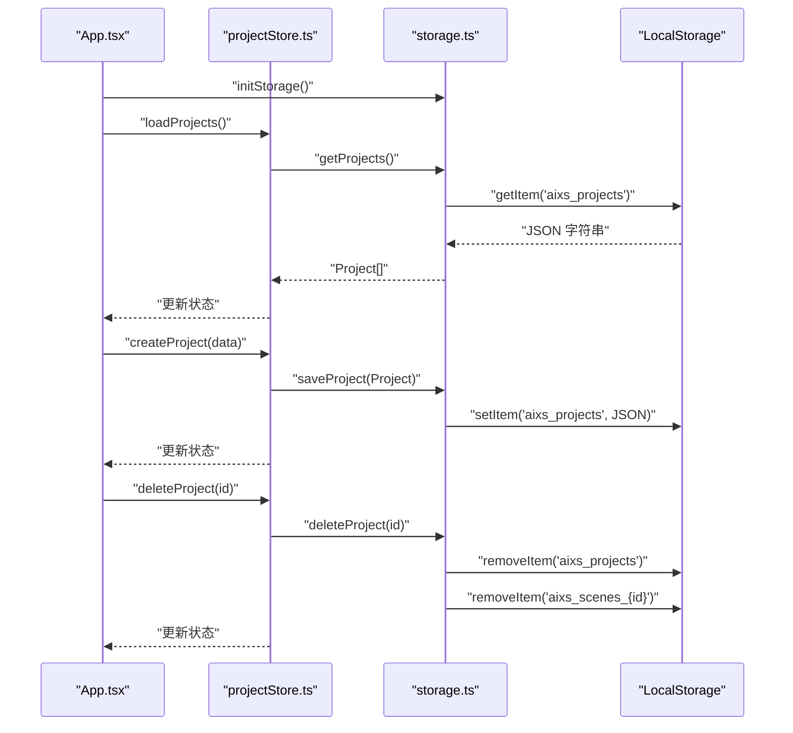
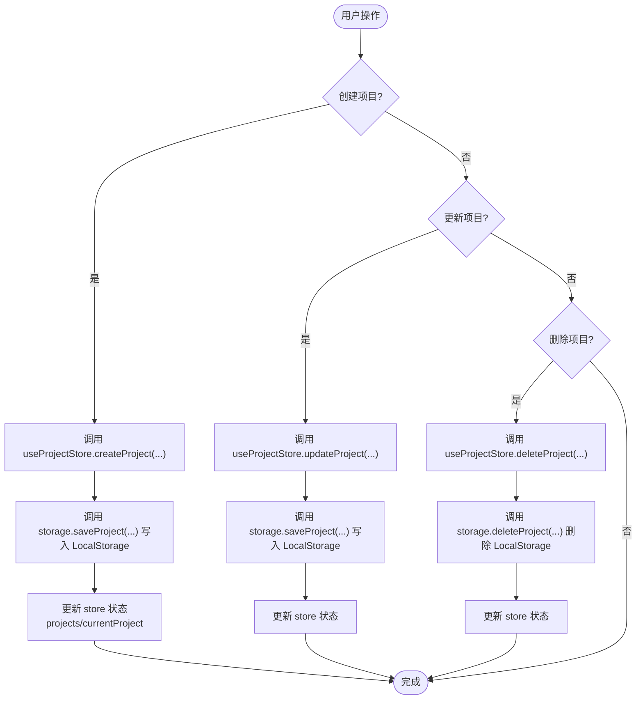
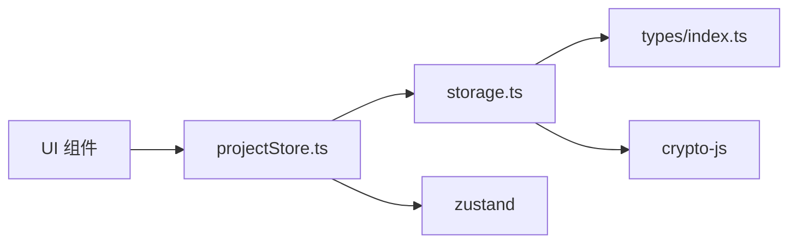

# 项目持久化

<cite>
**本文引用的文件**
- [storage.ts](file://manga-creator/src/lib/storage.ts)
- [projectStore.ts](file://manga-creator/src/stores/projectStore.ts)
- [types/index.ts](file://manga-creator/src/types/index.ts)
- [App.tsx](file://manga-creator/src/App.tsx)
- [ProjectList.tsx](file://manga-creator/src/components/ProjectList.tsx)
- [ProjectCard.tsx](file://manga-creator/src/components/ProjectCard.tsx)
- [storage.test.ts](file://manga-creator/src/lib/storage.test.ts)
</cite>

## 目录
1. [简介](#简介)
2. [项目结构](#项目结构)
3. [核心组件](#核心组件)
4. [架构总览](#架构总览)
5. [详细组件分析](#详细组件分析)
6. [依赖分析](#依赖分析)
7. [性能考虑](#性能考虑)
8. [故障排查指南](#故障排查指南)
9. [结论](#结论)
10. [附录](#附录)

## 简介
本文件深入解析项目在浏览器端的持久化机制，重点围绕以下目标：
- 解析 storage.ts 中 getProjects、saveProject、deleteProject 等方法的实现逻辑与数据流
- 说明项目数据在 LocalStorage 中的存储结构与键名规范（如 aixs_projects），以及版本控制机制（STORAGE_VERSION）
- 结合 projectStore.ts 的状态管理流程，阐述前端状态与本地存储的同步策略，涵盖项目创建、更新、删除时的数据流传递路径
- 说明加密机制（encrypt/decrypt）在项目数据中的应用（如对用户配置进行加密存储）
- 描述错误处理与异常捕获策略
- 提供性能优化建议（如批量操作时的性能考量）
- 给出实际代码示例展示项目 CRUD 操作的完整调用链

## 项目结构
项目采用“类型定义 + 存储层 + 状态层 + UI 层”的分层组织：
- 类型定义：集中于 types/index.ts，明确 Project、Scene、UserConfig 等核心数据结构
- 存储层：storage.ts 实现 LocalStorage 的读写、版本迁移、加密解密、导出导入、清理统计等功能
- 状态层：projectStore.ts 使用 Zustand 管理项目列表、当前项目、加载状态，并与 storage.ts 协同
- UI 层：App.tsx 初始化存储与加载数据；ProjectList.tsx、ProjectCard.tsx 展示与交互

图表来源
- [App.tsx](file://manga-creator/src/App.tsx#L1-L81)
- [ProjectList.tsx](file://manga-creator/src/components/ProjectList.tsx#L1-L196)
- [ProjectCard.tsx](file://manga-creator/src/components/ProjectCard.tsx#L1-L110)
- [projectStore.ts](file://manga-creator/src/stores/projectStore.ts#L1-L95)
- [storage.ts](file://manga-creator/src/lib/storage.ts#L1-L246)
- [types/index.ts](file://manga-creator/src/types/index.ts#L1-L351)

章节来源
- [App.tsx](file://manga-creator/src/App.tsx#L1-L81)
- [ProjectList.tsx](file://manga-creator/src/components/ProjectList.tsx#L1-L196)
- [ProjectCard.tsx](file://manga-creator/src/components/ProjectCard.tsx#L1-L110)
- [projectStore.ts](file://manga-creator/src/stores/projectStore.ts#L1-L95)
- [storage.ts](file://manga-creator/src/lib/storage.ts#L1-L246)
- [types/index.ts](file://manga-creator/src/types/index.ts#L1-L351)

## 核心组件
- 存储层（storage.ts）
  - 加密工具：encrypt/decrypt，用于保护敏感配置（如用户 API 密钥）
  - 键名常量：VERSION、PROJECTS、CONFIG、scenesFor(projectId)
  - 版本迁移：initStorage 通过 STORAGE_VERSION 管理版本，预留迁移钩子
  - 项目 CRUD：getProjects、getProject、saveProject、deleteProject
  - 分镜 CRUD：getScenes、getScene、saveScenes、saveScene
  - 配置 CRUD：getConfig、saveConfig、clearConfig
  - 数据导出/导入：exportData、importData
  - 清理与维护：clearAllData、getStorageUsage

- 状态层（projectStore.ts）
  - 状态字段：projects、currentProject、isLoading
  - 行为方法：loadProjects、loadProject、createProject、updateProject、deleteProject、setCurrentProject
  - 与存储层协作：直接调用 storage.ts 的方法，保证本地存储与前端状态一致

- 类型定义（types/index.ts）
  - Project、Scene、UserConfig 等核心类型，以及 LocalStorageSchema 对键名与结构的约束性注释

章节来源
- [storage.ts](file://manga-creator/src/lib/storage.ts#L1-L246)
- [projectStore.ts](file://manga-creator/src/stores/projectStore.ts#L1-L95)
- [types/index.ts](file://manga-creator/src/types/index.ts#L1-L351)

## 架构总览
前端持久化整体流程如下：
- 应用启动时执行 initStorage 完成版本校验与迁移
- 页面加载时触发 loadProjects，从 LocalStorage 读取项目列表并填充到状态
- 用户操作（新建/编辑/删除）通过 projectStore 的方法调用 storage.ts 的对应函数
- storage.ts 将数据以 JSON 字符串形式写入 LocalStorage，键名遵循 aixs_* 前缀规范
- 分镜数据按项目维度独立存储，删除项目时同步清理对应分镜

图表来源
- [App.tsx](file://manga-creator/src/App.tsx#L1-L81)
- [projectStore.ts](file://manga-creator/src/stores/projectStore.ts#L1-L95)
- [storage.ts](file://manga-creator/src/lib/storage.ts#L1-L246)

## 详细组件分析

### 存储层（storage.ts）深度解析
- 加密与解密
  - encrypt/decrypt 使用对称加密算法，密钥固定，确保用户配置（如 API 密钥）在本地安全存储
  - 配置读取时先解密，再反序列化；保存时先序列化，再加密
  - 该机制仅应用于用户配置项，不涉及项目与分镜数据

- 键名规范与版本控制
  - 版本键：aixs_version
  - 项目集合键：aixs_projects
  - 配置键：aixs_config（加密存储）
  - 分镜键：aixs_scenes_{projectId}
  - 版本控制：STORAGE_VERSION 为 1.0.0；initStorage 在启动时检查并迁移，预留迁移钩子

- 项目 CRUD
  - getProjects：从 aixs_projects 读取 JSON，解析为 Project[]
  - getProject：基于 getProjects 的结果查找指定 id
  - saveProject：若存在相同 id 则更新，否则新增；统一更新 updatedAt；写回 aixs_projects
  - deleteProject：过滤掉指定 id 的项目并写回；同时删除对应分镜键 aixs_scenes_{id}

- 分镜 CRUD
  - getScenes：按项目 id 读取 aixs_scenes_{id}，解析为 Scene[]
  - saveScenes：整包覆盖写入
  - getScene/saveScene：按 id 查找或替换，最终委托 saveScenes

- 配置 CRUD
  - getConfig：读取 aixs_config 并解密，解析为 UserConfig
  - saveConfig：序列化 UserConfig 后加密并写入
  - clearConfig：移除配置键

- 数据导出/导入与清理
  - exportData：聚合当前版本、项目列表、各项目分镜，输出可导入的 JSON
  - importData：将项目与分镜分别写回对应键
  - clearAllData：遍历 LocalStorage，删除以 aixs_ 开头的键，保留版本号
  - getStorageUsage：统计 aixs_ 前缀键占用字节数

- 错误处理与异常捕获
  - 读取/解析 JSON 失败时返回空集合或空值，并记录错误日志
  - 写入/删除过程中抛出业务错误（如“项目保存失败”），便于上层提示

章节来源
- [storage.ts](file://manga-creator/src/lib/storage.ts#L1-L246)
- [types/index.ts](file://manga-creator/src/types/index.ts#L1-L351)

### 状态层（projectStore.ts）与 UI 的协同
- 初始化与加载
  - App.tsx 在挂载时调用 initStorage、loadProjects、loadConfig
  - loadProjects 设置 isLoading=true，调用 getProjects 后重置为 false

- 项目创建
  - createProject 生成唯一 id、时间戳与默认工作流状态，调用 saveProject 后将新项目追加至状态并设为当前项目

- 项目更新
  - updateProject 计算更新后的项目，调用 saveProject，并在状态中替换对应条目，同时更新当前项目

- 项目删除
  - deleteProject 调用 storage.deleteProject，随后在状态中过滤掉该项目并清空当前项目

- 当前项目切换
  - setCurrentProject 直接设置当前项目，不涉及存储层

- UI 交互
  - ProjectList.tsx 通过 useProjectStore 获取 projects，提供创建与删除入口
  - ProjectCard.tsx 展示项目信息与进度条，支持打开与删除

图表来源
- [projectStore.ts](file://manga-creator/src/stores/projectStore.ts#L1-L95)
- [storage.ts](file://manga-creator/src/lib/storage.ts#L1-L246)
- [ProjectList.tsx](file://manga-creator/src/components/ProjectList.tsx#L1-L196)
- [ProjectCard.tsx](file://manga-creator/src/components/ProjectCard.tsx#L1-L110)

章节来源
- [projectStore.ts](file://manga-creator/src/stores/projectStore.ts#L1-L95)
- [ProjectList.tsx](file://manga-creator/src/components/ProjectList.tsx#L1-L196)
- [ProjectCard.tsx](file://manga-creator/src/components/ProjectCard.tsx#L1-L110)
- [App.tsx](file://manga-creator/src/App.tsx#L1-L81)

### 数据模型与键名规范
- 项目集合键：aixs_projects
- 分镜集合键：aixs_scenes_{projectId}
- 配置键：aixs_config（加密）
- 版本键：aixs_version
- LocalStorageSchema（类型注释）明确了上述键与值类型的约束

章节来源
- [types/index.ts](file://manga-creator/src/types/index.ts#L150-L161)
- [storage.ts](file://manga-creator/src/lib/storage.ts#L20-L30)

### 加密机制说明
- 适用范围：仅用于用户配置（UserConfig），不涉及项目与分镜数据
- 加密流程：保存前 JSON 序列化，再 AES 加密；读取时先解密，再反序列化
- 安全性：密钥固定，适合本地存储场景；若需更强安全性，可引入动态密钥或更复杂的密钥管理

章节来源
- [storage.ts](file://manga-creator/src/lib/storage.ts#L1-L246)
- [types/index.ts](file://manga-creator/src/types/index.ts#L80-L95)

### 错误处理与异常捕获
- 读取失败：JSON 解析异常时返回空集合或空值，并打印错误日志
- 写入失败：抛出业务错误（如“项目保存失败”），便于 UI 层提示
- 配置损坏：读取配置时异常返回 null，避免影响其他流程
- 迁移日志：版本迁移时输出迁移日志，便于追踪

章节来源
- [storage.ts](file://manga-creator/src/lib/storage.ts#L52-L122)
- [storage.ts](file://manga-creator/src/lib/storage.ts#L151-L173)
- [storage.ts](file://manga-creator/src/lib/storage.ts#L183-L218)

## 依赖分析
- 组件耦合
  - projectStore 依赖 storage.ts 的 getProjects/saveProject/deleteProject/getProject
  - UI 组件通过 useProjectStore 间接依赖 storage.ts
- 外部依赖
  - crypto-js：用于 AES 加密解密
  - zustand：用于状态管理
- 循环依赖
  - 无循环依赖：storage.ts 不依赖 store，store 依赖 storage.ts

图表来源
- [projectStore.ts](file://manga-creator/src/stores/projectStore.ts#L1-L95)
- [storage.ts](file://manga-creator/src/lib/storage.ts#L1-L246)
- [types/index.ts](file://manga-creator/src/types/index.ts#L1-L351)

章节来源
- [projectStore.ts](file://manga-creator/src/stores/projectStore.ts#L1-L95)
- [storage.ts](file://manga-creator/src/lib/storage.ts#L1-L246)
- [types/index.ts](file://manga-creator/src/types/index.ts#L1-L351)

## 性能考虑
- 读写粒度
  - 项目列表：一次性读取 aixs_projects，避免多次 IO
  - 分镜：按项目维度读取 aixs_scenes_{id}，减少无关数据传输
- 批量操作
  - saveScenes 采用整包覆盖写入，适合批量场景；若需要更细粒度更新，可在 UI 层合并后再调用 saveScenes
- 存储容量
  - getStorageUsage 仅统计 aixs_ 前缀键，便于监控；LocalStorage 通常限制 5-10MB
- 事件与渲染
  - loadProjects 设置 isLoading，避免频繁重渲染
  - updateProject 仅替换匹配项，减少不必要的状态变更

[本节为通用性能建议，无需特定文件引用]

## 故障排查指南
- 项目列表为空
  - 检查 aixs_projects 是否存在且 JSON 可解析
  - 若损坏，可尝试导入备份或清空后重新创建
- 项目更新未生效
  - 确认 saveProject 是否被调用，以及 updatedAt 是否更新
  - 检查 LocalStorage 中 aixs_projects 是否被覆盖
- 删除项目后分镜未清理
  - 确认 deleteProject 是否调用并删除了 aixs_scenes_{id}
- 配置读取失败
  - 检查 aixs_config 是否被正确加密与解密
  - 若损坏，可 clearConfig 后重新保存
- 导入/导出异常
  - 导入无效 JSON 会抛出业务错误，检查导出格式与内容
  - 导出后再导入应保持一致性，验证字段完整性

章节来源
- [storage.test.ts](file://manga-creator/src/lib/storage.test.ts#L1-L946)
- [storage.ts](file://manga-creator/src/lib/storage.ts#L183-L246)

## 结论
本项目采用 LocalStorage 作为前端持久化介质，通过明确的键名规范与版本控制，确保数据结构稳定与可迁移。状态层与存储层职责清晰，UI 通过 store 与 storage 协同，形成“状态驱动存储”的闭环。加密机制仅用于敏感配置，兼顾安全与易用。测试覆盖了加密、初始化、CRUD、导入导出、清理与边界场景，保障了功能可靠性。建议在后续迭代中完善版本迁移逻辑与更细粒度的批量更新策略，以进一步提升性能与用户体验。

[本节为总结性内容，无需特定文件引用]

## 附录

### 项目 CRUD 调用链示例（路径参考）
- 创建项目
  - UI：ProjectList.handleCreate -> useProjectStore.createProject(...)
  - 状态层：projectStore.ts createProject -> storage.saveProject(...)
  - 存储层：storage.ts saveProject -> LocalStorage.aixs_projects
- 更新项目
  - UI：编辑表单提交 -> useProjectStore.updateProject(...)
  - 状态层：projectStore.ts updateProject -> storage.saveProject(...)
  - 存储层：storage.ts saveProject -> LocalStorage.aixs_projects
- 删除项目
  - UI：ProjectCard 删除按钮 -> useProjectStore.deleteProject(...)
  - 状态层：projectStore.ts deleteProject -> storage.deleteProject(...)
  - 存储层：storage.ts deleteProject -> LocalStorage.aixs_projects 与 aixs_scenes_{id}

章节来源
- [ProjectList.tsx](file://manga-creator/src/components/ProjectList.tsx#L1-L196)
- [projectStore.ts](file://manga-creator/src/stores/projectStore.ts#L1-L95)
- [storage.ts](file://manga-creator/src/lib/storage.ts#L68-L98)