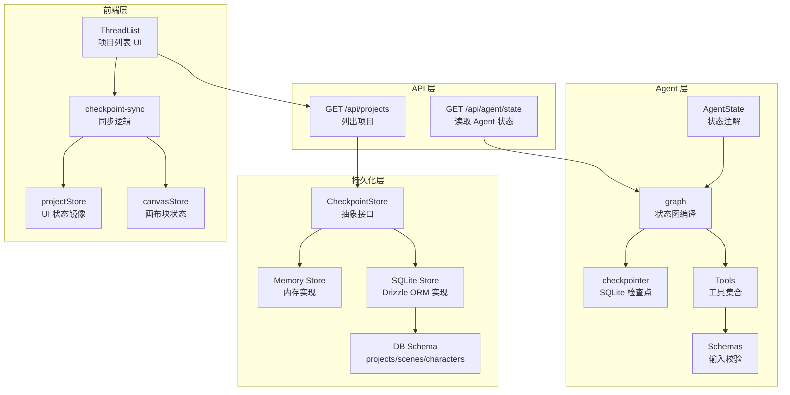
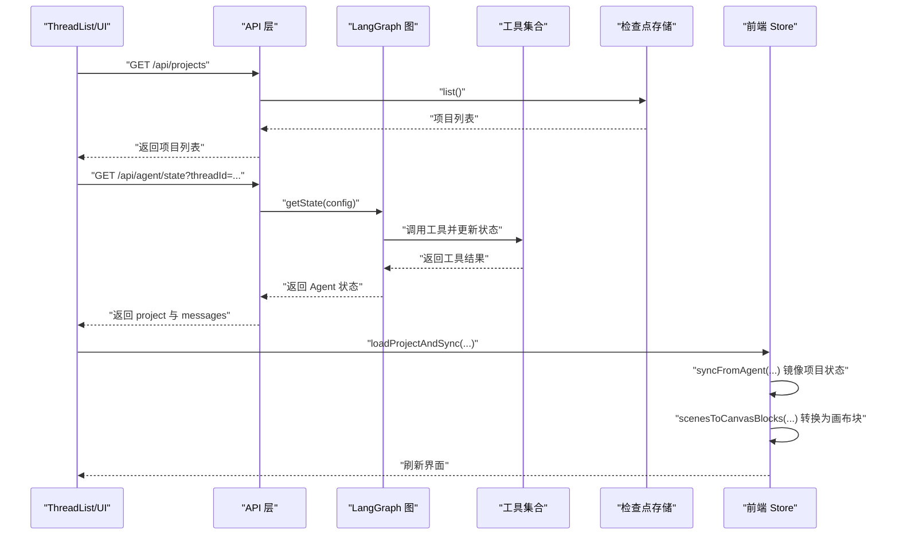
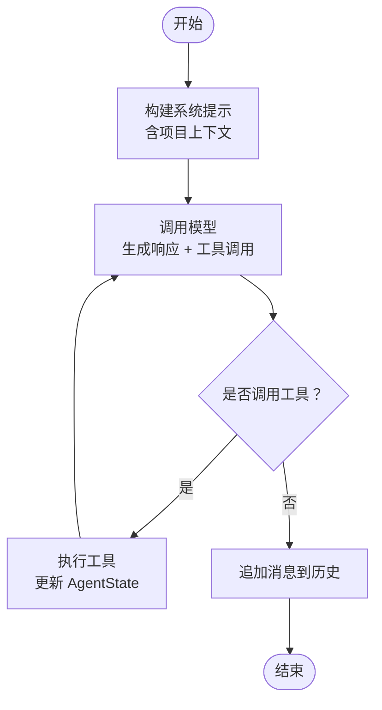
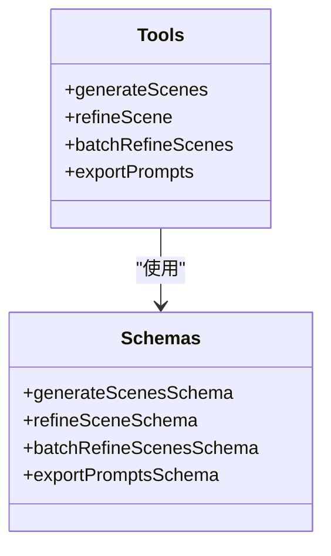
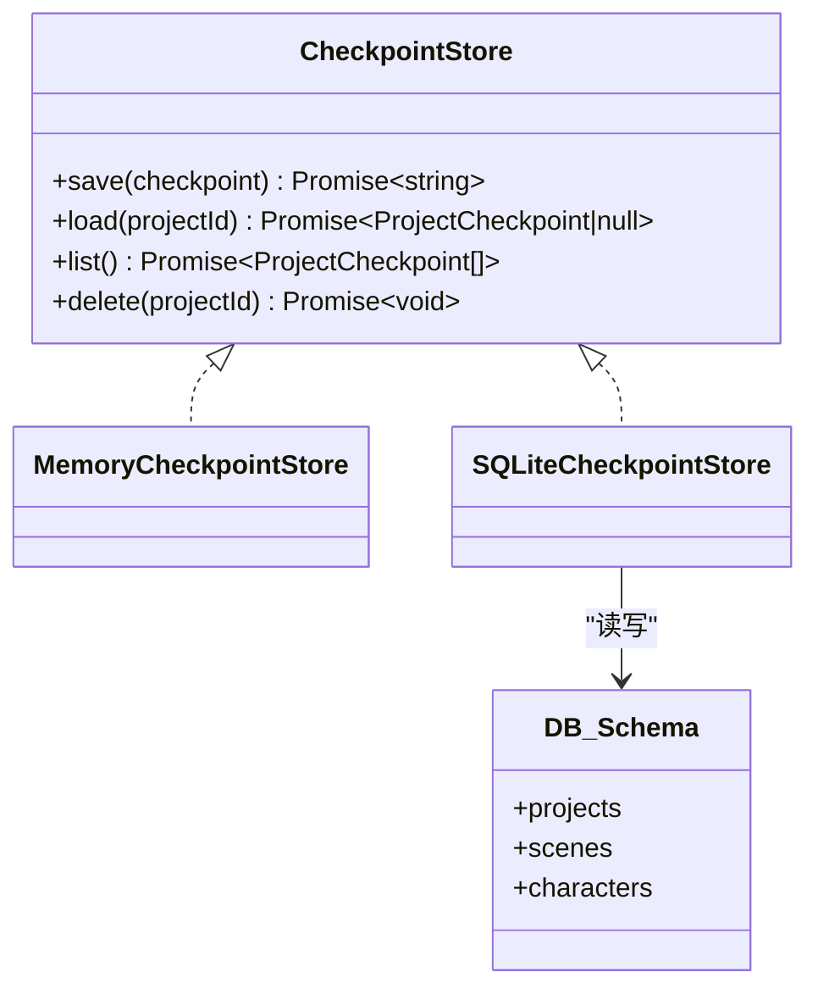
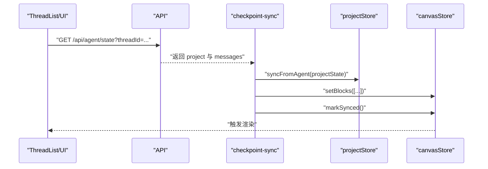
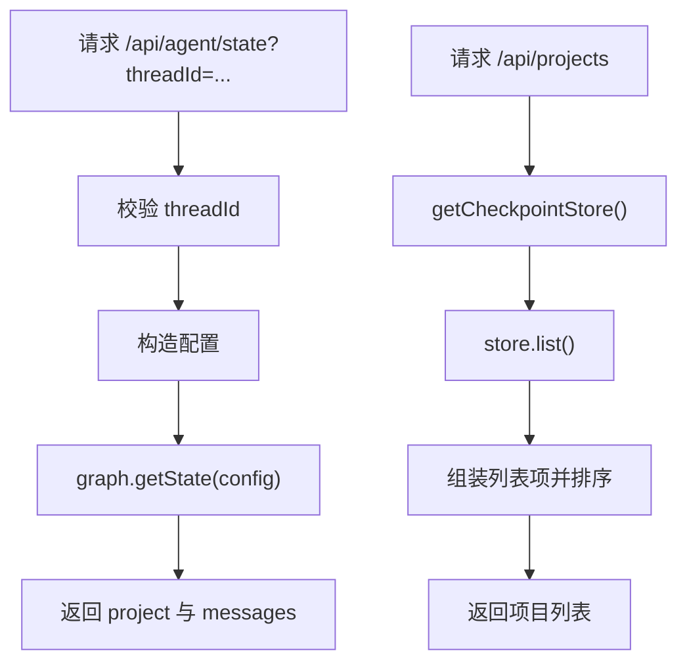
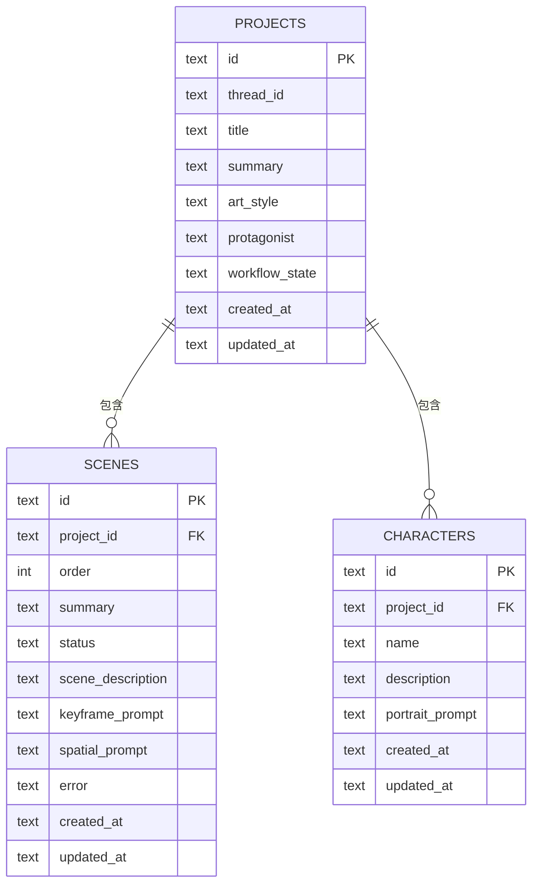
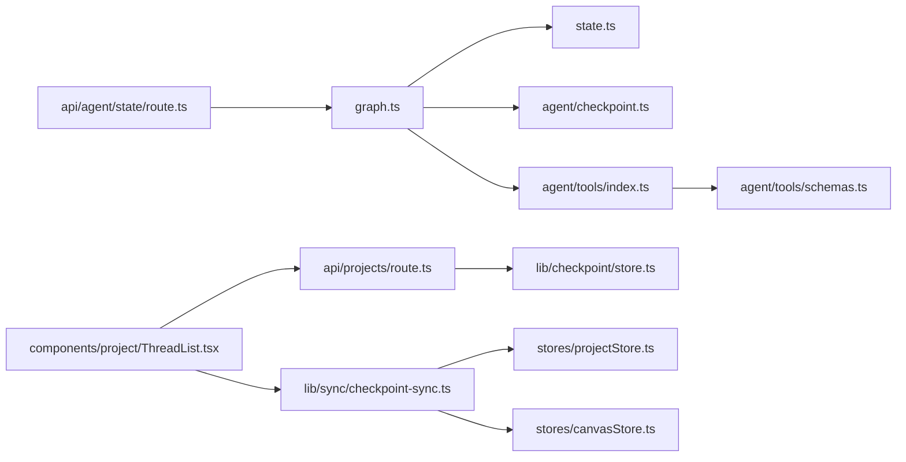

# LangGraph 状态管理

<cite>
**本文引用的文件**
- [manga-creator-beta/src/lib/agent/state.ts](file://manga-creator-beta/src/lib/agent/state.ts)
- [manga-creator-beta/src/lib/agent/graph.ts](file://manga-creator-beta/src/lib/agent/graph.ts)
- [manga-creator-beta/src/lib/agent/checkpoint.ts](file://manga-creator-beta/src/lib/agent/checkpoint.ts)
- [manga-creator-beta/src/lib/agent/tools/index.ts](file://manga-creator-beta/src/lib/agent/tools/index.ts)
- [manga-creator-beta/src/lib/agent/tools/schemas.ts](file://manga-creator-beta/src/lib/agent/tools/schemas.ts)
- [manga-creator-beta/src/lib/checkpoint/store.ts](file://manga-creator-beta/src/lib/checkpoint/store.ts)
- [manga-creator-beta/src/lib/checkpoint/sqlite-store.ts](file://manga-creator-beta/src/lib/checkpoint/sqlite-store.ts)
- [manga-creator-beta/src/lib/db/schema.ts](file://manga-creator-beta/src/lib/db/schema.ts)
- [manga-creator-beta/src/lib/sync/checkpoint-sync.ts](file://manga-creator-beta/src/lib/sync/checkpoint-sync.ts)
- [manga-creator-beta/src/stores/projectStore.ts](file://manga-creator-beta/src/stores/projectStore.ts)
- [manga-creator-beta/src/stores/canvasStore.ts](file://manga-creator-beta/src/stores/canvasStore.ts)
- [manga-creator-beta/src/app/api/agent/state/route.ts](file://manga-creator-beta/src/app/api/agent/state/route.ts)
- [manga-creator-beta/src/app/api/projects/route.ts](file://manga-creator-beta/src/app/api/projects/route.ts)
- [manga-creator-beta/src/types/index.ts](file://manga-creator-beta/src/types/index.ts)
- [manga-creator-beta/src/components/project/ThreadList.tsx](file://manga-creator-beta/src/components/project/ThreadList.tsx)
</cite>

## 目录
1. [引言](#引言)
2. [项目结构](#项目结构)
3. [核心组件](#核心组件)
4. [架构总览](#架构总览)
5. [详细组件分析](#详细组件分析)
6. [依赖关系分析](#依赖关系分析)
7. [性能考量](#性能考量)
8. [故障排查指南](#故障排查指南)
9. [结论](#结论)
10. [附录](#附录)

## 引言
本文件系统性梳理了基于 LangGraph 的漫画创作项目在“状态管理”方面的设计与实现，覆盖以下方面：
- LangGraph Agent 的状态定义与图编译
- 工具链与消息历史的集成
- 检查点存储与持久化策略
- 前端 UI 状态镜像与同步机制
- API 层对 Agent 状态的读取与项目列表管理
- 数据模型与类型约束

目标是帮助读者快速理解从“对话与工具执行”到“前端可视化”的完整状态流转路径，并提供可操作的优化建议与排障指引。

## 项目结构
围绕“状态管理”，本仓库的关键目录与文件如下：
- Agent 定义与状态：lib/agent/state.ts、lib/agent/graph.ts、lib/agent/checkpoint.ts
- 工具与输入校验：lib/agent/tools/index.ts、lib/agent/tools/schemas.ts
- 检查点与持久化：lib/checkpoint/store.ts、lib/checkpoint/sqlite-store.ts、lib/db/schema.ts
- 前端状态镜像：stores/projectStore.ts、stores/canvasStore.ts
- 同步与 API：lib/sync/checkpoint-sync.ts、app/api/agent/state/route.ts、app/api/projects/route.ts
- 类型定义：types/index.ts
- UI 交互：components/project/ThreadList.tsx

图表来源
- [manga-creator-beta/src/lib/agent/state.ts](file://manga-creator-beta/src/lib/agent/state.ts#L1-L47)
- [manga-creator-beta/src/lib/agent/graph.ts](file://manga-creator-beta/src/lib/agent/graph.ts#L1-L68)
- [manga-creator-beta/src/lib/agent/checkpoint.ts](file://manga-creator-beta/src/lib/agent/checkpoint.ts#L1-L23)
- [manga-creator-beta/src/lib/agent/tools/index.ts](file://manga-creator-beta/src/lib/agent/tools/index.ts#L1-L79)
- [manga-creator-beta/src/lib/agent/tools/schemas.ts](file://manga-creator-beta/src/lib/agent/tools/schemas.ts#L1-L153)
- [manga-creator-beta/src/lib/checkpoint/store.ts](file://manga-creator-beta/src/lib/checkpoint/store.ts#L1-L152)
- [manga-creator-beta/src/lib/checkpoint/sqlite-store.ts](file://manga-creator-beta/src/lib/checkpoint/sqlite-store.ts#L1-L201)
- [manga-creator-beta/src/lib/db/schema.ts](file://manga-creator-beta/src/lib/db/schema.ts#L1-L59)
- [manga-creator-beta/src/lib/sync/checkpoint-sync.ts](file://manga-creator-beta/src/lib/sync/checkpoint-sync.ts#L1-L163)
- [manga-creator-beta/src/stores/projectStore.ts](file://manga-creator-beta/src/stores/projectStore.ts#L1-L69)
- [manga-creator-beta/src/stores/canvasStore.ts](file://manga-creator-beta/src/stores/canvasStore.ts#L1-L89)
- [manga-creator-beta/src/app/api/agent/state/route.ts](file://manga-creator-beta/src/app/api/agent/state/route.ts#L1-L25)
- [manga-creator-beta/src/app/api/projects/route.ts](file://manga-creator-beta/src/app/api/projects/route.ts#L1-L44)

章节来源
- [manga-creator-beta/src/lib/agent/state.ts](file://manga-creator-beta/src/lib/agent/state.ts#L1-L47)
- [manga-creator-beta/src/lib/agent/graph.ts](file://manga-creator-beta/src/lib/agent/graph.ts#L1-L68)
- [manga-creator-beta/src/lib/checkpoint/store.ts](file://manga-creator-beta/src/lib/checkpoint/store.ts#L1-L152)
- [manga-creator-beta/src/lib/checkpoint/sqlite-store.ts](file://manga-creator-beta/src/lib/checkpoint/sqlite-store.ts#L1-L201)
- [manga-creator-beta/src/lib/db/schema.ts](file://manga-creator-beta/src/lib/db/schema.ts#L1-L59)
- [manga-creator-beta/src/lib/sync/checkpoint-sync.ts](file://manga-creator-beta/src/lib/sync/checkpoint-sync.ts#L1-L163)
- [manga-creator-beta/src/stores/projectStore.ts](file://manga-creator-beta/src/stores/projectStore.ts#L1-L69)
- [manga-creator-beta/src/stores/canvasStore.ts](file://manga-creator-beta/src/stores/canvasStore.ts#L1-L89)
- [manga-creator-beta/src/app/api/agent/state/route.ts](file://manga-creator-beta/src/app/api/agent/state/route.ts#L1-L25)
- [manga-creator-beta/src/app/api/projects/route.ts](file://manga-creator-beta/src/app/api/projects/route.ts#L1-L44)
- [manga-creator-beta/src/types/index.ts](file://manga-creator-beta/src/types/index.ts#L1-L154)
- [manga-creator-beta/src/components/project/ThreadList.tsx](file://manga-creator-beta/src/components/project/ThreadList.tsx#L1-L244)

## 核心组件
- Agent 状态注解与默认值：定义项目域状态与对话历史的合并策略。
- 图与节点：定义单节点“agent”循环，结合工具与消息历史进行多步推理。
- 检查点：LangGraph 的 SQLite 检查点与应用侧的内存/SQLite 存储。
- 工具与输入校验：场景生成、细化、批量细化、导出提示等工具及 JSON Schema。
- 前端镜像与同步：projectStore/canvasStore 与后端状态的双向同步。
- API：读取 Agent 状态与列出项目。

章节来源
- [manga-creator-beta/src/lib/agent/state.ts](file://manga-creator-beta/src/lib/agent/state.ts#L1-L47)
- [manga-creator-beta/src/lib/agent/graph.ts](file://manga-creator-beta/src/lib/agent/graph.ts#L1-L68)
- [manga-creator-beta/src/lib/agent/checkpoint.ts](file://manga-creator-beta/src/lib/agent/checkpoint.ts#L1-L23)
- [manga-creator-beta/src/lib/agent/tools/index.ts](file://manga-creator-beta/src/lib/agent/tools/index.ts#L1-L79)
- [manga-creator-beta/src/lib/agent/tools/schemas.ts](file://manga-creator-beta/src/lib/agent/tools/schemas.ts#L1-L153)
- [manga-creator-beta/src/lib/checkpoint/store.ts](file://manga-creator-beta/src/lib/checkpoint/store.ts#L1-L152)
- [manga-creator-beta/src/lib/checkpoint/sqlite-store.ts](file://manga-creator-beta/src/lib/checkpoint/sqlite-store.ts#L1-L201)
- [manga-creator-beta/src/lib/sync/checkpoint-sync.ts](file://manga-creator-beta/src/lib/sync/checkpoint-sync.ts#L1-L163)
- [manga-creator-beta/src/stores/projectStore.ts](file://manga-creator-beta/src/stores/projectStore.ts#L1-L69)
- [manga-creator-beta/src/stores/canvasStore.ts](file://manga-creator-beta/src/stores/canvasStore.ts#L1-L89)
- [manga-creator-beta/src/app/api/agent/state/route.ts](file://manga-creator-beta/src/app/api/agent/state/route.ts#L1-L25)
- [manga-creator-beta/src/app/api/projects/route.ts](file://manga-creator-beta/src/app/api/projects/route.ts#L1-L44)

## 架构总览
下图展示从“前端交互”到“LangGraph Agent 执行”再到“持久化与 UI 同步”的全链路。

图表来源
- [manga-creator-beta/src/app/api/projects/route.ts](file://manga-creator-beta/src/app/api/projects/route.ts#L1-L44)
- [manga-creator-beta/src/app/api/agent/state/route.ts](file://manga-creator-beta/src/app/api/agent/state/route.ts#L1-L25)
- [manga-creator-beta/src/lib/agent/graph.ts](file://manga-creator-beta/src/lib/agent/graph.ts#L1-L68)
- [manga-creator-beta/src/lib/agent/tools/index.ts](file://manga-creator-beta/src/lib/agent/tools/index.ts#L1-L79)
- [manga-creator-beta/src/lib/sync/checkpoint-sync.ts](file://manga-creator-beta/src/lib/sync/checkpoint-sync.ts#L1-L163)
- [manga-creator-beta/src/stores/projectStore.ts](file://manga-creator-beta/src/stores/projectStore.ts#L1-L69)
- [manga-creator-beta/src/stores/canvasStore.ts](file://manga-creator-beta/src/stores/canvasStore.ts#L1-L89)

## 详细组件分析

### Agent 状态与图编译
- 状态注解
  - 项目域状态：包含项目标识、标题、摘要、画风、主角、工作流状态、分镜数组、当前分镜索引、画布内容、角色列表、时间戳等；提供浅合并的 reducer，便于工具按需更新字段。
  - 对话历史：采用追加式 reducer，将每次模型输出的消息拼接到历史列表。
- 图编译
  - 单节点“agent”，从 START 到 agent 再到 END；编译时注入检查点器，支持断点恢复与状态回放。
- 模型与工具
  - 使用 Vercel AI SDK 调用模型，传入系统提示与历史消息，启用工具调用循环，限制最大步数以避免无限循环。

图表来源
- [manga-creator-beta/src/lib/agent/graph.ts](file://manga-creator-beta/src/lib/agent/graph.ts#L1-L68)
- [manga-creator-beta/src/lib/agent/state.ts](file://manga-creator-beta/src/lib/agent/state.ts#L1-L47)

章节来源
- [manga-creator-beta/src/lib/agent/state.ts](file://manga-creator-beta/src/lib/agent/state.ts#L1-L47)
- [manga-creator-beta/src/lib/agent/graph.ts](file://manga-creator-beta/src/lib/agent/graph.ts#L1-L68)

### 工具与输入校验
- 工具清单
  - 生成分镜：根据故事概要生成若干分镜。
  - 细化单个分镜：为指定分镜生成详细描述与提示词。
  - 批量细化分镜：对多个分镜进行批量细化。
  - 导出提示：将项目提示导出为多种格式。
- 输入校验
  - 使用 JSON Schema 定义工具输入，避免类型不一致导致的错误。

图表来源
- [manga-creator-beta/src/lib/agent/tools/index.ts](file://manga-creator-beta/src/lib/agent/tools/index.ts#L1-L79)
- [manga-creator-beta/src/lib/agent/tools/schemas.ts](file://manga-creator-beta/src/lib/agent/tools/schemas.ts#L1-L153)

章节来源
- [manga-creator-beta/src/lib/agent/tools/index.ts](file://manga-creator-beta/src/lib/agent/tools/index.ts#L1-L79)
- [manga-creator-beta/src/lib/agent/tools/schemas.ts](file://manga-creator-beta/src/lib/agent/tools/schemas.ts#L1-L153)

### 检查点存储与持久化
- 抽象接口
  - CheckpointStore 提供 save/load/list/delete 四类操作，统一内存与 SQLite 存储。
- 内存存储
  - 适合开发与测试，数据不持久化。
- SQLite 存储
  - 使用 Drizzle ORM 访问 projects/scenes/characters 表，支持项目与分镜的增删改查与级联删除。
- LangGraph 检查点
  - 使用 SqliteSaver 将 Agent 的检查点与应用数据库共享，便于跨会话恢复。

图表来源
- [manga-creator-beta/src/lib/checkpoint/store.ts](file://manga-creator-beta/src/lib/checkpoint/store.ts#L1-L152)
- [manga-creator-beta/src/lib/checkpoint/sqlite-store.ts](file://manga-creator-beta/src/lib/checkpoint/sqlite-store.ts#L1-L201)
- [manga-creator-beta/src/lib/db/schema.ts](file://manga-creator-beta/src/lib/db/schema.ts#L1-L59)
- [manga-creator-beta/src/lib/agent/checkpoint.ts](file://manga-creator-beta/src/lib/agent/checkpoint.ts#L1-L23)

章节来源
- [manga-creator-beta/src/lib/checkpoint/store.ts](file://manga-creator-beta/src/lib/checkpoint/store.ts#L1-L152)
- [manga-creator-beta/src/lib/checkpoint/sqlite-store.ts](file://manga-creator-beta/src/lib/checkpoint/sqlite-store.ts#L1-L201)
- [manga-creator-beta/src/lib/db/schema.ts](file://manga-creator-beta/src/lib/db/schema.ts#L1-L59)
- [manga-creator-beta/src/lib/agent/checkpoint.ts](file://manga-creator-beta/src/lib/agent/checkpoint.ts#L1-L23)

### 前端状态镜像与同步
- projectStore
  - 管理 UI 状态（加载、线程、生成状态、错误）与 Agent 状态镜像（projectState），提供同步动作。
- canvasStore
  - 管理画布块（基础信息块、分镜块），支持增删改与脏标记。
- 同步流程
  - 通过 API 读取 Agent 状态，转换为画布块并写入 canvasStore，同时将项目状态写入 projectStore。
  - 提供轮询订阅，基于 updatedAt 变更检测，定时拉取最新状态。

图表来源
- [manga-creator-beta/src/lib/sync/checkpoint-sync.ts](file://manga-creator-beta/src/lib/sync/checkpoint-sync.ts#L1-L163)
- [manga-creator-beta/src/stores/projectStore.ts](file://manga-creator-beta/src/stores/projectStore.ts#L1-L69)
- [manga-creator-beta/src/stores/canvasStore.ts](file://manga-creator-beta/src/stores/canvasStore.ts#L1-L89)
- [manga-creator-beta/src/app/api/agent/state/route.ts](file://manga-creator-beta/src/app/api/agent/state/route.ts#L1-L25)

章节来源
- [manga-creator-beta/src/lib/sync/checkpoint-sync.ts](file://manga-creator-beta/src/lib/sync/checkpoint-sync.ts#L1-L163)
- [manga-creator-beta/src/stores/projectStore.ts](file://manga-creator-beta/src/stores/projectStore.ts#L1-L69)
- [manga-creator-beta/src/stores/canvasStore.ts](file://manga-creator-beta/src/stores/canvasStore.ts#L1-L89)
- [manga-creator-beta/src/app/api/agent/state/route.ts](file://manga-creator-beta/src/app/api/agent/state/route.ts#L1-L25)

### API 层
- 读取 Agent 状态
  - 必须提供 threadId，内部构造配置并调用 graph.getState，返回 project 与 messages。
- 项目列表
  - 通过 CheckpointStore.list 返回项目列表，按更新时间倒序排序。

图表来源
- [manga-creator-beta/src/app/api/agent/state/route.ts](file://manga-creator-beta/src/app/api/agent/state/route.ts#L1-L25)
- [manga-creator-beta/src/app/api/projects/route.ts](file://manga-creator-beta/src/app/api/projects/route.ts#L1-L44)
- [manga-creator-beta/src/lib/checkpoint/store.ts](file://manga-creator-beta/src/lib/checkpoint/store.ts#L1-L152)

章节来源
- [manga-creator-beta/src/app/api/agent/state/route.ts](file://manga-creator-beta/src/app/api/agent/state/route.ts#L1-L25)
- [manga-creator-beta/src/app/api/projects/route.ts](file://manga-creator-beta/src/app/api/projects/route.ts#L1-L44)

### 数据模型与类型约束
- 工作流状态与分镜状态枚举
- 项目状态包含基础信息、工作流状态、分镜数组、当前分镜索引、画布内容、角色列表、时间戳。
- UI 状态镜像与画布块类型定义。

图表来源
- [manga-creator-beta/src/lib/db/schema.ts](file://manga-creator-beta/src/lib/db/schema.ts#L1-L59)
- [manga-creator-beta/src/types/index.ts](file://manga-creator-beta/src/types/index.ts#L1-L154)

章节来源
- [manga-creator-beta/src/types/index.ts](file://manga-creator-beta/src/types/index.ts#L1-L154)
- [manga-creator-beta/src/lib/db/schema.ts](file://manga-creator-beta/src/lib/db/schema.ts#L1-L59)

## 依赖关系分析
- 组件耦合
  - Agent 层依赖 LangGraph 与 AI SDK；工具依赖输入校验；图编译依赖检查点器。
  - 前端同步依赖 API；UI 组件依赖 Store；Store 依赖类型定义。
- 外部依赖
  - better-sqlite3、drizzle-orm、@langchain/langgraph、@langchain/langgraph-checkpoint-sqlite、Vercel AI SDK。
- 潜在环依赖
  - 通过模块化拆分，未发现直接环依赖；API 与 Store 之间为单向依赖。

图表来源
- [manga-creator-beta/src/lib/agent/graph.ts](file://manga-creator-beta/src/lib/agent/graph.ts#L1-L68)
- [manga-creator-beta/src/lib/agent/state.ts](file://manga-creator-beta/src/lib/agent/state.ts#L1-L47)
- [manga-creator-beta/src/lib/agent/checkpoint.ts](file://manga-creator-beta/src/lib/agent/checkpoint.ts#L1-L23)
- [manga-creator-beta/src/lib/agent/tools/index.ts](file://manga-creator-beta/src/lib/agent/tools/index.ts#L1-L79)
- [manga-creator-beta/src/lib/agent/tools/schemas.ts](file://manga-creator-beta/src/lib/agent/tools/schemas.ts#L1-L153)
- [manga-creator-beta/src/app/api/agent/state/route.ts](file://manga-creator-beta/src/app/api/agent/state/route.ts#L1-L25)
- [manga-creator-beta/src/app/api/projects/route.ts](file://manga-creator-beta/src/app/api/projects/route.ts#L1-L44)
- [manga-creator-beta/src/lib/sync/checkpoint-sync.ts](file://manga-creator-beta/src/lib/sync/checkpoint-sync.ts#L1-L163)
- [manga-creator-beta/src/stores/projectStore.ts](file://manga-creator-beta/src/stores/projectStore.ts#L1-L69)
- [manga-creator-beta/src/stores/canvasStore.ts](file://manga-creator-beta/src/stores/canvasStore.ts#L1-L89)
- [manga-creator-beta/src/components/project/ThreadList.tsx](file://manga-creator-beta/src/components/project/ThreadList.tsx#L1-L244)

## 性能考量
- 工具调用循环步数限制
  - 在模型调用处设置最大步数，避免长时间循环导致的资源占用。
- 同步轮询频率
  - 轮询间隔为 2 秒，可根据实际需求调整；过短会增加网络与数据库压力，过长会延迟 UI 更新。
- 消息历史增长
  - 消息采用追加式合并，建议在工具执行后清理冗余消息或分页展示，避免历史无限增长。
- 检查点存储
  - SQLite 存储在大项目上可能产生较多行；可定期归档旧项目或裁剪历史记录。

## 故障排查指南
- 缺少环境变量
  - 模型初始化依赖 DEEPSEEK_API_KEY；若缺失会导致运行时错误。请在环境变量中配置。
- 检查点存储切换
  - 通过环境变量控制使用内存或 SQLite 存储；确保路径存在且具备写权限。
- API 返回错误
  - /api/agent/state 需要 threadId；/api/projects 列表异常时检查 CheckpointStore 实现与数据库连接。
- 前端同步失败
  - 确认轮询订阅是否仍在运行；检查 updatedAt 是否变化；查看控制台错误日志。

章节来源
- [manga-creator-beta/src/lib/agent/graph.ts](file://manga-creator-beta/src/lib/agent/graph.ts#L1-L68)
- [manga-creator-beta/src/lib/checkpoint/store.ts](file://manga-creator-beta/src/lib/checkpoint/store.ts#L1-L152)
- [manga-creator-beta/src/lib/checkpoint/sqlite-store.ts](file://manga-creator-beta/src/lib/checkpoint/sqlite-store.ts#L1-L201)
- [manga-creator-beta/src/app/api/agent/state/route.ts](file://manga-creator-beta/src/app/api/agent/state/route.ts#L1-L25)
- [manga-creator-beta/src/app/api/projects/route.ts](file://manga-creator-beta/src/app/api/projects/route.ts#L1-L44)
- [manga-creator-beta/src/lib/sync/checkpoint-sync.ts](file://manga-creator-beta/src/lib/sync/checkpoint-sync.ts#L1-L163)

## 结论
该系统以 LangGraph 为核心，结合工具链与检查点持久化，实现了从“对话与工具执行”到“前端可视化”的闭环状态管理。通过清晰的类型定义、模块化的存储与同步机制，既保证了扩展性，也兼顾了易维护性。建议在生产环境中：
- 明确环境变量与数据库初始化流程
- 控制同步轮询频率与消息历史规模
- 为关键路径添加更细粒度的错误处理与可观测性

## 附录
- 关键文件路径与职责
  - Agent 状态与图：lib/agent/state.ts、lib/agent/graph.ts
  - 检查点：lib/agent/checkpoint.ts、lib/checkpoint/store.ts、lib/checkpoint/sqlite-store.ts、lib/db/schema.ts
  - 工具与校验：lib/agent/tools/index.ts、lib/agent/tools/schemas.ts
  - 前端镜像与同步：stores/projectStore.ts、stores/canvasStore.ts、lib/sync/checkpoint-sync.ts
  - API：app/api/agent/state/route.ts、app/api/projects/route.ts
  - 类型：types/index.ts
  - UI：components/project/ThreadList.tsx