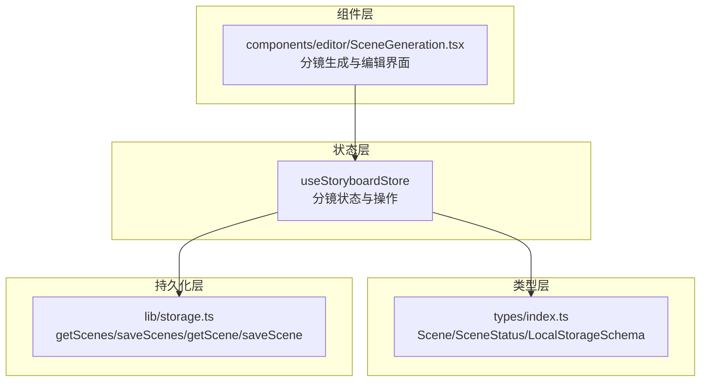
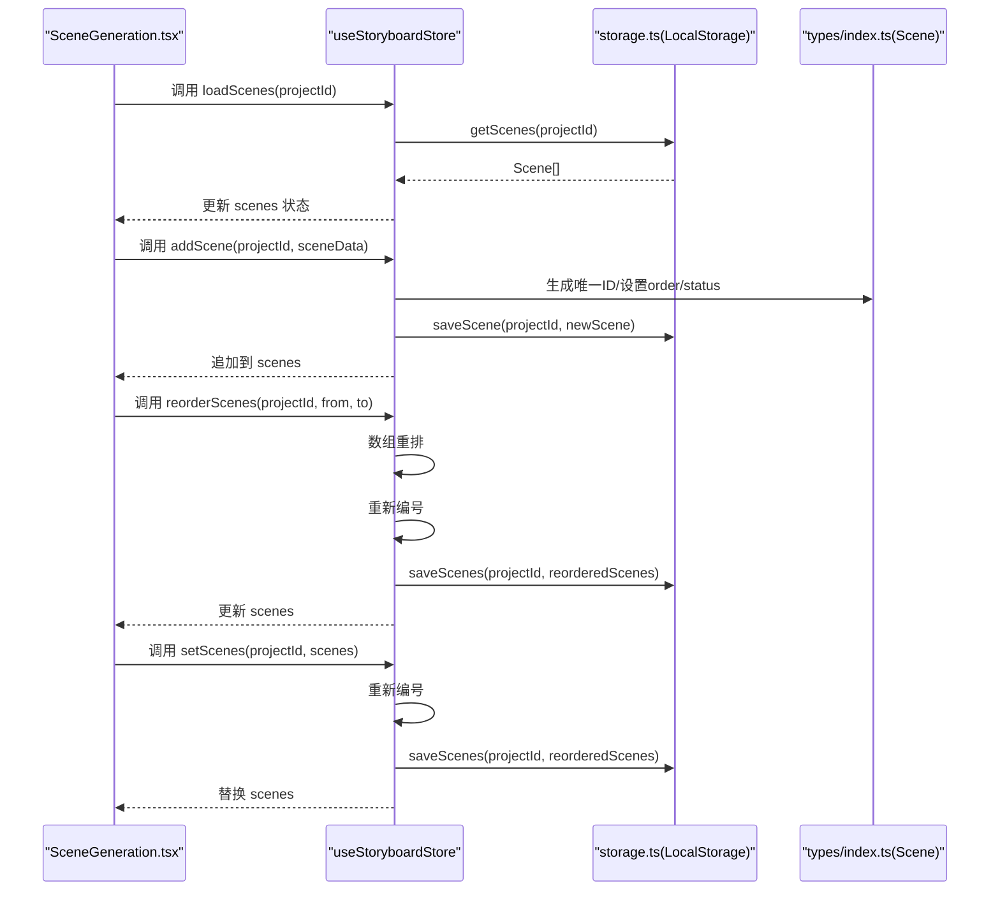
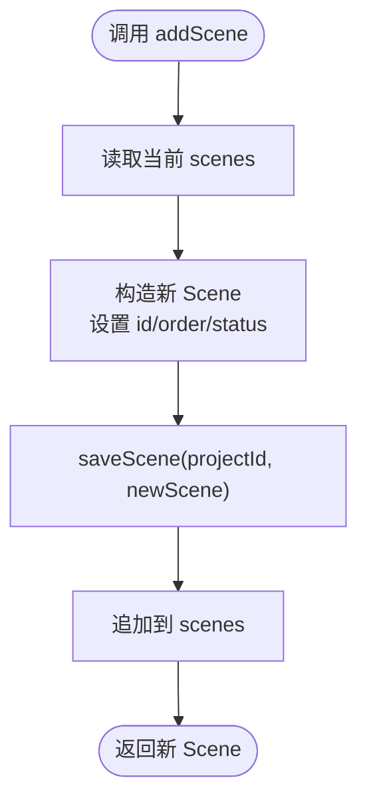
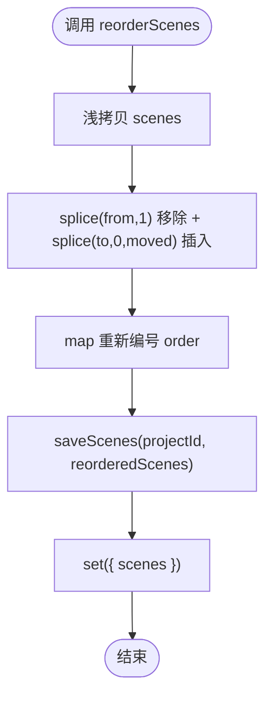
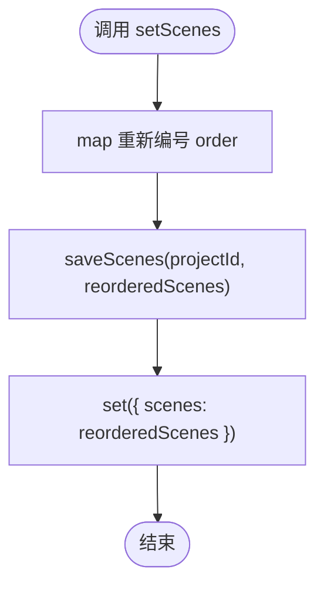
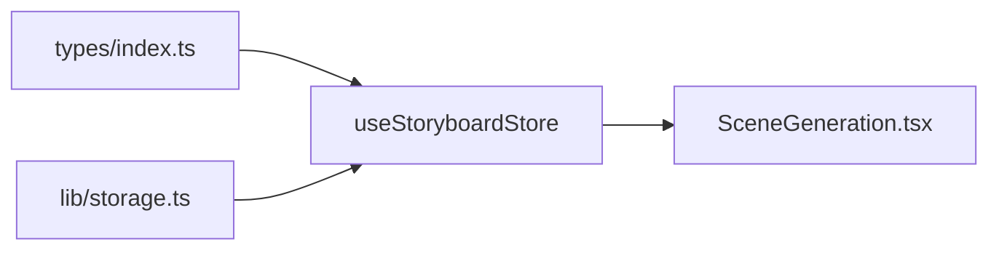

# 分镜状态管理

<cite>
**本文引用的文件**
- [storyboardStore.ts](file://manga-creator/src/stores/storyboardStore.ts)
- [storage.ts](file://manga-creator/src/lib/storage.ts)
- [index.ts](file://manga-creator/src/types/index.ts)
- [SceneGeneration.tsx](file://manga-creator/src/components/editor/SceneGeneration.tsx)
- [store.test.ts](file://manga-creator/src/stores/store.test.ts)
- [README.md](file://manga-creator/README.md)
</cite>

## 目录
1. [简介](#简介)
2. [项目结构](#项目结构)
3. [核心组件](#核心组件)
4. [架构总览](#架构总览)
5. [详细组件分析](#详细组件分析)
6. [依赖关系分析](#依赖关系分析)
7. [性能考量](#性能考量)
8. [故障排查指南](#故障排查指南)
9. [结论](#结论)

## 简介
本文件系统性梳理 useStoryboardStore 对创作流程中分镜数据的管理策略，围绕 scenes 数组的结构设计（order 排序字段与 status 状态机）、新增分镜的唯一 ID 生成与初始顺序设置、拖拽排序的性能优化与批量重新编号、批量更新 setScenes 的顺序一致性与项目绑定持久化、currentSceneId 在编辑上下文切换中的作用以及 isGenerating 标志位对 UI 加载状态的控制机制进行深入解析。文档同时提供可视化图示与测试依据，帮助读者快速理解与落地使用。

## 项目结构
- 状态管理位于 stores 目录，其中 storyboardStore.ts 提供分镜状态与操作接口。
- 类型定义位于 types/index.ts，明确 Scene 结构、状态枚举与本地存储 Schema。
- 持久化层位于 lib/storage.ts，负责 LocalStorage 的读写、加密与版本迁移。
- 组件层 SceneGeneration.tsx 展示了 useStoryboardStore 的典型使用方式：加载、生成、编辑、删除、确认等。

图表来源
- [storyboardStore.ts](file://manga-creator/src/stores/storyboardStore.ts#L1-L107)
- [storage.ts](file://manga-creator/src/lib/storage.ts#L104-L145)
- [index.ts](file://manga-creator/src/types/index.ts#L64-L76)

章节来源
- [README.md](file://manga-creator/README.md#L94-L128)

## 核心组件
- useStoryboardStore：Zustand 状态容器，管理 scenes 列表、当前编辑分镜 ID、生成状态标志；提供 loadScenes、setScenes、addScene、updateScene、deleteScene、reorderScenes、setCurrentScene、setGenerating 等方法。
- storage.ts：LocalStorage 封装，按项目维度存储 scenes，提供 getScenes/saveScenes/getScene/saveScene。
- types/index.ts：定义 Scene 接口、SceneStatus 枚举、LocalStorageSchema，确保类型安全与跨模块一致。

章节来源
- [storyboardStore.ts](file://manga-creator/src/stores/storyboardStore.ts#L1-L107)
- [storage.ts](file://manga-creator/src/lib/storage.ts#L104-L145)
- [index.ts](file://manga-creator/src/types/index.ts#L64-L76)

## 架构总览
useStoryboardStore 作为单一事实来源，统一管理分镜数据的内存状态与持久化。组件层通过 hooks 访问状态，触发业务操作；storage.ts 负责与 LocalStorage 交互，按项目 ID 进行隔离存储。

图表来源
- [storyboardStore.ts](file://manga-creator/src/stores/storyboardStore.ts#L26-L106)
- [storage.ts](file://manga-creator/src/lib/storage.ts#L104-L145)
- [index.ts](file://manga-creator/src/types/index.ts#L64-L76)

## 详细组件分析

### scenes 数组结构设计
- Scene 字段要点
  - id：唯一标识，字符串，用于定位与持久化。
  - projectId：项目绑定，确保分镜按项目隔离存储。
  - order：正整数序列，表示分镜在列表中的顺序，从 1 开始递增。
  - status：分镜状态机，涵盖 pending、scene_generating、scene_confirmed、action_generating、action_confirmed、prompt_generating、completed、needs_update 等阶段。
  - 其他字段：summary、sceneDescription、actionDescription、shotPrompt、contextSummary、notes 等，支撑创作流程。
- 状态机设计
  - status 用于驱动创作流程的阶段性推进，如从 scene_generating 到 scene_confirmed，再到 action_generating、prompt_generating，最终完成（completed）。
  - 新增分镜默认状态为 pending，便于后续工作流处理。
- 顺序一致性
  - order 由业务操作统一维护，确保 UI 展示与实际顺序一致。

章节来源
- [index.ts](file://manga-creator/src/types/index.ts#L24-L33)
- [index.ts](file://manga-creator/src/types/index.ts#L64-L76)

### addScene：创建新分镜的唯一 ID 与初始顺序
- 唯一 ID 生成
  - 使用时间戳与随机字符串组合生成唯一 id，避免冲突。
- 初始顺序
  - order 设置为当前 scenes.length + 1，确保追加到末尾。
- 默认状态
  - status 固定为 pending，便于后续工作流处理。
- 持久化
  - 调用 saveScene(projectId, newScene) 写入 LocalStorage。
- 返回值
  - 返回新建的 Scene 对象，便于上层使用。

图表来源
- [storyboardStore.ts](file://manga-creator/src/stores/storyboardStore.ts#L42-L55)
- [storage.ts](file://manga-creator/src/lib/storage.ts#L129-L145)

章节来源
- [storyboardStore.ts](file://manga-creator/src/stores/storyboardStore.ts#L42-L55)
- [store.test.ts](file://manga-creator/src/stores/store.test.ts#L416-L479)

### reorderScenes：拖拽排序的性能优化与批量重新编号
- 数组重排
  - 基于原数组浅拷贝，使用 splice 进行移除与插入，实现 O(n) 的移动成本。
- 批量重新编号
  - 仅对重排后的数组执行一次 map 重新计算 order，避免多次遍历。
- 持久化
  - 一次性 saveScenes(projectId, reorderedScenes)，减少 IO 次数。
- 性能特征
  - 时间复杂度：O(n)（数组重排 + 一次 map 重新编号 + 一次写入）
  - 空间复杂度：O(n)（浅拷贝数组）

图表来源
- [storyboardStore.ts](file://manga-creator/src/stores/storyboardStore.ts#L84-L97)
- [storage.ts](file://manga-creator/src/lib/storage.ts#L115-L122)

章节来源
- [storyboardStore.ts](file://manga-creator/src/stores/storyboardStore.ts#L84-L97)
- [store.test.ts](file://manga-creator/src/stores/store.test.ts#L670-L718)

### setScenes：批量更新的顺序一致性与项目绑定
- 顺序一致性
  - 对传入 scenes 执行 map 重新编号，确保 order 严格连续且从 1 开始。
- 项目绑定存储
  - 通过 saveScenes(projectId, reorderedScenes) 将整个列表按项目维度替换，实现“覆盖式”批量更新。
- UI 行为
  - 替换后 scenes 状态被整体更新，组件层可直接渲染最新顺序。

图表来源
- [storyboardStore.ts](file://manga-creator/src/stores/storyboardStore.ts#L31-L40)
- [storage.ts](file://manga-creator/src/lib/storage.ts#L115-L122)

章节来源
- [storyboardStore.ts](file://manga-creator/src/stores/storyboardStore.ts#L31-L40)
- [store.test.ts](file://manga-creator/src/stores/store.test.ts#L481-L551)

### currentSceneId：编辑上下文切换
- 作用
  - 记录当前正在编辑的分镜 id，用于组件层聚焦当前编辑项、高亮、联动更新等。
- 使用场景
  - 在编辑界面中，根据 currentSceneId 决定当前编辑面板的数据源与交互状态。
- 生命周期
  - 通过 setCurrentScene 设置或清空（null），与编辑流程配合。

章节来源
- [storyboardStore.ts](file://manga-creator/src/stores/storyboardStore.ts#L99-L101)
- [SceneGeneration.tsx](file://manga-creator/src/components/editor/SceneGeneration.tsx#L24-L33)

### isGenerating：UI 加载状态控制
- 作用
  - 标记是否处于生成流程中，用于控制 UI 中的加载动画、进度条与按钮禁用状态。
- 使用场景
  - 在 SceneGeneration.tsx 中，当 isGenerating 为 true 时显示进度条与加载图标，防止重复触发生成。
- 生命周期
  - 通过 setGenerating 在生成开始与结束时切换状态，保证 UI 与业务状态一致。

章节来源
- [storyboardStore.ts](file://manga-creator/src/stores/storyboardStore.ts#L103-L106)
- [SceneGeneration.tsx](file://manga-creator/src/components/editor/SceneGeneration.tsx#L213-L221)

## 依赖关系分析
- useStoryboardStore 依赖
  - types/index.ts：Scene、SceneStatus、LocalStorageSchema 等类型定义。
  - lib/storage.ts：getScenes/saveScenes/getScene/saveScene。
- 组件依赖
  - SceneGeneration.tsx：使用 useStoryboardStore 的 loadScenes、setScenes、addScene、updateScene、deleteScene、isGenerating、setGenerating 等。

图表来源
- [storyboardStore.ts](file://manga-creator/src/stores/storyboardStore.ts#L1-L107)
- [storage.ts](file://manga-creator/src/lib/storage.ts#L104-L145)
- [index.ts](file://manga-creator/src/types/index.ts#L64-L76)
- [SceneGeneration.tsx](file://manga-creator/src/components/editor/SceneGeneration.tsx#L24-L33)

章节来源
- [storyboardStore.ts](file://manga-creator/src/stores/storyboardStore.ts#L1-L107)
- [storage.ts](file://manga-creator/src/lib/storage.ts#L104-L145)
- [index.ts](file://manga-creator/src/types/index.ts#L64-L76)
- [SceneGeneration.tsx](file://manga-creator/src/components/editor/SceneGeneration.tsx#L24-L33)

## 性能考量
- 数组重排与重新编号
  - reorderScenes 采用一次数组重排 + 一次 map 重新编号，避免多次遍历与多次 IO。
- 批量持久化
  - setScenes/reorderScenes/deleteScene 均在变更后一次性 saveScenes，降低 LocalStorage 写入次数。
- 内存与渲染
  - Zustand 状态更新触发最小化重渲染，结合组件层的条件渲染与列表项 key 设计，提升交互流畅度。
- 大列表场景
  - 测试覆盖了大量分镜（例如 100 条）的批量更新与重新编号，验证顺序一致性与性能表现。

章节来源
- [storyboardStore.ts](file://manga-creator/src/stores/storyboardStore.ts#L31-L40)
- [storyboardStore.ts](file://manga-creator/src/stores/storyboardStore.ts#L84-L97)
- [store.test.ts](file://manga-creator/src/stores/store.test.ts#L925-L947)

## 故障排查指南
- 分镜顺序异常
  - 确认是否通过 setScenes 或 reorderScenes 进行批量重排；若手动修改 order，请使用 setScenes 重新编号。
- 重复 ID 或冲突
  - addScene 使用时间戳+随机字符串生成唯一 id，一般不会冲突；若出现异常，检查持久化层是否被外部篡改。
- 生成按钮不可用
  - 检查 isGenerating 是否为 true；确保在生成完成后调用 setGenerating(false)。
- 当前编辑项不生效
  - 确认 setCurrentScene 是否正确设置；组件层需根据 currentSceneId 渲染对应编辑面板。
- 数据丢失或不同步
  - 确认 LocalStorage 键名与项目 ID 绑定正确；storage.ts 提供 getScenes/saveScenes，确保按 projectId 操作。

章节来源
- [storyboardStore.ts](file://manga-creator/src/stores/storyboardStore.ts#L26-L106)
- [storage.ts](file://manga-creator/src/lib/storage.ts#L104-L145)
- [SceneGeneration.tsx](file://manga-creator/src/components/editor/SceneGeneration.tsx#L213-L221)

## 结论
useStoryboardStore 通过清晰的 Scene 结构设计与严格的顺序管理，实现了分镜数据在创作流程中的稳定流转。其在拖拽排序、批量更新与 UI 加载状态控制方面均体现了良好的性能与可用性。结合 types 与 storage 的强类型约束与项目维度持久化，能够有效保障数据一致性与可维护性。建议在扩展新功能时遵循现有模式：统一通过 setScenes/reorderScenes 保证顺序一致性，通过 saveScenes 一次性持久化，通过 isGenerating 控制 UI 加载状态，通过 currentSceneId 管理编辑上下文。