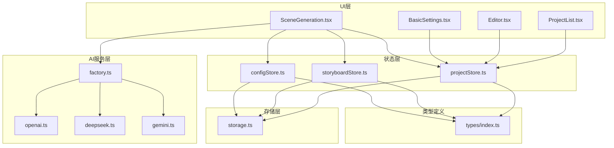
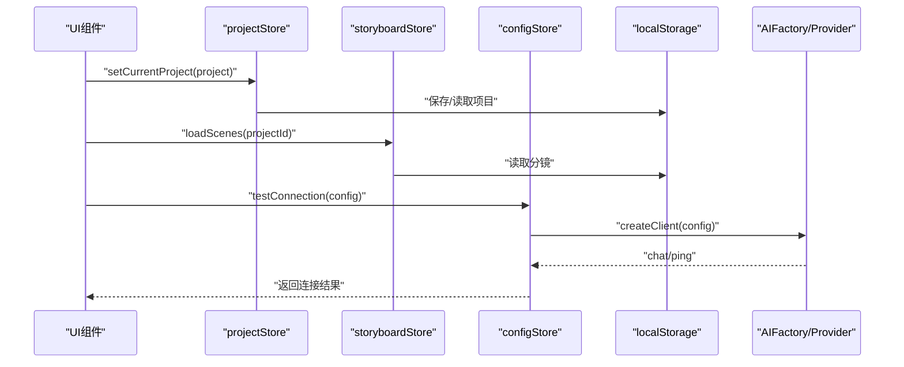
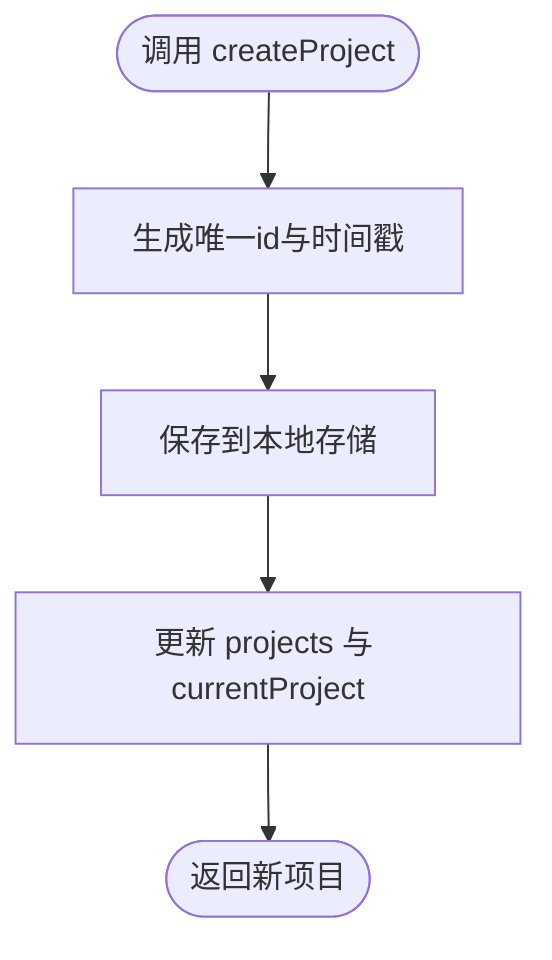
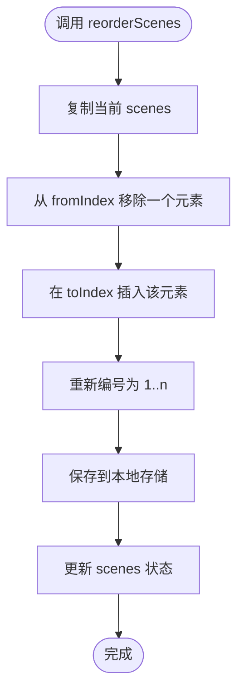
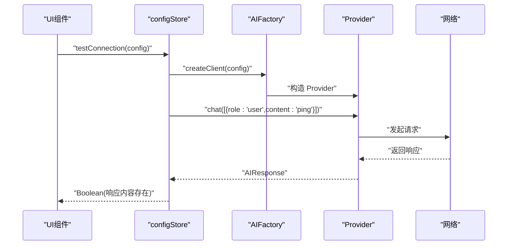
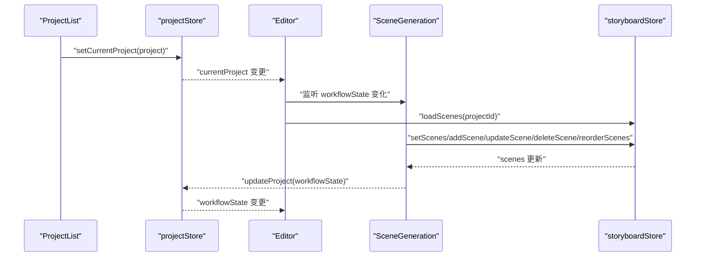
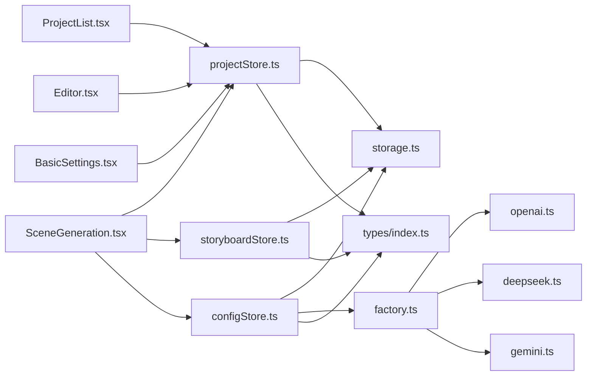
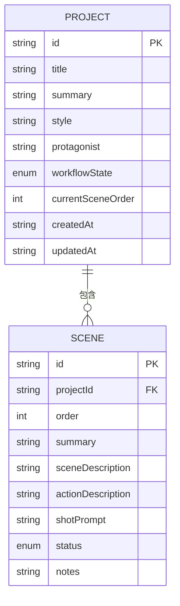

# 状态管理

<cite>
**本文引用的文件**
- [projectStore.ts](file://manga-creator/src/stores/projectStore.ts)
- [configStore.ts](file://manga-creator/src/stores/configStore.ts)
- [storyboardStore.ts](file://manga-creator/src/stores/storyboardStore.ts)
- [storage.ts](file://manga-creator/src/lib/storage.ts)
- [factory.ts](file://manga-creator/src/lib/ai/factory.ts)
- [openai.ts](file://manga-creator/src/lib/ai/providers/openai.ts)
- [deepseek.ts](file://manga-creator/src/lib/ai/providers/deepseek.ts)
- [gemini.ts](file://manga-creator/src/lib/ai/providers/gemini.ts)
- [index.ts](file://manga-creator/src/types/index.ts)
- [ProjectList.tsx](file://manga-creator/src/components/ProjectList.tsx)
- [Editor.tsx](file://manga-creator/src/components/Editor.tsx)
- [BasicSettings.tsx](file://manga-creator/src/components/editor/BasicSettings.tsx)
- [SceneGeneration.tsx](file://manga-creator/src/components/editor/SceneGeneration.tsx)
</cite>

## 目录
1. [简介](#简介)
2. [项目结构](#项目结构)
3. [核心组件](#核心组件)
4. [架构总览](#架构总览)
5. [详细组件分析](#详细组件分析)
6. [依赖分析](#依赖分析)
7. [性能考量](#性能考量)
8. [故障排查指南](#故障排查指南)
9. [结论](#结论)
10. [附录](#附录)

## 简介
本文件系统化梳理并深入解析基于 Zustand 的全局状态架构，重点覆盖以下方面：
- projectStore 中 projects 数组与 currentProject 对象的管理逻辑，包括 loadProjects、createProject、deleteProject 等核心方法的异步处理与错误捕获机制
- configStore 如何维护用户 AI 配置（API Key、模型选择），并实现 testConnection 连接测试功能，说明其与 AI 服务层的交互流程
- storyboardStore 对分镜场景（scenes）的增删改查操作，特别是 reorderScenes 拖拽排序与 setScenes 批量更新的实现细节
- 三个 store 之间的协作关系：项目切换时如何联动更新 currentProject 与 scenes 数据
- 状态流图示：从 UI 事件触发到 store 更新再到视图响应的完整数据流路径

## 项目结构
本项目采用“按功能域划分”的组织方式，状态管理位于 stores 目录，类型定义位于 types 目录，AI 服务位于 lib/ai，UI 组件位于 components 目录。整体结构清晰，职责边界明确，便于扩展与维护。

图表来源
- [projectStore.ts](file://manga-creator/src/stores/projectStore.ts#L1-L95)
- [configStore.ts](file://manga-creator/src/stores/configStore.ts#L1-L58)
- [storyboardStore.ts](file://manga-creator/src/stores/storyboardStore.ts#L1-L107)
- [storage.ts](file://manga-creator/src/lib/storage.ts#L1-L246)
- [factory.ts](file://manga-creator/src/lib/ai/factory.ts#L1-L54)
- [openai.ts](file://manga-creator/src/lib/ai/providers/openai.ts#L1-L88)
- [deepseek.ts](file://manga-creator/src/lib/ai/providers/deepseek.ts#L1-L110)
- [gemini.ts](file://manga-creator/src/lib/ai/providers/gemini.ts#L1-L138)
- [index.ts](file://manga-creator/src/types/index.ts#L1-L190)
- [ProjectList.tsx](file://manga-creator/src/components/ProjectList.tsx#L1-L196)
- [Editor.tsx](file://manga-creator/src/components/Editor.tsx#L1-L172)
- [BasicSettings.tsx](file://manga-creator/src/components/editor/BasicSettings.tsx#L1-L224)
- [SceneGeneration.tsx](file://manga-creator/src/components/editor/SceneGeneration.tsx#L1-L383)

章节来源
- [projectStore.ts](file://manga-creator/src/stores/projectStore.ts#L1-L95)
- [configStore.ts](file://manga-creator/src/stores/configStore.ts#L1-L58)
- [storyboardStore.ts](file://manga-creator/src/stores/storyboardStore.ts#L1-L107)
- [storage.ts](file://manga-creator/src/lib/storage.ts#L1-L246)
- [factory.ts](file://manga-creator/src/lib/ai/factory.ts#L1-L54)
- [openai.ts](file://manga-creator/src/lib/ai/providers/openai.ts#L1-L88)
- [deepseek.ts](file://manga-creator/src/lib/ai/providers/deepseek.ts#L1-L110)
- [gemini.ts](file://manga-creator/src/lib/ai/providers/gemini.ts#L1-L138)
- [index.ts](file://manga-creator/src/types/index.ts#L1-L190)
- [ProjectList.tsx](file://manga-creator/src/components/ProjectList.tsx#L1-L196)
- [Editor.tsx](file://manga-creator/src/components/Editor.tsx#L1-L172)
- [BasicSettings.tsx](file://manga-creator/src/components/editor/BasicSettings.tsx#L1-L224)
- [SceneGeneration.tsx](file://manga-creator/src/components/editor/SceneGeneration.tsx#L1-L383)

## 核心组件
本节概述三个核心 store 的职责与关键能力：
- projectStore：管理项目集合与当前项目，负责加载、创建、更新、删除项目，并维护工作流状态
- storyboardStore：管理分镜集合与当前分镜，支持增删改查、重排、批量更新与生成状态标记
- configStore：管理用户 AI 配置与连接测试，封装与 AI 服务层的交互

章节来源
- [projectStore.ts](file://manga-creator/src/stores/projectStore.ts#L1-L95)
- [storyboardStore.ts](file://manga-creator/src/stores/storyboardStore.ts#L1-L107)
- [configStore.ts](file://manga-creator/src/stores/configStore.ts#L1-L58)

## 架构总览
Zustand store 通过本地存储（LocalStorage）持久化数据，AI 服务通过工厂模式按配置动态创建客户端，UI 层通过 React Hooks 订阅 store 并驱动工作流状态流转。

图表来源
- [projectStore.ts](file://manga-creator/src/stores/projectStore.ts#L1-L95)
- [storyboardStore.ts](file://manga-creator/src/stores/storyboardStore.ts#L1-L107)
- [configStore.ts](file://manga-creator/src/stores/configStore.ts#L1-L58)
- [storage.ts](file://manga-creator/src/lib/storage.ts#L1-L246)
- [factory.ts](file://manga-creator/src/lib/ai/factory.ts#L1-L54)
- [openai.ts](file://manga-creator/src/lib/ai/providers/openai.ts#L1-L88)
- [deepseek.ts](file://manga-creator/src/lib/ai/providers/deepseek.ts#L1-L110)
- [gemini.ts](file://manga-creator/src/lib/ai/providers/gemini.ts#L1-L138)

## 详细组件分析

### projectStore：项目集合与当前项目管理
- 数据结构
  - projects：项目数组，包含 id、标题、摘要、风格、主角、工作流状态、当前分镜序号、时间戳等字段
  - currentProject：当前选中的项目，用于编辑器与工作流驱动
  - isLoading：加载状态标志
- 核心方法
  - loadProjects：从本地存储读取项目列表，设置 isLoading；异常时记录错误并恢复 isLoading
  - loadProject：按 id 从本地存储读取单个项目并设置为 currentProject
  - createProject：生成唯一 id、当前时间戳与默认工作流状态，保存到本地存储并更新 projects 与 currentProject
  - updateProject：查找对应项目，合并更新字段并保存，同时更新 projects 与 currentProject（若匹配）
  - deleteProject：删除指定项目并清理对应分镜数据，更新 projects；若删除的是 currentProject，则清空 currentProject
  - setCurrentProject：直接设置 currentProject
- 异步与错误处理
  - 本地存储读写均包裹 try/catch，失败时记录错误并保持状态稳定
  - 未显式异步化，但 UI 通过调用触发渲染，达到“异步”效果
- 复杂度分析
  - 查找与更新：O(n)（按 id 查找）
  - 删除：O(n)（过滤数组）
- 优化建议
  - 对频繁更新的场景可引入去抖或批量更新策略
  - 对大项目集可考虑分页或懒加载

图表来源
- [projectStore.ts](file://manga-creator/src/stores/projectStore.ts#L42-L61)
- [storage.ts](file://manga-creator/src/lib/storage.ts#L68-L84)

章节来源
- [projectStore.ts](file://manga-creator/src/stores/projectStore.ts#L1-L95)
- [storage.ts](file://manga-creator/src/lib/storage.ts#L52-L98)
- [index.ts](file://manga-creator/src/types/index.ts#L42-L56)

### storyboardStore：分镜场景管理
- 数据结构
  - scenes：分镜数组，包含 id、projectId、顺序、概要、场景描述、动作描述、提示词、状态、备注等
  - currentSceneId：当前选中分镜
  - isGenerating：生成中状态
- 核心方法
  - loadScenes：按项目 id 从本地存储读取分镜并设置
  - setScenes：接收完整分镜数组，重新编号并保存，用于批量替换
  - addScene：生成唯一 id 与顺序，保存并加入 scenes
  - updateScene：按 id 查找并更新，保存到本地存储
  - deleteScene：移除指定分镜并重新编号，保存回本地存储
  - reorderScenes：通过数组 splice 实现拖拽重排，重新编号并保存
  - setCurrentScene：设置当前分镜
  - setGenerating：设置生成中状态
- 排序与重新编号
  - setScenes/deleteScene/reorderScenes 均会将 order 重置为 1..n，确保顺序连续且唯一
- 错误处理
  - 本地存储读写均包裹 try/catch，失败时记录错误并保持状态稳定
- 复杂度分析
  - add/update/delete/reorder：O(n)（数组遍历与映射）
  - loadScenes：O(n)（JSON 解析）
- 优化建议
  - 对大量分镜的重排可考虑虚拟滚动与增量更新
  - 批量更新时可合并多次 set 调用减少渲染次数

图表来源
- [storyboardStore.ts](file://manga-creator/src/stores/storyboardStore.ts#L84-L97)
- [storage.ts](file://manga-creator/src/lib/storage.ts#L115-L145)

章节来源
- [storyboardStore.ts](file://manga-creator/src/stores/storyboardStore.ts#L1-L107)
- [storage.ts](file://manga-creator/src/lib/storage.ts#L104-L145)
- [index.ts](file://manga-creator/src/types/index.ts#L64-L76)

### configStore：AI 配置与连接测试
- 数据结构
  - config：用户配置（供应商、API Key、可选 baseURL、模型）
  - isConfigured：是否已配置
- 核心方法
  - loadConfig：从本地存储读取并解密配置，设置 isConfigured
  - saveConfig：加密并保存配置，设置 isConfigured
  - clearConfig：清除配置
  - testConnection：通过工厂创建客户端，发送一条 ping 消息，返回布尔结果
- AI 服务层交互
  - AIFactory.createClient 根据配置创建 AIClient，内部委托具体 Provider（OpenAI 兼容、DeepSeek、Gemini）
  - Provider 封装 HTTP 请求与 SSE 流式响应，统一返回 AIResponse
- 错误处理
  - testConnection 捕获异常并返回 false，同时记录错误日志
  - Provider 层对非 2xx 响应抛出错误，工厂层捕获并上抛
- 复杂度分析
  - testConnection：O(1)（一次网络请求）
  - Provider：O(1)（HTTP 请求与解析）

图表来源
- [configStore.ts](file://manga-creator/src/stores/configStore.ts#L45-L56)
- [factory.ts](file://manga-creator/src/lib/ai/factory.ts#L44-L53)
- [openai.ts](file://manga-creator/src/lib/ai/providers/openai.ts#L1-L88)
- [deepseek.ts](file://manga-creator/src/lib/ai/providers/deepseek.ts#L1-L110)
- [gemini.ts](file://manga-creator/src/lib/ai/providers/gemini.ts#L1-L138)

章节来源
- [configStore.ts](file://manga-creator/src/stores/configStore.ts#L1-L58)
- [factory.ts](file://manga-creator/src/lib/ai/factory.ts#L1-L54)
- [openai.ts](file://manga-creator/src/lib/ai/providers/openai.ts#L1-L88)
- [deepseek.ts](file://manga-creator/src/lib/ai/providers/deepseek.ts#L1-L110)
- [gemini.ts](file://manga-creator/src/lib/ai/providers/gemini.ts#L1-L138)
- [storage.ts](file://manga-creator/src/lib/storage.ts#L151-L177)
- [index.ts](file://manga-creator/src/types/index.ts#L82-L91)

### 三 store 协作关系与工作流联动
- 项目切换联动
  - ProjectList 选择项目后调用 projectStore.setCurrentProject，Editor 监听 currentProject 变化并自动切换编辑步骤
  - SceneGeneration 在 currentProject 变化时加载对应项目的分镜列表
- 工作流状态驱动
  - BasicSettings 完成基础设定后更新项目工作流状态为 DATA_COLLECTED，并触发 workflow:next-step
  - SceneGeneration 生成分镜列表后更新为 SCENE_LIST_EDITING，确认后进入 SCENE_LIST_CONFIRMED
  - Editor 根据 currentProject.workflowState 自动切换步骤导航
- 分镜与项目的一致性
  - storyboardStore 的所有操作均以 projectId 为维度进行，确保分镜与项目一一对应
  - 删除项目时，storage.ts 同步清理对应分镜数据，避免脏数据

图表来源
- [ProjectList.tsx](file://manga-creator/src/components/ProjectList.tsx#L68-L71)
- [Editor.tsx](file://manga-creator/src/components/Editor.tsx#L12-L31)
- [BasicSettings.tsx](file://manga-creator/src/components/editor/BasicSettings.tsx#L45-L61)
- [SceneGeneration.tsx](file://manga-creator/src/components/editor/SceneGeneration.tsx#L34-L38)
- [projectStore.ts](file://manga-creator/src/stores/projectStore.ts#L91-L94)
- [storyboardStore.ts](file://manga-creator/src/stores/storyboardStore.ts#L26-L40)

章节来源
- [ProjectList.tsx](file://manga-creator/src/components/ProjectList.tsx#L1-L196)
- [Editor.tsx](file://manga-creator/src/components/Editor.tsx#L1-L172)
- [BasicSettings.tsx](file://manga-creator/src/components/editor/BasicSettings.tsx#L1-L224)
- [SceneGeneration.tsx](file://manga-creator/src/components/editor/SceneGeneration.tsx#L1-L383)
- [projectStore.ts](file://manga-creator/src/stores/projectStore.ts#L1-L95)
- [storyboardStore.ts](file://manga-creator/src/stores/storyboardStore.ts#L1-L107)
- [storage.ts](file://manga-creator/src/lib/storage.ts#L86-L98)

## 依赖分析
- 组件与 store 的依赖
  - ProjectList 依赖 projectStore 的 create、delete、setCurrentProject
  - Editor 依赖 projectStore 的 currentProject 与 workflowState
  - BasicSettings 依赖 projectStore 的 updateProject
  - SceneGeneration 依赖 projectStore、storyboardStore、configStore
- store 与存储层的依赖
  - projectStore、storyboardStore、configStore 均依赖 storage.ts 进行持久化
- store 与 AI 服务层的依赖
  - configStore 依赖 AIFactory，AIFactory 依赖各 Provider 实现
- 类型依赖
  - 所有 store 与组件均依赖 types/index.ts 中的数据类型定义

图表来源
- [ProjectList.tsx](file://manga-creator/src/components/ProjectList.tsx#L1-L196)
- [Editor.tsx](file://manga-creator/src/components/Editor.tsx#L1-L172)
- [BasicSettings.tsx](file://manga-creator/src/components/editor/BasicSettings.tsx#L1-L224)
- [SceneGeneration.tsx](file://manga-creator/src/components/editor/SceneGeneration.tsx#L1-L383)
- [projectStore.ts](file://manga-creator/src/stores/projectStore.ts#L1-L95)
- [storyboardStore.ts](file://manga-creator/src/stores/storyboardStore.ts#L1-L107)
- [configStore.ts](file://manga-creator/src/stores/configStore.ts#L1-L58)
- [storage.ts](file://manga-creator/src/lib/storage.ts#L1-L246)
- [factory.ts](file://manga-creator/src/lib/ai/factory.ts#L1-L54)
- [openai.ts](file://manga-creator/src/lib/ai/providers/openai.ts#L1-L88)
- [deepseek.ts](file://manga-creator/src/lib/ai/providers/deepseek.ts#L1-L110)
- [gemini.ts](file://manga-creator/src/lib/ai/providers/gemini.ts#L1-L138)
- [index.ts](file://manga-creator/src/types/index.ts#L1-L190)

章节来源
- [ProjectList.tsx](file://manga-creator/src/components/ProjectList.tsx#L1-L196)
- [Editor.tsx](file://manga-creator/src/components/Editor.tsx#L1-L172)
- [BasicSettings.tsx](file://manga-creator/src/components/editor/BasicSettings.tsx#L1-L224)
- [SceneGeneration.tsx](file://manga-creator/src/components/editor/SceneGeneration.tsx#L1-L383)
- [projectStore.ts](file://manga-creator/src/stores/projectStore.ts#L1-L95)
- [storyboardStore.ts](file://manga-creator/src/stores/storyboardStore.ts#L1-L107)
- [configStore.ts](file://manga-creator/src/stores/configStore.ts#L1-L58)
- [storage.ts](file://manga-creator/src/lib/storage.ts#L1-L246)
- [factory.ts](file://manga-creator/src/lib/ai/factory.ts#L1-L54)
- [openai.ts](file://manga-creator/src/lib/ai/providers/openai.ts#L1-L88)
- [deepseek.ts](file://manga-creator/src/lib/ai/providers/deepseek.ts#L1-L110)
- [gemini.ts](file://manga-creator/src/lib/ai/providers/gemini.ts#L1-L138)
- [index.ts](file://manga-creator/src/types/index.ts#L1-L190)

## 性能考量
- 渲染优化
  - 将大型列表（分镜）与复杂编辑器拆分为独立组件，按需渲染
  - 使用状态粒度最小化更新，避免不必要的全量重渲染
- I/O 优化
  - 本地存储读写为同步阻塞，建议在批量更新时合并多次 set 调用
  - 对高频操作（如拖拽排序）可考虑节流或防抖
- AI 请求
  - testConnection 仅一次 ping 请求，避免重复调用
  - 生成流程中对进度与错误状态进行及时反馈，减少无效等待
- 存储容量
  - storage.ts 提供 getStorageUsage，可用于监控与清理策略

## 故障排查指南
- 项目加载失败
  - 现象：loadProjects 后 projects 为空或报错
  - 排查：检查本地存储键值是否存在、JSON 是否可解析、try/catch 是否抛出异常
  - 参考路径：[projectStore.ts](file://manga-creator/src/stores/projectStore.ts#L24-L33)，[storage.ts](file://manga-creator/src/lib/storage.ts#L52-L61)
- 分镜删除后顺序错乱
  - 现象：删除分镜后后续分镜顺序不连续
  - 排查：确认 deleteScene/reorderScenes/setScenes 是否执行了重新编号
  - 参考路径：[storyboardStore.ts](file://manga-creator/src/stores/storyboardStore.ts#L71-L82)，[storyboardStore.ts](file://manga-creator/src/stores/storyboardStore.ts#L84-L97)
- AI 连接测试失败
  - 现象：testConnection 返回 false 或抛错
  - 排查：检查配置是否完整、API Key/baseURL/model 是否正确、Provider 是否支持该供应商
  - 参考路径：[configStore.ts](file://manga-creator/src/stores/configStore.ts#L45-L56)，[factory.ts](file://manga-creator/src/lib/ai/factory.ts#L44-L53)，[openai.ts](file://manga-creator/src/lib/ai/providers/openai.ts#L1-L35)
- 项目删除后分镜未清理
  - 现象：删除项目后仍可见分镜
  - 排查：确认 storage.deleteProject 是否移除了对应分镜键
  - 参考路径：[storage.ts](file://manga-creator/src/lib/storage.ts#L86-L98)

章节来源
- [projectStore.ts](file://manga-creator/src/stores/projectStore.ts#L24-L33)
- [storyboardStore.ts](file://manga-creator/src/stores/storyboardStore.ts#L71-L97)
- [configStore.ts](file://manga-creator/src/stores/configStore.ts#L45-L56)
- [factory.ts](file://manga-creator/src/lib/ai/factory.ts#L44-L53)
- [openai.ts](file://manga-creator/src/lib/ai/providers/openai.ts#L1-L35)
- [storage.ts](file://manga-creator/src/lib/storage.ts#L86-L98)

## 结论
本状态管理方案以 Zustand 为核心，结合本地存储与工厂模式的 AI 服务层，实现了清晰的职责分离与良好的可扩展性。通过工作流状态驱动的 UI 切换与分镜管理，项目在不同阶段具备明确的边界与反馈。建议在未来进一步完善批量更新、拖拽性能与存储容量监控，以提升用户体验与系统稳定性。

## 附录
- 数据模型关系图

图表来源
- [index.ts](file://manga-creator/src/types/index.ts#L42-L76)