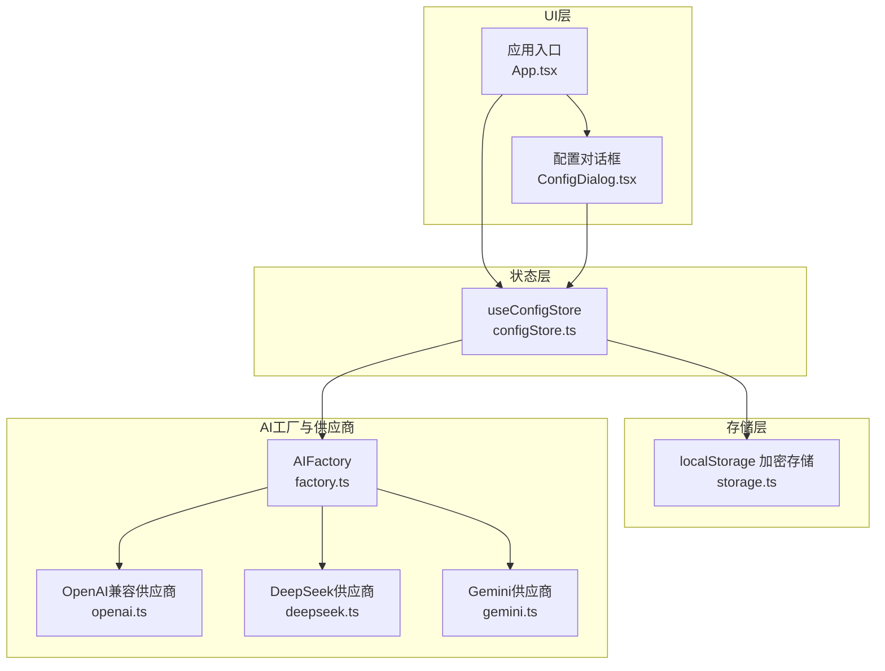
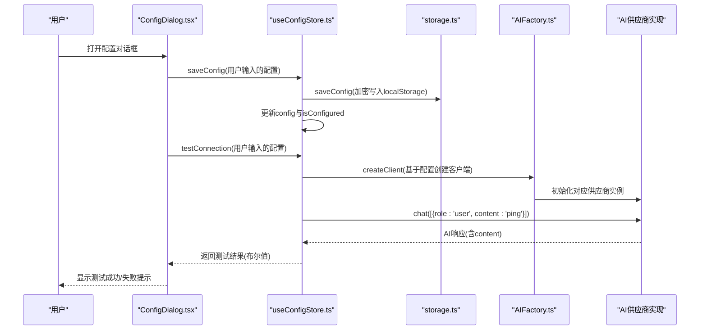
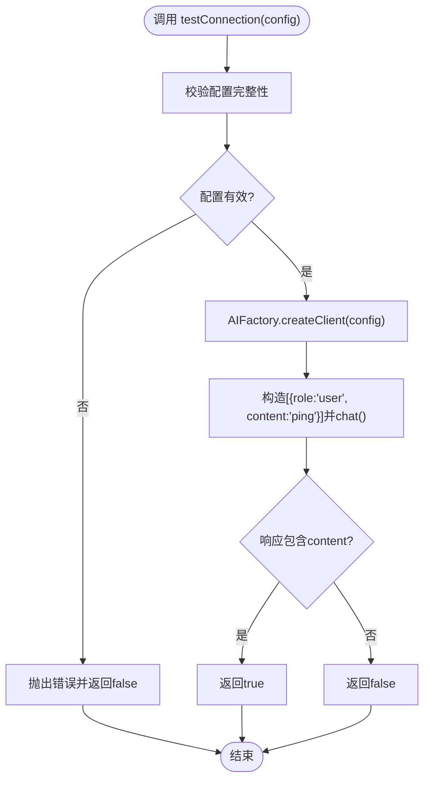
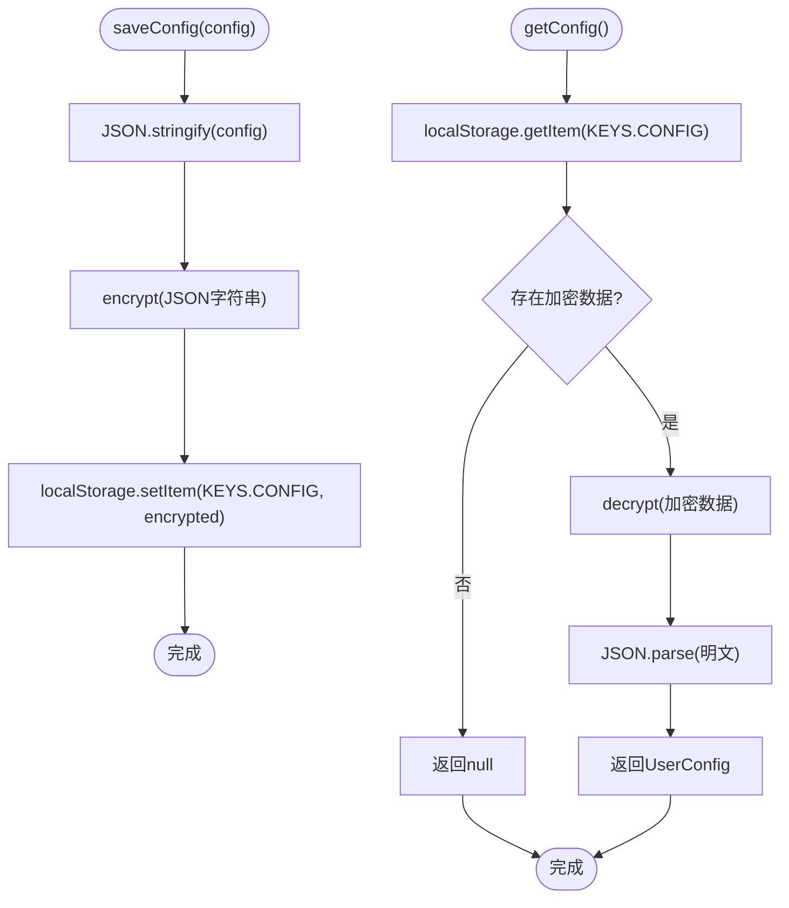
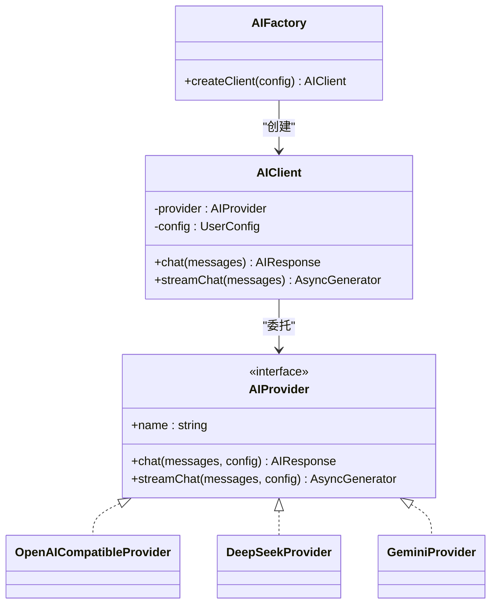
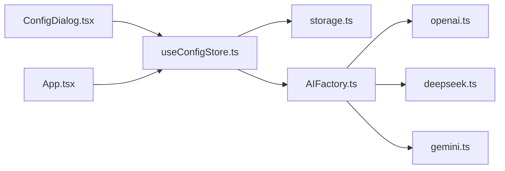

# 配置状态管理

<cite>
**本文引用的文件**
- [configStore.ts](file://manga-creator/src/stores/configStore.ts)
- [storage.ts](file://manga-creator/src/lib/storage.ts)
- [factory.ts](file://manga-creator/src/lib/ai/factory.ts)
- [types.ts](file://manga-creator/src/types/index.ts)
- [openai.ts](file://manga-creator/src/lib/ai/providers/openai.ts)
- [deepseek.ts](file://manga-creator/src/lib/ai/providers/deepseek.ts)
- [gemini.ts](file://manga-creator/src/lib/ai/providers/gemini.ts)
- [ConfigDialog.tsx](file://manga-creator/src/components/ConfigDialog.tsx)
- [App.tsx](file://manga-creator/src/App.tsx)
</cite>

## 目录
1. [简介](#简介)
2. [项目结构](#项目结构)
3. [核心组件](#核心组件)
4. [架构总览](#架构总览)
5. [详细组件分析](#详细组件分析)
6. [依赖关系分析](#依赖关系分析)
7. [性能考量](#性能考量)
8. [故障排查指南](#故障排查指南)
9. [结论](#结论)
10. [附录：安全最佳实践](#附录安全最佳实践)

## 简介
本文件围绕 useConfigStore 的配置状态管理展开，系统性阐述以下主题：
- 如何通过 useConfigStore 管理用户 AI 服务配置（API Key、模型选择等）；
- config 对象中敏感信息的本地加密存储机制；
- isConfigured 标志位在 UI 条件渲染中的作用；
- testConnection 方法如何借助 AIFactory 创建临时客户端进行连接测试，包括发送“ping”消息、异步流程与错误处理策略；
- saveConfig 在持久化配置时如何同步更新 store 状态并触发应用级配置变更；
- 安全指南：强调 API Key 加密存储的重要性与防止泄露的最佳实践。

## 项目结构
本项目采用按功能域划分的组织方式，配置状态管理位于 stores 层，底层通过 storage.ts 提供本地加密存储；AI 供应商适配由 factory.ts 与各 provider 实现构成；UI 层通过 ConfigDialog.tsx 提供配置输入与测试能力；应用入口在 App.tsx 中初始化存储并加载配置。

图表来源
- [configStore.ts](file://manga-creator/src/stores/configStore.ts#L1-L58)
- [storage.ts](file://manga-creator/src/lib/storage.ts#L1-L246)
- [factory.ts](file://manga-creator/src/lib/ai/factory.ts#L1-L54)
- [openai.ts](file://manga-creator/src/lib/ai/providers/openai.ts#L1-L88)
- [deepseek.ts](file://manga-creator/src/lib/ai/providers/deepseek.ts#L1-L110)
- [gemini.ts](file://manga-creator/src/lib/ai/providers/gemini.ts#L1-L138)
- [ConfigDialog.tsx](file://manga-creator/src/components/ConfigDialog.tsx#L1-L197)
- [App.tsx](file://manga-creator/src/App.tsx#L1-L81)

章节来源
- [configStore.ts](file://manga-creator/src/stores/configStore.ts#L1-L58)
- [storage.ts](file://manga-creator/src/lib/storage.ts#L1-L246)
- [factory.ts](file://manga-creator/src/lib/ai/factory.ts#L1-L54)
- [openai.ts](file://manga-creator/src/lib/ai/providers/openai.ts#L1-L88)
- [deepseek.ts](file://manga-creator/src/lib/ai/providers/deepseek.ts#L1-L110)
- [gemini.ts](file://manga-creator/src/lib/ai/providers/gemini.ts#L1-L138)
- [ConfigDialog.tsx](file://manga-creator/src/components/ConfigDialog.tsx#L1-L197)
- [App.tsx](file://manga-creator/src/App.tsx#L1-L81)

## 核心组件
- useConfigStore：Zustand 状态容器，负责配置的加载、保存、清空与连接测试。
- storage.ts：封装 localStorage 的读写与 AES 加密/解密，统一管理配置项的持久化。
- AIFactory：根据用户配置动态创建对应供应商的客户端，用于连接测试。
- ConfigDialog.tsx：配置输入与测试 UI，绑定 useConfigStore 并驱动保存与测试。
- 类型定义：UserConfig、ProviderType、ChatMessage、AIResponse 等，确保配置字段与接口一致。

章节来源
- [configStore.ts](file://manga-creator/src/stores/configStore.ts#L1-L58)
- [storage.ts](file://manga-creator/src/lib/storage.ts#L1-L246)
- [factory.ts](file://manga-creator/src/lib/ai/factory.ts#L1-L54)
- [types.ts](file://manga-creator/src/types/index.ts#L80-L110)
- [ConfigDialog.tsx](file://manga-creator/src/components/ConfigDialog.tsx#L1-L197)

## 架构总览
useConfigStore 作为单一真相源，协调存储层与 AI 工厂层，为 UI 层提供配置状态与测试能力。应用启动时初始化存储并加载配置，UI 通过对话框进行配置输入与连接测试，测试成功后保存配置并更新 isConfigured 标志位以控制 UI 行为。

图表来源
- [ConfigDialog.tsx](file://manga-creator/src/components/ConfigDialog.tsx#L44-L100)
- [configStore.ts](file://manga-creator/src/stores/configStore.ts#L29-L56)
- [storage.ts](file://manga-creator/src/lib/storage.ts#L164-L173)
- [factory.ts](file://manga-creator/src/lib/ai/factory.ts#L44-L53)
- [openai.ts](file://manga-creator/src/lib/ai/providers/openai.ts#L7-L35)
- [deepseek.ts](file://manga-creator/src/lib/ai/providers/deepseek.ts#L29-L57)
- [gemini.ts](file://manga-creator/src/lib/ai/providers/gemini.ts#L58-L88)

## 详细组件分析

### useConfigStore：配置状态与生命周期
- 状态字段
  - config：当前用户配置，类型为 UserConfig 或 null。
  - isConfigured：布尔标志，指示是否存在有效的配置。
- 操作方法
  - loadConfig：从存储层读取配置并设置 isConfigured。
  - saveConfig：持久化配置到存储层，并同步更新 store 内部状态与 isConfigured。
  - clearConfig：清除存储中的配置并重置 store 状态。
  - testConnection：接收任意 UserConfig，创建临时客户端，发送“ping”消息并返回是否收到有效响应内容。

图表来源
- [configStore.ts](file://manga-creator/src/stores/configStore.ts#L45-L56)
- [factory.ts](file://manga-creator/src/lib/ai/factory.ts#L44-L53)

章节来源
- [configStore.ts](file://manga-creator/src/stores/configStore.ts#L1-L58)

### 存储层：加密与持久化
- 加密机制
  - 使用对称加密算法对配置 JSON 进行加密，密钥固定在存储模块内。
  - 读取时先解密再解析为 UserConfig。
- 键名管理
  - 统一使用前缀键名，避免与其他数据冲突。
- 版本迁移
  - 提供版本号与迁移钩子，便于未来升级。
- 导出/导入与清理
  - 支持数据导出与导入，以及按前缀清理。

图表来源
- [storage.ts](file://manga-creator/src/lib/storage.ts#L164-L173)
- [storage.ts](file://manga-creator/src/lib/storage.ts#L151-L162)

章节来源
- [storage.ts](file://manga-creator/src/lib/storage.ts#L1-L246)
- [types.ts](file://manga-creator/src/types/index.ts#L80-L97)

### AI 工厂与供应商：连接测试的执行路径
- AIFactory.createClient
  - 校验配置完整性（供应商、API Key、模型），否则抛错。
  - 基于供应商类型创建对应 Provider 实例，封装为 AIClient。
- AIClient.chat/streamChat
  - 将聊天请求转发给具体 Provider。
- Provider 实现
  - OpenAI 兼容：使用 baseURL 与 Authorization 头，解析 choices[0].message.content。
  - DeepSeek：自定义 URL 构造与错误解析，返回 tokenUsage。
  - Gemini：使用 x-goog-api-key 头，转换消息格式并提取 candidates[0].content.parts[0].text。

图表来源
- [factory.ts](file://manga-creator/src/lib/ai/factory.ts#L1-L54)
- [openai.ts](file://manga-creator/src/lib/ai/providers/openai.ts#L1-L88)
- [deepseek.ts](file://manga-creator/src/lib/ai/providers/deepseek.ts#L1-L110)
- [gemini.ts](file://manga-creator/src/lib/ai/providers/gemini.ts#L1-L138)
- [types.ts](file://manga-creator/src/types/index.ts#L80-L110)

章节来源
- [factory.ts](file://manga-creator/src/lib/ai/factory.ts#L1-L54)
- [openai.ts](file://manga-creator/src/lib/ai/providers/openai.ts#L1-L88)
- [deepseek.ts](file://manga-creator/src/lib/ai/providers/deepseek.ts#L1-L110)
- [gemini.ts](file://manga-creator/src/lib/ai/providers/gemini.ts#L1-L138)
- [types.ts](file://manga-creator/src/types/index.ts#L80-L110)

### UI 层：配置对话框与 isConfigured 的作用
- 配置对话框
  - 支持供应商选择、API Key 输入、Base URL 与模型名称输入。
  - 提供“测试连接”按钮，调用 useConfigStore.testConnection 并反馈结果。
  - 保存配置时调用 useConfigStore.saveConfig，并在成功后关闭对话框。
- isConfigured 的作用
  - 作为全局配置可用性标志，影响 UI 的显示与交互（例如是否展示配置入口或禁用某些功能）。
  - 在 App.tsx 中初始化时加载配置，使 UI 能够根据 isConfigured 控制渲染。

章节来源
- [ConfigDialog.tsx](file://manga-creator/src/components/ConfigDialog.tsx#L1-L197)
- [App.tsx](file://manga-creator/src/App.tsx#L1-L81)
- [configStore.ts](file://manga-creator/src/stores/configStore.ts#L1-L58)

## 依赖关系分析
- useConfigStore 依赖 storage.ts 进行配置的读写，依赖 AIFactory 进行连接测试。
- AIFactory 依赖各 Provider 实现，Provider 依赖 fetch 发起网络请求。
- ConfigDialog.tsx 依赖 useConfigStore 与 UI 组件库，App.tsx 负责初始化与视图切换。

图表来源
- [configStore.ts](file://manga-creator/src/stores/configStore.ts#L1-L58)
- [storage.ts](file://manga-creator/src/lib/storage.ts#L1-L246)
- [factory.ts](file://manga-creator/src/lib/ai/factory.ts#L1-L54)
- [openai.ts](file://manga-creator/src/lib/ai/providers/openai.ts#L1-L88)
- [deepseek.ts](file://manga-creator/src/lib/ai/providers/deepseek.ts#L1-L110)
- [gemini.ts](file://manga-creator/src/lib/ai/providers/gemini.ts#L1-L138)
- [ConfigDialog.tsx](file://manga-creator/src/components/ConfigDialog.tsx#L1-L197)
- [App.tsx](file://manga-creator/src/App.tsx#L1-L81)

章节来源
- [configStore.ts](file://manga-creator/src/stores/configStore.ts#L1-L58)
- [storage.ts](file://manga-creator/src/lib/storage.ts#L1-L246)
- [factory.ts](file://manga-creator/src/lib/ai/factory.ts#L1-L54)
- [openai.ts](file://manga-creator/src/lib/ai/providers/openai.ts#L1-L88)
- [deepseek.ts](file://manga-creator/src/lib/ai/providers/deepseek.ts#L1-L110)
- [gemini.ts](file://manga-creator/src/lib/ai/providers/gemini.ts#L1-L138)
- [ConfigDialog.tsx](file://manga-creator/src/components/ConfigDialog.tsx#L1-L197)
- [App.tsx](file://manga-creator/src/App.tsx#L1-L81)

## 性能考量
- 连接测试仅发送一次“ping”消息，开销极低，适合在 UI 中频繁触发。
- 存储层使用 AES 对称加密，CPU 开销较小，但建议避免在主线程重复加密大体量数据。
- Provider 层的网络请求受外部服务延迟影响，应结合 UI 状态（如加载指示）提升用户体验。

[本节为通用指导，无需列出章节来源]

## 故障排查指南
- 连接测试失败
  - 检查 API Key 是否正确、模型名称是否匹配、Base URL 是否可达。
  - 查看控制台输出的错误信息，确认供应商类型与 Provider 实现是否支持该配置。
- 无法加载配置
  - 确认 localStorage 中的配置键是否存在且未被篡改。
  - 若出现解密异常，可能是密钥不一致或数据损坏，需重新保存配置。
- 保存配置无效
  - 确认 saveConfig 已被调用且 isConfigured 已更新。
  - 检查存储层写入是否抛出异常。

章节来源
- [configStore.ts](file://manga-creator/src/stores/configStore.ts#L45-L56)
- [storage.ts](file://manga-creator/src/lib/storage.ts#L151-L173)
- [openai.ts](file://manga-creator/src/lib/ai/providers/openai.ts#L22-L35)
- [deepseek.ts](file://manga-creator/src/lib/ai/providers/deepseek.ts#L44-L57)
- [gemini.ts](file://manga-creator/src/lib/ai/providers/gemini.ts#L71-L88)

## 结论
useConfigStore 通过简洁的状态接口与完善的加密存储机制，实现了对用户 AI 服务配置的可靠管理。配合 AIFactory 的动态客户端创建与各供应商实现，能够快速验证配置有效性。isConfigured 标志位为 UI 提供了清晰的可用性信号，使界面能够在无配置或配置失效时引导用户进行设置。整体设计在安全性、可扩展性与易用性之间取得良好平衡。

[本节为总结性内容，无需列出章节来源]

## 附录：安全最佳实践
- 本地加密存储
  - 使用强对称加密保护 API Key 等敏感信息，避免明文存储在 localStorage。
  - 严格管理密钥，避免硬编码在前端代码中。
- 最小权限原则
  - 仅授予必要的模型与权限，减少潜在泄露面。
- 输入校验与错误处理
  - 在 UI 层对必填字段进行校验，避免空配置进入存储。
  - 对网络错误进行分类处理，向用户反馈明确信息而不暴露内部细节。
- 配置变更与审计
  - 记录配置变更事件，便于追踪问题与回滚。
- 传输安全
  - 确保网络请求使用 HTTPS，避免中间人攻击。
- 定期轮换
  - 建议定期更换 API Key，并在密钥泄露时立即撤销。

[本节为通用指导，无需列出章节来源]