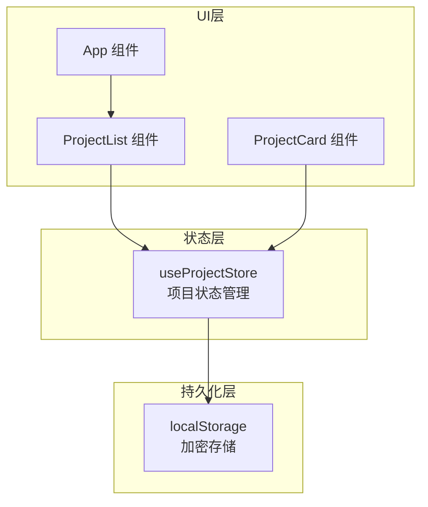
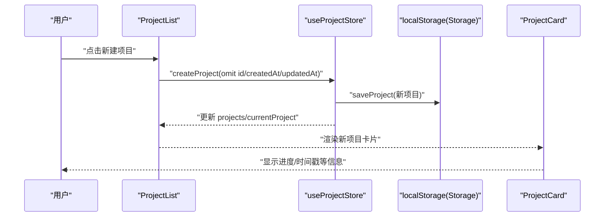
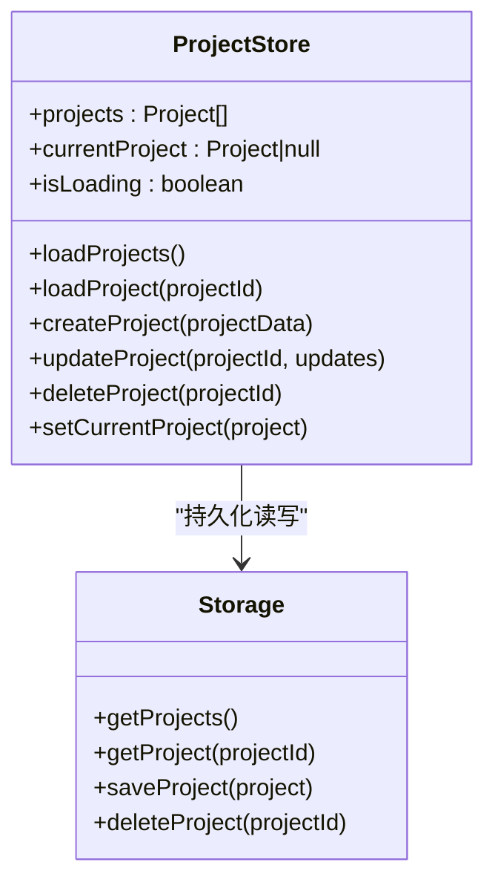
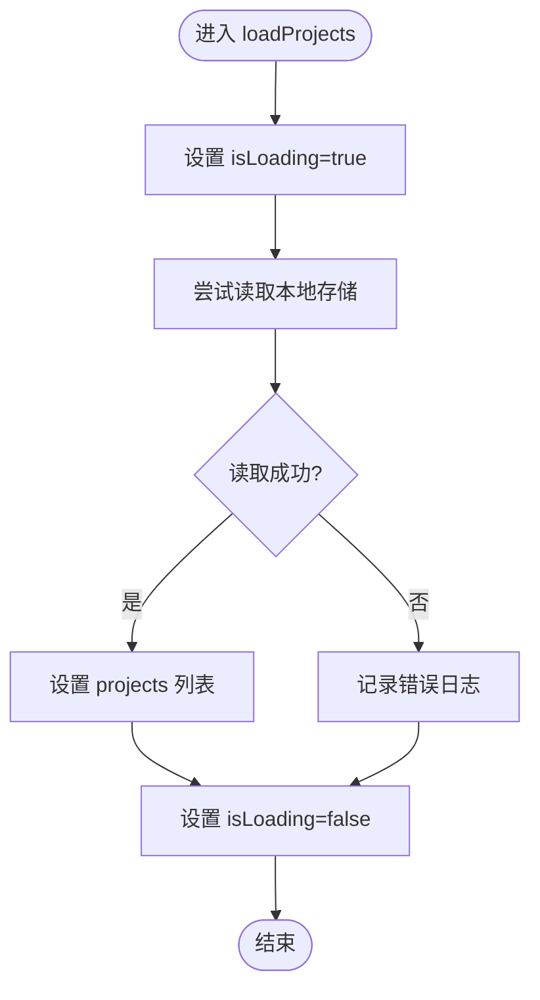
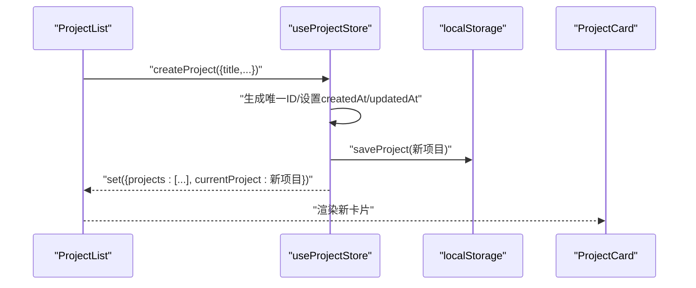
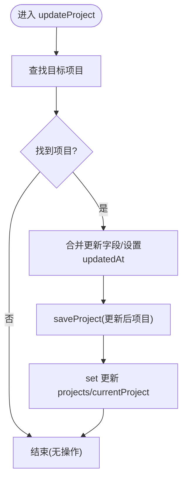
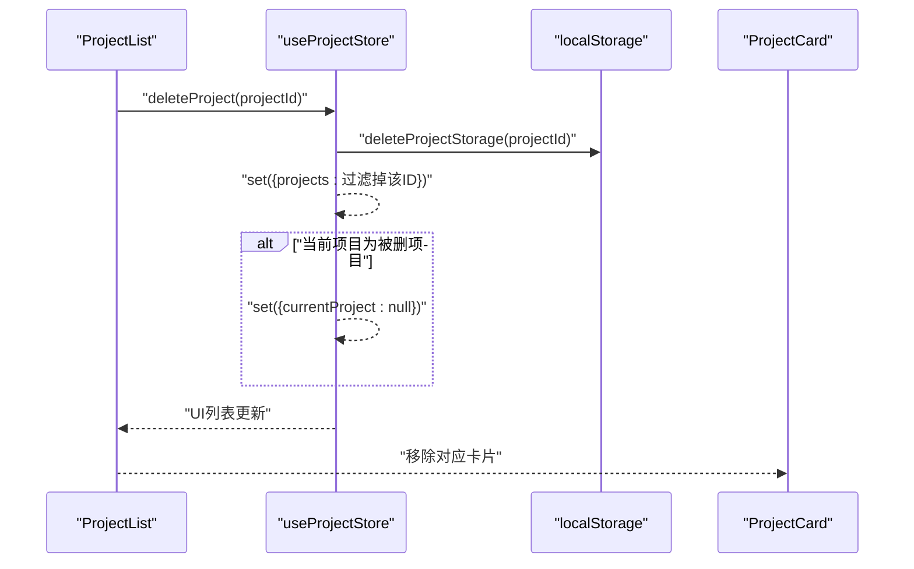
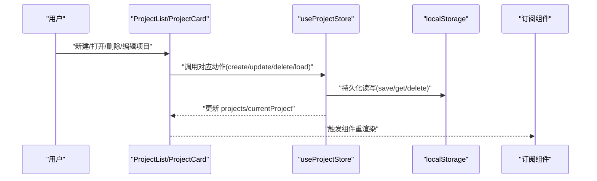
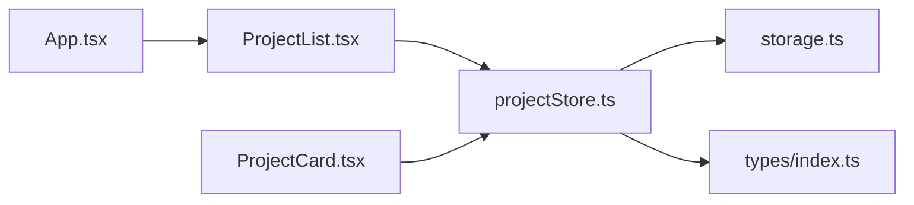

# 项目状态管理

<cite>
**本文引用的文件**
- [projectStore.ts](file://manga-creator/src/stores/projectStore.ts)
- [storage.ts](file://manga-creator/src/lib/storage.ts)
- [types/index.ts](file://manga-creator/src/types/index.ts)
- [ProjectList.tsx](file://manga-creator/src/components/ProjectList.tsx)
- [ProjectCard.tsx](file://manga-creator/src/components/ProjectCard.tsx)
- [App.tsx](file://manga-creator/src/App.tsx)
- [store.test.ts](file://manga-creator/src/stores/store.test.ts)
</cite>

## 目录
1. [简介](#简介)
2. [项目结构](#项目结构)
3. [核心组件](#核心组件)
4. [架构总览](#架构总览)
5. [详细组件分析](#详细组件分析)
6. [依赖关系分析](#依赖关系分析)
7. [性能考量](#性能考量)
8. [故障排查指南](#故障排查指南)
9. [结论](#结论)
10. [附录](#附录)

## 简介
本文件围绕项目状态管理进行系统化梳理，重点解析基于 Zustand 的 useProjectStore 实现机制，涵盖：
- projects 数组与 currentProject 对象的状态结构设计
- loadProjects 方法如何从本地存储异步加载项目列表并处理错误边界
- createProject 方法生成唯一 ID、设置时间戳及持久化到存储的完整流程，以及对 UI 状态的同步更新机制
- updateProject 在更新项目元数据时如何维护 createdAt 不变性，并触发视图重渲染
- deleteProject 删除操作的级联影响，包括从项目列表移除及清空当前项目引用的逻辑
- 状态变更流程图，展示从用户操作到 store 更新再到组件响应的完整数据流路径

## 项目结构
项目采用“按功能域划分”的组织方式，状态层位于 stores 目录，数据持久化封装在 lib/storage.ts 中，UI 层通过组件消费 store 并触发动作。

图表来源
- [projectStore.ts](file://manga-creator/src/stores/projectStore.ts#L1-L95)
- [storage.ts](file://manga-creator/src/lib/storage.ts#L1-L246)
- [App.tsx](file://manga-creator/src/App.tsx#L1-L81)
- [ProjectList.tsx](file://manga-creator/src/components/ProjectList.tsx#L1-L196)
- [ProjectCard.tsx](file://manga-creator/src/components/ProjectCard.tsx#L1-L110)

章节来源
- [projectStore.ts](file://manga-creator/src/stores/projectStore.ts#L1-L95)
- [storage.ts](file://manga-creator/src/lib/storage.ts#L1-L246)
- [App.tsx](file://manga-creator/src/App.tsx#L1-L81)

## 核心组件
- useProjectStore：Zustand store，负责项目列表、当前项目、加载状态等状态管理，提供 loadProjects、createProject、updateProject、deleteProject、setCurrentProject 等方法。
- storage.ts：封装 localStorage 读写、加密、版本迁移、场景数据联动删除等能力。
- 类型定义：Project 接口、WorkflowState 枚举等，确保状态结构一致性和类型安全。
- UI 组件：ProjectList、ProjectCard 作为 store 的消费者，驱动状态变更与视图更新。

章节来源
- [projectStore.ts](file://manga-creator/src/stores/projectStore.ts#L1-L95)
- [storage.ts](file://manga-creator/src/lib/storage.ts#L1-L246)
- [types/index.ts](file://manga-creator/src/types/index.ts#L1-L190)
- [ProjectList.tsx](file://manga-creator/src/components/ProjectList.tsx#L1-L196)
- [ProjectCard.tsx](file://manga-creator/src/components/ProjectCard.tsx#L1-L110)

## 架构总览
Zustand store 以函数式方式定义状态与派生逻辑；storage.ts 提供统一的数据持久化入口；UI 组件通过 hooks 订阅状态并在交互时调用 store 动作。

图表来源
- [ProjectList.tsx](file://manga-creator/src/components/ProjectList.tsx#L32-L88)
- [projectStore.ts](file://manga-creator/src/stores/projectStore.ts#L42-L61)
- [storage.ts](file://manga-creator/src/lib/storage.ts#L68-L84)
- [ProjectCard.tsx](file://manga-creator/src/components/ProjectCard.tsx#L1-L110)

## 详细组件分析

### useProjectStore 状态结构与方法
- 状态字段
  - projects: Project[] 列表
  - currentProject: Project | null 当前选中项目
  - isLoading: boolean 加载中标志（用于 UI 反馈）
- 关键方法
  - loadProjects: 异步从 localStorage 读取项目列表，设置 isLoading 并处理异常
  - loadProject: 从 localStorage 获取指定项目并设置为 currentProject
  - createProject: 生成唯一 ID、设置 createdAt/updatedAt、持久化并同步更新 projects/currentProject
  - updateProject: 合并更新字段、更新 updatedAt、持久化并同步更新 projects/currentProject
  - deleteProject: 删除项目并清理 localStorage，同时从 projects 移除并清空 currentProject（若被删除）
  - setCurrentProject: 直接设置 currentProject

图表来源
- [projectStore.ts](file://manga-creator/src/stores/projectStore.ts#L1-L95)
- [storage.ts](file://manga-creator/src/lib/storage.ts#L52-L98)

章节来源
- [projectStore.ts](file://manga-creator/src/stores/projectStore.ts#L1-L95)

### loadProjects：从本地存储异步加载项目列表
- 行为要点
  - 设置 isLoading=true
  - 调用 getProjects 读取本地存储
  - 成功后设置 projects，并将 isLoading=false
  - 发生异常时记录错误并恢复 isLoading=false
- 错误边界
  - try/catch 包裹读取逻辑，保证 UI 不阻塞
  - 返回空数组兜底，避免类型错误

图表来源
- [projectStore.ts](file://manga-creator/src/stores/projectStore.ts#L24-L33)
- [storage.ts](file://manga-creator/src/lib/storage.ts#L52-L61)

章节来源
- [projectStore.ts](file://manga-creator/src/stores/projectStore.ts#L24-L33)
- [storage.ts](file://manga-creator/src/lib/storage.ts#L52-L61)

### createProject：生成唯一 ID、设置时间戳与持久化
- 唯一 ID 生成策略
  - 使用 proj_{时间戳}_{随机字符串片段} 的格式，确保全局唯一性
- 时间戳策略
  - createdAt/updatedAt 初始化为当前时间字符串
- 持久化与 UI 同步
  - 先 saveProject 写入 localStorage
  - 再 set 同步更新 projects 与 currentProject
- UI 响应
  - ProjectList 在创建成功后打开编辑器，ProjectCard 展示新项目信息

图表来源
- [ProjectList.tsx](file://manga-creator/src/components/ProjectList.tsx#L40-L66)
- [projectStore.ts](file://manga-creator/src/stores/projectStore.ts#L42-L61)
- [storage.ts](file://manga-creator/src/lib/storage.ts#L68-L84)
- [ProjectCard.tsx](file://manga-creator/src/components/ProjectCard.tsx#L1-L110)

章节来源
- [projectStore.ts](file://manga-creator/src/stores/projectStore.ts#L42-L61)
- [ProjectList.tsx](file://manga-creator/src/components/ProjectList.tsx#L40-L66)
- [store.test.ts](file://manga-creator/src/stores/store.test.ts#L86-L159)

### updateProject：维护 createdAt 不变性并触发重渲染
- 不变性保障
  - 仅更新 updatedAt 为当前时间字符串，保持 createdAt 不变
- 持久化与同步
  - saveProject 写入更新后的项目
  - set 同步更新 projects 列表与 currentProject（若当前项目即为该 ID）
- 视图重渲染
  - 由于状态字段被替换，React 组件订阅到变化后会重新渲染

图表来源
- [projectStore.ts](file://manga-creator/src/stores/projectStore.ts#L63-L81)
- [storage.ts](file://manga-creator/src/lib/storage.ts#L68-L84)

章节来源
- [projectStore.ts](file://manga-creator/src/stores/projectStore.ts#L63-L81)
- [store.test.ts](file://manga-creator/src/stores/store.test.ts#L161-L254)

### deleteProject：级联影响与清理
- 删除流程
  - deleteProjectStorage 删除项目记录
  - set 从 projects 列表过滤掉该 ID
  - 若当前项目正是被删除的项目，则清空 currentProject
- 场景数据联动
  - storage.ts 同步删除对应项目的场景数据键值

图表来源
- [ProjectList.tsx](file://manga-creator/src/components/ProjectList.tsx#L73-L88)
- [projectStore.ts](file://manga-creator/src/stores/projectStore.ts#L83-L89)
- [storage.ts](file://manga-creator/src/lib/storage.ts#L86-L98)

章节来源
- [projectStore.ts](file://manga-creator/src/stores/projectStore.ts#L83-L89)
- [store.test.ts](file://manga-creator/src/stores/store.test.ts#L256-L314)
- [storage.ts](file://manga-creator/src/lib/storage.ts#L86-L98)

### 状态变更流程图：从用户操作到组件响应

图表来源
- [ProjectList.tsx](file://manga-creator/src/components/ProjectList.tsx#L32-L196)
- [ProjectCard.tsx](file://manga-creator/src/components/ProjectCard.tsx#L1-L110)
- [projectStore.ts](file://manga-creator/src/stores/projectStore.ts#L1-L95)
- [storage.ts](file://manga-creator/src/lib/storage.ts#L52-L98)

## 依赖关系分析
- 组件依赖
  - App 在挂载时初始化存储并加载项目与配置
  - ProjectList 依赖 useProjectStore 的 create/delete/setCurrentProject 等动作
  - ProjectCard 依赖 Project 类型与 UI 组件
- store 依赖
  - useProjectStore 依赖 storage.ts 的 getProjects/saveProject/deleteProject/getProject
- 类型依赖
  - Project 接口、WorkflowState 枚举等由 types/index.ts 定义，确保 store 与 UI 的一致性

图表来源
- [App.tsx](file://manga-creator/src/App.tsx#L1-L81)
- [ProjectList.tsx](file://manga-creator/src/components/ProjectList.tsx#L1-L196)
- [ProjectCard.tsx](file://manga-creator/src/components/ProjectCard.tsx#L1-L110)
- [projectStore.ts](file://manga-creator/src/stores/projectStore.ts#L1-L95)
- [storage.ts](file://manga-creator/src/lib/storage.ts#L1-L246)
- [types/index.ts](file://manga-creator/src/types/index.ts#L1-L190)

章节来源
- [App.tsx](file://manga-creator/src/App.tsx#L1-L81)
- [ProjectList.tsx](file://manga-creator/src/components/ProjectList.tsx#L1-L196)
- [ProjectCard.tsx](file://manga-creator/src/components/ProjectCard.tsx#L1-L110)
- [projectStore.ts](file://manga-creator/src/stores/projectStore.ts#L1-L95)
- [storage.ts](file://manga-creator/src/lib/storage.ts#L1-L246)
- [types/index.ts](file://manga-creator/src/types/index.ts#L1-L190)

## 性能考量
- 本地存储读写
  - getProjects/saveProject/deleteProject 均为 O(n) 遍历与序列化，n 为项目数量
  - 大量项目时建议分页或懒加载策略
- 渲染优化
  - 通过替换 projects/currentProject 引发的重渲染属于浅比较层面的更新，React 会根据引用变化触发重渲染
  - 可考虑使用 selector 选择器减少无关组件重渲染
- 加密与版本迁移
  - 加密/解密与版本迁移在 initStorage 中执行，避免频繁重复计算

[本节为通用指导，无需特定文件来源]

## 故障排查指南
- 无法加载项目
  - 检查 localStorage 中 aixs_projects 是否存在且可 JSON 解析
  - 查看 loadProjects 的错误日志输出
- 保存失败
  - storage.ts 在 saveProject 抛出错误，检查本地存储容量与权限
- 删除后仍可见
  - 确认 deleteProjectStorage 已删除对应项目键值，并检查 projects 列表是否同步更新
- 当前项目未清空
  - 确认 deleteProject 在删除匹配 ID 时设置了 currentProject 为 null

章节来源
- [projectStore.ts](file://manga-creator/src/stores/projectStore.ts#L24-L33)
- [storage.ts](file://manga-creator/src/lib/storage.ts#L68-L98)
- [store.test.ts](file://manga-creator/src/stores/store.test.ts#L256-L314)

## 结论
useProjectStore 以简洁的 Zustand API 实现了项目状态的集中管理，结合 storage.ts 的本地持久化与类型约束，形成了清晰、可测试、可扩展的状态层。通过明确的生命周期（初始化加载、动作触发、持久化、UI 同步）与错误边界处理，保证了用户体验与数据一致性。后续可在大列表场景引入分页/懒加载、selector 优化渲染等方面进一步提升性能。

[本节为总结性内容，无需特定文件来源]

## 附录
- 关键 API 一览
  - loadProjects：从本地存储加载项目列表
  - createProject：创建新项目并持久化
  - updateProject：更新项目元数据并持久化
  - deleteProject：删除项目并清理关联数据
  - setCurrentProject：设置当前项目

章节来源
- [projectStore.ts](file://manga-creator/src/stores/projectStore.ts#L1-L95)
- [storage.ts](file://manga-creator/src/lib/storage.ts#L52-L98)
- [store.test.ts](file://manga-creator/src/stores/store.test.ts#L86-L409)