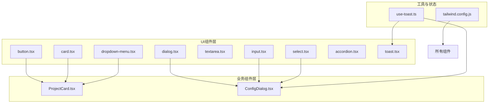
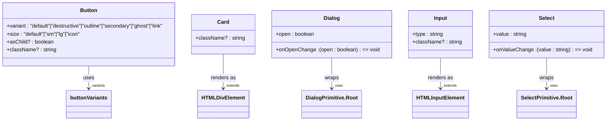
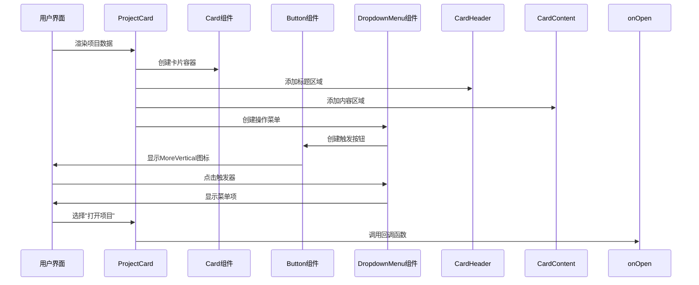
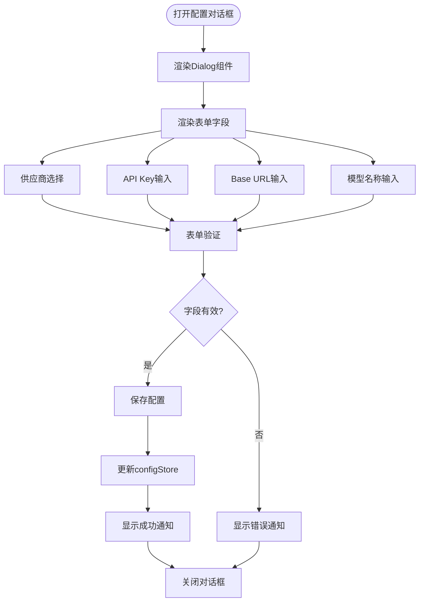

# UI组件库

<cite>
**本文档中引用的文件**  
- [button.tsx](file://manga-creator/src/components/ui/button.tsx)
- [card.tsx](file://manga-creator/src/components/ui/card.tsx)
- [dialog.tsx](file://manga-creator/src/components/ui/dialog.tsx)
- [input.tsx](file://manga-creator/src/components/ui/input.tsx)
- [textarea.tsx](file://manga-creator/src/components/ui/textarea.tsx)
- [select.tsx](file://manga-creator/src/components/ui/select.tsx)
- [dropdown-menu.tsx](file://manga-creator/src/components/ui/dropdown-menu.tsx)
- [accordion.tsx](file://manga-creator/src/components/ui/accordion.tsx)
- [toast.tsx](file://manga-creator/src/components/ui/toast.tsx)
- [toaster.tsx](file://manga-creator/src/components/ui/toaster.tsx)
- [ProjectCard.tsx](file://manga-creator/src/components/ProjectCard.tsx)
- [ConfigDialog.tsx](file://manga-creator/src/components/ConfigDialog.tsx)
- [use-toast.ts](file://manga-creator/src/hooks/use-toast.ts)
- [tailwind.config.js](file://manga-creator/tailwind.config.js)
</cite>

## 目录
1. [简介](#简介)
2. [项目结构](#项目结构)
3. [核心UI组件](#核心ui组件)
4. [原子化组件体系](#原子化组件体系)
5. [复合组件实践](#复合组件实践)
6. [主题与样式定制](#主题与样式定制)
7. [无障碍访问指南](#无障碍访问指南)
8. [总结](#总结)

## 简介
本文档系统性地描述了基于Shadcn/ui构建的原子化UI组件体系，涵盖Button、Card、Dialog、Input、Textarea、Select、DropdownMenu、Accordion、Toast等基础组件的视觉设计规范、交互行为模式及可配置属性。详细说明了这些组件在业务界面中的复用实践，如ProjectCard如何组合Card和Button实现项目卡片，ConfigDialog如何利用Dialog、Input和Select构建配置表单。文档还提供了每个组件的Props接口定义、事件回调机制、插槽（slot）支持及样式定制方法，结合Tailwind CSS原子类说明主题定制方案，并包含无障碍访问（a11y）合规性指南。

## 项目结构
项目采用基于Shadcn/ui的原子化组件设计模式，将UI分解为可复用的基础组件。核心UI组件位于`src/components/ui/`目录下，业务组件如ProjectCard和ConfigDialog则位于`src/components/`目录中。通过这种方式实现了组件的高度可复用性和一致性。

**图示来源**
- [button.tsx](file://manga-creator/src/components/ui/button.tsx)
- [card.tsx](file://manga-creator/src/components/ui/card.tsx)
- [dialog.tsx](file://manga-creator/src/components/ui/dialog.tsx)
- [input.tsx](file://manga-creator/src/components/ui/input.tsx)
- [select.tsx](file://manga-creator/src/components/ui/select.tsx)
- [dropdown-menu.tsx](file://manga-creator/src/components/ui/dropdown-menu.tsx)
- [ProjectCard.tsx](file://manga-creator/src/components/ProjectCard.tsx)
- [ConfigDialog.tsx](file://manga-creator/src/components/ConfigDialog.tsx)
- [use-toast.ts](file://manga-creator/src/hooks/use-toast.ts)
- [tailwind.config.js](file://manga-creator/tailwind.config.js)

**本节来源**
- [manga-creator/src/components/ui/](file://manga-creator/src/components/ui/)
- [manga-creator/src/components/](file://manga-creator/src/components/)

## 核心UI组件

### Button组件
Button组件是基础的交互元素，支持多种变体和尺寸。通过`buttonVariants`使用class-variance-authority(CVA)定义了不同的视觉状态，包括默认、破坏性、轮廓、次要、幽灵和链接样式。

**属性接口**
- `variant`: 按钮变体（default, destructive, outline, secondary, ghost, link）
- `size`: 按钮尺寸（default, sm, lg, icon）
- `asChild`: 布尔值，当为true时使用Slot组件渲染子元素
- 继承`React.ButtonHTMLAttributes<HTMLButtonElement>`的所有原生按钮属性

**交互行为**
- 提供悬停效果和焦点状态
- 禁用状态自动应用半透明效果和指针事件禁用
- 图标自动设置为不可点击且大小统一为4

**本节来源**
- [button.tsx](file://manga-creator/src/components/ui/button.tsx#L7-L57)

### Card组件
Card组件提供了一个容器化的信息展示区域，由多个子组件组成：CardHeader、CardTitle、CardDescription、CardContent和CardFooter。这种分解设计允许灵活的内容组织。

**组件结构**
- `Card`: 主容器，提供边框、背景色和阴影
- `CardHeader`: 标题区域，包含标题和描述
- `CardTitle`: 主标题，使用加粗字体
- `CardDescription`: 副标题，使用较细的字体颜色
- `CardContent`: 内容区域，提供内边距
- `CardFooter`: 页脚区域，通常用于操作按钮

**视觉设计**
- 圆角为xl级别（通常为0.75rem）
- 包含边框和阴影效果
- 使用语义化的颜色变量（如bg-card, text-card-foreground）

**本节来源**
- [card.tsx](file://manga-creator/src/components/ui/card.tsx#L5-L76)

### Dialog组件
Dialog组件提供模态对话框功能，基于Radix UI的Dialog原语构建，确保了无障碍访问的合规性。

**组件组成**
- `Dialog`: 根组件，管理打开/关闭状态
- `DialogTrigger`: 触发器按钮
- `DialogContent`: 对话框内容区域
- `DialogHeader`: 头部区域，通常包含标题
- `DialogTitle`: 对话框标题
- `DialogDescription`: 对话框描述文本
- `DialogFooter`: 页脚区域，通常包含操作按钮
- `DialogClose`: 关闭按钮

**交互特性**
- 背景overlay提供半透明遮罩
- 支持动画过渡效果（淡入淡出、缩放）
- 点击遮罩或按ESC键可关闭对话框
- 自动聚焦到第一个可聚焦元素
- 包含屏幕阅读器友好的"Close"隐藏文本

**本节来源**
- [dialog.tsx](file://manga-creator/src/components/ui/dialog.tsx#L8-L121)

### Input与Textarea组件
Input和Textarea组件提供了表单输入的基础构建块，具有一致的视觉样式和交互行为。

**共同特性**
- 统一的边框样式和阴影效果
- 聚焦状态显示环形指示器
- 占位符文本使用语义化颜色
- 禁用状态自动应用半透明效果
- 支持MD尺寸的文本（md:text-sm）

**Input特有属性**
- 高度固定为9（h-9）
- 水平内边距为3（px-3）
- 支持所有原生input属性

**Textarea特有属性**
- 最小高度为60px
- 垂直内边距为2（py-2）
- 支持所有原生textarea属性

**本节来源**
- [input.tsx](file://manga-creator/src/components/ui/input.tsx#L5-L22)
- [textarea.tsx](file://manga-creator/src/components/ui/textarea.tsx#L5-L22)

### Select组件
Select组件提供下拉选择功能，基于Radix UI的Select原语构建，支持丰富的交互特性。

**组件结构**
- `Select`: 根组件
- `SelectTrigger`: 触发器，显示当前选择
- `SelectValue`: 显示选择值
- `SelectContent`: 下拉内容容器
- `SelectItem`: 可选项
- `SelectGroup`: 选项分组
- `SelectLabel`: 分组标签
- `SelectSeparator`: 分隔线
- `SelectScrollUpButton/SelectScrollDownButton`: 滚动按钮

**交互行为**
- 触发器显示向下的Chevron图标
- 选中项左侧显示Check图标
- 支持键盘导航（上下箭头、Enter、Escape）
- 长列表自动显示滚动按钮
- 支持popper定位策略

**本节来源**
- [select.tsx](file://manga-creator/src/components/ui/select.tsx#L8-L158)

### DropdownMenu组件
DropdownMenu组件提供上下文菜单功能，支持嵌套子菜单和多种菜单项类型。

**组件类型**
- `DropdownMenuItem`: 普通菜单项
- `DropdownMenuCheckboxItem`: 复选框菜单项
- `DropdownMenuRadioItem`: 单选按钮菜单项
- `DropdownMenuSub`: 子菜单容器
- `DropdownMenuSubTrigger`: 子菜单触发器
- `DropdownMenuSubContent`: 子菜单内容

**视觉特性**
- 菜单项左侧有绝对定位的指示器区域
- 复选框项使用Check图标
- 单选项使用DotFilled图标
- 子菜单触发器右侧显示ChevronRight图标
- 支持inset属性创建缩进菜单项

**本节来源**
- [dropdown-menu.tsx](file://manga-creator/src/components/ui/dropdown-menu.tsx#L6-L198)

### Accordion组件
Accordion组件提供可折叠的内容区域，基于Radix UI的Accordion原语构建。

**组件组成**
- `Accordion`: 根组件，管理多个可折叠项
- `AccordionItem`: 单个可折叠项
- `AccordionTrigger`: 触发器，点击可展开/折叠
- `AccordionContent`: 内容区域

**交互特性**
- 触发器左侧显示ChevronDown图标
- 展开时图标旋转180度
- 内容区域使用动画过渡（animate-accordion-up/down）
- 支持单个或多个同时展开

**本节来源**
- [accordion.tsx](file://manga-creator/src/components/ui/accordion.tsx#L8-L56)

### Toast组件
Toast组件提供临时通知功能，基于Radix UI的Toast原语构建，支持多种通知类型。

**组件结构**
- `ToastProvider`: 通知提供者，管理通知队列
- `ToastViewport`: 通知视口，定义显示位置
- `Toast`: 单个通知
- `ToastTitle`: 通知标题
- `ToastDescription`: 通知描述
- `ToastAction`: 操作按钮
- `ToastClose`: 关闭按钮

**通知类型**
- `default`: 默认样式
- `destructive`: 破坏性样式（红色主题）

**交互行为**
- 支持手势滑动关闭
- 自动消失（通过TOAST_REMOVE_DELAY配置）
- 支持立即关闭
- 悬停时显示关闭按钮

**本节来源**
- [toast.tsx](file://manga-creator/src/components/ui/toast.tsx#L7-L126)
- [toaster.tsx](file://manga-creator/src/components/ui/toaster.tsx#L1-L33)

## 原子化组件体系

### 组件设计原则
本UI组件库遵循原子化设计原则，将用户界面分解为最基本的构建块（原子），然后组合成更复杂的结构（分子、有机体）。

**设计优势**
- **一致性**: 所有组件使用相同的颜色、间距和字体系统
- **可维护性**: 修改基础样式可全局生效
- **可复用性**: 组件可在不同场景中重复使用
- **可测试性**: 独立的组件更易于单元测试

**技术实现**
- 使用Radix UI原语确保无障碍访问
- 通过CVA(class-variance-authority)管理样式变体
- 使用Tailwind CSS原子类进行样式组合
- 通过`cn`工具函数合并类名

**图示来源**
- [button.tsx](file://manga-creator/src/components/ui/button.tsx#L37-L57)
- [card.tsx](file://manga-creator/src/components/ui/card.tsx#L5-L17)
- [dialog.tsx](file://manga-creator/src/components/ui/dialog.tsx#L8-L15)
- [input.tsx](file://manga-creator/src/components/ui/input.tsx#L5-L19)
- [select.tsx](file://manga-creator/src/components/ui/select.tsx#L8-L14)

**本节来源**
- [manga-creator/src/components/ui/](file://manga-creator/src/components/ui/)

## 复合组件实践

### ProjectCard组件
ProjectCard是一个复合组件，展示了如何将基础UI组件组合成业务组件。

**组件组合**
- 使用`Card`作为容器
- 使用`CardHeader`和`CardContent`组织内容
- 使用`Button`和`DropdownMenu`提供操作
- 使用`CardTitle`和`CardDescription`显示项目信息

**业务逻辑**
- 根据工作流状态计算进度百分比
- 格式化创建日期为中文格式
- 提供打开和删除项目的回调函数
- 实现悬停动画效果（阴影、缩放、色相变化）

**交互设计**
- 整个卡片可点击打开项目
- 右上角的下拉菜单提供操作选项
- 进度条使用渐变色和过渡动画
- 悬停时显示增强的视觉反馈

**图示来源**
- [ProjectCard.tsx](file://manga-creator/src/components/ProjectCard.tsx#L18-L109)
- [card.tsx](file://manga-creator/src/components/ui/card.tsx)
- [button.tsx](file://manga-creator/src/components/ui/button.tsx)
- [dropdown-menu.tsx](file://manga-creator/src/components/ui/dropdown-menu.tsx)

**本节来源**
- [ProjectCard.tsx](file://manga-creator/src/components/ProjectCard.tsx#L1-L109)

### ConfigDialog组件
ConfigDialog是另一个复合组件，展示了如何构建复杂的表单界面。

**组件组合**
- 使用`Dialog`作为模态窗口
- 使用`Input`和`Select`收集用户输入
- 使用`Button`提供操作
- 使用`Label`关联表单字段
- 使用`Toast`提供反馈

**状态管理**
- 使用`useConfigStore`管理配置状态
- 使用`useState`管理表单本地状态
- 使用`useEffect`同步配置到表单
- 使用`useToast`提供用户反馈

**表单验证**
- 保存时验证必填字段
- 提供即时的连接测试功能
- 显示验证错误通知
- 测试连接时显示加载状态

**安全特性**
- API Key输入支持密码掩码切换
- 数据在本地加密存储
- 提供测试连接功能验证配置有效性

**图示来源**
- [ConfigDialog.tsx](file://manga-creator/src/components/ConfigDialog.tsx#L24-L196)
- [dialog.tsx](file://manga-creator/src/components/ui/dialog.tsx)
- [input.tsx](file://manga-creator/src/components/ui/input.tsx)
- [select.tsx](file://manga-creator/src/components/ui/select.tsx)
- [use-toast.ts](file://manga-creator/src/hooks/use-toast.ts)

**本节来源**
- [ConfigDialog.tsx](file://manga-creator/src/components/ConfigDialog.tsx#L1-L196)

## 主题与样式定制

### Tailwind配置
项目使用Tailwind CSS进行样式管理，通过`tailwind.config.js`定义了设计系统。

**颜色系统**
- 使用CSS变量实现主题切换
- 定义了语义化颜色（primary, secondary, destructive等）
- 每种颜色包含DEFAULT和foreground变体
- 支持明暗模式切换（darkMode: ["class"]）

**间距与圆角**
- 圆角使用CSS变量--radius控制
- 定义了lg、md、sm三级圆角
- 通过calc()函数创建层次化的圆角系统

**动画与过渡**
- 定义了手风琴展开/收起动画
- 配置了动画持续时间（0.2s）和缓动函数（ease-out）
- 使用Radix UI的data-state属性控制动画状态

**本节来源**
- [tailwind.config.js](file://manga-creator/tailwind.config.js#L1-L93)

### 样式组合策略
组件库采用多种技术实现灵活的样式定制。

**CVA(Class Variance Authority)**
- 用于Button和Toast组件的样式变体管理
- 允许在运行时根据props选择样式组合
- 提供默认变体配置

**cn工具函数**
- 用于合并类名，处理条件类名
- 确保类名不会重复
- 支持动态类名生成

**原子类组合**
- 基础组件使用Tailwind原子类构建
- 通过组合原子类实现复杂的视觉效果
- 保持样式与组件逻辑的分离

**本节来源**
- [button.tsx](file://manga-creator/src/components/ui/button.tsx#L7-L35)
- [toast.tsx](file://manga-creator/src/components/ui/toast.tsx#L24-L37)
- [utils.ts](file://manga-creator/src/lib/utils.ts)

## 无障碍访问指南

### ARIA最佳实践
所有组件遵循WAI-ARIA最佳实践，确保屏幕阅读器用户能够正常使用。

**通用原则**
- 所有交互元素都有适当的键盘支持
- 使用语义化的HTML元素
- 提供足够的对比度
- 支持焦点管理

**具体实现**
- Button组件使用原生button元素
- Dialog组件包含sr-only的"Close"文本
- 表单元素通过Label关联
- 状态变化通过ARIA属性传达

**本节来源**
- [button.tsx](file://manga-creator/src/components/ui/button.tsx)
- [dialog.tsx](file://manga-creator/src/components/ui/dialog.tsx#L48)
- [input.tsx](file://manga-creator/src/components/ui/input.tsx)
- [label.tsx](file://manga-creator/src/components/ui/label.tsx)

## 总结
本文档详细介绍了基于Shadcn/ui构建的原子化UI组件体系。通过分析Button、Card、Dialog等基础组件的实现，展示了如何创建一致、可复用的UI元素。通过ProjectCard和ConfigDialog的案例，说明了如何将基础组件组合成复杂的业务界面。组件库充分利用了Radix UI的无障碍特性、Tailwind CSS的原子化样式和CVA的变体管理，创建了一个现代化、可维护的UI系统。开发者可以基于这些组件快速构建符合设计规范的用户界面，同时确保良好的用户体验和可访问性。