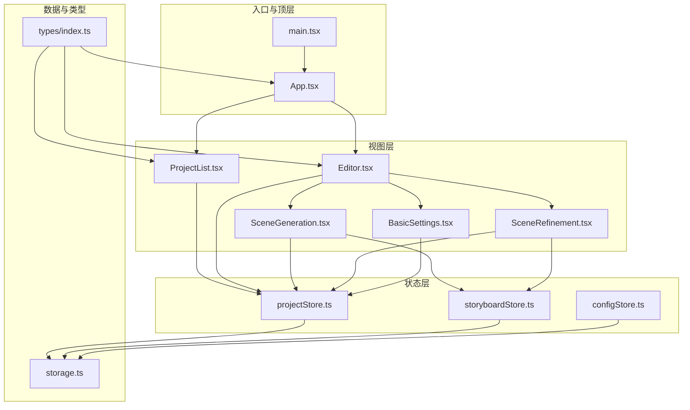
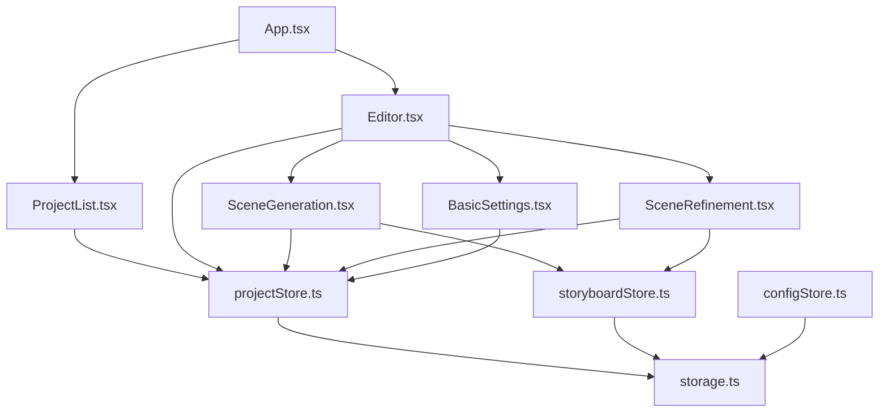
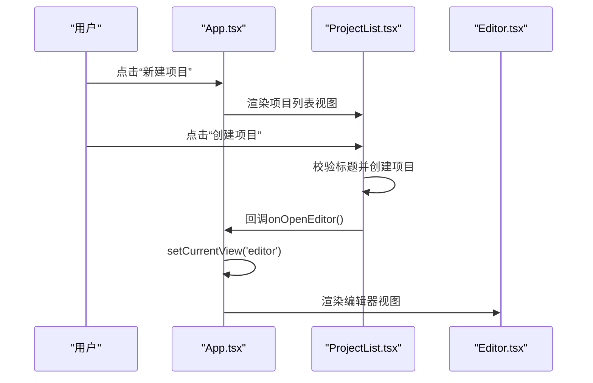
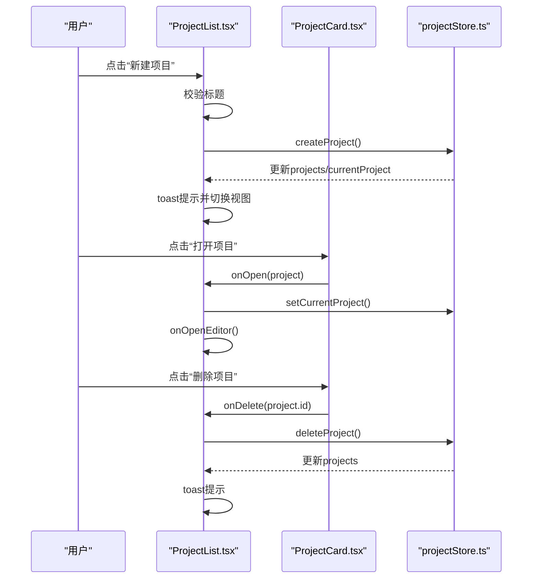
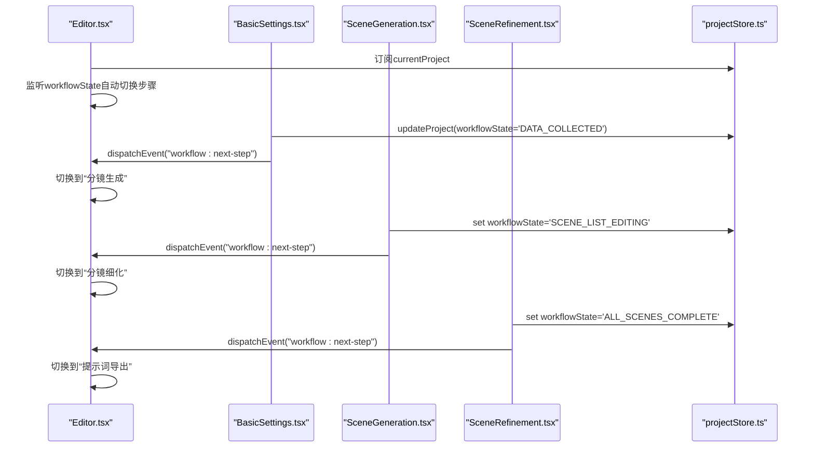
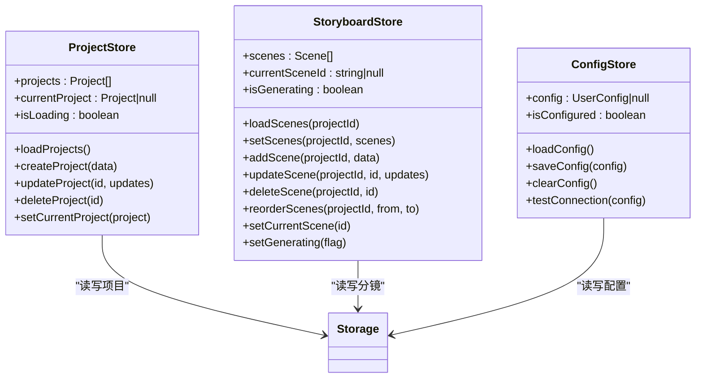
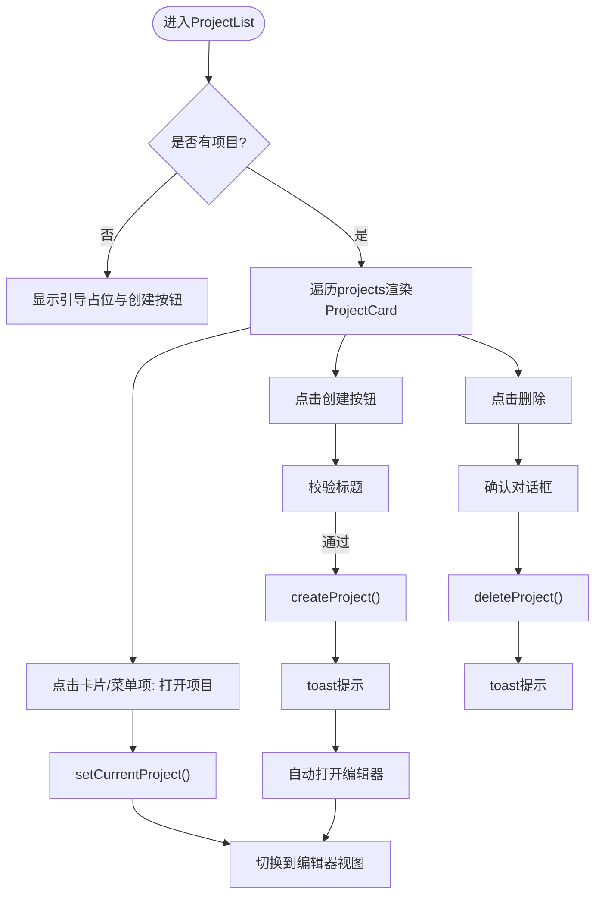
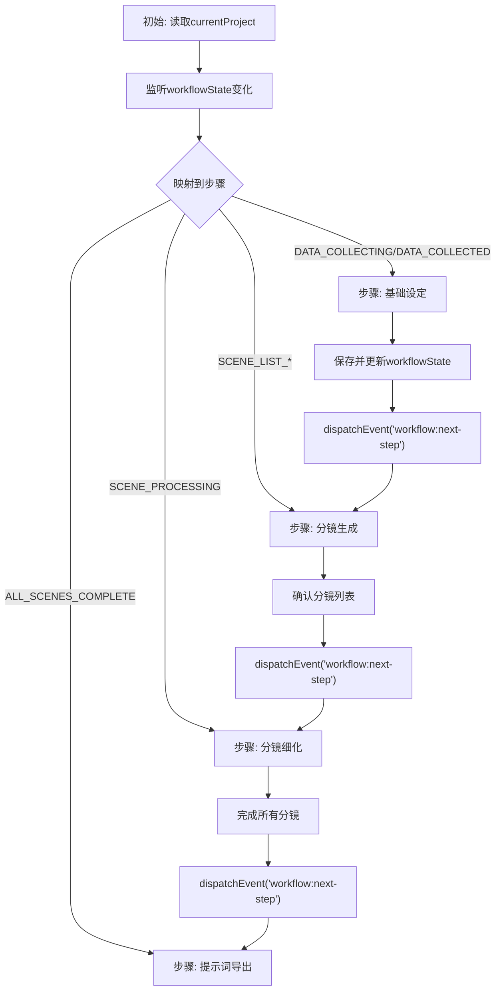
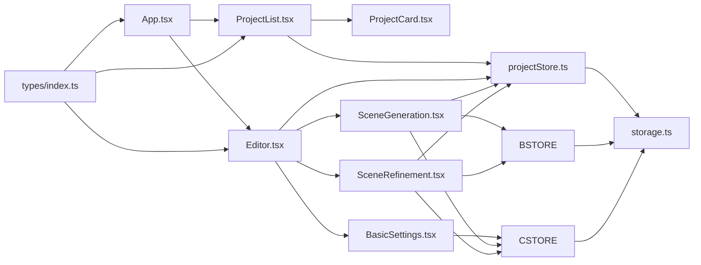

# 核心组件

<cite>
**本文引用的文件**
- [App.tsx](file://manga-creator/src/App.tsx)
- [ProjectList.tsx](file://manga-creator/src/components/ProjectList.tsx)
- [ProjectCard.tsx](file://manga-creator/src/components/ProjectCard.tsx)
- [Editor.tsx](file://manga-creator/src/components/Editor.tsx)
- [BasicSettings.tsx](file://manga-creator/src/components/editor/BasicSettings.tsx)
- [SceneGeneration.tsx](file://manga-creator/src/components/editor/SceneGeneration.tsx)
- [SceneRefinement.tsx](file://manga-creator/src/components/editor/SceneRefinement.tsx)
- [storyboardStore.ts](file://manga-creator/src/stores/storyboardStore.ts)
- [projectStore.ts](file://manga-creator/src/stores/projectStore.ts)
- [configStore.ts](file://manga-creator/src/stores/configStore.ts)
- [storage.ts](file://manga-creator/src/lib/storage.ts)
- [types/index.ts](file://manga-creator/src/types/index.ts)
- [main.tsx](file://manga-creator/src/main.tsx)
</cite>

## 目录
1. [引言](#引言)
2. [项目结构](#项目结构)
3. [核心组件](#核心组件)
4. [架构总览](#架构总览)
5. [详细组件分析](#详细组件分析)
6. [依赖分析](#依赖分析)
7. [性能考虑](#性能考虑)
8. [故障排查指南](#故障排查指南)
9. [结论](#结论)

## 引言
本文件面向开发者，系统梳理漫画创作应用的核心业务组件架构，重点说明：
- App根组件如何作为应用主入口协调“项目列表”与“编辑器”两大视图模块；
- 如何通过Zustand状态管理实现跨组件数据流与工作流状态驱动；
- ProjectList组件的项目列表渲染机制及其与ProjectCard的父子通信方式（创建、打开、删除）；
- Editor组件的多步骤创作界面组织结构，涵盖BasicSettings、SceneGeneration、SceneRefinement等子组件的布局策略、状态共享与storyboardStore的数据同步逻辑；
- 结合实际代码路径说明组件间依赖关系与生命周期管理，并提供组件树结构图与状态流动时序图，帮助理解整体UI架构与数据驱动机制。

## 项目结构
项目采用按功能域划分的目录组织，核心入口位于src目录，主要模块如下：
- 根入口与顶层视图：App、Editor、ProjectList
- 编辑器子组件：BasicSettings、SceneGeneration、SceneRefinement、PromptExport
- 状态层：projectStore、storyboardStore、configStore
- 数据持久化：storage（LocalStorage封装）
- 类型定义：types（项目、分镜、工作流状态、AI配置等）

图表来源
- [main.tsx](file://manga-creator/src/main.tsx#L1-L11)
- [App.tsx](file://manga-creator/src/App.tsx#L1-L81)
- [ProjectList.tsx](file://manga-creator/src/components/ProjectList.tsx#L1-L196)
- [Editor.tsx](file://manga-creator/src/components/Editor.tsx#L1-L172)
- [BasicSettings.tsx](file://manga-creator/src/components/editor/BasicSettings.tsx#L1-L224)
- [SceneGeneration.tsx](file://manga-creator/src/components/editor/SceneGeneration.tsx#L1-L383)
- [SceneRefinement.tsx](file://manga-creator/src/components/editor/SceneRefinement.tsx#L1-L638)
- [projectStore.ts](file://manga-creator/src/stores/projectStore.ts#L1-L95)
- [storyboardStore.ts](file://manga-creator/src/stores/storyboardStore.ts#L1-L107)
- [configStore.ts](file://manga-creator/src/stores/configStore.ts#L1-L58)
- [storage.ts](file://manga-creator/src/lib/storage.ts#L1-L246)
- [types/index.ts](file://manga-creator/src/types/index.ts#L1-L190)

章节来源
- [main.tsx](file://manga-creator/src/main.tsx#L1-L11)
- [App.tsx](file://manga-creator/src/App.tsx#L1-L81)

## 核心组件
本节聚焦App根组件、ProjectList与Editor三大核心组件，解释它们如何协同工作，以及Zustand状态管理如何驱动跨组件数据流。

- App根组件职责
  - 维护当前视图状态（列表/编辑器），并根据用户操作在两者间切换；
  - 初始化存储与加载项目、配置；
  - 作为顶层容器，承载导航栏、配置弹窗与全局通知。

- ProjectList组件职责
  - 列举项目，支持创建、打开、删除；
  - 将创建/打开/删除事件通过回调传递给父组件App，由App决定视图切换；
  - 使用useToast进行用户反馈。

- Editor组件职责
  - 作为创作流程的容器，依据当前项目的工作流状态自动推进步骤；
  - 提供步骤导航与状态指示，支持点击跳转；
  - 通过自定义事件“workflow:next-step”实现跨组件的无直接依赖的状态推进。

章节来源
- [App.tsx](file://manga-creator/src/App.tsx#L1-L81)
- [ProjectList.tsx](file://manga-creator/src/components/ProjectList.tsx#L1-L196)
- [Editor.tsx](file://manga-creator/src/components/Editor.tsx#L1-L172)

## 架构总览
整体采用“视图层-状态层-数据层”的分层架构：
- 视图层：App、ProjectList、Editor及其子组件
- 状态层：Zustand stores（projectStore、storyboardStore、configStore）
- 数据层：localStorage封装（storage.ts），负责本地持久化与配置加密

图表来源
- [App.tsx](file://manga-creator/src/App.tsx#L1-L81)
- [ProjectList.tsx](file://manga-creator/src/components/ProjectList.tsx#L1-L196)
- [Editor.tsx](file://manga-creator/src/components/Editor.tsx#L1-L172)
- [BasicSettings.tsx](file://manga-creator/src/components/editor/BasicSettings.tsx#L1-L224)
- [SceneGeneration.tsx](file://manga-creator/src/components/editor/SceneGeneration.tsx#L1-L383)
- [SceneRefinement.tsx](file://manga-creator/src/components/editor/SceneRefinement.tsx#L1-L638)
- [projectStore.ts](file://manga-creator/src/stores/projectStore.ts#L1-L95)
- [storyboardStore.ts](file://manga-creator/src/stores/storyboardStore.ts#L1-L107)
- [configStore.ts](file://manga-creator/src/stores/configStore.ts#L1-L58)
- [storage.ts](file://manga-creator/src/lib/storage.ts#L1-L246)

## 详细组件分析

### App根组件与视图切换
- 视图切换逻辑
  - 通过useState维护currentView（'list' | 'editor'），在返回按钮与打开编辑器时切换；
  - 顶层导航栏提供“返回项目列表”、“打开配置”等入口。
- 初始化与加载
  - 在effect中调用initStorage、loadProjects、loadConfig，确保应用启动时加载必要数据。

图表来源
- [App.tsx](file://manga-creator/src/App.tsx#L1-L81)
- [ProjectList.tsx](file://manga-creator/src/components/ProjectList.tsx#L1-L196)

章节来源
- [App.tsx](file://manga-creator/src/App.tsx#L1-L81)

### ProjectList组件与ProjectCard通信
- 渲染机制
  - 从useProjectStore读取projects并映射为ProjectCard；
  - 当projects为空时展示引导占位与创建按钮。
- 交互行为
  - 创建：表单校验后调用createProject，成功后toast提示并自动打开编辑器；
  - 打开：setCurrentProject并回调onOpenEditor；
  - 删除：通过确认对话框触发deleteProject并toast提示。
- 与ProjectCard的父子通信
  - ProjectCard接收onOpen与onDelete回调，内部使用下拉菜单触发对应操作；
  - ProjectCard内部还展示项目进度条与创建时间，便于快速预览。

图表来源
- [ProjectList.tsx](file://manga-creator/src/components/ProjectList.tsx#L1-L196)
- [ProjectCard.tsx](file://manga-creator/src/components/ProjectCard.tsx#L1-L110)
- [projectStore.ts](file://manga-creator/src/stores/projectStore.ts#L1-L95)

章节来源
- [ProjectList.tsx](file://manga-creator/src/components/ProjectList.tsx#L1-L196)
- [ProjectCard.tsx](file://manga-creator/src/components/ProjectCard.tsx#L1-L110)

### Editor组件与多步骤创作流程
- 步骤组织
  - Editor通过activeStep管理四个步骤：基础设定、分镜生成、分镜细化、提示词导出；
  - 步骤导航左侧卡片展示步骤名称与状态（当前/已完成/待开始），支持点击跳转。
- 状态驱动
  - 自动推进：监听currentProject.workflowState，根据状态映射到对应步骤；
  - 事件推进：BasicSettings与SceneGeneration在满足条件时触发“workflow:next-step”，Editor监听该事件切换步骤。
- 子组件职责
  - BasicSettings：收集项目基础信息并更新workflowState；
  - SceneGeneration：生成/编辑分镜列表，更新workflowState；
  - SceneRefinement：按阶段生成场景描述、动作描述与镜头提示词，逐步推进项目状态。

图表来源
- [Editor.tsx](file://manga-creator/src/components/Editor.tsx#L1-L172)
- [BasicSettings.tsx](file://manga-creator/src/components/editor/BasicSettings.tsx#L1-L224)
- [SceneGeneration.tsx](file://manga-creator/src/components/editor/SceneGeneration.tsx#L1-L383)
- [SceneRefinement.tsx](file://manga-creator/src/components/editor/SceneRefinement.tsx#L1-L638)
- [projectStore.ts](file://manga-creator/src/stores/projectStore.ts#L1-L95)

章节来源
- [Editor.tsx](file://manga-creator/src/components/Editor.tsx#L1-L172)

### Zustand状态管理与数据流设计
- projectStore
  - 管理项目集合与当前项目，提供加载、创建、更新、删除、设置当前项目等方法；
  - 与storage交互，持久化到localStorage。
- storyboardStore
  - 管理分镜集合、当前分镜、生成状态，提供加载、设置、新增、更新、删除、重排、设置当前分镜、设置生成状态等方法；
  - 与storage交互，按项目维度持久化分镜。
- configStore
  - 管理AI配置（provider、apiKey、baseURL、model），提供加载、保存、清空、连接测试等方法；
  - 配置采用AES加密存储。

图表来源
- [projectStore.ts](file://manga-creator/src/stores/projectStore.ts#L1-L95)
- [storyboardStore.ts](file://manga-creator/src/stores/storyboardStore.ts#L1-L107)
- [configStore.ts](file://manga-creator/src/stores/configStore.ts#L1-L58)
- [storage.ts](file://manga-creator/src/lib/storage.ts#L1-L246)

章节来源
- [projectStore.ts](file://manga-creator/src/stores/projectStore.ts#L1-L95)
- [storyboardStore.ts](file://manga-creator/src/stores/storyboardStore.ts#L1-L107)
- [configStore.ts](file://manga-creator/src/stores/configStore.ts#L1-L58)
- [storage.ts](file://manga-creator/src/lib/storage.ts#L1-L246)

### ProjectList渲染与交互流程（算法视角）
- 列表渲染：遍历projects，为每个项目渲染ProjectCard；
- 交互处理：
  - 创建：校验输入 -> 调用createProject -> 更新状态 -> toast -> 切换视图；
  - 打开：setCurrentProject -> 切换视图；
  - 删除：确认对话框 -> 调用deleteProject -> 更新状态 -> toast。
- 复杂度分析：
  - 渲染复杂度O(n)，交互操作为O(1)（除存储IO外）。

图表来源
- [ProjectList.tsx](file://manga-creator/src/components/ProjectList.tsx#L1-L196)
- [ProjectCard.tsx](file://manga-creator/src/components/ProjectCard.tsx#L1-L110)
- [projectStore.ts](file://manga-creator/src/stores/projectStore.ts#L1-L95)

章节来源
- [ProjectList.tsx](file://manga-creator/src/components/ProjectList.tsx#L1-L196)
- [ProjectCard.tsx](file://manga-creator/src/components/ProjectCard.tsx#L1-L110)

### Editor步骤导航与状态推进（流程图）
- Editor根据workflowState自动定位当前步骤；
- 支持点击步骤导航，仅允许点击当前或已完成步骤；
- 子组件通过更新workflowState与触发“workflow:next-step”事件推进流程。

图表来源
- [Editor.tsx](file://manga-creator/src/components/Editor.tsx#L1-L172)
- [BasicSettings.tsx](file://manga-creator/src/components/editor/BasicSettings.tsx#L1-L224)
- [SceneGeneration.tsx](file://manga-creator/src/components/editor/SceneGeneration.tsx#L1-L383)
- [SceneRefinement.tsx](file://manga-creator/src/components/editor/SceneRefinement.tsx#L1-L638)

章节来源
- [Editor.tsx](file://manga-creator/src/components/Editor.tsx#L1-L172)

## 依赖分析
- 组件耦合
  - App与ProjectList、Editor为父子关系，App通过回调控制视图切换；
  - Editor与子组件为父子关系，子组件通过store与storage进行数据同步；
  - ProjectList与ProjectCard为父子关系，通过回调实现删除与打开。
- 状态依赖
  - Editor依赖projectStore的workflowState进行步骤推进；
  - SceneGeneration与SceneRefinement依赖storyboardStore的scenes与isGenerating；
  - BasicSettings依赖configStore的isConfigured（间接影响后续步骤可用性）。
- 外部依赖
  - storage封装localStorage与加密；
  - types定义项目、分镜、工作流状态与AI配置等核心类型。

图表来源
- [App.tsx](file://manga-creator/src/App.tsx#L1-L81)
- [ProjectList.tsx](file://manga-creator/src/components/ProjectList.tsx#L1-L196)
- [ProjectCard.tsx](file://manga-creator/src/components/ProjectCard.tsx#L1-L110)
- [Editor.tsx](file://manga-creator/src/components/Editor.tsx#L1-L172)
- [BasicSettings.tsx](file://manga-creator/src/components/editor/BasicSettings.tsx#L1-L224)
- [SceneGeneration.tsx](file://manga-creator/src/components/editor/SceneGeneration.tsx#L1-L383)
- [SceneRefinement.tsx](file://manga-creator/src/components/editor/SceneRefinement.tsx#L1-L638)
- [projectStore.ts](file://manga-creator/src/stores/projectStore.ts#L1-L95)
- [storyboardStore.ts](file://manga-creator/src/stores/storyboardStore.ts#L1-L107)
- [configStore.ts](file://manga-creator/src/stores/configStore.ts#L1-L58)
- [storage.ts](file://manga-creator/src/lib/storage.ts#L1-L246)
- [types/index.ts](file://manga-creator/src/types/index.ts#L1-L190)

章节来源
- [types/index.ts](file://manga-creator/src/types/index.ts#L1-L190)

## 性能考虑
- 渲染优化
  - ProjectList对项目列表采用简单循环渲染，复杂度O(n)，可通过虚拟滚动在大规模项目时进一步优化；
  - Editor按需渲染当前步骤，减少不必要的DOM更新。
- 状态更新
  - Zustand使用浅比较，尽量传入不可变更新，避免不必要的重渲染；
  - storyboardStore在批量更新时（如重排、批量保存）应合并多次更新以减少重渲染次数。
- I/O优化
  - storage封装了JSON序列化/反序列化与AES加解密，建议在高频写入场景下进行节流或批处理；
  - 分镜数据按项目维度存储，避免跨项目数据污染。
- AI调用
  - SceneGeneration与SceneRefinement在生成过程中设置isGenerating与进度，避免重复触发；
  - 一键生成采用分阶段执行并等待状态更新，确保前后依赖正确。

[本节为通用指导，无需列出具体文件来源]

## 故障排查指南
- 无法打开编辑器
  - 检查App是否正确调用onOpenEditor并切换视图；
  - 确认ProjectList的setCurrentProject是否生效。
- 项目创建失败
  - 检查标题校验与toast提示；
  - 查看projectStore的createProject实现与storage保存逻辑。
- 分镜生成异常
  - 确认AI配置已保存且可连接；
  - 检查SceneGeneration的错误提示与isGenerating状态；
  - 关注storage保存分镜失败的异常抛出。
- 工作流状态不同步
  - 确认子组件是否正确更新workflowState；
  - 检查Editor是否监听“workflow:next-step”事件；
  - 核对types中WorkflowState枚举与各步骤映射。

章节来源
- [App.tsx](file://manga-creator/src/App.tsx#L1-L81)
- [ProjectList.tsx](file://manga-creator/src/components/ProjectList.tsx#L1-L196)
- [Editor.tsx](file://manga-creator/src/components/Editor.tsx#L1-L172)
- [SceneGeneration.tsx](file://manga-creator/src/components/editor/SceneGeneration.tsx#L1-L383)
- [SceneRefinement.tsx](file://manga-creator/src/components/editor/SceneRefinement.tsx#L1-L638)
- [projectStore.ts](file://manga-creator/src/stores/projectStore.ts#L1-L95)
- [storyboardStore.ts](file://manga-creator/src/stores/storyboardStore.ts#L1-L107)
- [storage.ts](file://manga-creator/src/lib/storage.ts#L1-L246)

## 结论
本项目通过清晰的视图层与状态层分离，配合Zustand实现跨组件数据流与工作流状态驱动，形成“项目列表—编辑器—子组件”的层次化架构。App作为顶层协调者，ProjectList负责项目生命周期管理，Editor通过工作流状态与自定义事件实现步骤推进，子组件围绕storyboardStore与projectStore进行数据同步。该设计具备良好的扩展性与可维护性，适合在后续迭代中引入更多创作步骤与AI能力。