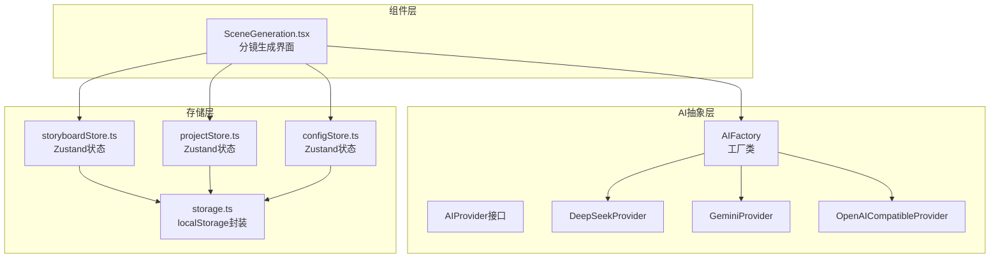
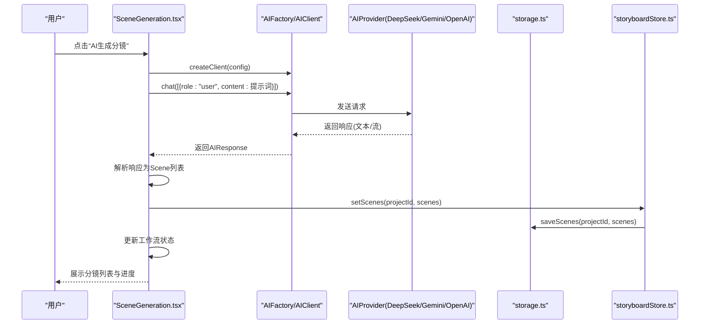
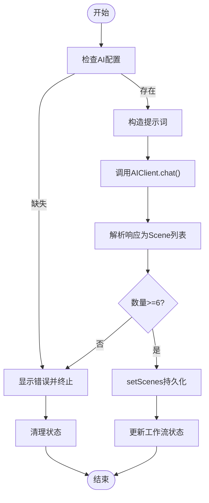
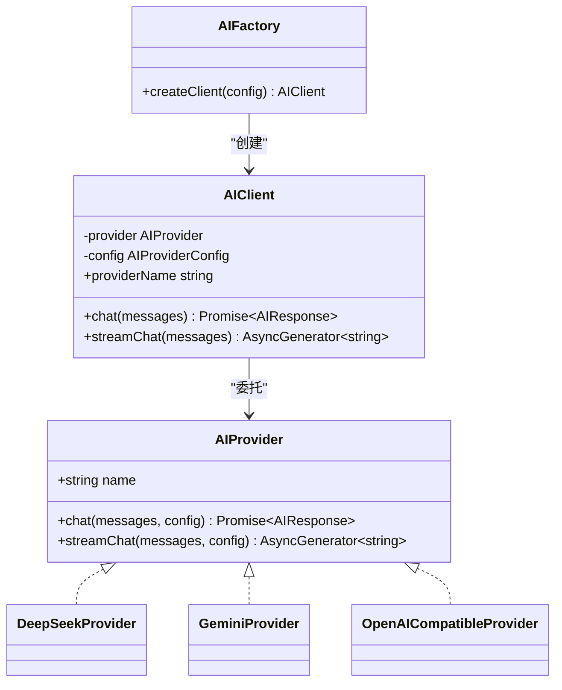
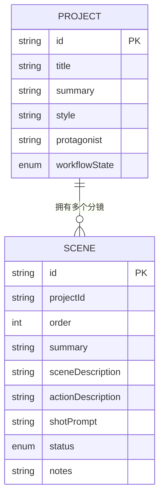
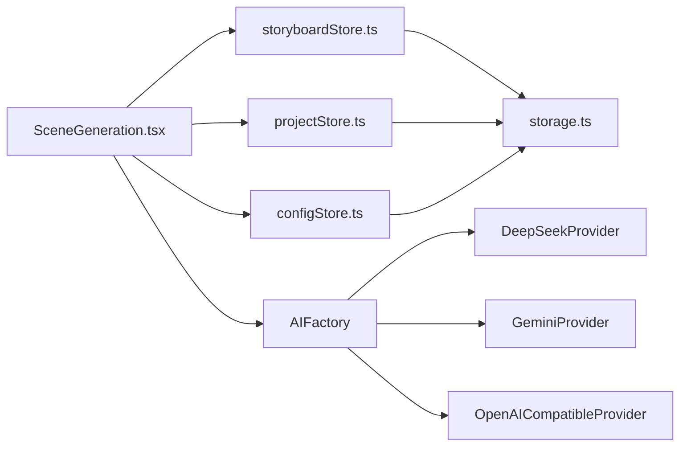

# 分镜生成

<cite>
**本文引用的文件**
- [factory.ts](file://manga-creator/src/lib/ai/factory.ts)
- [types.ts](file://manga-creator/src/lib/ai/types.ts)
- [deepseek.ts](file://manga-creator/src/lib/ai/providers/deepseek.ts)
- [openai.ts](file://manga-creator/src/lib/ai/providers/openai.ts)
- [gemini.ts](file://manga-creator/src/lib/ai/providers/gemini.ts)
- [skills.ts](file://manga-creator/src/lib/ai/skills.ts)
- [index.ts](file://manga-creator/src/types/index.ts)
- [storage.ts](file://manga-creator/src/lib/storage.ts)
- [storyboardStore.ts](file://manga-creator/src/stores/storyboardStore.ts)
- [projectStore.ts](file://manga-creator/src/stores/projectStore.ts)
- [configStore.ts](file://manga-creator/src/stores/configStore.ts)
- [SceneGeneration.tsx](file://manga-creator/src/components/editor/SceneGeneration.tsx)
- [providers.test.ts](file://manga-creator/src/lib/ai/providers/providers.test.ts)
- [factory.test.ts](file://manga-creator/src/lib/ai/factory.test.ts)
- [skills.test.ts](file://manga-creator/src/lib/ai/skills.test.ts)
</cite>

## 目录
1. [简介](#简介)
2. [项目结构](#项目结构)
3. [核心组件](#核心组件)
4. [架构总览](#架构总览)
5. [详细组件分析](#详细组件分析)
6. [依赖分析](#依赖分析)
7. [性能考虑](#性能考虑)
8. [故障排查指南](#故障排查指南)
9. [结论](#结论)
10. [附录](#附录)

## 简介
本章节聚焦“分镜生成模块”的技术实现，围绕“如何将基础设定转化为初步分镜列表”的核心目标，系统讲解从用户触发到分镜入库的完整链路。文档重点覆盖：
- AI服务工厂（AIProvider Factory）的调用流程：提示词构造、多供应商适配（DeepSeek/Gemini/OpenAI）、响应解析与进度反馈。
- 加载状态管理、进度反馈与错误重试策略。
- 分镜数据结构（Scene对象）的生成规则与在storyboardStore中的存储模式。
- 用户手动编辑生成结果的交互设计与数据同步机制。
- 性能优化建议（请求节流与缓存策略）与常见AI响应异常处理方案。

## 项目结构
分镜生成模块位于前端工程的编辑器组件层与AI能力抽象层之间，采用“组件驱动 + 工厂适配 + 存储持久化”的分层设计：
- 组件层：负责UI交互、状态展示与工作流推进。
- AI抽象层：统一AI服务接口，屏蔽不同供应商差异。
- 存储层：本地持久化（localStorage），保障项目与分镜数据可恢复。

图表来源
- [SceneGeneration.tsx](file://manga-creator/src/components/editor/SceneGeneration.tsx#L1-L383)
- [factory.ts](file://manga-creator/src/lib/ai/factory.ts#L1-L54)
- [types.ts](file://manga-creator/src/lib/ai/types.ts#L1-L15)
- [deepseek.ts](file://manga-creator/src/lib/ai/providers/deepseek.ts#L1-L110)
- [gemini.ts](file://manga-creator/src/lib/ai/providers/gemini.ts#L1-L138)
- [openai.ts](file://manga-creator/src/lib/ai/providers/openai.ts#L1-L88)
- [storage.ts](file://manga-creator/src/lib/storage.ts#L1-L246)
- [storyboardStore.ts](file://manga-creator/src/stores/storyboardStore.ts#L1-L107)
- [projectStore.ts](file://manga-creator/src/stores/projectStore.ts#L1-L95)
- [configStore.ts](file://manga-creator/src/stores/configStore.ts#L1-L58)

章节来源
- [SceneGeneration.tsx](file://manga-creator/src/components/editor/SceneGeneration.tsx#L1-L383)
- [factory.ts](file://manga-creator/src/lib/ai/factory.ts#L1-L54)
- [storage.ts](file://manga-creator/src/lib/storage.ts#L1-L246)

## 核心组件
- AI服务工厂与适配器
  - 工厂：根据配置选择供应商并创建客户端；客户端封装聊天与流式聊天接口。
  - 适配器：DeepSeek、Gemini、OpenAI兼容三类供应商，统一输入输出格式。
- 技能与提示词
  - 定义“场景列表生成”等技能，提供模板化提示词与输出约束。
- 状态与存储
  - storyboardStore：管理分镜列表、排序、增删改、当前选中与生成状态。
  - projectStore：管理项目工作流状态推进。
  - configStore：管理用户AI配置与连通性测试。
  - storage：封装localStorage读写与加密配置。

章节来源
- [factory.ts](file://manga-creator/src/lib/ai/factory.ts#L1-L54)
- [types.ts](file://manga-creator/src/lib/ai/types.ts#L1-L15)
- [deepseek.ts](file://manga-creator/src/lib/ai/providers/deepseek.ts#L1-L110)
- [gemini.ts](file://manga-creator/src/lib/ai/providers/gemini.ts#L1-L138)
- [openai.ts](file://manga-creator/src/lib/ai/providers/openai.ts#L1-L88)
- [skills.ts](file://manga-creator/src/lib/ai/skills.ts#L1-L132)
- [storyboardStore.ts](file://manga-creator/src/stores/storyboardStore.ts#L1-L107)
- [projectStore.ts](file://manga-creator/src/stores/projectStore.ts#L1-L95)
- [configStore.ts](file://manga-creator/src/stores/configStore.ts#L1-L58)
- [storage.ts](file://manga-creator/src/lib/storage.ts#L1-L246)

## 架构总览
分镜生成的端到端流程如下：
- 用户在编辑器界面点击“AI生成分镜”，组件层构建提示词并调用工厂创建客户端。
- 客户端通过对应供应商适配器向远端发送请求，接收文本响应或流式片段。
- 组件层解析响应，生成Scene对象列表，写入storyboardStore并持久化到localStorage。
- 同步更新项目工作流状态，允许用户继续后续步骤。

图表来源
- [SceneGeneration.tsx](file://manga-creator/src/components/editor/SceneGeneration.tsx#L50-L136)
- [factory.ts](file://manga-creator/src/lib/ai/factory.ts#L22-L54)
- [deepseek.ts](file://manga-creator/src/lib/ai/providers/deepseek.ts#L29-L57)
- [gemini.ts](file://manga-creator/src/lib/ai/providers/gemini.ts#L58-L88)
- [openai.ts](file://manga-creator/src/lib/ai/providers/openai.ts#L7-L35)
- [storage.ts](file://manga-creator/src/lib/storage.ts#L115-L122)
- [storyboardStore.ts](file://manga-creator/src/stores/storyboardStore.ts#L31-L40)

## 详细组件分析

### 组件：SceneGeneration（分镜生成）
- 触发条件与工作流推进
  - 仅当项目处于“数据收集完成”或“分镜列表编辑中”时允许生成。
  - 成功生成后将工作流推进至“分镜列表编辑中”，并设置当前时间戳。
- 提示词构造
  - 组合项目摘要、风格、主角等信息，要求输出8-12个关键分镜节点，每行一条，覆盖起承转合与视觉冲击点。
- 响应解析与分镜对象生成
  - 将AI返回的纯文本按行解析，过滤序号前缀，生成Scene对象数组（包含id、order、summary、status等字段）。
- 加载状态与进度反馈
  - 设置isGenerating标志与generationProgress进度条，分别在请求前后与解析后进行阶段性更新。
- 错误处理
  - 若配置缺失或生成失败，显示错误提示；最终在finally中清理状态。
- 用户交互与数据同步
  - 支持手动添加、编辑、删除分镜；编辑保存后同步更新storyboardStore并持久化。
  - 确认分镜列表后推进工作流并触发下一步事件。

图表来源
- [SceneGeneration.tsx](file://manga-creator/src/components/editor/SceneGeneration.tsx#L50-L136)
- [storyboardStore.ts](file://manga-creator/src/stores/storyboardStore.ts#L31-L40)
- [storage.ts](file://manga-creator/src/lib/storage.ts#L115-L122)

章节来源
- [SceneGeneration.tsx](file://manga-creator/src/components/editor/SceneGeneration.tsx#L1-L383)
- [storyboardStore.ts](file://manga-creator/src/stores/storyboardStore.ts#L1-L107)
- [storage.ts](file://manga-creator/src/lib/storage.ts#L104-L145)

### 工厂与适配器：AIFactory/AIClient 与 Provider
- 工厂与客户端
  - AIFactory.createClient会校验配置（供应商、API Key、模型），并根据供应商类型创建对应Provider实例，返回AIClient。
  - AIClient提供chat与streamChat两个入口，统一透传messages与config。
- 供应商适配器
  - DeepSeekProvider：标准OpenAI风格的聊天接口，支持流式SSE；错误时解析JSON或文本详情。
  - GeminiProvider：使用Google Generative Language API，消息格式转换为contents.parts；支持流式SSE；错误时解析error.message。
  - OpenAICompatibleProvider：通用兼容实现，支持流式SSE；错误时抛出明确错误信息。
- 接口契约
  - AIProvider接口定义name、chat、streamChat三要素，确保多供应商一致行为。

图表来源
- [types.ts](file://manga-creator/src/lib/ai/types.ts#L1-L15)
- [factory.ts](file://manga-creator/src/lib/ai/factory.ts#L1-L54)
- [deepseek.ts](file://manga-creator/src/lib/ai/providers/deepseek.ts#L1-L110)
- [gemini.ts](file://manga-creator/src/lib/ai/providers/gemini.ts#L1-L138)
- [openai.ts](file://manga-creator/src/lib/ai/providers/openai.ts#L1-L88)

章节来源
- [factory.ts](file://manga-creator/src/lib/ai/factory.ts#L1-L54)
- [types.ts](file://manga-creator/src/lib/ai/types.ts#L1-L15)
- [deepseek.ts](file://manga-creator/src/lib/ai/providers/deepseek.ts#L1-L110)
- [gemini.ts](file://manga-creator/src/lib/ai/providers/gemini.ts#L1-L138)
- [openai.ts](file://manga-creator/src/lib/ai/providers/openai.ts#L1-L88)

### 技能与提示词：SceneListSkill
- 技能定义
  - 名称：scene-list-generator；描述：根据剧本生成分镜列表；必需上下文：project_essence；输出格式：text，最大长度500；maxTokens：1000。
- 提示词模板要点
  - 输入：sceneCount、summary、style；输出：按序号排列的若干分镜概要，覆盖起承转合与视觉冲击点。
- 作用
  - 为SceneGeneration组件提供标准化提示词构造思路与输出约束，便于后续扩展更多技能（场景描述、动作描述、提示词生成）。

章节来源
- [skills.ts](file://manga-creator/src/lib/ai/skills.ts#L1-L24)
- [SceneGeneration.tsx](file://manga-creator/src/components/editor/SceneGeneration.tsx#L61-L84)

### 数据结构：Scene对象与storyboardStore
- Scene对象字段
  - id、projectId、order、summary、sceneDescription、actionDescription、shotPrompt、contextSummary、status、notes。
- storyboardStore能力
  - 加载/设置/新增/更新/删除/重排分镜；自动重编号；设置当前分镜与生成状态；持久化到localStorage。
- 存储模式
  - 以“项目ID”为键，存储该项目下的分镜数组；每次批量更新均调用saveScenes进行持久化。

图表来源
- [index.ts](file://manga-creator/src/types/index.ts#L67-L78)
- [storyboardStore.ts](file://manga-creator/src/stores/storyboardStore.ts#L31-L40)
- [storage.ts](file://manga-creator/src/lib/storage.ts#L104-L122)

章节来源
- [index.ts](file://manga-creator/src/types/index.ts#L67-L78)
- [storyboardStore.ts](file://manga-creator/src/stores/storyboardStore.ts#L1-L107)
- [storage.ts](file://manga-creator/src/lib/storage.ts#L104-L145)

### 用户交互与数据同步
- 手动编辑
  - 支持在列表中直接编辑某一分镜的summary；保存后调用updateScene并持久化。
- 手动增删
  - 添加新分镜时自动分配id与order；删除后重新编号并持久化。
- 工作流推进
  - 确认分镜列表后，更新项目工作流状态并触发下一步事件，驱动后续流程。

章节来源
- [SceneGeneration.tsx](file://manga-creator/src/components/editor/SceneGeneration.tsx#L138-L193)
- [storyboardStore.ts](file://manga-creator/src/stores/storyboardStore.ts#L42-L97)

## 依赖分析
- 组件与状态
  - SceneGeneration依赖useStoryboardStore、useProjectStore、useConfigStore；通过store更新UI与工作流。
- 状态与存储
  - storyboardStore与projectStore均依赖storage.ts进行本地持久化；configStore依赖storage.ts进行配置加密存储。
- AI依赖
  - SceneGeneration通过AIFactory创建客户端；AIFactory依赖各Provider实现；Provider依赖fetch与SSE解析。

图表来源
- [SceneGeneration.tsx](file://manga-creator/src/components/editor/SceneGeneration.tsx#L1-L383)
- [storyboardStore.ts](file://manga-creator/src/stores/storyboardStore.ts#L1-L107)
- [projectStore.ts](file://manga-creator/src/stores/projectStore.ts#L1-L95)
- [configStore.ts](file://manga-creator/src/stores/configStore.ts#L1-L58)
- [storage.ts](file://manga-creator/src/lib/storage.ts#L1-L246)
- [factory.ts](file://manga-creator/src/lib/ai/factory.ts#L1-L54)
- [deepseek.ts](file://manga-creator/src/lib/ai/providers/deepseek.ts#L1-L110)
- [gemini.ts](file://manga-creator/src/lib/ai/providers/gemini.ts#L1-L138)
- [openai.ts](file://manga-creator/src/lib/ai/providers/openai.ts#L1-L88)

章节来源
- [SceneGeneration.tsx](file://manga-creator/src/components/editor/SceneGeneration.tsx#L1-L383)
- [factory.ts](file://manga-creator/src/lib/ai/factory.ts#L1-L54)
- [storage.ts](file://manga-creator/src/lib/storage.ts#L1-L246)

## 性能考虑
- 请求节流与并发控制
  - 在短时间内多次触发生成时，建议在组件层增加防抖/互斥锁，避免重复请求与资源浪费。
- 流式响应与进度反馈
  - 对于支持流式的供应商（DeepSeek、Gemini、OpenAI兼容），可利用streamChat逐步更新UI，提升感知性能。
- 缓存策略
  - 对于相同项目的基础设定（summary/style/protagonist），可在组件层缓存最近一次生成结果，减少重复请求。
- 本地存储优化
  - 分镜数组按项目ID分片存储，避免全量读取；批量更新时一次性saveScenes，降低IO次数。
- 错误与重试
  - 对429/5xx等可重试错误，建议在组件层增加指数退避重试；对401/403等鉴权错误，引导用户检查配置。

[本节为通用建议，无需特定文件引用]

## 故障排查指南
- 常见错误与定位
  - 配置缺失：AIFactory.createClient会在配置不完整时抛错；检查configStore是否已保存配置。
  - 供应商错误：DeepSeek/Gemini/OpenAI兼容实现均会解析错误详情（JSON或文本），并抛出包含状态码与消息的错误。
  - 网络异常：fetch被拒绝或超时，需检查网络与代理设置。
- UI层面的错误展示
  - SceneGeneration在生成失败时显示错误提示，并在finally中清理isGenerating与进度。
- 单元测试参考
  - providers.test.ts与factory.test.ts覆盖了各Provider的chat/streamChat行为、错误处理与边界情况，可作为问题复现与回归测试依据。

章节来源
- [factory.test.ts](file://manga-creator/src/lib/ai/factory.test.ts#L50-L88)
- [providers.test.ts](file://manga-creator/src/lib/ai/providers/providers.test.ts#L102-L151)
- [SceneGeneration.tsx](file://manga-creator/src/components/editor/SceneGeneration.tsx#L127-L136)

## 结论
分镜生成模块通过“组件层-工厂-适配器-存储层”的清晰分层，实现了从基础设定到初步分镜列表的自动化与可视化。其优势在于：
- 多供应商适配与统一接口，便于扩展与切换。
- 明确的提示词模板与输出约束，保证生成质量与一致性。
- 完整的状态管理与本地持久化，保障用户体验与数据安全。
- 可扩展的技能体系，为后续“场景描述/动作描述/提示词生成”等步骤奠定基础。

[本节为总结性内容，无需特定文件引用]

## 附录
- 相关测试用例可参考：
  - [providers.test.ts](file://manga-creator/src/lib/ai/providers/providers.test.ts#L1-L676)
  - [factory.test.ts](file://manga-creator/src/lib/ai/factory.test.ts#L1-L595)
  - [skills.test.ts](file://manga-creator/src/lib/ai/skills.test.ts#L1-L364)

[本节为补充材料，无需特定文件引用]