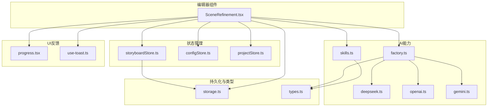
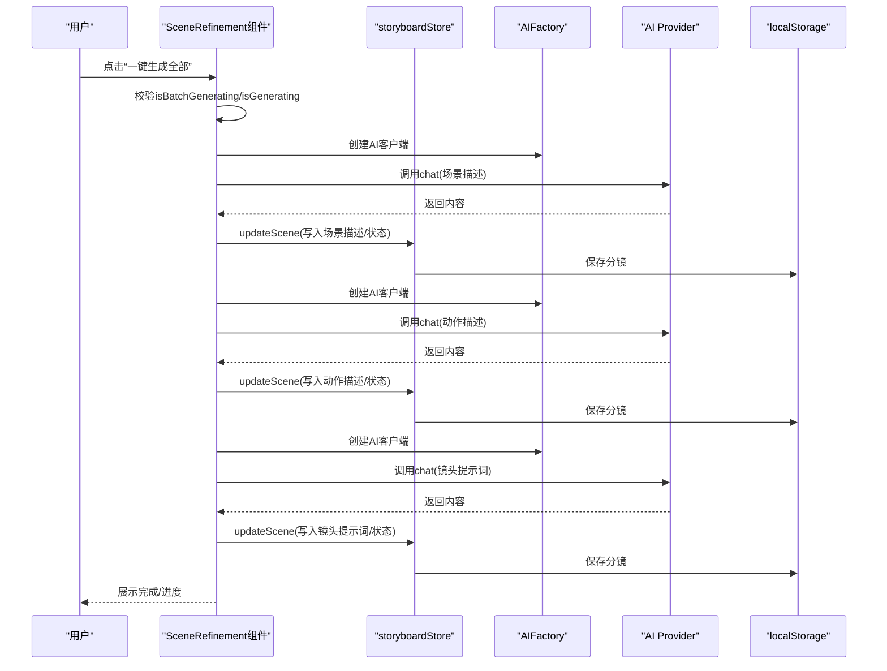
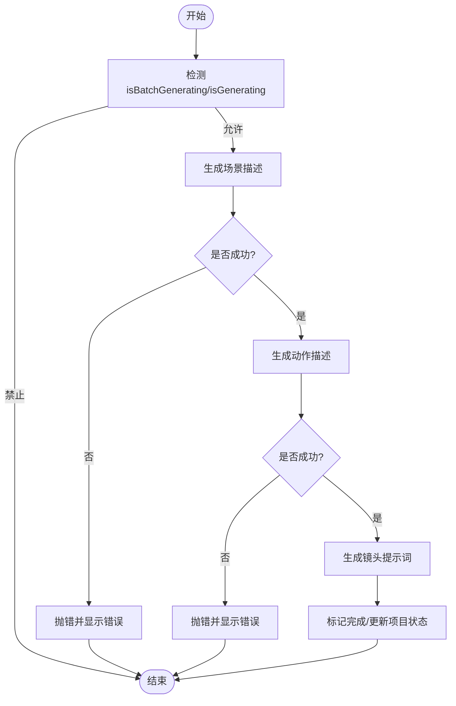
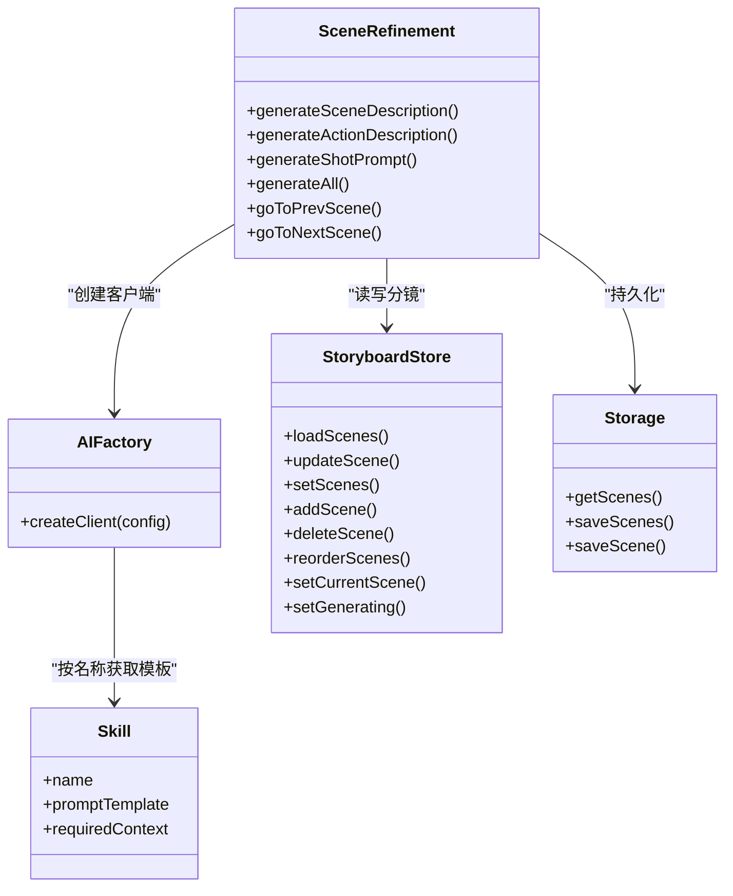

# 分镜细化

<cite>
**本文引用的文件**
- [SceneRefinement.tsx](file://manga-creator/src/components/editor/SceneRefinement.tsx)
- [SceneRefinement.test.tsx](file://manga-creator/src/components/editor/SceneRefinement.test.tsx)
- [storyboardStore.ts](file://manga-creator/src/stores/storyboardStore.ts)
- [factory.ts](file://manga-creator/src/lib/ai/factory.ts)
- [skills.ts](file://manga-creator/src/lib/ai/skills.ts)
- [types.ts](file://manga-creator/src/types/index.ts)
- [deepseek.ts](file://manga-creator/src/lib/ai/providers/deepseek.ts)
- [openai.ts](file://manga-creator/src/lib/ai/providers/openai.ts)
- [gemini.ts](file://manga-creator/src/lib/ai/providers/gemini.ts)
- [storage.ts](file://manga-creator/src/lib/storage.ts)
- [progress.tsx](file://manga-creator/src/components/ui/progress.tsx)
- [use-toast.ts](file://manga-creator/src/hooks/use-toast.ts)
</cite>

## 目录
1. [简介](#简介)
2. [项目结构](#项目结构)
3. [核心组件](#核心组件)
4. [架构总览](#架构总览)
5. [详细组件分析](#详细组件分析)
6. [依赖分析](#依赖分析)
7. [性能考量](#性能考量)
8. [故障排查指南](#故障排查指南)
9. [结论](#结论)
10. [附录](#附录)

## 简介
本文件围绕“分镜细化”模块进行深入技术剖析，重点说明其对初始分镜进行内容增强与结构优化的技术路径。该模块通过三阶段逐步细化：场景描述、动作描述、镜头提示词，借助AI服务在不同维度提升画面描述质量、对白与镜头语言表达力。文档同时对比“批量处理”与“逐条编辑”的实现差异及状态同步机制，结合单元测试覆盖策略验证关键逻辑的稳定性，并给出用户反馈（进度条、完成提示）与高并发请求下的错误恢复与数据一致性保障建议。

## 项目结构
分镜细化位于编辑器组件层，依赖全局状态管理（项目、分镜）、AI工厂与技能系统、本地存储与UI反馈组件。

图表来源
- [SceneRefinement.tsx](file://manga-creator/src/components/editor/SceneRefinement.tsx#L1-L638)
- [storyboardStore.ts](file://manga-creator/src/stores/storyboardStore.ts#L1-L107)
- [factory.ts](file://manga-creator/src/lib/ai/factory.ts#L1-L54)
- [skills.ts](file://manga-creator/src/lib/ai/skills.ts#L1-L132)
- [deepseek.ts](file://manga-creator/src/lib/ai/providers/deepseek.ts#L1-L110)
- [openai.ts](file://manga-creator/src/lib/ai/providers/openai.ts#L1-L88)
- [gemini.ts](file://manga-creator/src/lib/ai/providers/gemini.ts#L1-L138)
- [storage.ts](file://manga-creator/src/lib/storage.ts#L1-L246)
- [progress.tsx](file://manga-creator/src/components/ui/progress.tsx#L1-L27)
- [use-toast.ts](file://manga-creator/src/hooks/use-toast.ts#L1-L195)

章节来源
- [SceneRefinement.tsx](file://manga-creator/src/components/editor/SceneRefinement.tsx#L1-L638)
- [storyboardStore.ts](file://manga-creator/src/stores/storyboardStore.ts#L1-L107)
- [factory.ts](file://manga-creator/src/lib/ai/factory.ts#L1-L54)
- [skills.ts](file://manga-creator/src/lib/ai/skills.ts#L1-L132)
- [storage.ts](file://manga-creator/src/lib/storage.ts#L1-L246)

## 核心组件
- 分镜细化组件：负责三阶段生成、逐条编辑、批量处理、导航与状态同步；使用进度条与错误提示反馈用户。
- 分镜状态存储：Zustand 状态管理，提供加载、更新、重排、设置当前分镜等操作，并持久化到本地存储。
- AI工厂与技能：根据配置创建AI客户端，按技能名称映射到对应提示词模板，支持多供应商适配。
- 类型与工作流：定义工作流状态、分镜步骤、分镜状态、任务类型、上下文类型等，支撑跨模块契约。

章节来源
- [SceneRefinement.tsx](file://manga-creator/src/components/editor/SceneRefinement.tsx#L1-L638)
- [storyboardStore.ts](file://manga-creator/src/stores/storyboardStore.ts#L1-L107)
- [skills.ts](file://manga-creator/src/lib/ai/skills.ts#L1-L132)
- [types.ts](file://manga-creator/src/types/index.ts#L1-L351)

## 架构总览
分镜细化采用“渐进式三阶段+批量一键生成”的双模式设计：
- 逐条编辑模式：按阶段顺序生成，每步可手动编辑，状态写回本地存储并驱动UI更新。
- 批量处理模式：在当前分镜缺失关键字段时，依次执行三阶段生成，期间通过状态读取确保前后一致性。

图表来源
- [SceneRefinement.tsx](file://manga-creator/src/components/editor/SceneRefinement.tsx#L228-L291)
- [factory.ts](file://manga-creator/src/lib/ai/factory.ts#L44-L54)
- [deepseek.ts](file://manga-creator/src/lib/ai/providers/deepseek.ts#L29-L57)
- [openai.ts](file://manga-creator/src/lib/ai/providers/openai.ts#L7-L35)
- [gemini.ts](file://manga-creator/src/lib/ai/providers/gemini.ts#L58-L88)
- [storyboardStore.ts](file://manga-creator/src/stores/storyboardStore.ts#L57-L68)
- [storage.ts](file://manga-creator/src/lib/storage.ts#L129-L145)

## 详细组件分析

### 三阶段生成与提示词构建
- 场景描述生成：基于项目风格、主角、当前分镜概要与前一分镜概要，生成环境、氛围、光影等描述，写入场景描述字段并更新状态。
- 动作描述生成：基于场景描述与分镜概要，生成角色动作、表情、肢体语言，写入动作描述字段并更新状态。
- 镜头提示词生成：整合场景与动作描述，生成面向AI绘图的提示词，写入镜头提示词字段并更新状态；若为最后一个分镜，更新项目工作流状态。

提示词模板由技能系统提供，支持多供应商适配，工厂根据配置创建对应AI客户端。

章节来源
- [SceneRefinement.tsx](file://manga-creator/src/components/editor/SceneRefinement.tsx#L51-L199)
- [skills.ts](file://manga-creator/src/lib/ai/skills.ts#L26-L105)
- [factory.ts](file://manga-creator/src/lib/ai/factory.ts#L44-L54)

### 批量处理与逐条编辑的实现差异
- 逐条编辑：每个阶段按钮独立触发，UI即时反映生成结果与禁用条件；适合精细调整与局部优化。
- 批量处理：一键生成全部，内部串行三阶段，期间通过状态读取确保每步完成后才进入下一步；防重复触发，失败时展示错误信息。

图表来源
- [SceneRefinement.tsx](file://manga-creator/src/components/editor/SceneRefinement.tsx#L228-L291)

章节来源
- [SceneRefinement.tsx](file://manga-creator/src/components/editor/SceneRefinement.tsx#L228-L291)

### 状态同步机制
- 组件内状态：当前分镜索引、生成中标志、当前生成阶段、错误信息。
- 全局状态：分镜列表、当前分镜ID、生成中标志；通过store更新后持久化至localStorage。
- 一键生成流程中，使用store.getState读取最新场景数据，确保三阶段之间的一致性。

章节来源
- [SceneRefinement.tsx](file://manga-creator/src/components/editor/SceneRefinement.tsx#L1-L120)
- [storyboardStore.ts](file://manga-creator/src/stores/storyboardStore.ts#L1-L107)
- [storage.ts](file://manga-creator/src/lib/storage.ts#L104-L145)

### 用户操作反馈机制
- 进度条：整体进度百分比，基于当前分镜序号与总数计算。
- 错误提示：捕获异常并展示错误信息。
- 按钮状态：生成中显示加载态与禁用；完成态显示完成徽章。
- 可选Toast：可集成use-toast以提供更丰富的通知体验（当前组件未直接使用，但具备扩展能力）。

章节来源
- [SceneRefinement.tsx](file://manga-creator/src/components/editor/SceneRefinement.tsx#L330-L363)
- [progress.tsx](file://manga-creator/src/components/ui/progress.tsx#L1-L27)
- [use-toast.ts](file://manga-creator/src/hooks/use-toast.ts#L1-L195)

### 单元测试覆盖策略
- 一键生成全部流程：模拟三次API调用，分别更新场景描述、动作描述、镜头提示词，断言updateScene调用次数与参数。
- 防重复触发：快速点击两次，仅执行一次完整流程。
- 错误处理：某阶段失败时显示错误信息。
- 生成中状态：按钮文本与禁用状态符合预期。
- 已完成状态：当所有内容已存在时禁用一键生成按钮。
- 状态读取：验证一键生成流程中调用store.getState以获取最新状态。

章节来源
- [SceneRefinement.test.tsx](file://manga-creator/src/components/editor/SceneRefinement.test.tsx#L1-L353)

## 依赖分析
- 组件依赖：SceneRefinement依赖项目、分镜、配置状态，依赖AI工厂与技能系统，依赖UI进度条与本地存储。
- AI供应商：DeepSeek、OpenAI兼容、Gemini，均通过工厂创建客户端并统一路由到chat/streamChat接口。
- 类型契约：工作流状态、分镜步骤、分镜状态、任务类型、上下文类型等贯穿各模块，保证跨模块一致性。

图表来源
- [SceneRefinement.tsx](file://manga-creator/src/components/editor/SceneRefinement.tsx#L1-L638)
- [factory.ts](file://manga-creator/src/lib/ai/factory.ts#L44-L54)
- [skills.ts](file://manga-creator/src/lib/ai/skills.ts#L107-L132)
- [storyboardStore.ts](file://manga-creator/src/stores/storyboardStore.ts#L1-L107)
- [storage.ts](file://manga-creator/src/lib/storage.ts#L104-L145)

章节来源
- [SceneRefinement.tsx](file://manga-creator/src/components/editor/SceneRefinement.tsx#L1-L638)
- [factory.ts](file://manga-creator/src/lib/ai/factory.ts#L1-L54)
- [skills.ts](file://manga-creator/src/lib/ai/skills.ts#L1-L132)
- [storyboardStore.ts](file://manga-creator/src/stores/storyboardStore.ts#L1-L107)
- [storage.ts](file://manga-creator/src/lib/storage.ts#L1-L246)

## 性能考量
- 三阶段串行：避免一次性大量并发请求，降低网络与令牌消耗。
- 状态读取延迟：在每次阶段完成后加入短暂延迟，确保状态落盘与UI更新稳定。
- 供应商适配：通过工厂与适配器抽象，便于替换与扩展，减少耦合。
- 本地存储：分镜数据持久化，避免频繁远程请求，提高交互流畅度。

[本节为通用指导，无需列出具体文件来源]

## 故障排查指南
- 配置不完整：AI工厂在缺少供应商、API Key或模型时抛出错误，需检查配置。
- API错误：各供应商提供器在HTTP非OK时抛出错误，包含状态码与错误详情；检查网络、鉴权与模型参数。
- 一键生成失败：单元测试覆盖了某阶段失败的场景，应检查错误提示与日志；确认前置阶段是否成功写入。
- 并发冲突：一键生成已内置防重复触发；若仍出现竞态，建议在业务层增加锁或幂等标识。

章节来源
- [factory.ts](file://manga-creator/src/lib/ai/factory.ts#L44-L54)
- [deepseek.ts](file://manga-creator/src/lib/ai/providers/deepseek.ts#L12-L27)
- [openai.ts](file://manga-creator/src/lib/ai/providers/openai.ts#L22-L35)
- [gemini.ts](file://manga-creator/src/lib/ai/providers/gemini.ts#L41-L56)
- [SceneRefinement.test.tsx](file://manga-creator/src/components/editor/SceneRefinement.test.tsx#L255-L276)

## 结论
分镜细化模块通过三阶段精细化提示词构建，实现了从“分镜概要”到“场景描述”“动作描述”再到“镜头提示词”的结构化升级。逐条编辑满足局部优化需求，批量处理则提供一键式高效产出。状态同步通过store与本地存储保障一致性，错误处理与防重复触发增强了稳定性。单元测试覆盖关键流程与边界情况，为功能可靠性提供保障。

[本节为总结性内容，无需列出具体文件来源]

## 附录

### 关键实现路径与代码片段路径
- 三阶段生成入口与状态更新
  - [场景描述生成](file://manga-creator/src/components/editor/SceneRefinement.tsx#L51-L100)
  - [动作描述生成](file://manga-creator/src/components/editor/SceneRefinement.tsx#L102-L149)
  - [镜头提示词生成](file://manga-creator/src/components/editor/SceneRefinement.tsx#L151-L207)
- 一键生成全部
  - [批量处理主流程](file://manga-creator/src/components/editor/SceneRefinement.tsx#L228-L291)
- 状态同步与持久化
  - [store.updateScene](file://manga-creator/src/stores/storyboardStore.ts#L57-L68)
  - [本地存储saveScene/saveScenes](file://manga-creator/src/lib/storage.ts#L129-L145)
- AI工厂与技能
  - [AIFactory.createClient](file://manga-creator/src/lib/ai/factory.ts#L44-L54)
  - [技能名称映射](file://manga-creator/src/lib/ai/skills.ts#L120-L131)
- 类型与工作流
  - [工作流状态/分镜步骤/分镜状态](file://manga-creator/src/types/index.ts#L5-L35)
  - [任务类型/上下文类型/Skill定义](file://manga-creator/src/types/index.ts#L111-L191)

### 用户反馈与扩展建议
- 进度条与完成提示：组件已内置进度条与完成徽章；如需更丰富通知，可引入Toast（use-toast）并在成功/失败时调用。
- 高并发与一致性：
  - 在业务层增加幂等标识与重试策略；
  - 对批量流程增加事务性封装，确保任一步骤失败时回滚或暂停；
  - 对store更新增加乐观更新与回滚策略，结合本地存储作为最终一致性保障。

[本节为通用指导，无需列出具体文件来源]