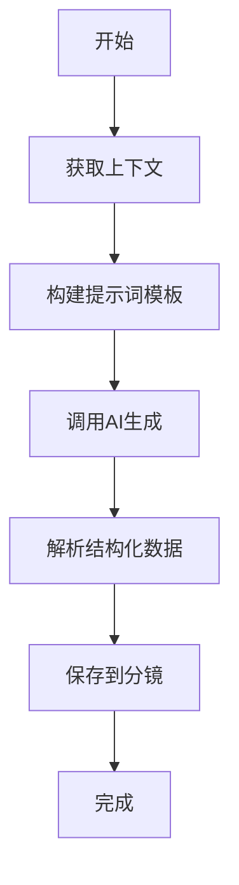
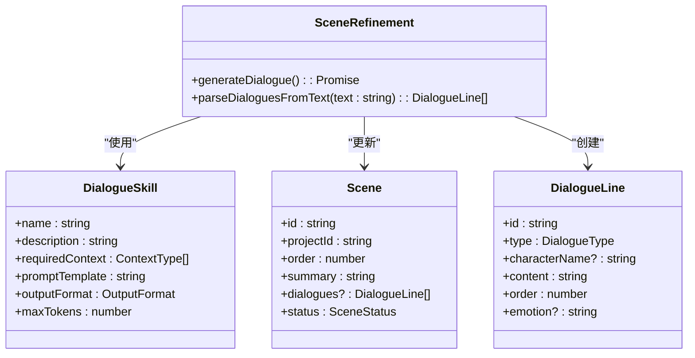
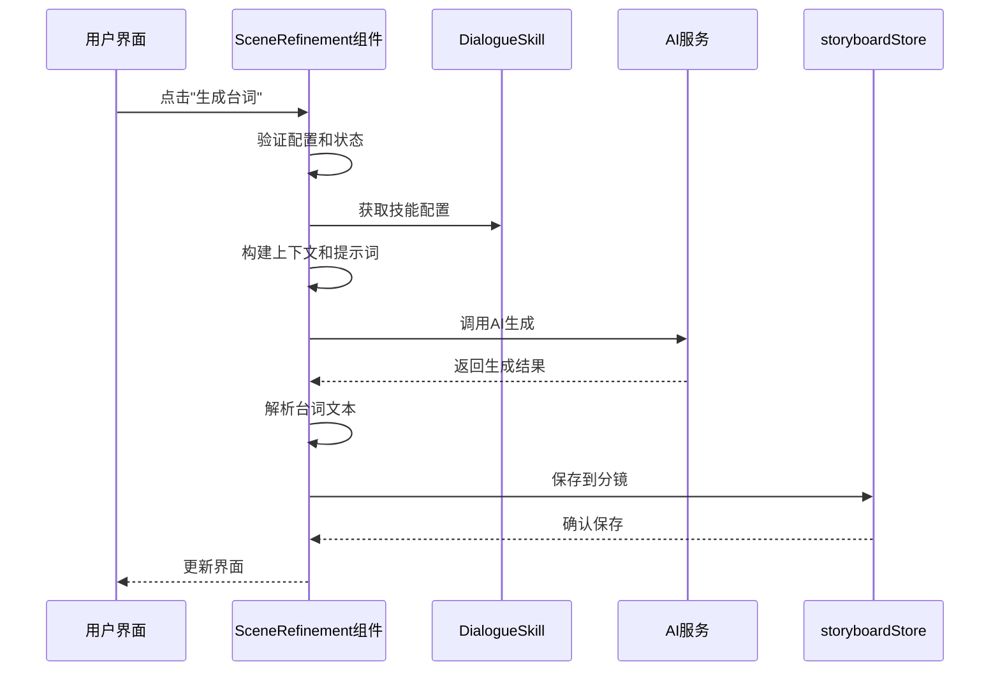
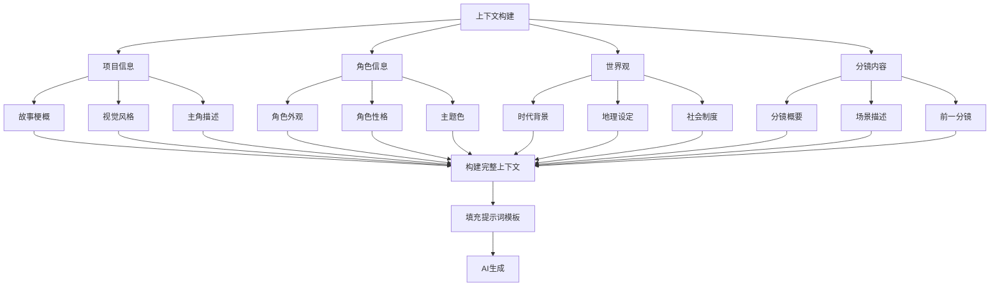
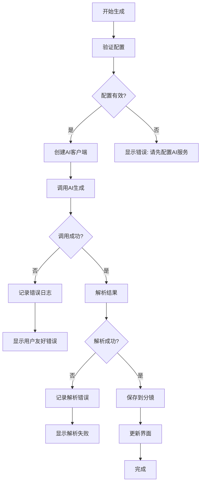
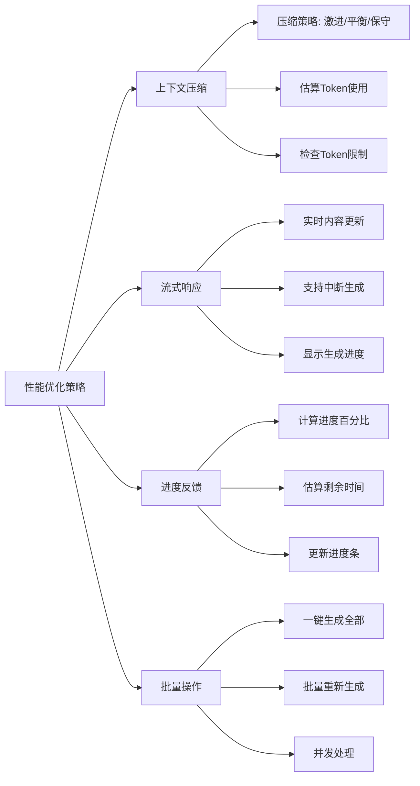

# 对话生成功能

<cite>
**本文档引用的文件**  
- [README.md](file://manga-creator/README.md)
- [skills.ts](file://manga-creator/src/lib/ai/skills.ts)
- [contextBuilder.ts](file://manga-creator/src/lib/ai/contextBuilder.ts)
- [SceneRefinement.tsx](file://manga-creator/src/components/editor/SceneRefinement.tsx)
- [index.ts](file://manga-creator/src/types/index.ts)
- [streamingHandler.ts](file://manga-creator/src/lib/ai/streamingHandler.ts)
- [worldViewInjection.ts](file://manga-creator/src/lib/ai/worldViewInjection.ts)
- [contextCompressor.ts](file://manga-creator/src/lib/ai/contextCompressor.ts)
- [storyboardStore.ts](file://manga-creator/src/stores/storyboardStore.ts)
</cite>

## 目录
1. [简介](#简介)
2. [核心功能](#核心功能)
3. [技术架构](#技术架构)
4. [对话生成流程](#对话生成流程)
5. [上下文管理](#上下文管理)
6. [错误处理与日志](#错误处理与日志)
7. [性能优化](#性能优化)
8. [结论](#结论)

## 简介

对话生成功能是漫剧创作助手的核心组成部分，旨在通过AI技术为创作者提供智能化的台词生成服务。该功能基于项目设定、分镜内容和角色信息，自动生成符合场景氛围和角色性格的对白、独白、旁白和心理活动，帮助创作者快速构建完整的叙事内容。

**Section sources**
- [README.md](file://manga-creator/README.md)

## 核心功能

对话生成功能实现了完整的台词生成工作流，包括多类型台词支持、情绪标注、结构化解析和上下文感知。系统通过渐进式引导，确保生成的台词与整体作品风格保持一致。

**Diagram sources**
- [SceneRefinement.tsx](file://manga-creator/src/components/editor/SceneRefinement.tsx)
- [skills.ts](file://manga-creator/src/lib/ai/skills.ts)

## 技术架构

对话生成功能采用模块化架构设计，各组件职责分明，协同工作。系统通过Zustand状态管理实现数据流控制，利用工厂模式支持多AI供应商，并通过技能系统实现功能扩展。

**Diagram sources**
- [index.ts](file://manga-creator/src/types/index.ts)
- [skills.ts](file://manga-creator/src/lib/ai/skills.ts)
- [SceneRefinement.tsx](file://manga-creator/src/components/editor/SceneRefinement.tsx)

## 对话生成流程

对话生成流程遵循严格的步骤，确保生成质量和用户体验。系统首先收集必要的上下文信息，然后构建AI提示词，调用AI服务生成内容，最后解析和保存结果。

**Diagram sources**
- [SceneRefinement.tsx](file://manga-creator/src/components/editor/SceneRefinement.tsx)
- [skills.ts](file://manga-creator/src/lib/ai/skills.ts)
- [storyboardStore.ts](file://manga-creator/src/stores/storyboardStore.ts)

## 上下文管理

上下文管理是对话生成功能的关键，系统通过多种机制确保AI生成的台词具有连贯性和一致性。上下文构建器整合项目信息、角色特征和世界观要素，为AI提供丰富的背景知识。

**Diagram sources**
- [contextBuilder.ts](file://manga-creator/src/lib/ai/contextBuilder.ts)
- [worldViewInjection.ts](file://manga-creator/src/lib/ai/worldViewInjection.ts)
- [contextCompressor.ts](file://manga-creator/src/lib/ai/contextCompressor.ts)

## 错误处理与日志

系统实现了完善的错误处理和日志记录机制，确保在生成过程中出现问题时能够及时反馈并提供调试信息。错误处理采用分层策略，从输入验证到AI调用都有相应的保护措施。

**Diagram sources**
- [SceneRefinement.tsx](file://manga-creator/src/components/editor/SceneRefinement.tsx)
- [streamingHandler.ts](file://manga-creator/src/lib/ai/streamingHandler.ts)

## 性能优化

为了提升用户体验，系统在多个层面进行了性能优化。包括上下文压缩、流式响应处理、进度反馈和批量操作支持，确保在处理复杂项目时仍能保持流畅的交互。

**Diagram sources**
- [contextCompressor.ts](file://manga-creator/src/lib/ai/contextCompressor.ts)
- [streamingHandler.ts](file://manga-creator/src/lib/ai/streamingHandler.ts)

## 结论

对话生成功能通过智能化的AI技术，为漫剧创作者提供了高效、高质量的台词生成解决方案。系统设计充分考虑了实际创作需求，实现了从基础生成到高级定制的完整功能链，同时保证了良好的用户体验和系统性能。