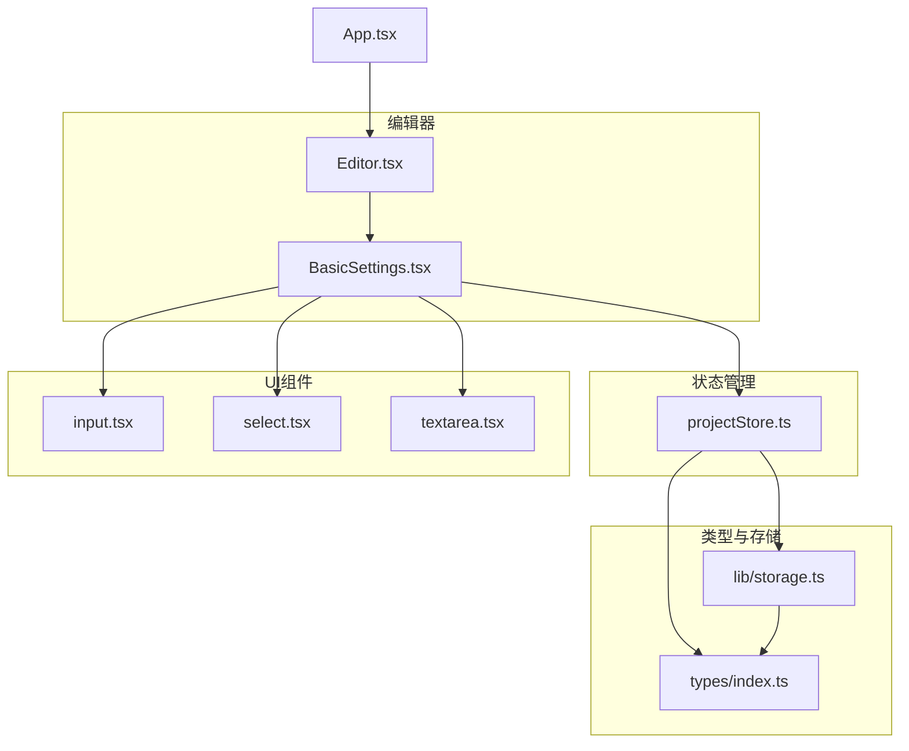
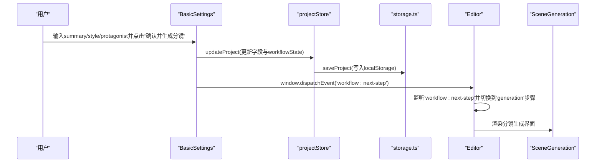
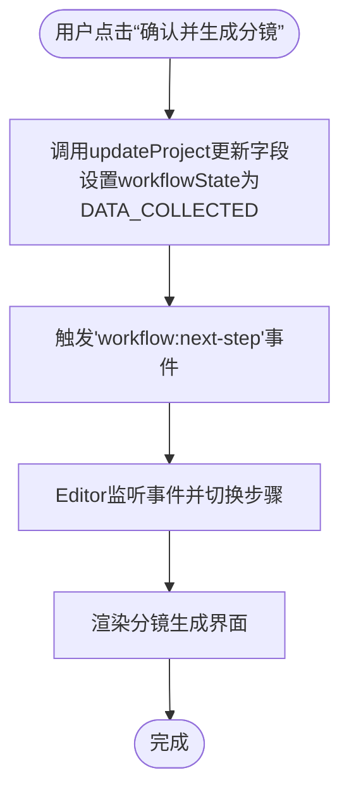
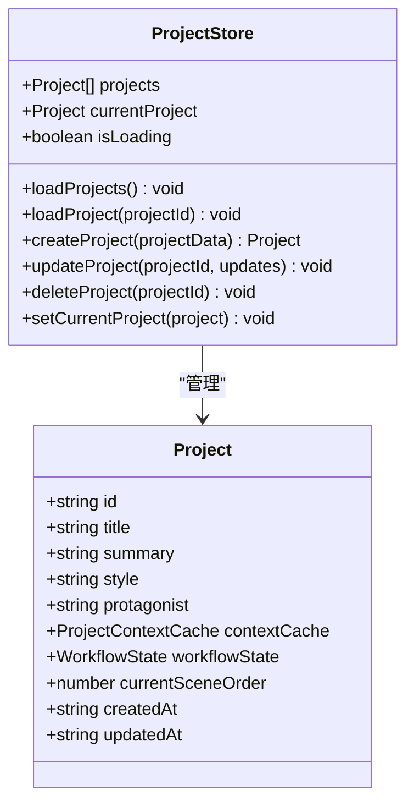
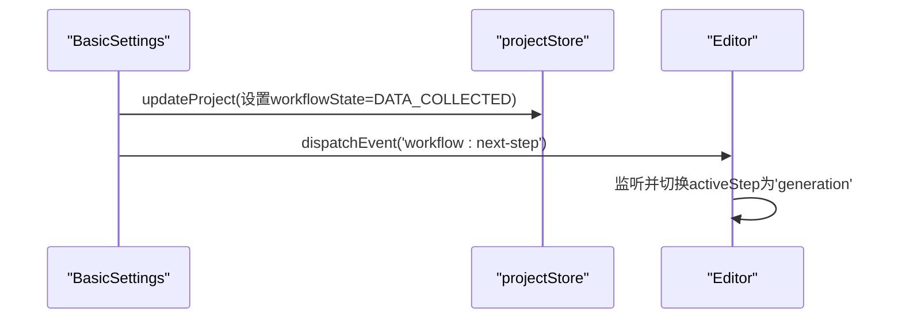
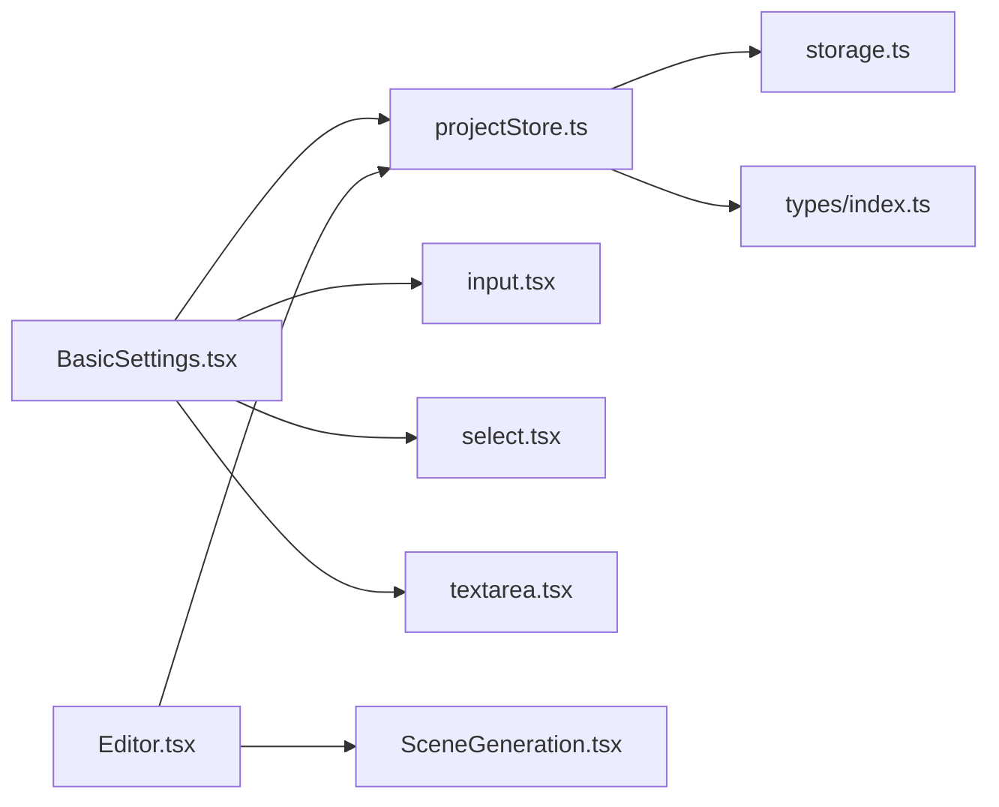

# 基础设定

<cite>
**本文引用的文件**
- [BasicSettings.tsx](file://manga-creator/src/components/editor/BasicSettings.tsx)
- [projectStore.ts](file://manga-creator/src/stores/projectStore.ts)
- [input.tsx](file://manga-creator/src/components/ui/input.tsx)
- [select.tsx](file://manga-creator/src/components/ui/select.tsx)
- [textarea.tsx](file://manga-creator/src/components/ui/textarea.tsx)
- [index.ts](file://manga-creator/src/types/index.ts)
- [storage.ts](file://manga-creator/src/lib/storage.ts)
- [App.tsx](file://manga-creator/src/App.tsx)
- [Editor.tsx](file://manga-creator/src/components/Editor.tsx)
- [SceneGeneration.tsx](file://manga-creator/src/components/editor/SceneGeneration.tsx)
</cite>

## 目录
1. [简介](#简介)
2. [项目结构](#项目结构)
3. [核心组件](#核心组件)
4. [架构总览](#架构总览)
5. [详细组件分析](#详细组件分析)
6. [依赖分析](#依赖分析)
7. [性能考量](#性能考量)
8. [故障排查指南](#故障排查指南)
9. [结论](#结论)
10. [附录](#附录)

## 简介
本章节聚焦“基础设定”模块的实现机制，阐明其作为创作流程起点的数据收集职责。该模块负责从用户输入中收集项目的基础信息（题材、风格、角色设定等），并通过Zustand的projectStore进行读取与更新；同时结合表单校验逻辑确保输入完整性。UI组件（如Input、Select、Textarea）与状态管理通过受控组件模式绑定，用户交互触发状态更新流程。文档还展示了表单提交后触发'workflow:next-step'事件的实现路径，并分析该组件在工作流中的前置依赖关系及其对后续分镜生成阶段的影响。最后提供常见配置错误的调试建议与扩展新设定字段的实践指导。

## 项目结构
基础设定模块位于编辑器子系统中，采用按功能分层的组织方式：
- 组件层：BasicSettings.tsx负责UI与交互；Editor.tsx负责工作流步骤切换与事件监听。
- 状态管理层：projectStore.ts使用Zustand集中管理项目数据。
- 类型定义层：index.ts定义WorkflowState与Project等核心类型。
- 存储层：storage.ts封装localStorage读写与版本迁移。
- UI通用组件：input.tsx、select.tsx、textarea.tsx提供基础输入能力。

图表来源
- [Editor.tsx](file://manga-creator/src/components/Editor.tsx#L1-L172)
- [BasicSettings.tsx](file://manga-creator/src/components/editor/BasicSettings.tsx#L1-L224)
- [projectStore.ts](file://manga-creator/src/stores/projectStore.ts#L1-L95)
- [input.tsx](file://manga-creator/src/components/ui/input.tsx#L1-L23)
- [select.tsx](file://manga-creator/src/components/ui/select.tsx#L1-L159)
- [textarea.tsx](file://manga-creator/src/components/ui/textarea.tsx#L1-L23)
- [index.ts](file://manga-creator/src/types/index.ts#L1-L120)
- [storage.ts](file://manga-creator/src/lib/storage.ts#L1-L120)
- [App.tsx](file://manga-creator/src/App.tsx#L1-L81)

章节来源
- [Editor.tsx](file://manga-creator/src/components/Editor.tsx#L1-L172)
- [BasicSettings.tsx](file://manga-creator/src/components/editor/BasicSettings.tsx#L1-L224)
- [projectStore.ts](file://manga-creator/src/stores/projectStore.ts#L1-L95)
- [index.ts](file://manga-creator/src/types/index.ts#L1-L120)
- [storage.ts](file://manga-creator/src/lib/storage.ts#L1-L120)
- [App.tsx](file://manga-creator/src/App.tsx#L1-L81)

## 核心组件
- BasicSettings：负责收集summary、style、protagonist等基础设定字段，提供表单校验与保存/下一步操作。
- projectStore：提供createProject、updateProject、loadProjects、loadProject等方法，统一管理项目数据。
- Editor：根据workflowState自动切换步骤，并监听'workflow:next-step'事件推进流程。
- UI组件：Input、Select、Textarea提供基础输入能力，配合受控组件模式与表单校验联动。

章节来源
- [BasicSettings.tsx](file://manga-creator/src/components/editor/BasicSettings.tsx#L1-L224)
- [projectStore.ts](file://manga-creator/src/stores/projectStore.ts#L1-L95)
- [Editor.tsx](file://manga-creator/src/components/Editor.tsx#L1-L172)
- [input.tsx](file://manga-creator/src/components/ui/input.tsx#L1-L23)
- [select.tsx](file://manga-creator/src/components/ui/select.tsx#L1-L159)
- [textarea.tsx](file://manga-creator/src/components/ui/textarea.tsx#L1-L23)

## 架构总览
基础设定模块在工作流中的位置与职责如下：
- 入口：App初始化加载项目列表与配置，Editor根据currentProject渲染。
- 基础设定：收集并校验基础信息，保存到projectStore并更新workflowState。
- 工作流推进：Editor监听'workflow:next-step'事件，自动切换到分镜生成阶段。
- 数据持久化：projectStore通过storage.ts写入localStorage，支持版本迁移与清理。

图表来源
- [BasicSettings.tsx](file://manga-creator/src/components/editor/BasicSettings.tsx#L43-L61)
- [projectStore.ts](file://manga-creator/src/stores/projectStore.ts#L63-L81)
- [storage.ts](file://manga-creator/src/lib/storage.ts#L68-L84)
- [Editor.tsx](file://manga-creator/src/components/Editor.tsx#L33-L51)
- [SceneGeneration.tsx](file://manga-creator/src/components/editor/SceneGeneration.tsx#L1-L120)

## 详细组件分析

### 基础设定组件（BasicSettings）
- 数据绑定与校验
  - 使用useState维护本地表单数据，useEffect同步currentProject中的现有值，确保首次渲染即具备初始值。
  - 表单校验规则：summary长度≥50且style非空、protagonist长度≥20，满足条件才允许保存与下一步。
- 状态更新
  - handleSave调用updateProject，写入summary、style、protagonist、workflowState(DATA_COLLECTED)与updatedAt。
  - handleProceed在保存后触发'workflow:next-step'事件，驱动Editor切换到分镜生成阶段。
- UI组件绑定
  - Textarea用于summary输入，实时显示字数与长度提示。
  - Select用于style选择，内置预设风格，支持可选的自定义风格描述输入框。
  - Input用于补充风格细节（可选）。
- 事件与工作流
  - 通过window.dispatchEvent触发'workflow:next-step'，Editor监听该事件并根据workflowState推进步骤。

图表来源
- [BasicSettings.tsx](file://manga-creator/src/components/editor/BasicSettings.tsx#L43-L61)
- [Editor.tsx](file://manga-creator/src/components/Editor.tsx#L33-L51)

章节来源
- [BasicSettings.tsx](file://manga-creator/src/components/editor/BasicSettings.tsx#L1-L224)
- [Editor.tsx](file://manga-creator/src/components/Editor.tsx#L1-L172)

### 状态管理（projectStore）
- 职责
  - 提供createProject、updateProject、loadProjects、loadProject、deleteProject、setCurrentProject等方法。
  - 初始化项目时workflowState默认为DATA_COLLECTING，保存项目时使用localStorage持久化。
- 更新流程
  - updateProject根据projectId查找并合并更新字段，同时更新updatedAt，随后写入localStorage并更新内存状态。
- 与类型定义的关系
  - Project接口包含id、title、summary、style、protagonist、contextCache、workflowState、currentSceneOrder、createdAt、updatedAt等字段，确保store与UI一致。

图表来源
- [projectStore.ts](file://manga-creator/src/stores/projectStore.ts#L1-L95)
- [index.ts](file://manga-creator/src/types/index.ts#L44-L57)

章节来源
- [projectStore.ts](file://manga-creator/src/stores/projectStore.ts#L1-L95)
- [index.ts](file://manga-creator/src/types/index.ts#L1-L120)

### UI组件与状态绑定
- Input/Select/Textarea
  - 作为通用输入组件，提供基础样式与属性转发，便于在BasicSettings中直接使用。
- 受控组件模式
  - BasicSettings通过onChange回调更新本地formData，再由handleSave调用updateProject写入store。
  - Select的onValueChange用于style字段的双向绑定。
  - Textarea的onChange用于summary与protagonist字段的双向绑定。

章节来源
- [input.tsx](file://manga-creator/src/components/ui/input.tsx#L1-L23)
- [select.tsx](file://manga-creator/src/components/ui/select.tsx#L1-L159)
- [textarea.tsx](file://manga-creator/src/components/ui/textarea.tsx#L1-L23)
- [BasicSettings.tsx](file://manga-creator/src/components/editor/BasicSettings.tsx#L80-L180)

### 工作流与事件驱动
- Editor步骤映射
  - Editor根据workflowState自动切换activeStep，当state为DATA_COLLECTED时进入generation步骤。
- 事件监听
  - Editor监听'workflow:next-step'事件，若当前state为DATA_COLLECTED则切换到generation。
- 前置依赖
  - 基础设定必须收集完整（summary、style、protagonist），否则无法进入下一步。
  - 项目需处于DATA_COLLECTING或DATA_COLLECTED状态，才能触发下一步。

图表来源
- [BasicSettings.tsx](file://manga-creator/src/components/editor/BasicSettings.tsx#L43-L61)
- [Editor.tsx](file://manga-creator/src/components/Editor.tsx#L16-L51)

章节来源
- [Editor.tsx](file://manga-creator/src/components/Editor.tsx#L1-L172)
- [BasicSettings.tsx](file://manga-creator/src/components/editor/BasicSettings.tsx#L1-L224)

### 对后续分镜生成阶段的影响
- 数据输入完整性
  - 分镜生成依赖summary、style、protagonist三要素，这些字段在基础设定阶段完成收集与校验。
- 工作流状态推进
  - 基础设定完成后，workflowState更新为DATA_COLLECTED，Editor自动进入generation步骤，SceneGeneration据此启用AI生成与编辑功能。
- 场景生成逻辑
  - SceneGeneration在DATA_COLLECTED或SCENE_LIST_EDITING状态下允许生成分镜列表，并在确认后推进到SCENE_LIST_CONFIRMED，继续细化与导出流程。

章节来源
- [SceneGeneration.tsx](file://manga-creator/src/components/editor/SceneGeneration.tsx#L1-L120)
- [Editor.tsx](file://manga-creator/src/components/Editor.tsx#L16-L51)

## 依赖分析
- 组件耦合
  - BasicSettings依赖projectStore读取/更新currentProject，依赖UI组件实现输入体验。
  - Editor依赖projectStore的workflowState进行步骤切换，并监听自定义事件推进流程。
- 外部依赖
  - storage.ts提供localStorage封装与版本迁移，projectStore通过saveProject写入持久化存储。
- 类型契约
  - index.ts定义WorkflowState与Project接口，约束store与组件的数据结构，确保类型安全。

图表来源
- [BasicSettings.tsx](file://manga-creator/src/components/editor/BasicSettings.tsx#L1-L224)
- [projectStore.ts](file://manga-creator/src/stores/projectStore.ts#L1-L95)
- [storage.ts](file://manga-creator/src/lib/storage.ts#L1-L120)
- [index.ts](file://manga-creator/src/types/index.ts#L1-L120)
- [Editor.tsx](file://manga-creator/src/components/Editor.tsx#L1-L172)
- [SceneGeneration.tsx](file://manga-creator/src/components/editor/SceneGeneration.tsx#L1-L120)

章节来源
- [BasicSettings.tsx](file://manga-creator/src/components/editor/BasicSettings.tsx#L1-L224)
- [projectStore.ts](file://manga-creator/src/stores/projectStore.ts#L1-L95)
- [storage.ts](file://manga-creator/src/lib/storage.ts#L1-L120)
- [index.ts](file://manga-creator/src/types/index.ts#L1-L120)
- [Editor.tsx](file://manga-creator/src/components/Editor.tsx#L1-L172)
- [SceneGeneration.tsx](file://manga-creator/src/components/editor/SceneGeneration.tsx#L1-L120)

## 性能考量
- 状态更新粒度
  - updateProject仅更新必要字段并写入localStorage，避免不必要的重渲染。
- UI渲染优化
  - BasicSettings在formData变更时局部更新，Select/Textarea使用受控组件减少额外状态同步成本。
- 事件监听
  - Editor对'workflow:next-step'事件的监听在组件卸载时移除，避免内存泄漏。

[本节为通用性能讨论，无需特定文件来源]

## 故障排查指南
- 常见问题
  - 无法进入下一步：检查summary长度、style是否选择、protagonist长度是否达标。
  - 保存失败：确认storage.ts的saveProject是否抛错，检查localStorage可用性。
  - 事件未生效：确认BasicSettings已正确dispatch'workflow:next-step'，且Editor已注册监听。
- 调试步骤
  - 在BasicSettings.handleSave中断点，确认updateProject调用与workflowState更新。
  - 在Editor.useEffect中断点，确认事件监听与activeStep切换逻辑。
  - 检查storage.ts的initStorage与saveProject调用链路。
- 配置建议
  - 若localStorage异常，可在storage.ts中增加更详细的错误上报与降级策略。
  - 对于大文本输入，可考虑节流onChange更新频率，降低频繁重渲染。

章节来源
- [BasicSettings.tsx](file://manga-creator/src/components/editor/BasicSettings.tsx#L43-L61)
- [Editor.tsx](file://manga-creator/src/components/Editor.tsx#L33-L51)
- [storage.ts](file://manga-creator/src/lib/storage.ts#L68-L84)

## 结论
基础设定模块通过清晰的表单校验与Zustand状态管理，确保创作流程起点的数据完整性。UI组件与状态绑定采用受控组件模式，用户交互直接驱动状态更新；'workflow:next-step'事件机制使工作流推进解耦于UI，提升可维护性。该模块为后续分镜生成提供了稳定的数据基础，保障了创作流程的连贯性与一致性。

[本节为总结性内容，无需特定文件来源]

## 附录

### 表单提交触发'workflow:next-step'的实现要点
- BasicSettings在handleProceed中先调用handleSave，再dispatchEvent('workflow:next-step')。
- Editor在useEffect中注册监听，收到事件后依据workflowState切换activeStep。
- 该模式确保只有在基础设定完成时才推进到分镜生成阶段。

章节来源
- [BasicSettings.tsx](file://manga-creator/src/components/editor/BasicSettings.tsx#L57-L61)
- [Editor.tsx](file://manga-creator/src/components/Editor.tsx#L33-L51)

### 扩展新设定字段的实践建议
- 类型定义
  - 在Project接口中新增字段，确保store与UI一致。
- 组件实现
  - 在BasicSettings中添加对应UI输入（Input/Select/Textarea），并在formData中维护字段。
  - 更新handleSave/updateProject的写入逻辑，确保新字段参与持久化。
- 校验规则
  - 在canProceed中加入新字段的长度/必填校验，保证工作流推进的前置条件。
- 工作流影响
  - 如新字段影响后续生成逻辑，应在相应阶段（如分镜生成）读取并使用该字段。

章节来源
- [index.ts](file://manga-creator/src/types/index.ts#L44-L57)
- [BasicSettings.tsx](file://manga-creator/src/components/editor/BasicSettings.tsx#L23-L55)
- [projectStore.ts](file://manga-creator/src/stores/projectStore.ts#L63-L81)