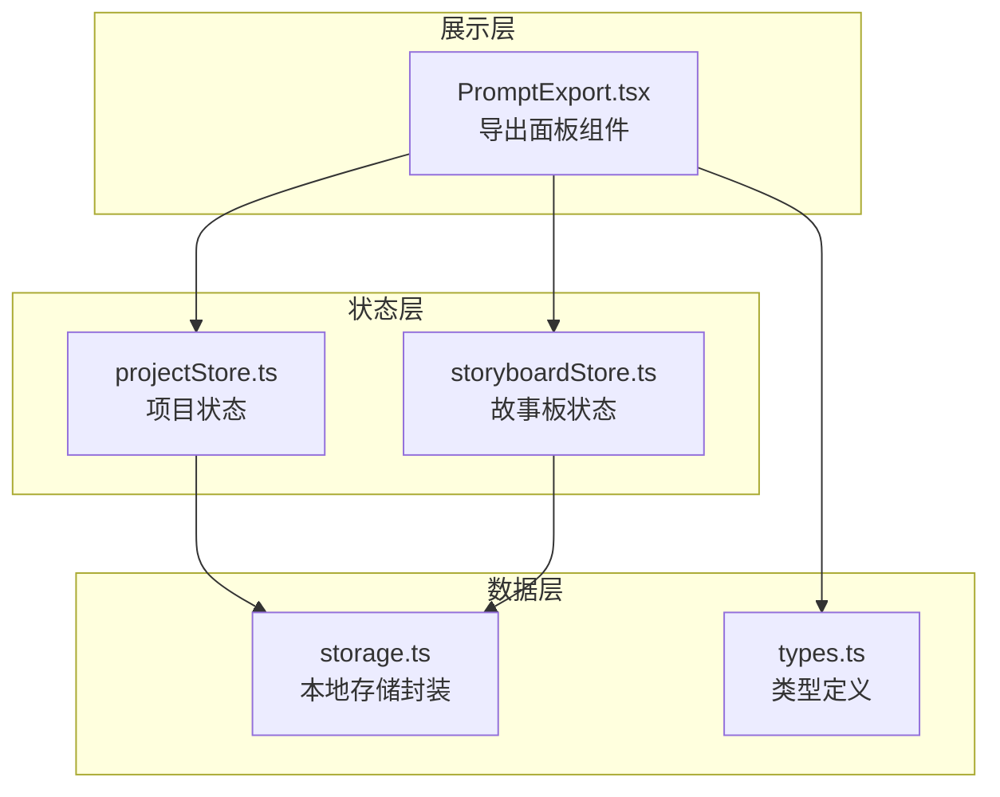
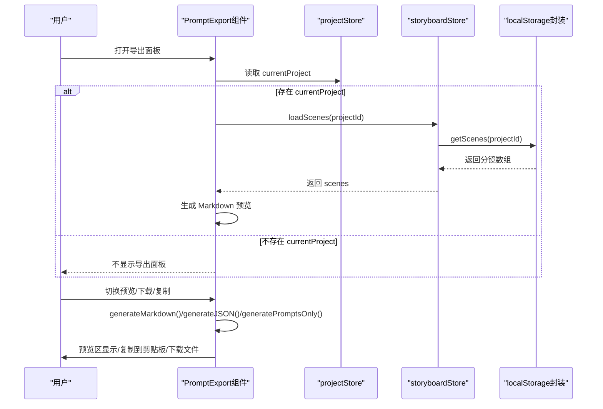
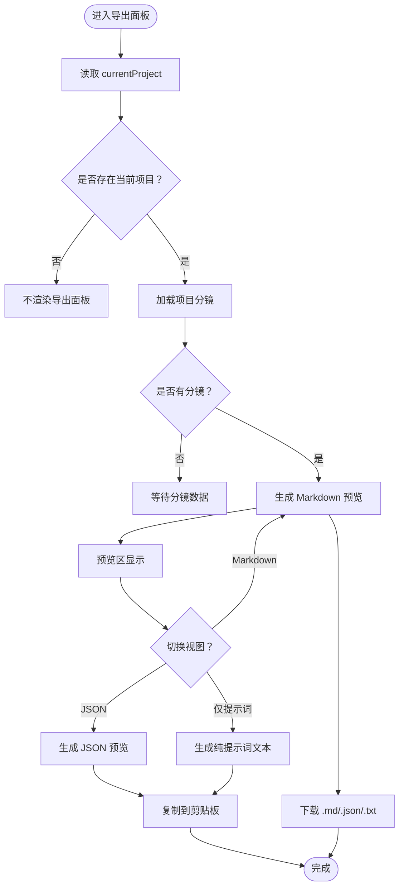
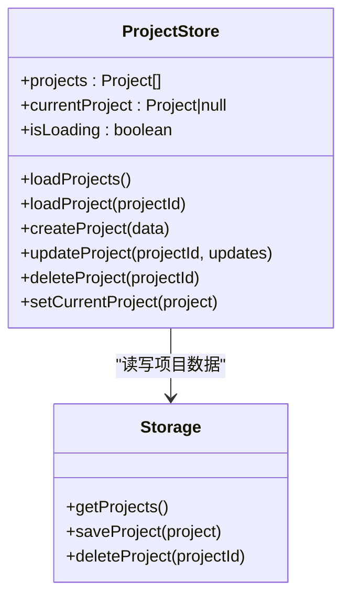
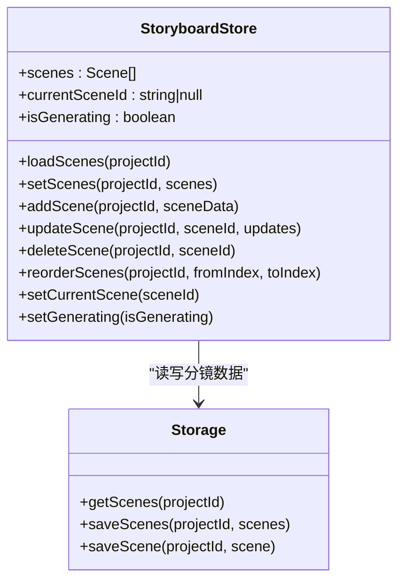
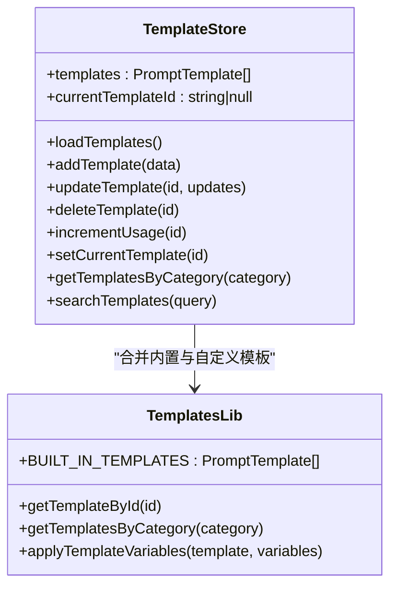
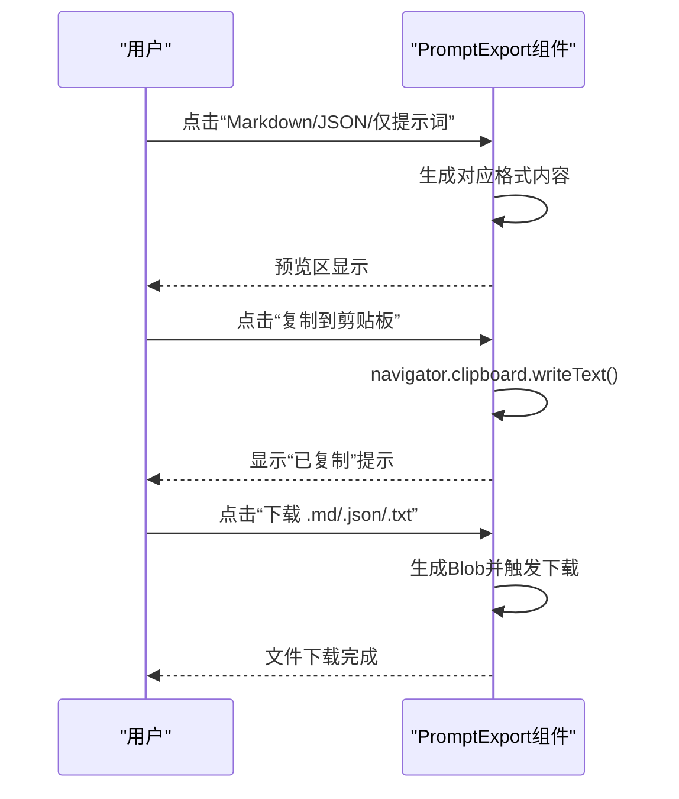
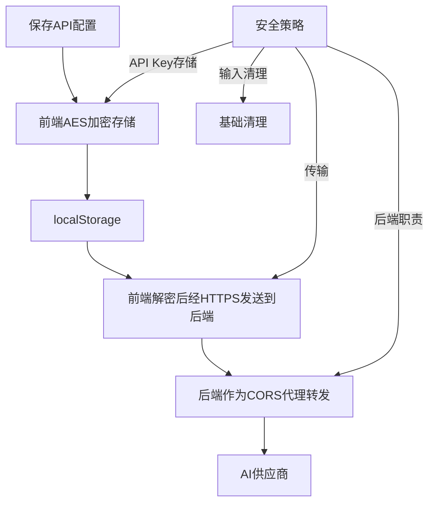
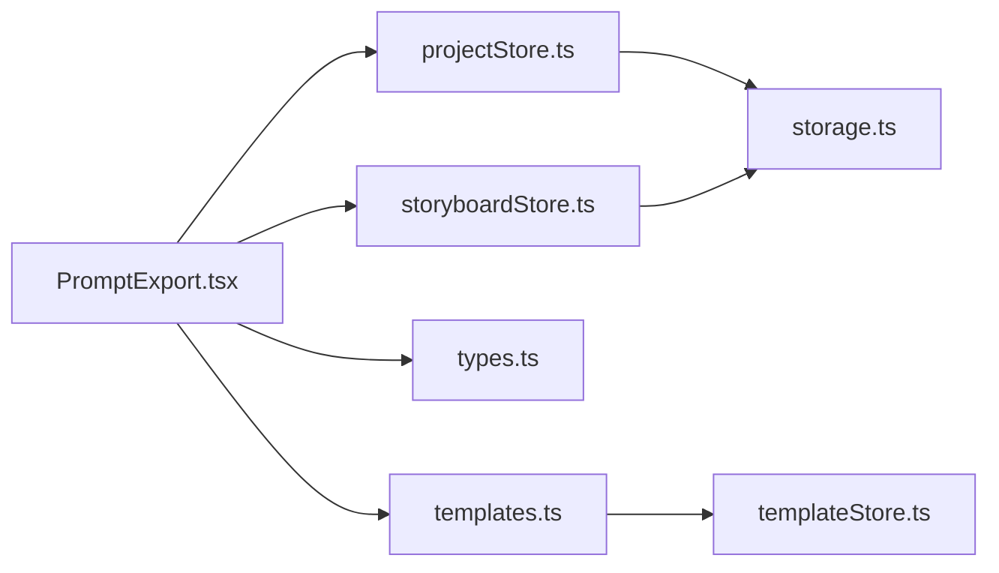

# 提示词导出

<cite>
**本文引用的文件**
- [PromptExport.tsx](file://manga-creator/src/components/editor/PromptExport.tsx)
- [projectStore.ts](file://manga-creator/src/stores/projectStore.ts)
- [storyboardStore.ts](file://manga-creator/src/stores/storyboardStore.ts)
- [storage.ts](file://manga-creator/src/lib/storage.ts)
- [types.ts](file://manga-creator/src/types/index.ts)
- [templates.ts](file://manga-creator/src/lib/templates.ts)
- [templateStore.ts](file://manga-creator/src/stores/templateStore.ts)
- [ConfigDialog.tsx](file://manga-creator/src/components/ConfigDialog.tsx)
- [factory.ts](file://manga-creator/coverage/lcov-report/lib/ai/factory.ts.html)
- [prd_backup.md](file://prd_backup.md)
</cite>

## 目录
1. [简介](#简介)
2. [项目结构](#项目结构)
3. [核心组件](#核心组件)
4. [架构总览](#架构总览)
5. [详细组件分析](#详细组件分析)
6. [依赖关系分析](#依赖关系分析)
7. [性能考量](#性能考量)
8. [故障排查指南](#故障排查指南)
9. [结论](#结论)
10. [附录](#附录)

## 简介
本文件系统性阐述提示词导出模块的整合与输出机制，重点说明该模块如何将多阶段创作成果（项目信息、分镜列表及其各阶段内容）聚合为标准化提示词输出，覆盖导出格式切换、内容预览、一键复制与文件下载等功能；并结合项目与故事板数据存储层，解释从 projectStore 与 storyboardStore 中提取结构化数据的方式。文档同时讨论敏感信息（如 API Key）的过滤与安全防护策略，并给出自定义导出模板的扩展方法指导，最后提供不同类型项目（漫画/短剧）在输出层面的差异化处理建议。

## 项目结构
提示词导出功能位于编辑器界面组件中，围绕三个核心层次组织：
- 展示层：导出面板组件负责渲染统计、预览区与导出按钮组
- 状态层：项目与故事板状态管理，提供当前项目与分镜数据
- 数据层：本地持久化存储，负责项目与分镜的读取与保存

图表来源
- [PromptExport.tsx](file://manga-creator/src/components/editor/PromptExport.tsx#L1-L335)
- [projectStore.ts](file://manga-creator/src/stores/projectStore.ts#L1-L95)
- [storyboardStore.ts](file://manga-creator/src/stores/storyboardStore.ts#L1-L107)
- [storage.ts](file://manga-creator/src/lib/storage.ts#L1-L246)
- [types.ts](file://manga-creator/src/types/index.ts#L1-L351)

章节来源
- [PromptExport.tsx](file://manga-creator/src/components/editor/PromptExport.tsx#L1-L335)
- [projectStore.ts](file://manga-creator/src/stores/projectStore.ts#L1-L95)
- [storyboardStore.ts](file://manga-creator/src/stores/storyboardStore.ts#L1-L107)
- [storage.ts](file://manga-creator/src/lib/storage.ts#L1-L246)
- [types.ts](file://manga-creator/src/types/index.ts#L1-L351)

## 核心组件
- 导出面板组件：负责加载当前项目与分镜、计算完成率、生成 Markdown/JSON/纯提示词三种输出、提供预览与下载能力，并支持一键复制。
- 项目状态管理：提供当前项目对象与项目集合的读取、创建、更新、删除与切换。
- 故事板状态管理：提供分镜集合的读取、新增、更新、删除、重排与生成状态标记。
- 本地存储封装：提供项目与分镜的读取、保存、删除、导出与导入，以及配置的加解密存储。
- 类型定义：统一项目、分镜、工作流状态、导出格式等类型，支撑跨模块的数据契约。
- 模板系统：内置多种提示词模板（Midjourney、Stable Diffney、ComfyUI等），并支持自定义模板的增删改查与持久化。

章节来源
- [PromptExport.tsx](file://manga-creator/src/components/editor/PromptExport.tsx#L1-L335)
- [projectStore.ts](file://manga-creator/src/stores/projectStore.ts#L1-L95)
- [storyboardStore.ts](file://manga-creator/src/stores/storyboardStore.ts#L1-L107)
- [storage.ts](file://manga-creator/src/lib/storage.ts#L1-L246)
- [types.ts](file://manga-creator/src/types/index.ts#L1-L351)
- [templates.ts](file://manga-creator/src/lib/templates.ts#L1-L313)
- [templateStore.ts](file://manga-creator/src/stores/templateStore.ts#L1-L122)

## 架构总览
提示词导出的控制流如下：
- 组件挂载时，监听当前项目变更，触发加载对应项目的分镜
- 当存在分镜数据时，自动生成 Markdown 预览内容
- 用户可在预览区切换 Markdown/JSON 视图，或导出纯提示词文本
- 支持复制到剪贴板与下载为 .md/.json/.txt 文件
- 敏感信息（如 API Key）通过本地加密存储与前端解密策略保障安全

图表来源
- [PromptExport.tsx](file://manga-creator/src/components/editor/PromptExport.tsx#L1-L335)
- [projectStore.ts](file://manga-creator/src/stores/projectStore.ts#L1-L95)
- [storyboardStore.ts](file://manga-creator/src/stores/storyboardStore.ts#L1-L107)
- [storage.ts](file://manga-creator/src/lib/storage.ts#L1-L246)

## 详细组件分析

### 组件：提示词导出面板（PromptExport）
- 数据来源
  - 从 projectStore 获取当前项目对象，用于标题、风格、概要、角色等元信息
  - 从 storyboardStore 获取分镜数组，用于逐条生成分镜级内容
- 输出格式
  - Markdown：包含项目信息、基础设定、分镜列表与各字段（场景描述、动作描述、AI绘画提示词、备注）
  - JSON：结构化导出，便于程序处理与备份
  - 仅提示词：纯文本，每一分镜一个提示词块，适合直接粘贴到 Midjourney/Stable Diffusion 等平台
- 交互能力
  - 预览区：支持 Markdown/JSON 两种视图切换
  - 一键复制：将当前预览内容复制到剪贴板
  - 下载：分别下载 .md/.json/.txt 文件
  - 快速预览：展示每个分镜的完成状态与关键字段填充情况

图表来源
- [PromptExport.tsx](file://manga-creator/src/components/editor/PromptExport.tsx#L1-L335)

章节来源
- [PromptExport.tsx](file://manga-creator/src/components/editor/PromptExport.tsx#L1-L335)

### 组件：项目状态管理（projectStore）
- 职责
  - 管理项目集合与当前项目
  - 提供加载、创建、更新、删除与设置当前项目的方法
- 数据来源
  - 通过 storage.ts 的 getProjects/saveProject/deleteProject 等接口与本地存储交互
- 导出关联
  - 导出面板依赖 currentProject 作为项目元信息的来源

图表来源
- [projectStore.ts](file://manga-creator/src/stores/projectStore.ts#L1-L95)
- [storage.ts](file://manga-creator/src/lib/storage.ts#L1-L246)

章节来源
- [projectStore.ts](file://manga-creator/src/stores/projectStore.ts#L1-L95)
- [storage.ts](file://manga-creator/src/lib/storage.ts#L1-L246)

### 组件：故事板状态管理（storyboardStore）
- 职责
  - 管理分镜集合与当前分镜
  - 提供加载、新增、更新、删除、重排与生成状态标记的方法
- 数据来源
  - 通过 storage.ts 的 getScenes/saveScenes/saveScene 等接口与本地存储交互
- 导出关联
  - 导出面板依赖 scenes 数组生成分镜级内容

图表来源
- [storyboardStore.ts](file://manga-creator/src/stores/storyboardStore.ts#L1-L107)
- [storage.ts](file://manga-creator/src/lib/storage.ts#L1-L246)

章节来源
- [storyboardStore.ts](file://manga-creator/src/stores/storyboardStore.ts#L1-L107)
- [storage.ts](file://manga-creator/src/lib/storage.ts#L1-L246)

### 组件：模板系统（内置与自定义）
- 内置模板库
  - 场景描述模板：写实、动漫、赛博朋克等风格
  - 动作描述模板：戏剧性动作、战斗动作等
  - 镜头提示词模板：Midjourney、Stable Diffusion、ComfyUI 等平台专用
  - 风格化模板：水墨国风、像素艺术等
- 自定义模板
  - 支持增删改查、搜索与按分类筛选
  - 使用 localStorage 持久化自定义模板，内置模板不可被修改或删除
- 导出关联
  - 导出面板中的“仅提示词”输出可直接复用分镜的 shotPrompt 字段
  - 若需要针对不同平台生成定制提示词，可在生成流程中选择相应模板并应用变量

图表来源
- [templateStore.ts](file://manga-creator/src/stores/templateStore.ts#L1-L122)
- [templates.ts](file://manga-creator/src/lib/templates.ts#L1-L313)

章节来源
- [templates.ts](file://manga-creator/src/lib/templates.ts#L1-L313)
- [templateStore.ts](file://manga-creator/src/stores/templateStore.ts#L1-L122)

### 导出格式切换、内容预览、一键复制与下载
- 格式切换
  - 预览区提供 Markdown 与 JSON 两种视图按钮，点击后即时切换
- 内容预览
  - Textarea 显示当前选中的格式内容，支持只读查看
- 一键复制
  - 调用浏览器 Clipboard API 将当前预览内容复制到剪贴板，并反馈“已复制”状态
- 文件下载
  - 生成 Blob 并触发 a 标签下载，分别支持 .md/.json/.txt 文件名

图表来源
- [PromptExport.tsx](file://manga-creator/src/components/editor/PromptExport.tsx#L1-L335)

章节来源
- [PromptExport.tsx](file://manga-creator/src/components/editor/PromptExport.tsx#L1-L335)

### 不同类型项目的输出差异处理策略
- 漫画项目
  - 更注重分镜的连贯性与画面节奏，导出时建议保留场景描述、动作描述与提示词三者
  - 可使用 Midjourney 或 Stable Diffusion 模板，确保提示词包含构图、视角、灯光与风格参数
- 短剧项目
  - 更关注人物特写与情绪表达，导出时可侧重动作描述与提示词的细节
  - 可使用“风格化”模板（如水墨国风、像素艺术）增强风格一致性
- 通用建议
  - 在导出前对未完成分镜进行提醒，避免导出不完整内容
  - 对于需要跨平台使用的提示词，优先采用英文、结构化与权重标注

章节来源
- [PromptExport.tsx](file://manga-creator/src/components/editor/PromptExport.tsx#L1-L335)
- [templates.ts](file://manga-creator/src/lib/templates.ts#L1-L313)

### 敏感信息过滤与数据安全防护
- API Key 存储
  - 使用 AES 对称加密存储在本地，前端解密后通过 HTTPS 发送到后端 API Route，由后端代理转发至 AI 供应商
- 数据最小化
  - 导出内容默认不包含 API Key 等敏感信息
- 输入清理
  - 对用户输入进行基础清理，防止提示词注入
- 配置校验
  - 在配置对话框中对必填项进行校验，测试连接有效性后再保存

图表来源
- [storage.ts](file://manga-creator/src/lib/storage.ts#L1-L246)
- [ConfigDialog.tsx](file://manga-creator/src/components/ConfigDialog.tsx#L44-L125)
- [factory.ts](file://manga-creator/coverage/lcov-report/lib/ai/factory.ts.html#L188-L244)
- [prd_backup.md](file://prd_backup.md#L756-L772)

章节来源
- [storage.ts](file://manga-creator/src/lib/storage.ts#L1-L246)
- [ConfigDialog.tsx](file://manga-creator/src/components/ConfigDialog.tsx#L44-L125)
- [factory.ts](file://manga-creator/coverage/lcov-report/lib/ai/factory.ts.html#L188-L244)
- [prd_backup.md](file://prd_backup.md#L756-L772)

### 自定义导出模板的扩展方法
- 扩展点
  - 在模板库中新增 PromptTemplate 条目，定义模板名称、分类、描述、变量与输出格式
  - 通过模板存储层的 addTemplate/updateTemplate/deleteTemplate 方法管理自定义模板
  - 使用 applyTemplateVariables 将变量注入模板，生成平台专用提示词
- 最佳实践
  - 保持模板变量与导出字段一致（如 sceneDescription、actionDescription、style 等）
  - 为不同平台（Midjourney、SD、ComfyUI）分别设计模板，明确输出结构与参数
  - 对内置模板进行只读保护，避免误删或误改

章节来源
- [templates.ts](file://manga-creator/src/lib/templates.ts#L1-L313)
- [templateStore.ts](file://manga-creator/src/stores/templateStore.ts#L1-L122)
- [types.ts](file://manga-creator/src/types/index.ts#L256-L350)

## 依赖关系分析
- 组件依赖
  - PromptExport 依赖 projectStore 与 storyboardStore 获取数据
  - 项目与故事板状态依赖 storage.ts 实现持久化
- 类型契约
  - types.ts 定义了 Project、Scene、WorkflowState、ExportFormat 等类型，保证跨模块一致性
- 模板依赖
  - templates.ts 提供内置模板与变量替换工具，templateStore.ts 提供模板的增删改查与持久化

图表来源
- [PromptExport.tsx](file://manga-creator/src/components/editor/PromptExport.tsx#L1-L335)
- [projectStore.ts](file://manga-creator/src/stores/projectStore.ts#L1-L95)
- [storyboardStore.ts](file://manga-creator/src/stores/storyboardStore.ts#L1-L107)
- [storage.ts](file://manga-creator/src/lib/storage.ts#L1-L246)
- [types.ts](file://manga-creator/src/types/index.ts#L1-L351)
- [templates.ts](file://manga-creator/src/lib/templates.ts#L1-L313)
- [templateStore.ts](file://manga-creator/src/stores/templateStore.ts#L1-L122)

章节来源
- [PromptExport.tsx](file://manga-creator/src/components/editor/PromptExport.tsx#L1-L335)
- [projectStore.ts](file://manga-creator/src/stores/projectStore.ts#L1-L95)
- [storyboardStore.ts](file://manga-creator/src/stores/storyboardStore.ts#L1-L107)
- [storage.ts](file://manga-creator/src/lib/storage.ts#L1-L246)
- [types.ts](file://manga-creator/src/types/index.ts#L1-L351)
- [templates.ts](file://manga-creator/src/lib/templates.ts#L1-L313)
- [templateStore.ts](file://manga-creator/src/stores/templateStore.ts#L1-L122)

## 性能考量
- 预览生成
  - Markdown/JSON 生成为纯内存操作，复杂度与分镜数量线性相关，建议在分镜较多时提供“仅提示词”轻量导出
- 复制与下载
  - 复制到剪贴板与 Blob 下载均为浏览器原生 API，性能稳定；注意大文件下载时的内存占用
- 存储与序列化
  - 本地存储为字符串序列化，建议避免在导出前进行重复序列化；导出后及时释放临时内容

## 故障排查指南
- 无法看到导出面板
  - 检查是否存在 currentProject；若为空，组件不会渲染
- 预览区为空
  - 确认已加载对应项目的分镜；若 scenes 为空，需先完成分镜生成
- 复制失败
  - 检查浏览器权限与安全上下文（HTTPS）；捕获异常并查看控制台错误
- 下载无响应
  - 确认生成的内容非空；检查 Blob 创建与 a 标签触发逻辑
- API Key 安全问题
  - 确保配置已加密存储；前端解密后仅在受控请求中使用；后端不记录或存储 API Key

章节来源
- [PromptExport.tsx](file://manga-creator/src/components/editor/PromptExport.tsx#L1-L335)
- [storage.ts](file://manga-creator/src/lib/storage.ts#L1-L246)
- [ConfigDialog.tsx](file://manga-creator/src/components/ConfigDialog.tsx#L44-L125)
- [prd_backup.md](file://prd_backup.md#L756-L772)

## 结论
提示词导出模块通过清晰的组件分层与稳定的类型契约，实现了从项目与故事板数据到多种导出格式的自动化聚合。其交互设计兼顾易用性与安全性，既满足人类阅读的 Markdown，也满足程序处理的 JSON，还提供面向不同 AIGC 平台的提示词输出。配合内置与自定义模板系统，用户可以灵活扩展导出策略，以适应漫画与短剧等不同类型的创作需求。同时，通过本地加密存储与后端代理转发，有效降低了敏感信息泄露风险。

## 附录
- 导出格式说明
  - Markdown：适合人类阅读，包含项目信息与分镜详情
  - JSON：适合程序处理，便于导入其他工具或备份
  - 仅提示词：纯文本，直接用于 Midjourney/Stable Diffusion 等平台
- 快速分镜预览
  - 展示每个分镜的完成状态与关键字段填充情况，辅助导出前的质量检查

章节来源
- [PromptExport.tsx](file://manga-creator/src/components/editor/PromptExport.tsx#L1-L335)