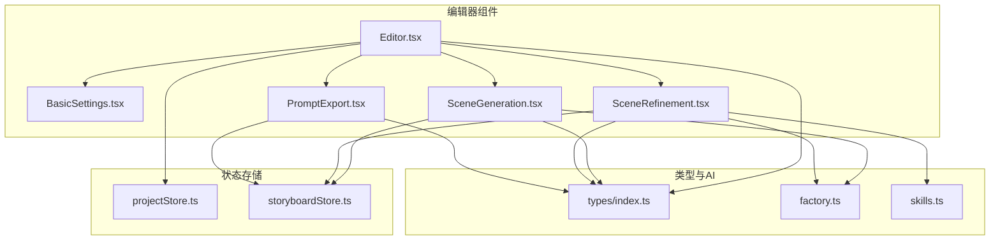
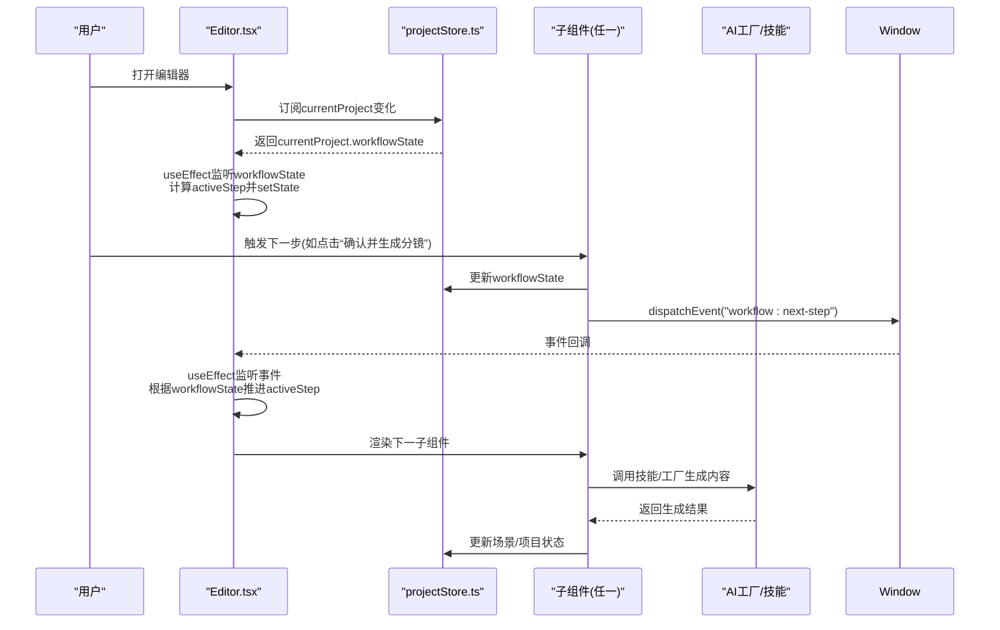
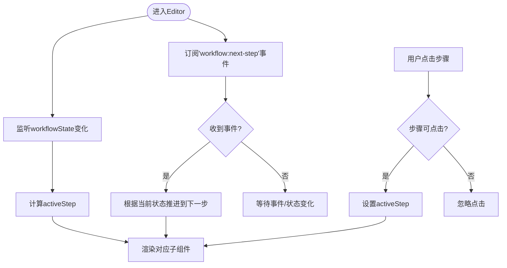
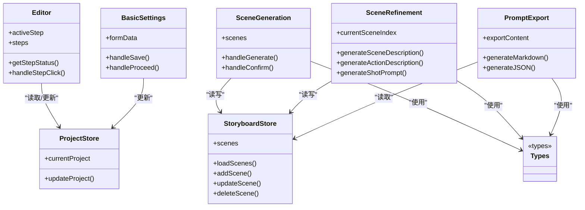
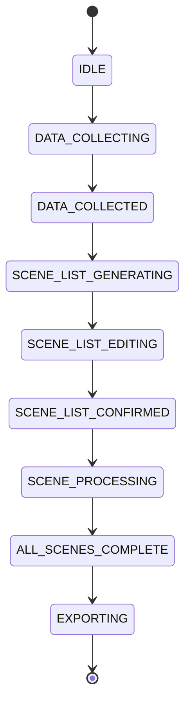
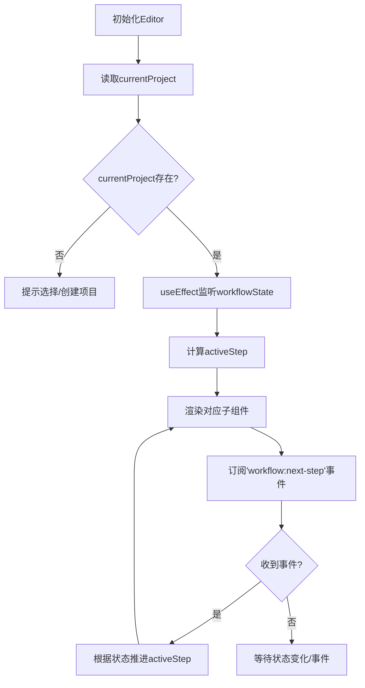

# 编辑器工作流

<cite>
**本文引用的文件**
- [Editor.tsx](file://manga-creator/src/components/Editor.tsx)
- [BasicSettings.tsx](file://manga-creator/src/components/editor/BasicSettings.tsx)
- [SceneGeneration.tsx](file://manga-creator/src/components/editor/SceneGeneration.tsx)
- [SceneRefinement.tsx](file://manga-creator/src/components/editor/SceneRefinement.tsx)
- [PromptExport.tsx](file://manga-creator/src/components/editor/PromptExport.tsx)
- [projectStore.ts](file://manga-creator/src/stores/projectStore.ts)
- [storyboardStore.ts](file://manga-creator/src/stores/storyboardStore.ts)
- [types/index.ts](file://manga-creator/src/types/index.ts)
- [factory.ts](file://manga-creator/src/lib/ai/factory.ts)
- [skills.ts](file://manga-creator/src/lib/ai/skills.ts)
</cite>

## 目录
1. [简介](#简介)
2. [项目结构](#项目结构)
3. [核心组件](#核心组件)
4. [架构总览](#架构总览)
5. [详细组件分析](#详细组件分析)
6. [依赖关系分析](#依赖关系分析)
7. [性能考量](#性能考量)
8. [故障排查指南](#故障排查指南)
9. [结论](#结论)
10. [附录](#附录)

## 简介
本文件面向希望构建复杂表单向导与多步骤创作流程的开发者，系统解析编辑器工作流的多步骤创作界面设计。重点覆盖：
- Editor组件如何基于currentProject的workflowState状态自动驱动步骤导航的激活状态
- useEffect监听工作流变化并动态切换activeStep的实现逻辑
- 步骤导航栏的视觉反馈机制（已完成、当前进行中、待处理），以及用户手动点击步骤的权限控制
- 四个核心子组件的职责划分：基础设定、分镜生成、分镜细化、提示词导出
- 自定义事件'workflow:next-step'的发布与订阅模式如何实现跨组件流程推进
- 工作流状态机转换图与组件渲染逻辑流程图

## 项目结构
编辑器工作流位于manga-creator/src/components/editor目录，配合stores与types实现状态驱动与数据持久化；AI能力通过factory与skills模块抽象，供各子组件按需调用。

图表来源
- [Editor.tsx](file://manga-creator/src/components/Editor.tsx#L1-L172)
- [BasicSettings.tsx](file://manga-creator/src/components/editor/BasicSettings.tsx#L1-L224)
- [SceneGeneration.tsx](file://manga-creator/src/components/editor/SceneGeneration.tsx#L1-L383)
- [SceneRefinement.tsx](file://manga-creator/src/components/editor/SceneRefinement.tsx#L1-L638)
- [PromptExport.tsx](file://manga-creator/src/components/editor/PromptExport.tsx#L1-L335)
- [projectStore.ts](file://manga-creator/src/stores/projectStore.ts#L1-L95)
- [storyboardStore.ts](file://manga-creator/src/stores/storyboardStore.ts#L1-L107)
- [types/index.ts](file://manga-creator/src/types/index.ts#L1-L120)
- [factory.ts](file://manga-creator/src/lib/ai/factory.ts#L1-L54)
- [skills.ts](file://manga-creator/src/lib/ai/skills.ts#L1-L132)

章节来源
- [Editor.tsx](file://manga-creator/src/components/Editor.tsx#L1-L172)

## 核心组件
- Editor：全局步骤导航与渲染调度，监听workflowState与自定义事件，驱动activeStep切换，并提供步骤状态计算与点击权限控制。
- BasicSettings：基础设定数据收集，校验必填项，提交后更新workflowState并发布'workflow:next-step'。
- SceneGeneration：分镜列表生成与编辑，支持AI生成、手动添加、确认进入细化阶段。
- SceneRefinement：分镜三阶段细化（场景描述→动作描述→提示词），支持逐阶段生成与一键批量生成，推进到导出阶段。
- PromptExport：导出聚合，生成Markdown/JSON/纯提示词，统计完成率，提供复制与下载。

章节来源
- [Editor.tsx](file://manga-creator/src/components/Editor.tsx#L1-L172)
- [BasicSettings.tsx](file://manga-creator/src/components/editor/BasicSettings.tsx#L1-L224)
- [SceneGeneration.tsx](file://manga-creator/src/components/editor/SceneGeneration.tsx#L1-L383)
- [SceneRefinement.tsx](file://manga-creator/src/components/editor/SceneRefinement.tsx#L1-L638)
- [PromptExport.tsx](file://manga-creator/src/components/editor/PromptExport.tsx#L1-L335)

## 架构总览
编辑器采用“状态驱动 + 事件驱动”的双通道推进机制：
- 状态驱动：Editor监听currentProject.workflowState，自动将activeStep映射到对应步骤。
- 事件驱动：各子组件在满足条件时发布'workflow:next-step'，Editor订阅该事件并推进到下一步。

图表来源
- [Editor.tsx](file://manga-creator/src/components/Editor.tsx#L16-L51)
- [BasicSettings.tsx](file://manga-creator/src/components/editor/BasicSettings.tsx#L45-L61)
- [SceneGeneration.tsx](file://manga-creator/src/components/editor/SceneGeneration.tsx#L183-L193)
- [SceneRefinement.tsx](file://manga-creator/src/components/editor/SceneRefinement.tsx#L594-L619)
- [projectStore.ts](file://manga-creator/src/stores/projectStore.ts#L63-L81)
- [factory.ts](file://manga-creator/src/lib/ai/factory.ts#L44-L54)
- [skills.ts](file://manga-creator/src/lib/ai/skills.ts#L1-L132)

## 详细组件分析

### Editor组件：步骤导航与状态驱动
- 步骤定义与状态映射
  - Editor内部维护步骤数组，每个步骤包含名称与对应的状态集合。Editor根据currentProject.workflowState判断当前步骤、已完成步骤与待处理步骤。
- 自动切换activeStep
  - 通过useEffect监听currentProject.workflowState，依据状态映射规则设置activeStep，确保UI与工作流状态一致。
- 事件驱动推进
  - 通过window.addEventListener订阅'workflow:next-step'，在事件回调中根据当前状态推进到下一步。
- 步骤导航视觉反馈
  - getStepStatus根据当前状态计算步骤状态：current/completed/pending；渲染不同图标与颜色；禁用未到的步骤。
- 手动点击权限控制
  - handleStepClick仅允许点击当前步骤或已完成步骤，防止越权跳转。

图表来源
- [Editor.tsx](file://manga-creator/src/components/Editor.tsx#L16-L108)

章节来源
- [Editor.tsx](file://manga-creator/src/components/Editor.tsx#L1-L172)

### BasicSettings：基础设定数据收集
- 数据收集与校验
  - 收集summary/style/protagonist，提供长度校验与提示；只有当必填项满足阈值时才允许继续。
- 状态推进
  - 保存草稿并更新workflowState为DATA_COLLECTED；随后发布'workflow:next-step'，Editor自动切换到分镜生成步骤。
- 视觉反馈
  - 实时长度提示与按钮禁用状态，引导用户完善信息。

章节来源
- [BasicSettings.tsx](file://manga-creator/src/components/editor/BasicSettings.tsx#L1-L224)
- [projectStore.ts](file://manga-creator/src/stores/projectStore.ts#L63-L81)

### SceneGeneration：分镜列表生成与编辑
- 生成与加载
  - 首次进入时从storyboardStore加载场景；AI生成分镜列表，解析响应并写入store，同时更新workflowState为SCENE_LIST_EDITING。
- 编辑与确认
  - 支持手动添加、编辑、删除；当场景数量≥6且处于编辑态时，允许“确认分镜列表”，更新workflowState为SCENE_LIST_CONFIRMED并发布'workflow:next-step'。
- 视觉反馈
  - 生成进度条、错误提示、分镜列表与操作按钮，提供“重新生成/添加分镜/确认”等操作。

章节来源
- [SceneGeneration.tsx](file://manga-creator/src/components/editor/SceneGeneration.tsx#L1-L383)
- [storyboardStore.ts](file://manga-creator/src/stores/storyboardStore.ts#L1-L107)
- [projectStore.ts](file://manga-creator/src/stores/projectStore.ts#L63-L81)

### SceneRefinement：分镜三阶段细化与批量生成
- 三阶段生成
  - 场景描述→动作描述→提示词，每阶段完成后更新场景状态；最后阶段完成后更新workflowState为ALL_SCENES_COMPLETE。
- 一键批量生成
  - 依次执行三阶段生成，带防重入与状态刷新，确保每阶段完成后才进入下一阶段。
- 导航与导出
  - 支持上/下一个分镜导航；当最后一个分镜完成时，提供“前往导出”按钮，更新workflowState并发布'workflow:next-step'。
- 视觉反馈
  - 阶段面板展开/收起，进度条与整体完成度统计，完成态高亮。

章节来源
- [SceneRefinement.tsx](file://manga-creator/src/components/editor/SceneRefinement.tsx#L1-L638)
- [storyboardStore.ts](file://manga-creator/src/stores/storyboardStore.ts#L1-L107)
- [projectStore.ts](file://manga-creator/src/stores/projectStore.ts#L63-L81)
- [factory.ts](file://manga-creator/src/lib/ai/factory.ts#L1-L54)
- [skills.ts](file://manga-creator/src/lib/ai/skills.ts#L1-L132)

### PromptExport：提示词导出与聚合
- 内容生成
  - 基于场景状态生成Markdown/JSON/纯提示词；统计完成率与分镜状态；提供复制与下载。
- 视觉反馈
  - 完成度徽章、统计卡片、快速预览网格，便于核对与导出。

章节来源
- [PromptExport.tsx](file://manga-creator/src/components/editor/PromptExport.tsx#L1-L335)
- [storyboardStore.ts](file://manga-creator/src/stores/storyboardStore.ts#L1-L107)
- [projectStore.ts](file://manga-creator/src/stores/projectStore.ts#L63-L81)

## 依赖关系分析
- 组件间依赖
  - Editor依赖projectStore读取currentProject与workflowState；子组件通过projectStore与storyboardStore读写数据。
- 类型与状态
  - types/index.ts定义WorkflowState、SceneStatus等类型，约束状态流转与数据结构。
- AI集成
  - factory.ts与skills.ts提供AI客户端与技能模板，SceneGeneration与SceneRefinement按需调用。

图表来源
- [Editor.tsx](file://manga-creator/src/components/Editor.tsx#L1-L172)
- [BasicSettings.tsx](file://manga-creator/src/components/editor/BasicSettings.tsx#L1-L224)
- [SceneGeneration.tsx](file://manga-creator/src/components/editor/SceneGeneration.tsx#L1-L383)
- [SceneRefinement.tsx](file://manga-creator/src/components/editor/SceneRefinement.tsx#L1-L638)
- [PromptExport.tsx](file://manga-creator/src/components/editor/PromptExport.tsx#L1-L335)
- [projectStore.ts](file://manga-creator/src/stores/projectStore.ts#L1-L95)
- [storyboardStore.ts](file://manga-creator/src/stores/storyboardStore.ts#L1-L107)
- [types/index.ts](file://manga-creator/src/types/index.ts#L1-L120)

章节来源
- [projectStore.ts](file://manga-creator/src/stores/projectStore.ts#L1-L95)
- [storyboardStore.ts](file://manga-creator/src/stores/storyboardStore.ts#L1-L107)
- [types/index.ts](file://manga-creator/src/types/index.ts#L1-L120)

## 性能考量
- 状态监听与渲染
  - Editor对workflowState与事件的监听应避免不必要的重渲染；可通过稳定依赖数组与浅比较减少无效更新。
- AI生成与并发
  - SceneRefinement的一键批量生成包含多次状态刷新与等待，建议在UI层提供明确的loading状态与取消机制（若需要）。
- 存储与持久化
  - 项目与场景的读写集中在store中，注意批量更新时的去抖与合并写入，降低localStorage压力。

## 故障排查指南
- 无法进入下一步
  - 检查BasicSettings/SceneGeneration/SceneRefinement是否正确更新workflowState并发布'workflow:next-step'。
  - 确认Editor的事件监听是否生效，且currentProject存在。
- 步骤不可点击
  - 检查Editor.getStepStatus与handleStepClick的权限判定逻辑，确保仅允许点击已完成或当前步骤。
- 生成失败
  - SceneGeneration/SceneRefinement捕获异常并显示错误提示；检查AI配置是否完整（factory.ts）与技能是否存在（skills.ts）。
- 数据未持久化
  - 确认store的updateProject/addScene/updateScene等方法是否成功写入本地存储。

章节来源
- [Editor.tsx](file://manga-creator/src/components/Editor.tsx#L16-L51)
- [BasicSettings.tsx](file://manga-creator/src/components/editor/BasicSettings.tsx#L45-L61)
- [SceneGeneration.tsx](file://manga-creator/src/components/editor/SceneGeneration.tsx#L120-L136)
- [SceneRefinement.tsx](file://manga-creator/src/components/editor/SceneRefinement.tsx#L193-L207)
- [factory.ts](file://manga-creator/src/lib/ai/factory.ts#L44-L54)
- [skills.ts](file://manga-creator/src/lib/ai/skills.ts#L1-L132)

## 结论
该编辑器工作流通过“状态驱动 + 事件驱动”的双通道，实现了从基础设定到提示词导出的完整创作流程。Editor作为中枢，统一管理步骤导航与渲染；子组件各自承担数据收集、生成与导出职责，并通过事件与状态协同推进。该设计具备良好的扩展性与可维护性，适合在复杂表单向导场景中复用。

## 附录

### 工作流状态机转换图

图表来源
- [types/index.ts](file://manga-creator/src/types/index.ts#L1-L18)
- [projectStore.ts](file://manga-creator/src/stores/projectStore.ts#L42-L59)

### 组件渲染逻辑流程图（Editor）

图表来源
- [Editor.tsx](file://manga-creator/src/components/Editor.tsx#L16-L108)