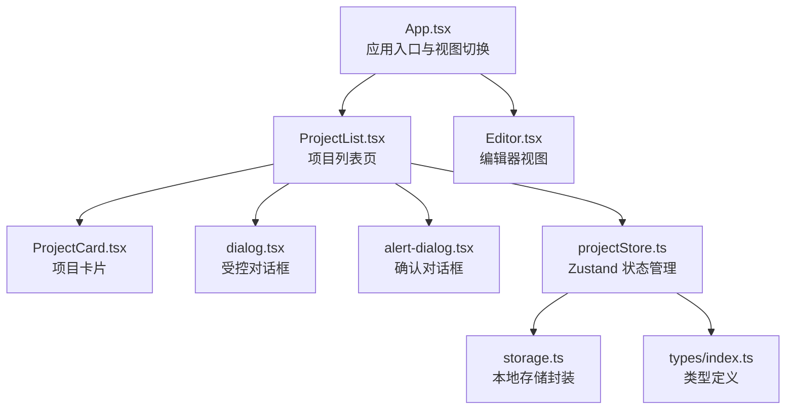
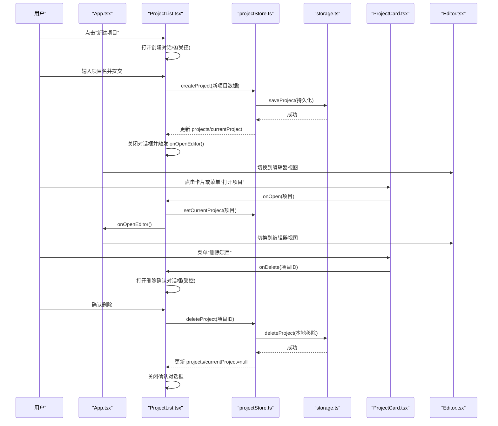
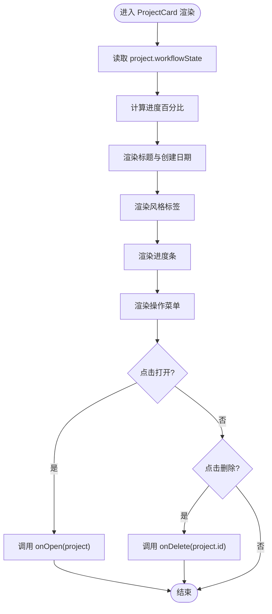
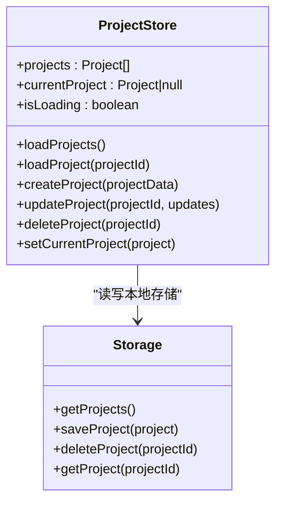
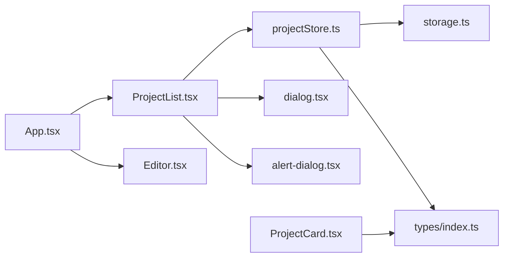

# 项目管理视图

<cite>
**本文引用的文件**
- [App.tsx](file://manga-creator/src/App.tsx)
- [ProjectList.tsx](file://manga-creator/src/components/ProjectList.tsx)
- [ProjectCard.tsx](file://manga-creator/src/components/ProjectCard.tsx)
- [projectStore.ts](file://manga-creator/src/stores/projectStore.ts)
- [storage.ts](file://manga-creator/src/lib/storage.ts)
- [types/index.ts](file://manga-creator/src/types/index.ts)
- [dialog.tsx](file://manga-creator/src/components/ui/dialog.tsx)
- [alert-dialog.tsx](file://manga-creator/src/components/ui/alert-dialog.tsx)
- [Editor.tsx](file://manga-creator/src/components/Editor.tsx)
</cite>

## 目录
1. [简介](#简介)
2. [项目结构](#项目结构)
3. [核心组件](#核心组件)
4. [架构总览](#架构总览)
5. [详细组件分析](#详细组件分析)
6. [依赖关系分析](#依赖关系分析)
7. [性能考量](#性能考量)
8. [故障排查指南](#故障排查指南)
9. [结论](#结论)

## 简介
本文件围绕“项目管理视图”的实现机制进行系统化剖析，重点说明：
- ProjectList 组件如何作为项目入口页，协调项目创建、打开与删除等核心操作；
- ProjectList 如何通过 useProjectStore 与 Zustand 状态管理器交互；
- ProjectCard 组件的渲染逻辑、网格布局展示策略及项目标题、摘要、状态的动态绑定；
- ProjectList 中创建对话框与删除确认对话框的受控组件实现；
- onOpenEditor 回调如何驱动视图切换；
- 组件通信时序图与状态变更流程图，帮助理解项目生命周期管理与 UI 响应机制。

## 项目结构
项目采用“按功能域划分”的组织方式：页面入口 App 负责视图切换；项目管理视图由 ProjectList 与 ProjectCard 组成；状态管理使用 Zustand 的 projectStore；持久化存储封装在 storage 工具中；UI 对话框组件来自自研 UI 库。

图表来源
- [App.tsx](file://manga-creator/src/App.tsx#L1-L81)
- [ProjectList.tsx](file://manga-creator/src/components/ProjectList.tsx#L1-L196)
- [ProjectCard.tsx](file://manga-creator/src/components/ProjectCard.tsx#L1-L110)
- [projectStore.ts](file://manga-creator/src/stores/projectStore.ts#L1-L95)
- [storage.ts](file://manga-creator/src/lib/storage.ts#L1-L246)
- [types/index.ts](file://manga-creator/src/types/index.ts#L1-L120)
- [dialog.tsx](file://manga-creator/src/components/ui/dialog.tsx#L1-L122)
- [alert-dialog.tsx](file://manga-creator/src/components/ui/alert-dialog.tsx#L1-L140)
- [Editor.tsx](file://manga-creator/src/components/Editor.tsx#L33-L108)

章节来源
- [App.tsx](file://manga-creator/src/App.tsx#L1-L81)
- [ProjectList.tsx](file://manga-creator/src/components/ProjectList.tsx#L1-L196)
- [ProjectCard.tsx](file://manga-creator/src/components/ProjectCard.tsx#L1-L110)
- [projectStore.ts](file://manga-creator/src/stores/projectStore.ts#L1-L95)
- [storage.ts](file://manga-creator/src/lib/storage.ts#L1-L246)
- [types/index.ts](file://manga-creator/src/types/index.ts#L1-L120)
- [dialog.tsx](file://manga-creator/src/components/ui/dialog.tsx#L1-L122)
- [alert-dialog.tsx](file://manga-creator/src/components/ui/alert-dialog.tsx#L1-L140)
- [Editor.tsx](file://manga-creator/src/components/Editor.tsx#L33-L108)

## 核心组件
- ProjectList：项目入口页，负责创建、打开、删除项目，管理对话框状态，并通过 onOpenEditor 驱动视图切换。
- ProjectCard：单个项目卡片，渲染标题、创建时间、风格标签、进度条与操作菜单。
- useProjectStore：Zustand 状态容器，封装项目集合、当前项目、加载状态与 CRUD 操作。
- storage：本地存储封装，提供项目/分镜/配置的读写与清理。
- UI 对话框：dialog.tsx 与 alert-dialog.tsx 提供受控对话框能力。

章节来源
- [ProjectList.tsx](file://manga-creator/src/components/ProjectList.tsx#L1-L196)
- [ProjectCard.tsx](file://manga-creator/src/components/ProjectCard.tsx#L1-L110)
- [projectStore.ts](file://manga-creator/src/stores/projectStore.ts#L1-L95)
- [storage.ts](file://manga-creator/src/lib/storage.ts#L1-L246)
- [dialog.tsx](file://manga-creator/src/components/ui/dialog.tsx#L1-L122)
- [alert-dialog.tsx](file://manga-creator/src/components/ui/alert-dialog.tsx#L1-L140)

## 架构总览
整体采用“视图-状态-存储”三层：
- 视图层：App 控制视图切换；ProjectList/ProjectCard 展示与交互；Editor 展示编辑流程。
- 状态层：useProjectStore 管理 projects/currentProject/isLoading。
- 存储层：storage 封装 localStorage 读写，支持项目、分镜、配置与清理。

图表来源
- [App.tsx](file://manga-creator/src/App.tsx#L1-L81)
- [ProjectList.tsx](file://manga-creator/src/components/ProjectList.tsx#L1-L196)
- [ProjectCard.tsx](file://manga-creator/src/components/ProjectCard.tsx#L1-L110)
- [projectStore.ts](file://manga-creator/src/stores/projectStore.ts#L1-L95)
- [storage.ts](file://manga-creator/src/lib/storage.ts#L1-L246)
- [Editor.tsx](file://manga-creator/src/components/Editor.tsx#L33-L108)

## 详细组件分析

### ProjectList 组件：入口页与对话框控制
- 与 Zustand 交互
  - 使用 useProjectStore 获取 projects、createProject、deleteProject、setCurrentProject。
  - 通过 toast 提示操作结果。
- 对话框实现
  - 创建对话框：受控 open/onChange，输入标题，回车触发提交；提交后关闭对话框并调用 onOpenEditor。
  - 删除确认对话框：受控 open/onChange，确认后执行 deleteProject 并清理状态。
- 视图切换
  - onOpenEditor 由 App 注入，用于将视图从列表切换到编辑器。
- 项目列表渲染
  - 当 projects 为空时显示引导占位；否则以网格布局渲染 ProjectCard。

章节来源
- [ProjectList.tsx](file://manga-creator/src/components/ProjectList.tsx#L1-L196)
- [dialog.tsx](file://manga-creator/src/components/ui/dialog.tsx#L1-L122)
- [alert-dialog.tsx](file://manga-creator/src/components/ui/alert-dialog.tsx#L1-L140)
- [App.tsx](file://manga-creator/src/App.tsx#L1-L81)

### ProjectCard 组件：渲染逻辑与网格展示
- 标题与摘要
  - 标题来自 project.title；描述显示创建日期（格式化）。
- 状态与进度
  - 根据 project.workflowState 计算进度百分比，使用渐变进度条展示。
  - 风格标签显示 project.style 或默认文案。
- 操作菜单
  - 下拉菜单提供“打开项目”和“删除项目”，点击事件通过 onOpen/onDelete 传递给父组件。
- 网格布局
  - ProjectList 以网格布局渲染卡片，卡片具备悬停缩放与阴影效果，提升交互体验。

图表来源
- [ProjectCard.tsx](file://manga-creator/src/components/ProjectCard.tsx#L1-L110)
- [types/index.ts](file://manga-creator/src/types/index.ts#L1-L120)

章节来源
- [ProjectCard.tsx](file://manga-creator/src/components/ProjectCard.tsx#L1-L110)
- [types/index.ts](file://manga-creator/src/types/index.ts#L1-L120)

### Zustand 状态管理：useProjectStore
- 状态字段
  - projects：项目数组
  - currentProject：当前选中项目
  - isLoading：加载状态
- 核心方法
  - loadProjects：从 storage 读取并设置 projects
  - loadProject：根据 id 设置 currentProject
  - createProject：生成唯一 id、时间戳，保存至 storage，并更新 projects/currentProject
  - updateProject：合并更新并持久化，同时更新当前项目
  - deleteProject：从 storage 删除并更新 projects/currentProject
  - setCurrentProject：设置当前项目

图表来源
- [projectStore.ts](file://manga-creator/src/stores/projectStore.ts#L1-L95)
- [storage.ts](file://manga-creator/src/lib/storage.ts#L1-L246)
- [types/index.ts](file://manga-creator/src/types/index.ts#L1-L120)

章节来源
- [projectStore.ts](file://manga-creator/src/stores/projectStore.ts#L1-L95)
- [storage.ts](file://manga-creator/src/lib/storage.ts#L1-L246)
- [types/index.ts](file://manga-creator/src/types/index.ts#L1-L120)

### 本地存储：数据持久化与清理
- 项目读写
  - getProjects/getProject/saveProject/deleteProject
  - 删除项目时同步清理对应分镜数据
- 配置读写
  - 配置采用 AES 加解密存储，避免明文泄露
- 数据导出/导入
  - 支持导出项目与分镜数据，便于备份与迁移
- 清理与用量
  - 支持清空 aixs_* 前缀数据与统计使用量

章节来源
- [storage.ts](file://manga-creator/src/lib/storage.ts#L1-L246)

### 视图切换与 Editor 协同
- App.tsx
  - 维护 currentView 状态，根据值渲染 ProjectList 或 Editor
  - 注入 onOpenEditor 回调给 ProjectList
- Editor.tsx
  - 监听 workflow 状态变化，根据当前项目状态决定可访问的步骤
  - 若无当前项目，提示用户先选择或创建项目

章节来源
- [App.tsx](file://manga-creator/src/App.tsx#L1-L81)
- [Editor.tsx](file://manga-creator/src/components/Editor.tsx#L33-L108)

## 依赖关系分析
- 组件耦合
  - ProjectList 依赖 useProjectStore 与 UI 对话框组件
  - ProjectCard 仅依赖 Project 类型与 UI 组件，低耦合高内聚
- 状态耦合
  - useProjectStore 与 storage 强耦合，负责数据一致性
- 外部依赖
  - Radix UI 对话框组件库
  - CryptoJS 用于配置加密
  - Lucide 图标库

图表来源
- [ProjectList.tsx](file://manga-creator/src/components/ProjectList.tsx#L1-L196)
- [ProjectCard.tsx](file://manga-creator/src/components/ProjectCard.tsx#L1-L110)
- [projectStore.ts](file://manga-creator/src/stores/projectStore.ts#L1-L95)
- [storage.ts](file://manga-creator/src/lib/storage.ts#L1-L246)
- [types/index.ts](file://manga-creator/src/types/index.ts#L1-L120)
- [dialog.tsx](file://manga-creator/src/components/ui/dialog.tsx#L1-L122)
- [alert-dialog.tsx](file://manga-creator/src/components/ui/alert-dialog.tsx#L1-L140)
- [App.tsx](file://manga-creator/src/App.tsx#L1-L81)
- [Editor.tsx](file://manga-creator/src/components/Editor.tsx#L33-L108)

## 性能考量
- 渲染优化
  - ProjectCard 采用轻量卡片与渐变进度条，避免重型计算
  - 列表为空时使用占位组件，减少不必要的 DOM 结构
- 状态更新
  - useProjectStore 使用 set 的浅拷贝策略，避免深层对象重渲染
  - 仅在必要字段变更时触发重渲染
- 存储访问
  - 本地存储读写集中在 storage.ts，避免频繁 IO
  - 删除项目时同步清理分镜数据，降低后续查询成本

## 故障排查指南
- 创建项目失败
  - 检查输入是否为空；查看 toast 是否提示错误；确认 storage.saveProject 是否抛错
- 删除项目无效
  - 确认 deleteDialogOpen 是否被正确关闭；检查 storage.deleteProject 是否执行；核对 projects 数组是否更新
- 无法打开项目
  - 确认 onOpenEditor 是否被调用；检查 App.currentView 是否切换；确认 setCurrentProject 是否生效
- 编辑器空白
  - 检查 currentProject 是否存在；确认 Editor.tsx 的状态判断逻辑

章节来源
- [ProjectList.tsx](file://manga-creator/src/components/ProjectList.tsx#L1-L196)
- [projectStore.ts](file://manga-creator/src/stores/projectStore.ts#L1-L95)
- [storage.ts](file://manga-creator/src/lib/storage.ts#L1-L246)
- [Editor.tsx](file://manga-creator/src/components/Editor.tsx#L33-L108)

## 结论
本项目管理视图通过清晰的职责分离与受控组件模式，实现了项目生命周期的完整闭环：从创建、打开到删除，均由 ProjectList 统一协调；Zustand 状态管理器确保数据一致性与可追踪性；UI 对话框提供良好的交互反馈；App 与 Editor 协同完成视图切换。建议在后续迭代中进一步完善工作流状态机文档与自动化测试覆盖，以提升可维护性与可靠性。