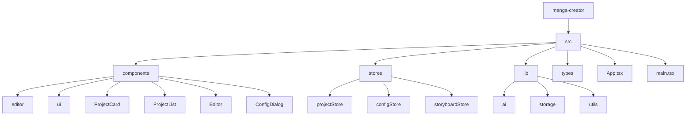
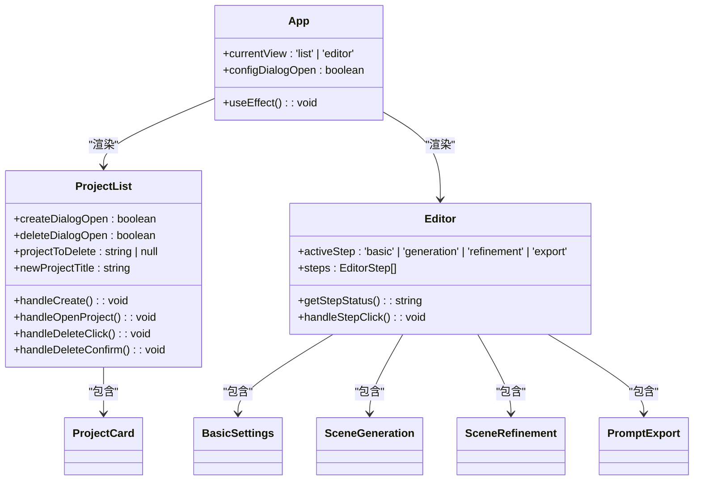
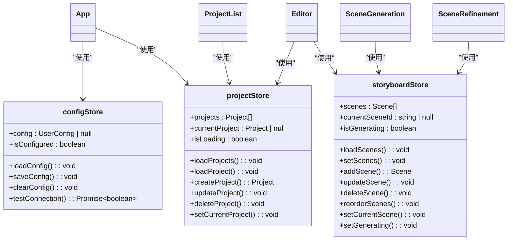
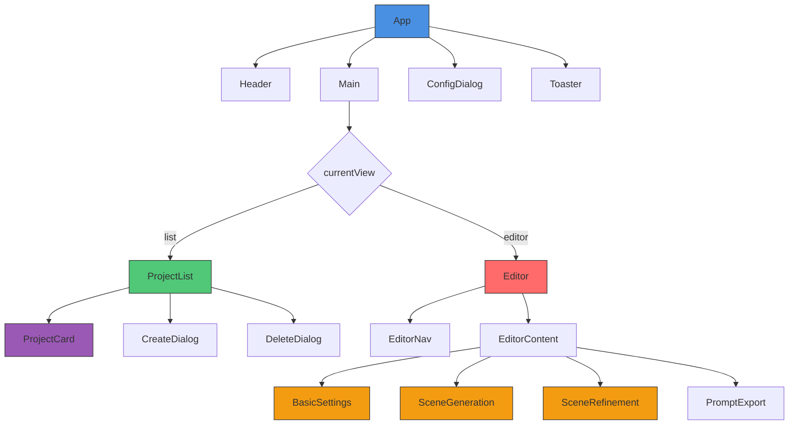
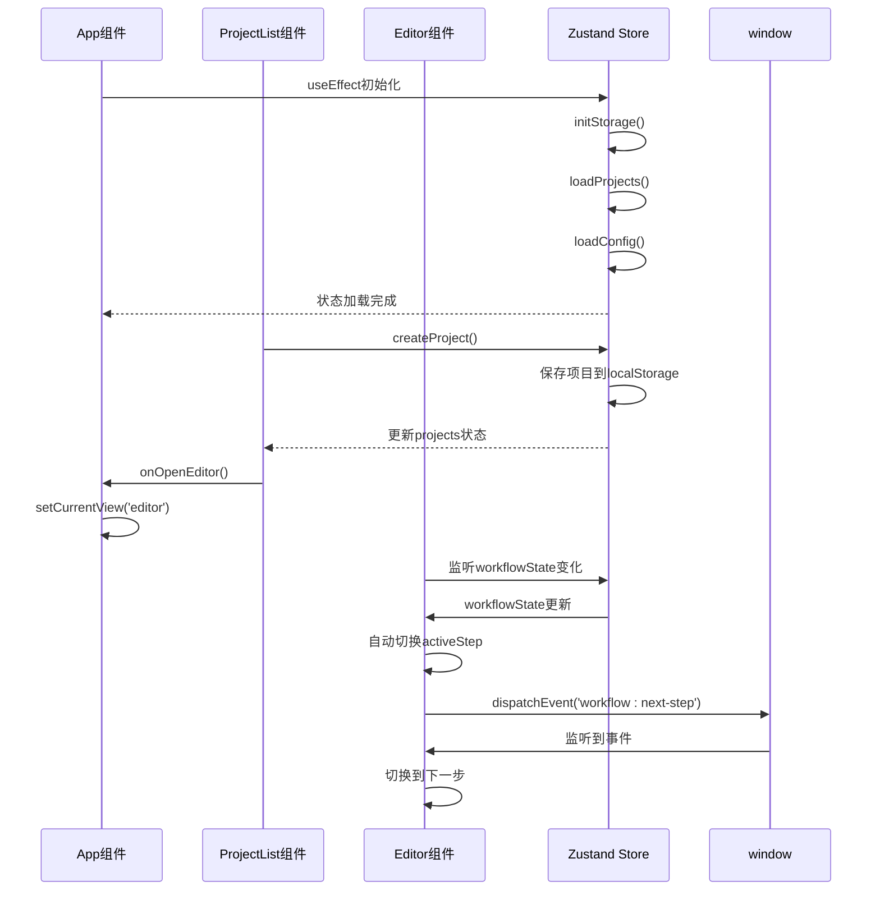
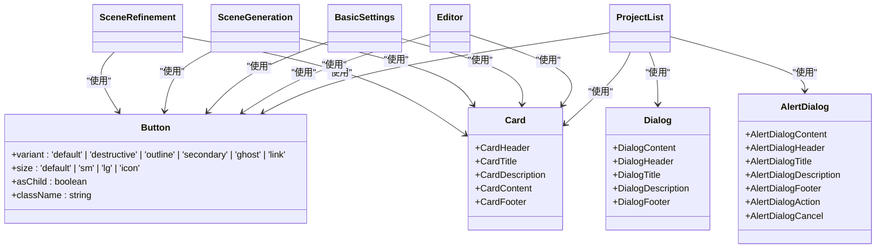
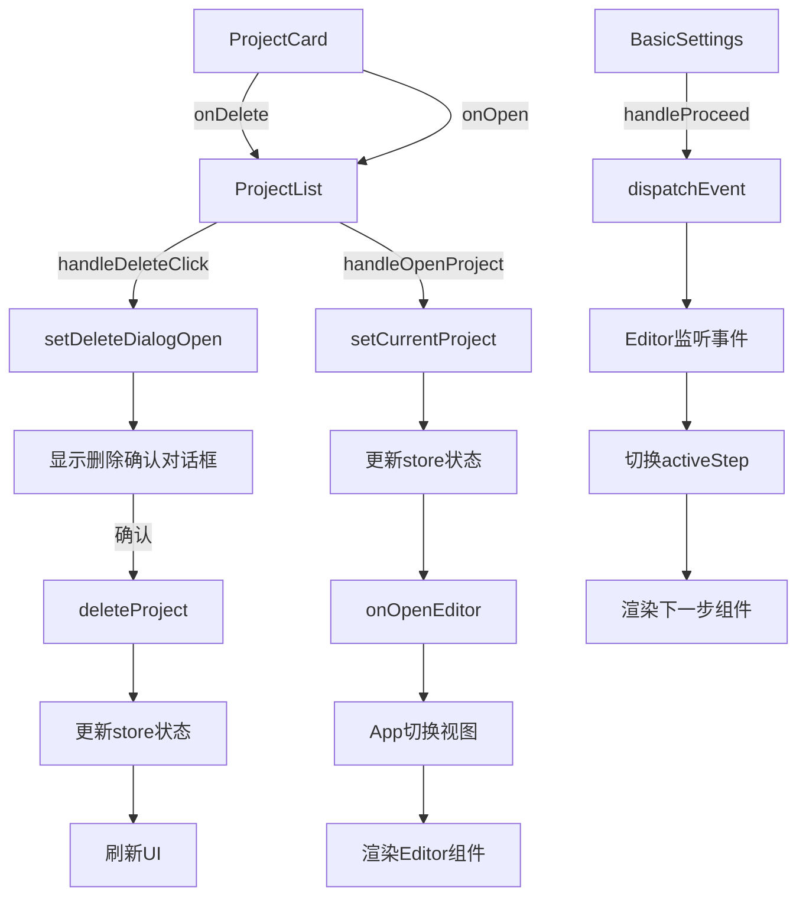
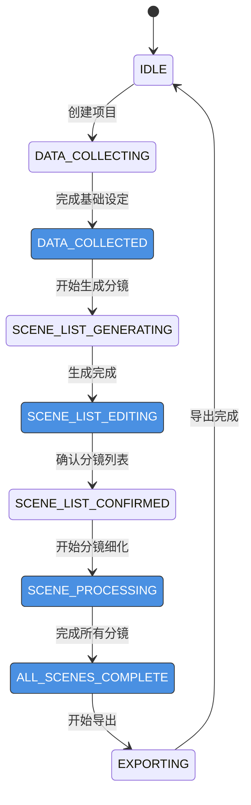

# 组件架构

<cite>
**本文档引用的文件**  
- [App.tsx](file://manga-creator/src/App.tsx)
- [ProjectList.tsx](file://manga-creator/src/components/ProjectList.tsx)
- [Editor.tsx](file://manga-creator/src/components/Editor.tsx)
- [ProjectCard.tsx](file://manga-creator/src/components/ProjectCard.tsx)
- [projectStore.ts](file://manga-creator/src/stores/projectStore.ts)
- [configStore.ts](file://manga-creator/src/stores/configStore.ts)
- [storyboardStore.ts](file://manga-creator/src/stores/storyboardStore.ts)
- [BasicSettings.tsx](file://manga-creator/src/components/editor/BasicSettings.tsx)
- [SceneGeneration.tsx](file://manga-creator/src/components/editor/SceneGeneration.tsx)
- [SceneRefinement.tsx](file://manga-creator/src/components/editor/SceneRefinement.tsx)
- [button.tsx](file://manga-creator/src/components/ui/button.tsx)
- [card.tsx](file://manga-creator/src/components/ui/card.tsx)
- [storage.ts](file://manga-creator/src/lib/storage.ts)
- [index.ts](file://manga-creator/src/types/index.ts)
</cite>

## 目录
1. [项目结构](#项目结构)
2. [核心组件](#核心组件)
3. [状态管理](#状态管理)
4. [组件树结构](#组件树结构)
5. [渲染流程时序](#渲染流程时序)
6. [UI组件库集成](#ui组件库集成)
7. [事件传递机制](#事件传递机制)
8. [多步骤创作流程](#多步骤创作流程)
9. [结论](#结论)

## 项目结构

本项目采用基于React 18.3的前端架构，使用Vite作为构建工具。项目结构清晰，遵循功能模块化组织原则，主要分为components（组件）、stores（状态管理）、lib（工具库）、types（类型定义）等核心目录。

**图示来源**
- [App.tsx](file://manga-creator/src/App.tsx)
- [ProjectList.tsx](file://manga-creator/src/components/ProjectList.tsx)
- [Editor.tsx](file://manga-creator/src/components/Editor.tsx)

**本节来源**
- [App.tsx](file://manga-creator/src/App.tsx)
- [ProjectList.tsx](file://manga-creator/src/components/ProjectList.tsx)
- [Editor.tsx](file://manga-creator/src/components/Editor.tsx)

## 核心组件

本系统的核心组件体系由App根组件协调，主要包含ProjectList和Editor两大视图组件。App组件作为应用的根组件，负责初始化状态、协调视图切换和全局UI元素的渲染。

ProjectList组件负责项目列表的展示与管理，通过ProjectCard组件实现单个项目卡片的渲染。Editor组件则提供多步骤的创作流程界面，包含基础设定、分镜生成、分镜细化等子组件。

**图示来源**
- [App.tsx](file://manga-creator/src/App.tsx)
- [ProjectList.tsx](file://manga-creator/src/components/ProjectList.tsx)
- [Editor.tsx](file://manga-creator/src/components/Editor.tsx)
- [ProjectCard.tsx](file://manga-creator/src/components/ProjectCard.tsx)

**本节来源**
- [App.tsx](file://manga-creator/src/App.tsx#L1-L81)
- [ProjectList.tsx](file://manga-creator/src/components/ProjectList.tsx#L1-L196)
- [Editor.tsx](file://manga-creator/src/components/Editor.tsx#L1-L172)

## 状态管理

系统采用Zustand作为状态管理方案，通过多个store实现状态的集中管理和注入。projectStore负责管理项目相关的状态和操作，包括项目列表、当前项目、创建、更新和删除项目等。

**图示来源**
- [projectStore.ts](file://manga-creator/src/stores/projectStore.ts)
- [configStore.ts](file://manga-creator/src/stores/configStore.ts)
- [storyboardStore.ts](file://manga-creator/src/stores/storyboardStore.ts)

**本节来源**
- [projectStore.ts](file://manga-creator/src/stores/projectStore.ts#L1-L95)
- [configStore.ts](file://manga-creator/src/stores/configStore.ts#L1-L58)
- [storyboardStore.ts](file://manga-creator/src/stores/storyboardStore.ts#L1-L107)

## 组件树结构

系统的组件树结构清晰地展示了UI层级关系。App组件作为根节点，根据currentView状态决定渲染ProjectList或Editor组件。这种设计实现了视图的动态切换，同时保持了应用状态的连续性。

**图示来源**
- [App.tsx](file://manga-creator/src/App.tsx)
- [ProjectList.tsx](file://manga-creator/src/components/ProjectList.tsx)
- [Editor.tsx](file://manga-creator/src/components/Editor.tsx)
- [ProjectCard.tsx](file://manga-creator/src/components/ProjectCard.tsx)

**本节来源**
- [App.tsx](file://manga-creator/src/App.tsx#L1-L81)
- [ProjectList.tsx](file://manga-creator/src/components/ProjectList.tsx#L1-L196)
- [Editor.tsx](file://manga-creator/src/components/Editor.tsx#L1-L172)

## 渲染流程时序

系统的渲染流程时序展示了组件的生命周期和状态变化过程。从应用初始化到视图切换，再到具体功能操作，整个流程通过状态驱动和事件响应机制实现。

**图示来源**
- [App.tsx](file://manga-creator/src/App.tsx)
- [ProjectList.tsx](file://manga-creator/src/components/ProjectList.tsx)
- [Editor.tsx](file://manga-creator/src/components/Editor.tsx)
- [projectStore.ts](file://manga-creator/src/stores/projectStore.ts)

**本节来源**
- [App.tsx](file://manga-creator/src/App.tsx#L1-L81)
- [ProjectList.tsx](file://manga-creator/src/components/ProjectList.tsx#L1-L196)
- [Editor.tsx](file://manga-creator/src/components/Editor.tsx#L1-L172)

## UI组件库集成

系统集成了基于Shadcn/ui的UI组件库，实现了原子化组件的复用。Button、Card、Dialog等基础组件在业务界面中被广泛使用，确保了UI风格的一致性和开发效率。

**图示来源**
- [button.tsx](file://manga-creator/src/components/ui/button.tsx)
- [card.tsx](file://manga-creator/src/components/ui/card.tsx)
- [ProjectList.tsx](file://manga-creator/src/components/ProjectList.tsx)
- [BasicSettings.tsx](file://manga-creator/src/components/editor/BasicSettings.tsx)
- [SceneGeneration.tsx](file://manga-creator/src/components/editor/SceneGeneration.tsx)
- [SceneRefinement.tsx](file://manga-creator/src/components/editor/SceneRefinement.tsx)

**本节来源**
- [button.tsx](file://manga-creator/src/components/ui/button.tsx#L1-L58)
- [card.tsx](file://manga-creator/src/components/ui/card.tsx#L1-L77)
- [ProjectList.tsx](file://manga-creator/src/components/ProjectList.tsx#L1-L196)

## 事件传递机制

系统的事件传递机制通过props回调函数实现父子组件间的通信。ProjectList组件通过onOpenEditor回调通知App组件切换视图，通过onOpen和onDelete回调传递给ProjectCard组件，实现打开和删除项目的交互行为。

**图示来源**
- [ProjectList.tsx](file://manga-creator/src/components/ProjectList.tsx)
- [ProjectCard.tsx](file://manga-creator/src/components/ProjectCard.tsx)
- [BasicSettings.tsx](file://manga-creator/src/components/editor/BasicSettings.tsx)
- [Editor.tsx](file://manga-creator/src/components/Editor.tsx)

**本节来源**
- [ProjectList.tsx](file://manga-creator/src/components/ProjectList.tsx#L1-L196)
- [ProjectCard.tsx](file://manga-creator/src/components/ProjectCard.tsx#L1-L110)
- [BasicSettings.tsx](file://manga-creator/src/components/editor/BasicSettings.tsx#L1-L224)

## 多步骤创作流程

Editor组件实现了多步骤的创作流程，通过工作流状态机管理创作进度。系统定义了多个创作步骤（基础设定、分镜生成、分镜细化、提示词导出），每个步骤对应不同的子组件和UI界面。

**图示来源**
- [Editor.tsx](file://manga-creator/src/components/Editor.tsx)
- [BasicSettings.tsx](file://manga-creator/src/components/editor/BasicSettings.tsx)
- [SceneGeneration.tsx](file://manga-creator/src/components/editor/SceneGeneration.tsx)
- [SceneRefinement.tsx](file://manga-creator/src/components/editor/SceneRefinement.tsx)
- [index.ts](file://manga-creator/src/types/index.ts)

**本节来源**
- [Editor.tsx](file://manga-creator/src/components/Editor.tsx#L1-L172)
- [BasicSettings.tsx](file://manga-creator/src/components/editor/BasicSettings.tsx#L1-L224)
- [SceneGeneration.tsx](file://manga-creator/src/components/editor/SceneGeneration.tsx#L1-L383)
- [SceneRefinement.tsx](file://manga-creator/src/components/editor/SceneRefinement.tsx#L1-L638)

## 结论

本系统构建了一个基于React 18.3的完整前端组件体系，通过App根组件协调ProjectList和Editor两大核心视图。系统采用Zustand进行状态管理，实现了项目状态的集中管理和跨组件共享。

组件架构清晰，层次分明，通过props回调和自定义事件实现了组件间的通信。UI组件库的集成确保了界面风格的一致性和开发效率。多步骤创作流程通过工作流状态机实现，提供了流畅的用户体验。

系统的可扩展性强，通过模块化的设计，可以方便地添加新的功能组件和状态管理逻辑。整体架构遵循现代前端开发的最佳实践，为后续的功能迭代和维护提供了坚实的基础。

**本节来源**
- [App.tsx](file://manga-creator/src/App.tsx#L1-L81)
- [ProjectList.tsx](file://manga-creator/src/components/ProjectList.tsx#L1-L196)
- [Editor.tsx](file://manga-creator/src/components/Editor.tsx#L1-L172)
- [projectStore.ts](file://manga-creator/src/stores/projectStore.ts#L1-L95)